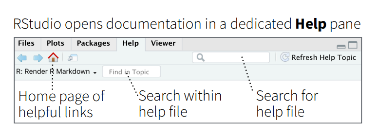
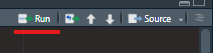

\mainmatter

# Gearing up {-}
```{r echo=FALSE, message=FALSE}
library(knitr)
```

## Download and installation
The R programming language for local computer can be downloaded from web portal of **The Comprehensive R Archive Network**,\index{CRAN} in short mostly referred to as **CRAN**,\index{CRAN} which is a network of ftp and web servers around the world that store identical, up-to-date, versions of code and documentation for R.  The portal address is [https://cran.r-project.org/](https://cran.r-project.org/) -

```{r cranportal, echo=FALSE, fig.cap="CRAN Portal", fig.show='hold', fig.align='center', out.width="60%"}
include_graphics("images/CRAN.png")
```

Download the specific (as per the operating system) file from the port and install it following the instructions.  The R programming interface looks like-

```{r workspace, echo=FALSE, fig.cap="R Workspace", fig.show='hold', fig.align='center', out.width="70%"}
include_graphics("images/workspace.png")
```

## Writing your first code
Writing code in R is pretty easy.  Just type the command in front of `>`, as shown in figure \@ref(fig:workspace) prompt and press `Enter(Return)` key.  R will display the results in next line.

```{r first, echo=FALSE, fig.cap="Left - Writing first Code in R; Right - Indenting code not necessary but recommended", out.width="49%", out.height= "49%", fig.show='hold', fig.align='center'}
knitr::include_graphics(c("images/first_code.png", "images/indent.png"))
```

## Things to remember

1. R is case sensitive.  This will have to be remembered while writing/storing/calling functions or other objects.  So `Anil`, `ANIL`, `anil` all are different objects in R.
2. White spaces between different pieces of codes don't matter.  See figure-\@ref(fig:first) above.  Both `3+4` and `3 + 4` will evaluate same.  However, for better readability it is always better to use spaces. 
3. Parenthesis `()` are generally used to change the natural order of precedence.  Moreover, these are also used in passing arguments to functions, which will be discussed in detail in chapter-\@ref(func) and onward.
4. Multi-line code(s) aren't required to be indented in R. In R, indents have no meaning.  However, following best practices to write a code that is understandable by readers, proper indentation is suggested. See figure-\@ref(fig:first) (right) above.
5. If an incomplete code is written in the first line of the code (useful when a single line is not sufficient to write complete code), R will automatically prompt as displaying `+` at the beginning of line, instead of a `>`.  See figure-\@ref(fig:first) (right) above.
6. Indices in R always start from 1 (and not from 0).  This has been discussed in detail in chapter-\@ref(subset).
7. Code that start with hash symbol `#` does not execute. Even in a line if `#` appears in between the line, the code from that place does not get executed.  See the following example.  Comments may be used in codes for either of the purposes -
    + Code Readability
    + Explanation of code
    + Inclusion of metadata, other references, etc.
    + Prevent execution of certain line of code
    

```{r}
# 1 + 3 (this won't be executed)
1 + 3 # +5
```

> Tip: to clear the workspace, just click `ctrl` + `l`.

Normally R code files have an extension `.R` but other R files may have other extensions, such as project files `.Rproj`, markdown files `.Rmd`, and many more.

All of the programming/code writing may be done in R.  But you may have noticed that code once executed cannot be edited.  The code has to written again (Tip: To get previous executed command just use scroll up key on keyboard). Thus, in order to use many other smart features, we will write our code as R scripts i.e. in `.R` files, using most popular IDE for R which is `R Studio`. 

> Rstudio IDE is so popular among those using R, that many people cannot distinguish between R and its IDE.  Even Stack Overflow which is a popular forum to seek online help explicitly asks users not to tag 'R studio' in general R code problems^[[https://stackoverflow.com/tags/rstudio/info](https://stackoverflow.com/tags/rstudio/info)].

## R studio IDE 
RStudio\index{Rstudio} is free and open source IDE (Integrated Development Environment) for R, which is available for Windows, Mac OS and LINUX. It can be downloaded from its portal [https://posit.co/download/rstudio-desktop/](https://posit.co/download/rstudio-desktop/). For our most of the data analytics needs, we require Rstudio desktop version, which is available for free to download and installation.

It includes a console, syntax-highlighting editor that supports direct code execution, and a variety of robust tools for plotting, viewing history, debugging and managing your work-space. After downloading and installing it the local machine, a work-space/UI similar to that shown in following figure, is opened.

```{r rstud, echo=FALSE, fig.cap="R Studio interface", fig.show='hold', fig.align='center', out.width="90%"}
include_graphics("images/rstudio.png")
```

There are four panels

- Top-left: 
    + **Scripts and Files:** The script files which we will be working on, will be opened and displayed here.  To open a new script, you just need to click the new script button  which is just below the _file menu._; or using keyboard shortcut `ctrl + shift + n`
- Bottom-left:
    + **R console:** is where the R commands can be written and see the output.  Even the commands run on script will show the output in this panel.

{#id .class width=447 height=157px}
    + **Terminal:** Here we can access our system shell.
- Top-right: 
    + **Environment:**  To see the objects saved in current environment.  This panel is also used to import data in current environment.
    + **History** To view the history of commands run, in the current session
    + **Connections:** Used to connect/import with external database/data
- Bottom-right: 
    + **Files** having tree of folders, to see the file structure of current working directory
    + **Plots** graph window, if the output of R command is a plot/graph, it will be generated here.
    
{#id .class width=771 height=293px}
    + **Packages**, to download and load the external packages using mouse click
    + **Help**, window to get help on desired functions.  Even the help sought through r command will be displayed in this window.

{#id .class width=774 height=282px}
    + **Viewer:** can be used to view local web content.

{#id .class width=752 height=272px}

Readers may note that to execute the code from a .R file is slightly different than to execute it from `console` where pressing `Enter/Return` key just executes it and gives us result in the next line.  To run the script from the `Scripts and Files` pane (Top-left) we can do either of the following - 

- Select the code and press `ctrl/command + Enter/Return` keys.
- If the cursor is anywhere between the code or even anywhere in the line(s) having the code/code-block, we can press `ctrl/command + Enter/Return` keys.
- Or alternatively, we can make use of `Run` button  given in top-right side of `Files and Scripts` pane.

{#id .class width=770 height=575px}


>To get a quick overview (and for later-on references) readers may refer to the [Rstudio cheatsheet](https://rstudio.github.io/cheatsheets/rstudio-ide.pdf) available from [Posit Cheatsheets page](https://posit.co/resources/cheatsheets/), wherein many other cheatsheets are also available.


## Packages and libraries and conflicts
As already stated, one of the strength of R is that numerous user-written packages (or _libraries_)\index{packages, external} \index{library} are available on __Comprehensive R Archive Network__ i.e. [CRAN](https://cran.r-project.org/)\index{CRAN}. Package installation is perhaps easiest of the jobs in R.

The command \index{install.packages() function} is fairly simple -
```
install.packages("library_name")
```
which downloads the given package name (to be given in quotes and is case-sensitive), compiles it and then load it into the specified/default directory.  This will however, not load into the memory/R current session.  The libraries/packages are to be downloaded only once in a computer/system but need to be loaded in each and every new session of R, using the command- \index{library()}
```
library(library_name)
```
Quotes here, are optional but package name is still case sensitive.  So to install and load `tidyverse` we need to run first command once (which will download the package into your local computer) but second command (to load it in the current R session) at every new session.
```
install.packages('tidyverse')
```
Rstudio pane `Packages` may also be used, as shown in the following image (taken from cheatsheet).

{#id .class width=507 height=327px}

```{r}
library(tidyverse)
```
Also notice the output of library command above.  Besides loading successfully, nine packages which we will discuss in section \@ref(TIDYVE), it has given a message about conflicts.

So what are these conflicts?  Actually when a function having exactly same name resides in multiple package a conflict arises, and R by default prefers the conflicted functions loaded in last.  Here, package `stats` which is part of base R also consists of a function `filter` which has been overridden by package `dplyr` loaded as part of `tidyverse`.  Thus, after loading `dplyr`, this function `filter` has been masked from `stats`.

In case we want to use `filter` from masked `stats` we may either

- call it using double colon operator (Refer section \@ref(doublec)), i.e. using `stats::filter()`; or
- make use of another package `conflicted` which is again part of tidyverse as follows-

```
library(conflicted)
conflict_prefer("filter", "stats")
```
>Usage of package `conflicted` is advised with a bit caution, as loading this package causes to restrict usage of conflicted function altogether i.e. without giving explicit preference.


### Double Colon operator `::` {#doublec}
In R, we can use double colon operator \index{double colon operator, ::} i.e. `::` to access functions that are defined as part of the internal functions that a package uses. These may be used in at least two cases-

1. To call a function say `filter` from package `dplyr` we may use `dplyr::filter()` without actually loading it.  
2. In cases of conflicts as discussed in preceding section, e.g. `stats::filter()`.


## Getting Help within R {#help}
Once R is installed, there is a comprehensive built-in help system. We can use any of the following commands-
```
help.start()   # general help
help(foo)      # help about function `foo`
?foo           # same as above
apropos("foo") # show all functions containing word `foo`
example(foo)   # show an example of function `foo`
```
Alternatively, features under the Help menu or help pane, can also be used.


## tidyverse {#TIDYVE}
The [tidyverse](https://www.tidyverse.org/) is a _package of packages_ that work in harmony because they share common data representations and 'API' design. This package is designed to make all these easy to install and load multiple 'tidyverse' packages in a single step.

Though `tidyverse`  is a collection 20+ packages (in fact 80+ packages will be installed including depended packages) which are all installed by `install.packages("tidyverse")` command, yet `library(tidyverse)` load [nine](https://www.tidyverse.org/packages/) of them.  Others (like `readxl`) will have to loaded explicitly.

1. [**ggplot2**](https://ggplot2.tidyverse.org/) is a system for decoratively creating graphics, based on [*The Grammar of Graphics*](https://link.springer.com/book/10.1007/0-387-28695-0). 
2. [**dplyr**](https://dplyr.tidyverse.org/) provides a grammar of data manipulation, providing a consistent set of verbs that solve the most common data manipulation challenges. 
3. [**tidyr**](https://tidyr.tidyverse.org/) provides a set of functions useful for data transformation. 
4. [**readr**](https://readr.tidyverse.org/) is used to read and write rectangular/tabular data formats. 
5. [**purrr**](https://purrr.tidyverse.org/) is functional programming (FP) toolkit for working with functions and vectors. 
6. [**tibble**](https://tibble.tidyverse.org/) provides functionalities related to displaying data frames. 
7. [**stringr**](https://stringr.tidyverse.org/) provides set of functions designed to work with strings.  It is built on top of another package [stringi](https://cran.r-project.org/package=stringi). 
8. [**forcats**](https://forcats.tidyverse.org/) provides a suite of useful tools that solve common problems with factors. 
9. [**lubridate**](https://lubridate.tidyverse.org/) makes it easier to do the things R does with date-times.

With latest version of Tidyverse, while loading it [**lubridate**](https://lubridate.tidyverse.org/) also loads with default.

```{r tidyverse, echo=FALSE, fig.cap="tidyverse", fig.show='hold', fig.align='center', out.width="70%"}
knitr::include_graphics('images/tidyverse.png')
```

There are several other `tidyverse` packages which we will be working with-

- `hms`
- `readxl`
- `glue`

