# Part-I: Basic R Programming Concepts {.unnumbered}

# R Programming Language

## Use R as a calculator {#calculator}
To start learning R, just start entering equations directly at the command prompt `>` and press enter. So, `3+4` will give you result `7`. Common mathematical operators are listed in table \@ref(tab:table3).\index{common mathematical operators}

Table: (#tab:table3) Common Mathematical Operators in R

```{r table3, echo=FALSE, message=FALSE, warnings=FALSE, results='asis'}
tabl1 <- "
| Operator/ function      | Meaning             | Example                    |
|:-------------:|:-----------------------------|:--------------------------------------------|
| `+` | Addition | `4 + 5` is `9` |
| `-` | Substraction | `4 - 5` is `-1` |
| `*` | Multiplication | `4 * 5` is `20` |
| `/` | Division | `4/5` is `0.8` |
| `^` | Exponent | `2^4` is `16` |
| `%%` | Modulus (Remainder from division) | `15 %% 12` is `3` |
| `%/%` | Integer Division | `15 %/% 12` is `1` |
"
cat(tabl1) 
```

Strings or Characters have to be enclosed in single `'` or double`"` quotes (more on strings in section \@ref(string)). So a few examples of calculations that can be performed in R could be-

```{r}
4 + 3 ^ 2
8 * (9 + 4)
```

> Note that R follows common mathematical order of precedence while evalauting expressions. That may be changed using simple parenthesis i.e. `()`. Also note that other brackets/braces i.e. curly braces `{}` and `[]` have been assigned different meaning, so to change nested order of operations only `()` may be used.

## Object Assignment
R is an object-oriented language.[@R-base] This means that *objects* \index{objects in R}are created and stored in R environment so that they can be used later.

So what is an object? An object can be something as simple as a number (value) that can be assigned to a variable. Think of it like this; Suppose we have greet each user by his/her name prefixing *hello* to his/her name. Now user's name may be saved in our work environment for later use. Thus, once the user name is saved in a variable then can be retrieved later on, by calling the variable name instead of asking the user name again and again. An object can be also be a data-set or complex model output or some function. Thus, an object created in R can hold multiple values.

The other important thing about objects is that objects are created in R, using the assignment operator\index{assignment operator} `<-`. Use of equals sign `=` to set something as an object is not recommended thought it will work properly in some cases. For now we will stick with the assignment operator, and interpret it as the left side is the object name that is storing the object information specified on the right side. *If `->` right hand side assignment is used, needless to say things mentioned above will interchange.*\index{right assignment operator}

```{r}
# user name
user_name <- 'Anil Goyal'

# when the above variable is called
user_name
```

> **Case sensitive nature:**\index{case sensitive nature} Names of variables even all objects in R are case sensitive, and thus `user`, `USER` and `useR`; all are different variables.

## Atomic data types in R
\index{atomic data types}We have seen that objects in R can be created to store some values/data. Even these objects can contain other objects as well. So a question arises, what is the most atomic/basic data type in R. By atomic we mean that the object cannot be split any further. Thus, the atomic objects created in R can be thought of variables holding one single value. E.g. user's name, user's age, etc. Now atomic objects created in R can be of six types-

-   logical (or Boolean i.e. TRUE FALSE etc.)
-   integer (having non-decimal numeric values like 0, 1, etc.)
-   double ( or floating decimal type i.e. having numeric values in decimal i.e. 1.0 or 5.25, etc.)
-   character (or string data type having some alphanumeric value)
-   complex (numbers having both real and imaginary parts e.g. 1+1i)
-   raw (not discussed here)

```{r datatypes, fig.cap="Data types in R", fig.show="hold", fig.align="center", echo=FALSE, out.height="60%"}
knitr::include_graphics("images/datatypes.png")
```

Let us discuss all of these.

>Note: We will use a pre-built function `typeof()` to check the type of given value/variable. However, functions as such will be discussed later-on.

### Logical
In R logical \index{logical data type}values are stored as either `TRUE` or `FALSE` (all in caps)

```{r}
TRUE
typeof(TRUE)

my_val <- TRUE
typeof(my_val)
```

**`NA`**: There is one special type of logical value i.e. `NA`\index{missing values in R} (short for *Not Available*)\index{NA in R}. This is used for missing data. 

>Remember missing data is not an empty string. The difference between the two is explained in section \@ref(string).

### Integer
Numeric \index{Numeric data types}values can either be integer\index{integer data type} (i.e. without a floating point decimal) or with a floating decimal value (called `double` in r)\index{double data type in R}. Now integers in R are differentiated by a suffix `L`\index{L suffix}. E.g.

```{r}
my_val1 <- 2L
typeof(my_val1)
typeof(2)
```

### Double

Numeric values with decimals are stored in objects of type `double`. It should be kept in mind that if storing an integer value directly to a variable, suffix `L` must be used otherwise the object will be stored as `double` type as shown in above example.

In double type, exponential formats or hexadecimal formats to store these numerals may also be used.

```{r}
my_val2 <- 2.5
my_val3 <- 1.23e4
my_val4 <- 0xcafe # hexadecimal format (prefixed by 0x)

typeof(my_val2)
typeof(my_val3)
typeof(my_val4)
```

> Note: Suffix `L` may also be used with numerals in hexadecimal (e.g. `0xcafeL`) or exponential formats (e.g. `1.23e4L`), which will coerce these numerals in `integer` format.

```{r}
typeof(0xcafeL)
```

Thus, both `integer` and `double` data types may be understood in R as having sub-types of `numeric` data. There are three other types of special numerals (specifically doubles) `Inf`\index{Inf data type}, `-Inf` and `NaN`\index{NaN data type}. The first two are infinity (positive and negative) and the last one denotes an indefinite number (`NaN` short for *Not a Number*).

```{r}
1/0
-45/0
0/0
```

### Character {#string}

Strings \index{characters in R}are\index{strings} stored in R as a character type. Strings should either be surrounded by single quotes `''` or double quotes `""`\index{quotes}[^02-basics-1].

[^02-basics-1]: Single and double quotes can be used interchangeably and won't have any difference in the objects created using any of these. Only thing that should be kept in mind is that the quote used to start the string must be used to close the string, otherwise an error may be thrown. However, this may be used to store objects with either type of string in the data itself.

```{r}
my_val5 <- 'Anil Goyal'
my_val6 <- "Anil Goyal"
my_val7 <- "" # empty string
my_missing_val <- NA # missing value

typeof(my_val5)
typeof(my_val6)
typeof(my_val7)
typeof(my_missing_val)
```

> [[Notes:\\\\](Notes:){.uri}](%5BNotes:\%5D(Notes:)%7B.uri%7D){.uri} 1. Though `NA` is basically of type logical yet it will be used to store missing values in any other data type also as shown in subsequent chapter(s). 2. Special characters are escaped with `\`; Type `?Quotes` in console and check documentation for full details. 3. A simple use of `\` escape character may be to use `"` or `'` within these quotes. Check Example-3 below.

Example-1: Usage of double and single quote interchangeably.

```{r}
my_val8 <- "R's book"
my_val8
```

Example-2: Usage of escape character.

```{r}
cat("This is first line.\nThis is new line")
```

Example-3: Usage of escape character to store single/double quotes as string themselves.

```{r}
cat("\' is single quote and \" is double quote")
```

**Note:** If absence of indices has been noticed in above code output, learn more about `cat` function [here](#cat).

### NULL

`NULL` (note: all caps) is a specific data type used to create an empty vector\index{NULL in R}\index{empty vector in R}. Even this `NULL` can be used as a vector in itself.

```{r}
typeof(NULL)
vec <- 1:5
vec
vec <- NULL
vec
```

### Complex

Complex numbers \index{complex numbers - data type}are made up of real and imaginary parts. As these will not be used in the data analysis tasks, it is not discussed in detail here.

```{r}
my_complex_no <- 1+1i
typeof(my_complex_no)
```

## Data structures/Object Types in R

Objects\index{data structures in R} in R can be either homogeneous or heterogeneous.

```{r datastr, fig.cap="Objects/Data structures in R, can either be homogeneous (left) or heterogeneous (right)", echo=FALSE, out.width="49%", out.height="49%", fig.show='hold', fig.align='center'}
knitr::include_graphics(c("images/homgeneous.jpg", "images/hetero.jpg"))
```

### Homogeneous objects {.unnumbered}

### Vectors {#vectors}

What is a vector? A vector is simply a collection of values/data of same type.\index{vectors in R}

```{r vecs, fig.cap="Vectors are homegeneous data structures in R", fig.show="hold", fig.align="center", echo=FALSE, out.width="99%"}

```

#### Simple vectors (Unnamed vectors)

Though, `Vector` is the most atomic data type used in R, yet it can hold multiple values (of same type) simultaneously. In fact vector is a collection of multiple values of same type. So why vector is atomic when it can hold multiple values? You may have noticed a `[1]` printed at the start of line of output whenever a variable was called/printed. This `[1]` actually is the index of that element. Thus, in R instead of having *scalar(s)* as most atomic type, we have *vector(s)* containing only one element. Whenever a vector is called all the values stored in it are displayed with its index at the start of each new line only.

Even processing of multiple values simultaneously, stored in a vector, to produce a desired output, is one of the most powerful strengths of R. The three variables shown in the figure below, all are vectors.

```{r exvecs, fig.cap="Examples of Vectors", fig.show="hold", fig.align="center", echo=FALSE, out.width="99%"}
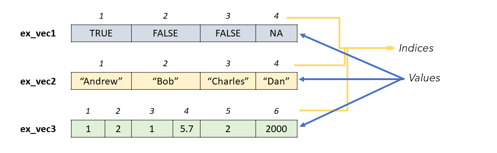
```

How to create a vector? Vectors in R are created using either -

-   `c()` function\index{c() function} which is shortest and most commonly used function in r. The elements are concatenated (and hence the shortcut `c` for this function) using a comma `,` ; *OR*
-   `vector()`\index{vector() function} produces vector of given `length` and `mode`.

```{r}
my_vector <- c(1, 2, 3)
my_vector

my_vector2 <- vector(mode = 'integer', length = 15)
my_vector2
```

Function `c()` can also be used to **join two or more vectors**\index{vector concatenation}.

```{r}
vec1 <- c(1, 2)
vec2 <- c(11, 12)
vec3 <- c(vec1, vec2)
vec3
```

```{r vecconcat, fig.cap="Vector Concatenation", fig.show="hold", fig.align="center", echo=FALSE, out.height="20%"}
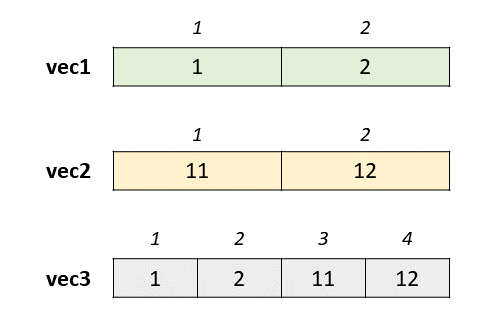
```

#### Useful Functions to create new vectors {.unnumbered}

There are some more useful functions to create new vectors in R, which we should discuss here as we will be using these vectors in subsequent chapters.

#### Generate integer sequences with Colon Operator `:` {.unnumbered}

This function generates a sequence from the number preceding `:` \index{colon operator}\index{: operator}to next specified number, in arithmetical difference of `1` or `-1` as the case may be. Notice that output vector type is of `integer`.

```{r}
1:25
25:30
10:1
typeof(2:250)
```

> Note: One of the common mistakes with colon operator is assuming its **operator precedence**. In R, colon operator has calculation precedence over any mathematical operator. Think of outputs you may get with these-

```         
n <- 5
1:n+1
1:n*2
```

#### Generate specific sequences with function `seq` {.unnumbered}

This function\index{seq() function} generates a sequence from a given number to another number, similar to `:`, but it gives us more control over the output desired. We can provide the difference specifically (`double` type also) in the `by` argument. Otherwise if `length.out` argument is provided it calculates the difference automatically.

```{r}
seq(1, 5, by = 0.3)
seq(1, 2, length.out = 11)
```

#### Repeat a pattern/vector with function `rep` {.unnumbered}

As the name suggests `rep`\index{rep() function} is short for *repeat* and thus it repeat a given element, a given number of times.

```{r}
rep('repeat this', 5)
# We can even repeat already created vectors
vec <- c(1, 10)
rep(vec, 5)
rep(vec, each = 5) # notice the difference in results
```

#### Generate english alphabet with `LETTERS` / `letters` {.unnumbered}

These are two inbuilt vectors in R having all 26 alphabets in upper and lower cases respectively.\index{LETTERS}\index{letters}

```{r}
LETTERS
letters
```

#### Generate gregorian calendar month names with `month.name` / `month.abb` {.unnumbered}

```{r}
month.name
month.abb
```

#### Named Vectors

Vectors in R, can be named also, i.e. where each of the element has a name.\index{named vectors} E.g.

```{r}
ages <- c(A = 10, B = 20, C = 15)
ages
```

```{r namedvec, fig.cap="Vector elements can have names", fig.show="hold", fig.align="center", echo=FALSE, out.width="60%"}
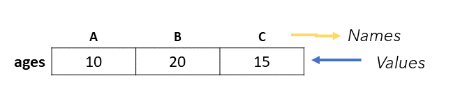
```

**Note** here that while assigning names to each element, the names are not enclosed in quotes similar to variable assignment. Also notice that this time R has not printed the numeric indices/index of first element (on each new line). There are other ways to assign names to an existing vector. We can use `names()` function\index{names() function}, which displays the names of all elements in that vector ( *and this time in quotes as these are displayed in a vector*).

```{r}
names(ages)
```

Using this function we can assign names to existing vector. See

```{r}
vec1
names(vec1) <- c('first_element', 'second_element')
vec1
```

Names may also be assigned using `setNames()`\index{setNames() function} while creating the vector simultaneously.

```{r}
new_vec <- setNames(1:26, LETTERS)
new_vec
```

Function `unname()`\index{unname() function} may be used to remove all names. Even all the names can be removed by assigning `NULL` to `names` of that vector. Also remember that `unname` does not modify vector in place. To have this change we will have to assigned unnamed vector to that vector again. Check this,

```{r}
unname(new_vec)
new_vec
new_vec <- unname(new_vec)
new_vec
```

#### Type coercion {.unnumbered}

There are occasions\index{type coercion} when different classes of R objects get mixed together. Sometimes this happens by accident but it can also happen on purpose. Let us deal with each of these.

But prior to this let us learn how to check the type of a vector. Of course we can check the type of any vector using function `typeof()` but what if we want to check whether any vector is of a specific type. So there are `is.*()`\index{is.*() functions} functions to check this, and all these functions return either `TRUE` or `FALSE`.

-   `is.logical()`\index{is.logical() function}
-   `is.integer()`\index{is.integer() function}
-   `is.double()`\index{is.double() function}
-   `is.character()`\index{is.character() function}
-   `is.complex()`\index{is.complex() function}

```{r}
is.integer(1:10)
is.logical(LETTERS)
```

#### Implicit Coercion {.unnumbered}
As already stated\index{implicit coercion}, vector is the most atomic data object in R. Even all the elements of a vector (having multiple elements) are vectors in themselves. We have also discussed that vectors are homogeneous in types. So what happens when we try to mix elements of different types in a vector.

In fact when we try to mix elements of different types in a vector, the resultant vector is coerced to the type which is most feasible. Since a numeral say `56` can easily be converted into a complex number (`56+0i`) or character (`"56"`), but alphabet say `A`, cannot be converted into a numeral, the atomic data types normally follow the order of precedence, tabulated in table \@ref(tab:rank).

| Rank |   Type    |
|:----:|:---------:|
|  1   | Character |
|  2   |  Complex  |
|  3   |  Double   |
|  4   |  Integer  |
|  5   |  Logical  |

: (#tab:rank) Order of Precedence for Atomic Data Types

For e.g. in the following diagram, notice all individual elements in first vector. Out of the types of all elements therein, character type is having highest rank and thus resultant vector will be silently coerced to a character vector. Similarly, second and third vectors are coerced to `double` (second element) and `integer` (first element) respectively.

```{r impcoer, fig.cap="Implicit Coercion of Vectors", fig.show="hold", fig.align="center", echo=FALSE, out.width="99%"}
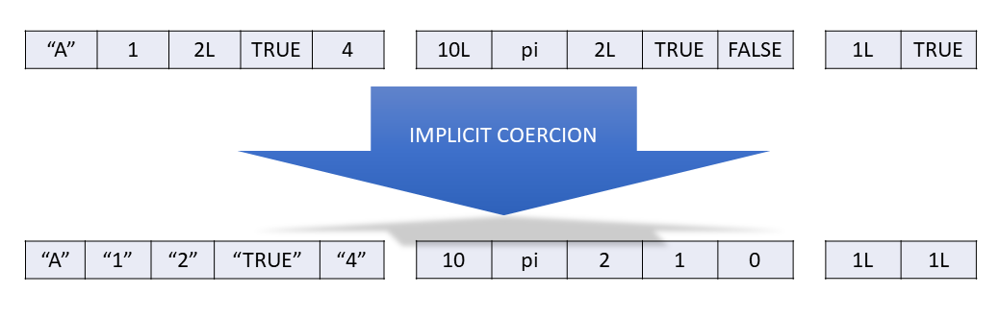
```

It is also important to note here that this implicit coercion is without any warning and is silently performed. This implicit coercion is also carried out when two (or more) vectors having different data types are concatenated together.

Example- `vec` is an existing vector of type `integer`. When we try to add an extra element say of `character` type, `vec` type is coerced to `character`.

```{r}
vec <- 1:5
typeof(vec)
vec <- append(vec, 'ABCD')
typeof(vec)
```

R also implicitly coerces vectors to appropriate type when we try to perform calculations on vectors of other types. Example

```{r}
(TRUE == FALSE) + 1
typeof(TRUE + 1:100)
typeof(FALSE + 56)
```

#### Explicit Coercion {.unnumbered}
We can explicitly coerce\index{explicit coercion} by using an `as.*()` function, like `as.logical()`, `as.integer()`, `as.double()`, or `as.character()`. **Failed coercion of strings generates a warning and a missing value:**

```{r}
as.double(c(TRUE, FALSE))
as.integer(c(1, 'one', 1L))
```

#### Coercion precedence
Sometimes, inside R both coercion happen at same time. So which one to precede other? Actually, implicit coercion will precede explicit coercion always. Consider this example. However, without seeing the result try to guess the output.

```{r}
as.logical(c('TRUE', 1))
```

Explanation: the vector `c('TRUE', 1)` coerces to `c('TRUE', '1')` due to implicit coercion first and thereafter explicit coercion forces second element `as.logical('1')` to `NA`. Though `as.logical(1)` would have resulted into `TRUE` but `as.logical("1")` would result into `NA`.

#### Checking dimensions {.unnumbered}
Now a vector can have `n` number of vectors (recall that each element is a vector in itself) and at times we may need to check how many elements a given vector contains. Using function `length()`, we can check the number of elements.

```{r}
length(1:100)
length(LETTERS)
length('LENGTH') # If you thought its output should have been 6, check again.
```

### Matrix (Matrices)
Matrix (or plural matrices) is a two dimensional arrangement (similar to a matrix in linear algebra and hence its name) of elements of again same type as in vectors. E.g.

$$\begin{array}{ccc}
x_{11} & x_{12} & x_{13}\\
x_{21} & x_{22} & x_{23}
\end{array}$$

Thus, matrices are vectors with an attribute named *dimension*.

> The dimension attribute is itself an integer vector of length 2 (number of rows, number of columns).

#### Create a new matrix {.unnumbered}
A new matrix can be created using function `matrix()` where a vector is given which is to be converted into a matrix and either number of rows `nrow` or number of columns `ncol` may be given.

```{r}
matrix(1:12, nrow = 3)
matrix(1:12, ncol=3)
```

Another useful argument is `byrow` \index{byrow argument in matrix function}which by default is `FALSE`. So if it is explicitly changed, we get

```{r}
matrix(1:12, ncol=3, byrow = TRUE)
```

```{r byrow, fig.cap="Arrangement of Matrix, if byrow argument is used", fig.show="hold", fig.align="center", echo=FALSE, out.width="60%"}
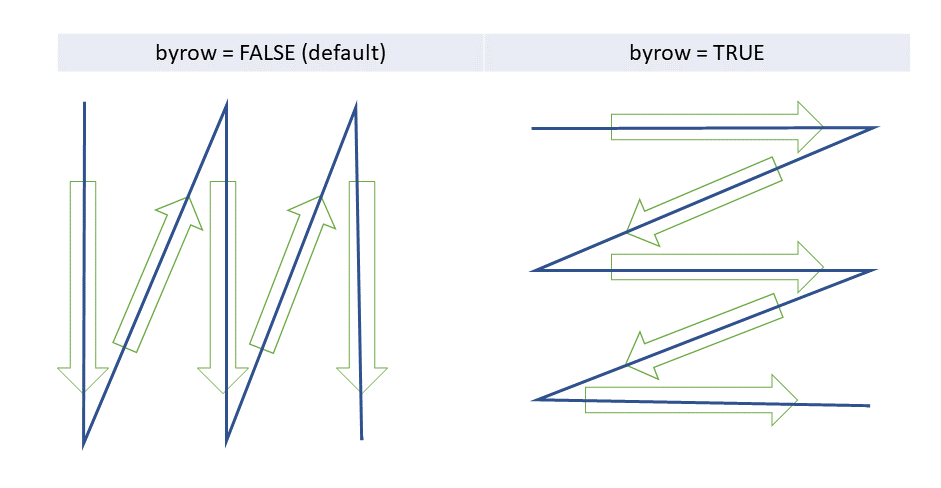
```

Matrix can be of any type. But rules of explicit and implicit coercion (as explained in vectors) also apply here.

```{r}
matrix(LETTERS, nrow = 2)
matrix(c(LETTERS, 1:4), nrow=5)
```

#### Names in matrices {.unnumbered}
Similar to vectors, rows or columns or both in matrices may have names\index{named matrix}. Check `?matrix()` for complete documentation.

#### Dimension {.unnumbered}
To check dimension of a matrix\index{dimensions of matrix} we can use `dim()`\index{dim function} (short for dimension) (similar to `length` in case of vectors) which will return a vector with two numbers (rows first, followed by columns).

```{r}
my_mat <- matrix(c(LETTERS, 1:4), nrow=5)
dim(my_mat)
```

This gives us another method to create matrix from a vector. See

```{r}
my_mat2 <- 1:10
dim(my_mat2) <- c(2,5)
my_mat2
```

#### Have a check on replication {.unnumbered}
What happens when product of given dimensions is less than or greater than given vector to be converted. It replicates but it is advised to check these properly as resultant vector may not be as desired. Check these cases, and notice when R gives result silently and when with a warning.

```{r}
matrix(1:10, nrow=5, ncol=5)
matrix(1:1000, nrow=2, ncol=3)
```

#### Combining matrices {.unnumbered}
Using `cbind()` or `rbind()` we can combine two matrices column-wise or row-wise respectively.

```{r bind, fig.cap="Binding of Two or more matrices together", fig.show="hold", fig.align="center", echo=FALSE, out.height="60%"}
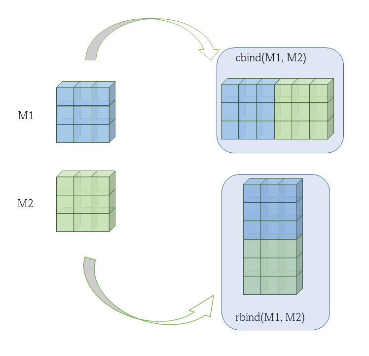
```

See these two examples.

```{r}
mat1 <- matrix(1:4, nrow = 2)
mat2 <- matrix(5:8, nrow = 2)
cbind(mat1, mat2)
```

Example-2

```{r}
rbind(mat1, mat2)
```

### Arrays
Till now we have seen that elements in one dimension are represented as vectors and in two dimension as matrices. So a question arises here, how many dimensions we can have. Actually we can have n number of dimensions in r, in object type `array`, but they'll become increasingly difficult to comprehend and are not thus discussed here. Check these however for your understanding,

```{r}
array(1:24, dim = c(3,2,4)) # a three dimensional array
```

Try creating 4 or 5 dimensional arrays in your console and see the results.

Further properties of vectors, matrices will be discussed in next chapter on sub-setting and indexing where we will learn how to retrieve specific elements of vector/matrices/etc. But till now we have created objects which have elements of same type. What if we want to have different types of elements/data retaining their types, together in a single variable? Answer is in next section, where we will discuss hetergeneous objects.

### Heterogeneous objects {.unnumbered}

### Lists
So lists are used when we want to combine elements of different types together. Function used to create a list is `list()`. Check this

```{r}
list(1, 2, 3, 'My string', TRUE)
```

Pictorially this list can be depicted as

```{r exlist, fig.cap="A list in R is a heterogeneous object", fig.show="hold", fig.align="center", echo=FALSE, out.width="99%"}
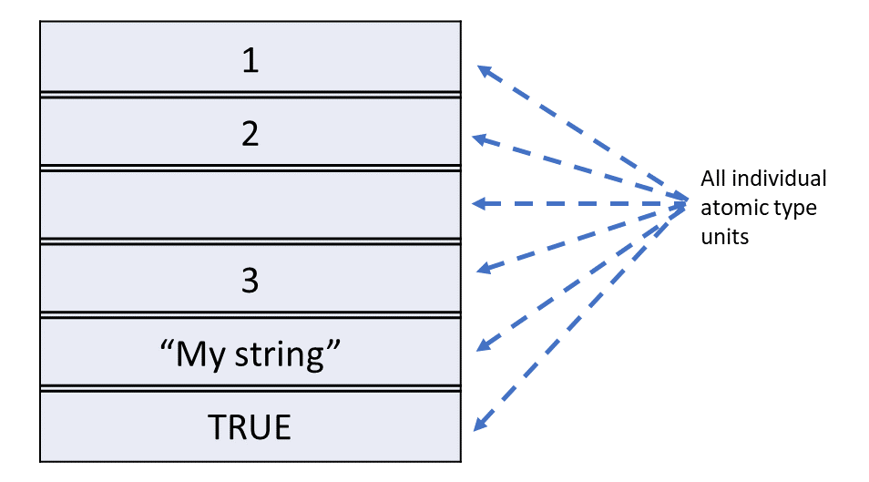
```

Interestingly list can contain vectors, matrices, arrays as individual elements. See

```{r}
list(1:3, LETTERS, TRUE, my_mat2)
```

```{r exlist2, fig.cap="A list in R, can contain vector, matrices, array or even lists", fig.show="hold", fig.align="center", echo=FALSE, out.width="99%"}
knitr::include_graphics("images/list_ex2.png")
```

Similar to vectors these elements can be named also.

```{r}
list(first_item = 1:5, second_item = my_mat2)
```

OR

```{r}
my_list <- list(first=c(A=1, B=2, C=3),second=my_mat2)
my_list
```

```{r namedlist, fig.cap="Similar to vector elements, the elements in list can be named also", fig.show="hold", fig.align="center", echo=FALSE, out.width="99%"}
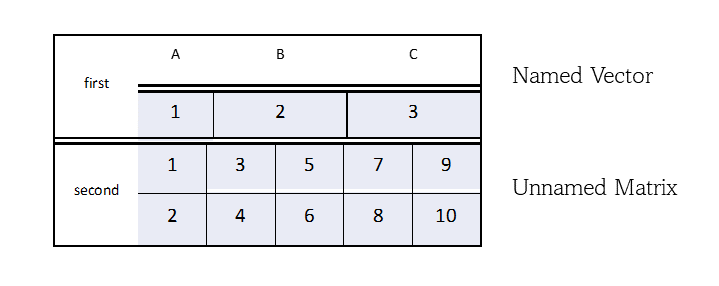
```

OR 

More interestingly, lists can even contain another lists.

```{r}
my_list2 <- list(my_list, new_item = LETTERS)
my_list2
```

Number of items at first level can be checked using `length` as in vectors. Checking number of items in second level onward will be covered in subsequent chapter(s).

```{r}
length(my_list)
length(my_list2) # If you thought its output should have been 3, think again.
```

### Data Frame

Data frames are used to store tabular data (or rectangular) in R. They are an important type of object in R.

```{r dframe, fig.cap="An example data frame", fig.show="hold", fig.align="center", echo=FALSE, out.width="99%"}
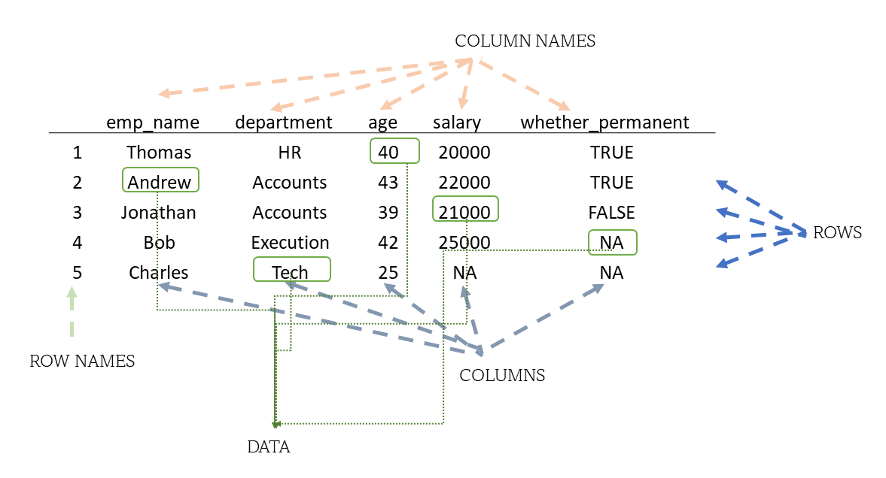
```

Data frames are represented as a special type of list where every element of the list has to have the same length. Each element of the list can be thought of as a column and the length of each element of the list is the number of rows.

```{r listvsdf, fig.cap="A data frame in R, is just a special kind of list", fig.show="hold", fig.align="center", echo=FALSE, out.width="99%"}
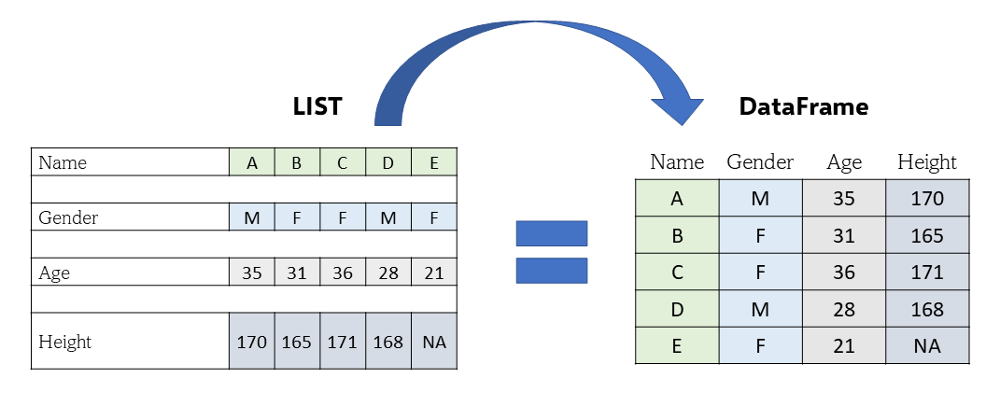
```

Unlike matrices, data frames can store different classes of objects in each column. (Remember that matrices must have every element be the same class).

To create a data frame from scratch we will use function `data.frame()`. See

```{r}
my_df <- data.frame(emp_name = c('Thomas', 'Andrew', 'Jonathan', 'Bob', 'Charles'),
                    department = c('HR', 'Accounts', 'Accounts', 'Execution', 'Tech'),
                    age = c(40, 43, 39, 42, 25),
                    salary = c(20000, 22000, 21000, 25000, NA),
                    whether_permanent = c(TRUE, TRUE, FALSE, NA, NA))
my_df
```

**Note** that R, on its own, has allocated row names that are numbers to each of the row on its own.

Of course at most of the times we will have data frames ready for us to analyse and thus we will learn to import/read external data in r, in subsequent chapters. To check dimensions of a data frame use `dim` as in matrix.

```{r}
dim(my_df)
```

Thus, the object types in R, can be depicted as in adjoining figure.

```{r impdstr, fig.cap="Most important Data structures, in R", fig.show="hold", fig.align="center", echo=FALSE, out.width="99%"}
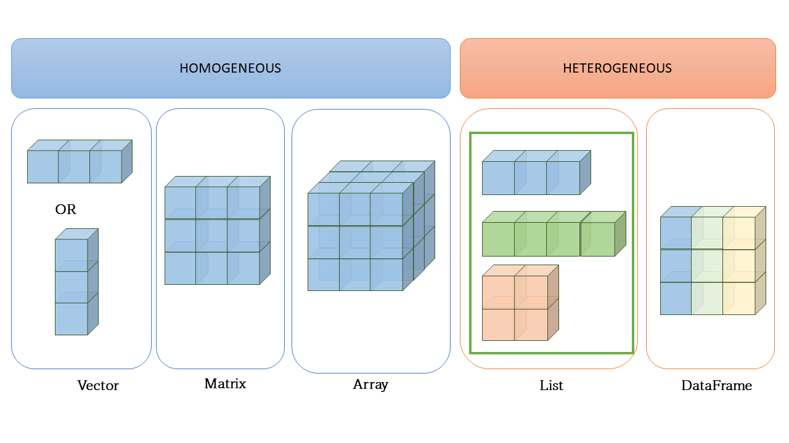
```

## Other Data types
Of course, there are other data types in R of which three are particularly useful `factor`, `date` and `date-time`. These types are actually built over the base atomic types, `integer`, `double` and `double` respectively and that's why these are being discussed separately. These types are built as `S3 objects` in R, and users may also define their own data types in `object oriented programming`. **OOP** being concept of core programming concepts and therefore are out of the scope here.

However, to understand the S3 objects better, we have to understand that atomic objects (for the sake of simplicity consider only vectors) can have attributes. 

**Example** One of the attributes that each vector has is `names`, which for unnamed vector is empty (NULL). Attributes of any object can be viewed/called from function `attributes()`.

```{r}
# Let us create a vector
vec <- 1:26
# Convert this to a named vector using function setNames()
# This function takes first argument as vector
# Second argument should be a character vector of equal length.
vec <- setNames(vec, LETTERS)
# let's check what are the attributes of `vec`
attributes(vec)
```
Using `attr()` we may assign any new attribute to any R object/variable.

```{r}
# Let's also assign a new attribute say `x` having value "New Attribute" to `vec`
attr(vec, "x") <- "New Attribute"
# Now let's check its attributes again
attributes(vec)
```
We can see, in above example, how a new attribute has been added to a vector.  It should have been clear by now that apart from `names`, other `attributes` may also be assigned to a vector.

### Factors

A factor is a vector that can contain only predefined values. It is used to store categorical data. Factors are built on top of an integer vector with two attributes: a *class*, 'factor', which makes it behave differently from regular integer vectors, and *levels*, which defines the set of allowed values. To create factors we will use function `factor`.

```{r}
fac <- factor(c('a', 'b', 'c', 'a'))
fac
typeof(fac) # notice its output
attributes(fac)
```

So if `typeof` of a factor is returning integer, how will we check its type? We may use `class` or `is.factor` in this case.

```{r}
class(fac)
is.factor(fac)
```

Now a factor can be ordered also. We may use its argument `ordered = TRUE` along with another argument `levels`.

```{r}
my_degrees <- c("PG", "PG", "Doctorate", "UG", "PG")
my_factor <- factor(my_degrees, levels = c('UG', 'PG', 'Doctorate'), ordered = TRUE)
my_factor # notice output here
is.ordered(my_factor)
```

Another argument `labels` can also be used to display the labels, which may be different from levels.

```{r}
my_factor <- factor(my_degrees, levels = c('UG', 'PG', 'Doctorate'), 
                    labels = c("Under-Graduate", "Post Graduate", "Ph.D"),
                    ordered = TRUE)
my_factor # notice output here
is.factor(c(my_factor, "UG"))
```

Attribute `levels` can be used as a function to retrieve/modify these.

```{r}
levels(my_factor)
levels(my_factor) <- c("Grad", "Masters", "Doctorate")
my_factor
```

Remember that while factors look like (and often behave like) character vectors, they are built on top of integers. Try to think of output of this `is.factor(c(my_factor, "UG"))` before running it in your console.

### Date

Date vectors are built on top of double vectors. They have class "Date" and no other attributes. A common way to create `date` vectors in R, is converting a character string to date using `as.Date()` (see case carefully),

```{r}
my_date <- as.Date("1970-01-31")
my_date
attributes(my_date)
```

Do check other arguments of as.Date by running `?as.Date()` in your console. To check whether a given variable is of type Date in r, there is no function like `is.Date` in base r, so we may use `inherits()` in this case.

```{r}
inherits(my_date, 'Date')
```

### Date-time (`POSIXct`)
Times are represented by the `POSIXct` or the `POSIXlt` class.

-   POSIXct is just a very large integer under the hood. It use a useful class when you want to store times in something like a data frame.
-   POSIXlt is a list underneath and it stores a bunch of other useful information like the day of the week, day of the year, month, day of the month.

```{r}
my_time <- Sys.time()
my_time
class(my_time)
my_time2 <- as.POSIXlt(my_time)
class(my_time2)
names(unclass(my_time2))
```

### Duration (`difftime`)

Duration, which represent the amount of time between pairs of dates or date-times, are stored in `difftimes`. `Difftimes` are built on top of doubles, and have a units attribute that determines how the integer should be interpreted.

```{r}
two_days <- as.difftime(2, units = 'days')
two_days
```

These over the top, data types will be discussed in more detail in subsequent chapters.
