```{r}
#| include: false
source("_common.R")
```


# Objects, Data Types and Data Structures {#sec-basics}

In this chapter we learn the building blocks of R. How to calculate, how to store values in *objects*, the basic types of data, and the structures which hold them, from a single number to a full table. These may look elementary, but many errors in audit analysis come from exactly here. A column of amounts read as text, an account number that has lost its leading zero, or a total that silently became `NA`. We will point these out as we go.

## Use R as a calculator {#sec-calculator}
To start learning R, type a calculation at the command prompt `>` and press `Enter`. So, `3+4` gives the result `7`. Common mathematical operators are listed in @tbl-table3.\index{common mathematical operators}

Table: Common Mathematical Operators in R {#tbl-table3}

```{r tbl-table3, echo=FALSE, message=FALSE, warning=FALSE, results='asis'}
tabl1 <- "
| Operator/ function      | Meaning             | Example                    |
|:-------------:|:-----------------------------|:--------------------------------------------|
| `+` | Addition | `4 + 5` is `9` |
| `-` | Subtraction | `4 - 5` is `-1` |
| `*` | Multiplication | `4 * 5` is `20` |
| `/` | Division | `4/5` is `0.8` |
| `^` | Exponent | `2^4` is `16` |
| `%%` | Modulus (Remainder from division) | `15 %% 12` is `3` |
| `%/%` | Integer Division | `15 %/% 12` is `1` |
"
cat(tabl1)
```

A few examples of calculations in R are

```{r}
4 + 3 ^ 2
8 * (9 + 4)
```

::: callout-note
R follows the usual mathematical order of precedence while evaluating expressions. It can be changed with parentheses `()`. Curly braces `{}` and square brackets `[]` have other meanings in R, so only `()` may be used to change the order of operations, even when nested.
:::

## Object Assignment
R is an object-oriented language.[@R-base] This means that *objects* \index{objects in R} are created and stored in the R environment, so that they can be used later.

So what is an object? It can be as simple as a single number stored under a name. Suppose we have to greet each user by name, prefixing *hello* to it. Once the user's name is stored in an object, we can use it again and again by calling the object's name, instead of asking for the name every time. An object can also be a whole data set, the output of a model, or a function. So an object in R can hold many values.

Objects are created with the assignment operator\index{assignment operator} `<-`. Read it as "the name on the left gets the value on the right". The equals sign `=` also works in most cases, but `<-` is the convention in R, and we will use it throughout. The arrow can point the other way too, `value -> name`, though this is rarely used.\index{right assignment operator} The keyboard shortcut for `<-` in RStudio is `Alt` + `-`.

```{r}
# user name
user_name <- 'Anil Goyal'

# when the above variable is called
user_name
```

::: callout-note
## Case sensitive nature
\index{case sensitive nature}Names of all objects in R are case sensitive, so `user`, `USER` and `useR` are three different objects.
:::

Names may contain letters, numbers, `.` and `_`, but must start with a letter (or a dot not followed by a number). Spaces are not allowed. A good habit is to use lower case words joined by underscores, like `vendor_master` or `bills_2024_25`, which says what the object holds.

## Atomic data types in R
\index{atomic data types}We have seen that objects store values, and objects can even contain other objects. So what are the most basic, or *atomic*, types of data in R, which cannot be split any further? Think of a single value, like a user's name or age. Such a value can be of six types.

-   logical (or Boolean, `TRUE` or `FALSE`)
-   integer (whole numbers, like 0 or 1)
-   double (numbers with decimals, like 1.0 or 5.25)
-   character (text, or *strings*)
-   complex (numbers having both real and imaginary parts e.g. 1+1i)
-   raw (not discussed here)

```{r fig-datatypes, fig.cap="Data types in R", fig.show="hold", fig.align="center", echo=FALSE, out.height="60%"}
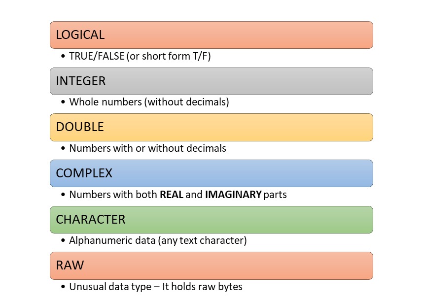
```

Let us discuss all of these.

::: callout-note
We will use a pre-built function `typeof()` to check the type of given value/variable. However, functions as such will be discussed later-on.
:::

### Logical
In R, logical \index{logical data type} values are either `TRUE` or `FALSE` (all in capitals). They are the result of every comparison, like `amount > 50000`, and so they are at the heart of every audit test which picks out exceptions.

```{r}
TRUE
typeof(TRUE)

my_val <- TRUE
typeof(my_val)
```

**`NA`**: There is one special logical value, `NA`\index{missing values in R} (short for *Not Available*)\index{NA in R}. It is used for missing data. Any calculation with a missing value gives a missing result, because R cannot know the answer. Most summary functions have an argument `na.rm = TRUE` to leave out the missing values.

```{r}
NA + 100
sum(c(5000, NA, 2500))
sum(c(5000, NA, 2500), na.rm = TRUE)
```

::: callout-note
Remember, missing data is not an empty string. The difference between the two is explained in @sec-string.
:::

::: callout-caution
A total which comes out as `NA` is a warning sign, not a nuisance to be silenced with `na.rm = TRUE`. Find out first *which* values are missing and why. A bill without an amount may itself be an audit finding.
:::

### Integer
Numeric \index{Numeric data types} values can either be integers\index{integer data type}, without a decimal part, or numbers with decimals, called `double` in R\index{double data type in R}. Integers are written with a suffix `L`\index{L suffix}. For example,

```{r}
my_val1 <- 2L
typeof(my_val1)
typeof(2)
```

### Double

Numbers with decimals are stored as type `double`. Keep in mind that a whole number typed without the suffix `L` is also stored as `double`, as the example above showed. In practice this rarely matters, because R converts between the two as needed.

Doubles can also be written in exponential (scientific) or hexadecimal form.

```{r}
my_val2 <- 2.5
my_val3 <- 1.23e4
my_val4 <- 0xcafe # hexadecimal format (prefixed by 0x)

typeof(my_val2)
typeof(my_val3)
typeof(my_val4)
```

::: callout-note
Suffix `L` may also be used with numerals in hexadecimal (e.g. `0xcafeL`) or exponential form (e.g. `1.23e4L`), which makes them `integer`.
:::

```{r}
typeof(0xcafeL)
```

So `integer` and `double` may be thought of as two sub-types of `numeric` data. There are three special doubles, `Inf`\index{Inf data type}, `-Inf` and `NaN`\index{NaN data type}. The first two are positive and negative infinity, and the last stands for an indefinite result (`NaN` is short for *Not a Number*).

```{r}
1/0
-45/0
0/0
```

In audit data these usually appear when a ratio is computed with a zero in the denominator, like expenditure per beneficiary for a scheme with no beneficiaries. They should be looked at, not averaged.

**Decimals are not always exact.** Computers store doubles in binary, and many decimal fractions, like `0.1`, cannot be stored exactly. The tiny differences are invisible when printed, but they can make a comparison fail.

```{r}
0.1 + 0.2 == 0.3
isTRUE(all.equal(0.1 + 0.2, 0.3))
round(0.1 + 0.2, 2) == 0.3
```

::: callout-caution
When matching amounts, say a bill total against the sum of its items, do not compare computed decimals with `==`. Round both to paise with `round(x, 2)`, or allow a small tolerance, like `abs(x - y) < 0.005`. Otherwise genuine matches may be reported as mismatches.
:::

**Large numbers and identifiers.** Integers in R are limited to about 2.1 billion (`.Machine$integer.max` is `r .Machine$integer.max`). Doubles can hold much bigger numbers, but are exact only up to about 9 thousand million million ($2^{53}$). A 16-digit number, like a card number, may be beyond that, and then gets changed silently.

```{r}
card <- as.numeric("9876543210987657")
sprintf("%.0f", card)
```

The last digit has changed from 7 to 6, without any warning.

::: callout-tip
## Audit tip

Keep identifiers, like account numbers, Aadhaar, PAN, mobile numbers, PIN codes and card numbers, as *character*, never as numbers. As numbers they lose leading zeros (`"001234"` becomes `1234`), and long ones may change, as we just saw. We never do arithmetic on them anyway. When reading files, we will see how to tell R to read such columns as text.
:::

### Character {#sec-string}

Strings (text) \index{characters in R}are\index{strings} stored in R as type character. They are enclosed in single quotes `''` or double quotes `""`\index{quotes}[^02-basics-1].

[^02-basics-1]: Single and double quotes can be used interchangeably, and make no difference to the object created. The only thing to remember is that a string must be closed with the same quote it was opened with. This also lets us put one kind of quote inside a string enclosed by the other, as in Example-1 below.

```{r}
my_val5 <- 'Anil Goyal'
my_val6 <- "Anil Goyal"
my_val7 <- "" # empty string
my_missing_val <- NA # missing value

typeof(my_val5)
typeof(my_val6)
typeof(my_val7)
typeof(my_missing_val)
```

::: callout-note
1. Though `NA` is of type logical, it is used to store missing values in every other type too, as we will see in later chapters.
2. Special characters are *escaped* with a backslash `\`, like `\n` for a new line. Type `?Quotes` in the console for the full list.
3. A simple use of the escape character is to put `"` or `'` inside a string. See Example-3 below.
:::

Example-1: Usage of double and single quote interchangeably.

```{r}
my_val8 <- "R's book"
my_val8
```

Example-2: Usage of escape character.

```{r}
cat("This is first line.\nThis is new line")
```

Example-3: Usage of escape character to store single/double quotes as string themselves.

```{r}
cat("\' is single quote and \" is double quote")
```

**Note:** If you noticed that the output above has no `[1]` at the start, learn more about the `cat()` function in @sec-cat.

### NULL

`NULL` (all capitals) stands for *nothing*, an empty object\index{NULL in R}\index{empty vector in R}. Assigning `NULL` to an object empties it. Unlike `NA`, which is a missing value that takes up a place, `NULL` has length zero.

```{r}
typeof(NULL)
vec <- 1:5
vec
vec <- NULL
vec
```

### Complex

Complex numbers \index{complex numbers - data type} have real and imaginary parts. As we will not use them in data analysis, we do not discuss them further.

```{r}
my_complex_no <- 1+1i
typeof(my_complex_no)
```

## Data structures/Object Types in R

Objects\index{data structures in R} in R can be either homogeneous or heterogeneous.

```{r fig-datastr, fig.cap="Objects/Data structures in R, can either be homogeneous (left) or heterogeneous (right)", echo=FALSE, out.width="49%", out.height="49%", fig.show='hold', fig.align='center'}
knitr::include_graphics(c("images/homgeneous.jpg", "images/hetero.jpg"))
```

### Homogeneous objects {.unnumbered}

### Vectors {#sec-vectors}

What is a vector? A vector is simply a collection of values of the same type.\index{vectors in R}

```{r fig-vecs, fig.cap="Vectors are homegeneous data structures in R", fig.show="hold", fig.align="center", echo=FALSE, out.width="99%"}

```

#### Simple vectors (Unnamed vectors)

The vector is the most basic structure in R, yet it can hold many values of the same type at once. You may have noticed a `[1]` at the start of every output so far. It is the position (index) of the first value printed on that line. In R there are no single values, or *scalars*, as such. A single value is just a vector of length one. When a long vector is printed, each new line starts with the index of its first value.

Working on all the values of a vector at once, without writing loops, is one of the great strengths of R. To add 18% GST to a thousand bill amounts, we simply write `amounts * 1.18`. The three objects shown in the figure below are all vectors.

```{r fig-exvecs, fig.cap="Examples of Vectors", fig.show="hold", fig.align="center", echo=FALSE, out.width="99%"}
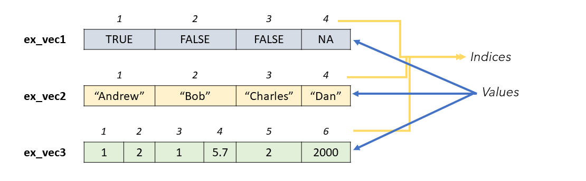
```

How do we create a vector? With either

-   the function `c()`\index{c() function}, the shortest and most commonly used function in R. It *combines* the values given to it, separated by commas; or
-   the function `vector()`\index{vector() function}, which creates an empty vector of a given `mode` and `length`, to be filled later.

```{r}
my_vector <- c(1, 2, 3)
my_vector

my_vector2 <- vector(mode = 'integer', length = 15)
my_vector2
```

Function `c()` can also be used to **join two or more vectors**\index{vector concatenation}.

```{r}
vec1 <- c(1, 2)
vec2 <- c(11, 12)
vec3 <- c(vec1, vec2)
vec3
```

```{r fig-vecconcat, fig.cap="Vector Concatenation", fig.show="hold", fig.align="center", echo=FALSE, out.height="20%"}
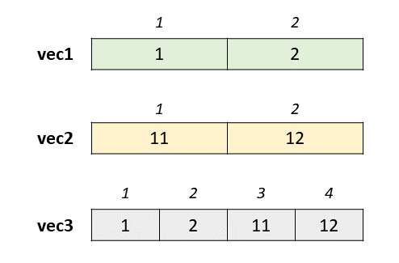
```

#### Useful Functions to create new vectors {.unnumbered}

Some more functions create vectors, which we will use in later chapters.

#### Generate integer sequences with Colon Operator `:` {.unnumbered}

The colon operator generates a sequence from the number before `:` \index{colon operator}\index{: operator} to the number after it, in steps of `1` or `-1`, as the case may be. Notice that the result is of type `integer`.

```{r}
1:25
25:30
10:1
typeof(2:250)
```

::: callout-warning
## Caution
A common mistake with the colon operator is about its **precedence**. In R, `:` is evaluated *before* `+`, `-`, `*` and `/` (though after `^`). So `1:n+1` means `(1:n) + 1`, and not `1:(n+1)`. Guess the outputs before running these.
:::

```{r}
n <- 5
1:n+1
1:(n+1)
1:n*2
```

#### Generate specific sequences with function `seq` {.unnumbered}

The function `seq()`\index{seq() function} generates a sequence like `:`, but with more control. The step can be given in the argument `by`, and may be a decimal. Or the number of values wanted can be given in `length.out`, and R works out the step.

```{r}
seq(1, 5, by = 0.3)
seq(1, 2, length.out = 11)
```

#### Repeat a pattern/vector with function `rep` {.unnumbered}

As the name suggests, `rep()`\index{rep() function} is short for *repeat*. It repeats a value, or a vector, a given number of times.

```{r}
rep('repeat this', 5)
# We can even repeat already created vectors
vec <- c(1, 10)
rep(vec, 5)
rep(vec, each = 5) # notice the difference in results
```

#### Generate English alphabet with `LETTERS` / `letters` {.unnumbered}

These are two built-in vectors with the 26 letters of the English alphabet, in upper and lower case respectively.\index{LETTERS}\index{letters}

```{r}
LETTERS
letters
```

#### Generate Gregorian calendar month names with `month.name` / `month.abb` {.unnumbered}

```{r}
month.name
month.abb
```

#### Named Vectors

The elements of a vector can have names.\index{named vectors} For example,

```{r}
ages <- c(A = 10, B = 20, C = 15)
ages
```

```{r fig-namedvec, fig.cap="Vector elements can have names", fig.show="hold", fig.align="center", echo=FALSE, out.width="60%"}
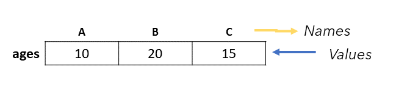
```

**Note** that the names are written here without quotes, just like object names. Also notice that this time R has not printed the index `[1]`, but the names. The function `names()`\index{names() function} shows the names of all the elements (this time in quotes, since the names themselves are a character vector).

```{r}
names(ages)
```

The same function assigns names to an existing vector. See

```{r}
vec1
names(vec1) <- c('first_element', 'second_element')
vec1
```

Names may also be assigned with `setNames()`\index{setNames() function}, while creating the vector.

```{r}
new_vec <- setNames(1:26, LETTERS)
new_vec
```

The function `unname()`\index{unname() function} removes all the names. Assigning `NULL` to the names, `names(x) <- NULL`, does the same. Remember that `unname()` does not change the vector itself. To keep the change, we have to assign the result back to the vector. Check this,

```{r}
unname(new_vec)
new_vec
new_vec <- unname(new_vec)
new_vec
```

#### Type coercion {.unnumbered}

Sometimes values of different types get mixed together\index{type coercion}, by accident or on purpose. R then converts, or *coerces*, them to a single type. Let us see how.

But first, how do we check the type of a vector? `typeof()` tells the type. To check whether a vector is of a *particular* type, there are the `is.*()`\index{is.*() functions} functions, which return either `TRUE` or `FALSE`.

-   `is.logical()`\index{is.logical() function}
-   `is.integer()`\index{is.integer() function}
-   `is.double()`\index{is.double() function}
-   `is.character()`\index{is.character() function}
-   `is.complex()`\index{is.complex() function}

```{r}
is.integer(1:10)
is.logical(LETTERS)
```

#### Implicit Coercion {.unnumbered}
We know that\index{implicit coercion} all the values in a vector must be of the same type. So what happens when we mix values of different types in a vector?

R converts all of them to the most flexible type among them. A number like `56` can easily become a complex number (`56+0i`) or text (`"56"`), but a letter like `A` cannot become a number. So the types follow the order of precedence in @tbl-rank, and the vector takes the highest-ranked type present.

| Rank |   Type    |
|:----:|:---------:|
|  1   | Character |
|  2   |  Complex  |
|  3   |  Double   |
|  4   |  Integer  |
|  5   |  Logical  |

: Order of Precedence for Atomic Data Types {#tbl-rank}

For example, in the following diagram, the first vector has a character element, the highest rank, so the whole vector becomes character. Similarly, the second and third vectors become `double` (because of the second element) and `integer` (because of the first element) respectively.

```{r fig-impcoer, fig.cap="Implicit Coercion of Vectors", fig.show="hold", fig.align="center", echo=FALSE, out.width="99%"}
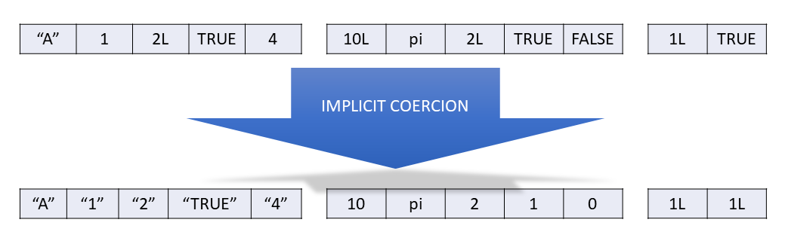
```

It is important to note that this coercion happens silently, without any warning. It also happens when two or more vectors of different types are joined together.

Example: `vec` is a vector of type `integer`. When we add an element of type `character`, the whole of `vec` becomes `character`.

```{r}
vec <- 1:5
typeof(vec)
vec <- append(vec, 'ABCD')
typeof(vec)
```

R also coerces vectors when we calculate with them. `TRUE` becomes `1` and `FALSE` becomes `0`. Example

```{r}
(TRUE == FALSE) + 1
typeof(TRUE + 1:100)
typeof(FALSE + 56)
```

This is very handy. The sum of a logical vector *counts* the `TRUE`s, and its mean gives their *proportion*. We will use this all the time to count exceptions.

```{r}
amounts <- c(12000, 85000, 4500, 260000, 51000)
sum(amounts > 50000)    # how many above ₹50,000
mean(amounts > 50000)   # what proportion
```

::: callout-tip
## Audit tip

The silent coercion to character is a classic trap with data from Excel. If a single cell in a column of amounts holds text, like `"1,25,000"`, `"NIL"` or `"-"`, the *whole column* is read as character. Arithmetic on it then fails, or sorting puts `"9000"` after `"85000"`. So after reading any file, check the type of every column, as we will learn in @sec-read-check.
:::

#### Explicit Coercion {.unnumbered}
We can coerce explicitly\index{explicit coercion} with an `as.*()` function, like `as.logical()`, `as.integer()`, `as.double()` or `as.character()`. **A value which cannot be converted becomes `NA`, with a warning:**

```{r}
as.double(c(TRUE, FALSE))
as.integer(c(1, 'one', 1L))
as.numeric(c("125000", "1,25,000", "NIL"))
```

Never ignore this warning. Each `NA` it creates is a value which has been dropped from your totals. The function `parse_number()` from readr, which we will meet in @sec-read-check, handles amounts with commas.

#### Coercion precedence
Sometimes both kinds of coercion happen together. Which comes first? Implicit coercion always happens first, when the vector is created. Guess the output of this example before looking at the result.

```{r}
as.logical(c('TRUE', 1))
```

Explanation: the vector `c('TRUE', 1)` first becomes `c('TRUE', '1')` by implicit coercion. Then `as.logical()` converts `'1'` to `NA`. The number `1` would have become `TRUE`, but the text `"1"` becomes `NA`.

#### Checking dimensions {.unnumbered}
The function `length()` tells how many elements a vector has.

```{r}
length(1:100)
length(LETTERS)
length('LENGTH') # If you thought its output should have been 6, check again.
```

### Matrix (Matrices)
A matrix (plural matrices) is a two-dimensional arrangement of values, like a matrix in mathematics. As in vectors, all the values must be of the same type. For example,

$$\begin{array}{ccc}
x_{11} & x_{12} & x_{13}\\
x_{21} & x_{22} & x_{23}
\end{array}$$

Thus, matrices are vectors with an attribute named *dimension*.

::: callout-note
The dimension attribute is itself an integer vector of length 2 (number of rows, number of columns).
:::

#### Create a new matrix {.unnumbered}
A matrix is created with the function `matrix()`, from a vector of values, and the number of rows `nrow` or the number of columns `ncol`.

```{r}
matrix(1:12, nrow = 3)
matrix(1:12, ncol=3)
```

The values fill the matrix column by column. Another useful argument, `byrow` \index{byrow argument in matrix function}, is `FALSE` by default. If we set it to `TRUE`, the values fill row by row.

```{r}
matrix(1:12, ncol=3, byrow = TRUE)
```

```{r fig-byrow, fig.cap="Arrangement of Matrix, if byrow argument is used", fig.show="hold", fig.align="center", echo=FALSE, out.width="60%"}
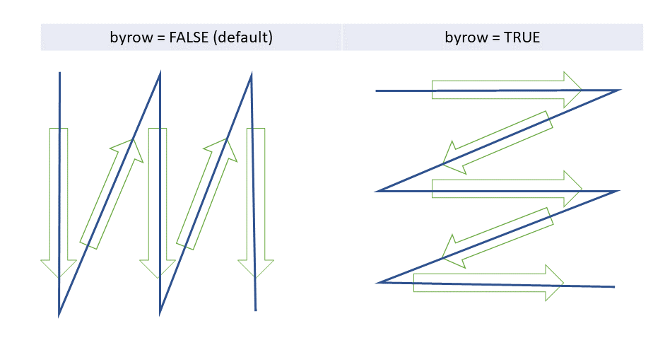
```

A matrix can be of any type, and the rules of coercion explained for vectors apply here too.

```{r}
matrix(LETTERS, nrow = 2)
matrix(c(LETTERS, 1:4), nrow=5)
```

#### Names in matrices {.unnumbered}
Like vectors, the rows and columns of a matrix may have names\index{named matrix}, given with `rownames()`, `colnames()` or the argument `dimnames`. Check `?matrix` for the complete documentation.

#### Dimension {.unnumbered}
The dimensions of a matrix\index{dimensions of matrix} are given by `dim()`\index{dim function}, as two numbers, rows first and then columns. It is the matrix's counterpart of `length()`.

```{r}
my_mat <- matrix(c(LETTERS, 1:4), nrow=5)
dim(my_mat)
```

Assigning dimensions to a vector is another way of turning it into a matrix. See

```{r}
my_mat2 <- 1:10
dim(my_mat2) <- c(2,5)
my_mat2
```

#### Have a check on replication {.unnumbered}
What happens when the vector has fewer, or more, values than the matrix needs? R recycles the values, or drops the extra ones, but the result may not be what you wanted. Check these cases, and notice when R warns you.

```{r}
matrix(1:10, nrow=5, ncol=5)
matrix(1:1000, nrow=2, ncol=3)
```

#### Combining matrices {.unnumbered}
`cbind()` and `rbind()` combine matrices side by side (column-wise) or one below the other (row-wise), respectively.

```{r fig-bind, fig.cap="Binding of Two or more matrices together", fig.show="hold", fig.align="center", echo=FALSE, out.height="60%"}
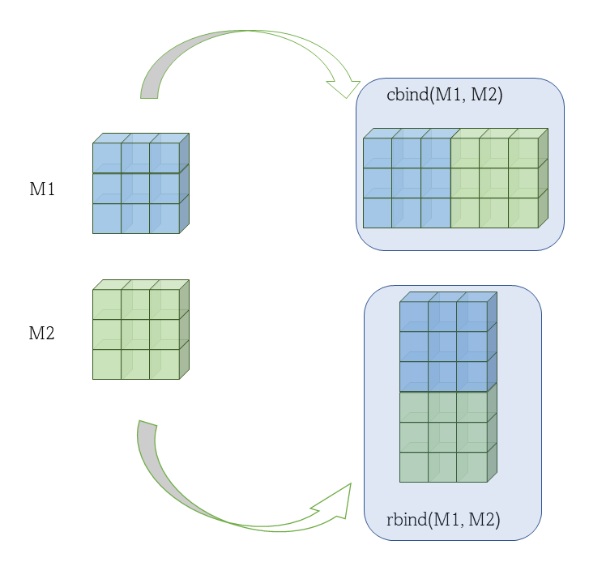
```

See these two examples.

```{r}
mat1 <- matrix(1:4, nrow = 2)
mat2 <- matrix(5:8, nrow = 2)
cbind(mat1, mat2)
```

Example-2

```{r}
rbind(mat1, mat2)
```

### Arrays
So far we have seen values in one dimension, as vectors, and in two dimensions, as matrices. How many dimensions can we have? Any number, in an object of type `array`, but they become hard to picture, so we do not discuss them further. Check this, however, for your understanding,

```{r}
array(1:24, dim = c(3,2,4)) # a three dimensional array
```

Try creating 4 or 5 dimensional arrays in your console and see the results.

More about vectors and matrices comes in the next chapter, on subsetting, where we learn to pick out particular elements. So far, all our objects held values of a single type. What if we want to keep values of different types together, each retaining its type? The answer is in the next section, on heterogeneous objects.

### Heterogeneous objects {.unnumbered}

### Lists
Lists combine elements of different types. A list is created with the function `list()`. Check this

```{r}
list(1, 2, 3, 'My string', TRUE)
```

Pictorially this list can be depicted as

```{r fig-exlist, fig.cap="A list in R is a heterogeneous object", fig.show="hold", fig.align="center", echo=FALSE, out.width="99%"}
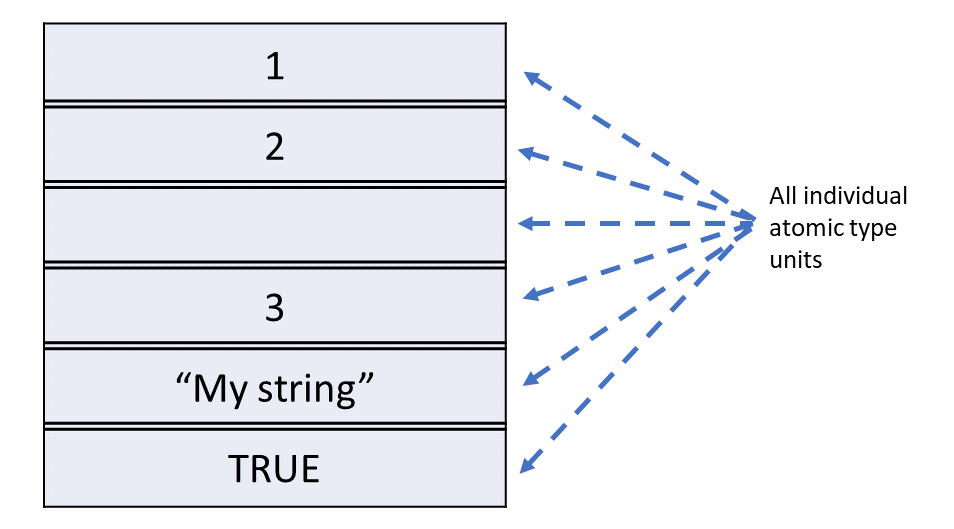
```

A list can even contain vectors, matrices and arrays as its elements. See

```{r}
list(1:3, LETTERS, TRUE, my_mat2)
```

```{r fig-exlist2, fig.cap="A list in R, can contain vector, matrices, array or even lists", fig.show="hold", fig.align="center", echo=FALSE, out.width="99%"}
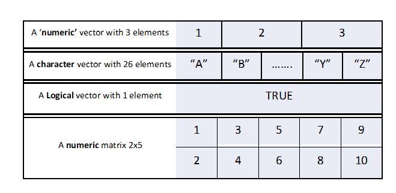
```

Like vectors, the elements of a list can have names.

```{r}
list(first_item = 1:5, second_item = my_mat2)
```

OR

```{r}
my_list <- list(first=c(A=1, B=2, C=3),second=my_mat2)
my_list
```

```{r fig-namedlist, fig.cap="Similar to vector elements, the elements in list can be named also", fig.show="hold", fig.align="center", echo=FALSE, out.width="99%"}
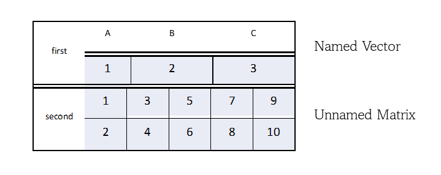
```

OR

A list can even contain other lists.

```{r}
my_list2 <- list(my_list, new_item = LETTERS)
my_list2
```

The number of items at the first level is given by `length()`, as for vectors. We will see how to look at the deeper levels in later chapters.

```{r}
length(my_list)
length(my_list2) # If you thought its output should have been 3, think again.
```

### Data Frame

Data frames store tabular (rectangular) data in R, with rows and columns, like a sheet in Excel. They are the object we will work with most.

```{r fig-dframe, fig.cap="An example data frame", fig.show="hold", fig.align="center", echo=FALSE, out.width="99%"}
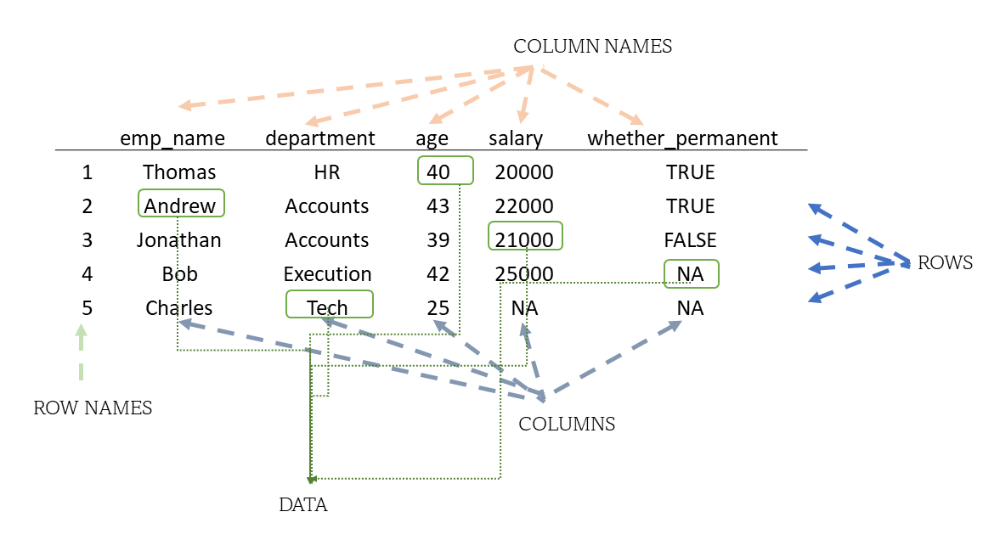
```

A data frame is a special kind of list, in which every element has the same length. Each element is a column, and the common length is the number of rows.

```{r fig-listvsdf, fig.cap="A data frame in R, is just a special kind of list", fig.show="hold", fig.align="center", echo=FALSE, out.width="99%"}
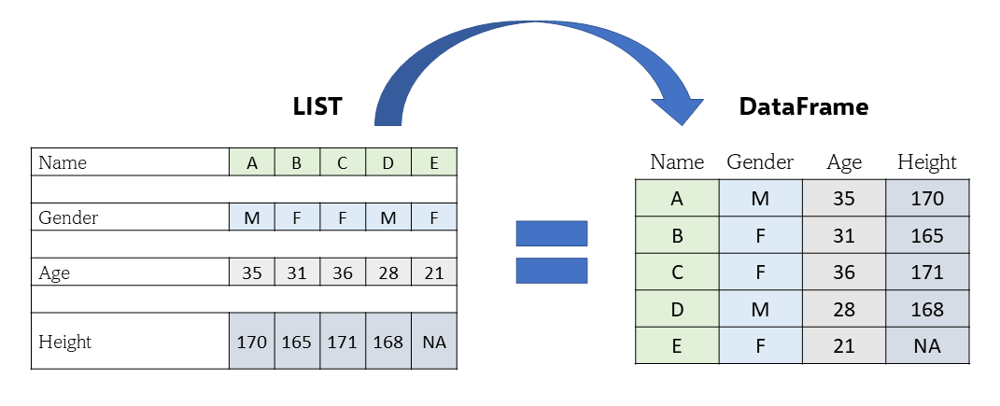
```

Unlike a matrix, a data frame can have columns of different types. Within a column, though, all the values are of one type, since each column is a vector.

To create a data frame from scratch, we use the function `data.frame()`. See

```{r}
my_df <- data.frame(emp_name = c('Ramesh', 'Sunita', 'Imran', 'Harpreet', 'Lakshmi'),
                    department = c('HR', 'Accounts', 'Accounts', 'Execution', 'Tech'),
                    age = c(40, 43, 39, 42, 25),
                    salary = c(20000, 22000, 21000, 25000, NA),
                    whether_permanent = c(TRUE, TRUE, FALSE, NA, NA))
my_df
```

**Note** that R has given each row a number as its row name.

Most of the time, of course, we will read data frames from files, which we will learn in later chapters. The dimensions of a data frame are given by `dim()`, as for a matrix, and the structure, with the type of each column, by `str()`.

```{r}
dim(my_df)
str(my_df)
```

Later in the book we will mostly use *tibbles*, a modern form of the data frame from the tidyverse. They behave the same way, but print more neatly, showing the type of each column.

The main types of objects in R can be depicted as in the figure below.

```{r fig-impdstr, fig.cap="Most important Data structures, in R", fig.show="hold", fig.align="center", echo=FALSE, out.width="99%"}
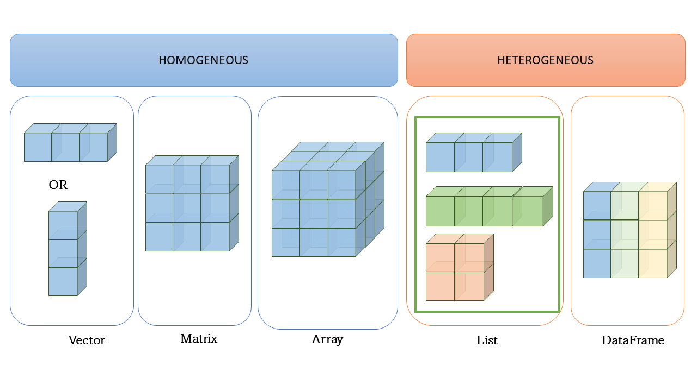
```

## Other Data types
There are other data types in R, of which three are particularly useful, `factor`, `Date` and date-time. They are built on top of the basic types, `integer`, `double` and `double` respectively, which is why we discuss them separately. They are *S3 objects*, part of R's system of object oriented programming, which is beyond our scope here.

To understand them, we need to know that objects (for simplicity, think of vectors) can carry *attributes*, extra information attached to them.

**Example** One attribute of a vector is `names`, which is empty (`NULL`) for an unnamed vector. All the attributes of an object are shown by the function `attributes()`.

```{r}
# Let us create a vector
vec <- 1:26
# Convert this to a named vector using function setNames()
# This function takes first argument as vector
# Second argument should be a character vector of equal length.
vec <- setNames(vec, LETTERS)
# let's check what are the attributes of `vec`
attributes(vec)
```
With `attr()` we can assign a new attribute to any object.

```{r}
# Let's also assign a new attribute say `x` having value "New Attribute" to `vec`
attr(vec, "x") <- "New Attribute"
# Now let's check its attributes again
attributes(vec)
```
We can see how a new attribute has been added to the vector. A factor or a date is simply a vector with particular attributes, as we will now see.

### Factors {#sec-fctrss}

A factor is a vector that can contain only predefined values. It is used for categorical data, like the category of a district or the status of a bill. Factors are built on top of an integer vector with two attributes: a *class*, `factor`, which makes it behave differently from ordinary integers, and *levels*, the set of allowed values. Factors are created with the function `factor()`.

```{r}
fac <- factor(c('a', 'b', 'c', 'a'))
fac
typeof(fac) # notice its output
attributes(fac)
```

So if `typeof()` of a factor says integer, how do we know it is a factor? We use `class()` or `is.factor()`.

```{r}
class(fac)
is.factor(fac)
```

A factor can also be *ordered*, when its categories have a natural order. We give the argument `ordered = TRUE`, along with the `levels` in their order.

```{r}
my_degrees <- c("PG", "PG", "Doctorate", "UG", "PG")
my_factor <- factor(my_degrees, levels = c('UG', 'PG', 'Doctorate'), ordered = TRUE)
my_factor # notice output here
is.ordered(my_factor)
```

The argument `labels` gives labels to display, which may be different from the levels.

```{r}
my_factor <- factor(my_degrees, levels = c('UG', 'PG', 'Doctorate'),
                    labels = c("Under-Graduate", "Post Graduate", "Ph.D"),
                    ordered = TRUE)
my_factor # notice output here
```

The function `levels()` shows the levels, and can also change them.

```{r}
levels(my_factor)
levels(my_factor) <- c("Grad", "Masters", "Doctorate")
my_factor
```

Remember that while factors look like (and often behave like) character vectors, they are built on top of integers. Try to guess the output of `is.factor(c(my_factor, "UG"))` before running it in your console.

We will learn about these data types in detail in @sec-factors.

### Date

Dates are built on top of doubles, the number of days since 1 January 1970. They have the class `Date` and no other attributes. A common way to create dates is to convert text with `as.Date()` (note the capital `D`),

```{r}
my_date <- as.Date("1970-01-31")
my_date
attributes(my_date)
unclass(my_date)   # the number underneath
```

Because a date is a number underneath, we can subtract one date from another, to get the days taken to pay a bill, or add days to a date, to get a due date.

Do check the other arguments of `as.Date()` by running `?as.Date` in your console. To check whether an object is a date, base R has no function like `is.Date()`, so we use `inherits()`. (The package lubridate does have `is.Date()`.)

```{r}
inherits(my_date, 'Date')
```

### Date-time (`POSIXct`)
Date-times are represented by the class `POSIXct` or `POSIXlt`.

-   `POSIXct` is just a large number underneath, the seconds since the start of 1970. It is the class to use for date-times stored in a data frame.
-   `POSIXlt` is a list underneath, which stores the parts separately, like the day of the week, the day of the year, the month and the day of the month.

```{r}
my_time <- Sys.time()
my_time
class(my_time)
my_time2 <- as.POSIXlt(my_time)
class(my_time2)
names(unclass(my_time2))
```

### Duration (`difftime`)

Durations, the amount of time between two dates or date-times, are stored as `difftime` objects. They are built on top of doubles, and have a `units` attribute, which tells how the number is to be read, as days, hours, and so on.

```{r}
two_days <- as.difftime(2, units = 'days')
two_days
```

We will discuss dates and times in detail in @sec-lubridate.

## A suggested workflow

When a file of payments or bills is first loaded into R, an auditor may follow these steps.

1.  **Name objects clearly.** Store each data set in an object with a plain name, like `bills_2024_25`, using `<-`.
2.  **Check the structure first.** Look at every new data frame with `str()` and `dim()`. Confirm the number of rows and the type of each column.
3.  **Look for silent coercion.** An amount column shown as character usually has a text value, like `"NIL"` or `"1,25,000"`, in some cell. Find it before doing any arithmetic.
4.  **Keep identifiers as text.** Account numbers, PAN, Aadhaar, mobile numbers and PIN codes stay character. This protects leading zeros and long numbers.
5.  **Convert with care.** When you use `as.numeric()` or another `as.*()` function, read every warning. Each new `NA` is a value dropped from your totals.
6.  **Find the missing values.** If a total comes out as `NA`, use `is.na()` to see which values are missing and why. Only then decide on `na.rm = TRUE`.
7.  **Compare amounts safely.** Round both sides with `round(x, 2)` before matching a bill total with the sum of its items. Do not compare computed decimals with `==`.
8.  **Store dates as dates.** Convert date text with `as.Date()`, so that the days taken to pay a bill can be worked out by subtraction.

::: callout-important
## Remember

Many errors in audit analysis start with the wrong data type. An amount read as text, an account number that has lost its leading zero, or a total that has silently become `NA` gives a wrong result without any error. Check the type of every column before you analyse it.
:::

## Summary of functions used

| Function | Package | What it does |
|-----------------------|----------------|--------------------------------|
| `<-` | base R | Assign a value to a name |
| `typeof()`, `class()`, `str()` | base R | Type, class and structure of an object |
| `is.*()`, like `is.numeric()`, `is.character()`, `is.na()` | base R | Check the type of an object, or for missing values |
| `as.*()`, like `as.numeric()`, `as.character()` | base R | Convert to another type, giving `NA` for what cannot be converted |
| `c()`, `vector()` | base R | Create a vector |
| `:`, `seq()`, `rep()` | base R | Create sequences and repeated values |
| `LETTERS`, `letters`, `month.name`, `month.abb` | base R | Built-in vectors of letters and month names |
| `names()`, `setNames()`, `unname()` | base R | Get, set or remove names |
| `length()`, `dim()` | base R | Number of elements, or rows and columns |
| `matrix()`, `array()`, `cbind()`, `rbind()` | base R | Create and combine matrices and arrays |
| `list()`, `data.frame()` | base R | Create lists and data frames |
| `attributes()`, `attr()` | base R | See or set the attributes of an object |
| `factor()`, `levels()` | base R | Create factors and see their levels |
| `as.Date()`, `Sys.time()`, `as.difftime()` | base R | Dates, date-times and durations |
| `all.equal()`, `round()` | base R | Compare decimals safely |

: Functions used in this chapter {#tbl-basicfunctions}
