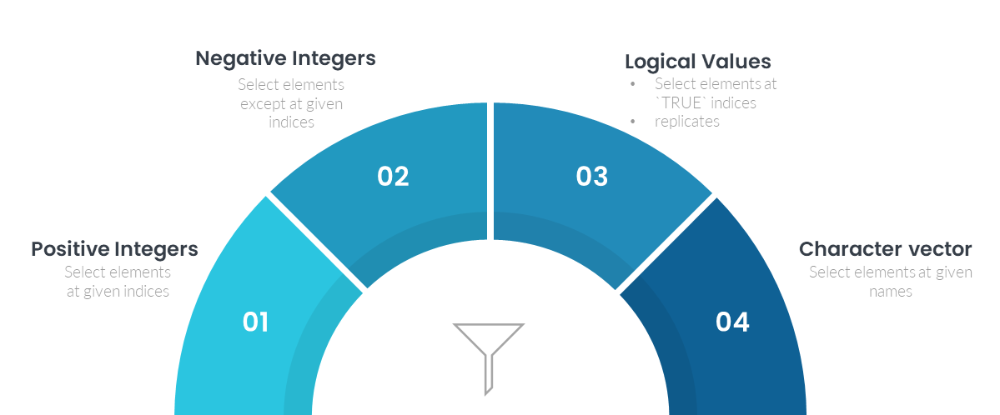

```{r}
#| include: false
source("_common.R")
```

# Subsetting and Indexing {#sec-subset}

*Subsetting* means picking out some elements of an object, like the third value of a vector, the rows of a table meeting a condition, or one item of a list. Much of audit analysis is subsetting. Picking out the payments above a limit, the bills of one vendor, or the rows with a missing date. There are several ways to subset R objects (vectors, matrices, lists and data frames), each with its own uses, and we discuss each of them here. Three operators are used, `[`, `[[` and `$`.

In later chapters we will mostly use the `dplyr` functions `filter()` and `select()` for tables. But they are built on the ideas of this chapter, and base R subsetting is still needed every day, for vectors, lists, and quick checks.

## Subsetting vectors
Let us start with vectors, the basic objects of R. To subset a vector, we use `[`.
We will use the following vector `x`, which has 6 elements (names), starting with the letters A to F.
```{r}
x <- c('Andrew', 'Bob', 'Chris', 'Danny', 'Edmund', 'Freddie')
```



### Subsetting through a vector of positive integers
Subsetting with positive integers gives the elements at those positions (indices). See this
```{r}
# fourth element
x[4]
# third to fifth element
x[3:5]
# first and third element
x[c(1,3)]
```
_Note: Check what happens when the integer vector has repeated integers, like `x[c(1, 1, 2)]`._

### Subsetting through a vector of negative integers
Subsetting with negative integers gives all the elements __except__ those at the given positions. See
```{r}
# all elements except that at fourth
x[-4]
# all elements except third to fifth
x[-(3:5)]
# all elements except first and fifth
x[-c(1,5)]
```

_Note: Try subsetting with a vector having both positive and negative integers in your console, and check what happens._

### Subsetting through a logical vector
We can also subset a vector with another vector of `logical` values, `TRUE` and `FALSE`. The result has only the elements at the places which are `TRUE`.
```{r}
# First, third and fifth element only
x[c(TRUE, FALSE, TRUE, FALSE, TRUE, FALSE)]
```
__Recycling__ is an important idea in subsetting with a logical vector. If the logical vector is shorter, it is repeated up to the length of the vector being subset. Thus, `x[TRUE]` gives the whole of `x`.
```{r}
x[TRUE]
x[c(TRUE, FALSE)] # will give elements at odd indices
```
__Subsetting with a logical vector is the most important and most used method__, because the logical vector can come from a *condition*. A comparison like `amounts > 50000` gives a logical vector, which then picks out the elements meeting the condition. This is how every exception report begins.

```{r}
amounts <- c(B01 = 42000, B02 = 125000, B03 = 9800, B04 = 51000, B05 = 50000)
amounts > 50000
amounts[amounts > 50000]
```

Two related functions are very useful. `which()` gives the *positions* (and names) of the `TRUE` values, and `%in%` checks whether each element is in a given set.

```{r}
which(amounts > 50000)
names(amounts)[names(amounts) %in% c("B02", "B05", "B09")]
```

**Missing values in a condition.** What if a value is missing? A comparison with `NA` gives `NA`, and subsetting with `NA` gives an `NA` element in the result.

```{r}
amounts["B03"] <- NA
amounts[amounts > 50000]
```

The bill `B03`, whose amount is missing, appears in the result as `<NA>`. It is neither above nor below the limit. To get only the rows which truly meet the condition, wrap it in `which()`, which ignores `NA`. And to look at the missing ones separately, use `is.na()`.

```{r}
amounts[which(amounts > 50000)]
amounts[is.na(amounts)]
```

::: callout-caution
In an exception report, rows with a missing value in the tested column are neither exceptions nor clean. Report them separately, as we did with `is.na()`. Never let them silently fall into either group. We will see the same trap with `dplyr::filter()` in @sec-DPLYRR.
:::

### Subsetting through a character vector
This method is used when the vector has names. We pass the wanted names inside `[]`. See this example.
```{r}
# let us create a named vector `y`
y <- setNames(1:6, LETTERS[1:6])
# display `y`
y
# subset elements named `A` and `C`
y[c('A', 'C')]
```
_Note that we have used quotes above._ We can also use names saved in another variable. See this
```{r}
var <- c('A', 'C', 'E')
# subset those elements from `y` which are named as per `var`
y[var] # notice that since `var` is a variable, we have not used quotes.
```
_Note: As with positive integers, repeated names give repeated values._
```{r}
y[c("A", "A", "C", "A")]
```

__The other two methods are not used often, but are worth knowing for debugging, because sometimes the vector you subset with turns out to be `NULL` or zero.__

### Subsetting through nothing
Subsetting with nothing, that is with an empty `[]`, gives the whole vector.
```{r}
x[]
```

### Subsetting through Zero
Subsetting with `NULL` or `0` gives a vector of length zero.
```{r}
x[NULL]
y[0]
is.null(x[NULL])
```
It is interesting to note that subsetting with `NULL` does not give `NULL`, but a vector of length zero, of the same type.

## Subsetting Matrices and arrays

We can subset structures with more dimensions (matrices with 2 and arrays with more) using (i) one vector for each dimension, (ii) a single vector, or (iii) a matrix.

Let us first create a 5x5 matrix `mat`, with elements named $A_{mn}$, where `m` is the row number and `n` the column number.
```{r echo=FALSE}
mat <- outer(1:5, 1:5, FUN = function(x, y) paste0('A', x, y))
mat
```

### Indexing through Multiple vectors
This extends all the methods explained for vectors. We give one vector for each dimension, separated by a comma, rows first. A blank, like subsetting with nothing above, returns that dimension complete.
```{r}
# first and second row with third and fifth column
mat[1:2, c(3,5)]
# third to fifth column, all rows
mat[,3:5]
# all columns except third
mat[, -3]
# Odd rows, all columns
mat[c(TRUE, FALSE),]
```

The idea can be extended to a named matrix also.
```{r}
# First create a named matrix
rownames(mat) <- paste0("Row", 1:5)
colnames(mat) <- paste0("Col", 1:5)
mat
# filter desired rows/columns
mat[c("Row1"), c("Col2", "Col3")]
```
You may have noticed in the above example that subsetting a matrix may return an object with fewer dimensions. Here a single row of a matrix came back as a vector. __The argument `drop` controls this. It is `TRUE` by default, which can introduce bugs in code which expects a matrix. Use `drop = FALSE` to keep the dimensions.__
```{r}
mat[c("Row1"), c("Col2", "Col3"), drop=FALSE]
#check this
dim(mat[c("Row1"), c("Col2", "Col3"), drop=FALSE])
#versus this
dim(mat[c("Row1"), c("Col2", "Col3")])
```

### Subsetting through one vector
Matrices and arrays are, at their core, vectors with dimensions attached. So subsetting them with a single vector treats them as plain vectors, counting down the columns, and works exactly as for vectors.
```{r}
mat[c(1, 10, 15, 25)]
# OR
mat[c(TRUE, FALSE)]
```


### Subsetting through a matrix
We can also subset with an integer matrix having one column for each dimension. To pick elements from a matrix, we need a 2-column matrix, the first column giving the row number and the second the column number of each element. See
```{r}
selection_matrix <- matrix(c(1,1, # Element at Row 1 Col 1
                             2,2, # Element at Row 2 Col 2
                             3,3), # Element at Row 3 Col 3
                           ncol = 2,
                           byrow = TRUE)
mat[selection_matrix]
```


## Subsetting lists
Lists can be subset with `[]`, `[[]]` or `$`. Let us take them one by one, to understand the difference. We use a list of 4 elements, a vector, a matrix, a list and a data frame. For now, the list has no names.
```{r}
my_list <- list(
  11:20,                                                       # first element
  outer(1:4, 1:4, FUN = function(x, y) paste0('B', x, y)),     # second element
  list(LETTERS[1:8], TRUE),                                    # third element
  data.frame(col1 = letters[1:4], col2 = 5:8)                  # fourth element
)
# display the list
my_list
```


### Subsetting lists with `[]`
Subsetting a list with `[]` always gives a *list*, containing the chosen element(s).
```{r}
my_list[2]
class(my_list[1])
```
All the ideas of vector subsetting work here too. The result is always a list, of one or more items.

### Subsetting lists with `[[]]`
Subsetting a list with `[[]]` returns the item *itself*, of whatever type it is.
```{r}
my_list[[2]]
class(my_list[[4]])
```
_Notice the difference between the outputs of `my_list[2]` and `my_list[[2]]` in the above two code blocks._ A common way to remember it: if the list is a train, `[` gives a shorter train of the chosen carriages, while `[[` gives the contents of one carriage.

`[[` takes only one item at a time. Check `my_list[[1:2]]` in your console. The result is not the first two items, but the second element *of* the first item, because `[[` with a vector digs one level deeper for each value.

### Chaining or multiple subsetting
We can subset the result of a subset again, by __chaining__ two or more of the methods discussed here.
```{r}
# third element of second element
my_list[[2]][3] # recall that by default matrix is by column
# or
my_list[[2]][1:3,2:4]
```


### Subsetting with `$`
`$` is a shorthand operator: `x$y` is roughly equivalent to `x[["y"]]`. To check this let us assign our list some names.

```{r}
names(my_list) <- c("first", "second", "third", "fourth")
# Now see
my_list$first
my_list$fourth$col2
```
_Notice that `$`, like `[[`, returns the item itself, not a list._

Another difference between `[[` and `$` is *partial matching*. With `$`, R accepts the beginning of a name, while `[[` needs the exact name. See
```{r}
my_list$fir
my_list[['fir']]
```

Partial matching saves typing, but can pick up the wrong column silently. It is safer to always type names in full. (Tibbles, which we will use later, do not allow partial matching, and give a warning instead.)

## Data frames
As we know, data frames are lists whose elements (columns) all have the same length. So all the rules for subsetting lists apply to data frames. In addition, data frames can be subset like matrices, with rows and columns.

```{r}
head(mtcars) # a data frame built into R; head() shows the first six rows
# list type subsetting
mtcars[[2]]  # second column, as a vector
mtcars[2] |> head()  # second column, as a data frame
# matrix type
mtcars[1:4, 2:3] # first four rows with second & third columns
```

**Remember**

1. Subsetting a data frame with *one* index works as for lists. `df[2]` gives a data frame with the second column, and `df[[2]]` or `df$cyl` gives the column itself, as a vector.
2. Subsetting with *two* indices, `df[rows, columns]`, works as for matrices. If only one column is chosen, the result *drops* to a vector, unless we give `drop = FALSE`.

Examples
```{r}
# Default
mtcars[1:5, 2]
# using drop argument
mtcars[1:5, 2, drop = FALSE]
```

Tibbles never drop to a vector this way, which is one reason they are safer in code.

**Rows meeting a condition.** The most common use of matrix-type subsetting is to pick the rows meeting a condition, and some columns.

```{r}
mtcars[mtcars$mpg > 30, c("mpg", "cyl", "hp")]
```

The same `NA` trap we saw with vectors applies here, and is worse. If the condition is `NA` for some row, base R returns a row full of `NA`s, with a name like `NA.1`. `dplyr::filter()`, which we will learn in @sec-DPLYRR, drops such rows instead. Neither tells you that they existed, so check `sum(is.na(...))` on the tested column first.

## Subsetting and assignment
Every kind of subsetting we have seen can also be used on the left of `<-`, to *replace* the chosen elements.
```{r}
my_list$first <- mtcars[1:4, 2:3]
my_list
```

This is most useful with a condition. For example, to treat negative amounts in a register as missing, for separate examination,

```{r}
amt <- c(1200, -350, 4800, 0, -90)
amt[amt < 0] <- NA
amt
```

Assigning `NULL` to a list element removes it, as in `my_list$third <- NULL`.

## A suggested workflow

To prepare an exception report from a payment register, an auditor may follow these steps.

1.  **Write the condition.** Express the audit rule as a comparison, like `amounts > 50000`. This gives a logical vector.
2.  **Count the missing values first.** Check the tested column with `sum(is.na(...))`. Know how many records cannot be tested before you test the rest.
3.  **Pick the exceptions.** Subset with the condition wrapped in `which()`, so that missing values do not slip in as rows of `NA`.
4.  **Report the missing ones separately.** Subset with `is.na()` to list them. They are neither exceptions nor clean.
5.  **Keep only the columns needed.** For a data frame, use `df[rows, columns]` with the names of the columns you want in the report. Use `drop = FALSE` if the result must stay a table.
6.  **Check against a list.** Use `%in%` to test whether each code is in a given set, like a list of approved vendors.
7.  **Type names in full.** Take out a column with `$` or `[[ ]]` using its full name. Partial matching may pick up the wrong column silently.
8.  **Replace with care.** Assign to a subset only when needed, like marking negative amounts as `NA` for separate examination. Do it on a copy, so that the data as received stays unchanged.

::: callout-important
## Remember

A condition on a missing value gives `NA`, not `FALSE`. Base R then returns a row full of `NA`s, and the real record is hidden. Always count the missing values in the tested column, and report them separately from the exceptions.
:::

## Summary of functions used

| Function or operator | Package | What it does |
|-----------------------|----------------|--------------------------------|
| `[ ]` | base R | Subset by position, by name, or by a logical condition; with a list, gives a list |
| `[[ ]]` | base R | Take out a single item from a list or a column from a data frame |
| `$` | base R | Take out an item or column by name |
| `which()` | base R | Positions of the `TRUE` values, ignoring `NA` |
| `%in%` | base R | Check whether each value is in a given set |
| `is.na()` | base R | Find missing values |
| `head()` | utils (base R) | The first few elements or rows |
| `drop = FALSE` | base R | Keep a matrix or data frame from dropping to a vector |

: Functions used in this chapter {#tbl-subsetfunctions}
