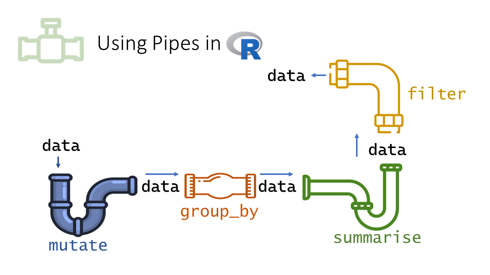

```{r}
#| include: false
source("_common.R")
```

# Pipes {#sec-pipes}
```{r echo=FALSE, message=FALSE, warning=FALSE}
library(magrittr)
```

An auditor rarely does just one thing to the data. Take the payment register of a Public Works division. We may want to keep the vouchers of one office, then keep those above a limit, then sort them by amount, and then look at the top ten. That is four steps, one after the other. Each step works on the result of the step before it.

Written the usual way, such a chain of steps is hard to read. Either the functions sit one inside another, and must be read from the inside out. Or we create a new object after every step, and the workspace fills with objects we do not need. *Pipes*\index{pipes} solve this problem. They let us write the steps in the order in which we think of them, one step per line. The code then reads like the audit programme itself.

In this chapter we learn the two pipes of R, how to send the result into an argument other than the first, and which pipe to use. We practise on a small payment register. At the end we use a short chain of pipes to find bills kept just below a sanction limit.

There are two pipes in R.

- `|>` is the native pipe of R, built into R since version 4.1. We use it throughout this book.
- `%>%` is the pipe from the package `magrittr`[@R-magrittr], loaded with the `tidyverse`. It came first, and is still common in code you will find in books and on the internet.

```{r fig-pipe2, echo=FALSE, fig.align='center', fig.show='hold', fig.cap="Magrittr, the R package, is named after the surrealist painter Rene' Magritte. His painting was self captioned, 'This is not a pipe.'", out.width="99%"}
knitr::include_graphics('images/pipemag.png')
```

## Our data, a payment register {#sec-pipes-data}

Let us create a small payment register of a Public Works division for the financial year 2024-25. Each row is one payment voucher, made by one of four sub-division offices. All names are made up. The code is folded. New readers need not worry about it now.

```{r}
#| code-fold: true
#| code-summary: "Code to create the payment register"
set.seed(2024)
offices <- c("Pune", "Nashik", "Nagpur", "Kolhapur")
vendors <- c("Shree Ganesh Builders", "Patil Constructions", "Deshmukh Traders",
             "Sai Krupa Enterprises", "Jadhav Electricals", "Mahalaxmi Suppliers",
             "Gawande Infra", "Om Stationers")
n <- 54
payments <- data.frame(
  office       = sample(offices, n, replace = TRUE),
  vendor       = sample(vendors, n, replace = TRUE),
  voucher_date = as.Date("2024-04-01") + sample(0:364, n, replace = TRUE),
  amount       = round(exp(runif(n, log(5000), log(450000))), -2)
)

# Planted. Six bills of one vendor at Nashik, each just below Rs 1 lakh,
# paid within a fortnight
split_bills <- data.frame(
  office       = "Nashik",
  vendor       = "Sai Krupa Enterprises",
  voucher_date = as.Date("2025-01-06") + c(0, 2, 3, 7, 9, 12),
  amount       = c(99500, 98000, 99900, 97800, 99000, 98600)
)

payments <- rbind(payments, split_bills)
payments <- payments[order(payments$voucher_date), ]
payments$voucher_no <- sprintf("PV/24-25/%03d", seq_len(nrow(payments)))
payments <- payments[, c("voucher_no", "voucher_date", "office", "vendor", "amount")]
rownames(payments) <- NULL
```

```{r}
head(payments)
```

The register has `r nrow(payments)` vouchers, worth ₹`r round(sum(payments$amount) / 1e5, 2)` lakh in all.

## What a pipe does

Suppose we have to apply three functions, `FIRST`, `SECOND` and `THIRD`, to an object `OBJ`, in that order. We could write
```
THIRD(SECOND(FIRST(OBJ)))
```
which has to be read from the inside out. Or we could create intermediate objects which we do not really need.
```
OBJ1 <- FIRST(OBJ)
OBJ2 <- SECOND(OBJ1)
OBJ3 <- THIRD(OBJ2)
```
So we either give up readability, or clutter the workspace with objects like `OBJ1` and `OBJ2`. Pipes solve both problems at once. The pipe passes the result on its left as the *first argument* of the function on its right. With pipes we can write the above as either of these.
```
OBJ |> FIRST() |> SECOND() |> THIRD()
OBJ %>% FIRST() %>% SECOND() %>% THIRD()
```
Read `|>` as "and then". Take `OBJ`, *and then* apply `FIRST()`, *and then* `SECOND()`, *and then* `THIRD()`.

Let us find the three largest payments in our register, in lakh. First the usual way, and then with pipes.

```{r}
# the three largest amounts, in lakh, the usual way
round(head(sort(payments$amount, decreasing = TRUE), 3) / 1e5, 2)

# the same with pipes
payments$amount |>
  sort(decreasing = TRUE) |>
  head(3) |>
  (\(x) round(x / 1e5, 2))()
```

The second form reads from top to bottom. Take the amounts, *and then* sort them in decreasing order, *and then* keep the first three, *and then* convert them to lakh. (The last line uses a small anonymous function. We explain it later in this chapter.)

::: callout-warning
## Caution
A pipe does not change the object it starts from. After the chain above, `payments` still holds all `r nrow(payments)` vouchers in the original order. The result is only printed. To keep it, assign it to a new name, like `top3 <- payments$amount |> ...`. Otherwise a later step may use the old object by mistake.
:::

The real power of pipes shows with the tidyverse, where a whole analysis, filtering, grouping and summarising, reads as one sentence. We will use them in every chapter from @sec-DPLYRR onward.
A diagrammatic representation is given in @fig-pipe.

```{r fig-pipe, echo=FALSE, fig.align='center', fig.show='hold', fig.cap="A diagrammatic illustration of the pipe in base R and tidyverse", out.width="99%"}
knitr::include_graphics("images/pipe.png")
```

Two questions may arise here.

1. What if the result on the left is needed in some argument other than the first?
2. Is there any difference between the two pipes, and which is better?

To answer these, we discuss the two pipes separately.

```{r fig-pipe3, echo=FALSE, fig.align='center', fig.show='hold', fig.cap="Using pipes in R", out.width="99%"}

```


## Magrittr/Dplyr pipe `%>%`
The pipe passes the result on its left into the first argument of the function on its right. So `data %>% filter(col == 'A')` means `filter(data, col == 'A')`. But sometimes the result is needed in another argument.

A good example is the base R function `aggregate()`. It totals a column by groups. We write the formula first, like `amount ~ office`, which means "amount by office". The data comes second, in the argument `data`. For such cases, `%>%` has the *placeholder* `.`, which stands for the result on the left. The filter example could be written as `data %>% filter(., col == 'A')`. With the placeholder, we can put the result wherever we want. Let us total the payments of each office.

```{r}
payments %>% aggregate(amount ~ office, data = ., FUN = sum)
```

Thus `x %>% f(y)` is equivalent to `f(x, y)` but `x %>% f(y, .)` is equivalent to `f(y, x)`.

## Base R pipe `|>`
R version 4.2.0 gave the native pipe a placeholder too, `_`, similar to the `.` of magrittr, but with a few differences.

- The argument where `_` is used must be *named*. So `f(y, z = x)` can be written as `x |> f(y, z = _)`.
- `_` can be used only once on the right side.

```{r}
payments |>
  aggregate(amount ~ office, data = _, FUN = sum)
```

The magrittr pipe does not need the argument to be named. So `payments %>% aggregate(amount ~ office, ., sum)` works. But `payments |> aggregate(amount ~ office, _, sum)` gives an error. In such cases, we can use an anonymous function, `\(x)`, which we learnt in @sec-func. See these.

```
# placeholder without named argument
payments |> aggregate(amount ~ office, _, sum)
```
```{r}
# Correct way to use unnamed argument
payments |>
  (\(d) aggregate(amount ~ office, d, sum))()
```
The anonymous function is wrapped in parentheses and followed by `()`, so that the pipe sees a function call.

Since R 4.3, `_` can also start a chain of extractions, like `payments |> _$amount`, or `x |> _[[1]]`. This is handy when we want one column out of a table in the middle of a chain.

```{r}
payments |> _$amount |> sum()
```

Type ```` ?`|>` ```` in the console and see the help page for more details.

## Which pipe to use?

For most work, the two pipes are interchangeable. The differences are small.

| | <code>&#124;&gt;</code> | `%>%` |
|----------------------|------------------------|------------------------|
| Needs a package | No, built into R 4.1 and later | Yes, magrittr (loaded with tidyverse) |
| Placeholder | `_`, only with a named argument | `.`, anywhere |
| Function without `()` | Not allowed, <code>x &#124;&gt; head()</code> | Allowed, `x %>% head` |
| Speed | Slightly faster | Slightly slower |

: The two pipes compared {#tbl-pipes}

We use `|>` in this book, because it needs no package and is now the standard. In RStudio, the shortcut `Ctrl + Shift + M` types a pipe. To make it type `|>`, tick *Use native pipe operator* under *Tools > Global Options > Code*.

::: callout-tip
## Audit tip

A pipe reads as a sequence of audit steps. Take the payments, *and then* keep those of 2024-25, *and then* group by vendor, *and then* total them. Write each step on its own line, with a comment where the reason is not obvious. Your reviewer can then check the logic line by line, just like a working paper.
:::

## Audit use case, bills kept just below a sanction limit {#sec-pipes-split}

Suppose the head of a sub-division office may sanction a bill of up to ₹1 lakh. A larger purchase needs the sanction of a higher authority. An office which wants to avoid that sanction may split one purchase into several bills, each just below ₹1 lakh. Auditors call this *splitting of bills*.

Let us look for it with a short chain of pipes. We keep the vouchers between ₹95,000 and ₹1 lakh, take out the office column, and count the vouchers of each office. The base R function `subset()` keeps the rows of a data frame which meet a condition. `table()` counts each value (@sec-basefuns).

```{r}
payments |>
  subset(amount >= 95000 & amount < 100000) |>
  _$office |>
  table()
```

```{r}
#| include: false
near_limit <- subset(payments, office == "Nashik" & amount >= 95000 & amount < 100000)
```

Only one office has any. Nashik has `r nrow(near_limit)` such vouchers. Let us see them.

```{r}
payments |>
  subset(office == "Nashik" & amount >= 95000 & amount < 100000)
```

All `r nrow(near_limit)` bills are from one vendor, `r near_limit$vendor[1]`. They were paid between `r format(min(near_limit$voucher_date), "%d %B %Y")` and `r format(max(near_limit$voucher_date), "%d %B %Y")`. Together they come to ₹`r round(sum(near_limit$amount) / 1e5, 2)` lakh, well above the limit of ₹1 lakh.

This is not yet proof of splitting. The bills may be for different works, each genuinely small. The auditor would next call for the files of these vouchers. Were they for the same item or the same work? Was there one demand, broken up into several bills? Was the higher sanction needed? The answers, and copies of the bills, go into the working papers.

Note how the chain reads. Take the payments, *and then* keep those just below the limit, *and then* take the office column, *and then* count by office. Each line is one audit step.

## A suggested workflow

Here is a simple routine for writing a chain of steps with pipes.

1.  **Plan the steps in words.** Write the audit steps as one sentence joined by "and then". Each "and then" becomes one pipe.
2.  **Start with the data.** Begin the chain with the object, like the payments, and not with a function wrapped around it.
3.  **Use the native pipe.** Use `|>` in your own code. Tick *Use native pipe operator* under *Tools > Global Options > Code*, so that `Ctrl + Shift + M` types it.
4.  **Write one step per line.** End each line with the pipe. Add a comment where the reason for a step is not obvious.
5.  **Build the chain bit by bit.** Run the chain after adding each step, and check the result before adding the next one.
6.  **Handle other arguments.** When the result must go into an argument other than the first, use `_` with a named argument. If the argument has no name, use an anonymous function `\(x)`. Use `_$column` to take out one column in the middle of a chain.
7.  **Recognise both pipes.** Read `%>%` in code from books and the internet as the same "and then". Its placeholder is `.`.

::: callout-important
## Remember

A pipe passes the result on its left as the first argument of the function on its right. Read it as "and then". A chain written one step per line reads like a working paper, so a reviewer can check it line by line.
:::

## Where next

Pipes are used in almost every later chapter. In @sec-DPLYRR we join them with the verbs of `dplyr`, which select, filter, sort and summarise data in one readable chain.

## Summary of functions used

| Operator or function | Package | What it does |
|-----------------------|----------------|--------------------------------|
| <code>&#124;&gt;</code> | base R (4.1 and later) | Pass the result on the left as the first argument of the function on the right |
| `_` | base R (4.2 and later) | Placeholder for the result, in a named argument |
| `_$column` | base R (4.3 and later) | Take out one column in the middle of a chain |
| `%>%` | magrittr | The tidyverse pipe |
| `.` | magrittr | Placeholder for the result, in any argument |
| `\(x)` | base R (4.1 and later) | Short form of `function(x)`, for anonymous functions |
| `sort()`, `head()`, `round()`, `sum()` | base R | Sort values, keep the first few, round, and total |
| `aggregate()` | base R | Total, or otherwise summarise, a column by groups |
| `subset()` | base R | Keep the rows of a data frame which meet a condition |
| `table()` | base R | Count how many times each value occurs |

: Functions used in this chapter {#tbl-pipefunctions}
