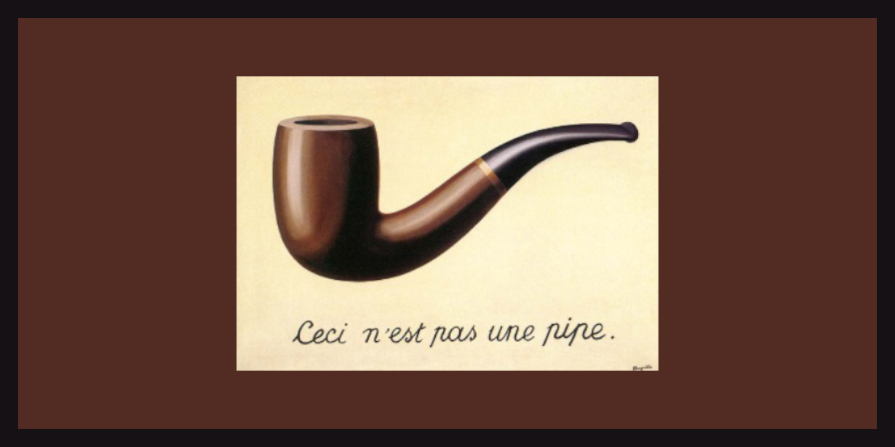
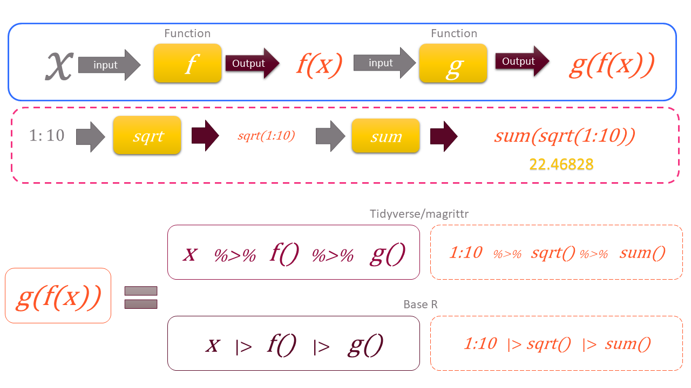

```{r}
#| include: false
source("_common.R")
```

# Pipes {#sec-pipes}
```{r echo=FALSE, message=FALSE, warning=FALSE}
library(magrittr)
```

Let us now meet *pipes*\index{pipes}, which make a chain of operations easy to write and to read. There are two pipes in R.

- `|>` is the native pipe of R, built into R since version 4.1. We use it throughout this book.
- `%>%` is the pipe from the package `magrittr`[@R-magrittr], loaded with the `tidyverse`. It came first, and is still common in code you will find in books and on the internet.

```{r fig-pipe2, echo=FALSE, fig.align='center', fig.show='hold', fig.cap="Magrittr, the R package, is named after the surrealist painter Rene' Magritte. His painting was self captioned, 'This is not a pipe.'", out.width="99%"}

```


`%>%` was the forerunner of the native pipe `|>`. Pipes express a sequence of operations on an object clearly, without creating an object at each step. Suppose we have to apply three functions, `FIRST`, `SECOND` and `THIRD`, to an object `OBJ`, in that order. We could write either
```
THIRD(SECOND(FIRST(OBJ)))
```
which has to be read from the inside out, or create intermediate objects which we do not really need,
```
OBJ1 <- FIRST(OBJ)
OBJ2 <- SECOND(OBJ1)
OBJ3 <- THIRD(OBJ2)
```
So we either give up readability, or clutter the workspace with objects like `OBJ1` and `OBJ2`. Pipes solve both problems at once. The pipe passes the result on its left as the *first argument* of the function on its right. With pipes we can write the above as either of these.
```
OBJ |> FIRST() |> SECOND() |> THIRD()
OBJ %>% FIRST() %>% SECOND() %>% THIRD()
```
Read `|>` as "and then". Take `OBJ`, *and then* apply `FIRST()`, *and then* `SECOND()`, *and then* `THIRD()`. A small example with amounts:

```{r}
amounts <- c(42000, 125000, 9800, 51000, 330000, 76000)
# the three largest amounts, in lakh
round(head(sort(amounts, decreasing = TRUE), 3) / 1e5, 2)
# the same with pipes
amounts |> sort(decreasing = TRUE) |> head(3) |> (\(x) round(x / 1e5, 2))()
```

::: callout-warning
## Caution
A pipe does not change the object it starts from. After the chain above, `amounts` still holds all six values in the original order. The result is only printed. To keep it, assign it to a new name, like `top3 <- amounts |> ...`. Otherwise a later step may use the old object by mistake.
:::

The real power of pipes shows with the tidyverse, where a whole analysis, filtering, grouping and summarising, reads as one sentence. We will use them in every chapter from @sec-DPLYRR onward.
A diagrammatic representation is given in @fig-pipe.

```{r fig-pipe, echo=FALSE, fig.align='center', fig.show='hold', fig.cap="A diagrammatic illustration of the pipe in base R and tidyverse", out.width="99%"}

```

Two questions may arise here.

1. What if the result on the left is needed in some argument other than the first?
2. Is there any difference between the two pipes, and which is better?

To answer these, we discuss the two pipes separately.

```{r fig-pipe3, echo=FALSE, fig.align='center', fig.show='hold', fig.cap="Using pipes in R", out.width="99%"}
knitr::include_graphics('images/pipes in R.png')
```


## Magrittr/Dplyr pipe `%>%`
The pipe passes the result on its left into the first argument of the function on its right. So `data %>% filter(col == 'A')` means `filter(data, col == 'A')`. But sometimes the result is needed in another argument. A simple example is the function `lm()`, whose `data` argument is the second. For such cases, `%>%` has the *placeholder* `.`, which stands for the result on the left. The filter example could be written as `data %>% filter(., col == 'A')`. With the placeholder, we can put the result wherever we want. See this example
```{r}
iris %>% lm(Sepal.Length ~ Sepal.Width, data = .)
```
Thus `x %>% f(y)` is equivalent to `f(x, y)` but `x %>% f(y, .)` is equivalent to `f(y, x)`.

## Base R pipe `|>`
R version 4.2.0 gave the native pipe a placeholder too, `_`, similar to the `.` of magrittr, but with a few differences.

- The argument where `_` is used must be *named*. So `f(y, z = x)` can be written as `x |> f(y, z = _)`.
- `_` can be used only once on the right side.

```{r}
iris |> lm(Sepal.Length ~ Sepal.Width, data = _) |> summary()
```
The magrittr pipe does not need the argument to be named. So `iris %>% lm(Sepal.Length ~ Sepal.Width, .)` works. But `iris |> lm(Sepal.Length ~ Sepal.Width, _)` gives an error. In such cases, we can use an anonymous function, `\(x)`, which we learnt in @sec-func. See these

```
# placeholder without named argument
iris |> lm(Sepal.Length ~ Sepal.Width, _)
```
```{r}
# Correct way to use unnamed argument
iris |> (\(d) lm(Sepal.Length ~ Sepal.Width, d))() |> summary()
```
The anonymous function is wrapped in parentheses and followed by `()`, so that the pipe sees a function call.

Since R 4.3, `_` can also start a chain of extractions, like `mtcars |> _$mpg`, or `x |> _[[1]]`.

Type ```` ?`|>` ```` in the console and see the help page for more details.

## Which pipe to use?

For most work, the two pipes are interchangeable. The differences are small.

| | <code>&#124;&gt;</code> | `%>%` |
|----------------------|------------------------|------------------------|
| Needs a package | No, built into R 4.1 and later | Yes, magrittr (loaded with tidyverse) |
| Placeholder | `_`, only with a named argument | `.`, anywhere |
| Function without `()` | Not allowed, <code>x &#124;&gt; head()</code> | Allowed, `x %>% head` |
| Speed | Slightly faster | Slightly slower |

: The two pipes compared {#tbl-pipes}

We use `|>` in this book, because it needs no package and is now the standard. In RStudio, the shortcut `Ctrl + Shift + M` types a pipe. To make it type `|>`, tick *Use native pipe operator* under *Tools > Global Options > Code*.

::: callout-tip
## Audit tip

A pipe reads as a sequence of audit steps. Take the payments, *and then* keep those of 2024-25, *and then* group by vendor, *and then* total them. Write each step on its own line, with a comment where the reason is not obvious. Your reviewer can then check the logic line by line, just like a working paper.
:::

## A suggested workflow

Here is a simple routine for writing a chain of steps with pipes.

1.  **Plan the steps in words.** Write the audit steps as one sentence joined by "and then". Each "and then" becomes one pipe.
2.  **Start with the data.** Begin the chain with the object, like the payments, and not with a function wrapped around it.
3.  **Use the native pipe.** Use `|>` in your own code. Tick *Use native pipe operator* under *Tools > Global Options > Code*, so that `Ctrl + Shift + M` types it.
4.  **Write one step per line.** End each line with the pipe. Add a comment where the reason for a step is not obvious.
5.  **Build the chain bit by bit.** Run the chain after adding each step, and check the result before adding the next one.
6.  **Handle other arguments.** When the result must go into an argument other than the first, use `_` with a named argument. If the argument has no name, use an anonymous function `\(x)`.
7.  **Recognise both pipes.** Read `%>%` in code from books and the internet as the same "and then". Its placeholder is `.`.

::: callout-important
## Remember

A pipe passes the result on its left as the first argument of the function on its right. Read it as "and then". A chain written one step per line reads like a working paper, so a reviewer can check it line by line.
:::

## Summary of functions used

| Operator | Package | What it does |
|-----------------------|----------------|--------------------------------|
| <code>&#124;&gt;</code> | base R (4.1 and later) | Pass the result on the left as the first argument of the function on the right |
| `_` | base R (4.2 and later) | Placeholder for the result, in a named argument |
| `%>%` | magrittr | The tidyverse pipe |
| `.` | magrittr | Placeholder for the result, in any argument |
| `\(x)` | base R (4.1 and later) | Short form of `function(x)`, for anonymous functions |

: Functions used in this chapter {#tbl-pipefunctions}
