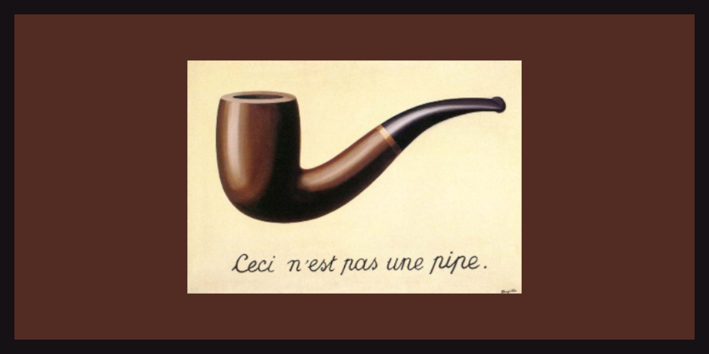

# Functions and operations in R {#func}

What is a function? Mathematically, a function $f$ is a relationship which map an input $x$ to an specific output, which is denoted as $f(x)$.  There are only two conditions i.e. every input should have an output, and same input if passed into same function multiple times, it should produce same output each time.  So if $x=y$ we should have $f(x)=f(y)$.  

```{r echo=FALSE, fig.show='hold', fig.align='center', fig.cap="Author's illustration of a function", out.width="99%"}
knitr::include_graphics("images/function.png")
```

For example `squaring` if considered on numbers is a function.  We denote this as $f(x)=x^2$.  Or, `square-root` on positive numbers is also a function.

Now there may be more than one input, let us assume three inputs `x`, `y` and `z` and our function's job is to add three times `x`, two times `z` and one time `y` together.  We will write this function as $f(x,y,z) = 3x+y+2z$.  Each programming language has some pre-defined functions.  Here inputs are usually termed as `arguments`.  Normally values to `arguments` should be passed by users, but many times there's a default value for these arguments. So if the value of that argument is not supplier by the user/coder explicitly, that function uses that default value silently and produces a result.  

R's engine then calculates the output as per definition of that function and gives us the output.  If that output is assigned to some variable R does not displays/prints anything but if function is performed only the output is displayed usually, with the exception that many times function is carried out silently and nothing is returned.

In this chapter we will learn about some of the pre-defined functions which shall be used in our data analysis operations.  We can also define our own custom functions which we will learn in chapter \@ref(cust).

As an example, `sum()` is a predefined function available in R, which produces sum of one or more vectors passed in the function as arguments.
```{r}
sum(1:10, 15:45)
```

To check the arguments available for any pre-defined function, we can use another function `args()` which take a _function name_ as an argument and returns all the available arguments to that function.  
```{r}
args(sum)
```

Here we see that there is an argument (which is anmed argument0 `na.rm` having a default value `FALSE`.  Actually, this argument silently takes default value and produces results.  But if `TRUE` is required as a value to this argument that need to be explicitly mentioned.
```{r}
sum(1:10, NA)
sum(1:10, NA, na.rm = TRUE)
```


To get the definition of any existing function, we may just type its name without parenthesis on console, and the definition will be returned as an output.

```{r}
sum
```

To get further help about any existing function, refer section \@ref(help).

## Custom Functions {#cust}

One of R’s greatest strengths is the user’s ability to add functions\index{custom function}. In fact, many of the functions in R are functions of existing functions. The structure of a function looks like this:

```
myfunctionname <- function(arg1, arg2, ... ){
  statements
  return(object)
}
```
**Note:** Objects in the function are local to the function. The object returned can be any data type, from scalar to list. 

Let’s take a look at an example.  We will create a function which will take 3 numbers, will give an output by adding thrice of first, second and twice of third.
```{r}
my_fun1 <- function(first,second,third){
  first*3+second+third*2
}
# let's check whether it is working as desired
my_fun1(3,1,10)
```
- If the arguments provided are not named, it will take all arguments in the order these are defined.
- However, we can provide named arguments in any order.  See this
```{r}
my_fun1(second=3, first=1, third=10)
```
- Partial matching of names are also allowed.  Example
```{r}
my_fun1(sec=3,fir=1,thi=10)
```
- We can also provide default values to any argument.  These default values are however, overridden when specific values are given.  See this example.
```{r}
# let's create a new function which adds twice the second argument to first argument, which in turn by default is 10
my_fun2 <- function(first=10, second){
  first+second*2
}
my_fun2(second = 10)
my_fun2(1, 10)
```
- There may be functions which do not require any argument.  See this example
```{r}
my_fun3 <- function(){
  print('Hi')
}
my_fun3()
```

### Special argument ellipsis `...` {-}

While searching for help of a function in r, you may have came across something like this `sum(..., na.rm = FALSE)`.  The three dots `...`\index{... ellipsis} here are referred to as ellipsis\index{ellipsis}.  Basically it means that the function is designed to take any number of named or unnamed arguments.

Thus it means we can provide any number of arguments in place of `...`.  Now the point to be noted here is that values to all agruments occurring after `...` must only be named.  See this example-
```{r}
sum(1:100, NA, TRUE)
sum(1:100, NA, na.rm = TRUE)
```
Now we can even use these three dots in our own custom functions.  Just unpack these before writing the actual statement for that function.  See this simple example-
```{r}
my_ellipsis_func <- function(...){
  l <- list(...) # unpack ellipsis
  length(l) # return length of l
}
my_ellipsis_func(1:10, 11:20, 'a string') # we are passing three arguments
```

### Environment issues {-}

- Any of the argument values are not saved/updated in global environment\index{global environment}.  See this example
```{r}
x <- 10
my_fun4 <- function(x){
  x*2
}
my_fun4(2)
x
```
- Even if we create another variable inside the function, that variable is not available outside that function's environment.
```{r}
y <- 5
my_fun5 <- function(){
  y <- 1
  return(y)
}
my_fun5()
y
```
- If however, we want to create a variable (or update existing variable) inside the function intentionally, we may use `forced assignment` denoted as `<<-`.  See this example
```{r}
y <- 5
my_fun5 <- function(){
  y <<- 1
  return(y)
}
my_fun5()
y
```
- As already stated, we can create object of any type using a custom function.
```{r}
my_list_fun <- function(x){
  list(sum=sum(x),
       mean = mean(x),
       sd = sd(x))
}
my_list_fun(1:10)
```

# Existing and useful functions in base R
R has a lot of inbuilt/existing functions that are useful and therefore it is good to know about them.  Let us discuss a few of these existing functions which are useful for data analytics and other allied jobs.

Firstly, let's learn logical operators that will be useful to check various conditions.  For those who doesn't know what operators are, they may simply think of operators being special kind of functions having exactly two arguments.

## Conditions and logical operators/operands
Table: (\#tab:table2) Conditions and logical operators/operands

```{r table2, echo=FALSE, message=FALSE, warnings=FALSE, results='asis', fig.env="table", fig.cap="A dummy"}
tabl <- "
| Operator/ function      | Meaning             | Example                    |
|:-------------:|:-----------------------------|:--------------------------------------------|
|   `==`        | Is RHS equal to LHS?             | `5 == 2` will return FALSE |
|               |                                  | `'Anil' == 'anil'` is FALSE |
| `!=` | Is RHS not equal to LHS? | `'ABCD' != 'abcd'` is TRUE |
|   `>=`        | Is LHS greater than or equal to RHS?      | `5 >= 2` will return TRUE  |
| `<=`          | Is LHS less than or equal to RHS?      | `15 <= 2` will return FALSE|
| `>`  | Is LHS strictly greater than RHS? | `2 > 2` will return FALSE |
| `<`  | Is LHS strictly less than RHS? | `12 < 12` will return FALSE |
| `is.na()` | Whether the argument passed is NA | `is.na(NA)` is TRUE |
| `is.null()` | Whether the argument passed is null | `is.null(NA)` is FALSE |
| `|` | Logical OR | `TRUE | FALSE ` will return `TRUE` |
| `&` | Logical AND | `TRUE & FALSE ` will return `FALSE` |
| `!` | Logical NOT | `!TRUE` will return `FALSE` |
| `||` | Element wise Logical OR | Examines only the first element of the operands resulting into a single length logical vector |
| `&&` | Element wise Logical AND | Examines only the first element of the operands resulting into a single length logical vector |
| `%in%` | LHS __IN__ RHS |Checks whether LHS elements are present in RHS vector |

"
cat(tabl) 
```

## Vectorisation of operations and functions {-}

All the above mentioned operators are __vectorised__.  Except `||` and `&&` will return vector of same length as we are comparing.  Check
```{r}
LETTERS[1:4] == letters[1:4]
10:1 >= 1:10
# TRUE will act as 1 and FALSE as 0
x <- c(TRUE, FALSE, FALSE, TRUE)
y <- c(1, 0, 1, 10)
x == y
# Examples of element wise operations
x & y
x | y

# character strings may be checked for alphabetic order
'ABCD' >= 'AACD'
```

## Recycling
__Recycling__ rules apply when two vectors are not of equal length.  See these examples.
```{r}
# Notice that results are displayed silently
LETTERS[1:4] == 'A'
#Notice that results are displayed with a warning
LETTERS[1:5] == LETTERS[1:3]
```

The __operator `%in%`__ behaves slightly different from above.  Each searches each element of LHS in RHS and gives result in a logical vector equal to length of LHS vector.  See these examples carefully.
```{r}
'A' %in% LETTERS
LETTERS %in% LETTERS[1:4]
```

## Handling Missing values `NA` in these operations
While checking for any condition to be `TRUE` or `FALSE` missing values `NA` and/or `NaN` should be handled carefully or a bug may be introduced.  See these examples-
```{r}
FALSE != NA
TRUE != NA
```
Thus, if any of the condition is evaluated on a vector, we can have `NA` in our output along with `TRUE` and `FALSE`.  See this example
```{r}
x <- c(1, 5, 15, NA, 2, 3)
x <= 5
```
These missing values however behaves slightly different with logical operators `&` `|`.  See these examples.
```{r}
TRUE | NA
FALSE & NA
```

## Use of above logical operators for subsetting
Since the logical operations on vectors gives a `logical` vector as output, these can be used for sub-setting as well.  See these examples.
```{r}
my_ages <- c(40, 45, 31, 51, 25, 27, 59, 45)
# filter ages greater than or equal to 30
my_ages[my_ages >= 30]

my_names <- c("Andrew", "Bob", "Carl", "Daven", "Earl")
# filter names which start with alphabet either A, B or C
my_names[my_names <= "D"]
```

## Conditions with `ifelse`
Syntax `ifelse(test, yes, no)` will be used to return value (of same shape as `test`) which is filled with elements selected from either `yes` or `no` depending on whether the elements of `test` are `TRUE` or `FALSE`.  See this example 
```{r}
x <- c(1:5, NA, 16:20)
ifelse(x>5, 'Greater than 5', 'Upto 5')
```

## Functions `all()` and `any()` 
These are shortcut functions to tell us whether `all` or `any` of the elements of given object are `TRUE`.  See This example
```{r}
x <- 11:20
all(x > 5)
any(x > 20)
```

All of the above mentioned operators (along with those listed in section \@ref(calculator)) are __vectorised__. Check these examples.
```{r}
x <- 1:5
y <- 6:10

x + y
x - y
x * y
x / y
x ^ y
# Caution: here RHS is not a vector
y %% 3
y %/% 3
```
__Recycling__ also applies on mathematical operators.  See these examples and notice when R gives results silently and when with a warning.
```{r}
10:15 + 4
100:110 - 50
# when length of one vector is multiple of length of smaller vector
x <- c(5, 2, 7, 9)
y <- c(7, 8)
x + y
# when length of one vector is not multiple of length of smaller vector
x + c(1, 2, 3)
```

All the above-mentioned operators/functions may also be used on matrices, arrays of larger dimension, since we have already seen that matrices/arrays are actually vectors at the core.
```{r}
mat1 <- matrix()
```

## Common arithmetical Functions
Table: (\#tab:table4) Common Arithmetical Functions
```{r table4, echo=FALSE, message=FALSE, warnings=FALSE, results='asis'}
tabl2 <- "
| Function      | Meaning             | Input                    | Output   |
|:-------------:|:----------------------|:-----------------------|:-------------------------------|
| `sum()` | Adds all elements  | One or more Vector, matrix, array | Vector having 1 element only |
| `prod()` | Returns product of all elements | One or more Vector, matrix, array | Vector having 1 element only |
| `mean()` | Returns the arithmetic mean | One Vector, matrix, array | Vector having 1 element only |
| `max()` | Returns maximum value | One or more Vector, matrix, array | Vector having 1 element only |
| `min()` | Returns minimum value | One or more Vector, matrix, array | Vector having 1 element only |
| `ceiling()` | Returns integer(s) not less than given values | One Vector, matrix, array | Vector, matrix, array having same `dim` |
| `floor()` | Returns largest integers not greater than given values | One Vector, matrix, array | Vector, matrix, array having same `dim` |
| `trunc()` | returns integers formed by truncating the values towards 0 | One Vector, matrix, array | Vector, matrix, array having same `dim` |
| `round(x, digits = 0)` | Rounds the given value(s) to number of decimal places provided | One Vector, matrix, array | Vector, matrix, array having same `dim` |
| `signif(x, digits = 6)` | Round to `significant` digits | One Vector, matrix, array | Vector, matrix, array having same `dim` |
| `factorial()` | Returns factorial | One Vector, matrix, array of `integer` type | Vector having 1 element |
| `sqrt()` | Returns square root | One Vector, matrix, array | Vector, matrix, array having same `dim` |
| `log10()` or `log2()` | Logrithm with base 10 or 2 respectively | One Vector, matrix, array | Vector, matrix, array having same `dim` |
| `exp(x)` | returns exponential | One Vector, matrix, array | Vector, matrix, array having same `dim` |
"
cat(tabl2) 
```

See these examples.
```{r}
sum(1:100, 1:10)

Mat1 <- matrix(1:10, nrow = 2)
Mat2 <- matrix(1:4, nrow = 2)

prod(Mat1, Mat2)
sqrt(Mat2)
log10(Mat1)
factorial(10:1)
```

### Missing values 
If the vector on which we are calculating `sum` etc., has missing values, we will have to use argument `na.rm = TRUE` in these functions (Check documentation of these functions individually once).  See these examples -
```{r}
x <- c(1:50, NA)
sum(x)
sum(x, na.rm = TRUE)
mean(x, na.rm = TRUE)
```

## Some Statistical functions
Table: (\#tab:table5) Some commonly used Statistical Functions
```{r table5, echo=FALSE, message=FALSE, warnings=FALSE, results='asis'}
tabl3 <- "
| Function      | Meaning             | Input                    | Output   |
|:-------------:|:----------------------|:-----------------------|:-------------------------------|
| `sd()` | Returns standard deviation | One Vector, matrix, array | Vector having 1 element only |
| `var()` | Returns variance | One or more Vector, matrix, array | Vector having 1 element only |
| `median()` | Returns median value | One Vector, matrix, array | Vector having 1 element only |
| `range()` | Returns range | One Vector, matrix, array | Vector having 2 elements |
| `IQR()` | Computes interquartile range of the x values | One Vector, matrix, array | Vector having 1 element only |
| `quantile()` | Computes percentile of given values for the given probabilities in `probs` argument | One Vector, matrix, array | Named Vector having 5 elements by default, OR equal to the length of `probs` vector given |

"
cat(tabl3) 
```
Examples-
```{r}
median(1:100)
range(1:100, 45, 789)
quantile(1:100)
quantile(0:100, probs = 1:10 / 10)
```

## Functions related to sampling and probability distributions {#prob}

### Set the random seed with `set.seed()`
It is a way to specify the random seed which is an integer vector, containing the random number generator (RNG) state for random number generation in R.  It does not given any output but makes your code reproducible for further use.  

### Generate random numbers with `rnorm()` / `runif()` / `rpois()` etc.
Used to generate random numbers from normal, uniform and poisson distributions respectively.  Of course there are numerous other functions not only to calculate random numbers but to calculate probability, density of these and other probability distributions (such as binomial, t), but those are beyond the scope of this book.  E.g.
```{r}
rnorm(n=10) #default mean is 0 and SD is 1
rnorm(n=10) # notice these will produce different results each time.
# If however seed is fixed as above, these will be reproducible.
set.seed(123)
runif(10) # default min and max are 0 and 1 respectively
set.seed(123)
runif(10)
```

### Random Sample with `sample()`
Used to take a sample of the specified `size` from the elements of x using either with or without replacement. E.g.
```{r}
set.seed(123)
sample(LETTERS, 5, replace = FALSE)
set.seed(111)
sample(LETTERS, 15, replace = TRUE)
```
If the sampling is proportionate to given `probabilities` the same can be provided in `prob` argument.
```{r}
set.seed(12)
sample(LETTERS, 5, replace = FALSE, prob = 1:26)
```

## Other Mathematical functions

### Progressive calculations with `cumsum()` /`cumprod()`
Used to calculate running total or product.  Output vector length will be equal to that of input vector.
```{r}
cumsum(1:10)
cumprod(-5:5)
```
Other similar functions like `cummax()` (cumulative maximum) and `cummin()` may also be useful.
```{r}
set.seed(1)
x <- sample(1:100, 10)
cummin(x)
cummax(x)
```

### Progressive difference `diff()` 
Used to calculate running difference (difference between two consecutive elements) in the given numeric vector. Output will be shorter by one element. E.g.
```{r}
set.seed(123)
x <- rnorm(10)
x
diff(x)
length(diff(x))
```

## String Manipulation functions

### Concatenate strings with `paste()` and `paste0()` 
R's inbuilt function `paste()` concatenates each element of one or more vectors given as argument.  Argument `sep` is used to provide separator is any, which by default is a space i.e. `" "`.  On the other `sep` argument is not available in `paste0` which thus concatenates elements without any separator.
```{r}
paste(LETTERS, letters)
paste0(letters, '_', 1:26) # check replication here
```
_Note:_ that both `paste` and `paste0` returns vector with length equal to length of larger vector.  __Thus if the requirement is to concatenate each of the element in the given vector(s), use another argument `collapse`.  See this example.__
```{r}
paste0(letters, 1:26, collapse = '+')
```

### Functions `startsWith()` / `endsWith()` 
To check whether the given string vector say `x` start or end with string (entries of) `prefix` or `suffix` we can use `startsWith(x, prefix)` or `endsWith(x, suffix)` respectively.  E.g.
```{r}
x <- c('apples', 'oranges', 'apples and oranges', 'oranges and apples', 'apricots')
startsWith(x, 'apples')
startsWith(x, 'ap')
endsWith(x, 'oranges')

```
Note that both these functions return logical vectors having same length as `x`.

### Check number of characters in string vector using `nchar()` 
To count the number of characters in each of the element in string vector, say `x`, we can use `nchar(x)` which will return a vector of integer types. E.g.
```{r}
nchar(x)
y <- c('', ' ', '   ', NA)
nchar(y)
```

### Change case using `toupper()` / `tolower()` 
Changes the case of given vector to all UPPER or lower case respectively.
Example-
```{r}
x <- c('Andrew', 'Bob')
tolower(x)
toupper(x)
```


### Extract a portion of string using `substr()` {-}
To extract the characters from a given vector say `x` from a given `start` position to `stop` position (both being integers) we will use `substr(x, start, stop)`.  E.g.
```{r}
substr(x, 2, 8)
```

### Split a character vector using `strsplit()` 
To split the elements of a character vector `x` into sub-strings according to the matches to sub-string `split` within them.  E.g.
```{r}
strsplit(x, split = ' ')
```
**Notice that output will be of `list` type.**

### Replace portions of string vectors `sub()` / `gsub()` 

These two functions are used to perform replacement of the first and all matches respectively.  E.g.
```{r}
#Replace only first match
sub(pattern = 'B', replacement = '12', x, ignore.case = TRUE)
# Replace all matches
gsub(pattern = 'B', replacement = '12', x, ignore.case = TRUE)
```

### Match patterns using `grep()` / `grepl()` / `regexpr()` / `gregexpr()` 
These functions are used to match string passed as argument `pattern` under a string vector.  These four however, differ in output/results.  E.g.
```{r}
grep(pattern = 'an', x) # will give indices.  
#                         Output will be integer vector and length may be shorter than that of `x`
grepl(pattern = 'an', x) # will give a logical vector of same length as `x`
regexpr(pattern = 'an', x) # output will have multiple attributes
```
Note that `regexpr()` outputs the character position of first instance of pattern match within the elements of given vector.
`gregexpr()` is same as `regexpr()` but finds all instances of pattern. Output will be in `list` format. E.g.
```{r}
gregexpr(pattern = 'an', x)
```

## Other functions

### Transpose a matrix using `t()` 
Used to return transpose of given matrix. E.g.
```{r}
mat <- outer(1:5, 1:5, FUN = \(x, y) paste0('A', x, y))
mat
t(mat)
```

### Generate a frequency table using `table()` 
Returns a frequency/contingency table of the counts at each combination of factor levels.  E.g.
```{r}
set.seed(123)
x <- sample(LETTERS[1:5], 100, replace = TRUE)
table(x)
```
If more than one argument is passed-
```{r}
set.seed(1234)
df <- data.frame(State_code = x,
                 Code2 = sample(LETTERS[11:15], 100, replace = TRUE))
my_table <- table(df$State_code, df$Code2)
my_table
```

### Generate proportion of frequencies using `prop.table()` 
This function takes a table object as input and calculate the proportion of frequencies.
```{r}
prop.table(my_table)
```


### Column-wise or Row-wise sums using `colSums()` / `rowSums()` 
Used to sum rows/columns in a matrix/data.frame.  E.g.
```{r}
# Row sums
rowSums(my_table)
# Col sums
colSums(my_table)
```
Note Similar to `colSums()`/ `rowSums()` we also have `colMeans()` and `rowMeans()`.
```{r}
rowMeans(my_table)
```

### Extract unique values using `unique()` 
Used to extract only unique values/elements from the given vector. E.g.
```{r}
unique(x) # note the output
```

### Check if two vectors are identical using `identical()` 
Used to check whether two given vectors/objects are identical.
```{r}
identical(unique(x), LETTERS)
```

### Retreive duplicate items in a vector using `duplicated()` 
Used to check which elements have already appeared in the vector and are thus duplicate.
```{r}
set.seed(123)
x <- sample(LETTERS[1:5], 8, replace = TRUE)
x
duplicated(x)
```

### Generate sequences using other objects with `seq_len()` / `seq_along()` 
Used to generate sequence of given integer length starting with 1, or with length equal to given vector, respectively.  E.g.
```{r}
seq_len(5)
x <- c('Andrew', 'Bob')
seq_along(x)
```

### Divide a vector into categories (factor) using `cut()` {#cutt}
The function divides the range of `x` into intervals and codes the values in `x` according to which interval they fall. The leftmost interval corresponds to level one, the next leftmost to level two and so on.  The output vector will be of type `factor.`  

Example-1:
```{r}
x <- c(1,2,3,4,5,2,3,4,5,6,7)
cut(x, 3)
```
Example-2:
```{r}
cut(x, 3, dig.lab = 1, ordered_result = TRUE)
```
**Note:** that the output `factor` above is ordered.

### Scale the columns of a matrix using `scale()` 
Used to scale the columns of a numeric matrix.
```{r}
x <- matrix(1:10, ncol = 2)
x
scale(x)
```
**Note:** The output will always be of a matrix type with two more attributes.  See this example
```{r}
scale(1:5)
```

### Output the results using `cat()` {#cat}
Outputs the objects, concatenating the representations. `cat` performs much less conversion than `print`.
```{r}
cat('ABCD')
```
**Note:** that indices are now _not printed._  `cat` may print objects also.  Example-2:
```{r}
cat(month.name)
```

`cat` is useful to print _special characters._  Example-3:
```{r}
cat('Budget Allocation is \u20b91.5 crore')
```

### Sort a vector using `sort()` 
Used to **sort** the given vector.  Example-1:
```{r}
vec <- c(5, 8, 4, 1, 6)
sort(vec)
```
Argumemt `decreasing = TRUE` is used to sort the vector in descending order instead of default ascending order.
Example-2:
```{r}
sort(vec, decreasing =  TRUE)
```


### Arrange the elements of a vector using `order()` 
In contrast to `sort()` explained above, `order()` returns the indices of given vector in ascending order.  Example
```{r}
order(vec)
```
Thus, `sort(vec)` will essentially perform the same operations as `vec[order(vec)]`.  We may check-
```{r}
identical(vec[order(vec)], sort(vec))
```

### Check structure using `str()` 
The short `str` is not to be confused with strings as it instead is short for `structure`.  Thus, `str` returns structure of given object.  Example
```{r}
str(vec)
```

Extremely useful when we need to inspect data frames.
```{r}
str(iris)
```

### Generate a summary using `summary()` {-}
In addition to `str` explained above, `summary()` is also useful is getting result summaries of given objects.  Example-1: When given object is vector
```{r}
summary(vec)
```
We observe that when numeric vector is passed, it produces quantile summary.  Example-2: When input object is data frame.
```{r}
summary(iris)
```


# Pipes in R
```{r echo=FALSE, message=FALSE, warning=FALSE}
library(magrittr)
```

Now here I would like to introduce you with the concept of pipes\index{pipes} in R. There are two types of pipes used-

- `|>` is native pipe of R.  It was introduced in R version 4.1
- `%>%` pipe introduced in `magrittr` package[@R-magrittr], now part of `tidyverse` which we will use extensively in our data analysis tasks.

```{r pipe2, echo=FALSE, fig.align='center', fig.show='hold', fig.cap="Magrittr, the R package, is named after the surrealist painter Rene' Magritte. His painting was self captioned, 'This is not a pipe.'", out.width="99%"}

```


Actually `%>%` is predecessor to native R's pipe `|>`.  The pipes are powerful tools for clearly expressing a sequence of operations that transform an object, without the need of actually creating that object in each step.  Let us understand this concept with the following example.  Suppose, we have to three functions say `FIRST` , `SECOND` and `THIRD` to an object `OBJ` in sequence.  So the order of operations would either be like-
```
THIRD(SECOND(FIRST(OBJ)))
```
or with creating intermediate objects, when instead we actually do not need those intermediate objects. 
```
OBJ1 <- FIRST(OBJ)
OBJ2 <- SECOND(OBJ1)
OBJ3 <- THIRD(OBJ2)
```
Here actually we do not require `OBJ1` and `OBJ2`.  So in these cases we either have to compromise with the readability of code i.e. inside out or have to create unwanted objects.  Pipes actually mitigate both these issues simultaneously.  With pipes we can write above operations as either of these -
```
OBJ1 |> FIRST() |> SECOND() |> THIRD()
OBJ1 %>% FIRST() %>% SECOND() %>% THIRD()
```
A diagrammatic representation is given in figure \@ref(fig:pipe).

```{r pipe, echo=FALSE, fig.align='center', fig.show='hold', fig.cap="A diagrammtic illustation of Pipe concept in base R and tidyverse", out.width="99%"}
knitr::include_graphics("images/pipe.png")
```

Now two questions may arise here-

1. What if there are multiple arguments to be passed in any of the operations?
2. Is there any difference between the two pipes?  If yes, which is better OR what are the pros and cons of each?

To answer these questions, we will discuss both pipes separately.

```{r pipe3, echo=FALSE, fig.align='center', fig.show='hold', fig.cap="Using pipes in R", out.width="99%"}
knitr::include_graphics('images/pipes in R.png')
```


## Magrittr/Dplyr pipe `%>%`
Pipes usually pass result of previous operation silently into first argument of next/right expression.  So `data %>% filter(col == 'A')` means `filter(data, col=='A')`.  But there may be cases when result of previous (LHS) expression is required to be passed on second or other argument in RHS expression.  A simple example may be of function `lm`, where `data` argument is second argument. In such cases we can make use special placeholder `.` as result of LHS specifically.  In other words aforesaid filter example can be written with placeholder as `data %>% filter(. , col == 'A')`.  Now using this placeholder we can use result of LHS wherever we want.  See this example
```{r}
iris %>% lm(Sepal.Length ~ Sepal.Width, data = .)
```
Thus `x %>% f(y)` is equivalent to `f(x, y)` but `x %>% f(y, .)` is equivalent to `f(y, x)`.

## Base R pipe `|>` (Version 4.2.0 +)
R version 4.2.0 introduced concept of placeholder `_` similar to dplyr/magrittr, but with a few differences.

- The argument where `_` is to be used, must be named.  So `f(y, z = x)` can be written as `x |> f(y, z= _)`.

```{r}
iris |> lm(Sepal.Length ~ Sepal.Width, data = _) |> summary()
```
The requirement of named argument is not there in dplyr pipe.  So essentially, `iris %>% lm(Sepal.Length ~ Sepal.Width, .)` will also work. But in base R `iris |> lm(Sepal.Length ~ Sepal.Width, _)` would not work and throw an error.  Thus, in cases where the argument of placeholder is not named, we have to use anonymous function. See these-

```
# placeholder without named argument
iris |> lm(Sepal.Length ~ Sepal.Width, _)
```
```{r}
# Correct way to use unnamed argument
iris |> {\(.x) lm(Sepal.Length ~ Sepal.Width, .x)}() |> summary()
```
Type ```` ?`|>` ```` in console and see help page for more details.

