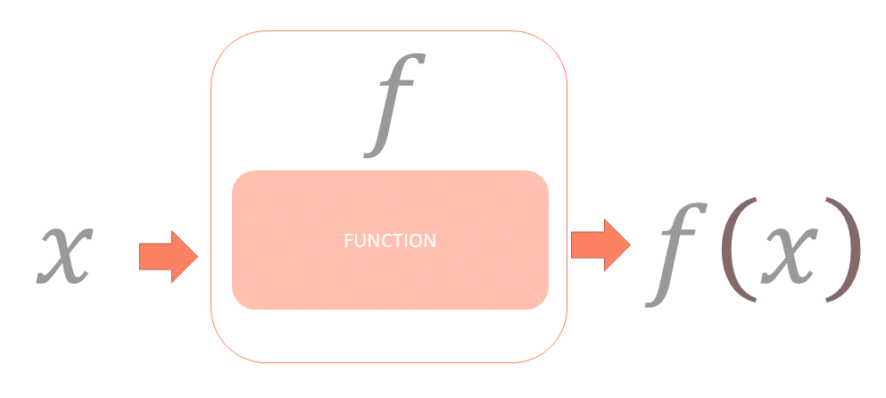

```{r}
#| include: false
source("_common.R")
```

# Functions and operations in R {#sec-func}

What is a function? Mathematically, a function $f$ is a relationship which map an input $x$ to an specific output, which is denoted as $f(x)$.  There are only two conditions i.e. every input should have an output, and same input if passed into same function multiple times, it should produce same output each time.  So if $x=y$ we should have $f(x)=f(y)$.  

```{r echo=FALSE, fig.show='hold', fig.align='center', fig.cap="Author's illustration of a function", out.width="99%"}

```

For example `squaring` if considered on numbers is a function.  We denote this as $f(x)=x^2$.  Or, `square-root` on positive numbers is also a function.

Now there may be more than one input, let us assume three inputs `x`, `y` and `z` and our function's job is to add three times `x`, two times `z` and one time `y` together.  We will write this function as $f(x,y,z) = 3x+y+2z$.  Each programming language has some pre-defined functions.  Here inputs are usually termed as `arguments`.  Normally values to `arguments` should be passed by users, but many times there's a default value for these arguments. So if the value of that argument is not supplier by the user/coder explicitly, that function uses that default value silently and produces a result.  

R's engine then calculates the output as per definition of that function and gives us the output.  If that output is assigned to some variable R does not displays/prints anything but if function is performed only the output is displayed usually, with the exception that many times function is carried out silently and nothing is returned.

In this chapter we will learn about some of the pre-defined functions which shall be used in our data analysis operations.  We can also define our own custom functions which we will learn in @sec-cust.

As an example, `sum()` is a predefined function available in R, which produces sum of one or more vectors passed in the function as arguments.
```{r}
sum(1:10, 15:45)
```

To check the arguments available for any pre-defined function, we can use another function `args()` which take a _function name_ as an argument and returns all the available arguments to that function.  
```{r}
args(sum)
```

Here we see that there is an argument (which is anmed argument0 `na.rm` having a default value `FALSE`.  Actually, this argument silently takes default value and produces results.  But if `TRUE` is required as a value to this argument that need to be explicitly mentioned.
```{r}
sum(1:10, NA)
sum(1:10, NA, na.rm = TRUE)
```


To get the definition of any existing function, we may just type its name without parenthesis on console, and the definition will be returned as an output.

```{r}
sum
```

To get further help about any existing function, refer @sec-help.

## Custom Functions {#sec-cust}

One of R’s greatest strengths is the user’s ability to add functions\index{custom function}. In fact, many of the functions in R are functions of existing functions. The structure of a function looks like this:

```
myfunctionname <- function(arg1, arg2, ... ){
  statements
  return(object)
}
```
**Note:** Objects in the function are local to the function. The object returned can be any data type, from scalar to list. 

Let’s take a look at an example.  We will create a function which will take 3 numbers, will give an output by adding thrice of first, second and twice of third.
```{r}
my_fun1 <- function(first,second,third){
  first*3+second+third*2
}
# let's check whether it is working as desired
my_fun1(3,1,10)
```
- If the arguments provided are not named, it will take all arguments in the order these are defined.
- However, we can provide named arguments in any order.  See this
```{r}
my_fun1(second=3, first=1, third=10)
```
- Partial matching of names are also allowed.  Example
```{r}
my_fun1(sec=3,fir=1,thi=10)
```
- We can also provide default values to any argument.  These default values are however, overridden when specific values are given.  See this example.
```{r}
# let's create a new function which adds twice the second argument to first argument, which in turn by default is 10
my_fun2 <- function(first=10, second){
  first+second*2
}
my_fun2(second = 10)
my_fun2(1, 10)
```
- There may be functions which do not require any argument.  See this example
```{r}
my_fun3 <- function(){
  print('Hi')
}
my_fun3()
```

### Special argument ellipsis `...` {-}

While searching for help of a function in r, you may have came across something like this `sum(..., na.rm = FALSE)`.  The three dots `...`\index{... ellipsis} here are referred to as ellipsis\index{ellipsis}.  Basically it means that the function is designed to take any number of named or unnamed arguments.

Thus it means we can provide any number of arguments in place of `...`.  Now the point to be noted here is that values to all agruments occurring after `...` must only be named.  See this example-
```{r}
sum(1:100, NA, TRUE)
sum(1:100, NA, na.rm = TRUE)
```
Now we can even use these three dots in our own custom functions.  Just unpack these before writing the actual statement for that function.  See this simple example-
```{r}
my_ellipsis_func <- function(...){
  l <- list(...) # unpack ellipsis
  length(l) # return length of l
}
my_ellipsis_func(1:10, 11:20, 'a string') # we are passing three arguments
```

### Environment issues {-}

- Any of the argument values are not saved/updated in global environment\index{global environment}.  See this example
```{r}
x <- 10
my_fun4 <- function(x){
  x*2
}
my_fun4(2)
x
```
- Even if we create another variable inside the function, that variable is not available outside that function's environment.
```{r}
y <- 5
my_fun5 <- function(){
  y <- 1
  return(y)
}
my_fun5()
y
```
- If however, we want to create a variable (or update existing variable) inside the function intentionally, we may use `forced assignment` denoted as `<<-`.  See this example
```{r}
y <- 5
my_fun5 <- function(){
  y <<- 1
  return(y)
}
my_fun5()
y
```
- As already stated, we can create object of any type using a custom function.
```{r}
my_list_fun <- function(x){
  list(sum=sum(x),
       mean = mean(x),
       sd = sd(x))
}
my_list_fun(1:10)
```

