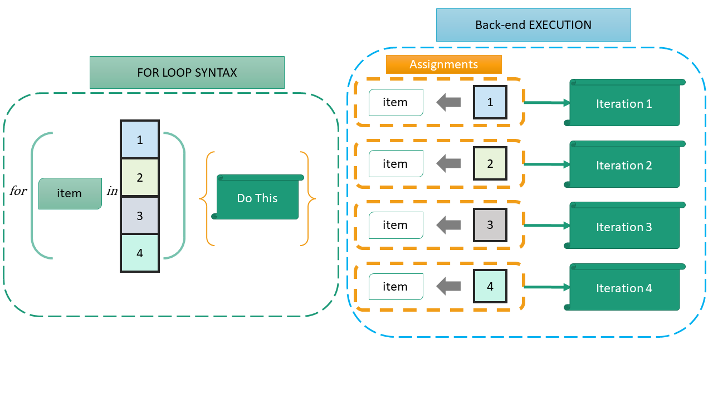

# Control statements
In the previous chapter we learnt about many of the useful pre-built functions in R.  In this chapter we will learn how to create customized functions suited to our needs.

**_Though these are core concepts of a programming language, yet a reading to this chapter is advised for better understanding and better application while using r for data analytics._**

## Control flow/Loops

### `if else` {-}
The basic form(s) of `if else` \index{if else statement}statement in R, are-
```
if (test) do_this_if_true
if (test) do_this_if_true else else_do_this
```
So, if `test` is true, `do_this_if_true` will be performed and optionally if `test` is not true `else_do_this` will be performed.  See this example-
```{r}
x <- 50
if(x < 10){
  'Smaller than 10'
} else {
  '10 or more'
}
```
**Note** that the `if`/`if else` are evaluated for a single `TRUE` or `FALSE` i.e. this control flow is **not vectorised** as we have in the case of `ifelse()` function which was vectorised.

### `for` loop {-}
The `for` loops \index{for loops}in r are used to iterate over _given_ items.  So, the basic structure of these loops are -

```
for(item in vector) perform_some_action

# OR

for(item in vector) {
  perform_some_action
}
```

Thus, for each item in `vector`, `perform_some_action` is called once; updating the value of item each time.  This can be understood by the following simple example-
```{r}
for(i in 1:3){
  print(i)
}
```
Conventionally `i` has been used in above example to iterate over given vector `1:3`, however any other symbol may also be used.
```{r}
for(item in 1:3){
  print(item)
}
```
If we use the name of any existing variable as `item` to iterate over the given object, `for loop` assigns the `item` to the current environment, overwriting any existing variable with the same name.  See this example -
```{r}
x <- 500
for(x in 1:3){
  # do nothing
}
x
```

```{r echo=FALSE, fig.cap="A Diagrammatic representation of For Loop", fig.align='center', fig.show='hold', out.width="99%"}

```

The idea can also used to iterate over any object any *number of times* as we want.  See these two examples.

Example-1
```{r}
my_names <- c('Andrew', 'Bob', 'Charles', 'Dylan', 'Edward')
# If we want first 4 elements
for(i in 1:4){
  print(my_names[i])
}
```
Example-2
```{r}
# if we want all elements
for(i in seq_along(my_names)){
  print(my_names[i])
}
```

There are 2 ways to terminate any `for loop` early-

- `next` which exits the current iteration only\index{next}
- `break` which breaks the entire loop.\index{break}

See these examples.

Example-1
```{r}
for(i in 1:5){
  if (i == 4){
    next
  }
  print(i)
}
```
Example-2
```{r}
for(i in 1:5){
  if (i == 4){
    break
  }
  print(i)
}
```

### `while` loop {-}
We have seen that `for` loop is used to iterate over a set of `known values` or at least known number of times.  If however, we want to perform some iterative action unknown number of times, we may use `while` loop\index{while loop} which iterates till a given `condition` is `TRUE`.  Another option is to have `repeat` loop\index{repeat loop} which can be used to iterate any number of times till it encounters a `break`.

The basic syntax of `while` loop is-
```
while (condition) action
```
See these examples-

Example-1
```{r}
i <- 1
while(i <=4){
  print(LETTERS[i])
  i <- i+1
}
```
We may check the value of `i` here after executing the loop
```{r}
i
```
Example-2: 
```{r}
i <- 4
while(i >=0){
  print(LETTERS[i])
  i <- i-1
}
```
**Note:** We have to make sure that the statements inside the brackets modify the `while condition` so that sooner or later the given condition is no longer `TRUE` otherwise the loop will never end and will go on forever.

```{r echo=FALSE, fig.cap="Author's illustration of While Loop", fig.align='center', fig.show='hold', out.width="99%"}
knitr::include_graphics("images/while_loop.png")
```

> **_Looping in R can be inefficient and time consuming when you’re processing the rows or columns of large data-sets. Even one of greatest feature in R is its parallel processing of vector objects.  Thus, whenever possible, it’s better to use R’s built-in numerical and character functions in conjunction with the `apply` family of functions.(We will discuss these in detail in the chapter related to functional programming)_**


