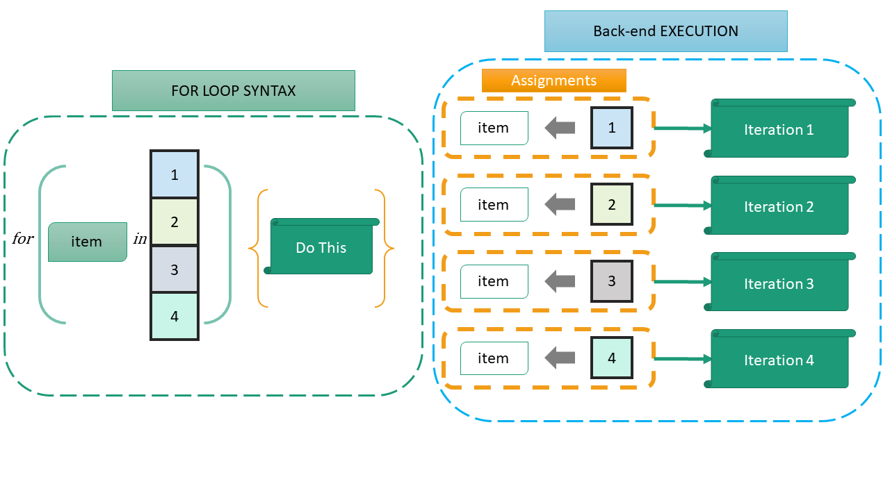
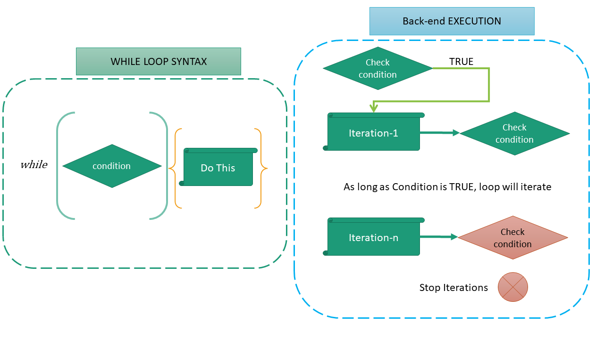

```{r}
#| include: false
source("_common.R")
```

# Control statements {#sec-control}
So far our code has run line by line, from top to bottom. *Control statements* change this flow. `if` and `else` run some code only when a condition holds, and *loops* (`for`, `while` and `repeat`) run some code again and again. Together with functions (@sec-func), they let us automate any task.

In data analysis we need them less than in other programming, because R's functions work on whole vectors at once, and the tidyverse handles most repetition for us. Still, they are core concepts of any programming language, and are needed often enough, for example to process a folder of files one by one, or inside our own functions.

## Control flow/Loops

### `if else` {-}
The basic form(s) of `if else` \index{if else statement}statement in R are
```
if (test) do_this_if_true
if (test) do_this_if_true else else_do_this
```
So, if `test` is `TRUE`, `do_this_if_true` is run, and, optionally, if it is `FALSE`, `else_do_this` is run. See this example.
```{r}
x <- 50
if(x < 10){
  'Smaller than 10'
} else {
  '10 or more'
}
```
Several conditions can be chained with `else if`. They are checked in order, and the first one which is `TRUE` decides. Let us write a function which tells the authority competent to sanction an expenditure, under some made-up financial powers.

```{r}
sanctioning_authority <- function(amount) {
  if (amount <= 50000) {
    "Section Officer"
  } else if (amount <= 500000) {
    "Deputy Secretary"
  } else if (amount <= 2500000) {
    "Joint Secretary"
  } else {
    "Secretary"
  }
}
sanctioning_authority(42000)
sanctioning_authority(1800000)
```

**Note** that `if` checks a *single* `TRUE` or `FALSE`. Unlike the function `ifelse()`, it is **not vectorised**. Given a vector of conditions, it stops with an error (since R 4.2). And given `NA`, it stops too, since it cannot decide which way to go.

```{r error=TRUE}
if (c(10, 60) > 50) "large"
if (NA > 50) "large"
```

To combine conditions in `if`, use `&&` and `||`, which work on single values. To guard against `NA`, wrap the condition in `isTRUE()`, which is `TRUE` only for a single `TRUE`. And to apply the function above to a whole vector of amounts, use `sapply()` or `purrr::map_chr()`, which we will learn in @sec-purrr, or better, the vectorised `dplyr::case_when()`.

### `switch()` {-}
When the choice depends on a single value, `switch()` is neater than a long chain of `else if`.

```{r}
fund_name <- function(code) {
  switch(code,
         CFI = "Consolidated Fund of India",
         CON = "Contingency Fund",
         PA  = "Public Account",
         "Unknown code")   # the last, unnamed value is the default
}
fund_name("PA")
fund_name("XYZ")
```

### `for` loop {-}
A `for` loop \index{for loops} runs some code once for each item of a vector. The basic structure is

```
for(item in vector) perform_some_action

# OR

for(item in vector) {
  perform_some_action
}
```

For each item in `vector`, `perform_some_action` is run once, with `item` taking the next value each time. See this simple example.
```{r}
for(i in 1:3){
  print(i)
}
```
By convention, `i` is used for the item, but any name may be used.
```{r}
for(item in 1:3){
  print(item)
}
```
The `for` loop creates the `item` in the current environment, overwriting any existing object with the same name. See this example.
```{r}
x <- 500
for(x in 1:3){
  # do nothing
}
x
```

```{r echo=FALSE, fig.cap="A Diagrammatic representation of For Loop", fig.align='center', fig.show='hold', out.width="99%"}

```

We can loop over positions, to work with as many elements as we want. See these two examples.

Example-1
```{r}
my_names <- c('Andrew', 'Bob', 'Charles', 'Dylan', 'Edward')
# If we want first 4 elements
for(i in 1:4){
  print(my_names[i])
}
```
Example-2
```{r}
# if we want all elements
for(i in seq_along(my_names)){
  print(my_names[i])
}
```

**Storing the results.** A loop which only prints is of limited use. Usually we store each result. Create an empty vector of the right length *before* the loop, and fill it in. Growing a vector inside a loop, with `c()`, works but becomes very slow for long loops.

```{r}
amounts <- c(42000, 1800000, 260000, 9000000)
authority <- character(length(amounts))   # empty vector, filled in below
for (i in seq_along(amounts)) {
  authority[i] <- sanctioning_authority(amounts[i])
}
authority
```

There are 2 ways to end an iteration, or the loop, early.

- `next` skips the rest of the current iteration, and moves to the next item\index{next}
- `break` ends the entire loop.\index{break}

See these examples.

Example-1
```{r}
for(i in 1:5){
  if (i == 4){
    next
  }
  print(i)
}
```
Example-2
```{r}
for(i in 1:5){
  if (i == 4){
    break
  }
  print(i)
}
```

### `while` loop {-}
A `for` loop runs over known values, a known number of times. To repeat something an *unknown* number of times, we use a `while` loop\index{while loop}, which repeats as long as a `condition` is `TRUE`. Another option is the `repeat` loop\index{repeat loop}, which repeats until it meets a `break`.

The basic syntax of `while` loop is
```
while (condition) action
```
See these examples.

Example-1
```{r}
i <- 1
while(i <=4){
  print(LETTERS[i])
  i <- i+1
}
```
We may check the value of `i` here after executing the loop
```{r}
i
```
Example-2:
```{r}
i <- 4
while(i >= 1){
  print(LETTERS[i])
  i <- i-1
}
```
**Note:** The code inside the loop must change something in the condition, so that sooner or later it is no longer `TRUE`. Otherwise the loop never ends. (If that happens, press `Esc` in RStudio to stop it.)

Here is a `while` loop with a real use. How many years will a deposit of ₹10 lakh at 7% compound interest take to double?

```{r}
balance <- 1000000
years <- 0
while (balance < 2000000) {
  balance <- balance * 1.07
  years <- years + 1
}
years
```

The same with `repeat` and `break`:

```{r}
balance <- 1000000
years <- 0
repeat {
  balance <- balance * 1.07
  years <- years + 1
  if (balance >= 2000000) break
}
years
```

```{r echo=FALSE, fig.cap="Author's illustration of While Loop", fig.align='center', fig.show='hold', out.width="99%"}

```

::: callout-note
## Loops or vectors?

Before writing a loop over the rows of a table, check whether a vectorised function can do the job, as it usually can. `amounts * 1.18` adds GST to every amount at once, and `ifelse()` or `dplyr::case_when()` classify every row at once. Such code is shorter, clearer, and much faster on large data. Where repetition is really needed, like reading many files, the functions of the `apply` family and of `purrr`, discussed in the next chapter, are usually neater than a loop. Loops are not wrong, though. A clear loop is better than clever code you cannot check.
:::

## Summary of functions used

| Statement or function | Package | What it does |
|-----------------------|----------------|--------------------------------|
| `if`, `else`, `else if` | base R | Run code only if a condition holds |
| `switch()` | base R | Choose among several options by a single value |
| `&&`, <code>&#124;&#124;</code>, `isTRUE()` | base R | Combine and safely check single conditions |
| `for` | base R | Repeat code for each item of a vector |
| `while`, `repeat` | base R | Repeat code while a condition holds, or until `break` |
| `next`, `break` | base R | Skip to the next iteration, or leave the loop |
| `seq_along()`, `character()`, `numeric()` | base R | Positions to loop over, and empty vectors to store results |

: Functions used in this chapter {#tbl-controlfunctions}
