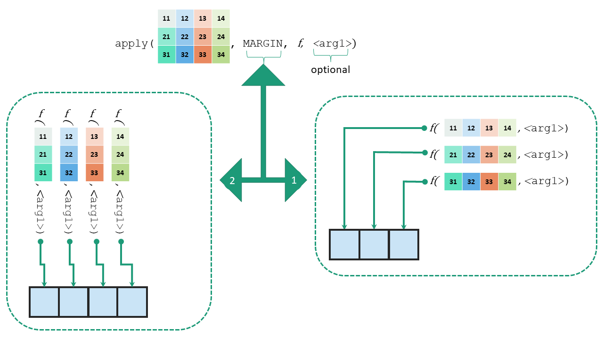

```{r}
#| include: false
source("_common.R")
```

# Functional Programming {#sec-fp}

```{r echo=FALSE}
library(knitr)
```

## What is functional programming?

Conceptually functional programming philosophy is based on lambda calculus. Lambda calculus is a framework developed by Alonzo Church^[Alan Turing, who created Turing machine which in turn laid the foundation of imperative programming style, was a student of __Alonzo Church__.] to study computations with functions.

Functional programming is a style of programming built around functions, in the mathematical sense. It is *declarative*. Its focus is on __what to solve__, in contrast to the *imperative* style, like a `for` loop, whose focus is on __how to solve__. For a fuller definition, readers may see this Wikipedia [link](https://en.wikipedia.org/wiki/Functional_programming). Put simply, instead of writing a loop which says "take the first element, do this, store the result, take the next element...", we say "apply this function to every element", and let R do the rest.

Functional programming uses *higher-order functions*, functions which take another function as an argument, or return a function. We have already seen one, perhaps without noticing. `args()` takes a function as its argument, and returns its arguments.

Let us learn a bit more here.

### Usage of functional programming in R

Strictly speaking, R is not a pure functional programming language, but it supports the style well. We have seen that most functions work on whole vectors at once. But what about lists? Many functions do not work on them. Check this example.
```{r error=TRUE}
list1 <- list(50000, 5000, 56)
sum(list1)
```
Of course, we can solve the above problem with a `for` loop. See
```{r}
list1 <- list(50000, 5000, 56)
# for loop strategy
x <- c()
for(i in seq_along(list1)){
  x[i] <- list1[[i]]
}
sum(x)
```
Consider another list, where we want to calculate mean of each element of that list.
```{r}
list2 <- list(
  1:10,
  11:20,
  21:30
)
```

We may use a `for` loop again, but in R such operations are done more simply with the *apply* family of functions, one of the best known features of R. We will come back to `list2` shortly.

## `apply` family of functions

The first of these functions is `apply()`, which works on matrices and data frames.

### Function `apply()`
The basic syntax of `apply` is
```
apply(m, MARGIN, FUN, f_args)
```
where

- `m` is the matrix
- `MARGIN` is the dimension. To _apply_ the function to each row, use `1`, and to each column, `2`
- `FUN` is the function to apply
- `f_args` are any further arguments to be passed to `FUN`.

An illustrative construction of `apply` function can be seen in @fig-applyimage.

```{r fig-applyimage, out.width="100%", echo=FALSE, fig.align='center', fig.show='hold', fig.cap="Illustration of function apply"}

```

Check this example
```{r}
(mat <- matrix(1:10, nrow = 5))
apply(mat, 1, mean)
```
**Note:** `rowMeans(mat)` would have given the same result. We use a simple example to show the idea.

**We may also pass our own function.** In this example, we take the sum of squares of each row. We define a function for the purpose and then `apply` it.
```{r}
my_fun <- function(x){
  sum(x^2)
}
apply(mat, 1, my_fun)
```
If the function is not needed elsewhere, there is no need to define it beforehand. We may write an anonymous function directly inside `apply()`.

```{r}
apply(mat, 1, FUN = function(x) sum(x^2))
```

::: callout-note
**Since R 4.1, a function can be written with a backslash `\` in place of the word `function`** (see @sec-func). We could have written the above as
```{r collapse=TRUE}
apply(mat, 1, FUN = \(x) sum(x^2))
```
:::

#### `apply()` need not necessarily output vectors only {-}
If `FUN` returns more than one value for each row or column, the output is a matrix. The thing to note is that the result for each row or column is always placed in a *column* of the output, whether `MARGIN` is `1` or `2`. (A function like `sqrt` would not show this well, since `apply(m, 1, sqrt)` gives the same values as `sqrt(m)`.) Suppose we want the column-wise running total of a matrix.
```{r}
apply(mat, 2, cumsum)
```
The output is exactly what we wanted. But what if we wanted the row-wise running total?
```{r}
apply(mat, 1, cumsum)
```
The output is the _transpose_ of what we expected, because the result for each row has gone into a column. Wrap it in `t()` to get the expected layout. Let us check our understanding with one more example, using a function whose output length does not depend on the input.

```{r}
set.seed(1)
apply(mat, 1, sample, 4, TRUE)
```

Thus we may conclude that

- if `FUN` returns a single value, the output of `apply` is a vector whose __length__ is
   - the number of rows of the input, if `MARGIN` is 1,
   - the number of columns of the input, if `MARGIN` is 2;
- if `FUN` returns a vector of length more than 1, the output is a matrix whose __number of columns__ is
   - the number of rows of the input, if `MARGIN` is 1,
   - the number of columns of the input, if `MARGIN` is 2.

These have been tabulated in @tbl-apply.

Table: Relation between input and output data structure in `apply` {#tbl-apply}

| Input matrix $m*n$      | `MARGIN = 1`  | `MARGIN = 2`  |
|-------------------------|:-------------:|:-------------:|
| FUN gives scalar        | Vector size $m$ | Vector size $n$ |
| FUN gives vector size $p$| Matrix $p*m$ | Matrix $p*n$ |


So we have to be careful with the output of `apply()`, or it may introduce a bug in our code.

#### `apply()` on data frames {-}
Data frames, though a kind of list, also behave like matrices, so we may use `apply()` on them too. See this example.
```{r}
(my_df <- as.data.frame(mat))
apply(my_df, 2, sum)
```

::: callout-caution
`apply()` first converts a data frame into a matrix. If the data frame has even one text column, *every* value becomes text, and numeric functions fail or give wrong results. Use `apply()` only on all-numeric data, and prefer `lapply()`, `sapply()` or, in the tidyverse, `across()` (@sec-across) for data frames.
:::


### Function `lapply()`

`lapply()` is the cousin of `apply()` for `l`ists, as its name suggests. Since a data frame is also a list, `lapply()` works on data frames too, column by column. The basic syntax of `lapply()` is
```
lapply(l, FUN, f_args)
```
where

- `l` is the list
- `FUN` is the function to apply
- `f_args` are any further arguments to be passed to `FUN`.

Note that there is no `MARGIN` argument here. See these examples.
```{r}
lapply(my_df, sum)
```
You may have noticed two things here.

1. The output is a `list`.
2. `FUN` is applied to every element of the list. Each column of a data frame is an element, so `lapply()` works column by column, never row by row.

Thus `lapply()`

- loops over a list, iterating over each element in that list
- then _applies_ the function `FUN` to each element
- and then returns a list.

Example-2: Let us find the type of each column of a data frame.
```{r}
lapply(iris, typeof)
```

As with `apply()`, we can write `FUN` inline (anonymously). Example-3:
```{r}
lapply(my_df, \(a) a^2)
```

Example-4:
```{r}
set.seed(1)
lapply(1:4, runif, min=0, max=10)
```

**Note** that even when `lapply()` is applied to a vector, it returns a list. In Example-4, each number `1:4` was passed as the first argument of `runif()`, giving 1, 2, 3 and 4 random numbers.

And now `list2`, from the beginning of the chapter. The mean of each element is simply

```{r}
lapply(list2, mean)
```

### Function `sapply()`
`sapply()` is a `s`implified `lapply()`. It works the same way, but simplifies the result as much as possible, usually into a vector or a matrix.

Example:
```{r}
sapply(my_df, sum)
sapply(list2, mean)
```

The convenience has a cost. What `sapply()` returns depends on the data, a vector one day and a list another, which can break code silently. For code that will be reused, prefer `vapply()`, described below, or the `purrr` functions.

## Other loop functions

### Function `replicate()`

`replicate()`\index{replicate() function} evaluates an expression repeatedly. It is mostly used in simulations. The syntax is
```
replicate(n, expr, simplify = "array")
```
where

 - `n` is the number of replications
 - `expr` is the expression to evaluate repeatedly
 - `simplify` says whether the results should be simplified into a vector, matrix or array.

Example:

```{r}
set.seed(123)
# Default value of simplify will simplify the results as much possible
replicate(5, runif(3))
# Notice the difference with simplify=FALSE
replicate(3, runif(5), simplify = FALSE)
```

### Function `split()`

`split()`\index{split() function} divides an object (a vector, list or data frame) into groups, given by a factor. The result is a list, with one element for each group. The basic syntax is
```
split(x, f, drop=FALSE, ...)
```
where

- `x` is the object to split, a `vector`, `list` or `data.frame`
- `f` is a factor, or a list of factors. Anything else is converted to a factor.
- `drop` says whether groups with no data should be dropped.

Example: to divide a vector into alternate elements,
```{r}
split(LETTERS, rep(1:2, 13))
```
Example-2: the sums of the even and odd numbers from 1 to 100,
```{r}
split(1:100, (1:100) %% 2) |> lapply(sum)
```

Example-3: the mean of the `mpg` column of `mtcars` for each value of `cyl`,
```{r}
split(mtcars$mpg, mtcars$cyl) |> sapply(mean)
```

### `tapply()`

`tapply()`\index{tapply() function} combines `split()` and `sapply()` for vectors, exactly as in the last example. It applies a function to each group of a vector. The basic syntax is
```
tapply(X, INDEX, FUN = NULL, ..., default = NA, simplify = TRUE)
```
where

- `X` is a vector
- `INDEX` is a factor, or a list of factors, giving the groups
- `FUN` is the function to apply
- `...` are any further arguments for `FUN`
- `simplify`, if `TRUE`, simplifies the result.

See this example
```{r}
tapply(mtcars$mpg, mtcars$cyl, mean)
```

If `simplify` is `FALSE`, the results are not simplified. See this example
```{r}
# month-wise mean of temperatures from `airquality` data
tapply(airquality$Temp, airquality$Month, mean, simplify = FALSE)
```

### `by()` function

`by()`\index{by() function} works like `tapply()`, but on a whole data frame, passing each group's rows to the function. See this example
```{r}
# Split the data by `cyl` column and subset first six rows only
by(mtcars, mtcars$cyl, head)
```

### Specifying the output type with `vapply()`
`vapply()`\index{vapply() function} works like `sapply()`, except that we must state the type and length of each result, in the argument `FUN.VALUE`. If a result does not match, it stops with an error, instead of returning something unexpected. Its syntax is
```
vapply(X, FUN, FUN.VALUE, ..., USE.NAMES = TRUE)
```
 - In the argument `FUN.VALUE` we give a template of each result. See this example.
```{r}
vapply(mtcars, max, FUN.VALUE = double(1))
```
With `FUN.VALUE = double(1)` we have said that each result should be a single `double`. To find the `range` of each column, which has two values,
```{r}
vapply(mtcars, range, FUN.VALUE = double(2))
```
If we try this on a data set with a non-numeric column, like the `Species` column of `iris`, `vapply()` stops with an error, as we want it to.
```{r, error=TRUE}
vapply(iris, range, FUN.VALUE = double(2))
```
## Functional Programming in `purrr` {#sec-purrr}
The package `purrr`^[[https://purrr.tidyverse.org/](https://purrr.tidyverse.org/)], part of the core `tidyverse`, gives a complete and consistent set of tools for functional programming. Its functions do the job of the apply family, with consistent names and arguments, and a guaranteed type of output.

```{r}
#| message: false
#| warning: false
library(purrr)
```

### Iterate over single list/vector with `map_*()` family of functions
The most important family of functions in purrr is `map`. The `map_*()` functions work much like `vapply()`, with control over the type of output. They all take a list or vector as the argument `.x` and a function as `.f`, and return an output of the stated type.

Example
```{r}
map(mtcars, .f = sum)
```
Note that the output is a list, just as with `lapply()`. If each result is a single value, we use one of these functions, depending on its type, to get a vector.

- `map_lgl` for `logical` format
- `map_int` for `integer` format
- `map_dbl` for `double` format
- `map_chr` for `character` format. Since purrr version 1.2, `map_chr()` no longer converts numbers or logical values into text automatically. If the function returns numbers, use `map_dbl()`, or convert the result explicitly with `as.character()`.

`map()` always returns a list.
See these further examples.

Example-1:
```{r}
map_dbl(mtcars, max)
```

Example-2: an anonymous function, written with `\(x)`. (Older code often uses a formula instead, like `~ mean(.x)`. It still works, but `\(x)` is now recommended.)
```{r}
map_dbl(list2, \(x) mean(x))
map_chr(c(2, 7, 12), \(m) month.name[m])
```

### Iterate over two or more lists/vectors using `map2_*()`/ `pmap_*()` family

So far, `map_*()` has iterated over the elements of one list. Any extra arguments are passed unchanged, the same in every iteration, as in the first illustration in @fig-map2^[Source: [Advanced R](https://adv-r.hadley.nz/functionals.html) by Hadley Wickham].

::: {#fig-map2}

```{r echo=FALSE, fig.show='hold', fig.align='center', out.width="49%"}
knitr::include_graphics(c("images/map1.png", "images/map2.png" ))
```

Working of map vs map2 family of functions \hspace{\textwidth} Source Advanced R by Hadley Wickham
:::
To iterate over two vectors or lists *together*, taking their elements in pairs, we need the `map2_*()` family of functions (see the second illustration in @fig-map2).

See the following example
```{r}
x <- list(1, 2, 3)
y <- list(11, 12, 13)
map2(x, y, `*`)
```
Here is an audit use. Claims under three schemes are to be checked against each scheme's own limit. `map2()` takes each scheme's claims together with its limit.

```{r}
claims <- list(Health    = c(12000, 155000, 8000, 140000),
               Education = c(30000, 9000, 61000),
               Housing   = c(150000, 260000, 90000))
limits <- c(Health = 100000, Education = 50000, Housing = 250000)

map2(claims, limits, \(x, lim) x[x > lim])      # the claims above the limit
map2_int(claims, limits, \(x, lim) sum(x > lim)) # how many
```

Another use is a completeness check. From the first and last numbers of each cheque book issued, `map2()` builds the full list of cheque leaves, which can then be compared with the cheques accounted for.

```{r}
cheque_books <- data.frame(first = c(500101, 500126), last = c(500125, 500150))
all_leaves <- map2(cheque_books$first, cheque_books$last, seq) |> unlist()
length(all_leaves)
accounted <- c(500101:500118, 500120:500150)   # say, from the cheque register
setdiff(all_leaves, accounted)                  # leaves not accounted for
```

Similarly, to iterate over three or more lists, we use `pmap_*()`. The only difference is that all the lists are passed to `pmap` together, in one list. This can be better understood with the illustration used by Hadley Wickham in his [book](https://adv-r.hadley.nz/functionals.html). See @fig-pmap.

::: {#fig-pmap}

```{r echo=FALSE, fig.show='hold', fig.align='center', out.width="49%"}
knitr::include_graphics(c("images/pmap.png", "images/pmap-arg.png"))
```

Working of pmap family of functions \hspace{\textwidth} Source Advanced R by Hadley Wickham
:::

For example, a data frame is a list of columns, so `pmap()` over a data frame takes one row at a time, with the column names matching the names of the function's arguments.

```{r}
bills <- data.frame(qty = c(10, 25, 40), rate = c(150, 80, 12.5), gst = c(18, 5, 18))
pmap_dbl(bills, \(qty, rate, gst) qty * rate * (1 + gst / 100))
```

Here, plain vector arithmetic, `qty * rate * (1 + gst / 100)`, would have done the same. `pmap()` is needed when the function works on only one value at a time, like `seq()` above, or a function of our own with `if`.

### Other useful purrr functions

- `walk()`, `walk2()` and `iwalk()` work like `map()`, but for functions called for their *side effects*, like saving files or drawing plots, rather than for a result. We used `iwalk()` to save one file per district in @sec-merge.
- `list_rbind()` binds a list of data frames into one, as when reading many files with `map()`. Its argument `names_to` adds a column with the names of the list elements, like the file each row came from.
- `keep()` and `discard()` keep or drop the elements of a list which meet a condition, like `keep(claims, \(x) any(x > 100000))`.
- `imap()` passes each element along with its name, or position, as a second argument.

::: callout-tip
## Audit tip

Whenever you find yourself running the same analysis on several files, districts, years or schemes, put them in a list and `map()` over it. One function, tested once, then runs on all of them alike. That is both quicker and more reliable than copying and editing code for each, where one small slip can go unnoticed.
:::

## Summary of functions used

| Function | Package | What it does |
|-----------------------|----------------|--------------------------------|
| `apply()` | base R | Apply a function to each row or column of a matrix |
| `lapply()`, `sapply()`, `vapply()` | base R | Apply a function to each element of a list, returning a list, a simplified result, or a result of a stated type |
| `replicate()` | base R | Evaluate an expression many times |
| `split()` | base R | Divide an object into a list of groups |
| `tapply()`, `by()` | base R | Apply a function to each group of a vector or data frame |
| `map()`, `map_lgl()`, `map_int()`, `map_dbl()`, `map_chr()` | purrr | Apply a function to each element, returning a list or a vector of the stated type |
| `map2()`, `pmap()` | purrr | Apply a function to elements of two, or more, lists taken together |
| `walk()`, `iwalk()` | purrr | Like `map()`, for side effects like saving files |
| `list_rbind()` | purrr | Bind a list of data frames into one |
| `keep()`, `discard()`, `imap()` | purrr | Keep or drop elements, or map with names |
| `unlist()`, `setdiff()` | base R | Flatten a list into a vector; values in one vector but not another |

: Functions used in this chapter {#tbl-fpfunctions}
