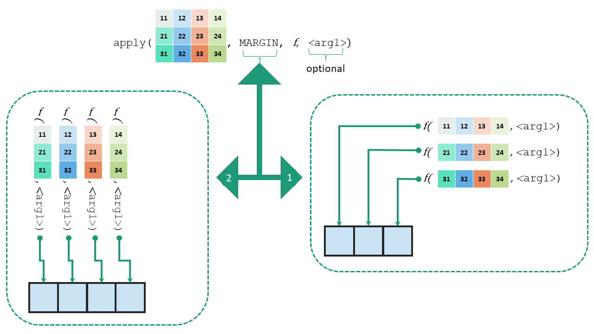

# Functional Programming

```{r echo=FALSE}
library(knitr)
```

## What is functional programming?

Conceptually functional programming philosophy is based on lambda calculus. Lambda calculus is a framework developed by Alonzo Church^[Alan Turing, who created Turing machine which in turn laid the foundation of imperative programming style, was a student of __Alonzo Church__.] to study computations with functions.

Functional programming is a programming paradigm in which we try to bind everything in pure mathematical functions style. It is a declarative type of programming style. Its main focus is on __what to solve__ in contrast to an imperative style where the main focus is __how to solve__.  For a more elaborated definition readers may see this wikipedia [link](https://en.wikipedia.org/wiki/Functional_programming).  Simply putting functional programming is like doing something repeatedly but in declarative style.  Here, functions are the primary method with which we carry out tasks. All actions are just implementations of functions we are using.

Functional programming use high order functions.  A high order function is actually a function that accepts a function as an argument, or returns a function; in short, function that operates upon a function.  We have already seen one such example may be without noticing it, `args()` function take a function as an argument and in turn return its arguments.

Let us learn a bit more here.

### Usage of functional programming in R 

Strictly speaking R is not a functional programming language.  But we have already seen that one of the greatest strengths of R is parallel operations on vectors. In fact we need functional programming where concurrency or parallelism is required.  Till now we have seen that most of the functions work on all atomic objects (vectors, matrices, arrays, etc.), but what about working of these functions on recursive objects i.e. lists?  Check this example (in your console)-
```
list1 <- list(50000, 5000, 56)
sum(list1)
```
> Of course, we can solve the above problem by using for loops.  See
```{r}
list1 <- list(50000, 5000, 56)
# for loop strategy
x <- c()
for(i in seq_along(list1)){
  x[i] <- list1[[i]]
}
sum(x)
```
Consider another list, where we want to calculate mean of each element of that list.
```{r}
list2 <- list(
  1:10,
  11:20,
  21:30
)
```

Of course, we may use a for loop again, but in R these operations can be done easily with *apply* group of functions, which are one of the most famous and most used features in R.  

## `apply` family of functions

First of these functions is `apply()` which works on matrices/data frames.

### Function `apply()`
The basic syntax of `apply` is
```
apply(m, MARGIN, FUN, f_args)
```
where 

- `m` is the matrix
- `MARGIN` is the dimension.  If we want to _apply_ function to each row then use `1` or else if it is to be column-wise use `2`
- `FUN` is the desired function which we want to apply
- `f_args` are the optional set of arguments, if needed to be supplied to `fun`.

An illustrative construction of `apply` function can be seen in \@ref(fig:applyimage).

```{r applyimage, out.width="100%", echo=FALSE, fig.align='center', fig.show='hold', fig.cap="Illustration of function apply"}

```

Check this example
```{r}
(mat <- matrix(1:10, nrow = 5))
apply(mat, 1, mean)
```
**Note:** `rowMeans(mat)` in above example would have given similar results, but for sake of simplicity we have provided a simplest example.

**Further note that we may also write our own customised function in the argument.**  See this another example, where we will take sum of squares of each row.  We may define our own custom function for the purpose and then `apply` it.
```{r}
my_fun <- function(x){
  sum(x^2)
}
apply(mat, 1, my_fun)
```
The need to writing a custom function before hand may be eliminated if the function so defined is not be used further.  We may write anonymous function directly in the `apply` syntax - 

```{r}
apply(mat, 1, FUN = function(x) sum(x^2))
```

::: {.rmdnote}
**In R version 4.1 and onwards R has devised shorthand style of defining inline custom functions, where we can write backslash i.e. `\` instead of writing `function`.**  We could have written above expression as-
```{r collapse=TRUE}
apply(mat, 1, FUN = \(x) sum(x^2))
```
:::

#### `apply()` need not necessarily output vectors only {-}
If `FUN` applied on rows/columns of matrix outputs vector of length more than 1, the output will be in matrix format.  But the thing to note here is that matrix will be displayed columnwise always irrespective of fact whether `MARGIN` is `1` or `2`.  As an easy example we could have shown this using function like `sqrt`, but `apply(matrix, MARGIN, sqrt)` will work like `sqrt(matrix)` only.  So let's take a different example.  Suppose we want to calculate `column-wise` cumulative sum in a given matrix.
```{r}
apply(mat, 2, cumsum)
```
The output here is eaxctly what was desired.  But what if, our requirement was to take `row-wise` cumulative sum?
```{r}
apply(mat, 1, cumsum)
```
It may now be noticed that the output is actually _transpose_ of what we were expecting.  Actually the output of each iteration of `apply` function is displayed in one column always. Let us check our understanding with one more example taking function which may give output that is not dependent on input vector length.  

```{r}
set.seed(1)
apply(mat, 1, sample, 4, TRUE)
```

Thus we may conclude that- 

- If `FUN` outputs a scalar, the output of `apply` will be a vector of __length__ equal to 
   - number of `rows` in input matrix given that `MARGIN` selected in 1,
   - number of `columns` in input matrix given that `MARGIN` selected in 2.
- if `FUN` outputs a vector(of length >1) then output of `apply` will be a matrix having __number of columns__ equal to -
   - number of `rows` in input matrix given that `MARGIN` selected in 1,
   - number of `columns` in input matrix given that `MARGIN` selected in 2.
   
These have been tabulated in table \@ref(tab:apply).

Table: (\#tab:apply) Relation between input and output data structure in `apply`

| Input matrix $m*n$      | `MARGIN = 1`  | `MARGIN = 2`  |
|-------------------------|:-------------:|:-------------:|
| FUN gives scalar        | Vector size $m$ | Vector size $n$ |
| FUN gives vector size $p$| Matrix $p*m$ | Matrix $p*n$ |


We may thus have to be careful while getting the output from `apply` function as it may lead to introduction of bug in our code.

#### `apply()` on data frames {-}
Now we know that data frames despite being special type of lists also behave like matrices, we may use `apply` on data frames too.  See this example.
```{r}
(my_df <- as.data.frame(mat))
apply(my_df, 2, sum)
```


### Function `lapply()` 

Another cousin of apply is `lapply` which can thought of `apply` to `l`ists.  So as the name suggests it is applied on lists instead of matrices. Now since `data frame` is also a list `lapply` can be applied on these.  The basic syntax of `lapply()` is -
```
lapply(l, FUN, f_args)
```
where 

- `l` is the list
- `FUN` is the desired function which we want to apply
- `f_args` are the optional set of arguments, if needed to be supplied to `fun`.

It may be noted that `MRAGIN` argument is not available here.  See these examples.
```{r}
lapply(my_df, sum)
```
Now you may have noticed two things here -

1. The output is of `list` type.
2. Unlike `apply` as `MARGIN` is not passed/available here, it applies `FUN` to every element of list.  When we consider any `data.frame` as a list its each column is a separate element of that list.  So `FUN` cannot be applied to `rows` in a `data.frame`.

Thus `lapply()` -

- loops over a list, iterating over each element in that list
- then _applies_ the function `FUN` to each element
- and then returns a list.

Example-2: Let's try to find type of each column in a given data frame.
```{r}
lapply(iris, typeof)
```

Similar to `apply` we can define `FUN` inline here (anonymously) also.  Example-3:
```{r}
lapply(my_df, \(a) a^2) 
```

Example-4:
```{r}
set.seed(1)
lapply(1:4, runif, min=0, max=10)
```

**Note** that even if `lapply` is applied over a vector, it returns a list only.

### Function `sapply()`
There is not much of the difference between `lapply()` and `sapply()`, as `sapply` is actually `s`implified l`apply`.  It simplifies the argument as much as possible.

Example:
```{r}
sapply(my_df, sum)
```

## Other loop functions 

### Function `replicate()`

Function `replicate()`\index(replicate) is used for repeated evaluation of an expression.  Syntax is
```
replicate(n, expr, simplify = "array")
```
where -

 - `n` is integer denoting the number of replications
 - `expr` is the expression to evaluate repeatedly
 - `simplify` takes either 'character' or 'logical' to value to indicate whether the results should be simplified.
 
Example:
 
```{r}
set.seed(123)
# Default value of simplify will simplify the results as much possible
replicate(5, runif(3))
# Notice the difference with simplify=FALSE
replicate(3, runif(5), simplify = FALSE)
```

### Function `split()` 

The `split()`\index(split() function) function takes object (vector or other) and splits it into groups determined by a given factor.  The basic syntax is-
```
split(x, f, drop=FALSE, ...)
```
where 

- `x` is input object - `vector` or `list` or `data.frame`
- `f` is a factor or a list of factors.  If a factor is not provided, it will be coerced to factor.
- `drop` argument indicates whether empty factors should be dropped.

Example: (To divide the given list by alternate elements)- 
```{r}
split(LETTERS, rep(1:2, 13))
```
Example-2: Find out sum of every odd and even number from 1:100-
```{r}
split(1:100, (1:100) %% 2) |> lapply(sum)
```

Example-3: Find out mean of `mpg` column splitting the `mtcars` data by `cyl`
```{r}
split(mtcars$mpg, mtcars$cyl) |> sapply(mean)
```

### `tapply()` 

The `tapply()` function\index(tapply() function) can be thought of combination of `split` and `sapply` for vectors, exactly as used in above example.  It actually applies the function over subsets of a given vector.  The basic syntax is-
```
tapply(X, INDEX, FUN = NULL, ..., default = NA, simplify = TRUE)
```
Where -

- `X` is a vector
- `INDEX` is factor or list of factors
- `FUN` is function to be applied
- `...` are other arguments, if any, of `FUN` to be passed
- `simplify` if TRUE simplifies the result.

See this example
```{r}
tapply(mtcars$mpg, mtcars$cyl, mean)
```

Needless to say if `simplify` is `FALSE` the results will not be simplified. See this example-
```{r}
# month-wise mean of temperatures from `airquality` data
tapply(airquality$Temp, airquality$Month, mean, simplify = FALSE)
```

### `by()` function

This\index(by() function) works something like `tapply` but with the difference that input object here is `data.frame`.  See this example
```{r}
# Split the data by `cyl` column and subset first six rows only
by(mtcars, mtcars$cyl, head)
```

### Specifying the output type with `vapply()`
Function `vapply()`\index(vapply() function) works exactly like `sapply()` described above, with only difference that type of return value (output) has to be specifically provided through `FUN.VALUE` argument.  Its syntax is -
```
vapply(X, FUN, FUN.VALUE, ..., USE.NAMES = TRUE)
```
 - In the argument `FUN.VALUE` we have to provide the format type of output.  See this example.
```{r}
vapply(mtcars, max, FUN.VALUE = double(1))
```
Through `FUN.VALUE = double(1)` we have specifically provided that our output should be of `double` type with length `1`.  So in case we have to find out `range` of each column-
```{r}
vapply(mtcars, range, FUN.VALUE = double(2))
```
If we will try this function on a dataset having mixed type columns like `iris` dataset, `vapply` will throw an error.
```
vapply(iris, range, FUN.VALUE = double())
```
## Functional Programming in `purrr` {#purrr}
Package `purrr`^[[https://purrr.tidyverse.org/](https://purrr.tidyverse.org/)], which is part of core `tidyverse`, enhances R’s functional programming (FP) toolkit by providing a complete and consistent set of tools for working with functions and vectors. 

```{r}
library(purrr)
```

### Iterate over single list/vector with `map_*()` family of functions
This package has many families of functions; and most primary family is `map` family of functions.  `map_*()` works nearly similar to `vapply` where we can control the type of output.  The syntax style of each of these functions is nearly same, where these accept one object (list or vector) as `.x` argument, one function (or alternatively a formula) as `.f` argument; and outputs an object of specified type.

Example
```{r}
map(mtcars, .f = sum)
```
Note that output type is list.  If the output can be simplified to an atomic vector we can use either of these functions depending upon the output type of that vector.

- `map_lgl` for `logical` format
- `map_int` for `integer` format
- `map_dbl` for `double` format
- `map_chr` for `character` format

`map` always return a list.
See these further examples.

Example-1:
```{r}
map_dbl(mtcars, max)
```

### Iterate over two or more lists/vectors using `map2_*()`/ `pmap_*()` family

So far we have seen that `map_*()` family of functions are used to iterate over elements of a list.  Even if extra lists/vectors are provided as extra arguments, these are used as it is, in each iteration, as can be seen in first illustration in figure^[Source: [Advanced R](https://adv-r.hadley.nz/functionals.html) by Hadley Wickham] \@ref(fig:map2).

```{r map2, fig.cap="Working of map vs map2 family of functions \\hspace{\\textwidth} Source Advanced R by Hadley Wickham", echo=FALSE, fig.show='hold', fig.align='center', out.width="49%"}
knitr::include_graphics(c("images/map1.png", "images/map2.png" ))
```
In order to iterate over two vectors/lists, we will however, need `map2_*()` family of functions (Refer second illustration in figure \@ref(fig:map2)).

See the following example
```{r}
x <- list(1, 2, 3)
y <- list(11, 12, 13)
map2(x, y, `*`)
```
Similarly, to iterate over multiple lists we will use `pmap_*()`, with the only difference being that here all the vectors/list should be collectively passed on to `pmap` in a list.  This can be better understood with the illustration used by Hadley Wickham in his [book](https://adv-r.hadley.nz/functionals.html).  For reference see figure \@ref(fig:pmap).

```{r pmap, fig.cap="Working of pmap family of functions \\hspace{\\textwidth} Source Advanced R by Hadley Wickham", echo=FALSE, fig.show='hold', fig.align='center', out.width="49%"}
knitr::include_graphics(c("images/pmap.png", "images/pmap-arg.png"))
```
