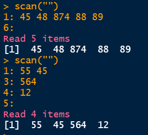
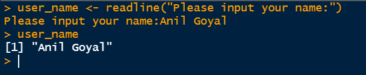
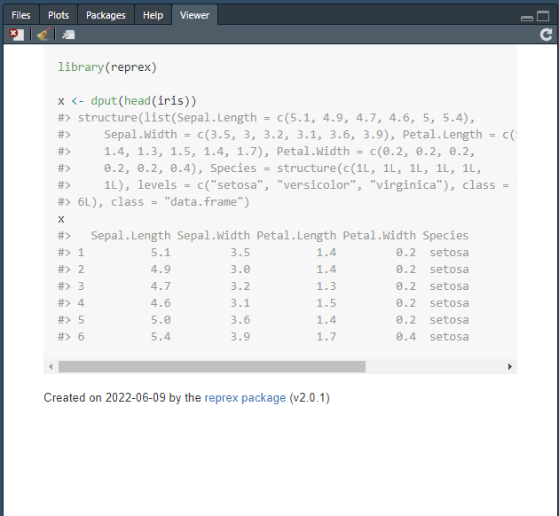

```{r}
#| include: false
source("_common.R")
```

# Importing and Exporting Data {#sec-read}

Until now, we have created our own datasets or used the sample datasets that come with R. In practice, audit data comes from outside, as files received from the auditee, downloads from portals, or extracts from databases. We have to import this data into R before analysis. After the analysis, the summaries, exception lists and charts have to be exported, for the working papers and the report. This chapter covers both.

The first section deals with the base R functions for reading external data, that is, importing it into R. The next section deals with writing data to external files, that is, exporting it out of R. Then we will see the `tidyverse` packages which do these jobs faster and more safely, and end with the most important point for an auditor, checking that nothing went wrong while reading.

## Importing external data in R - Base R methods

Base R has functions to import nearly any kind of external data. There are also packages which make certain tasks easier, and we will learn some of them later in this chapter. Let us first see the base R functions which are used most often.

### Reading tables through `read.table()` and/or `read.csv()` {-}

These two are the most common functions for reading tabular data from plain text files. `read.table()` reads data whose columns are separated by spaces or another separator, and `read.csv()` reads *comma separated values* (.csv) files. They have three more cousins.

- `read.csv2()` reads csv files where `;` is the separator and `,` the decimal mark, as used in many European countries.
- `read.delim()` reads files where a `tab` character separates the columns and `.` is the decimal mark.
- `read.delim2()` reads tab separated files where `,` is the decimal mark.

The most important arguments of these functions are

- `file`, the name of the file, with its path, as a string^[If backslashes `\` are used in file paths, they must be escaped, since R treats `\` as an escape character. So `"my/location/here/file.txt"` and `"my\\location\\here\\file.txt"` are both correct ways of giving a file name.].
- `header`, a logical value, telling whether the first line of the file holds the column names.
- `sep`, the character which separates the columns.
- `colClasses`, a character vector giving the type of each column, if the columns must be read in these types only.
- `skip`, the number of lines to skip at the beginning of the file.

Readers may see `?read.table()` for the complete list of arguments.

Example: Let us read the data of the _World Happiness Report 2021_, which was available on the data.world portal.

```
wh2021 <- read.csv("https://query.data.world/s/qbsbmxlfj54sl4mq3y6uxsr3pkhhmo")
# Check dimensions
dim(wh2021)
# Check column names
colnames(wh2021)
```

The dataset `wh2021`, with `20` columns and `149` rows, would then be available in our environment. Notice that a file can be read directly from a web address, without downloading it first. (Links on portals change over time, so this particular link may no longer work.)

::: callout-note
Use `"clipboard"` as the file name to paste copied data into R. For example, copy a few rows and columns from an Excel sheet, and run `read.delim("clipboard", header = FALSE)`. This works on Windows.
:::

### Read data into a vector through `scan()` or `readline()` {-}

`read.table()` and its cousins read data into tables. Sometimes we need to read data into a simple vector instead. The two functions `scan()` and `readline()` are used for this.

The basic syntax of `scan()` is

```
scan(file = "",
     what = double(),
     nmax = -1,
     ...
)
```

Where -

- `file` is the name of the file, or a link.
- `what` is the type of data to be read. The default is double.
- `nmax` is the maximum number of values to be read. The default, `-1`, means all.

There are many other useful arguments, which can be seen with `?scan`.

Example -
```
scan("http://mattmahoney.net/iq/digits.txt", nmax = 10)
```

`scan()` can also read data typed on the keyboard into a vector. Just give a blank string `""` as the file name. See this example.



The function `readline()` does a similar job, but shows a prompt. See this example.



### Reading text files through `readLines()` {-}

The function `readLines()` reads the lines of a text file (or connection), giving one element for each line. To see it in action, prepare a text file, say `"txt.txt"`, and read it with `readLines("txt.txt")`. We used it to read the Budget speech in @sec-textviz.

## Exporting data out of R - Base R methods

In most analysis, we read external data, and then clean, transform and analyse it, all in R. So we export less often than we import. Still, cleaned data, summaries and exception lists often need to be exported. The following functions meet nearly all such needs.

### Writing tabular data through `write.table()` and/or `write.csv()` {-}

Data frames can be exported with these functions. The latter writes csv files specifically. The syntax is

```
write.table(x, file = "", sep = " ", ...)
write.csv(x, file = "", ...)
write.csv2(x, file = "", ...)
```

where -

- `x` is the data frame to be exported.
- `file` is the file name, with its path.
- `sep` is the separator.
- `...` are many more arguments for customised exports. See `?write.table()` for full details.

For example, the following command exports the `iris` data frame as the file `iris.csv` in the current working directory.

```{r eval=FALSE}
write.csv(iris, 'iris.csv', row.names = FALSE)
```

By default, `write.csv()` also writes the row numbers as a first, unnamed column. `row.names = FALSE` stops this, which is nearly always what we want.

### Writing character data line by line to a file through `writeLines()` {-}

Like `readLines()`, the function `writeLines()` writes text into a file of the given name. Type the following code in your console, and check that a new file `my_new_file.txt` has been created with the given contents in your working directory.

```{r eval=FALSE}
writeLines(c("Andrew 25", "Bob 45", "Charles 56"), "my_new_file.txt")
```

### Using `dput()` to get a code representation of R object {-}

This function prints the code which would recreate a given R object. It is particularly useful when asking for help online. For example, on [_Stack Overflow_](https://stackoverflow.com/), a question should include [reproducible data](https://stackoverflow.com/questions/5963269/how-to-make-a-great-r-reproducible-example). Please also refer to @sec-reprex.

Example-1:
```{r}
my_data <- data.frame(Name = c("Andrew", "Bob", "Charles"),
                      Age = c(25, 45, 56))
dput(my_data)
```

And to recreate someone else's data from their `dput()` output,
```{r}
now_mydata <- structure(list(Name = c("Andrew", "Bob", "Charles"), Age = c(25,
45, 56)), class = "data.frame", row.names = c(NA, -3L))

now_mydata
```

::: callout-warning
## Caution

Never share real audit data this way. Make up a few rows of similar data instead. Audit data often holds names, account numbers and other personal details, which must not be posted on a public forum.
:::

## Using external packages for reading/writing data

### Package `readr`

The `readr` package [@R-readr] is part of the core `tidyverse`, and is loaded with `library(tidyverse)`. It has a counterpart for each of the reading and writing functions of base R.

| Base R     | readr        | Uses                                    |
| :---------:| :----------: | :-------------------------------------- |
| read.table | read\_table  | Reading tables separated by white space |
| read.csv   | read\_csv    | Reading CSV file with comma as sep      |
| read.csv2  | read\_csv2   | Reading CSV file with semi-colon as sep |
| read.delim | read\_tsv    | Reading tab delimited file              |
| \--        | read\_delim  | Reading files with any delimiter        |
| read.fwf   | read\_fwf    | Reading fixed width files               |
| \--        | write\_delim | Writing files with any delimiter        |
| write.csv  | write\_csv   | Writing files with comma delimiter      |
| write.csv2 | write\_csv2  | Writing files with semi-colon delimiter |
| \--        | write\_tsv   | Writing a tab delimited file            |

: Base R and readr functions {#tbl-readr}

What is the difference between the two sets? Firstly, the `readr` functions are much faster, which matters for large files. Secondly, they report the problems they meet while reading, as we will see shortly. And thirdly, they never turn text into factors, or change column names, behind our back.

```{r message=FALSE, warning=FALSE}
library(tidyverse)
```

```{r}
read_csv(readr_example("chickens.csv"))
```

Notice that the type of each column has been printed. `readr` *guesses* the types from the first 1,000 rows. If the guesses are not what we want, we use the argument `col_types`. We can see the guessed types with `spec()`, and modify them for use in `col_types`. See this example.

```{r}
write.csv(iris, "iris.csv", row.names = FALSE) #write a dummy data
spec(read_csv("iris.csv"))
read_csv("iris.csv",
         col_types = cols(
           Sepal.Length = col_double(),
           Sepal.Width = col_double(),
           Petal.Length = col_double(),
           Petal.Width = col_double(),
           Species = col_factor(levels = c('setosa', 'versicolor', 'virginica'))
         )
) |> head(2)
```

Two other arguments are often useful. `col_select` reads only the columns we need, which saves time and memory with wide files. `locale` handles files with other encodings or number formats. For example, files with Hindi or other Indian scripts, saved from older software, may need `locale = locale(encoding = "UTF-16LE")` or another encoding, to be read correctly.

### Package `readxl`

This package is also part of `tidyverse`, but has to be loaded separately with `library(readxl)`. It *reads* Excel files. An Excel file (with extension .xls or .xlsx) can hold several *sheets*. The functions `read_excel()`, `read_xlsx()` and `read_xls()` read a sheet. The syntax is

```
read_excel(path, sheet = NULL, range = NULL, skip = 0, col_types = NULL)
```

- `sheet` is the name or number of the sheet. The default is the first sheet.
- `range` reads only a block of cells, like `"B3:H120"`.
- `skip` skips rows at the top, like a title.
- `col_types = "text"` reads every column as text, which is the safest way to begin with a messy file.

To get the names of all the sheets in an Excel file, we use `excel_sheets()`.

```
excel_sheets(path)
```

We read all the sheets of a file together in @sec-merge.

### Writing Excel files

`readxl` cannot write Excel files. For that, the package `writexl` has a simple function, `write_xlsx()`. A named list of data frames is written as one sheet each, which is a convenient way to give the auditee all the exception lists in one file.

```{r eval=FALSE}
library(writexl)
write_xlsx(list(duplicates     = duplicate_payments,
                above_limit    = large_payments,
                missing_vendor = no_vendor),
           "exceptions.xlsx")
```

For formatted Excel output, with colours, column widths and formulas, the package `openxlsx2` can be used.

## Checking that the data was read correctly {#sec-read-check}

This is the most important step for an auditor, and the one most often skipped. When `readr` cannot read a value as the type expected, it puts `NA` in its place and moves on. Only a short message is printed. Let us see this with a small file of payments, written in the way real files often are.

```{r}
csv_text <- "voucher_no,emp_code,amount,date
PV-01,00123,1250,15/04/2024
PV-02,00456,\"1,25,000\",16/04/2024
PV-03,01789,-,2024-04-17
PV-04,12001,3400.50,NA"

payments <- read_csv(I(csv_text), col_types = cols(amount = col_double()))
payments
```

Here, `I()` tells `read_csv()` that the text itself is the data, not a file name. Look at the `amount` column. The amount of ₹1,25,000, written with Indian commas, has become `NA`, and so has the `-`. Both payments have silently disappeared from any total we calculate. `problems()` lists every value that could not be read.

```{r}
problems(payments)
```

The safest approach is to read such columns as text first, and convert them ourselves, with a function that understands the format. `parse_number()` removes the commas and any other non-numeric characters around the number. The argument `na` lists the values to be treated as missing.

```{r}
payments <- read_csv(I(csv_text), col_types = cols(.default = col_character()))

payments |>
  mutate(amount_num = parse_number(amount, na = c("-", "NA")))
```

Now ₹1,25,000 has been read correctly. Notice also that `emp_code` keeps its leading zeros, because we read it as text. Read as a number, `00123` would have become `123`, and joins with other tables would fail, as we saw in @sec-strng-zeros.

::: callout-tip
## Audit tip

After reading any file, always check three things before analysis. (1) The number of rows matches the number in the source, or the count given by the auditee. (2) The totals of amount columns match the totals in the source. (3) `problems()` is empty, or every problem is understood. Read code columns, like employee numbers, PIN codes and account numbers, as text.
:::

### Package `reprex` {#sec-reprex}

This package is part of tidyverse too, but has to be loaded with `library(reprex)`. Its name is short for *reproducible example*. It is useful when we are stuck with a problem and seek help on a forum, such as [Stack Overflow](https://stackoverflow.com/questions/5963269/how-to-make-a-great-r-reproducible-example) or [Posit Community](https://forum.posit.co).

As an example, do this in your console.

```
library(reprex)

x <- dput(head(iris))
x
```

Thereafter, copy the code and run `reprex()`. A small window opens in the `Viewer` tab, like this, showing the code with its output. The formatted result is also copied to the clipboard, ready to paste into a question.



For more reading please refer [this page.](https://www.tidyverse.org/help/)^[https://www.tidyverse.org/help/]

## A suggested workflow

For any file received from the auditee, an auditor may follow these steps.

1.  **Look at the file first.** Note its format, its sheets with `excel_sheets()`, and any title rows to skip.
2.  **Read everything as text to begin with.** Use `col_types = cols(.default = col_character())` in `read_csv()`, or `col_types = "text"` in `read_excel()`. This keeps leading zeros in codes and stops values from turning into `NA` silently.
3.  **Check for problems.** Run `problems()` and make sure every problem is understood.
4.  **Convert amounts yourself.** Use `parse_number()` with a suitable `na` argument, so that amounts written with Indian commas are read correctly.
5.  **Keep code columns as text.** Employee numbers, PIN codes and account numbers should stay as text.
6.  **Reconcile with the source.** Match the number of rows and the totals of amount columns with the source, or with the counts given by the auditee.
7.  **Export the results.** Write exception lists with `write_csv()`, or with `write_xlsx()` to put each list on its own sheet in one file.

::: callout-important
## Remember

A value that cannot be read becomes `NA` with only a short message. Such a payment silently drops out of every total. Always check `problems()`, the row count and the totals before starting the analysis.
:::

## Summary of functions used

| Function | Package | What it does |
|-----------------------|----------------|--------------------------------|
| `read.table()`, `read.csv()`, `read.delim()` | base R | Read text files with columns |
| `scan()`, `readline()`, `readLines()` | base R | Read data into a vector, or lines of text |
| `write.table()`, `write.csv()`, `writeLines()` | base R | Write data frames or text to files |
| `dput()` | base R | Code which recreates an object |
| `read_csv()`, `read_tsv()`, `read_delim()` | readr | Read text files, faster and with problem reports |
| `spec()`, `cols()`, `col_character()` and others | readr | See and set the type of each column |
| `problems()` | readr | Values which could not be read as the expected type |
| `parse_number()` | readr | Numbers from text, ignoring commas and symbols |
| `read_excel()`, `excel_sheets()` | readxl | Read Excel sheets, and list the sheets in a file |
| `write_xlsx()` | writexl | Write one or more data frames to an Excel file |
| `reprex()` | reprex | Prepare a reproducible example for asking help |

: Functions used in this chapter {#tbl-readfunctions}
