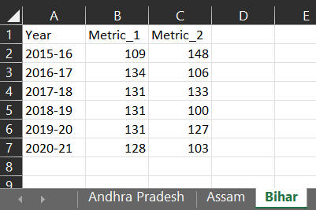

# Merging large number of similar datasets into one
Data preparation for performing analytics is an important task and may require more time than actual analytics because we rarely have data in ideal format.  Importing csv or flat files is rather an easy job.  However, considering large popularity of MS Excel, we at times have our data saved in excel files.  

Sometimes, one single data frame/table is divided into multiple sheets in one excel file whereas sometimes these tables are divided in multiple files.  Here we are discussing few of these cases, where we can reduce our data preparation time by effectively writing the code for import of such data into our environment.

## **Case-1**: Merging multiple excel sheets into one data frame
As an example, let's say we have multiple States' data saved on a different sheet in one excel file say `Daur.xlsx`.  See preview in fig \@ref(fig:prevexcel).

```{r prevexcel, fig.show='hold', echo=FALSE, fig.cap="Preview of example excel file", fig.align='center', out.width="100%"}

```

We will use library `readxl` to read excel files.  This library is bundled with `tidyverse` but is not part of core tidyverse, so it has to be loaded explicitly, though explicit download is not required if `tidyverse` is installed in the system.

```{r message=FALSE, warning=FALSE}
library(tidyverse)
library(readxl)
```
The following steps are used-

  Step-1: Read path
  
  Step-2: Collect Names of all sheets
  
  Step-3: Set names of elements of above vector onto itself
  
  Step-4: Read and combine all tables into one.  We will use `purrr::map_dfr` for this.

```{r}
# Step-1
path <- "data/daur1.xlsx"
# Step-2
states_data <- excel_sheets(path) %>% 
# step-3
    set_names(., .) %>% 
# step-4
    map_dfr(read_excel, path=path, .id = 'State_name')
# print file
states_data
```

We can see that data from all the sheets have been merged into table and one extra column has been created using sheet name.  The name of that column has been provided through `.id` argument.  If the new column is not required, simply don't use this argument.

## **Case-2**: Merging multiple files into one data frame

Often we have our source data split into multiple files, which we will have to compile in one single data frame before proceeding In this case, we may collect all such files in one directory and follow these steps-

Step-1: Store all file names using `list.files()`

Step-2: We may read all files in one list using either `lapply` or `purrr::map`.

Step-3: If data structures in all the files are same, we can directly use `purrr::map_dfr` which will read all files and give us a data frame.  If however, the structure of data in all files are not same, we may convert all columns into character type before merging these files.  We can thereafter proceed for merging all data using either `purrr::map_dfr` or `lapply` in combination with `do.call`.

## **Case-3**: Split and save one data frame into multiple excel/csv files simultaneously.
As an example will use `states_data` created in case-1.  We can use the following algorithm

Step-1: Create a vector of file names using `paste0`
Step-2: Split data frame into a list with separate dataframe for each state
Step-3: Write to a separate file using `purrr::walk2()`

The complete algorithm is

```{r}
# step-1 : create a vector of file names (output)
file_names <- paste0("data/", unique(states_data$State_name), ".csv")

states_data %>% 
  group_split(State_name) %>% 
  purrr::walk2(file_names, write.csv)
```
We can check that 3 new files with state_names as filenames have been created in the `data` folder/directory as desired.

## **Case-4**: Splitting one data into muliple files having multiple sheets
Sometimes, we may require to split a file not only into multiple files, but simultaeously require to split each file into multiple excel sheets.  E.g. A data having States and districts is to be split into State-wise files having a separate sheet for each district.

This can be achieved using `writexl` library.  In this case, we may write a custom function which can do our job easily.
```{r}
library(tidyverse)
library(writexl)

book_and_sheets <- function(df, x, y){
  df_by_x <- df %>% 
    split(.[[x]])
  
  save_to_excel <- function(a, b){
    a %>% 
      split(.[[y]]) %>% 
      writexl::write_xlsx(
        path = paste0("data/data_by_", b,"_",x, ".xlsx")
      )
    
  }
  
  imap(df_by_x, save_to_excel)
}
```
The function `book_and_sheets` designed in above code helps us to write a data say `df` into separate files based on column `x` and each of these files is further divided into sheets based on column `y`.  Only thing to be remembered is that we have to pass, `x` and `y` arguments as character strings; and `df` as variable.

Example - splitting `mtcars` into files based on `cyl` and sheets based on `gear`
```{r}
book_and_sheets(mtcars, 'cyl', 'gear')
```
We can check that three excel files have been created in directory `data/`.

