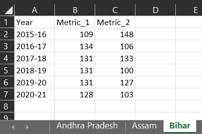

```{r}
#| include: false
source("_common.R")
```

# Combining Many Similar Files {#sec-merge}

Preparing data for analysis can take more time than the analysis itself, because data rarely comes in the form we need. Audit data, in particular, often comes in pieces. One Excel file with a sheet for each State, one file for each district or each month, or one file for each office. In this chapter we will see how to combine such pieces into one data frame with a few lines of code, and also the reverse, how to split one data frame into many files.

## **Case-1**: Merging multiple excel sheets into one data frame

As an example, let us say that we have the data of several States, each on a different sheet of one Excel file, `DauR1.xlsx`. See the preview in @fig-prevexcel.

```{r fig-prevexcel, fig.show='hold', echo=FALSE, fig.cap="Preview of example excel file", fig.align='center', out.width="100%"}

```

We will use the library `readxl` to read Excel files. It is installed along with `tidyverse`, but is not part of the core tidyverse, so it has to be loaded separately.

```{r message=FALSE, warning=FALSE}
library(tidyverse)
library(readxl)
```

The following steps are used.

  Step-1: Store the path of the file.

  Step-2: Collect the names of all sheets with `excel_sheets()`.

  Step-3: Name the elements of this vector with the sheet names themselves, using `set_names()`. The names will travel with the data, and later become a column.

  Step-4: Read all the sheets with `purrr::map()`, and combine them into one table with `purrr::list_rbind()`.

```{r}
# Step-1
path <- "Data/DauR1.xlsx"
# Step-2 and Step-3
states_data <- excel_sheets(path) |>
  set_names() |>
# Step-4
  map(\(sheet) read_excel(path, sheet = sheet)) |>
  list_rbind(names_to = 'State_name')
# print the data
states_data
```

We can see that the data of all the sheets have been merged into one table, and one extra column has been created from the sheet names. The name of that column has been given through the `names_to` argument of `list_rbind()`. If the new column is not required, simply leave out this argument. `set_names()` with a single vector names each element by its own value, so the sheet names become the names of the list.

> Older code often uses `purrr::map_dfr()`, which reads and binds in one step. It still works, but purrr now recommends `map()` followed by `list_rbind()`, which is clearer about what happens.

## **Case-2**: Merging multiple files into one data frame

Often the source data is split into many files, which we have to combine into one data frame. For example, each district sends its monthly expenditure in a separate file. We collect all such files in one folder and follow these steps.

Step-1: Get the names of all the files with `list.files()`.

Step-2: Read all the files into a list with `purrr::map()`.

Step-3: Bind them into one data frame with `list_rbind()`.

Let us first create a few such files in a temporary folder, to try this out.

```{r}
#| code-fold: true
#| code-summary: "Code to create the district files"
folder <- file.path(tempdir(), "district_files")
dir.create(folder, showWarnings = FALSE)

set.seed(15)
for (d in c("Amarpur", "Belapur", "Chandpur")) {
  tibble(month  = month.abb[4:9],
         head   = "Salaries",
         amount = round(runif(6, 20, 60), 2)) |>
    write_csv(file.path(folder, paste0(d, "_2024.csv")))
}
```

```{r}
files <- list.files(folder, pattern = "\\.csv$", full.names = TRUE)
basename(files)

district_data <- files |>
  set_names(basename(files)) |>
  map(\(f) read_csv(f, col_types = cols(.default = col_character()))) |>
  list_rbind(names_to = "source_file") |>
  mutate(amount = parse_number(amount))

district_data
```

Each row now carries the name of the file it came from, in the column `source_file`. We read every column as text, so that files whose columns differ slightly in type can still be bound together. We then converted the amount ourselves, as recommended in @sec-read-check.

Let us reconcile the number of rows and totals of each file.

```{r}
district_data |>
  summarise(rows = n(), total = sum(amount), .by = source_file)
```

::: callout-tip
## Audit tip

Always keep a column recording which file each row came from. When a figure looks wrong later, it tells us at once where to look. And reconcile the rows and totals of each file with the covering letter or the summary sent by the office, so that a missing or duplicated file is noticed before the analysis, not after.
:::

If the files have different column names for the same thing, like `Amount` in one and `amount_rs` in another, clean the names of each file with `janitor::clean_names()` inside the `map()`, and rename them to a common form before binding.

## **Case-3**: Split and save one data frame into multiple excel/csv files simultaneously

Sometimes we need the reverse, for example to send each State or each office its own list of exceptions. Let us use `states_data` created in Case-1, and save the data of each State in a separate csv file. We use the following steps.

Step-1: Split the data frame into a list, with a separate data frame for each State, using base R's `split()`. The elements of the list are named by the State.

Step-2: Write each element to a file named after its State, using `purrr::iwalk()`. `iwalk()` passes each element *and its name* to the function. It is used when we want the side effect, here writing a file, rather than a result.

```{r}
states_data |>
  split(states_data$State_name) |>
  iwalk(\(df, state) write_csv(df, paste0("Data/", state, ".csv")))
```

We can check that 3 new files, named after the States, have been created in the `Data` folder.

```{r}
list.files("Data", pattern = "^(Andhra|Assam|Bihar).*\\.csv$")
```

::: callout-warning
## Caution

Keep each piece of data together with its name, as `split()` and `iwalk()` do. A common mistake is to make a vector of file names with `unique()`, and split the data with `group_split()`. `unique()` keeps the order in which the names first appear, while `group_split()` sorts the groups alphabetically. If the two orders differ, each file gets another State's data, without any error.
:::

## **Case-4**: Splitting one data into multiple files having multiple sheets

Sometimes we need to split the data into several files, and also each file into several sheets. For example, data of States and districts may have to be split into one file for each State, with a separate sheet for each district.

The library `writexl` writes a named list of data frames into one Excel file, one sheet for each. So we can write a small function which does the job.

```{r}
#| message: false
#| warning: false
library(writexl)

book_and_sheets <- function(df, x, y){
  df_by_x <- df |>
    split(df[[x]])

  save_to_excel <- function(a, b){
    a |>
      split(a[[y]]) |>
      writexl::write_xlsx(
        path = paste0("Data/data_by_", b, "_", x, ".xlsx")
      )
  }

  iwalk(df_by_x, save_to_excel)
}
```

The function `book_and_sheets()` writes a data frame `df` into separate files based on the column `x`, and divides each file into sheets based on the column `y`. Note that `x` and `y` are given as character strings, the names of the columns.

Example - splitting `mtcars` into files based on `cyl`, and sheets based on `gear`.

```{r}
book_and_sheets(mtcars, 'cyl', 'gear')
list.files("Data", pattern = "^data_by_.*_cyl\\.xlsx$")
```

Three Excel files have been created in the folder `Data`, one for each number of cylinders, and each has a sheet for each number of gears.

## A suggested workflow

When data arrives in pieces, like one sheet for each State or one file for each district, an auditor may follow these steps.

1.  **Collect the pieces in one place.** Keep all the files in one folder, and list them with `list.files()` using `pattern` and `full.names = TRUE`. For one Excel file, list its sheets with `excel_sheets()`.
2.  **Check that nothing is missing.** Compare the list of files or sheets with the covering letter, so that a missing or extra file is noticed at once.
3.  **Name each piece.** Use `set_names()` so that the file or sheet name travels with the data.
4.  **Read every piece the same way.** Use `map()` and read all columns as text, so that small differences in type do not stop the binding. Clean and rename the columns if the files use different names.
5.  **Bind with a source column.** Use `list_rbind(names_to = )` so that each row records the file or sheet it came from.
6.  **Reconcile each piece.** Convert the amounts, then compare the rows and totals of each file with the summary sent by the office.
7.  **Split the results back when needed.** Use `split()` and `iwalk()` to write one file for each State or office, or `write_xlsx()` for one sheet each.

::: callout-important
## Remember

Always keep a column showing which file each row came from. Reconcile the rows and totals of each file before the analysis. When splitting, keep each piece together with its name, as `split()` and `iwalk()` do, so that no office gets another office's data.
:::

## Summary of functions used

| Function | Package | What it does |
|-----------------------|----------------|--------------------------------|
| `excel_sheets()`, `read_excel()` | readxl | List and read the sheets of an Excel file |
| `list.files()`, `basename()` | base R | List files in a folder, and take the file name from a path |
| `set_names()` | purrr (rlang) | Name the elements of a vector or list |
| `map()`, `list_rbind(names_to = )` | purrr | Read each piece, and bind them into one data frame with a source column |
| `split()` | base R | Split a data frame into a named list, by a column |
| `iwalk()` | purrr | Do something, like writing a file, with each element and its name |
| `write_csv()`, `write_xlsx()` | readr, writexl | Write data frames to csv or Excel files |

: Functions used in this chapter {#tbl-mergefunctions}
