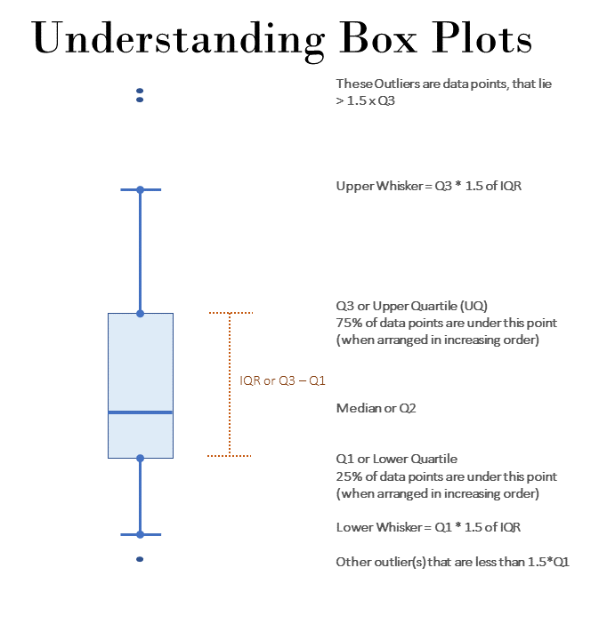

# Visualisations in Base R
It is a common practice to visualize data as soon as we start analysing it.  While small data can be easily visualised in data format, the most common being opening it in MS Excel format, it becomes a hurdle to look at it when the data is bigger.  Undoubtedly, visualization is an essential tool for data analysis because it enables us to see patterns and relationships that may not be apparent from a simple numerical summary. For example, a histogram can show the distribution of a variable, which can help identify outliers or skewness that may be hidden in the summary statistics. Similarly, a scatter plot can show the relationship between two variables, which can help identify correlation or causation that may not be apparent from summary statistics.

Visualization also plays a crucial role in communicating data analysis results to others. A well-designed graph or chart can convey information more effectively than a table of numbers or a lengthy report. It can also help identify errors or anomalies in the data and facilitate better decision-making.

In R, the base graphics system provides a powerful set of functions for creating various types of graphs and plots. In this chapter, we will cover the most commonly used functions for creating visualizations in base R, including `plot()`, `boxplot()`, `barplot()`, `hist()`, `pie()`, `dotchart()` and kernel density plots. 

> Note:  In next chapter we will cover visulaisation through `ggplot2` library which is very extensive, and is developed on theortical framework known as 'grammar of graphics'.  This grammar, created by Leland Wilkinson, has been implemented in a variety of data visualisation software like Tableau^[[https://statmodeling.stat.columbia.edu/2021/05/14/tableau-and-the-grammar-of-graphics/](https://statmodeling.stat.columbia.edu/2021/05/14/tableau-and-the-grammar-of-graphics/)], Plotly, etc.

## Using `plot()`
The `plot()` function in R is a very versatile function that can create a wide variety of visualizations. Its primary purpose is to create scatterplots, but it can also create line plots, bar plots, box plots, and many other types of plots. The "plot" function can be customized in many ways, allowing users to create high-quality visualizations that are tailored to their specific needs.

The basic syntax of the "plot" function is as follows:
```
plot(x, y, ...)
```
The `x` and `y` arguments specify the variables to be plotted on the x-axis and y-axis, respectively. The `...` argument can include a wide range of optional arguments that customize the plot. Some of the most commonly used optional arguments include:

- `xlab`: Specifies the label for the x-axis.
- `ylab`: Specifies the label for the y-axis.
- `main`: Specifies the main title for the plot.
- `xlim`: Specifies the limits for the x-axis.
- `ylim`: Specifies the limits for the y-axis.
- `type`: Specifies the type of plot to be created (e.g., `"p"` for points, `"l"` for lines,`"b"` for both points and lines, etc.).
- `col`: Specifies the color of the plot elements (e.g., points, lines, etc.).
- `pch`: Specifies the symbol used for the points in the plot.
- `cex`: Specifies the size of the plot elements (e.g., points, lines, etc.).

> Note: Here `x` and `y` refer to vectors instead of column names, as we will see in next chapter on ggplot2 where we will use column names, instead of individual vectors.  You'll understand the difference in the following example.

Example of scatterplot: (This will create a scatterplot with "wt" on the x-axis and "mpg" on the y-axis, with axis labels and a main title.)
```{r p1, fig.align='center', out.height="55%", fig.show='hold'}
plot(mtcars$wt, 
     mtcars$mpg, 
     xlab = "Car Weight (1000 lbs)", 
     ylab = "Miles per Gallon", 
     main = "Scatterplot of MPG vs Car Weight")
```

Example-2: Lineplot (This will create a line plot with "pressure"^[The "pressure" dataset contains measurements of vapor pressure of mercury as a function of temperature, measured at 10 different times. The line plot will show the trend of vapor pressure over time.] on the y-axis and "time" on the x-axis, with axis labels and a main title.)
```{r p2, fig.align='center', out.height="55%", fig.show='hold'}
plot(pressure, 
     type = "l", 
     xlab = "Time", 
     ylab = "Pressure", 
     main = "Line Plot of Pressure vs Time")

```
Note in above example that, the "type" argument is set to "l" to specify that a line plot should be created. 

Example-3: Bar-Plot (bar plot of the number of cars by "cyl" i.e. number of cylinders)
```{r p3, fig.align='center', out.height="55%", fig.show='hold'}
barplot(table(mtcars$cyl), 
        xlab = "Number of Cylinders", 
        ylab = "Frequency", 
        main = "Barplot of Number of Cars by Cylinders")

```
Note: In above example we have used `table()` function to get the frequency table of `mtcars$cyl`.

Example-4: Boxplot ()
```{r p4, fig.align='center', out.height="55%", fig.show='hold'}
# Create a boxplot of "Sepal.Length" by "Species" in the iris dataset
plot(x = iris$Species, 
     y = iris$Sepal.Length, 
     main = "Boxplot of Sepal Length by Species",
     xlab = "Species", 
     ylab = "Sepal Length", 
     col = "darkgray")

```

Example-5: density plot
```{r p5, fig.align='center', out.height="55%", fig.show='hold'}
# Create a density plot of "Sepal.Length" in the iris dataset
plot(density(iris$Sepal.Length), main = "Density Plot of Sepal Length in the iris dataset",
     xlab = "Sepal Length", ylab = "Density", col = "blue")

```
Note that we have used `density()` function within `plot()` to create a density plot.

Let us learn about other plotting functions in base R.

## Bar plots using `barplot()`
As the name suggests `barplot()` function is used to create bar charts in R. The basic syntax is `barplot(height, ...)` where `height` should be a vector providing heights of each bar.  Other arguments in ellipsis `...` can be checked by using `?barplot()`.

Here are a few examples of how to use the function:

Example: Basic Bar Chart
```{r p6, fig.align='center', out.height="55%", fig.show='hold'}
# Create a basic bar chart of the "mpg" dataset

barplot(mtcars$mpg, names.arg = rownames(mtcars), main = "Miles Per gallon - mtcars", xlab = "Car Model", ylab = "MPG")

```

Example- Bar chart with summarised data
```{r p7, fig.align='center', out.height="55%", fig.show='hold'}
# Create a summarised bar chart of the "PlantGrowth" dataset
data(PlantGrowth)
barplot(height = t(tapply(PlantGrowth$weight, 
                          list(PlantGrowth$group), 
                          mean)), 
        main = "Mean Weight of Plants by Group", 
        ylab = "Group", 
        xlab = "Weight", 
        col = c("red", "green", "blue"), 
        beside = TRUE, 
        horiz = TRUE)
```

Example- Grouped Bar Chart
```{r p8, fig.align='center', out.height="55%", fig.show='hold'}
# Create a grouped bar chart of the "ChickWeight" dataset
data(ChickWeight)
barplot(height = t(tapply(ChickWeight$weight, 
                          list(ChickWeight$Diet, ChickWeight$Time), 
                          mean)), 
        main = "Mean Weight of Chicks by Diet and Time", 
        xlab = "Diet and Time", ylab = "Weight", 
        col = c("red", "green", "blue", "yellow"), 
        beside = TRUE,
        legend.text = c("Diet 1", "Diet 2", "Diet 3", "Diet 4"))
```


Example: Stacked Bar Chart
```{r p9, fig.align='center', out.height="55%", fig.show='hold'}
# Create a stacked bar chart of the "VADeaths" dataset
data(VADeaths)
barplot(as.matrix(VADeaths), 
        main = "Death Rates by Age Group and Gender", 
        xlab = "Age Group", 
        ylab = "Death Rate", 
        col = c("red", "green", "blue", "yellow", "purple"), 
        legend.text = c("Females", "Males"), 
        beside = FALSE)

```

In fact, we can also create barplots using formula directly.  See this example
```{r p10, fig.align='center', out.height="55%", fig.show='hold'}
barplot(GNP ~ Year, data = longley)
```

## Histograms using `hist()`
The `hist()` function in R is used to create a histogram, which is a graphical representation of the distribution of a numeric variable. The basic syntax for `hist()` is as follows:

```
hist(x, breaks = "Sturges", freq = TRUE, main = NULL,
     xlab = NULL, ylab = "Frequency", ...)
```
where -

- `x`: The data to be plotted, which should be a numeric vector or a matrix.
- `breaks`: The number of bins to use in the histogram. By default, R uses the Sturges formula to determine the number of bins, but you can also specify a different number of bins or a vector of breakpoints.
- `freq`: A logical value indicating whether to plot the frequency or density of the data. If `TRUE`, the y-axis represents the number of observations in each bin. If `FALSE`, the y-axis represents the density of the data.
- `main`: A character string specifying the title of the histogram.
- `xlab`: A character string specifying the label of the x-axis.
- `ylab`: A character string specifying the label of the y-axis.
- `...`: Additional arguments passed to the `plot()` function, such as `col`, `border`, and `xlim`.

Example -
```{r p11, fig.align='center', out.height="55%", fig.show='hold'}
hist(iris$Sepal.Length, breaks = 10, col = "blue",
     xlab = "Sepal Length", ylab = "Frequency",
     main = "Histogram of Sepal Length in Iris Dataset")
```

Another example using two layers
```{r p12, fig.align='center', out.height="55%", fig.show='hold'}
hist(mtcars$mpg,
     freq=FALSE,
     breaks=12,
     col="red",
     xlab="Miles Per Gallon",
     main="Histogram, with density curve")
# add density curve
lines(density(mtcars$mpg), col="blue", lwd=2)
```

In above example we have used `lines()` function to add another layer to existing plot.  

## Boxplot(s) and variants using `boxplot()`

A Box-plot is also called box and whiskers plot and is used to show distribution of a numerical variable using graphical summaries.  Deciphering box plot can be understood using the following illustration.
```{r boxplots, echo=FALSE, fig.cap="Understanding boxplots", fig.align='center', fig.show='hold', out.height="45%"}

```

Using `boxplot()` function is simple, as the syntax is `boxplot(x, ...)` where `x` is a numeric vector or a list of numeric vectors to be plotted, and `...` represents any additional arguments that can be used to customize the appearance of the box plot.

Example-
```{r p13, fig.align='center', out.height="55%", fig.show='hold'}
boxplot(mtcars$mpg)
```

However, the boxplots are particularly useful when drawn in parallel over several categories.  To draw these, we can directly use formula as we did in example above.  E.g. the following code will create box-plots of for each type of spray, from InsectSprays^[a base R data-set having the counts of insects in agricultural experimental units treated with different insecticides.] data.
```{r p14, fig.align='center', out.height="55%", fig.show='hold'}
boxplot(count ~ spray, 
        data = InsectSprays, 
        col = "lightgray")
```

## Saving and exporting charts
See last section of next chapter.

## Use of `par()`
One of the useful functions while using base R's graphics is `par()` which is used to set or query graphical **par**ameters.  See the following example, where one of its argument `mfrow = c(nr, nc)` has been used inside this function to draw subsequent plots in an `nr`-by-`nc` array on the device.  
```{r}
par(mfrow = c(2,2))
purrr::walk(1:4, 
     ~plot(anscombe[[paste0('x', .x)]], 
           anscombe[[paste0('y', .x)]], 
           xlab = paste0('x', .x),
           ylab = paste0('y', .x),
           main = paste("Anscombe's Quartet Chart No.", .x))
     )
```

