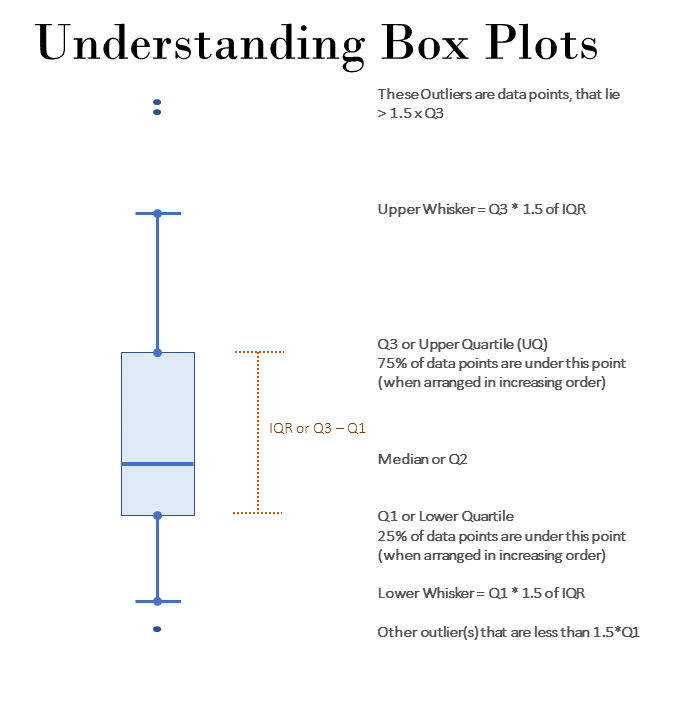

```{r}
#| include: false
source("_common.R")
```


# Visualisations in Base R {#sec-baseplot}
It is good practice to look at data as soon as we start analysing it. Small data can be looked at row by row, say in a spreadsheet, but that becomes impossible as the data grows. Visualisation is an essential tool of data analysis, because it shows patterns and relationships that a numerical summary may hide. For example, a histogram shows the distribution of a variable, and can reveal outliers or skewness hidden in the summary statistics. A scatter plot shows the relationship between two variables. It can reveal a correlation, though, by itself, it can never prove that one causes the other.

Visualization also plays a crucial role in communicating data analysis results to others. A well-designed graph or chart can convey information more effectively than a table of numbers or a lengthy report. It can also help identify errors or anomalies in the data and facilitate better decision-making.

In R, the base graphics system provides a powerful set of functions for creating various types of graphs and plots. In this chapter, we will cover the most commonly used functions for creating visualisations in base R, including `plot()`, `boxplot()`, `barplot()`, `hist()`, `pie()`, `dotchart()` and kernel density plots.

> Note: In the next chapter we will cover visualisation with the `ggplot2` library, which is very extensive, and is built on a theoretical framework known as the 'grammar of graphics'.  This grammar, created by Leland Wilkinson, has been implemented in a variety of data visualisation software like Tableau^[[https://statmodeling.stat.columbia.edu/2021/05/14/tableau-and-the-grammar-of-graphics/](https://statmodeling.stat.columbia.edu/2021/05/14/tableau-and-the-grammar-of-graphics/)], Plotly, etc.

## Using `plot()`
The `plot()` function in R is a very versatile function that can create a wide variety of visualisations. Its primary purpose is to create scatterplots, but it can also create line plots, bar plots, box plots, and many other types of plots. The "plot" function can be customized in many ways, allowing users to create high-quality visualisations that are tailored to their specific needs.

The basic syntax of the "plot" function is as follows:
```
plot(x, y, ...)
```
The `x` and `y` arguments specify the variables to be plotted on the x-axis and y-axis, respectively. The `...` argument can include a wide range of optional arguments that customize the plot. Some of the most commonly used optional arguments include:

- `xlab`: Specifies the label for the x-axis.
- `ylab`: Specifies the label for the y-axis.
- `main`: Specifies the main title for the plot.
- `xlim`: Specifies the limits for the x-axis.
- `ylim`: Specifies the limits for the y-axis.
- `type`: Specifies the type of plot to be created (e.g., `"p"` for points, `"l"` for lines,`"b"` for both points and lines, etc.).
- `col`: Specifies the color of the plot elements (e.g., points, lines, etc.).
- `pch`: Specifies the symbol used for the points in the plot.
- `cex`: Specifies the size of the plot elements (e.g., points, lines, etc.).

> Note: Here `x` and `y` refer to vectors instead of column names, as we will see in next chapter on ggplot2 where we will use column names, instead of individual vectors.  You'll understand the difference in the following example.

Example of scatterplot: (This will create a scatterplot with "wt" on the x-axis and "mpg" on the y-axis, with axis labels and a main title.)
```{r p1, fig.align='center', out.height="55%", fig.show='hold'}
plot(mtcars$wt,
     mtcars$mpg,
     xlab = "Car Weight (1000 lbs)",
     ylab = "Miles per Gallon",
     main = "Scatterplot of MPG vs Car Weight")
```

Example-2: Line plot. The `pressure`^[The `pressure` dataset contains 19 measurements of the vapour pressure of mercury, in millimetres of mercury, at temperatures from 0 to 360 degrees Celsius.] data has two columns, `temperature` and `pressure`. When a data frame of two columns is given to `plot()`, the first column goes on the x-axis and the second on the y-axis.
```{r p2, fig.align='center', out.height="55%", fig.show='hold'}
plot(pressure,
     type = "l",
     xlab = "Temperature (degrees Celsius)",
     ylab = "Pressure (mm of mercury)",
     main = "Vapour pressure of mercury")

```
Note in above example that, the "type" argument is set to "l" to specify that a line plot should be created.

Example-3: Bar-Plot (bar plot of the number of cars by "cyl" i.e. number of cylinders)
```{r p3, fig.align='center', out.height="55%", fig.show='hold'}
barplot(table(mtcars$cyl),
        xlab = "Number of Cylinders",
        ylab = "Frequency",
        main = "Barplot of Number of Cars by Cylinders")

```
Note: In above example we have used `table()` function to get the frequency table of `mtcars$cyl`.

Example-4: Boxplot ()
```{r p4, fig.align='center', out.height="55%", fig.show='hold'}
# Create a boxplot of "Sepal.Length" by "Species" in the iris dataset
plot(x = iris$Species,
     y = iris$Sepal.Length,
     main = "Boxplot of Sepal Length by Species",
     xlab = "Species",
     ylab = "Sepal Length",
     col = "darkgray")

```

Example-5: density plot
```{r p5, fig.align='center', out.height="55%", fig.show='hold'}
# Create a density plot of "Sepal.Length" in the iris dataset
plot(density(iris$Sepal.Length), main = "Density Plot of Sepal Length in the iris dataset",
     xlab = "Sepal Length", ylab = "Density", col = "blue")

```
Note that we have used `density()` function within `plot()` to create a density plot.

Let us learn about other plotting functions in base R.

## Bar plots using `barplot()`
As the name suggests `barplot()` function is used to create bar charts in R. The basic syntax is `barplot(height, ...)` where `height` should be a vector providing heights of each bar.  Other arguments in ellipsis `...` can be checked by using `?barplot()`.

Here are a few examples of how to use the function:

Example: Basic Bar Chart
```{r p6, fig.align='center', out.height="55%", fig.show='hold'}
# Create a basic bar chart of the "mpg" dataset

barplot(mtcars$mpg, names.arg = rownames(mtcars), main = "Miles Per gallon - mtcars", xlab = "Car Model", ylab = "MPG")

```

Example- Bar chart with summarised data
```{r p7, fig.align='center', out.height="55%", fig.show='hold'}
# Create a summarised bar chart of the "PlantGrowth" dataset
data(PlantGrowth)
barplot(height = t(tapply(PlantGrowth$weight,
                          list(PlantGrowth$group),
                          mean)),
        main = "Mean Weight of Plants by Group",
        ylab = "Group",
        xlab = "Weight",
        col = c("red", "green", "blue"),
        beside = TRUE,
        horiz = TRUE)
```

Example- Grouped Bar Chart
```{r p8, fig.align='center', out.height="55%", fig.show='hold'}
# Create a grouped bar chart of the "ChickWeight" dataset
data(ChickWeight)
barplot(height = tapply(ChickWeight$weight,
                        list(ChickWeight$Diet, ChickWeight$Time),
                        mean),
        main = "Mean Weight of Chicks by Diet and Time",
        xlab = "Time (days)", ylab = "Weight (grams)",
        col = c("red", "green", "blue", "yellow"),
        beside = TRUE,
        legend.text = c("Diet 1", "Diet 2", "Diet 3", "Diet 4"),
        args.legend = list(x = "topleft"))
```

`tapply()` gives a matrix of mean weights, with one row for each diet and one column for each day. `barplot()` draws one group of bars for each *column*, and one bar, in its own colour, for each *row*. So we get a group for each day, with one bar per diet, and the legend names the rows.


Example: Stacked Bar Chart
```{r p9, fig.align='center', out.height="55%", fig.show='hold'}
# Create a stacked bar chart of the "VADeaths" dataset
data(VADeaths)
barplot(VADeaths,
        main = "Death Rates in Virginia (1940) by Age Group and Population Group",
        xlab = "Population group",
        ylab = "Death rate (per 1000)",
        col = c("red", "green", "blue", "yellow", "purple"),
        legend.text = rownames(VADeaths),
        args.legend = list(x = "topright", title = "Age group", ncol = 2),
        ylim = c(0, 300),
        beside = FALSE)

```

`VADeaths` is already a matrix, with five age groups as rows and four population groups (rural and urban, male and female) as columns. With `beside = FALSE`, the rows are *stacked* in each column. So each bar is a population group, and each coloured piece an age group.

In fact, we can also create barplots using formula directly.  See this example
```{r p10, fig.align='center', out.height="55%", fig.show='hold'}
barplot(GNP ~ Year, data = longley)
```

## Histograms using `hist()`
The `hist()` function in R is used to create a histogram, which is a graphical representation of the distribution of a numeric variable. The basic syntax for `hist()` is as follows:

```
hist(x, breaks = "Sturges", freq = TRUE, main = NULL,
     xlab = NULL, ylab = "Frequency", ...)
```
where -

- `x`: The data to be plotted, which should be a numeric vector or a matrix.
- `breaks`: The number of bins to use in the histogram. By default, R uses the Sturges formula to determine the number of bins, but you can also specify a different number of bins or a vector of breakpoints.
- `freq`: A logical value indicating whether to plot the frequency or density of the data. If `TRUE`, the y-axis represents the number of observations in each bin. If `FALSE`, the y-axis represents the density of the data.
- `main`: A character string specifying the title of the histogram.
- `xlab`: A character string specifying the label of the x-axis.
- `ylab`: A character string specifying the label of the y-axis.
- `...`: Additional arguments passed to the `plot()` function, such as `col`, `border`, and `xlim`.

Example -
```{r p11, fig.align='center', out.height="55%", fig.show='hold'}
hist(iris$Sepal.Length, breaks = 10, col = "blue",
     xlab = "Sepal Length", ylab = "Frequency",
     main = "Histogram of Sepal Length in Iris Dataset")
```

Another example using two layers
```{r p12, fig.align='center', out.height="55%", fig.show='hold'}
hist(mtcars$mpg,
     freq=FALSE,
     breaks=12,
     col="red",
     xlab="Miles Per Gallon",
     main="Histogram, with density curve")
# add density curve
lines(density(mtcars$mpg), col="blue", lwd=2)
```

In above example we have used `lines()` function to add another layer to existing plot.

## Boxplot(s) and variants using `boxplot()`

A Box-plot is also called box and whiskers plot and is used to show distribution of a numerical variable using graphical summaries.  Deciphering box plot can be understood using the following illustration.
```{r fig-boxplots, echo=FALSE, fig.cap="Understanding boxplots", fig.align='center', fig.show='hold', out.height="45%"}

```

Using `boxplot()` function is simple, as the syntax is `boxplot(x, ...)` where `x` is a numeric vector or a list of numeric vectors to be plotted, and `...` represents any additional arguments that can be used to customize the appearance of the box plot.

Example-
```{r p13, fig.align='center', out.height="55%", fig.show='hold'}
boxplot(mtcars$mpg)
```

However, the boxplots are particularly useful when drawn in parallel over several categories.  To draw these, we can directly use formula as we did in example above.  E.g. the following code will create box-plots of for each type of spray, from InsectSprays^[a base R data-set having the counts of insects in agricultural experimental units treated with different insecticides.] data.
```{r p14, fig.align='center', out.height="55%", fig.show='hold'}
boxplot(count ~ spray,
        data = InsectSprays,
        col = "lightgray")
```

## Saving and exporting charts
See the last section of the next chapter.

## Use of `par()`
One of the useful functions of base R graphics is `par()`, which sets or queries graphical **par**ameters. In the following example, its argument `mfrow = c(nr, nc)` draws the next plots in an `nr`-by-`nc` grid on the same page.

The data is *Anscombe's quartet*, four small datasets created by the statistician Francis Anscombe in 1973. Let us first look at their summary statistics.

```{r}
data.frame(set  = 1:4,
           mean_x = sapply(1:4, \(i) mean(anscombe[[paste0("x", i)]])),
           mean_y = sapply(1:4, \(i) round(mean(anscombe[[paste0("y", i)]]), 2)),
           cor_xy = sapply(1:4, \(i) round(cor(anscombe[[paste0("x", i)]],
                                              anscombe[[paste0("y", i)]]), 3)))
```

The four datasets have the same means and practically the same correlation. Now let us draw them.

```{r}
#| label: fig-anscombe
#| fig-cap: "Anscombe's quartet, four datasets with the same summary statistics"
old_par <- par(mfrow = c(2, 2))
purrr::walk(1:4,
     ~plot(anscombe[[paste0('x', .x)]],
           anscombe[[paste0('y', .x)]],
           xlab = paste0('x', .x),
           ylab = paste0('y', .x),
           main = paste("Anscombe's Quartet Chart No.", .x))
     )
par(old_par)   # restore the earlier settings
```

The pictures are completely different. Only the first is a normal linear relationship. The second is a curve, the third is a straight line spoiled by one outlier, and in the fourth a single point creates the whole correlation. Summary statistics alone would never tell us this. This is the strongest argument for always looking at the data.

`par()` returns the old settings, which we saved in `old_par` and restored at the end. Otherwise, all later plots would also be drawn four to a page.

## Audit use case, payments just below a limit {#sec-baseplot-audit}

Suppose purchases up to ₹1 lakh can be approved by an officer, and anything above needs a higher authority or a tender. A common irregularity is to *split* a larger purchase into several bills, each just below the limit. A histogram of payment amounts can show this at a glance.

```{r}
#| code-fold: true
#| code-summary: "Code to create the payments"
set.seed(77)
amounts <- round(rlnorm(3000, log(30000), 0.9))
# Planted. 60 bills just below the limit of Rs 1 lakh
amounts <- c(amounts, round(runif(60, 94000, 99999)))
```

```{r}
#| label: fig-belowlimit
#| fig-cap: "Payments between Rs 50,000 and Rs 1.5 lakh, with the approval limit marked in red"
hist(amounts[amounts >= 50000 & amounts <= 150000],
     breaks = seq(50000, 150000, by = 2500),
     col = "grey80", border = "white",
     xlab = "Amount of payment (Rs)", main = NULL)
abline(v = 100000, col = "red", lwd = 2)
```

The number of payments falls steadily as amounts rise, as expected, except for a sharp spike just *below* ₹1 lakh, and a drop just above it. The 2,500-rupee bins just under the limit hold far more payments than their neighbours. Such a spike is a strong lead for splitting of purchases. The next step is to look at the payments in that bin, by vendor and date. We test this pattern formally in @sec-nigrini.

::: callout-tip
## Audit tip

Choose the bins carefully. Too wide a bin hides the spike. Here we used bins of ₹2,500 and limited the chart to the range around the limit. Use `abline()` to mark the limit, so that the reader sees the point at once.
:::

## Summary of functions used

| Function | Package | What it does |
|-----------------------|----------------|--------------------------------|
| `plot()` | base R | Scatter plots, line plots and more, depending on the data |
| `barplot()` | base R | Bar charts, grouped (`beside = TRUE`) or stacked |
| `hist()` | base R | Histograms, with `breaks` controlling the bins |
| `density()`, `lines()` | base R | Density curves, and adding lines to an existing plot |
| `boxplot()` | base R | Box plots, including by groups with a formula like `y ~ group` |
| `abline()` | base R | Adds a straight line, like a limit, to an existing plot |
| `par(mfrow = )` | base R | Several plots on one page, and other graphical settings |
