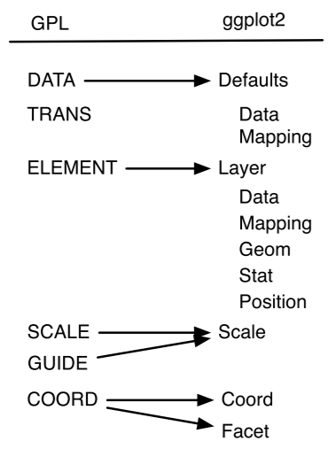
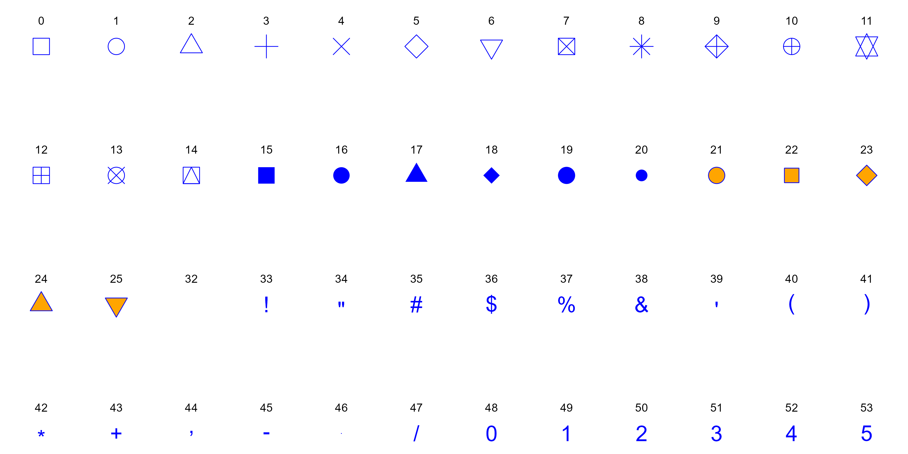
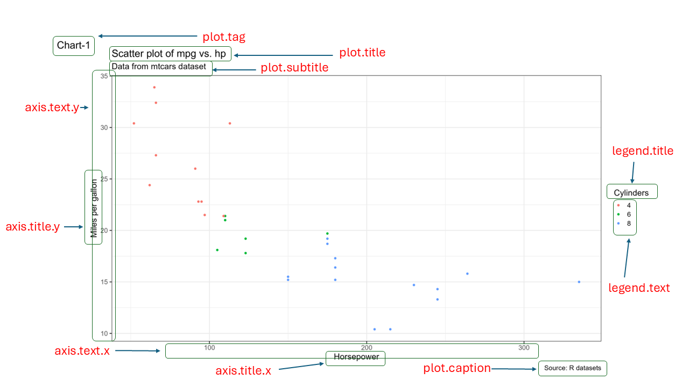

# Visualising data with `ggplot2`

## Core concepts of **grammar of graphics**

**ggplot2**[^00-ggplot2-1] [@R-ggplot2] is the package developed by Hadley Wickham, which is based on concepts laid (2005) down by Leland Wilkinson in his *The Grammar of Graphics*.[^00-ggplot2-2] Basically, **grammar of graphics** is a framework which follows a layered approach to describe and construct visualizations or graphics in a structured manner. Even the letters `gg` in ggplot2 stand for `g`grammar of `g`raphics.

[^00-ggplot2-1]: <https://ggplot2.tidyverse.org/>

[^00-ggplot2-2]: <https://link.springer.com/book/10.1007/0-387-28695-0>

Hadley Wickham, in his paper titled **A Layered Grammar of Graphics**[^00-ggplot2-3](2010) [@layered-grammar] proposed his idea of layered grammar of graphics in detail and simultaneously put forward his idea of *ggplot2* as an open source implementation framework for building graphics. Readers/Users are advised to check the paper as it describes the concept of grammar of graphics in detail. By the end of the decade the package progressed[^00-ggplot2-4] to one of the most used and popular packages in R.

[^00-ggplot2-3]: <http://vita.had.co.nz/papers/layered-grammar.pdf>

[^00-ggplot2-4]: Version 3.3.0 was released in March 2020

The relationship between the components explained in both the grammars can be illustrated with the image[^00-ggplot2-5] in Figure \@ref(fig:rgg1). The components on the left have been put forward by Wilkinson whereas those on right were proposed by Wickham. It may be seen that `TRANS` has no relation in `ggplot2` as its role is played by in-built features of R.

[^00-ggplot2-5]: Source: Hadley Wickham's paper on *the layered grammar of graphics*

```{r rgg1, echo=FALSE, fig.cap="Layers in Grammar of Graphics mapped in GGPLOT2", fig.align='center', fig.show='hold', out.height="40%", out.width="50%"}

```

Thus, to build a graphic having one or more dimensions, from a given data, we use *seven* major components -

1.  **Data:** Unarguably, a graphic/visualisation should start with a
    data. It is also the first argument in most important function in
    the package i.e. `ggplot(data =)`.
2.  **Aesthetics:** or `aes()` in short, provide a **mapping** of
    various data dimensions to axes so as to provide positions to
    various data points in the output plot/graphic.
3.  **Geometries:** or `geoms` for short, are used to provide the
    *geometries* so that data points may take a concrete shape on the
    visualisation. For e.g. the data points should be depicted as bars
    or scatter points or else are decided by the provided `geoms.`
4.  **Statistics:** or `stat` for short, provides the statistics to show
    in the visualisation like measures of central tendency, etc.
5.  **Scale:** This component is used to decide whether any dimension
    needs some scaling like logarithmic transformation, etc.
6.  **Coordinate System:** Though most of the time *Cartesian coordinate
    system* is used, yet there are times when *polar coordinate system*
    (e.g. pie chart) or *spherical coordinate system* (e.g. geographical
    maps) are used.
7.  **Facets:** Used when based on certain dimension, the plot is
    divided into further sub-plots.

Out of the afore-mentioned components, first three (`data`, `aesthetics` and `geometries`) are to be explicitly provided and thus can be understood as mandatory components. Whilst these three components are mandatorily provided, it is not that others are not mandatory. It is just that other components have their defaults (e.g. default coordinate system is Cartesian coordinate system). Let us dive into these three essential components and build a plot using these.

## Building a basic plot using key components

We will use `mtcars` data-sets, which is a default dataset in the package, to learn the concepts. Let us see what happens when `data` is provided to `ggplot` function-

```{r figblank, fig.height=2, fig.align='center', fig.show='hold', out.width="100%", fig.cap="Data provided to ggplot2"}
library(tidyverse)
ggplot(data=mtcars)
```

In Figure \@ref(fig:figblank) we can see that a blank chart/plot space has been created as our data `mtcars` has now mapped with ggplot2. Now, let us provide aesthetic mappings to this using function `aes()`, through the argument `mapping` in `ggplot2` function itself.

```{r rgg2, fig.height=2, fig.align='center', fig.show='hold', out.width="100%", fig.cap="Data and mapping provided to ggplot2"}
ggplot(data = mtcars, mapping = aes(x=wt, y=mpg))
```

In Figure \@ref(fig:rgg2), we may now notice that apart from creating a blank space for plot, the two dimensions provided, i.e. `wt` and `mpg` have been *mapped* with `x` and `y` axes respectively. Since no geometry has been provided, the plot area is still blank. Now we will provide geometry to our dimension say *point*. To do this we will use another family of functions i.e. `geom_*` (`geom_point()` in this case specifically).

```{r rgg3, fig.height=3, fig.align='center', fig.show='hold', out.width="100%",fig.cap="Data plotted as points in a scatterplot"}
ggplot(data = mtcars, mapping = aes(x = wt, y = mpg)) +
  geom_point()
```

In Figure \@ref(fig:rgg3) we may now notice that data has been plotted
as points (due to the geometry we used `geom_point`) as soon as we added
another layer of function `ggplot()` using a `+` sign in the earlier
code. **Using the code above, we have actually plotted the relationship
between weight of the vehicle (`wt`) and mileage in miles per gallon
(`mpg`) of the vehicles available in `mpg` dataset.**

We could have plotted the data as box-plot if we had used another
geometry say `geom_boxplot` here. Refer Figure \@ref(fig:rgg4).

```{r rgg4, fig.height=3, fig.align='center', fig.show='hold', out.width="100%", fig.cap="Data plotted as boxplot"}
ggplot(data = mtcars, mapping = aes(y = wt)) +
  geom_boxplot()
```

That's the basic architecture for construction of a plot in this
package. Up to this point it may be noted that we have provided `data`
and `aesthetics` as argument to function `ggplot` and for `geometry` we
have used another function `geom_*` and added it to above components
using a plus `+` sign. In the above code(s) it may also be noted that
`data` and `mapping` are the first two arguments of function `ggplot`;
`x` and `y` are the default first two arguments of function `aes` so we
may draw the same plot in Figure \@ref(fig:rgg3) using the following
code wherein we haven't used these as named arguments. We will follow
the same convention in subsequent sections.

```         
ggplot(mtcars, aes(wt, mpg)) +
  geom_point()
```

Now lets discuss more on `aesthetics` and `geometries` and using these
to build the desired plots, before moving on to other components of plot
in the package.

## Other Aesthetic attributes (color, shape, size, etc.) {#AESTH}

In previous section of this chapter we mapped the attributes in data
using the `position` in coordinate system (`x` and/or `y` in Cartesian
coordinate system). We can, however, map other variables in the data to
the plot using aesthetic attributes like `shape`, `size`, `color`,
`alpha` (transparency), etc., as shown in the image in Figure
\@ref(fig:rrgg5).

```{r rrgg5, echo=FALSE, fig.cap="Some Common Aesthetic mappings.  Image Source: Claus Wilke's book on Fundamentals of Data Visualization", fig.align='center', fig.show='hold'}
knitr::include_graphics("images/aes.png")
```

These aesthetics may be divided broadly into two categories -

-   aesthetics those can be mapped with `continuous` data variable(s);
    and
-   aesthetics those can be mapped with `discrete` or categorical data
    variables.

For example, `position` (coordinates in a coordinate system), `size`,
`color`, `linewidth` can represent continuous data; but `shape`,
`linetype` etc. aesthetics can be mapped with discrete data. Numerical
data which can be used to represent both `continuous` and `discrete`
data (we will see example shortly) if mapped to an aesthetic will by
default represent continuous data and thus, need to be converted to a
discrete data type (factor, in most of the cases will suffice) before
mapping to an aesthetic representing discrete data.

Some commonly used aesthetics are -

-   `shape` = Display a point with `geom_point()` as a dot, star,
    triangle, or square
-   `fill` = The interior color (e.g. of a bar or box-plot)
-   `color` = The exterior line of a `bar`, `boxplot`, etc., or the
    point color if using `geom_point()`
-   `size` = Size (e.g. line thickness, point size)
-   `alpha` = Transparency (`1 = opaque`, `0 = invisible`)
-   `binwidth` = Width of histogram bins
-   `width` = Width of "bar plot" columns
-   `linetype` = Line type (e.g. solid, dashed, dotted)

### Color, the most important aesthetic

Data elements can be colored in a data visualisation using aesthetic
named `color` (Alternative British spelling `colour` will also work in
exactly same way). We can use color in a plot/visualisation primarily
for three purposes-

-   highlight specific or all values.
-   grouping the data points i.e. using color to distinguish data
    elements from each other.
-   mapping a variable, i.e. using color to represent different data
    elements.

To understand the use cases, let us fill the color of all points in
Figure \@(fig:rgg3) with say, `"red"` color. To do this, we can provide
the value of `color` aesthetic directly inside the `geom_*` function
(Figure \@ref(fig:rgg5)).

```{r rgg5, fig.height=3, fig.align='center', fig.cap="Highlighting all data points with a static color", fig.show='hold'}
ggplot(mtcars, aes(wt, mpg)) +
  geom_point(color='red')
```

As the argument `color='red'` was mentioned inside the `geom_point()`
function, it turned every point to red (i.e. with a static color) in
Figure \@ref(fig:rgg5). But if the requirement was to highlight specific
points in the plot, we have to use the `color` inside `aes` function. Or
in other words, we have to use color `aesthetics` to visualise the data.

So let us color the data points in Figure \@ref(fig:rgg5) using the
variable `cyl` (number of cylinders in the vehicle), so that the
scatter-points are colored on the basis of number of cylinders instead.

```{r rgg6, fig.height=3, fig.align='center', fig.show='hold', fig.cap="Mapping a numeric variable with color aesthetic"}
ggplot(mtcars, aes(wt, mpg)) +
  geom_point(aes(color=cyl))
```

We may notice in Figure \@ref(fig:rgg6) that scatter-points are now
colored on the basis of number of cylinders in the cars. Simultaneously,
a color scale has been produced as a legend. Since the `cyl` column was
a numeric column, and we mapped that with a `continuous` type aesthetic
color, it mapped the continuous variable with the aesthetic by default.
Now in this case, though the `cyl` is having numerical values, the plot
will be more meaningful if the corresponding `discrete` variable is
mapped with color aesthetic. So we can convert it into a factor type
variable, on the fly.

```{r rgg7, fig.height=3, fig.align='center', fig.show='hold', fig.cap="Mapping a discrete variable with color aesthetic"}
ggplot(mtcars, aes(wt, mpg)) +
  geom_point(aes(color=as.factor(cyl)))
```

In Figure \@ref(fig:rgg7) we may see that the points have been grouped
using different color of each of the group. Readers may also that the
`color` aesthetic was provided through `aes()` function in the second
layer which was wrapped in `geom_point()` function. The aesthetic could
have been wrapped in `ggplot()` layer also. So basically the following
code will also produce exactly the same chart-

```         
ggplot(mtcars, aes(wt, mpg, color = as.factor(cyl))) +
  geom_point()
```

So is there any difference between the two? Yes, basically aesthetics if
provided under the `geoms`, will override those aesthetics which are
already provided under `ggplot` function. To understand the difference,
see the result of following code in Figure \@ref(fig:rgg8).

```{r rgg8, fig.height=3, fig.align='center', fig.show='hold', fig.cap="Over-riding aesthetics"}
ggplot(mtcars, aes(wt, mpg, color = as.factor(cyl))) +
  geom_point(color='red')
```

As the third use-case, i.e. using color to describe the variable, let us
analyse the mean mileage of cars for each group of cars for (i) number
of cylinders `cyl` and (ii) number of carburetors `carb`. A good
visualisation to plot the values will be *heat-map* (sometimes also
called as *highlight table*). We will generate a grouped summary before
proceeding, which can be understood using the concepts explained in
chapter related to data manipulation in dplyr i.e. Chapter
\@ref(DPLYRR).

To draw the rectangular boxes in heat-map we will use another geometry
namely `geom_tile()` and map two categorical variables with `x` and `y`
coordinates in the Cartesian system. To fill the color values on the
basis of variable `mpg` we will use `fill` aesthetic instead of `color`
(we will understand the difference between `fill` and `color` aesthetics
shortly).

```{r rgg9, fig.align='center', fig.show='hold', fig.cap="using color to plot variable directly"}
mtcars |> 
  summarise(mpg = mean(mpg, na.rm = TRUE),
            .by = c(cyl, carb)) |> 
  ggplot() +
  geom_tile(aes(x = cyl, y = carb, fill = mpg))
```

Referring plot in Figure \@ref(fig:rgg9) we may see that cars with 4
cylinders and 1 carburetor have highest mileage.

So up to now, we have seen that to map color dynamically with a
variable, we have pass this aesthetic inside `aes` function; and
otherwise if we intend to use color only as a static value, we may pass
it outside the `aes` i.e. directly in the corresponding `geom` function.
Package ggplot2 recognises most of the color names and we have discussed
more about colors in Appendix \@ref(COLORR). But what if we pass a
static color value to `color` aesthetic inside the `aes` function? Let
us check ourselves.

```{r rgg10, fig.align='center', fig.show='hold', fig.cap="Mapping Static color inside aes"}
ggplot(mtcars, aes(wt, mpg)) +
  geom_point(aes(color='blue'))
```

Interesting! GGPLOT2 has not only mapped a dummy variable called
`'blue'` with color of points, but also created a legend. More
interestingly the color is not what we wanted. Actually, what happened
was, that when we mapped color aesthetic inside `aes()`, ggplot2 created
a new variable on the fly, and then mapped it with the aesthetic and
thus producing a legend for the newly created variable.

### Color Vs. Fill

Till now we use used `color` aesthetic with the `point` geom (Figure
\@ref(fig:rgg7)) and `fill` aesthetic in `tile` geom (Figure
\@ref(fig:rgg9)) to map colors to the variables. Why did we use
different aesthetics? Typically, the `color` aesthetic changes the
outline of a geom and the `fill` aesthetic changes the inside.
`geom_point()` was an exception, we used `color` (not `fill`) for the
point color. Actually, it was not an exception too. The reason was that
the default point shape used by `geom_point()` was `shape = 19`: a solid
circle.

We can see the subtle difference if we override the default shape in
figure \@ref(fig:rgg7) with `shape = 21`: a circle that allows us to use
both `fill` for the inside and `color` for the outline. (Figures
\@ref(fig:rgg11).)

```{r rgg11, fig.align='center', fig.show='hold', fig.cap="Color Vs. Fill aesthetics"}
theme_set(theme_bw())

ggplot(mtcars, aes(wt, mpg)) +
  geom_point(aes(color=as.factor(cyl)), shape = 21, size = 4) +
  ggtitle("Using color aesthetic")

ggplot(mtcars, aes(wt, mpg)) +
  geom_point(aes(fill=as.factor(cyl)), shape = 21, size = 4) +
  ggtitle("Using fill aesthetic")
```

### Transparency through `alpha`

In `ggplot2`, there is one more aesthetic which is used to change color
of the geometries, `alpha` which is used to control the transparency of
the elements in a plot. By adjusting the `alpha` value, which ranges
from 0 (completely transparent) to 1 (fully opaque), we can manage the
visibility and layering of overlapping elements. This is particularly
useful when dealing with dense data, as it helps to reduce over-plotting
and allows for better visualization of distributions and relationships.
Usually, it is used to map a continuous variable with it. Example-

```{r rgg12, fig.show='hold', fig.align='center', fig.cap="Setting transparency with the number of cylinders"}
ggplot(mtcars, aes(x = wt, y = mpg)) +
  geom_point(aes(alpha = cyl), size = 4) 
```

We may see in figure \@ref(fig:rgg12) that points transparency nor
varies according to the number of cylinders i.e. `cyl` variable in the
data. Similar to other aesthetics we may pass static value between 0 to
1 to `alpha` for setting the transparency of geometries as desired.

### Shape Aesthetic

In figure \@ref(fig:rgg11), we already saw the shape aesthetic to change
the shape of points from solid color to hollow color. Actually, in
`ggplot2`, the `shape` aesthetic is used to differentiate points in a
plot by assigning different symbols to them. Moreover, as we have
already discussed, this aesthetic should either be mapped with a
discrete variable; or if using shape from pre-existing shapes in the
package (see `?points`). `ggplot2` supports a variety of shapes, such as
circles, triangles, squares, and more, each represented by a unique
integer or character.

For instance, when plotting data with a categorical variable, we can map
this variable to the `shape` aesthetic to visually separate the groups.
However, it's important to note that shapes can be less effective for
groups with many categories, as the distinctiveness of each shape may
diminish.

So in the above plots, we may map `cyl` variable to shape instead, by
converting it into factor variable.

```{r rgg13, fig.align='center', fig.show='hold', fig.cap="Mapping shape aesthetic"}
ggplot(mtcars, aes(wt, mpg)) +
  geom_point(aes(shape=as.factor(cyl)), size = 3)
```

In above we may notice that different shapes have been used for 4, 6 and
8 cylinder vehicles.

**A few shapes available in `shape` aesthetics, with `fill` aesthetic
shown in `orange' and`color\` aesthetic shown in 'blue' color in
figure** \@ref(fig:shapes)**.**

```{r echo=FALSE, fig.show='hide', message=FALSE, warning=FALSE}
library(tidyverse)

data.frame(
  x = 4:1
) %>% 
  mutate(y = list(1:12)) %>% 
  unnest_longer(y) %>% 
  mutate(z = dplyr::setdiff(0:(nrow(.) + 5), 26:31)) %>%
  ggplot(aes(x=y, y=x, label=z)) +
  geom_point(aes(shape=z), size=7, fill = "orange", color = "blue") +
  scale_shape_identity() +
  labs(x="", y="") +
  geom_text(nudge_y = 0.2) +
  theme_void()

ggsave('shapes.png', width = 12, height = 6)
```

```{r shapes, echo=FALSE, fig.cap="Some Shapes available in GGplot",fig.show='hold', out.width="99%", fig.align='center'}

```

### Size Aesthetic

As we have already seen that the `size` aesthetic controls the size of
plot elements or geometries, such as points in a scatter plot. By
mapping a continuous or discrete variable to `size`, we can represent
additional dimensions of our data, making the plot more informative.

For example, in a scatter plot of car weight versus fuel efficiency, we
might use the `size` aesthetic to represent the horsepower of each car,
where larger points indicate more powerful cars.

```{r rgg14, fig.align='center', fig.show='hold', fig.cap="Mapping size aesthetic"}
ggplot(mtcars, aes(wt, mpg)) +
  geom_point(aes(size=hp))
```

In figure \@ref(fig:rgg14) we may see that a visual layer has been added
that helps to identify relationships and patterns across multiple
variables simultaneously. However, it's essential to use the `size`
aesthetic judiciously, as overly large or small elements can distort the
readability of the plot.

### Using multiple aesthetics simultaneously

Multiple aesthetics can also be mapped simultaneously, as per
requirement. See this example-

```{r rgg15, fig.align='center', fig.show='hold', fig.cap="Using multiple aesthetics"}
ggplot(mtcars,
       aes(
         x = wt,
         y = mpg,
         shape = as.factor(cyl),
         color = as.factor(gear),
         alpha = wt,
         size = hp
       )) +
  geom_point()
```

We will learn about some other aesthetics like `binwidth`, `linetype`,
`width`, etc., in the next section \@ref(geoms) when we will learn about
the use of other geometries.

## More on Geoms {#geoms}

In previous section we have seen that as soon as we passed a `geom_*`
function/layer to `data` & `aesthetics` layers, the chart/graph was
constructed. Actually, `geom_point()` function, in the background added
three more layers i.e. `stat`, `geom` and `position`, because `geom_*`
are actually shortcuts, which add these three layers. So in our example,
`ggplot(mtcars, aes(wt, mpg)) + geom_point()` is actually equivalent to
-

```{r rgg16, fig.show='hold', fig.align='center', fig.cap="Components of GGPLOT2"}
ggplot() +
  layer(
    data = mtcars,
    mapping = aes(wt, mpg),
    geom = "point",
    stat = "identity",
    position = "identity"
  )
```

Some common `geoms` are listed below:

-   Histograms - `geom_histogram()`
-   Bar charts - `geom_bar()` or `geom_col()`
-   Box plots - `geom_boxplot()`
-   Points (e.g. scatter plots) - `geom_point()`
-   Line graphs - `geom_line()` or `geom_path()`
-   Trend lines - `geom_smooth()`
-   Heat-map - `geom_tile()`
-   Label charts using `geom_text()` and/or `geom_label()`

Of these, we have already seen examples of `geom_point`, `geom_boxplot`
and `geom_tile`. Let us discuss some other geoms in a bit detail.

### Univariate Bar Charts through `geom_bar()`

Bar charts though form simplest of the visualisations but can be
deceptive if we try to build these without understanding the mechanics
behind the bars, literally :). Bar charts can both be univariate and
bivariate. Even multivariate data can be visualised through bar charts.

Simplest of bar charts can be a plot showing distribution of a
categorical variable in the data. In other words, the number of data
points available per category of the variable. Example - How many cars
with different cylinder count are available in the data.

```{r rgg17, fig.show='hold', fig.align='center', fig.cap="Univariate Bar Chart"}
ggplot(mtcars, aes(cyl)) +
  geom_bar()
```

In figure \@ref(fig:rgg17) we may see the numbers of cars available per
category (of cylinders therein). As we have used numerical variable on
the x-axis, a numerical scale has been shown. Also notice that our data
was not summarised and ggplot2 itself aggregated it on the basis of
variable passed in aesthetics (position) by applying `count` summary
function. This can be confirmed from the label on `y` axis.

Readers are advised to note the change in x-axis as soon as the variable
is converted to a categorical variable, by executing the code-

```         
ggplot(mtcars, aes(as.factor(cyl))) +
  geom_bar()
```

That was about aggregating data by itself in bar-plot using `count`
function. But sometimes, other aggregation methods may be required. That
can be done if we understand the mechanics behind the code. Actually
`aes(cyl)` was a shortcut to `aes(x = cyl, y = after_stat(count))` where
`count` is a special variable representing the counts in each of the
category present in the variable.

So now, let us calculate proportions instead of count (frequency) of the
categories available in the variable. For a change, now let us use
another dataset `mpg` which comes by default with `ggplot2` package. We
will analyse proportion of vehicles under each `class` (which is a
categorical variable).

```{r rgg18, fig.show='hold', fig.align='center', fig.cap="Univariate Bar Chart representing proportions"}
ggplot(mpg, aes(class, y = after_stat(count/sum(count)))) +
  geom_bar()
```

In figure \@ref(fig:rgg18) we may see that now the proportions have been
plotted (notice y axis).

### Bivariate Bar Charts through `geom_bar()`

We have learn how the `geom_bar()` carries out a summarisation on
un-aggregated or granular data and draws plots for us. To tweak the
summary function, as per our requirement, we used `y` position
aesthetic. But in same granular data, we may sometimes require to
perform an aggregation on another variable.

As an example let us see the mean city mileage `cty` for every `class`
of car in `mpg` data-set. To achieve this, we will another aesthetics
`stat` with special value `"summary_bin"`. Moreover, the `stat`
aesthetics also requires a `fun` statistic which is `mean` in our case.

```{r rgg19, fig.show='hold', fig.align='center', fig.cap="Bivariate Bar Chart representing mean milaege per class of car"}
ggplot(mpg, aes(x = class, y = cty)) + 
  geom_bar(stat = "summary_bin", fun = mean)
```

In figure \@ref(fig:rgg19) we can see that `subcompact` class of cars
has highest mean mileage in city.

In these two sections, we have learnt to draw plots using un-aggregated
data. However, we can also plot pre-aggregated data to bar-plots using
`geom_bar`. So let us draw the same plot as in figure \@ref(fig:rgg19),
but this time aggregating data by ourselves, beforehand. The trick is to
use `stat = "identity"` aesthetics in a `geom_bar()` layer. We will see
what this aesthetic is doing actually in a short-while. For a change,
this time let's draw the plot with x and y axes flipped.

```{r rgg20, fig.show='hold', fig.align='center', fig.cap="Bivariate Bar Chart representing mean milaege per class of car"}
aggregated_mpg <- mpg |> 
  summarise(mean_cty = mean(cty),
            .by = class) 

ggplot(aggregated_mpg, aes(x = mean_cty, y = class)) +
  geom_bar(stat = "identity")
```

In figure \@ref(fig:rgg20) we can see the desired have been generated.
Readers may try the above-mentioned code by removing `stat - "identity"`
from the `geom_bar()`.

Now, as promised we will discuss what `stat` aesthetic does. While
generating summary in a bivariate chart we used `stat = "summary_bin"`
which created summary using `fun` of un-aggregated data. Whereas
`stat = "identity"` tells ggplot2 that data is either already aggregated
or there is only value of `y` per category of `x` variable. So are there
other `stat` aesthetics available for us? The answer is yes. However,
readers are advised to plot bar charts on aggregated data using
`geom_col` which has been discussed in subsequent sections, instead of
trying the complex aggregations within ggplot2 as it gets trickier from
here.

### Stacked bar charts through `geom_bar`

In section \@ref(AESTH), we learnt that we can plot other variables in
the two-dimensional plots using aesthetic attributes like color, size,
etc. As size of the bar, in a bar chart is already mapped to a variable,
most suitable aesthetic to be mapped to another variable is `fill` or
`color`.

Let us aggregate the cars (count) on the basis of `class` again. But
let's map `fill` to fuel type `fl` variable.

```{r rgg24, fig.show='hold', fig.align='center', fig.cap="Color Stacked bar chart"}
ggplot(mpg, aes(x = class, fill = fl)) +
  geom_bar()
```

In figure \@ref(fig:rgg24) we achieved our desired results simply by
mapping `fill` to our additional variable. Actually, this was possible
due to default value of `position` aesthetic in `geom_bar()` layer
`"stack"` matches our requirement. By default, multiple bars occupying
the same x position will be stacked atop one another by
`position_stack()`.

A useful argument `reverse` in this `position_stack()` is also helpful
in reversing the order of `fill` values. E.g. if the above plot is drawn
at y-axis instead.

```{r rgg25, fig.show='hold', fig.align='center', fig.cap="Color Stacked bar chart on Y axis"}
ggplot(mpg, aes(y = class, fill = fl)) +
  geom_bar(position = position_stack(reverse = TRUE)) +
  theme(legend.position = "top")
```

In figure \@ref(fig:rgg25) we can see that legend values now align with
the values represented in bar chart.

To use the bars, side by side, in a plot we can use another position
stat function `position_dodge()`. Redrawing the same plot above with
bars side by side-

```{r rgg26, fig.show='hold', fig.align='center', fig.cap="Dodged Bar Chart"}
ggplot(mpg, aes(x = class, fill = fl)) +
  geom_bar(position = position_dodge()) +
  theme(legend.position = "top")
```

In figure \@ref(fig:rgg26) we may see that separate bar for each fill
axis have now been drawn. The bars' widths have been preserved as the
default parameter for `preserve` inside `position_dodge()` is `total`.
We may have to change it to `"single"` if we want bars of equal width
irrespective of the fact that whether each fill category is available
for each of the `x` value. Refer figure \@ref(fig:rgg27) wherein bars'
widths are equal.

```{r rgg27, fig.show='hold', fig.align='center', fig.cap="Dodged Bar Chart with equal bar widths"}
ggplot(mpg, aes(x = class, fill = fl)) +
  geom_bar(position = position_dodge(preserve = "single")) +
  theme(legend.position = "top")
```

Similar to `position_dodge` there is another `position_dodge2()`
function which works better for bar charts. We may tweak the padding
between bars (Refer figure \@ref(fig:rgg28)).

```{r rgg28, fig.show='hold', fig.align='center', fig.cap="Dodged Bar Chart with padding between bars"}
ggplot(mpg, aes(x = class, fill = fl)) +
  geom_bar(position = position_dodge2(preserve = "single", padding = 0.2)) +
  theme(legend.position = "top")
```

Finally, there is one more position namely `position_fill()` which
stacks bars and standardises each stack to have constant height. Refer
figure \@ref(fig:rgg29).

```{r rgg29, fig.show='hold', fig.align='center', fig.cap="100% stacked bar chart"}
ggplot(mpg, aes(x = class, fill = fl)) +
  geom_bar(position = position_fill()) +
  theme(legend.position = "top")
```

### Bar Charts through `geom_col()`

As stated earlier, plotting bar charts on tedious aggregations through
ggplot2 gets trickier, it is always advisable to plot bar charts through
`geom_col()` in such cases after aggregating thee data ourselves. Since
the difference between `geom_bar` and `geom_col` is that former uses by
default: it counts the number of cases at each x position. On the other
hand, latter uses `stat = “identity”` by default. So to draw the plot as
in figure \@ref(fig:rgg20) through `geom_col()` we may not have to use
`stat` explicitly. (Refer figure \@ref(fig:rgg30).)

```{r rgg30, fig.show='hold', fig.align='center', fig.cap="Plotting through geom col"}
aggregated_mpg <- mpg |> 
  summarise(mean_cty = mean(cty),
            .by = class) 

ggplot(aggregated_mpg, aes(x = mean_cty, y = class)) +
  geom_col()
```

Once the readers have understood the functioning of `position` and
`stat` arguments in `geom_bar` it is now pretty easy to draw stacked bar
charts, dodged bar charts and 100 percent stacked bar charts through
geom_col in a much easier way. Readers may try themselves drawing these
charts using pre-aggregated data keeping in mind that `geom_col` is
using `stat = “identity”` by default and is thus not performing any
aggregation.

### Adding labels to charts using `geom_text` or `geom_label`

Before laerning how to draw other plots using `geom_*` family of
functions, it is the right time to learn labelling the geometries in the
plots.

To label data points in ggplot2, we can use either of the functions (i)
`geom_text()`; (ii)`geom_label()`. `geom_text()` adds only text to the
plot; whereas `geom_label()` draws a rectangle behind the text, making
it easier to read.

These functions adds text provided through `label` aesthetics, to the
plot at the specified `x` and `y` coordinates. Moreover, we can
customize the appearance of the labels by adding additional arguments to
`geom_text()` -

-   `size` to set font size
-   `color` to color the fonts
-   `hjust` or `vjust` to adjust the labels vertically or horizontally,
    respectively. We can modify text alignment with these aesthetics.
    These can either be a number between `0` (right/bottom) and `1`
    (top/left) or a character (`"left"`, `"middle"`, `"right"`,
    `"bottom"`, `"center"`, `"top"`). There are two special alignments:
    `"inward"` and `"outward"`. Inward always aligns text towards the
    center, and outward aligns it away from the center.
-   `family` for font family [the options are `“sans”` (the default),
    `“serif”`, or `“mono”`]
-   `fontface` for face of the font [options: `“plain”` (the default),
    `“bold”`, `"italic"` or `“bold.italic”`]

Example-

```{r rgg31, fig.show='hold', fig.align='center', fig.cap="Adding labels to geoms"}
ggplot(mtcars, aes(x = hp, y = mpg)) +
  geom_point() +
  geom_text(aes(label = rownames(mtcars)),
            size = 3,
            color = "dodgerblue",
            vjust = -1) # -1 pushes he value further upwards (vjust)

```

In figure \@ref(fig:rgg31) we can see the geometries (i.e points) have
been labelled slighly above the points (due to `vjust = -1`). We may
observe that some labels are overlapped. There is a fantastic package
`ggrepel` which works for `ggplot2` plots and places the overlapped
labels in a nicer way. See figure \@ref(fig:rgg32).

```{r rgg32, fig.show='hold', fig.align='center', fig.cap="Adding labels to geoms through external ggrepel package"}
# Load package
library(ggrepel)
# Set global options for max overlaps
options(ggrepel.max.overlaps = Inf)

ggplot(mtcars, aes(x = hp, y = mpg)) +
  geom_point() +
  geom_text_repel(aes(label = rownames(mtcars)),
            size = 3,
            color = "seagreen",
            vjust = -1,
            fontface = "bold.italic")
```

labelling bar charts generated through granular data using `geom_bar()`
may be sometimes tricky as we have to use `stat` functions used to
generate summary/aggregation. See Example in figure \@ref(fig:rgg35)

```{r rgg35, fig.show='hold', fig.align='center', fig.cap="Labelled bar chart"}
# Labelling a bar plot
ggplot(mpg, aes(class)) +
  geom_bar() +
  geom_text(
    aes(
      y = after_stat(count + 2), # shift the label slightly
      label = after_stat(count)
    ),
    stat = "count"
  )
```

If we want to label chart in \@ref(fig:rgg19), we have to provide some
special values aesthetics to `geom_text` (or `geom_label`). See figure
\@ref(fig:rgg33).

```{r rgg33, fig.show='hold', fig.align='center', fig.cap="Bivariate bar chart labelled"}
ggplot(mpg, aes(class, cty)) +
  geom_bar(stat = "summary_bin", fun = mean) +
  geom_text(
    aes(label = after_stat(round(y, 2))),
    stat = "summary_bin",
    fun = mean,
    vjust = -0.5
  )
```

One more example of labelling boxplots with maximum value for each
category may be -

```{r rgg34, fig.show='hold', fig.align='center', fig.cap="Upper Hinge labelled in Boxplot"}
# Labelling the upper hinge of a boxplot,
# inspired by June Choe
ggplot(mpg, aes(displ, class)) +
  geom_boxplot(outlier.shape = NA) +
  geom_label(
    aes(
      label = after_stat(xmax),
      x = stage(displ, after_stat = xmax)
    ),
    stat = "boxplot", hjust = -0.5
  )
```

Labeling color stacked bar charts can also get trickier, as we have to
provide appropriate position argument to `geom_text` layer also. See
example in figure \@ref(fig:rgg36).

```{r rgg36, fig.show='hold', fig.align='center', fig.cap="Colored bar chart labelled"}
ggplot(mpg, aes(class, fill = fl)) +
  geom_bar() +
  geom_text(
    aes(label = after_stat(count)),
    stat = "count",
    position = position_stack(vjust = 0.5)
  )
```

As we have discussed the difference between `geom_bar` and `geom_col` in
details, readers may find it pretty easier to draw the above chart
(Figure \@ref(fig:rgg36)) using `geom_col` on pre-aggregated data. Refer
figure \@ref(fig:rgg37) wherein we have to only handle the placements of
labels through `position_stack` argument.

```{r rgg37, fig.show='hold', fig.align='center', fig.cap="Colored bar chart labelled"}
mpg_agg <- mpg |> 
  count(class, fl)

ggplot(mpg_agg, aes(
  x = class,
  y = n,
  fill = fl,
  label = n # provided globally
)) +
  geom_col() +
  geom_text(
    position = position_stack(vjust = 0.5) #labels centered vertically
    )
```

### Histograms and related plots

Readers by now, mayhave understood why ggplot2 is such a vast topic that
often it requires separate book. Full coverage in a single chapter is
nearly impossible. However, there are several other geoms which are not
as trickier as `geom_bar` and simultaneously useful while analysing the
data. One of those is `geom_histogram` which plots histogram for a
univariate numerical (continuous variable) data.

Like `geom_bar` it also aggregates the data itself using default
statistic `stat = "bin"`. For a change let us now use `diamonds`
data-set, which is also loaded by default with ggplot2 package. It
contains over 50,000 observations for round-cut diamonds. As an example
let us visualise the distribution of `carat` variable.

```{r rgg38, fig.show='hold', fig.align='center', fig.cap="A simple histogram"}
ggplot(diamonds, aes(carat)) +
  geom_histogram()
```

In figure \@ref(fig:rgg38) a histogram has been generated with a warning
to pick better value for bin-width. So let us modify the bin-width to
say, 0.025.

```{r rgg21, fig.show='hold', fig.align='center', fig.cap="Histogram with custom binwidth"}
ggplot(diamonds, aes(carat)) +
  geom_histogram(binwidth = 0.025)
```

We may use `bins` aesthetic to choose the number of bins in histogram.
Other aestheics like `fill` or `color` may also be used.

```{r rgg39, fig.show='hold', fig.align='center', fig.cap="Filled Histogram"}
ggplot(diamonds, aes(price, fill = cut)) +
  geom_histogram(binwidth = 500)
```

Related geom is `geom_freqpoly` (short for frequency polygon) which
display the counts with lines. So histogram in figure \@ref(fig:rgg39)
may be drawn as frequency polygon usingthis geom layer. Refer figure
\@ref(fig:rgg40).

```{r rgg40, fig.show='hold', fig.align='center', fig.cap="Filled frequency polygon"}
ggplot(diamonds, aes(price, color = cut)) +
  geom_freqpoly(binwidth = 500)
```

To make it easier to compare distributions with very different counts,
we may put `density` on the `y` axis instead of the default count. Refer
figure \@ref(fig:rgg41).

```{r rgg41, fig.show='hold', fig.align='center', fig.cap="Filled frequency polygon with density"}
ggplot(diamonds, aes(price, after_stat(density), colour = cut)) +
  geom_freqpoly(binwidth = 500)
```

### Line Charts

Since almost all geoms in ggplot2 have been named intuitively, we can
have a correct guess that line charts canbe drawn using `geom_line()`.
However, unlike geoms we have seen till now, `geom_line()` is a special
geom and works correctly in groups. It is thus sometimes referred to as
grouped or collective geom.

To understand the concept of group, let us construct a simple data,
having an index variable (for x axis), another numerical variable
`values` and also having a categorical variable say `gr`. Let us plot
`values` vs. `index` on a line plot.

```{r rgg42, fig.show='hold', fig.align='center', fig.cap="A simple line chart"}
# Constructing example data
set.seed(10)
exdata <- data.frame(
  gr = rep(c("G1", "G2"), 5),
  index = rep(1:5, each = 2),
  values = sample(100:200, 10)
)
# print the data
exdata

# Line chart
ggplot(exdata, aes(index, values)) +
  geom_line()
```

In figure \@ref(fig:rgg42), we can see that values have been plotted but
for each index these have been joined first then moving onto another
index. This inadvertant thing can be fixed by use of aesthetic `group`.
The group aesthetic determines which observations are connected. See
figure \@ref(fig:rgg43).

```{r rgg43, fig.show='hold', fig.align='center', fig.cap="A line chart without legend"}
ggplot(exdata, aes(index, values, group = gr)) +
  geom_line()
```

In figure \@ref(fig:rgg43), we got two different lines for each as
intended, but corresponding legend to identify the group is not there.
So, if we map `color` aesthetic with our group variable we can get the
legend. Moreover, mapping this aesthetic may have over-riding effect (in
this case) on `group` aesthetic, so this aesthetic will be kind of
redundant. Refer plot in figure \@ref(fig:rgg44).

```{r rgg44, fig.show='hold', fig.align='center', fig.cap="A line chart with legend"}
ggplot(exdata, aes(index, values, color = gr)) +
  geom_line()
```

If a group isn't defined by a single variable, but instead by a
combination of multiple variables, we may use `interaction()` to combine
them.

Now we will use two data-sets (i) `economics` and `economics_long`; both
of which are part of `tidyr` package. Readers using `ggplot2` library
only are thus, advised to load the package `tidyr` (or alternatively
`tidyverse` which contains both of these packages). These data-sets
contains some economic parameters, on a monthly basis from US.

In figure \@ref(fig:rgg46), separate lines for each variable and for
each of the months across the years have been plotted.

```{r rgg45, fig.show='hold', fig.align='center', fig.cap="Groups in multiple variables"}
economics_long |> 
  mutate(year = year(date),
         month = month(date)) |> 
  ggplot(aes(year, value01, group = interaction(month, variable))) +
  geom_line()
```

There is another related geom i.e. `geom_path()` which also draws a line
chart. While `geom_line()` connects points from left to right;
`geom_path()` connects points in the order they appear in the data. In
figure \@ref(fig:rgg46) the `exdata` we created earlier has been
re-arranged to show the difference. Both `geom_line()` and `geom_path()`
also understand the aesthetic `linetype`, which maps a categorical
variable to `'solid'` (default), `'dotted'` , `'dashed'` and `'dotdash'`
lines.

```{r rgg46, fig.show='hold', fig.align='center', fig.cap="Path vs Line geoms", out.width="49%"}

exdata |>
  # Rearranging the data points
  arrange(values) |>
  ggplot(aes(index, values)) +
  geom_line(linetype = "dotdash", linewidth = 2) +
  ggtitle("Using line geom")

exdata |>
  # Rearranging the data points
  arrange(values) |>
  ggplot(aes(index, values)) +
  geom_path(linetype = "dotted", linewidth = 2) +
  ggtitle("Using path geom")
```

### Smoothing through `geom_smooth`

Essentially, `geom_smooth()` adds a trend line over an existing plot, be
it a scatter plot or line plot. For e.g. if we draw the trend of
unemployment in US, we can use `geom_smooth` to see smoothed trend over
the period. Refer plot in figure \@ref(fig:rgg48).

```{r rgg48, fig.show='hold', fig.align='center', fig.cap="Line Chart with smoothed trend"}
ggplot(economics, aes(date, unemploy)) +
  geom_line(color = "indianred4", linewidth = 1) +
  geom_smooth()
```

A warning shows that `method` argument used to smooth the curve is
`loess`. The other methods available are `lm`, `glm` , `gam` etc. These
require `formula` to be provided. We may also smooth a scatter plot
using this function, to see a regression (linear) line. Refer plot in
figure \@ref(fig:rgg49).

```{r rgg49, fig.show='hold', fig.align='center', fig.cap="Scatter plot with regression line"}
ggplot(mpg, aes(cty, hwy)) +
  geom_point() +
  geom_smooth(method = "lm", formula = "y ~ x")
```

Readers may note, in figure \@ref(fig:rgg49) that there much lesser
points seen in this plot than actually available due to overlapping of
points. This overlapping issue can either be solved using `alpha`
aesthetic or by using `jitter` method in scatter plots. `geom_jitter`
adds a random noise to the data, so that the overlapping points are seen
clearly. Jittered scatterplot may be seen in \@ref(fig:rgg47).

```{r rgg47, fig.show='hold', fig.align='center', fig.cap="Scatter plot with regression line"}
ggplot(mpg, aes(cty, hwy)) +
  geom_jitter() +
  geom_smooth(method = "lm", formula = "y ~ x")
```

### Combining multiple geoms

We have already used multiple geoms in the same plot while labeling them
as well as while smoothing the trend. Multiple geoms can be used in same
plot, which will add further layers over the existing layers produced by
earlier geoms. As an example let us add data points in figure
\@ref(fig:rgg42).

```{r rgg50, fig.show='hold', fig.align='center', fig.cap="Combining Geoms"}
ggplot(exdata, aes(index, values)) +
  # layer with line
  geom_line(linewidth = 1, color = "dodgerblue") +
  # layer with points
  geom_point(shape = 21, size = 7, fill = "orange", stroke = 2)
```

In figure \@ref(fig:rgg50) we can see that points have been added over
the line. If we reverse the order, we can see in figure #ref(fig:rgg51)
that line (latter layer) is drawn over points (former layer).

```{r rgg51, fig.show='hold', fig.align='center', fig.cap="Understanding overlapping in geoms"}
ggplot(exdata, aes(index, values))  +
  # layer with points
  geom_point(shape = 21, size = 7, fill = "orange", stroke = 2) +
  # layer with line
  geom_line(linewidth = 1, color = "dodgerblue")
```

### Other geoms

Several other geoms which are useful to depict meaningful information in
afore-mentioned charts are-

-   `geom_vline()`, `geom_hline` or `geom_abline()` to add vertical,
    horizontal or other reference lines in the plot.
-   `geom_rect()` to draw a constant/reference rectangle in the data
    using four corners of the rectangle, `xmin`, `ymin`, `xmax` and
    `ymax`.
-   `geom_area()` which draws an area plot, which is a line plot filled
    to the y-axis (filled lines). Multiple groups will be stacked on top
    of each other.

Example

```{r rgg52, fig.show='hold', fig.align='center', fig.cap="Adding reference lines"}
ggplot(mtcars, aes(wt, mpg)) +
  geom_point() +
  geom_abline(intercept = 37, slope = -5, color = "dodgerblue") +
  geom_vline(xintercept = 3.5, color = "orange")
  
```

### List of geoms available in `ggplot2`

Apart from the geoms discussed, there are many more geoms available in
ggplot2. Some of those have been discussed in subsequent
chapters/sections, as per the use case. However, readers may explore
themselves those geoms if they want to explore un*chart*ered
territories.

For reference, the geoms available in the ggplot2 version used to
compile the book, are listed in table \@ref(tab:geoms) for reference.

```{r geoms, echo=FALSE}
geoms <- help.search("geom_", package = 'ggplot2')
knitr::kable(geoms$matches[, c("Entry", "Title")], caption = "List of Geoms available in ggplot2")
```

## Modifying scales

Scales in ggplot2 control the mapping from data to aesthetics so that
the data can be seen. In other words, these provide us a way to
customise aesthetics such as size, color, position, shape, etc.

In the charts we have generated so far, the aesthetic mappings with data
were default and we haven't customised those default scales. We may
divide our customisation requirements of these scales into three broad
categories, which we will learn in this section.

-   Modifying scales related to position aesthetics,
-   Modifying scale related to color (or fill) aesthetics,
-   Scales mapped to other aesthetics.

### Modifying scales mapped to position aesthetics i.e. transforming axes

We have seen that default coordinate system used by ggplot2 is Cartesian
and to plot the data two position aesthetics `x` and `y` are required.
While drawing figure \@ref(fig:rgg2) we provided these aesthetics
explicitly, whereas at the time of drawing bar chart in \@ref(fig:rgg17)
we provided one `x` aesthetic and ggplot2 generated `y` aesthetic by
itself (remember `after_stat(count)`).

To customise position scales we have `scale_*_#()` group of functions,
where `*` represent position aesthetic usually `x` or `y`; and `#`
represents variable type. For example we have these two functions for
continuous axis/variables.

```         
scale_x_continuous(name, breaks, labels, limits, trans)
scale_y_continuous(name, breaks, labels, limits, trans)
```

In arguments to above functions, we can see that axis title (name), axis
breaks, axis labels, axis limits, and transformations can be dealt with.
See the following examples wherein we have changed the limits of axes,
renamed them using `scale` functions (Refer \@ref(fig:scale1)).

```{r scale1, warning=FALSE, message=FALSE, fig.align='center', fig.show='hold', out.width="49%", fig.cap="Modifying Scales in GGplot2"}
# Basic Scatter Plot
ggplot(cars, aes(x = speed, y = dist)) + 
  geom_point()
# Modifying scales both axis title and axis limits
ggplot(cars, aes(x = speed, y = dist)) + 
  geom_point() + 
  scale_x_continuous(name="Speed of cars", limits=c(10, 15)) +
  scale_y_continuous(name="Stopping distance", limits=c(0, 150))
```

We can also applying transformation on axes using `trans` argument
(refer figure \@ref(fig:scale2)).

```{r scale2, warning=FALSE, message=FALSE, fig.align='center', fig.show='hold', fig.cap="Transforming Axes in GGplot2"}
ggplot(cars, aes(x = speed, y = dist)) + 
  geom_point()+
  scale_x_continuous(trans='log10') +
  scale_y_continuous(trans='log10')
```

The transformation is actually carried out by a `"transformer"`, which describes the transformation, its inverse, and how to draw the labels. A Few of these transformations are listed in table \@ref(tab:modscales) following.

| Name           | Equivalent function $f(x)$ |
|----------------|----------------------------|
| `"asn"`        | $\tanh^{-1}(x)$            |
| `"exp"`        | $e ^ x$                    |
| `"identity"`   | $x$                        |
| `"log"`        | $\log(x)$                  |
| `"log10"`      | $\log_{10}(x)$             |
| `"log2"`       | $\log_2(x)$                |
| `"logit"`      | $\log(\frac{x}{1 - x})$    |
| `"probit"`     | $\Phi(x)$                  |
| `"reciprocal"` | $x^{-1}$                   |
| `"reverse"`    | $-x$                       |
| `"sqrt"`       | $x^{1/2}$                  |

: (#tab:modscales) Some transformations

However, there are certain scale functions dedicated to transform axes in ggplot2. Some of these are listed below. Obviously all these functions have corresponding `y` variants available.

-   `scale_x_log10()`
-   `scale_x_reverse()`
-   `scale_x_sqrt()`

Of these, `scale_x_reverse` or its `y` variant are sometimes really useful.

In the above examples, though we have seen scale functions dealing with `numerical` data, we have plenty of other functions to deal with other data. Such as,

-   `scale_x_date`
-   `scale_x_datetime()`
-   `scale_x_discrete()`
-   `scale_x_binned()`

One example of using date scale can be of economics data. (refer figure \@ref(fig:scale4)).

```{r scale4, warning=FALSE, message=FALSE, fig.align='center', fig.show='hold',  fig.cap="Transforming Axes in GGplot2"}
ggplot(economics, aes(date, psavert)) +
  geom_line() +
  scale_x_date(name = "Year",
               date_breaks = "2 years",
               date_labels = "%y",
               limits = c(ymd("19800101"), ymd("19991231"))) +
  scale_y_continuous(name = "Personal Savings Rate",
                     labels = scales::label_percent(scale = 1))
```

In figure \@ref(fig:scale4), we have modified (i) name of `x` axis, (ii) breaks, which places the label, (iii) label for 2 digits of year, (iv) limited the data to be plotted using `limits`, (v) name of `y` axis and (vi) modified the bales of `y` axis as percentages; all using scale functions.

Readers may have noticed that we have modified the axes lables in plot in figure \@ref(fig:scale4) using `scales` package. Using `scales` library we may modify format of labels (refer plot in figure \@ref(fig:scale3)).

```{r scale3, warning=FALSE, message=FALSE, fig.align='center', fig.show='hold',  fig.cap="Transforming Axes in GGplot2"}
state.x77 %>% 
  as.data.frame() %>% 
  ggplot(aes(Area, Illiteracy/100)) +
  geom_point(size = 3, color = "dodgerblue") +
  scale_x_continuous(name = "Area in Square Miles", labels = scales::label_comma()) +
  scale_y_continuous(name = "Illiteracy as % of Population", labels = scales::label_percent())
```

Some other functions in `scales` library useful for displaying numerical data on axes are -

-   `scales::label_bytes()` formats numbers as kilobytes, megabytes etc.
-   `scales::label_dollar()` formats numbers as currency.
-   `scales::label_ordinal()` formats numbers in rank order: 1st, 2nd, 3rd etc.
-   `scales::label_pvalue()` formats numbers as p-values: \<.05, \<.01,
    .34, etc.
-   `scales::label_date()`
-   `scales::label_date_short()` formats dates
-   `scale::label_wrap()` useful to wrap long strings across multiple
    lines.
    
In figure \@ref(fig:scale4), though we have limited the scale for a fixed duration, readers may notice that there is still an empty space on both sides of the scale.  In figure \@ref(fig:rgg20) the space between `y` axis labels and bars may be annoying to some.  To modify this empty space on scales (usually position scales) we can use `expand` argument of `scale_*_*` function through another function `expansion`.  This function `expansion` has two arguments namely `mult` and `add`.  

- `mult` argument takes a vector with two numeric elements which indicate range expansion factors.
- `add` argument also takes a vector with two numeric elements but these indicate additive range expansion constants.

To understand this let's again consider the example in figure \@ref(fig:rgg20).  Providing `mult = c(0, 0.2)` in `expansion` multiplies `x` axis (continuous in this case) with `0` times on left side, and `0.2` times of `limit` on right side.  See output in figure \@ref(fig:scale5).


```{r scale5, fig.show='hold', fig.align='center', fig.cap="Modifying scale limits though expansion"}
aggregated_mpg <- mpg |> 
  summarise(mean_cty = mean(cty),
            .by = class) 

ggplot(aggregated_mpg, aes(x = mean_cty, y = class)) +
  geom_bar(stat = "identity") +
  scale_x_continuous(expand = expansion(mult = c(0, 0.2)))
  
```

### Adding secondary position axis
Most of the times two different position aesthetics are shown in same plot having different scales altogether.  In such cases secondary axes can be useful for comparing datasets with different magnitudes or units, allowing for a clearer representation of diverse data sets within a single chart.  However, caution is needed as secondary axes can sometimes lead to misleading interpretations. If not used carefully, they might obscure important trends or create confusion, especially if the scale differences are not immediately obvious to the viewer.

Secondary axes can be added in ggplot2, using `sec_axis` function as an argument to `sec.axis` inside `scale`s.  As an example, we can see the two `y` axis representing same data both in degree Fahrenheit and degree Celsius in figure \@ref(fig:scale6).  First argument of `sec_axis` takes a transformation function using tidyverse style syntax.  Another useful argument is `name` apart from other usual functions like `labels`, etc.

```{r scale6, fig.show='hold', fig.align='center', fig.cap="Adding Secondary Axis"}
airquality |>
  mutate(Month = factor(month.abb[Month], ordered = TRUE, levels = month.abb)) |>
  ggplot(aes(fct_rev(Month), Temp)) +
  geom_bar(
    stat = "summary",
    fun = mean
  ) +
  scale_y_continuous(name = "Average Temp (\u00B0F)",
                     expand = expansion(mult = c(0, 0.1)),
                     sec.axis = sec_axis(~ (. - 32) * 5 / 9,
                                         name = " Average Temp (\u00B0C)")) +
  scale_x_discrete(name = "Month") 
  
```

### Customising color (or fill) mappings

*Readers are advised to read appendix* \@ref(COLORR) *wherein we have
discussed color aesthetic in pretty details.* By far we know that
continuous data if mapped to a color aesthetic gives us a gradient color
scale and discrete data on the other hand, provides us discrete color
values.

For continuous variables we thus have `scale_fill_continuous()` function
in turn defaulting to `scale_fill_gradient()`. In other words, the
default colors are picked by `scale_fill_gradient` function, which uses
following mentioned colors. Readers may also note that all `fill` scale
functions have a corresponding `color` scale function to be used with
`color` aesthetic.

```         
scale_colour_gradient(
  name = waiver(),
  ...,
  low = "#132B43",
  high = "#56B1F7",
  space = "Lab",
  na.value = "grey50",
  guide = "colourbar",
  aesthetics = "colour"
)
```

So we may change the desired colors in the color gradient. There are two
more related scales.

-   `scale_fill_gradient2()` which produces a three-colour gradient with
    specified midpoint
-   `scale_fill_gradientn()` which produces an n-colour gradient.

The usage may be clear with the following examples.

```{r rgg53, fig.show='hold', fig.align='center', fig.cap="Customising Fill scale"}
economics |> 
  mutate(month = month(date, label = TRUE, abbr = TRUE),
         year = year(date)) |> 
  ggplot(aes(year, month)) +
  geom_tile(aes(fill = psavert)) +
  scale_fill_gradient2(low = "red",
                       high = "seagreen",
                       midpoint = mean(economics$psavert))
```

If however, the variable mapped with `fill` or `color` scale is
discrete, the default scale picked up by ggplot2 is
`scale_fill_discrete` which picks its values from corresponding
`scale_fill_hue()` by default.

However, for discrete color/fill scales it is advised to use `brewer`
palettes as described in Appendix \@ref(COLORR), due to slight
complexity involved in `hue` scales. Moreover, if we want to pick our
colors manually, we may use `scale_fill_manual()` which takes color
values from a named vector where names are the categories available in
the variable. See the following example in figure \@ref(fig:rgg54).

```{r rgg54, fig.show='hold', fig.align='center', fig.cap="Customising Fill scale manually", out.width="49%"}
ggplot(mpg, aes(fl, fill = fl)) +
  geom_bar()

ggplot(mpg, aes(fl, fill = fl)) +
  geom_bar() +
  scale_fill_manual(values = c(c = "seagreen", d = "tomato4",
                               e = "dodgerblue", p = "cadetblue3",
                               r = "indianred"))
```

Another set of scales in ggplot2, sometimes useful are
`scale_color_identity()` which are useful when the data has already been
scaled, i.e. it already represents aesthetic values that ggplot2 can
handle directly. See the following example in figure \@ref(fig:rgg55).

```{r rgg55, fig.show='hold', fig.align='center', fig.cap="Identity Color Scale", out.width="49%"}
df <- data.frame(
  x = 1:4,
  y = 1:4,
  colour = c("red", "green", "blue", "yellow")
)

ggplot(df, aes(x, y)) + 
  geom_tile(aes(fill = colour))

ggplot(df, aes(x, y)) +
  geom_tile(aes(fill = colour)) +
  scale_fill_identity()

```

### Other scale aesthetics

Similar to position and color/fill scales there are scale functions for
other aesthetics which are appropriately named and can be used to modify
mappings as per our requirement. For e.g. to change shape aesthetic with
that of values available in data, we have `scale_shape_identity()` or to
change shapes manually we have `scale_shape_manual` which takes a named
vector. Readers are advised to go through these functions through their
help pages and use-cases by themselves.


## Coordinate systems

So far, we know that default coordinate system adopted by ggplot2 is
Cartesian, which requires `x` and `y` position aesthetics to map data in
two-dimensional plots. It uses `coord_cartesian()` function along with
its default values. Other linear coordinate systems are `coord_flip()`,
which flips x and y axes; and `coord_fixed()` which preserves the fixed
aspect ratio.

`coord_cartesian()` has arguments `xlim` and `ylim` which can be used to
set limits of `x` and `y` axes respectively, but unlike `limits`
argument of `scale_*_*` function does not discard the data, which is out
of the limits. As an example, refer three plots in Figure
\@ref(fig:rgg56), wherein `scale_x_continuous` has changed the shape of
smoothed curve as the data out of the plot has been discarded.

```{r rgg56, warning=FALSE, message=FALSE, fig.show='hold', fig.align='center', fig.cap="Setting limits", out.width="33%"}
base <- ggplot(mpg, aes(displ, hwy)) + 
  geom_point() + 
  geom_smooth()

# Full dataset
base

# Scaling to 4--6 throws away data outside that range
base + scale_x_continuous(limits = c(4, 6))

# Zooming to 4--6 keeps all the data but only shows some of it
base + coord_cartesian(xlim = c(4, 6))

```

Another coordinate system `coord_flip`, flips the axes and is useful to
flip the axes. One thing to note that here `x` axis is drawn vertically
and thus, if any `geom` is drawn which takes `x` value will take the
values from vertical axis and not from horizontal axis.

However there are other coordinate systems available in ggplot2, which
have been listed in table \@ref(tab:coords) for ready reference.

```{r coords, echo=FALSE}
coords <- help.search("coord_", package = 'ggplot2')
knitr::kable(coords$matches[, c("Entry", "Title")], caption = "List of Coordinate Systems available in ggplot2")
```

Out of the listed coordinate systems, some are really important and
cannot be skipped for gaining the basic architecture of ggplot2. Do you
know that a pie chart is basically a bar chart drawn in polar coordinate
system? The answer is yes. So let's understand polar coordinate system
and recently introduced radial coordinate system which help us to draw a
pie chart.

In the following code, a 100% stacked bar chart (flipped on y axis) is
converted to a pie chart by adopting `coord_polar()` and to a bulls-eye
chart by setting `theta` position aesthetic to `"y"` position. Refer
three plots in figure \@ref(fig:rgg57).

```{r rgg57, warning=FALSE, message=FALSE, fig.show='hold', fig.align='center', fig.cap="Polar Coordinates", out.width="33%"}
base <- ggplot(mtcars, aes(y = factor(1), fill = factor(cyl))) +
  geom_bar(width = 1) + 
  scale_y_discrete(name = NULL,
                   guide = "none", 
                   expand = c(0, 0)) +
  scale_fill_discrete(guide = "none")

# Stacked barchart
base

# Pie chart
base + coord_polar()

# The bullseye chart
base + coord_polar(theta = "y")
```

By recently introduced `coord_radial` which is specifically designed for
pie charts, the base layer (i.e. 100% stacked bar chart) can be
converted to a pie chart. (Refer plots in figure \@ref(fig:rgg58).)

```{r rgg58, warning=FALSE, message=FALSE, fig.show='hold', fig.align='center', fig.cap="Using Radial Coordinates", out.width="49%"}
# With default value
base + coord_radial()

# Without expansion
base + coord_radial(expand = FALSE)


```

The `coord_radial` can also be used to create donut charts easily by
setting parameter `inner.radius` as can be seen in Figure
\@ref(fig:rgg59).

```{r rgg59, warning=FALSE, message=FALSE, fig.show='hold', fig.align='center', fig.cap="Donut Charts with Radial Coordinates"}

# Donut Chart
base + coord_radial(expand = FALSE,
                    inner.radius = 0.5)

```

`coord_radial` also places the labels automatically, while adjusting
`inner.radius`. Refer plots in \@ref(fig:rgg60).

```{r rgg60, warning=FALSE, message=FALSE, fig.show='hold', fig.align='center', fig.cap="Labels adjustments in Donut Charts with Radial Coordinates", out.width="49%"}

base2 <- mpg |> 
    count(class) |> 
  ggplot(aes(y = n, x = "", fill = class)) +
  geom_col() +
  geom_text(aes(label = n), 
                 position = position_stack(vjust = 0.5))

base2 + coord_polar(theta = "y")

base2 +
  coord_radial(expand = FALSE, 
               theta = "y", 
               inner.radius = 0.5)

```

Though there is a lot more that can be done in `coord_radial` , one
final example of using `coord_radial` can be drawing bar plots in
circle, as shown in figure \@ref(fig:rgg61).

```{r rgg61, warning=FALSE, message=FALSE, fig.show='hold', fig.align='center', fig.cap="Bar plot in circle"}
mtcars |>
  #arrange(-mpg) |>
  rownames_to_column('Car') |> 
  ggplot(aes(seq_along(mpg), mpg, fill = factor(cyl))) +
  geom_col(width = 1,
           color = "white") +
  geom_text(aes(y = 32, label = Car),
            angle = 90,
            hjust = 1) +
  geom_text(
    aes(y = 32, label = mpg),
    angle = 90,
    hjust = -1,
    fontface = "bold"
  ) +
  coord_radial(rotate.angle = TRUE, expand = FALSE)  +
  scale_fill_manual(values = c("dodgerblue", "seagreen", "orange"), guide = "none") +
  theme_void() +
  theme(panel.background = element_rect(fill = "aliceblue")) +
  ggtitle("Miles per gallon for different cars") +
  theme(plot.title = element_text(size = 15,
                                  face = "bold", hjust = 0.5))
```

## Faceting

The amount of data also makes a difference: if there is a lot of data it
can be hard to distinguish different groups. An alternative solution is
to use faceting, as described next. Facets, or "small-multiples", are
used to split one plot into a multi-panel figure, with one panel
("facet") per group of data. The same type of plot is created multiple
times, each one using a sub-group of the same dataset.

In `ggplot2` faceting can be achieved using either of the functions -

-   `facet_grid()` creates a grid of plots, with each plot showing a
    subset of the data. We may also specify the number of columns to use
    in the grid using the `ncol` argument.
-   `facet_wrap()` creates a grid of plots with different variables on
    each axis. We may also specify the scales to use for each axis using
    the `scales` argument.

Let us understand this, with the following examples. In figure
\@ref(fig:rgg62) `facet_grid()` has been used. Notice that
`facet_grid()` arranges the plots in a grid with different variables on
each axis. We specify the variables to use for faceting using the `~`
operator. For example, `facet_grid(variable1 ~ variable2)` will create a
grid of plots with `variable1` on the y-axis and `variable2` on the
x-axis. This is useful when we want to compare the relationship between
two variables across different levels of a third variable.

```{r rgg62, fig.show='hold', fig.align='center', fig.cap="Wrapping sub plots in facets"}
ggplot(mpg, aes(x = displ, y = hwy)) + 
  geom_point() + 
  facet_wrap(~ class, ncol = 2)
```

On the other hand, `facet_wrap()` creates a grid of plots, each showing
a subset of your data based on a single variable. We specify the
variable to use for faceting using the same `~` operator here too. For
example, `facet_wrap(~ variable)` will create a grid of plots, each
showing a different level of the variable. This is useful when you have
a single categorical variable that you want to use for faceting. See
example in figure \@ref(fig:rgg63).

```{r rgg63, fig.show='hold', fig.align='center', fig.cap="Grid alignment of sub plots in facets"}
ggplot(mpg, aes(x = displ, y = hwy)) + 
  geom_point() + 
  facet_grid(year ~ class)
```

## Labeling and Annotating Charts

Labeling is an essential aspect of data visualization because it provides context and information about the data being presented. Labels can include titles, axis labels, legends, and annotations that describe the data and provide important information that helps the viewer understand what they are looking at. Proper labeling can help to make the data more understandable, clear, and accessible, which enhances its overall value and impact.

### Annotations

We have already covered use of `geoms` like `geom_text`, `geom_label`, `geom_vline`, `geom_abline`, etc., used to label or annotate geometries in a plot. There are several other geoms used to annotate charts in ggplot2. Let us discuss a few of these.

-   `geom_rect()` is used to draw a rectangle in plot area using aesthetics `xmin`, `xmax`, `ymin` and `ymax`
-   `geom_segment()` can create a line segment.

Moreover, there is a helper function `annotate` which also adds geoms to a plot, but unlike a typical geom function, the properties of the geoms are not mapped from variables of a data frame, but are instead passed in as vectors. This is useful for adding small annotations (such as text labels) or if we have your data in vectors, and for some reason don't want to put them in a data frame. See an example in plot in Figure \@ref(fig:rrgg63) wherein we have added five annotation elements (i) a rectangle, (ii) two text labels and (iii) two arrows. 

```{r rrgg63, fig.show='hold', fig.align='center', fig.cap="Annotating charts"}
ggplot(economics, aes(date, unemploy)) +
  annotate(
    geom = "rect",
    xmin = ymd("20071201"),
    xmax = ymd("20091231"),
    ymin = -Inf,
    ymax = Inf,
    fill = "orange",
    alpha = 0.5
  ) +
  annotate(
    geom = "label",
    x = ymd("20070801"),
    y = 2500,
    label = "Global Financial Crisis",
    hjust = 1
  ) +
  annotate(
    geom = "curve",
    xend = ymd("20080101"),
    yend = 4000,
    x = ymd("20000101"),
    y = 3000,
    curvature = -0.5,
    arrow = arrow(length = unit(0.5, 'cm'))
  ) +
  annotate(
    geom = "text",
    x = ymd("20070801"),
    y = 14000,
    label = "Sharp rise in unemployment",
    hjust = 1,
    fontface = "bold.italic"
  ) +
  annotate(
    geom = "curve",
    xend = ymd("20080701"),
    yend = 12000,
    x = ymd("20000101"),
    y = 13500,
    curvature = 0.5,
    arrow = arrow(length = unit(0.5, 'cm'))
  ) +
  geom_line(color = "indianred4")
```

### Labels

Effective labeling is crucial for ensuring that plots are accessible and comprehensible to a wider audience. To achieve this, it's important to use full variable names for axis and legend labels, as this enhances clarity. The plot's `title` and `subtitle` should be employed to communicate the primary insights and key takeaways, making the information more digestible at a glance. The `caption` serves as a valuable space to include details about the data source, providing context and credibility. Furthermore, the `tag` feature can be utilized to add identification markers, which is particularly helpful when comparing or displaying multiple plots within a project.

There are several ways to add labels to ggplot2 charts, but we will focus on using the `labs()` function, which allows us to add `titles`, `subtitles`, `axis labels`, and other annotations like `caption`, etc., to the plot. Example -

```{r rgg64, fig.show='hold', fig.align='center', fig.cap="A properly labelled chart"}
ggplot(mtcars, aes(x = hp, y = mpg, color = factor(cyl))) +
  geom_point() +
  labs(title = "Scatter plot of mpg vs. hp",
       subtitle = "Data from mtcars dataset",
       x = "Horsepower",
       y = "Miles per gallon",
       color = "Cylinders",
       caption = "Source: R datasets", 
       tag = "Chart-1")
```

## Themes

Till now (except in a few cases) we have used the default themes of plots generated in ggplot2. Themes can be however be used to customise the appearance, visual aesthetics by exercising fine control over the non-data elements in the plot.  We can customize the appearance of plots, such as the axis labels, titles, background colors, and font sizes, styles, etc. by applying themes to the plot.

There are certain complete themes available in `ggplot2` which set all of the theme elements to values designed to work harmoniously.  Defualt theme applied to a plot in ggplot2 is `theme_gray()`.  A complete list of themes available in ggplot2 is given in the table \@ref(tab:themesp) below:

| Theme name         | Description                                                                                                                                                                                                                                |
|--------------------|----------------------------------------------------|
| `theme_gray()`     | The signature ggplot2 theme with a grey background and white gridlines, designed to put the data forward yet make comparisons easy.                                                                                                        |
| `theme_bw()`       | The classic dark-on-light ggplot2 theme. May work better for presentations displayed with a projector.                                                                                                                                     |
| `theme_linedraw()` | A theme with only black lines of various widths on white backgrounds, reminiscent of a line drawing. Serves a purpose similar to `theme_bw()`. Note that this theme has some very thin `lines (\<\< 1 pt)` which some journals may refuse. |
| `theme_light()`    | A theme similar to `theme_linedraw()` but with light grey lines and axes, to direct more attention towards the data.                                                                                                                       |
| `theme_dark()`     | The dark cousin of `theme_light()`, with similar line sizes but a dark background. Useful to make thin coloured lines pop out.                                                                                                             |
| `theme_minimal()`  | A minimalistic theme with no background annotations.                                                                                                                                                                                       |
| `theme_classic()`  | A classic-looking theme, with x and y axis lines and no gridlines.                                                                                                                                                                         |
| `theme_void()`     | A completely empty theme.                                                                                                                                                                                                                  |
| `theme_test()`     | A theme for visual unit tests. It should ideally never change except for new features.                                                                                                                                                     |

: (#tab:themesp) Themes in ggplot2

Example plots having four of such themes can be seen in figure \@ref(fig:theme1).

```{r theme1, echo=FALSE, warning=FALSE, message=FALSE, fig.align='center', fig.show='hold', fig.cap="Some complete themes available in ggplot2"}

library(patchwork)
t1 <- ggplot(mtcars, aes(x = wt, y = mpg)) +
  geom_point() +
  labs(title = "Theme Minimal",
       x = "Weight (1000 lbs)",
       y = "Miles per Gallon") +
  theme_minimal() +
  theme(plot.title = element_text(face = "bold", color = "indianred4"))

t2 <- ggplot(mtcars, aes(x = wt, y = mpg)) +
  geom_point() +
  labs(title = "Theme Void",
       x = "Weight (1000 lbs)",
       y = "Miles per Gallon") +
  theme_void()+
  theme(plot.title = element_text(face = "bold", color = "indianred4"))

t3 <- ggplot(mtcars, aes(x = wt, y = mpg)) +
  geom_point() +
  labs(title = "Theme Classic",
       x = "Weight (1000 lbs)",
       y = "Miles per Gallon") +
  theme_classic()+
  theme(plot.title = element_text(face = "bold", color = "indianred4"))

t4 <- ggplot(mtcars, aes(x = wt, y = mpg)) +
  geom_point() +
  labs(title = "Theme Dark",
       x = "Weight (1000 lbs)",
       y = "Miles per Gallon") +
  theme_dark()+
  theme(plot.title = element_text(face = "bold", color = "indianred4"))

(t1 + t2) / (t3 + t4)
```

Individual elements can also, however, be modified through function `theme` available in ggplot2.  This `theme` function should consist of `element` name which is to be modified, as an argument to the function.  That element can then be modified through providing values to that argument, which most of the times is provided through `element function` like `element_text`, etc.  Some of the elements commonly requiring a customisation through theme function is explained in figure \@ref(fig:rgg65).

```{r rgg65, echo=FALSE, fig.cap="Some theme elements", fig.align='center', fig.show='hold', out.height="40%", out.width="95%"}

```

As an example refer plot in figure \@ref(fig:theme2) wherein certain plot elements have been modified using `theme` function.

```{r theme2, warning=FALSE, message=FALSE, fig.align='center', fig.show='hold', fig.cap="Customising Themes in GGplot2"}
myplot<- ggplot(mpg, aes(x = cty, y = hwy)) +
  geom_point(size = 2, position = position_jitter(seed = 42), aes(color = factor(class))) +
  geom_point(shape=21, size = 4.5, position = position_jitter(seed = 42), aes(color = factor(class))) +
  geom_smooth(method = "lm", se = FALSE, formula = "y ~ x", linewidth = 0.5) +
  labs(title = "City Vs. Highway Mileages",
       caption = "Data Source: MPG Dataset",
       x = "Mileage in City (Miles per Gallon)",
       y = "Milaege in Highway (Miles per Gallon)",
       color = "Class") +
  theme(
    panel.background = element_rect(fill = NA),
    axis.line = element_line(colour = "seagreen4",
                             linetype = "solid"),
    axis.ticks = element_line(colour = "darkorchid4"),
    axis.text.x = element_text(face = "bold", size = 10),
    axis.text.y = element_text(face = "bold", size = 10),
    axis.title = element_text(face = "bold", size = 12),
    plot.title = element_text(face = "bold", hjust = 0.5, size = 18),
    plot.caption = element_text(face = "italic", size = 12),
    legend.title = element_text(face = "bold.italic", size = 12),
    legend.text = element_text(size = 12),
    legend.position = c(1, 1),
    legend.justification = c(1, 1),
    legend.background = element_rect(size = 1, fill = "white", colour = "grey")
  )

myplot
```

We can combine multiple customization options together to create a customized theme that fits our specific needs using `theme_set()`. The possibilities for customization are endless, so feel free to experiment and create your own unique theme!

## Saving/exporting plots

Of course, after creating charts/plots we would like to save them for further usage in our reports/documents, etc. Though there may be many options to save a plot to disk, we will be focusing on three different methods.

### Saving through Rstudio menu {.unnumbered}

To save a graph using the RStudio menus, go to the Plots tab and choose `Export`.

```{r export1, echo=FALSE, fig.align='center', fig.show='hold', fig.cap="Exporting Charts", out.width="95%"}
knitr::include_graphics('images/export.png')
```

Three options are available here.

-   Save as Image
-   Save as PDF
-   Copy to clipboard.

We can use the options as per requirement.

### Saving through code {.unnumbered}

We may also save our plots using function `ggsave()` here. Its syntax is simple

```         
ggsave(
  filename,
  plot = last_plot(),
  device = NULL,
  path = NULL,
  scale = 1,
  width = NA,
  height = NA,
  units = c("in", "cm", "mm", "px"),
  dpi = 300,
  limitsize = TRUE,
  bg = NULL,
  ...
)
```

All arguments are simple to understand. Thus for example if we need to save the plot we generated in figure \@ref(fig:theme2),  we can use `ggsave`.

```         
ggsave('Mileages.png', myplot, height = 10, width = 8)
```

### Graphics Devices (Base R Plots) {.unnumbered}

If we have created plots outside of ggplot (with `plot()`, `hist()`,
`boxplot()`, etc.), we cannot use `ggsave()` to save our plots since it
only supports plots made with ggplot.

Base R provides a way to save these plots with its graphic device
functions. There are three steps involved in this process-

-   Specify the file extension and properties (size, resolution, etc.)
    along with units
-   create the plot, in base R or/and ggplot2
-   Signal that the plot is finished and save it by running `dev.off()`.
    Thus, using this way we can insert as many charts in a single pdf
    without turning off the device till our pdf is ready.

Example-

```{r}
# Creates a png file
png(
  filename = "scatter.png",
  width = 5,
  height = 3,
  units = "in",
  res = 300
)
# Prints a ggplot2 in it
ggplot(mtcars, aes(x = wt, y = mpg)) +
  geom_point() +
  geom_abline(intercept = 5,
              slope = 3,
              color = "seagreen")
# Device is off
dev.off()

# Creates a new PDF file
pdf(file = "two_page.pdf",
    width = 6,
    height = 4)
#first plot
plot(mtcars$wt, mtcars$mpg)
abline(a = 5, b = 3, col = "red")
# Second Plot
ggplot(mtcars, aes(x = wt, y = mpg)) +
  geom_point() +
  geom_abline(intercept = 5,
              slope = 3,
              color = "seagreen")
# Device Off
dev.off()
```

--------------------
