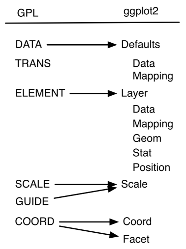
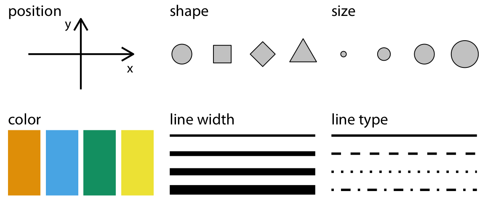
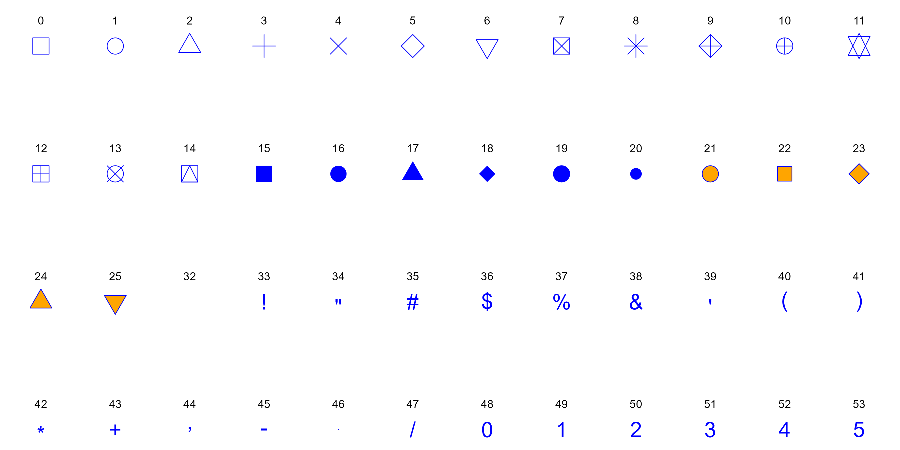

```{r}
#| include: false
source("_common.R")
```

# Charts with ggplot2 {#sec-ggplot2}

An auditor often receives data with thousands of rows. Think of the bill register of a State scheme run in twelve districts, for a whole financial year. Somewhere in it, a district may have rushed its spending into March to avoid a lapse of funds. Another may have split its purchases into bills just below the limit of its financial powers. A third may have spent more than its budget. Each of these is hard to see in a table. Each is plain to see in a good chart.

Charts help the auditor twice. First, while analysing, a chart shows patterns, outliers and gaps that a summary table hides. Second, while reporting, a clear chart tells the reader in a few seconds what a paragraph of numbers cannot.

In @sec-baseplot we drew charts with base R. In this chapter we learn **ggplot2**, the most widely used charting package in R. We will build every chart on a simulated bill register of a scheme, with a few irregularities planted in it. Step by step, we will learn

-   the idea of the *grammar of graphics*, on which ggplot2 is built;
-   how to map columns of the data to the look of a chart, through *aesthetics*;
-   the common chart types, called *geoms*, such as bars, histograms, lines and box plots.

On the way, the charts will point us to the planted cases. At the end, an audit use case puts a number on one of them. In @sec-ggplot2-polish we then learn to make these charts fit for an audit report, with scales, coordinate systems, facets, labels, themes and saving.

## Core concepts of **grammar of graphics**

**ggplot2**[^00-ggplot2-1] [@R-ggplot2] was developed by Hadley Wickham. It is based on the ideas of Leland Wilkinson in his book *The Grammar of Graphics* (2005).[^00-ggplot2-2] The **grammar of graphics** is a framework that describes a chart as a set of layers. Each layer does one job, and the layers together make the chart. Even the letters `gg` in ggplot2 stand for **g**rammar of **g**raphics.

[^00-ggplot2-1]: <https://ggplot2.tidyverse.org/>

[^00-ggplot2-2]: <https://link.springer.com/book/10.1007/0-387-28695-0>

Hadley Wickham explained his idea of a layered grammar in a paper titled **A Layered Grammar of Graphics**[^00-ggplot2-3] (2010) [@layered-grammar]. In the same paper, he put forward ggplot2 as an open source way of building such charts. Readers who want the theory in detail may read the paper. Over the next decade, the package grew[^00-ggplot2-4] into one of the most used packages in R.

[^00-ggplot2-3]: <http://vita.had.co.nz/papers/layered-grammar.pdf>

[^00-ggplot2-4]: Version 3.3.0 was released in March 2020, and version 4.0.0, with a rewritten internal structure and many new features, in September 2025. This book uses version 4.

@fig-rgg1[^00-ggplot2-5] shows how the parts of the two grammars relate. The parts on the left were put forward by Wilkinson. Those on the right were proposed by Wickham. `TRANS` has no match in ggplot2, because R itself does that job.

[^00-ggplot2-5]: Adapted from Hadley Wickham's paper on *the layered grammar of graphics*

```{r fig-rgg1, echo=FALSE, fig.cap="Layers in Grammar of Graphics mapped in GGPLOT2", fig.align='center', fig.show='hold', out.height="40%", out.width="50%"}

```

So, to build a chart from data, we use *seven* main components.

1.  **Data.** Every chart starts with data. It is also the first argument of the most important function in the package, `ggplot(data = )`.
2.  **Aesthetics.** The function `aes()` gives a **mapping** from the columns of the data to the parts of the chart. For example, one column may go on the `x` axis, another on the `y` axis, and a third may decide the colour.
3.  **Geometries.** The `geom_*()` functions, or *geoms*, decide the shape the data takes on the chart. They decide, for example, whether each row is drawn as a point, a bar or a line.
4.  **Statistics.** A *stat* computes something from the data before drawing it, such as a count, a mean or a trend line.
5.  **Scales.** A scale controls how values become positions, colours or sizes. For example, an axis may be shown on a logarithmic scale, or amounts may be shown in lakh.
6.  **Coordinate system.** Most charts use the usual *Cartesian* system of `x` and `y`. A pie chart uses a *polar* system, and a map uses a *map projection*.
7.  **Facets.** A facet splits one chart into small panels, one for each group in the data.

Of these, the first three (`data`, `aesthetics` and `geometries`) must be given by us. The others are not less important. It is just that they have sensible defaults. For example, the default coordinate system is Cartesian. Let us start with the three essential components and build a chart with them.

## Our data, a bill register of a scheme {#sec-ggplot2-data}

We need data first. Let us create the bill register of an imaginary State scheme for the financial year 2024-25. The scheme runs in 12 districts, grouped into four divisions. Each bill belongs to one of four categories, which are *Works*, *Supplies*, *Services* and *Vehicle hire*. The West division hires no vehicles, as it has its own.

The rules of our scheme are simple. A district officer may pass a bill of up to ₹2 lakh. A bill above ₹2 lakh needs the sanction of a higher authority. Bills are normally paid after a few days of checking.

We have planted four irregularities in the data. We will not list them here. The charts in this chapter and in @sec-ggplot2-polish will bring them out one by one. The code that creates the data is folded below. You may expand it once you are comfortable with `dplyr`.

```{r}
#| message: false
library(tidyverse)
```

```{r}
#| code-fold: true
#| code-summary: "Code to create the bill register, the monthly expenditure and the budget"
set.seed(2025)

district_list <- tibble(
  district = c("Amarpur", "Belapur", "Chandpur", "Devgarh", "Fatehpur", "Gopalganj",
               "Haripur", "Kishanpur", "Lalganj", "Madhopur", "Narsinghpur", "Rampur"),
  division = rep(c("North", "South", "East", "West"), each = 3),
  size     = round(runif(12, 0.6, 1.5), 2)   # bigger districts have more bills
)
fy_months <- seq(as.Date("2024-04-01"), by = "month", length.out = 12)
categories <- tibble(
  category = c("Works", "Supplies", "Services", "Vehicle hire"),
  lambda   = c(3, 4, 3, 2),                       # bills per month in a district
  median   = c(300000, 110000, 70000, 35000)      # typical bill amount
)
vendors <- list(
  "Works"        = c("Narmada Builders", "Shakti Constructions", "Jai Hind Infra",
                     "Pawan Contractors"),
  "Supplies"     = c("Bharat Stationers", "Kaveri Suppliers", "Om Sai Traders",
                     "Patel Hardware"),
  "Services"     = c("National Printers", "Rajdhani Computers", "Sagar Caterers"),
  "Vehicle hire" = c("Shree Ganesh Transport", "Annapurna Travels")
)

# Number of bills for each district, month and category
cells <- expand_grid(district_list, month_start = fy_months, categories) |>
  # Planted case 1. March rush in Fatehpur and Rampur
  mutate(rush   = district %in% c("Fatehpur", "Rampur") &
                  month_start == as.Date("2025-03-01"),
         lambda = if_else(division == "West" & category == "Vehicle hire", 0, lambda),
         n      = rpois(n(), lambda * size * if_else(rush, 2, 1)))

bills <- cells |>
  uncount(n) |>
  mutate(
    bill_date   = month_start + sample(0:27, n(), replace = TRUE),
    amount      = round(rlnorm(n(), log(median), 0.55) * if_else(rush, 2.5, 1), -1),
    vendor      = map_chr(category, \(k) sample(vendors[[k]], 1)),
    days_to_pay = 3 + rnbinom(n(), mu = 15, size = 3)
  )

# Planted case 2. Supplies split into bills just below Rs 2 lakh in Devgarh
split_bills <- tibble(
  district = "Devgarh", division = "South", category = "Supplies",
  vendor = "Shubham Enterprises",
  bill_date = as.Date("2024-06-03") + sort(sample(0:270, 28)),
  amount = round(runif(28, 190000, 199900), -1),
  days_to_pay = 3 + rnbinom(28, mu = 15, size = 3)
)

# Planted case 3. Large works bills paid within a day in Lalganj
fast_bills <- tibble(
  district = "Lalganj", division = "East", category = "Works",
  vendor = "Vikas Constructions",
  bill_date = as.Date("2024-08-05") + sort(sample(0:200, 6)),
  amount = round(runif(6, 650000, 900000), -1),
  days_to_pay = c(0, 1, 0, 1, 1, 0)
)

bills <- bind_rows(bills, split_bills, fast_bills) |>
  mutate(month_start = floor_date(bill_date, "month"),
         month   = factor(format(month_start, "%b"), levels = format(fy_months, "%b")),
         quarter = (as.integer(month) - 1) %/% 3 + 1) |>
  arrange(bill_date) |>
  mutate(bill_no = sprintf("B-%04d", row_number())) |>
  select(bill_no, district, division, category, vendor, bill_date, month_start,
         month, quarter, amount, days_to_pay)

# Monthly expenditure statement, built from the bills
spend <- bills |>
  summarise(vouchers = n(), exp = sum(amount),
            .by = c(district, division, month_start, month, category)) |>
  arrange(district, month, category)

# Budget estimate of each district for the year
budget <- spend |>
  summarise(amt_exp = sum(exp), .by = district) |>
  mutate(util = runif(12, 0.6, 0.98),
         # Planted case 4. Devgarh and Lalganj spent more than their budget
         util = replace(util, district %in% c("Devgarh", "Lalganj"), c(1.18, 1.27)),
         amt_be = round(amt_exp / util, -5)) |>
  select(district, amt_be)

# Small helpers for amounts in prose
lakh  <- function(x) round(x / 1e5, 1)
crore <- function(x) round(x / 1e7, 2)
```

We now have three tables. Let us look at each.

```{r}
glimpse(bills)
```

`bills` is the bill register. It has `r nrow(bills)` bills worth ₹`r crore(sum(bills$amount))` crore. The columns are these.

-   `bill_no` is the number given to the bill, and `bill_date` is its date.
-   `district` and `division` tell us where the money was spent.
-   `category` is the kind of expenditure, and `vendor` is the firm paid.
-   `month_start` is the first day of the month of the bill. `month` is the same month as a factor, in the order of the financial year, from April to March. `quarter` is the quarter of the financial year, from 1 to 4.
-   `amount` is the amount of the bill, in rupees.
-   `days_to_pay` is the number of days between the bill and its payment.

```{r}
spend
```

`spend` is the monthly expenditure statement. It has one row for each district, month and category, with the number of vouchers and the expenditure. It is built from the bills, as a district would report it to the head office.

```{r}
budget
```

`budget` gives the budget estimate (BE) of each district for the year, in rupees.

## Building a basic plot using key components

Let us see what happens when only the `data` is given to the `ggplot()` function. The package ggplot2 is loaded with `tidyverse`.

```{r fig-figblank, fig.height=2, fig.align='center', fig.show='hold', out.width="100%", fig.cap="Data provided to ggplot2"}
ggplot(data = bills)
```

In @fig-figblank we see only a blank grey space. The data is now attached to the chart, but ggplot2 does not yet know what to draw. Let us give it the aesthetic mappings, with the function `aes()`, through the argument `mapping` of `ggplot()`.

```{r fig-rgg2, fig.height=2, fig.align='center', fig.show='hold', out.width="100%", fig.cap="Data and mapping provided to ggplot2"}
ggplot(data = bills, mapping = aes(x = amount, y = days_to_pay))
```

In @fig-rgg2 the two columns `amount` and `days_to_pay` have been *mapped* to the `x` and `y` axes. Each axis now has a range and a title. But there is still no geometry, so the plot area is empty. Let us draw each bill as a point. To do this, we use the family of functions `geom_*()`, here `geom_point()`.

```{r fig-rgg3, fig.height=3, fig.align='center', fig.show='hold', out.width="100%",fig.cap="Bills plotted as points in a scatterplot"}
ggplot(data = bills, mapping = aes(x = amount, y = days_to_pay)) +
  geom_point()
```

In @fig-rgg3 each bill is now a point. The new layer, `geom_point()`, was added to the earlier code with a `+` sign. **This chart shows how long each bill took to be paid, against its amount.** Most bills, small or large, were paid within about five weeks. The axis of amounts shows full rupees. We will learn to show them in lakh in @sec-ggplot2-polish.

We could also show the amounts as a box plot, by using another geometry, `geom_boxplot()`. See @fig-rgg4.

```{r fig-rgg4, fig.height=3, fig.align='center', fig.show='hold', out.width="100%", fig.cap="Bill amounts plotted as a boxplot"}
ggplot(data = bills, mapping = aes(y = amount)) +
  geom_boxplot()
```

This is the basic way of building a chart in ggplot2. We give `data` and `aesthetics` to `ggplot()`. We then add a `geom_*()` function with a plus sign `+`.

Notice also that `data` and `mapping` are the first two arguments of `ggplot()`. Similarly, `x` and `y` are the first two arguments of `aes()`. So we may draw the chart in @fig-rgg3 without naming these arguments. We will follow this shorter style from now on.

```
ggplot(bills, aes(amount, days_to_pay)) +
  geom_point()
```

Let us now learn more about aesthetics and geometries, before moving to the other components.

## Other aesthetic attributes (colour, shape, size and others) {#sec-AESTH}

So far, we have mapped columns of the data to *positions*, that is, to `x` and `y`. We can also map columns to other aesthetic attributes, like `shape`, `size`, `colour` and `alpha` (transparency). @fig-rrgg5 shows some of them.

```{r fig-rrgg5, echo=FALSE, fig.cap="Some common aesthetic mappings, from Claus Wilke's book Fundamentals of Data Visualization", fig.align='center', fig.show='hold'}

```

These aesthetics fall into two broad groups.

-   Aesthetics that can show a `continuous` variable, like an amount.
-   Aesthetics that can show only a `discrete` (categorical) variable, like a district.

For example, `position`, `size`, `colour` and `linewidth` can show continuous data. But `shape` and `linetype` can show only discrete data. A numeric column is always treated as continuous by ggplot2. Some numeric columns are really codes, like a quarter number or a district code. Such a column must be converted to a discrete type, usually a factor, before mapping it to a discrete aesthetic. We will see an example shortly.

Some commonly used aesthetics are these.

-   `shape` is the symbol of a point drawn by `geom_point()`, such as a dot, a triangle or a square.
-   `fill` is the colour inside a shape, such as a bar or a box.
-   `colour` is the colour of the outline of a bar or a box, or the colour of a point drawn by `geom_point()`.
-   `size` is the size of points and text.
-   `linewidth` is the thickness of lines and borders. Before ggplot2 version 3.4, `size` was used for this too.
-   `alpha` is the transparency, from `1` (solid) to `0` (invisible).
-   `width` is the width of the bars in a bar chart.
-   `linetype` is the type of a line, such as solid, dashed or dotted.

Some settings, like `binwidth`, the width of the bins of a histogram, are not aesthetics. They are *arguments* of a particular geom. We will meet them with their geoms.

### Colour, the most important aesthetic

We may colour the elements of a chart with the aesthetic `colour`. The American spelling `color` works in exactly the same way. Colour is used in a chart mainly for three purposes.

-   To highlight some values, or all of them.
-   To group the data points, so that the groups can be told apart.
-   To show the value of a variable.

Let us first colour all the points of @fig-rgg3 red. To do this, we give a fixed value of `colour` directly inside the `geom_*()` function (@fig-rgg5).

```{r fig-rgg5, fig.height=3, fig.align='center', fig.cap="Highlighting all data points with a static colour", fig.show='hold'}
ggplot(bills, aes(amount, days_to_pay)) +
  geom_point(colour = "red")
```

The argument `colour = "red"` was given inside `geom_point()`, outside `aes()`. So every point turned red. But to colour the points *according to the data*, we must put `colour` inside `aes()`. In other words, we must use colour as an aesthetic mapping.

So let us colour the points by the column `quarter`, the quarter of the financial year in which the bill was raised.

```{r fig-rgg6, fig.height=3, fig.align='center', fig.show='hold', fig.cap="Mapping a numeric variable with colour aesthetic"}
ggplot(bills, aes(amount, days_to_pay)) +
  geom_point(aes(colour = quarter))
```

In @fig-rgg6 the points are coloured by quarter, and a colour bar appears as a legend. But the colour bar runs smoothly from 1 to 4, as if a quarter of 2.5 could exist. This happened because `quarter` is a numeric column, so ggplot2 treated it as continuous. The chart is more meaningful if we treat the quarter as a category. So let us convert it to a factor, on the fly.

```{r fig-rgg7, fig.height=3, fig.align='center', fig.show='hold', fig.cap="Mapping a discrete variable with colour aesthetic"}
ggplot(bills, aes(amount, days_to_pay)) +
  geom_point(aes(colour = as.factor(quarter)))
```

In @fig-rgg7 each quarter now has its own colour, and the legend shows four separate keys. Here, the `colour` aesthetic was given through `aes()` inside `geom_point()`. It could also have been given inside `ggplot()`. The following code produces exactly the same chart.

```
ggplot(bills, aes(amount, days_to_pay, colour = as.factor(quarter))) +
  geom_point()
```

Is there any difference between the two? Yes. A value given inside a geom overrides the one given in `ggplot()`. To see this, look at the result of the following code in @fig-rgg8. The mapping in `ggplot()` asked for colours by quarter. But the fixed colour in `geom_point()` won, and all the points are red.

```{r fig-rgg8, fig.height=3, fig.align='center', fig.show='hold', fig.cap="Over-riding aesthetics"}
ggplot(bills, aes(amount, days_to_pay, colour = as.factor(quarter))) +
  geom_point(colour = "red")
```

The third use of colour is to show the value of a variable directly. Let us see the expenditure of each district in each month. A good chart for this is a *heat-map*, sometimes called a *highlight table*. We first summarise the monthly statement by district and month. The functions `summarise()` and `.by` are explained in @sec-DPLYRR.

To draw the boxes of the heat-map we use another geometry, `geom_tile()`. We map the month to `x` and the district to `y`. To colour each box by the expenditure, we use the `fill` aesthetic instead of `colour`. We will see the difference between the two shortly. We divide the expenditure by `1e5` to show it in lakh.

```{r fig-rgg9, fig.align='center', fig.show='hold', fig.cap="Using colour to show monthly expenditure of each district"}
spend |>
  summarise(exp = sum(exp), .by = c(district, month)) |>
  ggplot() +
  geom_tile(aes(x = month, y = district, fill = exp / 1e5))
```

In @fig-rgg9 almost every box is a similar dark blue. Two boxes stand out in light blue. Both are in March, one for Fatehpur and one for Rampur. These two districts spent far more in March than in any other month. This is our first planted case, a **March rush**.

::: callout-tip
## Audit tip

Heavy spending in the last month of the financial year is a classic audit concern. Funds that would otherwise lapse may be spent in a hurry, sometimes on things not needed, or booked without the work being done. A heat-map of districts against months shows such a rush at a glance. For the districts that stand out, examine the March bills for the date of supply, the date of work and the stock entries.
:::

So far, we have seen that to map colour to a variable, we pass it inside `aes()`. To use a fixed colour, we pass it outside `aes()`, directly in the geom. ggplot2 knows most colour names, and @sec-COLORR discusses colours in detail. But what if we pass a fixed colour inside `aes()`? Let us check.

```{r fig-rgg10, fig.align='center', fig.show='hold', fig.cap="Mapping static colour inside aes"}
ggplot(bills, aes(amount, days_to_pay)) +
  geom_point(aes(colour = "blue"))
```

Interesting! The points are not blue, and a legend has appeared with the single key "blue". What happened is this. Inside `aes()`, ggplot2 treats `"blue"` as data, not as a colour. It creates a new column on the fly, with the value `"blue"` in every row. It then maps that column to colour with its default palette, and draws a legend for it. So a fixed colour must always be given outside `aes()`.

### Colour vs. fill

We used the `colour` aesthetic with points (@fig-rgg7) and the `fill` aesthetic with tiles (@fig-rgg9). Why two different aesthetics? Usually, `colour` changes the outline of a shape and `fill` changes the inside. Points seem to be an exception, as we used `colour` for them. In fact they are not. The default shape of `geom_point()` is `shape = 19`, a solid circle, which has no separate inside.

We can see the difference if we use `shape = 21` instead. This is a circle that takes both a `fill` for the inside and a `colour` for the outline (@fig-rgg11).

::: {#fig-rgg11}

```{r fig.align='center', fig.show='hold'}
# From here on, all plots in this chapter use theme_bw()
theme_set(theme_bw())

ggplot(bills, aes(amount, days_to_pay)) +
  geom_point(aes(colour = as.factor(quarter)), shape = 21, size = 4) +
  ggtitle("Using colour aesthetic")

ggplot(bills, aes(amount, days_to_pay)) +
  geom_point(aes(fill = as.factor(quarter)), shape = 21, size = 4) +
  ggtitle("Using fill aesthetic")
```

Colour vs. fill aesthetics
:::

Notice the first line of the code. `theme_set(theme_bw())` gives all later charts a white background. We will learn about themes in @sec-ggplot2-polish.

### Transparency through `alpha`

One more aesthetic changes how colours look. `alpha` controls transparency. Its value runs from 0 (completely transparent) to 1 (fully solid). It is very useful when many points overlap. Our register has `r nrow(bills)` bills, and in @fig-rgg3 the small bills form a solid black mass. With a low `alpha`, a single point looks faint, but places where many points overlap look dark. So we can see where the bills are crowded.

```{r fig-rgg12, fig.show='hold', fig.align='center', fig.cap="Setting transparency to see crowded areas"}
ggplot(bills, aes(x = amount, y = days_to_pay)) +
  geom_point(alpha = 0.2, size = 3)
```

In @fig-rgg12 the darkest area is in the lower left. Most bills are small, and were paid in one to five weeks. Here we gave `alpha` a fixed value. Like any other aesthetic, `alpha` can also be mapped to a continuous column inside `aes()`, for example `aes(alpha = days_to_pay)`.

### Shape aesthetic

In @fig-rgg11 we already changed the shape of the points, from a solid circle to a circle with an outline. The `shape` aesthetic gives different symbols to different groups of points. As discussed, it should be mapped to a discrete variable. ggplot2 offers many shapes, such as circles, triangles and squares, each known by a number (see `?points`).

Shapes work well for a few groups. With many groups, the shapes become hard to tell apart. Let us map the `category` of the bill to shape. It is already a character column, so no conversion is needed.

```{r fig-rgg13, fig.align='center', fig.show='hold', fig.cap="Mapping shape aesthetic"}
ggplot(bills, aes(amount, days_to_pay)) +
  geom_point(aes(shape = category), size = 2)
```

In @fig-rgg13 each of the four categories has its own symbol.

**A few shapes available in the `shape` aesthetic are given in @fig-shapes. The `fill` aesthetic is shown in orange and the `colour` aesthetic in blue.**

```{r echo=FALSE, fig.show='hide', message=FALSE, warning=FALSE}
library(tidyverse)

data.frame(
  x = 4:1
) %>%
  mutate(y = list(1:12)) %>%
  unnest_longer(y) %>%
  mutate(z = dplyr::setdiff(0:(nrow(.) + 5), 26:31)) %>%
  ggplot(aes(x=y, y=x, label=z)) +
  geom_point(aes(shape=z), size=7, fill = "orange", color = "blue") +
  scale_shape_identity() +
  labs(x="", y="") +
  geom_text(nudge_y = 0.2) +
  theme_void()

ggsave('shapes.png', width = 12, height = 6)
```

```{r fig-shapes, echo=FALSE, fig.cap="Some Shapes available in GGplot",fig.show='hold', out.width="99%", fig.align='center'}

```

### Size aesthetic

The `size` aesthetic controls the size of elements, such as points. By mapping a column to `size`, we can show one more dimension of the data.

Let us summarise the bills by district. For each district, we find the number of bills, the average days taken to pay, and the total amount. We then plot the number of bills against the average days, with the size of each point showing the total amount. Such a chart is often called a *bubble chart*.

```{r fig-rgg14, fig.align='center', fig.show='hold', fig.cap="Mapping size aesthetic"}
dist_summary <- bills |>
  summarise(n_bills  = n(),
            avg_days = mean(days_to_pay),
            total    = sum(amount),
            .by = c(district, division))

ggplot(dist_summary, aes(n_bills, avg_days)) +
  geom_point(aes(size = total))
```

In @fig-rgg14 the bigger bubbles are the districts that spent more. The size adds a third variable to a two-dimensional chart. But we should use `size` with care. People judge sizes poorly, and very large or very small points make a chart hard to read.

### Using multiple aesthetics simultaneously

Several aesthetics can be mapped at the same time. See this example.

```{r fig-rgg15, fig.align='center', fig.show='hold', fig.cap="Using multiple aesthetics"}
ggplot(bills,
       aes(
         x = amount,
         y = days_to_pay,
         shape = category,
         colour = as.factor(quarter),
         size = amount
       )) +
  geom_point(alpha = 0.5)
```

@fig-rgg15 shows five variables at once. But it is hard to read. Just because we *can* map many aesthetics does not mean we *should*. A chart for an audit report should usually make one point, with one or two aesthetics.

We will meet other aesthetics like `linetype` and `width` in @sec-geoms, along with the geoms that use them.

## More on geoms {#sec-geoms}

In the last section, we saw that the chart appeared as soon as we added a `geom_*()` layer. In the background, a `geom_*()` function is a shortcut. It adds one layer that has three parts, a `stat`, a `geom` and a `position`. So `ggplot(bills, aes(amount, days_to_pay)) + geom_point()` is the same as the following code.

```{r fig-rgg16, fig.show='hold', fig.align='center', fig.cap="Components of GGPLOT2"}
ggplot() +
  layer(
    data = bills,
    mapping = aes(amount, days_to_pay),
    geom = "point",
    stat = "identity",
    position = "identity"
  )
```

We will rarely write `layer()` ourselves. But knowing that each geom has a `stat` and a `position` explains much of what follows. Some common geoms are listed below.

-   Histograms, with `geom_histogram()`.
-   Bar charts, with `geom_bar()` or `geom_col()`.
-   Box plots, with `geom_boxplot()`.
-   Points, as in scatter plots, with `geom_point()`.
-   Line charts, with `geom_line()` or `geom_path()`.
-   Trend lines, with `geom_smooth()`.
-   Heat-maps, with `geom_tile()`.
-   Text labels, with `geom_text()` and `geom_label()`.

We have already used `geom_point()`, `geom_boxplot()` and `geom_tile()`. Let us look at the others in some detail.

### Univariate bar charts through `geom_bar()`

Bar charts are the simplest charts. But they can mislead us if we do not understand how the bars are built. Bar charts can show one variable (univariate) or two (bivariate). With colour, they can show even more.

The simplest bar chart shows how many rows fall in each category of a variable. For example, how many bills were raised in each quarter?

```{r fig-rgg17, fig.show='hold', fig.align='center', fig.cap="Univariate bar chart"}
ggplot(bills, aes(quarter)) +
  geom_bar()
```

@fig-rgg17 shows the number of bills in each quarter. As `quarter` is numeric, the `x` axis has a numeric scale. Notice also that our data was not summarised. ggplot2 counted the rows for each value of `quarter` by itself. The title of the `y` axis, `count`, confirms this.

Readers may run the following code to see the `x` axis change when the quarter is converted to a factor.

```
ggplot(bills, aes(as.factor(quarter))) +
  geom_bar()
```

Here, `geom_bar()` counted the rows. Sometimes we need another summary. To do that, we must understand what happens behind the code. In fact, `aes(quarter)` is a shortcut for `aes(x = quarter, y = after_stat(count))`. Here, `count` is a special variable, computed by the stat of the geom. It holds the number of rows in each category. The function `after_stat()` tells ggplot2 to use a value computed *after* the stat has done its work.

So let us show the *proportion* of bills in each `category`, instead of the count.

```{r fig-rgg18, fig.show='hold', fig.align='center', fig.cap="Univariate bar chart representing proportions"}
ggplot(bills, aes(category, y = after_stat(count / sum(count)))) +
  geom_bar()
```

In @fig-rgg18 the `y` axis now shows proportions. Supplies have the largest share of the bills.

### Bivariate bar charts through `geom_bar()`

`geom_bar()` summarises raw, row-level data and draws the bars. So far it has only counted rows. But often we need a summary of another column. For example, what is the average amount of a bill in each category?

To do this, we use the argument `stat` of `geom_bar()`, with the special value `"summary_bin"`. With it, we give the argument `fun`, the summary function, which is `mean` in our case. (`stat = "summary"` works the same way for a discrete `x`.)

```{r fig-rgg19, fig.show='hold', fig.align='center', fig.cap="Bivariate bar chart representing mean amount per category of bill"}
ggplot(bills, aes(x = category, y = amount)) +
  geom_bar(stat = "summary_bin", fun = mean)
```

In @fig-rgg19 we see that works bills have by far the highest average amount, as we would expect.

So far, we have drawn bars from raw data. We can also draw bars from data that we have already summarised. The trick is to use `stat = "identity"` in `geom_bar()`. Let us find the average bill amount of each district ourselves, and then plot it. For a change, let us put the districts on the `y` axis. Long names are easier to read this way.

```{r fig-rgg20, fig.show='hold', fig.align='center', fig.cap="Bivariate bar chart of mean bill amount per district, from summarised data"}
district_avg <- bills |>
  summarise(mean_amount = mean(amount),
            .by = district)

ggplot(district_avg, aes(x = mean_amount, y = district)) +
  geom_bar(stat = "identity")
```

@fig-rgg20 shows the chart we wanted. Readers may try the code without `stat = "identity"` to see what happens.

Now, as promised, let us see what the `stat` argument does. With `stat = "summary_bin"`, ggplot2 computed a summary of raw data, using `fun`. With `stat = "identity"`, ggplot2 draws the values as they are. It assumes the data is already summarised, with only one value of `y` for each `x`. There are other `stat` values too. But summaries inside ggplot2 soon become tricky. It is better to summarise the data ourselves and draw the bars with `geom_col()`, which we discuss shortly.

### Stacked bar charts through `geom_bar()`

In @sec-AESTH, we learnt to show more variables in a chart with aesthetics like colour and size. In a bar chart, the length of the bar already shows one variable. The best aesthetic for another variable is `fill` or `colour`.

Let us count the bills in each division again. But let us map `fill` to the `category` of the bill.

```{r fig-rgg24, fig.show='hold', fig.align='center', fig.cap="Colour stacked bar chart"}
ggplot(bills, aes(x = division, fill = category)) +
  geom_bar()
```

In @fig-rgg24 we got what we wanted, simply by mapping `fill`. This works because of the default value of the `position` argument of `geom_bar()`, which is `"stack"`. Bars at the same `x` position are stacked on top of one another by `position_stack()`.

`position_stack()` has a useful argument `reverse`, which reverses the order of the stacked pieces. This helps, for example, when the chart is drawn along the `y` axis. The order of the pieces then matches the order of the legend.

```{r fig-rgg25, fig.show='hold', fig.align='center', fig.cap="Colour stacked bar chart on y axis"}
ggplot(bills, aes(y = division, fill = category)) +
  geom_bar(position = position_stack(reverse = TRUE)) +
  theme(legend.position = "top")
```

In @fig-rgg25 the pieces of the bars now follow the order of the legend.

To place the bars side by side, we use another position function, `position_dodge()`. Let us redraw the same chart with the bars side by side.

```{r fig-rgg26, fig.show='hold', fig.align='center', fig.cap="Dodged bar chart"}
ggplot(bills, aes(x = division, fill = category)) +
  geom_bar(position = position_dodge()) +
  theme(legend.position = "top")
```

In @fig-rgg26 there is now a separate bar for each category. Look at the West division. It has no vehicle hire bills, so it has only three bars. These three bars are wider than the others, because by default they share the full width of the division. This is due to the argument `preserve` of `position_dodge()`, whose default is `"total"`. If we want all bars to have the same width, we set it to `"single"`. See @fig-rgg27.

```{r fig-rgg27, fig.show='hold', fig.align='center', fig.cap="Dodged bar chart with equal bar widths"}
ggplot(bills, aes(x = division, fill = category)) +
  geom_bar(position = position_dodge(preserve = "single")) +
  theme(legend.position = "top")
```

A related function, `position_dodge2()`, often works better for bar charts. It lets us set the `padding` between the bars. See @fig-rgg28.

```{r fig-rgg28, fig.show='hold', fig.align='center', fig.cap="Dodged bar chart with padding between bars"}
ggplot(bills, aes(x = division, fill = category)) +
  geom_bar(position = position_dodge2(preserve = "single", padding = 0.2)) +
  theme(legend.position = "top")
```

Finally, `position_fill()` stacks the bars and stretches every stack to the same height. Each bar then shows the *share* of each category, which is handy when the totals differ a lot. See @fig-rgg29.

```{r fig-rgg29, fig.show='hold', fig.align='center', fig.cap="100% stacked bar chart"}
ggplot(bills, aes(x = division, fill = category)) +
  geom_bar(position = position_fill()) +
  theme(legend.position = "top")
```

### Bar charts through `geom_col()`

As we saw, summaries inside ggplot2 soon become tricky. So it is better to summarise the data ourselves, and draw the bars with `geom_col()`. The difference between the two is this. `geom_bar()` uses `stat = "count"` by default, that is, it counts the rows at each `x` position. `geom_col()` uses `stat = "identity"` by default, that is, it draws the values as they are. So to draw @fig-rgg20 with `geom_col()`, we do not need the `stat` argument at all (@fig-rgg30).

```{r fig-rgg30, fig.show='hold', fig.align='center', fig.cap="Plotting through geom col"}
ggplot(district_avg, aes(x = mean_amount, y = district)) +
  geom_col()
```

Once we understand the `position` and `stat` arguments of `geom_bar()`, it is easy to draw stacked, dodged and 100 percent stacked bars with `geom_col()`. Readers may try these on summarised data. Remember that `geom_col()` uses `stat = "identity"`, so it does not summarise anything itself.

### Adding labels to charts using `geom_text()` or `geom_label()`

Before we learn other geoms, it is a good time to learn how to label a chart.

We may label the elements of a chart with either of two functions. `geom_text()` adds only the text. `geom_label()` also draws a box behind the text, which makes it easier to read.

Both functions place the text given by the `label` aesthetic at the given `x` and `y` positions. We can change the look of the labels with these arguments.

-   `size` sets the size of the font.
-   `colour` sets the colour of the font.
-   `hjust` and `vjust` move the labels horizontally and vertically. They take a number between `0` (left or bottom) and `1` (right or top), or a word (`"left"`, `"middle"`, `"right"`, `"bottom"`, `"center"`, `"top"`). There are two special values. `"inward"` aligns the text towards the centre, and `"outward"` aligns it away from the centre.
-   `family` sets the font family. The options are `"sans"` (the default), `"serif"` and `"mono"`.
-   `fontface` sets the face of the font. The options are `"plain"` (the default), `"bold"`, `"italic"` and `"bold.italic"`.

Let us label the bubble chart of districts (@fig-rgg14) with the names of the districts.

```{r fig-rgg31, fig.show='hold', fig.align='center', fig.cap="Adding labels to geoms"}
ggplot(dist_summary, aes(x = n_bills, y = avg_days)) +
  geom_point() +
  geom_text(aes(label = district),
            size = 3,
            colour = "dodgerblue",
            vjust = -1) # -1 pushes the label upwards
```

In @fig-rgg31 each point has its label just above it, because of `vjust = -1`. But some labels overlap. A very useful package, `ggrepel`, places such labels so that they do not overlap. See @fig-rgg32.

```{r fig-rgg32, fig.show='hold', fig.align='center', fig.cap="Adding labels to geoms through external ggrepel package"}
# Load package
library(ggrepel)
# Allow any number of overlaps to be resolved
options(ggrepel.max.overlaps = Inf)

ggplot(dist_summary, aes(x = n_bills, y = avg_days)) +
  geom_point() +
  geom_text_repel(aes(label = district),
            size = 3,
            colour = "seagreen",
            fontface = "bold.italic")
```

Labelling bars drawn by `geom_bar()` from raw data is a little tricky. The label must use the same stat as the bar, and the value it computed. See the example in @fig-rgg35, which labels the number of bills in each category.

```{r fig-rgg35, fig.show='hold', fig.align='center', fig.cap="Labelled bar chart"}
# Labelling a bar plot
ggplot(bills, aes(category)) +
  geom_bar() +
  geom_text(
    aes(
      y = after_stat(count + 20), # shift the label slightly above the bar
      label = after_stat(count)
    ),
    stat = "count"
  )
```

To label the chart in @fig-rgg19, we must give `geom_text()` the same stat and summary function as the bar. Here we show the average amount in lakh, so we divide the computed `y` by `1e5`. See @fig-rgg33.

```{r fig-rgg33, fig.show='hold', fig.align='center', fig.cap="Bivariate bar chart labelled with mean amount in lakh"}
ggplot(bills, aes(category, amount)) +
  geom_bar(stat = "summary_bin", fun = mean) +
  geom_text(
    aes(label = after_stat(round(y / 1e5, 2))),
    stat = "summary_bin",
    fun = mean,
    vjust = -0.5
  )
```

One more example labels each box of a box plot with its upper whisker, that is, the largest amount that is not treated as an outlier. Here `stage()` tells ggplot2 to use `amount` for the box, and the computed `xmax` for the position of the label.

```{r fig-rgg34, fig.show='hold', fig.align='center', fig.cap="Upper whisker labelled in boxplot, in lakh"}
# Labelling the upper whisker of a boxplot,
# inspired by June Choe
ggplot(bills, aes(amount, category)) +
  geom_boxplot(outlier.shape = NA) +
  geom_label(
    aes(
      label = after_stat(round(xmax / 1e5, 1)),
      x = stage(amount, after_stat = xmax)
    ),
    stat = "boxplot", hjust = -0.2
  )
```

Labelling stacked bars needs one more step. The labels too must be stacked, with the same `position` as the bars. See the example in @fig-rgg36.

```{r fig-rgg36, fig.show='hold', fig.align='center', fig.cap="Coloured bar chart labelled"}
ggplot(bills, aes(division, fill = category)) +
  geom_bar() +
  geom_text(
    aes(label = after_stat(count)),
    stat = "count",
    position = position_stack(vjust = 0.5)
  )
```

It is easier to draw the same chart (@fig-rgg36) with `geom_col()` on summarised data. In @fig-rgg37 we count the bills ourselves with `count()`. We then only have to place the labels, with `position_stack()`.

```{r fig-rgg37, fig.show='hold', fig.align='center', fig.cap="Coloured bar chart labelled, from summarised data"}
bills_count <- bills |>
  count(division, category)

ggplot(bills_count, aes(
  x = division,
  y = n,
  fill = category,
  label = n # given once, for all layers
)) +
  geom_col() +
  geom_text(
    position = position_stack(vjust = 0.5) # labels centred vertically
    )
```

### Histograms and related plots

ggplot2 is a vast subject, and whole books are written on it. One chapter cannot cover it all. But several other geoms are simpler than `geom_bar()`, and very useful in analysis. One of these is `geom_histogram()`, which draws the distribution of a single numeric variable.

Like `geom_bar()`, it summarises the data itself, using its default stat, `stat = "bin"`. It divides the range of the variable into *bins* and counts the rows in each. Let us see the distribution of the bill amounts.

```{r fig-rgg38, fig.show='hold', fig.align='center', fig.cap="A simple histogram"}
ggplot(bills, aes(amount)) +
  geom_histogram()
```

@fig-rgg38 shows that most bills are small, with a long tail of large bills. ggplot2 also printed a message, asking us to choose a better bin width. By default it uses 30 bins, which rarely suits the data. So let us set the width of each bin to ₹10,000.

```{r fig-rgg21, fig.show='hold', fig.align='center', fig.cap="Histogram with custom binwidth"}
ggplot(bills, aes(amount)) +
  geom_histogram(binwidth = 10000)
```

@fig-rgg21 shows the shape in more detail. Remember that ₹2 lakh (200000 on the axis) is the limit of the district officer's powers. An auditor would want to know whether bills pile up just below it. At this scale, nothing unusual is easy to see near 200000. But that does not prove there is nothing. By default, the bin around 200000 runs from ₹1.95 lakh to ₹2.05 lakh. It mixes the bills just below the limit with those just above it, and so it can hide a pile. The Audit tip below shows how to set the bins properly. We look at the bills near the limit closely in @sec-ggplot2-split.

::: callout-tip
## Audit tip

When you look for bills just below a limit, make a bin end exactly at the limit. The argument `boundary` of `geom_histogram()` does this. For example, `geom_histogram(binwidth = 10000, boundary = 200000)` makes the bins run from ₹1.9 lakh to ₹2 lakh, ₹2 lakh to ₹2.1 lakh, and so on. A bin that straddles the limit would mix the bills below the limit with those above it, and blur the spike.
:::

Instead of `binwidth`, we may give the argument `bins`, the number of bins. Aesthetics like `fill` or `colour` may also be used. Let us colour the bars by category, for bills of up to ₹10 lakh.

```{r fig-rgg39, fig.show='hold', fig.align='center', fig.cap="Filled histogram"}
bills |>
  filter(amount <= 1e6) |>
  ggplot(aes(amount, fill = category)) +
  geom_histogram(binwidth = 25000)
```

In @fig-rgg39 we see that supplies, services and vehicle hire make up the small bills. Works bills spread over a much wider range.

A related geom is `geom_freqpoly()`, short for *frequency polygon*. It shows the same counts as lines instead of bars. So the histogram in @fig-rgg39 may be drawn as a frequency polygon (@fig-rgg40). Overlapping lines are easier to compare than stacked bars.

```{r fig-rgg40, fig.show='hold', fig.align='center', fig.cap="Frequency polygon by category"}
bills |>
  filter(amount <= 1e6) |>
  ggplot(aes(amount, colour = category)) +
  geom_freqpoly(binwidth = 25000)
```

The categories have very different numbers of bills. To compare their *shapes* rather than their counts, we may put `density` on the `y` axis instead of the default count. The area under each line then adds up to one. See @fig-rgg41.

```{r fig-rgg41, fig.show='hold', fig.align='center', fig.cap="Frequency polygon with density"}
bills |>
  filter(amount <= 1e6) |>
  ggplot(aes(amount, after_stat(density), colour = category)) +
  geom_freqpoly(binwidth = 25000)
```

### Line charts

Most geoms in ggplot2 have intuitive names. So we may correctly guess that line charts are drawn with `geom_line()`. But `geom_line()` is different from the geoms we have seen so far. It draws one line through *many* rows of data, so it must know which rows belong to the same line. It is therefore called a *collective* geom.

To understand this, let us take the monthly expenditure of two districts, Amarpur and Fatehpur, in lakh. `month_no` numbers the months of the financial year, from 1 for April to 12 for March. Let us plot the expenditure against the month.

```{r fig-rgg42, fig.show='hold', fig.align='center', fig.cap="A simple line chart, without groups"}
two_dist <- spend |>
  filter(district %in% c("Amarpur", "Fatehpur")) |>
  summarise(exp_lakh = sum(exp) / 1e5, .by = c(district, month)) |>
  mutate(month_no = as.integer(month)) |>
  arrange(month_no)

# print the data
two_dist

# Line chart
ggplot(two_dist, aes(month_no, exp_lakh)) +
  geom_line()
```

@fig-rgg42 is not what we wanted. For each month, the line first joins the two districts, and then moves to the next month. We get a zigzag. This is fixed with the aesthetic `group`. The `group` aesthetic tells ggplot2 which rows are to be joined into one line. See @fig-rgg43.

```{r fig-rgg43, fig.show='hold', fig.align='center', fig.cap="A line chart without legend"}
ggplot(two_dist, aes(month_no, exp_lakh, group = district)) +
  geom_line()
```

In @fig-rgg43 we now have one line for each district. But we cannot tell which line is which, as there is no legend. If we map `colour` to the district instead, we get both separate lines and a legend. Mapping `colour` also forms the groups, so `group` is then not needed. See @fig-rgg44.

```{r fig-rgg44, fig.show='hold', fig.align='center', fig.cap="A line chart with legend"}
ggplot(two_dist, aes(month_no, exp_lakh, colour = district)) +
  geom_line()
```

@fig-rgg44 shows the March rush in Fatehpur clearly. Its line runs close to Amarpur's for eleven months, and then shoots up in March.

Sometimes a line is defined not by one variable, but by a combination of several. Then we may use `interaction()` to combine them. Let us draw one line for each district and category in the monthly statement. That is `r n_distinct(spend$district)` districts times `r n_distinct(spend$category)` categories, less the categories some districts do not have. In @fig-rgg45 each combination gets its own line.

```{r fig-rgg45, fig.show='hold', fig.align='center', fig.cap="Groups in multiple variables"}
ggplot(spend, aes(month, exp / 1e5, group = interaction(district, category))) +
  geom_line()
```

Most lines in @fig-rgg45 stay low and flat. A few shoot up in March. These again belong to Fatehpur and Rampur.

A related geom, `geom_path()`, also draws lines. `geom_line()` joins the points from left to right, in the order of `x`. `geom_path()` joins them in the order in which they appear in the data. In @fig-rgg46 we sort the months of Amarpur by the expenditure, to show the difference. `geom_line()` ignores the sorting, but `geom_path()` follows it, and jumps back and forth.

Both geoms also understand the aesthetic `linetype`. It can be mapped to a categorical variable, or given a fixed value such as `"solid"` (the default), `"dotted"`, `"dashed"` or `"dotdash"`.

::: {#fig-rgg46}

```{r fig.show='hold', fig.align='center', out.width="49%"}
amarpur <- two_dist |>
  filter(district == "Amarpur")

amarpur |>
  # Rearranging the data points
  arrange(exp_lakh) |>
  ggplot(aes(month_no, exp_lakh)) +
  geom_line(linetype = "dotdash", linewidth = 2) +
  ggtitle("Using line geom")

amarpur |>
  # Rearranging the data points
  arrange(exp_lakh) |>
  ggplot(aes(month_no, exp_lakh)) +
  geom_path(linetype = "dotted", linewidth = 2) +
  ggtitle("Using path geom")
```

Path vs line geoms
:::

### Smoothing through `geom_smooth()`

`geom_smooth()` adds a trend line over a scatter plot or a line chart. For example, let us draw the total monthly expenditure of the whole scheme, in crore. We add `geom_smooth()` to see the smoothed trend over the year. See @fig-rgg48.

```{r fig-rgg48, fig.show='hold', fig.align='center', fig.cap="Line chart with smoothed trend"}
monthly_total <- spend |>
  summarise(exp_crore = sum(exp) / 1e7, .by = month_start)

ggplot(monthly_total, aes(month_start, exp_crore)) +
  geom_line(colour = "indianred4", linewidth = 1) +
  geom_smooth()
```

A message tells us that the method used to smooth the curve is `loess`, the default for small data. The other methods are `lm`, `glm` and `gam`. Giving the `method` and the `formula` ourselves avoids the message. The grey band around the trend shows its uncertainty. Notice how the trend line bends upwards at the end, pulled by the March rush.

We may also smooth a scatter plot, to see a straight (linear) regression line. In the monthly statement, more vouchers should mean more expenditure. Let us plot the expenditure against the number of vouchers, for every district, month and category. See @fig-rgg49.

```{r fig-rgg49, fig.show='hold', fig.align='center', fig.cap="Scatter plot with regression line"}
ggplot(spend, aes(vouchers, exp / 1e5)) +
  geom_point() +
  geom_smooth(method = "lm", formula = y ~ x)
```

Readers may note that in @fig-rgg49 we see far fewer points than the `r nrow(spend)` rows of `spend`. The number of vouchers is a whole number, so many points sit exactly on the same vertical lines and hide one another. This overlap can be reduced with `alpha`, or by *jittering*. `geom_jitter()` moves each point by a small random amount, so that overlapping points come apart. Here we jitter only sideways, with `width = 0.3` and `height = 0`, so that the amounts stay exact. See @fig-rgg47.

```{r fig-rgg47, fig.show='hold', fig.align='center', fig.cap="Jittered scatter plot with regression line"}
ggplot(spend, aes(vouchers, exp / 1e5)) +
  geom_jitter(width = 0.3, height = 0) +
  geom_smooth(method = "lm", formula = y ~ x)
```

In @fig-rgg47 a few points sit far above the line. They spent much more than their number of vouchers would suggest. These are again the March bills of Fatehpur and Rampur, which were both more and bigger.

::: callout-warning
## Caution

`geom_jitter()` moves the points by a random amount. That is fine for seeing where points are crowded. But never read exact values from a jittered axis, and never jitter an axis whose exact value matters to the finding. Above, we jittered only the number of vouchers, and kept the amounts exact.
:::

### Combining multiple geoms

We have already used more than one geom in a chart, while labelling and while smoothing. Each geom adds a new layer over the layers before it. As an example, let us add points to the line of Amarpur.

```{r fig-rgg50, fig.show='hold', fig.align='center', fig.cap="Combining geoms"}
ggplot(amarpur, aes(month_no, exp_lakh)) +
  # layer with line
  geom_line(linewidth = 1, colour = "dodgerblue") +
  # layer with points
  geom_point(shape = 21, size = 7, fill = "orange", stroke = 2)
```

In @fig-rgg50 the points are drawn over the line. If we reverse the order, the line, now the later layer, is drawn over the points. See @fig-rgg51.

```{r fig-rgg51, fig.show='hold', fig.align='center', fig.cap="Understanding overlapping in geoms"}
ggplot(amarpur, aes(month_no, exp_lakh))  +
  # layer with points
  geom_point(shape = 21, size = 7, fill = "orange", stroke = 2) +
  # layer with line
  geom_line(linewidth = 1, colour = "dodgerblue")
```

### Other geoms

Several other geoms add useful information to the charts above.

-   `geom_vline()`, `geom_hline()` and `geom_abline()` add vertical, horizontal and sloping reference lines.
-   `geom_rect()` draws a fixed rectangle, given its four corners `xmin`, `ymin`, `xmax` and `ymax`.
-   `geom_area()` draws an area chart, which is a line chart filled down to the `x` axis. Several groups are stacked on top of each other.

Reference lines are very useful in audit. They show the limit, the norm or the budget against which the data should be judged. In the first chart of @fig-rgg52, a vertical line marks the ₹2 lakh limit, and a horizontal line marks three days. In the second chart, each point is a district, with its budget on the `x` axis and its expenditure on the `y` axis. The line drawn by `geom_abline()` has an intercept of 0 and a slope of 1. On this line, expenditure equals budget.

::: {#fig-rgg52}

```{r fig.show='hold', fig.align='center', out.width="49%"}
ggplot(bills, aes(amount, days_to_pay)) +
  geom_point(alpha = 0.3) +
  geom_vline(xintercept = 2e5, colour = "orange") +
  geom_hline(yintercept = 3, colour = "dodgerblue", linetype = "dashed")

budget_vs_exp <- spend |>
  summarise(amt_exp = sum(exp), .by = district) |>
  left_join(budget, by = "district")

ggplot(budget_vs_exp, aes(amt_be, amt_exp)) +
  geom_point(size = 3) +
  geom_abline(intercept = 0, slope = 1, colour = "dodgerblue")
```

Adding reference lines
:::

```{r}
#| include: false
fast <- bills |> filter(days_to_pay < 3)
over <- budget_vs_exp |> filter(amt_exp > amt_be)
```

The first chart shows our third planted case. Normally, no bill is paid within three days. Yet `r nrow(fast)` points lie below the dashed line, in the lower right corner. They are large bills, between ₹`r lakh(min(fast$amount))` lakh and ₹`r lakh(max(fast$amount))` lakh, paid within a day. A simple filter lists them.

```{r}
bills |>
  filter(days_to_pay < 3) |>
  select(bill_no, district, vendor, bill_date, amount, days_to_pay)
```

All `r nrow(fast)` are works bills of `r unique(fast$district)`, paid to `r unique(fast$vendor)`. In the second chart, `r nrow(over)` points lie above the line. These districts spent more than their budget, our fourth planted case. We return to them in @sec-ggplot2-audit.

::: callout-tip
## Audit tip

Very fast payment of large bills is a red flag. Proper checks of measurement, quality and sanction take time. Ask the district why these bills were paid within a day, and check whether the work was measured and certified before payment.
:::

### List of geoms available in `ggplot2`

There are many more geoms in ggplot2 than we have discussed. Some of them appear in later chapters, where they are needed. Readers may explore the others to chart new territory.

The geoms available in the version of ggplot2 used to build this book are listed in @tbl-geoms.

```{r tbl-geoms, echo=FALSE}
geoms <- help.search("geom_", package = 'ggplot2')
knitr::kable(geoms$matches[, c("Entry", "Title")], caption = "List of Geoms available in ggplot2")
```

## Audit use case, the March rush

The heat-map in @fig-rgg9 first showed us a March rush in Fatehpur and Rampur. The line charts in @fig-rgg44 and @fig-rgg45 showed it again. Let us now put a number on it. For each district, we find the share of March in the expenditure of the year, and draw it as a bar.

```{r fig-marchrush, fig.align='center', fig.show='hold', fig.cap="Share of March in the expenditure of each district, with the even share of one-twelfth"}
march_rush <- spend |>
  summarise(share = sum(exp[month == "Mar"]) / sum(exp), .by = district) |>
  arrange(desc(share))

ggplot(march_rush, aes(share, district)) +
  geom_col() +
  geom_vline(xintercept = 1 / 12, linetype = "dashed", colour = "firebrick")
```

In an even year, each month would carry one-twelfth of the expenditure, about 8%. The dashed line in @fig-marchrush marks that share. Most bars end near it. `r march_rush$district[1]` spent `r round(march_rush$share[1] * 100)`% of its expenditure of the year in March, and `r march_rush$district[2]` spent `r round(march_rush$share[2] * 100)`%.

What should the auditor do next?

-   List the March bills of these two districts, and compare them with their bills of other months.
-   Check the date of supply, the date of work and the stock entries for each March bill.
-   Check whether the money was spent only to avoid a lapse of funds at the end of the year.
-   Record the charts, the list of bills and the replies of the districts in the working papers.

## A suggested workflow

1.  **Decide the one point first.** Before writing any code, decide what the chart should tell the reader, such as which districts spent more than their budget. Then choose the geom that suits it. Use bars to compare amounts, lines for trends over months, a heat-map for districts against months, and a histogram or box plot for the spread of bills.
2.  **Summarise the data yourself.** Aggregate the bill register by district, month or category first, and draw the bars with `geom_col()`. This is easier to check than a summary done inside `geom_bar()`.
3.  **Map variables with care.** Put a variable inside `aes()` only when it should change the look of the chart. Give fixed colours outside `aes()`. Convert numeric codes, like district codes or quarter numbers, with `as.factor()` before mapping them to colour or shape.
4.  **Look for the unusual.** Use a histogram with a bin ending at the limit to find bills just below it. Use a heat-map to find a month or a district that stands apart. Use reference lines to find points beyond the norm.
5.  **Add the reference.** Draw the budget, the limit, the norm or the average as a line with `geom_vline()`, `geom_hline()` or `geom_abline()`. The reader can then judge each bar or point against it.
6.  **Then polish the chart.** Format the numbers, add labels and a theme, and save the chart, as shown in @sec-ggplot2-polish.

::: callout-important
## Remember

A chart should make one point clearly. Map a variable inside `aes()` only when it should change the look of the chart, and give fixed colours outside it. Always show the reference, such as the limit or the budget, against which the reader should judge. A pattern in a chart is a lead, not a finding. Confirm it from the records before reporting it.
:::

## Where next

Our charts so far find the patterns, but they are not yet ready for a report. In @sec-ggplot2-polish we learn to control the axes and colours, split a chart into facets, add titles and notes, set a theme and save the chart. We also examine the bills split just below the limit, and draw a chart for the audit report.

## Summary of functions used

| Function | Package | What it does |
|-----------------------|----------------|--------------------------------|
| `ggplot()`, `aes()` | ggplot2 | Start a plot with data, and map variables to aesthetics |
| `layer()` | ggplot2 | Add a layer with its geom, stat and position spelt out |
| `geom_point()`, `geom_jitter()` | ggplot2 | Scatter plots, with or without random jitter |
| `geom_line()`, `geom_path()`, `geom_smooth()` | ggplot2 | Lines, paths in data order, and trend lines |
| `geom_bar()`, `geom_col()` | ggplot2 | Bars from counts or summaries, or from values as they are |
| `geom_histogram()`, `geom_freqpoly()` | ggplot2 | Distributions, as bars or lines (`binwidth`, `bins`, `boundary`) |
| `geom_boxplot()`, `geom_tile()` | ggplot2 | Box plots and heat-maps |
| `geom_text()`, `geom_label()`, `geom_text_repel()` | ggplot2, ggrepel | Labels on a plot |
| `geom_vline()`, `geom_hline()`, `geom_abline()` | ggplot2 | Reference lines |
| `geom_rect()`, `geom_area()` | ggplot2 | Rectangles and area charts |
| `after_stat()`, `stage()` | ggplot2 | Use values computed by a stat, such as `count` |
| `interaction()` | base R | Combine two variables into one group |
| `position_stack()`, `position_dodge()`, `position_dodge2()`, `position_fill()` | ggplot2 | Stacked, side by side, and 100% stacked bars |
| `ggtitle()` | ggplot2 | A title for a chart |
| `theme_set()`, `theme_bw()` | ggplot2 | Set a default look for all later charts |

: Functions used in this chapter {#tbl-ggplotfunctions}
