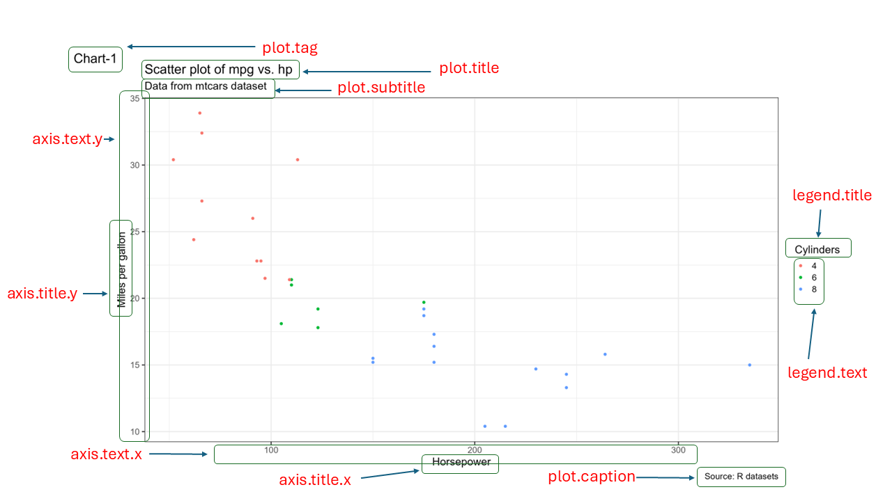

```{r}
#| include: false
source("_common.R")
```

# Charts with ggplot2 {#sec-ggplot2}

An auditor often receives data with thousands of rows. Think of the bill register of a State scheme run in twelve districts, for a whole financial year. Somewhere in it, a district may have rushed its spending into March to avoid a lapse of funds. Another may have split its purchases into bills just below the limit of its financial powers. A third may have spent more than its budget. Each of these is hard to see in a table. Each is plain to see in a good chart.

Charts help the auditor twice. First, while analysing, a chart shows patterns, outliers and gaps that a summary table hides. Second, while reporting, a clear chart tells the reader in a few seconds what a paragraph of numbers cannot.

In @sec-baseplot we drew charts with base R. In this chapter we learn **ggplot2**, the most widely used charting package in R. We will build every chart on a simulated bill register of a scheme, with a few irregularities planted in it. Step by step, we will learn

-   the idea of the *grammar of graphics*, on which ggplot2 is built;
-   how to map columns of the data to the look of a chart, through *aesthetics*;
-   the common chart types, called *geoms*, such as bars, histograms, lines and box plots;
-   how to control axes, colours and coordinate systems, through *scales* and *coords*;
-   how to split a chart into small panels, called *facets*;
-   how to add titles, labels and notes, and how to change the overall look with *themes*;
-   how to save charts for the audit report.

On the way, the charts will point us to the planted cases. At the end, two audit use cases put it all together.

## Core concepts of **grammar of graphics**

**ggplot2**[^00-ggplot2-1] [@R-ggplot2] was developed by Hadley Wickham. It is based on the ideas of Leland Wilkinson in his book *The Grammar of Graphics* (2005).[^00-ggplot2-2] The **grammar of graphics** is a framework that describes a chart as a set of layers. Each layer does one job, and the layers together make the chart. Even the letters `gg` in ggplot2 stand for **g**rammar of **g**raphics.

[^00-ggplot2-1]: <https://ggplot2.tidyverse.org/>

[^00-ggplot2-2]: <https://link.springer.com/book/10.1007/0-387-28695-0>

Hadley Wickham explained his idea of a layered grammar in a paper titled **A Layered Grammar of Graphics**[^00-ggplot2-3] (2010) [@layered-grammar]. In the same paper, he put forward ggplot2 as an open source way of building such charts. Readers who want the theory in detail may read the paper. Over the next decade, the package grew[^00-ggplot2-4] into one of the most used packages in R.

[^00-ggplot2-3]: <http://vita.had.co.nz/papers/layered-grammar.pdf>

[^00-ggplot2-4]: Version 3.3.0 was released in March 2020, and version 4.0.0, with a rewritten internal structure and many new features, in September 2025. This book uses version 4.

@fig-rgg1[^00-ggplot2-5] shows how the parts of the two grammars relate. The parts on the left were put forward by Wilkinson. Those on the right were proposed by Wickham. `TRANS` has no match in ggplot2, because R itself does that job.

[^00-ggplot2-5]: Adapted from Hadley Wickham's paper on *the layered grammar of graphics*

```{r fig-rgg1, echo=FALSE, fig.cap="Layers in Grammar of Graphics mapped in GGPLOT2", fig.align='center', fig.show='hold', out.height="40%", out.width="50%"}
knitr::include_graphics("images/layers_gg.png")
```

So, to build a chart from data, we use *seven* main components.

1.  **Data.** Every chart starts with data. It is also the first argument of the most important function in the package, `ggplot(data = )`.
2.  **Aesthetics.** The function `aes()` gives a **mapping** from the columns of the data to the parts of the chart. For example, one column may go on the `x` axis, another on the `y` axis, and a third may decide the colour.
3.  **Geometries.** The `geom_*()` functions, or *geoms*, decide the shape the data takes on the chart. They decide, for example, whether each row is drawn as a point, a bar or a line.
4.  **Statistics.** A *stat* computes something from the data before drawing it, such as a count, a mean or a trend line.
5.  **Scales.** A scale controls how values become positions, colours or sizes. For example, an axis may be shown on a logarithmic scale, or amounts may be shown in lakh.
6.  **Coordinate system.** Most charts use the usual *Cartesian* system of `x` and `y`. A pie chart uses a *polar* system, and a map uses a *map projection*.
7.  **Facets.** A facet splits one chart into small panels, one for each group in the data.

Of these, the first three (`data`, `aesthetics` and `geometries`) must be given by us. The others are not less important. It is just that they have sensible defaults. For example, the default coordinate system is Cartesian. Let us start with the three essential components and build a chart with them.

## Our data, a bill register of a scheme {#sec-ggplot2-data}

We need data first. Let us create the bill register of an imaginary State scheme for the financial year 2024-25. The scheme runs in 12 districts, grouped into four divisions. Each bill belongs to one of four categories, which are *Works*, *Supplies*, *Services* and *Vehicle hire*. The West division hires no vehicles, as it has its own.

The rules of our scheme are simple. A district officer may pass a bill of up to ₹2 lakh. A bill above ₹2 lakh needs the sanction of a higher authority. Bills are normally paid after a few days of checking.

We have planted four irregularities in the data. We will not list them here. The charts in this chapter will bring them out one by one. The code that creates the data is folded below. You may expand it once you are comfortable with `dplyr`.

```{r}
#| message: false
library(tidyverse)
```

```{r}
#| code-fold: true
#| code-summary: "Code to create the bill register, the monthly expenditure and the budget"
set.seed(2025)

district_list <- tibble(
  district = c("Amarpur", "Belapur", "Chandpur", "Devgarh", "Fatehpur", "Gopalganj",
               "Haripur", "Kishanpur", "Lalganj", "Madhopur", "Narsinghpur", "Rampur"),
  division = rep(c("North", "South", "East", "West"), each = 3),
  size     = round(runif(12, 0.6, 1.5), 2)   # bigger districts have more bills
)
fy_months <- seq(as.Date("2024-04-01"), by = "month", length.out = 12)
categories <- tibble(
  category = c("Works", "Supplies", "Services", "Vehicle hire"),
  lambda   = c(3, 4, 3, 2),                       # bills per month in a district
  median   = c(300000, 110000, 70000, 35000)      # typical bill amount
)
vendors <- list(
  "Works"        = c("Narmada Builders", "Shakti Constructions", "Jai Hind Infra",
                     "Pawan Contractors"),
  "Supplies"     = c("Bharat Stationers", "Kaveri Suppliers", "Om Sai Traders",
                     "Patel Hardware"),
  "Services"     = c("National Printers", "Rajdhani Computers", "Sagar Caterers"),
  "Vehicle hire" = c("Shree Ganesh Transport", "Annapurna Travels")
)

# Number of bills for each district, month and category
cells <- expand_grid(district_list, month_start = fy_months, categories) |>
  # Planted case 1. March rush in Fatehpur and Rampur
  mutate(rush   = district %in% c("Fatehpur", "Rampur") &
                  month_start == as.Date("2025-03-01"),
         lambda = if_else(division == "West" & category == "Vehicle hire", 0, lambda),
         n      = rpois(n(), lambda * size * if_else(rush, 2, 1)))

bills <- cells |>
  uncount(n) |>
  mutate(
    bill_date   = month_start + sample(0:27, n(), replace = TRUE),
    amount      = round(rlnorm(n(), log(median), 0.55) * if_else(rush, 2.5, 1), -1),
    vendor      = map_chr(category, \(k) sample(vendors[[k]], 1)),
    days_to_pay = 3 + rnbinom(n(), mu = 15, size = 3)
  )

# Planted case 2. Supplies split into bills just below Rs 2 lakh in Devgarh
split_bills <- tibble(
  district = "Devgarh", division = "South", category = "Supplies",
  vendor = "Shubham Enterprises",
  bill_date = as.Date("2024-06-03") + sort(sample(0:270, 28)),
  amount = round(runif(28, 190000, 199900), -1),
  days_to_pay = 3 + rnbinom(28, mu = 15, size = 3)
)

# Planted case 3. Large works bills paid within a day in Lalganj
fast_bills <- tibble(
  district = "Lalganj", division = "East", category = "Works",
  vendor = "Vikas Constructions",
  bill_date = as.Date("2024-08-05") + sort(sample(0:200, 6)),
  amount = round(runif(6, 650000, 900000), -1),
  days_to_pay = c(0, 1, 0, 1, 1, 0)
)

bills <- bind_rows(bills, split_bills, fast_bills) |>
  mutate(month_start = floor_date(bill_date, "month"),
         month   = factor(format(month_start, "%b"), levels = format(fy_months, "%b")),
         quarter = (as.integer(month) - 1) %/% 3 + 1) |>
  arrange(bill_date) |>
  mutate(bill_no = sprintf("B-%04d", row_number())) |>
  select(bill_no, district, division, category, vendor, bill_date, month_start,
         month, quarter, amount, days_to_pay)

# Monthly expenditure statement, built from the bills
spend <- bills |>
  summarise(vouchers = n(), exp = sum(amount),
            .by = c(district, division, month_start, month, category)) |>
  arrange(district, month, category)

# Budget estimate of each district for the year
budget <- spend |>
  summarise(amt_exp = sum(exp), .by = district) |>
  mutate(util = runif(12, 0.6, 0.98),
         # Planted case 4. Devgarh and Lalganj spent more than their budget
         util = replace(util, district %in% c("Devgarh", "Lalganj"), c(1.18, 1.27)),
         amt_be = round(amt_exp / util, -5)) |>
  select(district, amt_be)

# Small helpers for amounts in prose
lakh  <- function(x) round(x / 1e5, 1)
crore <- function(x) round(x / 1e7, 2)
```

We now have three tables. Let us look at each.

```{r}
glimpse(bills)
```

`bills` is the bill register. It has `r nrow(bills)` bills worth ₹`r crore(sum(bills$amount))` crore. The columns are these.

-   `bill_no` is the number given to the bill, and `bill_date` is its date.
-   `district` and `division` tell us where the money was spent.
-   `category` is the kind of expenditure, and `vendor` is the firm paid.
-   `month_start` is the first day of the month of the bill. `month` is the same month as a factor, in the order of the financial year, from April to March. `quarter` is the quarter of the financial year, from 1 to 4.
-   `amount` is the amount of the bill, in rupees.
-   `days_to_pay` is the number of days between the bill and its payment.

```{r}
spend
```

`spend` is the monthly expenditure statement. It has one row for each district, month and category, with the number of vouchers and the expenditure. It is built from the bills, as a district would report it to the head office.

```{r}
budget
```

`budget` gives the budget estimate (BE) of each district for the year, in rupees.

## Building a basic plot using key components

Let us see what happens when only the `data` is given to the `ggplot()` function. The package ggplot2 is loaded with `tidyverse`.

```{r fig-figblank, fig.height=2, fig.align='center', fig.show='hold', out.width="100%", fig.cap="Data provided to ggplot2"}
ggplot(data = bills)
```

In @fig-figblank we see only a blank grey space. The data is now attached to the chart, but ggplot2 does not yet know what to draw. Let us give it the aesthetic mappings, with the function `aes()`, through the argument `mapping` of `ggplot()`.

```{r fig-rgg2, fig.height=2, fig.align='center', fig.show='hold', out.width="100%", fig.cap="Data and mapping provided to ggplot2"}
ggplot(data = bills, mapping = aes(x = amount, y = days_to_pay))
```

In @fig-rgg2 the two columns `amount` and `days_to_pay` have been *mapped* to the `x` and `y` axes. Each axis now has a range and a title. But there is still no geometry, so the plot area is empty. Let us draw each bill as a point. To do this, we use the family of functions `geom_*()`, here `geom_point()`.

```{r fig-rgg3, fig.height=3, fig.align='center', fig.show='hold', out.width="100%",fig.cap="Bills plotted as points in a scatterplot"}
ggplot(data = bills, mapping = aes(x = amount, y = days_to_pay)) +
  geom_point()
```

In @fig-rgg3 each bill is now a point. The new layer, `geom_point()`, was added to the earlier code with a `+` sign. **This chart shows how long each bill took to be paid, against its amount.** Most bills, small or large, were paid within about five weeks. The axis of amounts shows full rupees. We will learn to show them in lakh in the section on scales.

We could also show the amounts as a box plot, by using another geometry, `geom_boxplot()`. See @fig-rgg4.

```{r fig-rgg4, fig.height=3, fig.align='center', fig.show='hold', out.width="100%", fig.cap="Bill amounts plotted as a boxplot"}
ggplot(data = bills, mapping = aes(y = amount)) +
  geom_boxplot()
```

This is the basic way of building a chart in ggplot2. We give `data` and `aesthetics` to `ggplot()`. We then add a `geom_*()` function with a plus sign `+`.

Notice also that `data` and `mapping` are the first two arguments of `ggplot()`. Similarly, `x` and `y` are the first two arguments of `aes()`. So we may draw the chart in @fig-rgg3 without naming these arguments. We will follow this shorter style from now on.

```
ggplot(bills, aes(amount, days_to_pay)) +
  geom_point()
```

Let us now learn more about aesthetics and geometries, before moving to the other components.

## Other aesthetic attributes (colour, shape, size and others) {#sec-AESTH}

So far, we have mapped columns of the data to *positions*, that is, to `x` and `y`. We can also map columns to other aesthetic attributes, like `shape`, `size`, `colour` and `alpha` (transparency). @fig-rrgg5 shows some of them.

```{r fig-rrgg5, echo=FALSE, fig.cap="Some common aesthetic mappings, from Claus Wilke's book Fundamentals of Data Visualization", fig.align='center', fig.show='hold'}
knitr::include_graphics("images/aes.png")
```

These aesthetics fall into two broad groups.

-   Aesthetics that can show a `continuous` variable, like an amount.
-   Aesthetics that can show only a `discrete` (categorical) variable, like a district.

For example, `position`, `size`, `colour` and `linewidth` can show continuous data. But `shape` and `linetype` can show only discrete data. A numeric column is always treated as continuous by ggplot2. Some numeric columns are really codes, like a quarter number or a district code. Such a column must be converted to a discrete type, usually a factor, before mapping it to a discrete aesthetic. We will see an example shortly.

Some commonly used aesthetics are these.

-   `shape` is the symbol of a point drawn by `geom_point()`, such as a dot, a triangle or a square.
-   `fill` is the colour inside a shape, such as a bar or a box.
-   `colour` is the colour of the outline of a bar or a box, or the colour of a point drawn by `geom_point()`.
-   `size` is the size of points and text.
-   `linewidth` is the thickness of lines and borders. Before ggplot2 version 3.4, `size` was used for this too.
-   `alpha` is the transparency, from `1` (solid) to `0` (invisible).
-   `width` is the width of the bars in a bar chart.
-   `linetype` is the type of a line, such as solid, dashed or dotted.

Some settings, like `binwidth`, the width of the bins of a histogram, are not aesthetics. They are *arguments* of a particular geom. We will meet them with their geoms.

### Colour, the most important aesthetic

We may colour the elements of a chart with the aesthetic `colour`. The American spelling `color` works in exactly the same way. Colour is used in a chart mainly for three purposes.

-   To highlight some values, or all of them.
-   To group the data points, so that the groups can be told apart.
-   To show the value of a variable.

Let us first colour all the points of @fig-rgg3 red. To do this, we give a fixed value of `colour` directly inside the `geom_*()` function (@fig-rgg5).

```{r fig-rgg5, fig.height=3, fig.align='center', fig.cap="Highlighting all data points with a static colour", fig.show='hold'}
ggplot(bills, aes(amount, days_to_pay)) +
  geom_point(colour = "red")
```

The argument `colour = "red"` was given inside `geom_point()`, outside `aes()`. So every point turned red. But to colour the points *according to the data*, we must put `colour` inside `aes()`. In other words, we must use colour as an aesthetic mapping.

So let us colour the points by the column `quarter`, the quarter of the financial year in which the bill was raised.

```{r fig-rgg6, fig.height=3, fig.align='center', fig.show='hold', fig.cap="Mapping a numeric variable with colour aesthetic"}
ggplot(bills, aes(amount, days_to_pay)) +
  geom_point(aes(colour = quarter))
```

In @fig-rgg6 the points are coloured by quarter, and a colour bar appears as a legend. But the colour bar runs smoothly from 1 to 4, as if a quarter of 2.5 could exist. This happened because `quarter` is a numeric column, so ggplot2 treated it as continuous. The chart is more meaningful if we treat the quarter as a category. So let us convert it to a factor, on the fly.

```{r fig-rgg7, fig.height=3, fig.align='center', fig.show='hold', fig.cap="Mapping a discrete variable with colour aesthetic"}
ggplot(bills, aes(amount, days_to_pay)) +
  geom_point(aes(colour = as.factor(quarter)))
```

In @fig-rgg7 each quarter now has its own colour, and the legend shows four separate keys. Here, the `colour` aesthetic was given through `aes()` inside `geom_point()`. It could also have been given inside `ggplot()`. The following code produces exactly the same chart.

```
ggplot(bills, aes(amount, days_to_pay, colour = as.factor(quarter))) +
  geom_point()
```

Is there any difference between the two? Yes. A value given inside a geom overrides the one given in `ggplot()`. To see this, look at the result of the following code in @fig-rgg8. The mapping in `ggplot()` asked for colours by quarter. But the fixed colour in `geom_point()` won, and all the points are red.

```{r fig-rgg8, fig.height=3, fig.align='center', fig.show='hold', fig.cap="Over-riding aesthetics"}
ggplot(bills, aes(amount, days_to_pay, colour = as.factor(quarter))) +
  geom_point(colour = "red")
```

The third use of colour is to show the value of a variable directly. Let us see the expenditure of each district in each month. A good chart for this is a *heat-map*, sometimes called a *highlight table*. We first summarise the monthly statement by district and month. The functions `summarise()` and `.by` are explained in @sec-DPLYRR.

To draw the boxes of the heat-map we use another geometry, `geom_tile()`. We map the month to `x` and the district to `y`. To colour each box by the expenditure, we use the `fill` aesthetic instead of `colour`. We will see the difference between the two shortly. We divide the expenditure by `1e5` to show it in lakh.

```{r fig-rgg9, fig.align='center', fig.show='hold', fig.cap="Using colour to show monthly expenditure of each district"}
spend |>
  summarise(exp = sum(exp), .by = c(district, month)) |>
  ggplot() +
  geom_tile(aes(x = month, y = district, fill = exp / 1e5))
```

In @fig-rgg9 almost every box is a similar dark blue. Two boxes stand out in light blue. Both are in March, one for Fatehpur and one for Rampur. These two districts spent far more in March than in any other month. This is our first planted case, a **March rush**.

::: callout-tip
## Audit tip

Heavy spending in the last month of the financial year is a classic audit concern. Funds that would otherwise lapse may be spent in a hurry, sometimes on things not needed, or booked without the work being done. A heat-map of districts against months shows such a rush at a glance. For the districts that stand out, examine the March bills for the date of supply, the date of work and the stock entries.
:::

So far, we have seen that to map colour to a variable, we pass it inside `aes()`. To use a fixed colour, we pass it outside `aes()`, directly in the geom. ggplot2 knows most colour names, and @sec-COLORR discusses colours in detail. But what if we pass a fixed colour inside `aes()`? Let us check.

```{r fig-rgg10, fig.align='center', fig.show='hold', fig.cap="Mapping static colour inside aes"}
ggplot(bills, aes(amount, days_to_pay)) +
  geom_point(aes(colour = "blue"))
```

Interesting! The points are not blue, and a legend has appeared with the single key "blue". What happened is this. Inside `aes()`, ggplot2 treats `"blue"` as data, not as a colour. It creates a new column on the fly, with the value `"blue"` in every row. It then maps that column to colour with its default palette, and draws a legend for it. So a fixed colour must always be given outside `aes()`.

### Colour vs. fill

We used the `colour` aesthetic with points (@fig-rgg7) and the `fill` aesthetic with tiles (@fig-rgg9). Why two different aesthetics? Usually, `colour` changes the outline of a shape and `fill` changes the inside. Points seem to be an exception, as we used `colour` for them. In fact they are not. The default shape of `geom_point()` is `shape = 19`, a solid circle, which has no separate inside.

We can see the difference if we use `shape = 21` instead. This is a circle that takes both a `fill` for the inside and a `colour` for the outline (@fig-rgg11).

::: {#fig-rgg11}

```{r fig.align='center', fig.show='hold'}
# From here on, all plots in this chapter use theme_bw()
theme_set(theme_bw())

ggplot(bills, aes(amount, days_to_pay)) +
  geom_point(aes(colour = as.factor(quarter)), shape = 21, size = 4) +
  ggtitle("Using colour aesthetic")

ggplot(bills, aes(amount, days_to_pay)) +
  geom_point(aes(fill = as.factor(quarter)), shape = 21, size = 4) +
  ggtitle("Using fill aesthetic")
```

Colour vs. fill aesthetics
:::

Notice the first line of the code. `theme_set(theme_bw())` gives all later charts a white background. We will learn about themes later in this chapter.

### Transparency through `alpha`

One more aesthetic changes how colours look. `alpha` controls transparency. Its value runs from 0 (completely transparent) to 1 (fully solid). It is very useful when many points overlap. Our register has `r nrow(bills)` bills, and in @fig-rgg3 the small bills form a solid black mass. With a low `alpha`, a single point looks faint, but places where many points overlap look dark. So we can see where the bills are crowded.

```{r fig-rgg12, fig.show='hold', fig.align='center', fig.cap="Setting transparency to see crowded areas"}
ggplot(bills, aes(x = amount, y = days_to_pay)) +
  geom_point(alpha = 0.2, size = 3)
```

In @fig-rgg12 the darkest area is in the lower left. Most bills are small, and were paid in one to five weeks. Here we gave `alpha` a fixed value. Like any other aesthetic, `alpha` can also be mapped to a continuous column inside `aes()`, for example `aes(alpha = days_to_pay)`.

### Shape aesthetic

In @fig-rgg11 we already changed the shape of the points, from a solid circle to a circle with an outline. The `shape` aesthetic gives different symbols to different groups of points. As discussed, it should be mapped to a discrete variable. ggplot2 offers many shapes, such as circles, triangles and squares, each known by a number (see `?points`).

Shapes work well for a few groups. With many groups, the shapes become hard to tell apart. Let us map the `category` of the bill to shape. It is already a character column, so no conversion is needed.

```{r fig-rgg13, fig.align='center', fig.show='hold', fig.cap="Mapping shape aesthetic"}
ggplot(bills, aes(amount, days_to_pay)) +
  geom_point(aes(shape = category), size = 2)
```

In @fig-rgg13 each of the four categories has its own symbol.

**A few shapes available in the `shape` aesthetic are given in @fig-shapes. The `fill` aesthetic is shown in orange and the `colour` aesthetic in blue.**

```{r echo=FALSE, fig.show='hide', message=FALSE, warning=FALSE}
library(tidyverse)

data.frame(
  x = 4:1
) %>%
  mutate(y = list(1:12)) %>%
  unnest_longer(y) %>%
  mutate(z = dplyr::setdiff(0:(nrow(.) + 5), 26:31)) %>%
  ggplot(aes(x=y, y=x, label=z)) +
  geom_point(aes(shape=z), size=7, fill = "orange", color = "blue") +
  scale_shape_identity() +
  labs(x="", y="") +
  geom_text(nudge_y = 0.2) +
  theme_void()

ggsave('shapes.png', width = 12, height = 6)
```

```{r fig-shapes, echo=FALSE, fig.cap="Some Shapes available in GGplot",fig.show='hold', out.width="99%", fig.align='center'}
knitr::include_graphics('shapes.png')
```

### Size aesthetic

The `size` aesthetic controls the size of elements, such as points. By mapping a column to `size`, we can show one more dimension of the data.

Let us summarise the bills by district. For each district, we find the number of bills, the average days taken to pay, and the total amount. We then plot the number of bills against the average days, with the size of each point showing the total amount. Such a chart is often called a *bubble chart*.

```{r fig-rgg14, fig.align='center', fig.show='hold', fig.cap="Mapping size aesthetic"}
dist_summary <- bills |>
  summarise(n_bills  = n(),
            avg_days = mean(days_to_pay),
            total    = sum(amount),
            .by = c(district, division))

ggplot(dist_summary, aes(n_bills, avg_days)) +
  geom_point(aes(size = total))
```

In @fig-rgg14 the bigger bubbles are the districts that spent more. The size adds a third variable to a two-dimensional chart. But we should use `size` with care. People judge sizes poorly, and very large or very small points make a chart hard to read.

### Using multiple aesthetics simultaneously

Several aesthetics can be mapped at the same time. See this example.

```{r fig-rgg15, fig.align='center', fig.show='hold', fig.cap="Using multiple aesthetics"}
ggplot(bills,
       aes(
         x = amount,
         y = days_to_pay,
         shape = category,
         colour = as.factor(quarter),
         size = amount
       )) +
  geom_point(alpha = 0.5)
```

@fig-rgg15 shows five variables at once. But it is hard to read. Just because we *can* map many aesthetics does not mean we *should*. A chart for an audit report should usually make one point, with one or two aesthetics.

We will meet other aesthetics like `linetype` and `width` in @sec-geoms, along with the geoms that use them.

## More on geoms {#sec-geoms}

In the last section, we saw that the chart appeared as soon as we added a `geom_*()` layer. In the background, a `geom_*()` function is a shortcut. It adds one layer that has three parts, a `stat`, a `geom` and a `position`. So `ggplot(bills, aes(amount, days_to_pay)) + geom_point()` is the same as the following code.

```{r fig-rgg16, fig.show='hold', fig.align='center', fig.cap="Components of GGPLOT2"}
ggplot() +
  layer(
    data = bills,
    mapping = aes(amount, days_to_pay),
    geom = "point",
    stat = "identity",
    position = "identity"
  )
```

We will rarely write `layer()` ourselves. But knowing that each geom has a `stat` and a `position` explains much of what follows. Some common geoms are listed below.

-   Histograms, with `geom_histogram()`.
-   Bar charts, with `geom_bar()` or `geom_col()`.
-   Box plots, with `geom_boxplot()`.
-   Points, as in scatter plots, with `geom_point()`.
-   Line charts, with `geom_line()` or `geom_path()`.
-   Trend lines, with `geom_smooth()`.
-   Heat-maps, with `geom_tile()`.
-   Text labels, with `geom_text()` and `geom_label()`.

We have already used `geom_point()`, `geom_boxplot()` and `geom_tile()`. Let us look at the others in some detail.

### Univariate bar charts through `geom_bar()`

Bar charts are the simplest charts. But they can mislead us if we do not understand how the bars are built. Bar charts can show one variable (univariate) or two (bivariate). With colour, they can show even more.

The simplest bar chart shows how many rows fall in each category of a variable. For example, how many bills were raised in each quarter?

```{r fig-rgg17, fig.show='hold', fig.align='center', fig.cap="Univariate bar chart"}
ggplot(bills, aes(quarter)) +
  geom_bar()
```

@fig-rgg17 shows the number of bills in each quarter. As `quarter` is numeric, the `x` axis has a numeric scale. Notice also that our data was not summarised. ggplot2 counted the rows for each value of `quarter` by itself. The title of the `y` axis, `count`, confirms this.

Readers may run the following code to see the `x` axis change when the quarter is converted to a factor.

```
ggplot(bills, aes(as.factor(quarter))) +
  geom_bar()
```

Here, `geom_bar()` counted the rows. Sometimes we need another summary. To do that, we must understand what happens behind the code. In fact, `aes(quarter)` is a shortcut for `aes(x = quarter, y = after_stat(count))`. Here, `count` is a special variable, computed by the stat of the geom. It holds the number of rows in each category. The function `after_stat()` tells ggplot2 to use a value computed *after* the stat has done its work.

So let us show the *proportion* of bills in each `category`, instead of the count.

```{r fig-rgg18, fig.show='hold', fig.align='center', fig.cap="Univariate bar chart representing proportions"}
ggplot(bills, aes(category, y = after_stat(count / sum(count)))) +
  geom_bar()
```

In @fig-rgg18 the `y` axis now shows proportions. Supplies have the largest share of the bills.

### Bivariate bar charts through `geom_bar()`

`geom_bar()` summarises raw, row-level data and draws the bars. So far it has only counted rows. But often we need a summary of another column. For example, what is the average amount of a bill in each category?

To do this, we use the argument `stat` of `geom_bar()`, with the special value `"summary_bin"`. With it, we give the argument `fun`, the summary function, which is `mean` in our case. (`stat = "summary"` works the same way for a discrete `x`.)

```{r fig-rgg19, fig.show='hold', fig.align='center', fig.cap="Bivariate bar chart representing mean amount per category of bill"}
ggplot(bills, aes(x = category, y = amount)) +
  geom_bar(stat = "summary_bin", fun = mean)
```

In @fig-rgg19 we see that works bills have by far the highest average amount, as we would expect.

So far, we have drawn bars from raw data. We can also draw bars from data that we have already summarised. The trick is to use `stat = "identity"` in `geom_bar()`. Let us find the average bill amount of each district ourselves, and then plot it. For a change, let us put the districts on the `y` axis. Long names are easier to read this way.

```{r fig-rgg20, fig.show='hold', fig.align='center', fig.cap="Bivariate bar chart of mean bill amount per district, from summarised data"}
district_avg <- bills |>
  summarise(mean_amount = mean(amount),
            .by = district)

ggplot(district_avg, aes(x = mean_amount, y = district)) +
  geom_bar(stat = "identity")
```

@fig-rgg20 shows the chart we wanted. Readers may try the code without `stat = "identity"` to see what happens.

Now, as promised, let us see what the `stat` argument does. With `stat = "summary_bin"`, ggplot2 computed a summary of raw data, using `fun`. With `stat = "identity"`, ggplot2 draws the values as they are. It assumes the data is already summarised, with only one value of `y` for each `x`. There are other `stat` values too. But summaries inside ggplot2 soon become tricky. It is better to summarise the data ourselves and draw the bars with `geom_col()`, which we discuss shortly.

### Stacked bar charts through `geom_bar()`

In @sec-AESTH, we learnt to show more variables in a chart with aesthetics like colour and size. In a bar chart, the length of the bar already shows one variable. The best aesthetic for another variable is `fill` or `colour`.

Let us count the bills in each division again. But let us map `fill` to the `category` of the bill.

```{r fig-rgg24, fig.show='hold', fig.align='center', fig.cap="Colour stacked bar chart"}
ggplot(bills, aes(x = division, fill = category)) +
  geom_bar()
```

In @fig-rgg24 we got what we wanted, simply by mapping `fill`. This works because of the default value of the `position` argument of `geom_bar()`, which is `"stack"`. Bars at the same `x` position are stacked on top of one another by `position_stack()`.

`position_stack()` has a useful argument `reverse`, which reverses the order of the stacked pieces. This helps, for example, when the chart is drawn along the `y` axis. The order of the pieces then matches the order of the legend.

```{r fig-rgg25, fig.show='hold', fig.align='center', fig.cap="Colour stacked bar chart on y axis"}
ggplot(bills, aes(y = division, fill = category)) +
  geom_bar(position = position_stack(reverse = TRUE)) +
  theme(legend.position = "top")
```

In @fig-rgg25 the pieces of the bars now follow the order of the legend.

To place the bars side by side, we use another position function, `position_dodge()`. Let us redraw the same chart with the bars side by side.

```{r fig-rgg26, fig.show='hold', fig.align='center', fig.cap="Dodged bar chart"}
ggplot(bills, aes(x = division, fill = category)) +
  geom_bar(position = position_dodge()) +
  theme(legend.position = "top")
```

In @fig-rgg26 there is now a separate bar for each category. Look at the West division. It has no vehicle hire bills, so it has only three bars. These three bars are wider than the others, because by default they share the full width of the division. This is due to the argument `preserve` of `position_dodge()`, whose default is `"total"`. If we want all bars to have the same width, we set it to `"single"`. See @fig-rgg27.

```{r fig-rgg27, fig.show='hold', fig.align='center', fig.cap="Dodged bar chart with equal bar widths"}
ggplot(bills, aes(x = division, fill = category)) +
  geom_bar(position = position_dodge(preserve = "single")) +
  theme(legend.position = "top")
```

A related function, `position_dodge2()`, often works better for bar charts. It lets us set the `padding` between the bars. See @fig-rgg28.

```{r fig-rgg28, fig.show='hold', fig.align='center', fig.cap="Dodged bar chart with padding between bars"}
ggplot(bills, aes(x = division, fill = category)) +
  geom_bar(position = position_dodge2(preserve = "single", padding = 0.2)) +
  theme(legend.position = "top")
```

Finally, `position_fill()` stacks the bars and stretches every stack to the same height. Each bar then shows the *share* of each category, which is handy when the totals differ a lot. See @fig-rgg29.

```{r fig-rgg29, fig.show='hold', fig.align='center', fig.cap="100% stacked bar chart"}
ggplot(bills, aes(x = division, fill = category)) +
  geom_bar(position = position_fill()) +
  theme(legend.position = "top")
```

### Bar charts through `geom_col()`

As we saw, summaries inside ggplot2 soon become tricky. So it is better to summarise the data ourselves, and draw the bars with `geom_col()`. The difference between the two is this. `geom_bar()` uses `stat = "count"` by default, that is, it counts the rows at each `x` position. `geom_col()` uses `stat = "identity"` by default, that is, it draws the values as they are. So to draw @fig-rgg20 with `geom_col()`, we do not need the `stat` argument at all (@fig-rgg30).

```{r fig-rgg30, fig.show='hold', fig.align='center', fig.cap="Plotting through geom col"}
ggplot(district_avg, aes(x = mean_amount, y = district)) +
  geom_col()
```

Once we understand the `position` and `stat` arguments of `geom_bar()`, it is easy to draw stacked, dodged and 100 percent stacked bars with `geom_col()`. Readers may try these on summarised data. Remember that `geom_col()` uses `stat = "identity"`, so it does not summarise anything itself.

### Adding labels to charts using `geom_text()` or `geom_label()`

Before we learn other geoms, it is a good time to learn how to label a chart.

We may label the elements of a chart with either of two functions. `geom_text()` adds only the text. `geom_label()` also draws a box behind the text, which makes it easier to read.

Both functions place the text given by the `label` aesthetic at the given `x` and `y` positions. We can change the look of the labels with these arguments.

-   `size` sets the size of the font.
-   `colour` sets the colour of the font.
-   `hjust` and `vjust` move the labels horizontally and vertically. They take a number between `0` (left or bottom) and `1` (right or top), or a word (`"left"`, `"middle"`, `"right"`, `"bottom"`, `"center"`, `"top"`). There are two special values. `"inward"` aligns the text towards the centre, and `"outward"` aligns it away from the centre.
-   `family` sets the font family. The options are `"sans"` (the default), `"serif"` and `"mono"`.
-   `fontface` sets the face of the font. The options are `"plain"` (the default), `"bold"`, `"italic"` and `"bold.italic"`.

Let us label the bubble chart of districts (@fig-rgg14) with the names of the districts.

```{r fig-rgg31, fig.show='hold', fig.align='center', fig.cap="Adding labels to geoms"}
ggplot(dist_summary, aes(x = n_bills, y = avg_days)) +
  geom_point() +
  geom_text(aes(label = district),
            size = 3,
            colour = "dodgerblue",
            vjust = -1) # -1 pushes the label upwards
```

In @fig-rgg31 each point has its label just above it, because of `vjust = -1`. But some labels overlap. A very useful package, `ggrepel`, places such labels so that they do not overlap. See @fig-rgg32.

```{r fig-rgg32, fig.show='hold', fig.align='center', fig.cap="Adding labels to geoms through external ggrepel package"}
# Load package
library(ggrepel)
# Allow any number of overlaps to be resolved
options(ggrepel.max.overlaps = Inf)

ggplot(dist_summary, aes(x = n_bills, y = avg_days)) +
  geom_point() +
  geom_text_repel(aes(label = district),
            size = 3,
            colour = "seagreen",
            fontface = "bold.italic")
```

Labelling bars drawn by `geom_bar()` from raw data is a little tricky. The label must use the same stat as the bar, and the value it computed. See the example in @fig-rgg35, which labels the number of bills in each category.

```{r fig-rgg35, fig.show='hold', fig.align='center', fig.cap="Labelled bar chart"}
# Labelling a bar plot
ggplot(bills, aes(category)) +
  geom_bar() +
  geom_text(
    aes(
      y = after_stat(count + 20), # shift the label slightly above the bar
      label = after_stat(count)
    ),
    stat = "count"
  )
```

To label the chart in @fig-rgg19, we must give `geom_text()` the same stat and summary function as the bar. Here we show the average amount in lakh, so we divide the computed `y` by `1e5`. See @fig-rgg33.

```{r fig-rgg33, fig.show='hold', fig.align='center', fig.cap="Bivariate bar chart labelled with mean amount in lakh"}
ggplot(bills, aes(category, amount)) +
  geom_bar(stat = "summary_bin", fun = mean) +
  geom_text(
    aes(label = after_stat(round(y / 1e5, 2))),
    stat = "summary_bin",
    fun = mean,
    vjust = -0.5
  )
```

One more example labels each box of a box plot with its upper whisker, that is, the largest amount that is not treated as an outlier. Here `stage()` tells ggplot2 to use `amount` for the box, and the computed `xmax` for the position of the label.

```{r fig-rgg34, fig.show='hold', fig.align='center', fig.cap="Upper whisker labelled in boxplot, in lakh"}
# Labelling the upper whisker of a boxplot,
# inspired by June Choe
ggplot(bills, aes(amount, category)) +
  geom_boxplot(outlier.shape = NA) +
  geom_label(
    aes(
      label = after_stat(round(xmax / 1e5, 1)),
      x = stage(amount, after_stat = xmax)
    ),
    stat = "boxplot", hjust = -0.2
  )
```

Labelling stacked bars needs one more step. The labels too must be stacked, with the same `position` as the bars. See the example in @fig-rgg36.

```{r fig-rgg36, fig.show='hold', fig.align='center', fig.cap="Coloured bar chart labelled"}
ggplot(bills, aes(division, fill = category)) +
  geom_bar() +
  geom_text(
    aes(label = after_stat(count)),
    stat = "count",
    position = position_stack(vjust = 0.5)
  )
```

It is easier to draw the same chart (@fig-rgg36) with `geom_col()` on summarised data. In @fig-rgg37 we count the bills ourselves with `count()`. We then only have to place the labels, with `position_stack()`.

```{r fig-rgg37, fig.show='hold', fig.align='center', fig.cap="Coloured bar chart labelled, from summarised data"}
bills_count <- bills |>
  count(division, category)

ggplot(bills_count, aes(
  x = division,
  y = n,
  fill = category,
  label = n # given once, for all layers
)) +
  geom_col() +
  geom_text(
    position = position_stack(vjust = 0.5) # labels centred vertically
    )
```

### Histograms and related plots

ggplot2 is a vast subject, and whole books are written on it. One chapter cannot cover it all. But several other geoms are simpler than `geom_bar()`, and very useful in analysis. One of these is `geom_histogram()`, which draws the distribution of a single numeric variable.

Like `geom_bar()`, it summarises the data itself, using its default stat, `stat = "bin"`. It divides the range of the variable into *bins* and counts the rows in each. Let us see the distribution of the bill amounts.

```{r fig-rgg38, fig.show='hold', fig.align='center', fig.cap="A simple histogram"}
ggplot(bills, aes(amount)) +
  geom_histogram()
```

@fig-rgg38 shows that most bills are small, with a long tail of large bills. ggplot2 also printed a message, asking us to choose a better bin width. By default it uses 30 bins, which rarely suits the data. So let us set the width of each bin to ₹10,000.

```{r fig-rgg21, fig.show='hold', fig.align='center', fig.cap="Histogram with custom binwidth"}
ggplot(bills, aes(amount)) +
  geom_histogram(binwidth = 10000)
```

@fig-rgg21 shows the shape in more detail. Remember that ₹2 lakh (200000 on the axis) is the limit of the district officer's powers. An auditor would want to know whether bills pile up just below it. At this scale, nothing unusual is easy to see near 200000. But that does not prove there is nothing. By default, the bin around 200000 runs from ₹1.95 lakh to ₹2.05 lakh. It mixes the bills just below the limit with those just above it, and so it can hide a pile. The Audit tip below shows how to set the bins properly. We look at the bills near the limit closely in @sec-ggplot2-split.

::: callout-tip
## Audit tip

When you look for bills just below a limit, make a bin end exactly at the limit. The argument `boundary` of `geom_histogram()` does this. For example, `geom_histogram(binwidth = 10000, boundary = 200000)` makes the bins run from ₹1.9 lakh to ₹2 lakh, ₹2 lakh to ₹2.1 lakh, and so on. A bin that straddles the limit would mix the bills below the limit with those above it, and blur the spike.
:::

Instead of `binwidth`, we may give the argument `bins`, the number of bins. Aesthetics like `fill` or `colour` may also be used. Let us colour the bars by category, for bills of up to ₹10 lakh.

```{r fig-rgg39, fig.show='hold', fig.align='center', fig.cap="Filled histogram"}
bills |>
  filter(amount <= 1e6) |>
  ggplot(aes(amount, fill = category)) +
  geom_histogram(binwidth = 25000)
```

In @fig-rgg39 we see that supplies, services and vehicle hire make up the small bills. Works bills spread over a much wider range.

A related geom is `geom_freqpoly()`, short for *frequency polygon*. It shows the same counts as lines instead of bars. So the histogram in @fig-rgg39 may be drawn as a frequency polygon (@fig-rgg40). Overlapping lines are easier to compare than stacked bars.

```{r fig-rgg40, fig.show='hold', fig.align='center', fig.cap="Frequency polygon by category"}
bills |>
  filter(amount <= 1e6) |>
  ggplot(aes(amount, colour = category)) +
  geom_freqpoly(binwidth = 25000)
```

The categories have very different numbers of bills. To compare their *shapes* rather than their counts, we may put `density` on the `y` axis instead of the default count. The area under each line then adds up to one. See @fig-rgg41.

```{r fig-rgg41, fig.show='hold', fig.align='center', fig.cap="Frequency polygon with density"}
bills |>
  filter(amount <= 1e6) |>
  ggplot(aes(amount, after_stat(density), colour = category)) +
  geom_freqpoly(binwidth = 25000)
```

### Line charts

Most geoms in ggplot2 have intuitive names. So we may correctly guess that line charts are drawn with `geom_line()`. But `geom_line()` is different from the geoms we have seen so far. It draws one line through *many* rows of data, so it must know which rows belong to the same line. It is therefore called a *collective* geom.

To understand this, let us take the monthly expenditure of two districts, Amarpur and Fatehpur, in lakh. `month_no` numbers the months of the financial year, from 1 for April to 12 for March. Let us plot the expenditure against the month.

```{r fig-rgg42, fig.show='hold', fig.align='center', fig.cap="A simple line chart, without groups"}
two_dist <- spend |>
  filter(district %in% c("Amarpur", "Fatehpur")) |>
  summarise(exp_lakh = sum(exp) / 1e5, .by = c(district, month)) |>
  mutate(month_no = as.integer(month)) |>
  arrange(month_no)

# print the data
two_dist

# Line chart
ggplot(two_dist, aes(month_no, exp_lakh)) +
  geom_line()
```

@fig-rgg42 is not what we wanted. For each month, the line first joins the two districts, and then moves to the next month. We get a zigzag. This is fixed with the aesthetic `group`. The `group` aesthetic tells ggplot2 which rows are to be joined into one line. See @fig-rgg43.

```{r fig-rgg43, fig.show='hold', fig.align='center', fig.cap="A line chart without legend"}
ggplot(two_dist, aes(month_no, exp_lakh, group = district)) +
  geom_line()
```

In @fig-rgg43 we now have one line for each district. But we cannot tell which line is which, as there is no legend. If we map `colour` to the district instead, we get both separate lines and a legend. Mapping `colour` also forms the groups, so `group` is then not needed. See @fig-rgg44.

```{r fig-rgg44, fig.show='hold', fig.align='center', fig.cap="A line chart with legend"}
ggplot(two_dist, aes(month_no, exp_lakh, colour = district)) +
  geom_line()
```

@fig-rgg44 shows the March rush in Fatehpur clearly. Its line runs close to Amarpur's for eleven months, and then shoots up in March.

Sometimes a line is defined not by one variable, but by a combination of several. Then we may use `interaction()` to combine them. Let us draw one line for each district and category in the monthly statement. That is `r n_distinct(spend$district)` districts times `r n_distinct(spend$category)` categories, less the categories some districts do not have. In @fig-rgg45 each combination gets its own line.

```{r fig-rgg45, fig.show='hold', fig.align='center', fig.cap="Groups in multiple variables"}
ggplot(spend, aes(month, exp / 1e5, group = interaction(district, category))) +
  geom_line()
```

Most lines in @fig-rgg45 stay low and flat. A few shoot up in March. These again belong to Fatehpur and Rampur.

A related geom, `geom_path()`, also draws lines. `geom_line()` joins the points from left to right, in the order of `x`. `geom_path()` joins them in the order in which they appear in the data. In @fig-rgg46 we sort the months of Amarpur by the expenditure, to show the difference. `geom_line()` ignores the sorting, but `geom_path()` follows it, and jumps back and forth.

Both geoms also understand the aesthetic `linetype`. It can be mapped to a categorical variable, or given a fixed value such as `"solid"` (the default), `"dotted"`, `"dashed"` or `"dotdash"`.

::: {#fig-rgg46}

```{r fig.show='hold', fig.align='center', out.width="49%"}
amarpur <- two_dist |>
  filter(district == "Amarpur")

amarpur |>
  # Rearranging the data points
  arrange(exp_lakh) |>
  ggplot(aes(month_no, exp_lakh)) +
  geom_line(linetype = "dotdash", linewidth = 2) +
  ggtitle("Using line geom")

amarpur |>
  # Rearranging the data points
  arrange(exp_lakh) |>
  ggplot(aes(month_no, exp_lakh)) +
  geom_path(linetype = "dotted", linewidth = 2) +
  ggtitle("Using path geom")
```

Path vs line geoms
:::

### Smoothing through `geom_smooth()`

`geom_smooth()` adds a trend line over a scatter plot or a line chart. For example, let us draw the total monthly expenditure of the whole scheme, in crore. We add `geom_smooth()` to see the smoothed trend over the year. See @fig-rgg48.

```{r fig-rgg48, fig.show='hold', fig.align='center', fig.cap="Line chart with smoothed trend"}
monthly_total <- spend |>
  summarise(exp_crore = sum(exp) / 1e7, .by = month_start)

ggplot(monthly_total, aes(month_start, exp_crore)) +
  geom_line(colour = "indianred4", linewidth = 1) +
  geom_smooth()
```

A message tells us that the method used to smooth the curve is `loess`, the default for small data. The other methods are `lm`, `glm` and `gam`. Giving the `method` and the `formula` ourselves avoids the message. The grey band around the trend shows its uncertainty. Notice how the trend line bends upwards at the end, pulled by the March rush.

We may also smooth a scatter plot, to see a straight (linear) regression line. In the monthly statement, more vouchers should mean more expenditure. Let us plot the expenditure against the number of vouchers, for every district, month and category. See @fig-rgg49.

```{r fig-rgg49, fig.show='hold', fig.align='center', fig.cap="Scatter plot with regression line"}
ggplot(spend, aes(vouchers, exp / 1e5)) +
  geom_point() +
  geom_smooth(method = "lm", formula = y ~ x)
```

Readers may note that in @fig-rgg49 we see far fewer points than the `r nrow(spend)` rows of `spend`. The number of vouchers is a whole number, so many points sit exactly on the same vertical lines and hide one another. This overlap can be reduced with `alpha`, or by *jittering*. `geom_jitter()` moves each point by a small random amount, so that overlapping points come apart. Here we jitter only sideways, with `width = 0.3` and `height = 0`, so that the amounts stay exact. See @fig-rgg47.

```{r fig-rgg47, fig.show='hold', fig.align='center', fig.cap="Jittered scatter plot with regression line"}
ggplot(spend, aes(vouchers, exp / 1e5)) +
  geom_jitter(width = 0.3, height = 0) +
  geom_smooth(method = "lm", formula = y ~ x)
```

In @fig-rgg47 a few points sit far above the line. They spent much more than their number of vouchers would suggest. These are again the March bills of Fatehpur and Rampur, which were both more and bigger.

::: callout-warning
## Caution

`geom_jitter()` moves the points by a random amount. That is fine for seeing where points are crowded. But never read exact values from a jittered axis, and never jitter an axis whose exact value matters to the finding. Above, we jittered only the number of vouchers, and kept the amounts exact.
:::

### Combining multiple geoms

We have already used more than one geom in a chart, while labelling and while smoothing. Each geom adds a new layer over the layers before it. As an example, let us add points to the line of Amarpur.

```{r fig-rgg50, fig.show='hold', fig.align='center', fig.cap="Combining geoms"}
ggplot(amarpur, aes(month_no, exp_lakh)) +
  # layer with line
  geom_line(linewidth = 1, colour = "dodgerblue") +
  # layer with points
  geom_point(shape = 21, size = 7, fill = "orange", stroke = 2)
```

In @fig-rgg50 the points are drawn over the line. If we reverse the order, the line, now the later layer, is drawn over the points. See @fig-rgg51.

```{r fig-rgg51, fig.show='hold', fig.align='center', fig.cap="Understanding overlapping in geoms"}
ggplot(amarpur, aes(month_no, exp_lakh))  +
  # layer with points
  geom_point(shape = 21, size = 7, fill = "orange", stroke = 2) +
  # layer with line
  geom_line(linewidth = 1, colour = "dodgerblue")
```

### Other geoms

Several other geoms add useful information to the charts above.

-   `geom_vline()`, `geom_hline()` and `geom_abline()` add vertical, horizontal and sloping reference lines.
-   `geom_rect()` draws a fixed rectangle, given its four corners `xmin`, `ymin`, `xmax` and `ymax`.
-   `geom_area()` draws an area chart, which is a line chart filled down to the `x` axis. Several groups are stacked on top of each other.

Reference lines are very useful in audit. They show the limit, the norm or the budget against which the data should be judged. In the first chart of @fig-rgg52, a vertical line marks the ₹2 lakh limit, and a horizontal line marks three days. In the second chart, each point is a district, with its budget on the `x` axis and its expenditure on the `y` axis. The line drawn by `geom_abline()` has an intercept of 0 and a slope of 1. On this line, expenditure equals budget.

::: {#fig-rgg52}

```{r fig.show='hold', fig.align='center', out.width="49%"}
ggplot(bills, aes(amount, days_to_pay)) +
  geom_point(alpha = 0.3) +
  geom_vline(xintercept = 2e5, colour = "orange") +
  geom_hline(yintercept = 3, colour = "dodgerblue", linetype = "dashed")

budget_vs_exp <- spend |>
  summarise(amt_exp = sum(exp), .by = district) |>
  left_join(budget, by = "district")

ggplot(budget_vs_exp, aes(amt_be, amt_exp)) +
  geom_point(size = 3) +
  geom_abline(intercept = 0, slope = 1, colour = "dodgerblue")
```

Adding reference lines
:::

```{r}
#| include: false
fast <- bills |> filter(days_to_pay < 3)
over <- budget_vs_exp |> filter(amt_exp > amt_be)
```

The first chart shows our third planted case. Normally, no bill is paid within three days. Yet `r nrow(fast)` points lie below the dashed line, in the lower right corner. They are large bills, between ₹`r lakh(min(fast$amount))` lakh and ₹`r lakh(max(fast$amount))` lakh, paid within a day. A simple filter lists them.

```{r}
bills |>
  filter(days_to_pay < 3) |>
  select(bill_no, district, vendor, bill_date, amount, days_to_pay)
```

All `r nrow(fast)` are works bills of `r unique(fast$district)`, paid to `r unique(fast$vendor)`. In the second chart, `r nrow(over)` points lie above the line. These districts spent more than their budget, our fourth planted case. We return to them in @sec-ggplot2-audit.

::: callout-tip
## Audit tip

Very fast payment of large bills is a red flag. Proper checks of measurement, quality and sanction take time. Ask the district why these bills were paid within a day, and check whether the work was measured and certified before payment.
:::

### List of geoms available in `ggplot2`

There are many more geoms in ggplot2 than we have discussed. Some of them appear in later chapters, where they are needed. Readers may explore the others to chart new territory.

The geoms available in the version of ggplot2 used to build this book are listed in @tbl-geoms.

```{r tbl-geoms, echo=FALSE}
geoms <- help.search("geom_", package = 'ggplot2')
knitr::kable(geoms$matches[, c("Entry", "Title")], caption = "List of Geoms available in ggplot2")
```

## Modifying scales

Scales control how data values become what we see. They turn amounts into positions on an axis, categories into colours, and values into sizes. Through scales, we can change the axes, the colours, the sizes and the shapes of a chart.

So far, we have used the default scales. Our needs for changing them fall into three broad groups, which we will learn in this section.

-   Changing the scales of position, that is, the axes.
-   Changing the scales of colour and fill.
-   Changing the scales of other aesthetics.

### Modifying scales mapped to position aesthetics, that is, transforming axes

The default coordinate system of ggplot2 is Cartesian, with the two position aesthetics `x` and `y`. In @fig-rgg2 we gave both of them ourselves. In the bar chart in @fig-rgg17 we gave only `x`, and ggplot2 made `y` itself (remember `after_stat(count)`).

To change the position scales, we have the group of functions `scale_*_#()`. Here `*` is the position aesthetic, usually `x` or `y`, and `#` is the type of the variable. For example, these two functions are for continuous axes.

```
scale_x_continuous(name, breaks, labels, limits, transform)
scale_y_continuous(name, breaks, labels, limits, transform)
```

Through these arguments, we can change the title of the axis (`name`), the positions of the tick marks (`breaks`), the text at the ticks (`labels`), the range of the axis (`limits`) and any transformation (`transform`). In @fig-scale1, we have given the axes new titles and limits with the `scale` functions. The second chart looks only at bills from ₹1.5 lakh to ₹2.5 lakh. The points between 190000 and 200000 already look more crowded than those just above 200000.

::: {#fig-scale1}

```{r warning=FALSE, message=FALSE, fig.align='center', fig.show='hold', out.width="49%"}
# Basic scatter plot
ggplot(bills, aes(x = amount, y = days_to_pay)) +
  geom_point()
# Modifying scales, both axis titles and axis limits
ggplot(bills, aes(x = amount, y = days_to_pay)) +
  geom_point() +
  scale_x_continuous(name = "Bill amount (₹)", limits = c(150000, 250000)) +
  scale_y_continuous(name = "Days taken to pay", limits = c(0, 60))
```

Modifying scales in ggplot2
:::

We can also transform an axis with the argument `transform` (@fig-scale2). Before ggplot2 version 3.5, this argument was called `trans`, a name you will still see in older code. Bill amounts are skewed. Many bills are small and a few are very large. A logarithmic scale spreads out the small bills and pulls in the large ones. Here we transform only the `x` axis.

```{r fig-scale2, warning=FALSE, message=FALSE, fig.align='center', fig.show='hold', fig.cap="Transforming axes in ggplot2"}
ggplot(bills, aes(x = amount, y = days_to_pay)) +
  geom_point(alpha = 0.3) +
  scale_x_continuous(transform = "log10")
```

The transformation is done by a *transformer*. It describes the transformation, its inverse, and how to draw the labels. A few transformations are listed in @tbl-modscales.

| Name           | Equivalent function $f(x)$ |
|----------------|----------------------------|
| `"asn"`        | $2\sin^{-1}(\sqrt{x})$     |
| `"atanh"`      | $\tanh^{-1}(x)$            |
| `"exp"`        | $e ^ x$                    |
| `"identity"`   | $x$                        |
| `"log"`        | $\log(x)$                  |
| `"log10"`      | $\log_{10}(x)$             |
| `"log2"`       | $\log_2(x)$                |
| `"logit"`      | $\log(\frac{x}{1 - x})$    |
| `"probit"`     | $\Phi^{-1}(x)$             |
| `"reciprocal"` | $x^{-1}$                   |
| `"reverse"`    | $-x$                       |
| `"sqrt"`       | $x^{1/2}$                  |

: Some transformations {#tbl-modscales}

There are also scale functions made for common transformations. Some of these are listed below. Each has a `y` version too.

-   `scale_x_log10()`
-   `scale_x_reverse()`
-   `scale_x_sqrt()`

Of these, `scale_x_reverse()` and its `y` version are often useful.

So far, the scales dealt with numbers. There are scale functions for other kinds of data too, such as these.

-   `scale_x_date()`
-   `scale_x_datetime()`
-   `scale_x_discrete()`
-   `scale_x_binned()`

Let us use a date scale on the monthly total of the scheme (@fig-scale4). We also show the amounts in crore, with a function from the package `scales`. We will learn more about it shortly.

```{r fig-scale4, warning=FALSE, message=FALSE, fig.align='center', fig.show='hold',  fig.cap="Date scale and amounts in crore"}
ggplot(monthly_total, aes(month_start, exp_crore)) +
  geom_line() +
  scale_x_date(name = "Month",
               date_breaks = "2 months",
               date_labels = "%b %y",
               limits = c(ymd("20240401"), ymd("20250331"))) +
  scale_y_continuous(name = "Expenditure",
                     labels = scales::label_number(prefix = "₹", suffix = " crore"))
```

In @fig-scale4 we have changed six things, all with scale functions.

-   The title of the `x` axis.
-   The `breaks`, that is, where the ticks are placed.
-   The labels, to show the month and two digits of the year.
-   The range of the data shown, with `limits`.
-   The title of the `y` axis.
-   The labels of the `y` axis, to show amounts in crore.

The package `scales` gives many functions to format the labels of an axis. In @fig-scale3 each point is a district. The `x` axis shows the total expenditure of the year, with commas, through `label_comma()`. The `y` axis shows the share of March in that expenditure, as a percentage, through `label_percent()`.

```{r fig-scale3, warning=FALSE, message=FALSE, fig.align='center', fig.show='hold',  fig.cap="Formatting axis labels with the scales package"}
spend |>
  summarise(total = sum(exp),
            march_share = sum(exp[month == "Mar"]) / sum(exp),
            .by = district) |>
  ggplot(aes(total, march_share)) +
  geom_point(size = 3, colour = "dodgerblue") +
  scale_x_continuous(name = "Expenditure in the year (₹)",
                     labels = scales::label_comma()) +
  scale_y_continuous(name = "Share of March in the year's expenditure",
                     labels = scales::label_percent())
```

```{r}
#| include: false
march_share <- spend |>
  summarise(share = sum(exp[month == "Mar"]) / sum(exp), .by = district) |>
  arrange(desc(share))
```

In an even year, each month would carry about 8% of the expenditure. In @fig-scale3 most districts are near that level. Two points stand far above the rest. These are `r march_share$district[1]`, with `r round(march_share$share[1] * 100)`% of its expenditure in March, and `r march_share$district[2]`, with `r round(march_share$share[2] * 100)`%.

::: callout-note
`label_comma()` groups the digits in thousands, in the Western way. For example, an amount written as 3,50,00,000 in the Indian way is printed as 35,000,000. Indian readers may find this hard to read. For audit reports, it is usually better to show amounts in lakh or crore, with `scales::label_number(scale = 1e-5, suffix = " lakh")` or `scales::label_number(scale = 1e-7, suffix = " crore")`. The argument `scale` multiplies each value before it is printed.
:::

Some other functions in `scales` that are useful for numeric axes are these.

-   `scales::label_bytes()` formats numbers as kilobytes, megabytes and so on.
-   `scales::label_dollar()` formats numbers as currency. `scales::label_currency(prefix = "₹")` does the same with the rupee sign.
-   `scales::label_ordinal()` formats numbers as ranks, such as 1st, 2nd and 3rd.
-   `scales::label_pvalue()` formats numbers as p-values, such as \<.05, \<.01 and .34.
-   `scales::label_date()` and `scales::label_date_short()` format dates.
-   `scales::label_wrap()` wraps long text, such as long names of schemes, across several lines.

In @fig-scale4, though we set the limits of the dates, there is still some empty space on both sides of the axis. Similarly, in @fig-rgg20 some readers may dislike the gap between the labels of the `y` axis and the start of the bars. To control this space on an axis, we use the argument `expand` of a `scale_*_*()` function, with the function `expansion()`. It has two arguments, `mult` and `add`.

-   `mult` takes two numbers, which expand the range on each side by that fraction of the range.
-   `add` also takes two numbers, but these add a fixed amount on each side.

Let us take @fig-rgg20 again. Giving `mult = c(0, 0.2)` to `expansion()` adds no space on the left of the `x` axis. On the right it adds space equal to `0.2` times the range of the data. See @fig-scale5.

```{r fig-scale5, fig.show='hold', fig.align='center', fig.cap="Modifying scale limits through expansion"}
ggplot(district_avg, aes(x = mean_amount, y = district)) +
  geom_bar(stat = "identity") +
  scale_x_continuous(expand = expansion(mult = c(0, 0.2)))
```

### Adding secondary position axis

Sometimes we want to read the same values in two different units. A secondary axis shows a second scale on the other side of the chart. It must be a fixed transformation of the first scale.

::: callout-warning
## Caution

A secondary axis can mislead. Readers may compare two lines or bars that are not really on the same scale. Use it only when the second axis is a fixed conversion of the first, as in the example below. Never use it to put two unrelated measures on one chart.
:::

A secondary axis is added with the function `sec_axis()`, given to the argument `sec.axis` of a scale. Its first argument, `transform`, takes a formula in the `~` style, where `.` stands for the values of the main axis. It also takes `name` and the other usual arguments, like `labels`.

In @fig-scale6 the bars show the total expenditure of each month, in crore. The secondary axis on the right shows the same amount as a percentage of the total budget of the scheme. Here we use `stat = "summary"` with `fun = sum`, so that `geom_bar()` adds up the rows of each month.

```{r fig-scale6, fig.show='hold', fig.align='center', fig.cap="Adding secondary axis"}
total_be_crore <- sum(budget$amt_be) / 1e7

spend |>
  ggplot(aes(month, exp / 1e7)) +
  geom_bar(
    stat = "summary",
    fun = sum
  ) +
  scale_y_continuous(name = "Expenditure (₹ crore)",
                     expand = expansion(mult = c(0, 0.1)),
                     sec.axis = sec_axis(~ . / total_be_crore * 100,
                                         name = "Per cent of the annual budget")) +
  scale_x_discrete(name = "Month")
```

The total budget of the scheme is ₹`r round(total_be_crore, 2)` crore. So the March bar, at ₹`r round(monthly_total$exp_crore[12], 2)` crore, is `r round(monthly_total$exp_crore[12] / total_be_crore * 100, 1)` per cent of the annual budget, as the right axis shows.

### Customising colour (or fill) mappings

*Readers may read* @sec-COLORR *where colours are discussed in detail.* We know that a continuous variable mapped to colour gives a gradient of colours, and a discrete variable gives separate colours.

For continuous variables, ggplot2 uses the function `scale_fill_continuous()`, which in turn uses `scale_fill_gradient()`. The default colours of `scale_fill_gradient()` are given in its arguments, shown below for its `colour` version. Every `fill` scale function has a matching `colour` scale function, for the `colour` aesthetic.

```
scale_colour_gradient(
  name = waiver(),
  ...,
  low = "#132B43",
  high = "#56B1F7",
  space = "Lab",
  na.value = "grey50",
  guide = "colourbar",
  aesthetics = "colour"
)
```

So we may change the colours at the two ends of the gradient. There are two more related scales.

-   `scale_fill_gradient2()` makes a three-colour gradient, with a chosen `midpoint`.
-   `scale_fill_gradientn()` makes a gradient of any number of colours.

`scale_fill_gradient2()` is very useful in audit, because we often have a natural middle value. Let us redraw the heat-map of @fig-rgg9. This time, each box shows the share of the month in the district's expenditure for the year. In an even year, each month would carry one-twelfth. So we set the `midpoint` to `1/12`. Months above it turn red, and months below it turn green.

```{r fig-rgg53, fig.show='hold', fig.align='center', fig.cap="Customising fill scale with a midpoint"}
spend |>
  summarise(exp = sum(exp), .by = c(district, month)) |>
  mutate(share = exp / sum(exp), .by = district) |>
  ggplot(aes(month, district)) +
  geom_tile(aes(fill = share)) +
  scale_fill_gradient2(low = "seagreen",
                       high = "firebrick",
                       midpoint = 1 / 12,
                       labels = scales::label_percent())
```

In @fig-rgg53 March of Fatehpur and Rampur is now dark red, while the other months are pale. A well chosen midpoint makes the chart tell its story.

If the variable mapped to `fill` or `colour` is discrete, ggplot2 uses `scale_fill_discrete()`. By default, this takes its colours from `scale_fill_hue()`.

For discrete colours, it is usually better to use the `brewer` palettes described in @sec-COLORR. If we want to choose the colours ourselves, we use `scale_fill_manual()`. It takes the colours from a named vector, whose names are the categories in the data. See the example in @fig-rgg54.

::: {#fig-rgg54}

```{r fig.show='hold', fig.align='center', out.width="49%"}
ggplot(bills, aes(category, fill = category)) +
  geom_bar()

ggplot(bills, aes(category, fill = category)) +
  geom_bar() +
  scale_fill_manual(values = c(Works = "seagreen", Supplies = "tomato4",
                               Services = "dodgerblue",
                               `Vehicle hire` = "cadetblue3"))
```

Customising fill scale manually
:::

Notice the backticks around `` `Vehicle hire` ``. A name with a space must be written this way.

Another useful group of scales is `scale_colour_identity()` and `scale_fill_identity()`. These are used when the data already holds the colours themselves. Suppose the audit team has rated the risk of four districts, and has stored the colour of each rating in the data. See @fig-rgg55.

::: {#fig-rgg55}

```{r fig.show='hold', fig.align='center', out.width="49%"}
ratings <- tibble(
  district = c("Devgarh", "Fatehpur", "Lalganj", "Rampur"),
  rating   = c("High", "Medium", "High", "Medium"),
  colour   = c("firebrick", "orange", "firebrick", "orange")
)

ggplot(ratings, aes(district, rating)) +
  geom_tile(aes(fill = colour))

ggplot(ratings, aes(district, rating)) +
  geom_tile(aes(fill = colour)) +
  scale_fill_identity()
```

Identity colour scale
:::

In the first chart, ggplot2 treats the colour names as ordinary categories and picks its own colours. In the second, `scale_fill_identity()` uses the colours as they are, and draws no legend.

### Other scale aesthetics

Other aesthetics have their own scale functions, named in the same way. For example, to take the shapes from the data, we have `scale_shape_identity()`. To choose the shapes ourselves, we have `scale_shape_manual()`, which takes a named vector. Readers may explore these functions through their help pages.

## Coordinate systems

The default coordinate system of ggplot2 is Cartesian, with the `x` and `y` positions. It uses the function `coord_cartesian()` with its default values. Two other linear systems are `coord_flip()`, which swaps the `x` and `y` axes, and `coord_fixed()`, which keeps a fixed ratio between the units of the two axes.

`coord_cartesian()` has the arguments `xlim` and `ylim`, which set the visible range of the axes. Unlike the `limits` argument of a `scale_*_*()` function, they do *not* throw away the data outside the range. They only zoom in. Let us see this on the scatter plot of expenditure against vouchers, with a trend line. In @fig-rgg56, `scale_x_continuous()` has changed the shape of the smooth curve, because it threw away the data outside its limits. `coord_cartesian()` kept the curve unchanged.

::: {#fig-rgg56}

```{r warning=FALSE, message=FALSE, fig.show='hold', fig.align='center', out.width="33%"}
base <- ggplot(spend, aes(vouchers, exp / 1e5)) +
  geom_point() +
  geom_smooth()

# Full dataset
base

# Scaling to 2--6 throws away data outside that range
base + scale_x_continuous(limits = c(2, 6))

# Zooming to 2--6 keeps all the data but only shows some of it
base + coord_cartesian(xlim = c(2, 6))
```

Setting limits
:::

::: callout-warning
## Caution

Setting `limits` in a scale removes the rows outside the limits *before* any stat is computed. A trend line, a box plot or a mean drawn on the chart then changes quietly. ggplot2 gives only a warning about removed rows. To zoom in on part of a chart, use `coord_cartesian()` instead.
:::

`coord_flip()` swaps the axes. Note that the `x` axis is then drawn vertically. So any geom that takes an `x` value will place it along the vertical axis, not the horizontal one.

There are other coordinate systems in ggplot2. They are listed in @tbl-coords.

```{r tbl-coords, echo=FALSE}
coords <- help.search("coord_", package = 'ggplot2')
knitr::kable(coords$matches[, c("Entry", "Title")], caption = "List of Coordinate Systems available in ggplot2")
```

Some of these are important for understanding how ggplot2 works. For example, did you know that a pie chart is simply a bar chart drawn in a polar coordinate system? Let us see how, with the polar and the newer radial coordinate systems.

In the following code, we draw a single stacked bar of the bills by category. We then turn it into a pie chart with `coord_polar()`. Setting the `theta` argument to `"y"` turns it into a bulls-eye chart instead. See the three charts in @fig-rgg57.

::: {#fig-rgg57}

```{r warning=FALSE, message=FALSE, fig.show='hold', fig.align='center', out.width="33%"}
base <- ggplot(bills, aes(y = factor(1), fill = category)) +
  geom_bar(width = 1) +
  scale_y_discrete(name = NULL,
                   guide = "none",
                   expand = c(0, 0)) +
  scale_fill_discrete(guide = "none")

# Stacked barchart
base

# Pie chart
base + coord_polar()

# The bullseye chart
base + coord_polar(theta = "y")
```

Polar coordinates
:::

The newer `coord_radial()` can also turn the same stacked bar into a pie chart (@fig-rgg58).

::: {#fig-rgg58}

```{r warning=FALSE, message=FALSE, fig.show='hold', fig.align='center', out.width="49%"}
# With default value
base + coord_radial()

# Without expansion
base + coord_radial(expand = FALSE)
```

Using radial coordinates
:::

`coord_radial()` also makes donut charts easily, through its argument `inner.radius`. See @fig-rgg59.

```{r fig-rgg59, warning=FALSE, message=FALSE, fig.show='hold', fig.align='center', fig.cap="Donut chart with radial coordinates"}
# Donut Chart
base + coord_radial(expand = FALSE,
                    inner.radius = 0.5)
```

`coord_radial()` also keeps the labels in place when the inner radius changes. In @fig-rgg60 we count the bills in each category, and label each slice with its count.

::: {#fig-rgg60}

```{r warning=FALSE, message=FALSE, fig.show='hold', fig.align='center', out.width="49%"}
base2 <- bills |>
  count(category) |>
  ggplot(aes(y = n, x = "", fill = category)) +
  geom_col() +
  geom_text(aes(label = n),
            position = position_stack(vjust = 0.5))

base2 + coord_polar(theta = "y")

base2 +
  coord_radial(expand = FALSE,
               theta = "y",
               inner.radius = 0.5)
```

Label adjustments in donut charts with radial coordinates
:::

::: callout-note
Pie and donut charts are popular, but people compare angles and areas poorly. With more than three or four slices, a sorted bar chart is almost always easier to read. Use a pie chart only to show a few shares of one whole.
:::

`coord_radial()` can do much more. One last example draws a bar chart in a circle (@fig-rgg61). Each bar is a district, and its height is the expenditure of the year in crore. The bars are coloured by division.

```{r fig-rgg61, warning=FALSE, message=FALSE, fig.show='hold', fig.align='center', fig.cap="Bar plot in circle"}
spend |>
  summarise(exp_crore = round(sum(exp) / 1e7, 1), .by = c(district, division)) |>
  ggplot(aes(seq_along(exp_crore), exp_crore, fill = division)) +
  geom_col(width = 1,
           colour = "white") +
  geom_text(aes(y = 5, label = district),
            angle = 90,
            hjust = 1) +
  geom_text(
    aes(y = 5, label = exp_crore),
    angle = 90,
    hjust = -1,
    fontface = "bold"
  ) +
  coord_radial(rotate.angle = TRUE, expand = FALSE)  +
  scale_fill_manual(values = c("dodgerblue", "seagreen", "orange", "orchid"),
                    guide = "none") +
  theme_void() +
  theme(panel.background = element_rect(fill = "aliceblue")) +
  ggtitle("Expenditure of districts, 2024-25 (₹ crore)") +
  theme(plot.title = element_text(size = 15,
                                  face = "bold", hjust = 0.5))
```

## Faceting

When there is a lot of data, it can be hard to tell the groups apart in one chart, even with colours and shapes. Another way is *faceting*. Facets, or *small multiples*, split one chart into many panels, one for each group of data. The same chart is drawn many times, each time for one part of the data.

In ggplot2 there are two functions for faceting.

-   `facet_wrap()` makes one panel for each value of a single variable. It wraps the panels into rows, like words in a paragraph. We may set the number of columns with the argument `ncol`.
-   `facet_grid()` makes a grid of panels, with the values of one variable as rows and those of another as columns.

Both functions have a `scales` argument. With `scales = "free"`, each panel gets its own axis range, instead of a common one.

Let us see an example. In @fig-rgg62 we use `facet_wrap()` to draw the monthly expenditure of each district in its own panel. The variable for the panels is given after the `~` sign. `facet_wrap(~ district)` makes one panel for each district.

```{r fig-rgg62, fig.show='hold', fig.align='center', fig.height=6, fig.cap="Wrapping sub plots in facets"}
spend |>
  summarise(exp_lakh = sum(exp) / 1e5, .by = c(district, month)) |>
  ggplot(aes(x = as.integer(month), y = exp_lakh)) +
  geom_col() +
  facet_wrap(~ district, ncol = 3) +
  scale_x_continuous(breaks = c(1, 4, 7, 10)) +
  labs(x = "Month of the financial year (1 = April)")
```

With all panels on the same scale, the tall March bars of Fatehpur and Rampur jump out of @fig-rgg62. The other ten panels look alike. We placed the breaks of the `x` axis at the first month of each quarter, with `scale_x_continuous(breaks = c(1, 4, 7, 10))`.

`facet_grid()`, on the other hand, places the panels in a grid, with a different variable on each side. For example, `facet_grid(variable1 ~ variable2)` makes a grid with the values of `variable1` as rows and those of `variable2` as columns. This is useful to compare a pattern across the combinations of two variables. In @fig-rgg63 the rows are the categories of bills and the columns are the divisions. Each panel has one line for each district of the division.

```{r fig-rgg63, fig.show='hold', fig.align='center', fig.height=6, fig.cap="Grid alignment of sub plots in facets"}
ggplot(spend, aes(x = as.integer(month), y = exp / 1e5, group = district)) +
  geom_line() +
  facet_grid(category ~ division, scales = "free_y") +
  scale_x_continuous(breaks = c(1, 4, 7, 10)) +
  labs(x = "Month of the financial year (1 = April)", y = "Expenditure (₹ lakh)")
```

Here we used `scales = "free_y"`, so that each row of panels has its own `y` axis. The small vehicle hire bills would otherwise look flat beside the large works bills. Notice also that the West column has no vehicle hire lines at all. Facets show such gaps clearly.

## Labelling and annotating charts

Labels give a chart its context. Titles, axis titles, legends and notes tell the reader what is shown and what to look at. Good labels make a chart clear and easy to use, and give it more value.

### Annotations

We have already used geoms like `geom_text()`, `geom_label()`, `geom_vline()` and `geom_abline()` to label or mark a chart. A few other geoms are also used to annotate charts.

-   `geom_rect()` draws a rectangle in the plot area, using the aesthetics `xmin`, `xmax`, `ymin` and `ymax`.
-   `geom_segment()` draws a line segment.

There is also a helper function, `annotate()`. It adds a geom to a chart, but its values are not taken from the columns of a data frame. They are given directly, as single values or short vectors. This is handy for a few notes, such as a label or an arrow. See the example in @fig-rrgg63, where we add five notes to the monthly total of the scheme. These are (i) a shaded rectangle, (ii) two pieces of text and (iii) two arrows.

```{r fig-rrgg63, fig.show='hold', fig.align='center', fig.cap="Annotating charts"}
ggplot(monthly_total, aes(month_start, exp_crore)) +
  annotate(
    geom = "rect",
    xmin = ymd("20250215"),
    xmax = ymd("20250315"),
    ymin = -Inf,
    ymax = Inf,
    fill = "orange",
    alpha = 0.5
  ) +
  annotate(
    geom = "label",
    x = ymd("20241201"),
    y = 3.9,
    label = "Year-end spending",
    hjust = 1
  ) +
  annotate(
    geom = "curve",
    x = ymd("20241205"),
    y = 3.9,
    xend = ymd("20250210"),
    yend = 4.1,
    curvature = -0.3,
    arrow = arrow(length = unit(0.3, "cm"))
  ) +
  annotate(
    geom = "text",
    x = ymd("20240601"),
    y = 3.4,
    label = "Steady months",
    hjust = 0,
    fontface = "bold.italic"
  ) +
  annotate(
    geom = "curve",
    x = ymd("20240710"),
    y = 3.3,
    xend = ymd("20240801"),
    yend = 2.8,
    curvature = 0.3,
    arrow = arrow(length = unit(0.3, "cm"))
  ) +
  geom_line(colour = "indianred4")
```

The positions of these notes were chosen by looking at the chart. If the data changes, they may need to be moved.

### Labels

Good labels make a chart easy to understand for every reader. Use full, readable names for the axes and the legends, not column names. Use the `title` and the `subtitle` to state the main point of the chart. Use the `caption` for the source of the data. A `tag` marks the chart with a number, which helps when a report has many charts.

There are several ways to add labels in ggplot2. We will use the function `labs()`, which sets the title, subtitle, axis titles, legend titles, caption and tag in one place. See @fig-rgg64.

```{r fig-rgg64, fig.show='hold', fig.align='center', fig.cap="A properly labelled chart"}
ggplot(bills, aes(x = amount / 1e5, y = days_to_pay, colour = category)) +
  geom_point(alpha = 0.5) +
  labs(title = "Large bills were not paid faster than small ones",
       subtitle = "Except for a few works bills paid within a day",
       x = "Bill amount (₹ lakh)",
       y = "Days taken to pay",
       colour = "Category",
       caption = "Data from the bill register of the scheme, 2024-25",
       tag = "Chart 1")
```

### Labels from a dictionary, new in ggplot2 4.0

Data received from departments often has coded column names, like `amt_sanc` or `dist_cd`. From version 4.0, we can give `labs()` a *dictionary*. This is a named vector that maps column names to readable labels. Every axis and legend title is then taken from it.

```{r}
#| label: fig-labsdict
#| fig-cap: "Axis and legend titles taken from a data dictionary"
dictionary <- c(amount      = "Bill amount (₹)",
                days_to_pay = "Days taken to pay",
                category    = "Category of bill")

ggplot(bills, aes(amount, days_to_pay, colour = category)) +
  geom_point(alpha = 0.5) +
  labs(dictionary = dictionary)
```

A single dictionary can be kept for a whole dataset, and used for every chart made from it.

## Themes

So far, except in a few cases, we have used the standard look of ggplot2. *Themes* control the look of everything in a chart that is not data. This includes the background, the grid lines, the fonts, the sizes of text and the position of the legend.

ggplot2 has some *complete themes*, which set all these elements to values that work well together. The default theme is `theme_gray()`. The complete themes are listed in @tbl-themesp.

| Theme name         | Description                                                                                                                                                                                                                                |
|--------------------|----------------------------------------------------|
| `theme_gray()`     | The signature ggplot2 theme with a grey background and white gridlines, designed to put the data forward yet make comparisons easy.                                                                                                        |
| `theme_bw()`       | The classic dark-on-light ggplot2 theme. May work better for presentations displayed with a projector.                                                                                                                                     |
| `theme_linedraw()` | A theme with only black lines of various widths on white backgrounds, reminiscent of a line drawing. Serves a purpose similar to `theme_bw()`. Note that this theme has some very thin `lines (\<\< 1 pt)` which some journals may refuse. |
| `theme_light()`    | A theme similar to `theme_linedraw()` but with light grey lines and axes, to direct more attention towards the data.                                                                                                                       |
| `theme_dark()`     | The dark cousin of `theme_light()`, with similar line sizes but a dark background. Useful to make thin coloured lines pop out.                                                                                                             |
| `theme_minimal()`  | A minimalistic theme with no background annotations.                                                                                                                                                                                       |
| `theme_classic()`  | A classic-looking theme, with x and y axis lines and no gridlines.                                                                                                                                                                         |
| `theme_void()`     | A completely empty theme.                                                                                                                                                                                                                  |
| `theme_test()`     | A theme for visual unit tests. It should ideally never change except for new features.                                                                                                                                                     |

: Themes in ggplot2 {#tbl-themesp}

@fig-theme1 shows the same chart in four of these themes.

```{r fig-theme1, echo=FALSE, warning=FALSE, message=FALSE, fig.align='center', fig.show='hold', fig.cap="Some complete themes available in ggplot2"}
library(patchwork)
theme_demo <- function(theme_fun, title) {
  ggplot(bills, aes(x = amount / 1e5, y = days_to_pay)) +
    geom_point(alpha = 0.3) +
    labs(title = title,
         x = "Bill amount (₹ lakh)",
         y = "Days taken to pay") +
    theme_fun() +
    theme(plot.title = element_text(face = "bold", colour = "indianred4"))
}

t1 <- theme_demo(theme_minimal, "Theme Minimal")
t2 <- theme_demo(theme_void, "Theme Void")
t3 <- theme_demo(theme_classic, "Theme Classic")
t4 <- theme_demo(theme_dark, "Theme Dark")

(t1 + t2) / (t3 + t4)
```

We can also change single elements of a theme, with the function `theme()`. Each argument of `theme()` is the name of an element, such as `plot.title` or `axis.text.x`. The new value is usually given through an *element function*, such as `element_text()`, `element_line()` or `element_rect()`. @fig-rgg65 shows some elements that are often changed.

```{r fig-rgg65, echo=FALSE, fig.cap="Some theme elements", fig.align='center', fig.show='hold', out.height="40%", out.width="95%"}

```

In @fig-theme2 several elements of a chart have been changed with `theme()`.

```{r fig-theme2, fig.align='center', fig.show='hold', fig.cap="Customising themes in ggplot2"}
myplot <- ggplot(bills, aes(x = amount / 1e5, y = days_to_pay)) +
  geom_point(size = 2, alpha = 0.6, aes(colour = category)) +
  geom_smooth(method = "lm", se = FALSE, formula = y ~ x, linewidth = 0.5) +
  labs(title = "Bill amount and days taken to pay",
       caption = "Data from the bill register, 2024-25",
       x = "Bill amount (₹ lakh)",
       y = "Days taken to pay",
       colour = "Category") +
  theme(
    panel.background = element_rect(fill = NA),
    axis.line = element_line(colour = "seagreen4",
                             linetype = "solid"),
    axis.ticks = element_line(colour = "darkorchid4"),
    axis.text.x = element_text(face = "bold", size = 10),
    axis.text.y = element_text(face = "bold", size = 10),
    axis.title = element_text(face = "bold", size = 12),
    plot.title = element_text(face = "bold", hjust = 0.5, size = 18),
    plot.caption = element_text(face = "italic", size = 12),
    legend.title = element_text(face = "bold.italic", size = 12),
    legend.text = element_text(size = 12),
    legend.position = "inside",
    legend.position.inside = c(1, 1),
    legend.justification = c(1, 1),
    legend.background = element_rect(linewidth = 1, fill = "white", colour = "grey")
  )

myplot
```

Notice two settings for the legend. `legend.position = "inside"` places the legend inside the plot area. `legend.position.inside = c(1, 1)` gives its position, here the top right corner. Before ggplot2 version 3.5, a pair of numbers was given directly to `legend.position`.

We can combine several such settings into a theme of our own, and apply it to all charts with `theme_set()`. This gives all the charts of an audit report the same look.

### Ink and paper, new in ggplot2 4.0

From version 4.0, the complete themes have three arguments that change the whole look at once. `ink` is the colour of the foreground, such as text, lines and points. `paper` is the colour of the background. `accent` is the colour used for highlights, such as the line of `geom_smooth()`.

```{r}
#| label: fig-inkpaper
#| fig-cap: "A complete theme recoloured with ink, paper and accent"
ggplot(spend, aes(vouchers, exp / 1e5)) +
  geom_point() +
  geom_smooth(method = "lm", formula = y ~ x) +
  theme_bw(ink = "navy", paper = "ivory", accent = "firebrick")
```

One line gives a consistent house style, without changing a dozen theme elements one by one.

## Audit use case, bills just below the limit {#sec-ggplot2-split}

A district officer may pass a bill of up to ₹2 lakh. A larger purchase needs the sanction of a higher authority, and often a tender. An officer who wants to avoid this may split one large purchase into several bills, each just below ₹2 lakh. This is called *splitting of bills* or *splitting of sanctions*. In @fig-rgg21 we saw a hint of it. Let us now examine it properly.

First, let us look closely at the bills between ₹1.5 lakh and ₹2.5 lakh. Bins of ₹5,000 end exactly at the limit, through `boundary`. Amounts are shown in lakh.

```{r fig-split1, fig.align='center', fig.cap="Bills between 1.5 and 2.5 lakh, with the limit of 2 lakh"}
near_limit <- bills |>
  filter(between(amount, 150000, 250000))

ggplot(near_limit, aes(amount)) +
  geom_histogram(binwidth = 5000, boundary = 200000,
                 fill = "grey60", colour = "white") +
  geom_vline(xintercept = 200000, linetype = "dashed", colour = "firebrick") +
  scale_x_continuous(labels = scales::label_number(scale = 1e-5, accuracy = 0.1,
                                                   suffix = " lakh")) +
  labs(x = "Bill amount", y = "Number of bills",
       title = "Bills pile up just below the limit of ₹2 lakh")
```

```{r}
#| include: false
just_below <- bills |> filter(amount >= 190000, amount < 200000)
just_above <- bills |> filter(amount >= 200000, amount < 210000)
```

In @fig-split1 the two bars just left of the dashed line are far taller than the rest. There are `r nrow(just_below)` bills between ₹1.9 lakh and ₹2 lakh, but only `r nrow(just_above)` between ₹2 lakh and ₹2.1 lakh. In a natural set of bills, the counts on the two sides of the line should be similar.

Who raised these bills? Let us count them by district and vendor.

```{r}
just_below |>
  count(district, vendor, sort = TRUE) |>
  head(5)
```

```{r}
#| include: false
top_pair <- just_below |> count(district, vendor, sort = TRUE) |> slice(1)
top_bills <- bills |> filter(district == top_pair$district, vendor == top_pair$vendor)
```

One pair stands far above the rest. `r top_pair$district` paid `r top_pair$n` bills just below the limit to `r top_pair$vendor`. Let us draw the same histogram again, now with the bills of this district in colour. We stack the colours with `fill`, and choose them with `scale_fill_manual()`.

```{r fig-split2, fig.align='center', fig.cap="Bills just below the limit, with the bills of Devgarh highlighted"}
near_limit |>
  mutate(devgarh = if_else(district == "Devgarh", "Devgarh", "Other districts")) |>
  ggplot(aes(amount, fill = devgarh)) +
  geom_histogram(binwidth = 5000, boundary = 200000, colour = "white") +
  geom_vline(xintercept = 200000, linetype = "dashed") +
  scale_x_continuous(labels = scales::label_number(scale = 1e-5, accuracy = 0.1,
                                                   suffix = " lakh")) +
  scale_fill_manual(values = c(Devgarh = "firebrick", `Other districts` = "grey70")) +
  labs(x = "Bill amount", y = "Number of bills", fill = NULL,
       title = "The pile below ₹2 lakh comes almost entirely from Devgarh") +
  theme(legend.position = "top")
```

@fig-split2 makes the point at once. Without Devgarh, the bars on the two sides of the limit would be of similar height. The `r top_pair$n` bills of `r top_pair$vendor` add up to ₹`r lakh(sum(top_bills$amount))` lakh. Together they are far above the officer's limit of ₹2 lakh.

What should the auditor do next?

-   Call for the files of these `r top_pair$n` bills. Check whether they were for the same item, ordered around the same time.
-   Check whether a single requirement existed that should have been sanctioned by the higher authority, and procured by tender.
-   Compare the rates paid with the market rates, or with rates paid by other districts.
-   Record the chart, the list of bills and the replies of the district in the working papers.

## Audit use case, a chart for the audit report {#sec-ggplot2-audit}

Let us put several features together, in the kind of chart that appears in audit reports. For each of the 12 districts, we have the budget estimate and the expenditure of the year. We want to show the *utilisation*, that is, the expenditure as a percentage of the budget. We want the districts sorted, the amounts in lakh, and the districts that spent more than their budget highlighted. The table `budget_vs_exp`, made for @fig-rgg52, has what we need.

```{r}
#| label: fig-utilisation
#| fig-cap: "Utilisation of funds by districts, with excess expenditure highlighted"
#| fig-height: 5
budget_vs_exp |>
  mutate(utilisation = amt_exp / amt_be,
         excess      = utilisation > 1,
         district    = fct_reorder(district, utilisation)) |>
  ggplot(aes(utilisation, district, fill = excess)) +
  geom_col() +
  geom_vline(xintercept = 1, linetype = "dashed") +
  geom_text(aes(label = scales::label_number(scale = 1e-5, accuracy = 1, big.mark = ",",
                                             suffix = " lakh")(amt_exp)),
            hjust = -0.1, size = 3) +
  scale_x_continuous(labels = scales::label_percent(),
                     expand = expansion(mult = c(0, 0.25))) +
  scale_fill_manual(values = c(`FALSE` = "grey60", `TRUE` = "firebrick"),
                    labels = c("Within budget", "Exceeded budget")) +
  labs(title = "Utilisation of funds, 2024-25",
       subtitle = "Expenditure as a percentage of the budget estimate",
       x = NULL, y = NULL, fill = NULL,
       caption = "Labels show the expenditure. The dashed line marks 100%.") +
  theme(legend.position = "top")
```

```{r}
#| include: false
over <- over |> mutate(excess = amt_exp - amt_be, util = amt_exp / amt_be) |> arrange(desc(util))
```

Each choice in this chart serves the reader.

-   The districts are sorted by utilisation with `fct_reorder()`, so the order itself tells the story.
-   Only the districts that exceeded their budget are in colour. Everything else is grey, so the eye goes straight to them.
-   The dashed line at 100% gives a reference. The reader does not have to judge the lengths of the bars.
-   The labels show the expenditure in lakh, the unit used in Indian government reports, with `scales::label_number(scale = 1e-5, suffix = " lakh")`.
-   The title says what is shown, and the caption explains the marks.

@fig-utilisation shows that `r over$district[1]` spent `r round(over$util[1] * 100)`% of its budget, an excess of ₹`r lakh(over$excess[1])` lakh. `r over$district[2]` spent `r round(over$util[2] * 100)`%, an excess of ₹`r lakh(over$excess[2])` lakh. The next steps for the auditor are to check whether the excess was covered by a re-appropriation or a supplementary grant, and whether it was regularised. Notice also that these are the same two districts flagged earlier. Lalganj paid large bills within a day, and Devgarh split its bills. A chart that brings several findings together is strong evidence for the report.

::: callout-tip
## Audit tip

A chart in an audit report should make *one* point clearly. Decide the point first, then remove everything that does not serve it. Use colour for emphasis, not for decoration. Always show the reference, like the budget, the norm or the average, against which the reader should judge.
:::

## Saving and exporting plots

After making a chart, we usually want to save it for a report or a presentation. There are many ways to save a chart. We will look at three of them.

### Saving through RStudio menu {.unnumbered}

To save a chart through the menus of RStudio, go to the Plots tab and choose `Export`.

```{r fig-export1, echo=FALSE, fig.align='center', fig.show='hold', fig.cap="Exporting Charts", out.width="95%"}
knitr::include_graphics('images/export.png')
```

Three options are available here.

-   Save as Image.
-   Save as PDF.
-   Copy to Clipboard.

We can use whichever suits our need.

### Saving through code {.unnumbered}

We may also save a chart with the function `ggsave()`. Its syntax is simple.

```
ggsave(
  filename,
  plot = last_plot(),
  device = NULL,
  path = NULL,
  scale = 1,
  width = NA,
  height = NA,
  units = c("in", "cm", "mm", "px"),
  dpi = 300,
  limitsize = TRUE,
  bg = NULL,
  ...
)
```

The arguments are easy to understand. For example, to save the chart we made in @fig-theme2, which we stored as `myplot`, we may write the following.

```
ggsave("bill_amount_days.png", myplot, height = 8, width = 10)
```

The type of file is taken from the extension of the file name, here `.png`. Giving the same `width` and `height` to every chart keeps the charts of a report alike.

::: callout-tip
## Audit tip

Prefer saving charts with code over the menu. The script then records exactly how each chart in the report was made. Keep it with your working papers, so that a reviewer can draw the same chart again from the same data.
:::

### Graphics devices (base R plots) {.unnumbered}

Charts made outside ggplot2, with `plot()`, `hist()`, `boxplot()` and other base R functions, cannot be saved with `ggsave()`. It works only for charts made with ggplot2.

Base R saves such charts through its *graphics device* functions. There are three steps.

-   Open a file of the chosen type, giving its size, resolution and units.
-   Draw the chart, in base R or ggplot2, or both.
-   Close the file with `dev.off()`. Until we do this, every chart drawn goes into the same file. So we can put many charts into one PDF before closing it.

Here is an example.

```{r}
# Creates a png file
png(
  filename = "scatter.png",
  width = 5,
  height = 3,
  units = "in",
  res = 300
)
# Prints a ggplot2 chart in it
ggplot(bills, aes(x = amount, y = days_to_pay)) +
  geom_point(alpha = 0.3) +
  geom_vline(xintercept = 2e5,
             colour = "seagreen")
# Device is off
dev.off()

# Creates a new PDF file
pdf(file = "two_page.pdf",
    width = 6,
    height = 4)
# First plot, in base R
plot(bills$amount, bills$days_to_pay)
abline(v = 2e5, col = "red")
# Second plot, in ggplot2
ggplot(bills, aes(x = amount, y = days_to_pay)) +
  geom_point(alpha = 0.3) +
  geom_vline(xintercept = 2e5,
             colour = "seagreen")
# Device Off
dev.off()
```

## A suggested workflow

1.  **Decide the one point first.** Before writing any code, decide what the chart should tell the reader, such as which districts spent more than their budget. Then choose the geom that suits it. Use bars to compare amounts, lines for trends over months, a heat-map for districts against months, and a histogram or box plot for the spread of bills.
2.  **Summarise the data yourself.** Aggregate the bill register by district, month or category first, and draw the bars with `geom_col()`. This is easier to check than a summary done inside `geom_bar()`.
3.  **Map variables with care.** Put a variable inside `aes()` only when it should change the look of the chart. Give fixed colours outside `aes()`. Convert numeric codes, like district codes or quarter numbers, with `as.factor()` before mapping them to colour or shape.
4.  **Look for the unusual.** Use a histogram with a bin ending at the limit to find bills just below it. Use a heat-map or facets to find a month or a district that stands apart. Use reference lines to find points beyond the norm.
5.  **Sort and highlight.** Order the bars with `fct_reorder()`, so the order itself tells the story. Keep most of the chart grey, and use colour from `scale_fill_manual()` only for the cases that need attention.
6.  **Add the reference.** Draw the budget, the limit, the norm or the average as a line with `geom_vline()`, `geom_hline()` or `geom_abline()`. The reader can then judge each bar or point against it.
7.  **Format the numbers.** Show amounts in lakh or crore and shares as percentages, with the label functions of `scales`. To zoom in, use `coord_cartesian()` rather than `limits`, so that no data is dropped.
8.  **Label the chart.** Give a title that states the point, readable axis titles, and the data source in the caption, all with `labs()`. Set one theme for all charts of the report with `theme_set()`.
9.  **Save at a fixed size.** Save each chart with `ggsave()`, giving the width and height, so that all charts in the report look alike. Keep the script with the working papers.

::: callout-important
## Remember

A chart in an audit report should make one point clearly. Use colour for emphasis, not for decoration, and always show the reference against which the reader should judge. Setting `limits` in a scale throws away the data outside them, which can quietly change a trend line or a summary. A pattern in a chart is a lead, not a finding. Confirm it from the records before reporting it.
:::

## Summary of functions used

| Function | Package | What it does |
|-----------------------|----------------|--------------------------------|
| `ggplot()`, `aes()` | ggplot2 | Start a plot with data, and map variables to aesthetics |
| `layer()` | ggplot2 | Add a layer with its geom, stat and position spelt out |
| `geom_point()`, `geom_jitter()` | ggplot2 | Scatter plots, with or without random jitter |
| `geom_line()`, `geom_path()`, `geom_smooth()` | ggplot2 | Lines, paths in data order, and trend lines |
| `geom_bar()`, `geom_col()` | ggplot2 | Bars from counts or summaries, or from values as they are |
| `geom_histogram()`, `geom_freqpoly()` | ggplot2 | Distributions, as bars or lines (`binwidth`, `bins`, `boundary`) |
| `geom_boxplot()`, `geom_tile()` | ggplot2 | Box plots and heat-maps |
| `geom_text()`, `geom_label()`, `geom_text_repel()` | ggplot2, ggrepel | Labels on a plot |
| `geom_vline()`, `geom_hline()`, `geom_abline()` | ggplot2 | Reference lines |
| `geom_rect()`, `geom_segment()`, `geom_area()`, `annotate()` | ggplot2 | Rectangles, segments, area charts and one-off notes |
| `after_stat()`, `stage()` | ggplot2 | Use values computed by a stat, such as `count` |
| `interaction()` | base R | Combine two variables into one group |
| `position_stack()`, `position_dodge()`, `position_dodge2()`, `position_fill()` | ggplot2 | Stacked, side by side, and 100% stacked bars |
| `scale_x_continuous()`, `scale_x_log10()`, `scale_x_date()`, `scale_x_discrete()` and others | ggplot2 | Control the axes (`name`, `breaks`, `labels`, `limits`, `transform`) |
| `expansion()`, `sec_axis()` | ggplot2 | Space at the ends of an axis, and a secondary axis |
| `scale_fill_gradient()`, `scale_fill_gradient2()`, `scale_fill_gradientn()` | ggplot2 | Colour gradients for continuous variables |
| `scale_fill_manual()`, `scale_fill_identity()`, `scale_shape_identity()` | ggplot2 | Colours or shapes chosen by us, or taken from the data |
| `label_percent()`, `label_comma()`, `label_number()`, `label_currency()` | scales | Format axis and data labels |
| `coord_cartesian()`, `coord_flip()`, `coord_polar()`, `coord_radial()` | ggplot2 | Coordinate systems, zooming, and pie or donut charts |
| `facet_wrap()`, `facet_grid()` | ggplot2 | Small multiples, one panel per group |
| `labs()`, `ggtitle()` | ggplot2 | Titles, axis labels, caption and tag, or a label dictionary |
| `theme_bw()` and other complete themes, `theme()`, `theme_set()` | ggplot2 | Overall look, individual elements, and a default theme |
| `element_text()`, `element_line()`, `element_rect()` | ggplot2 | Set the look of a theme element |
| `fct_reorder()` | forcats | Sort the bars of a chart by a value |
| `ggsave()`, `png()`, `pdf()`, `dev.off()` | ggplot2, base R | Save plots to files |

: Functions used in this chapter {#tbl-ggplotfunctions}
