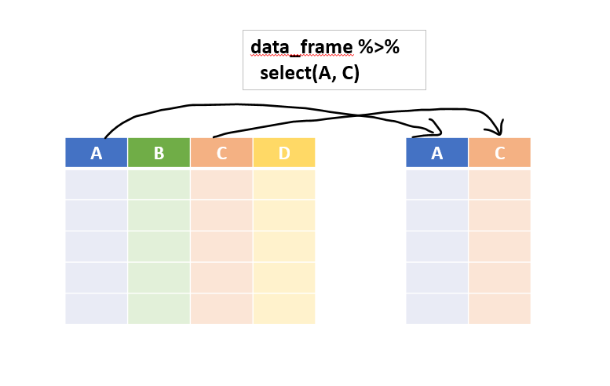
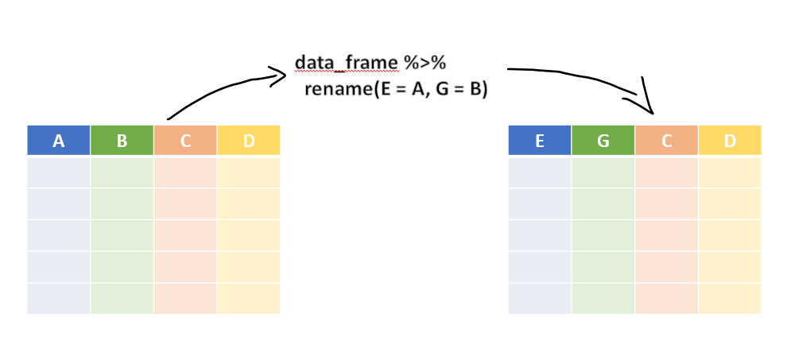

# Data Transformation in `dplyr` {#DPLYRR}

**Prerequisites**
Obviously `dplyr` [@R-dplyr] will be needed.  This package also comes with matrittr pipe i.e. `%>%` and therefore in dplyr syntax we will be using these pipes.  `library(magrittr)` is not needed.
```{r}
library(dplyr)
library(knitr)
```


The package `dplyr` (\@ref(fig:dplyrr)) calls its functions as 'verbs' because these are actually doing some action.  So `dplyr verbs` can be divided in three classifications depending upon where they operate -

- 'Row' verbs that operate on Rows
- 'Column' verbs 
- 'group' verbs that operate on table split into different groups.

```{r dplyrr, echo=FALSE, fig.cap="Package Dplyr", fig.show='hold', out.width="99%", fig.align='center'}
knitr::include_graphics("images/dplyr.png")
```

Let's learn each of these -

## Column verb `select()`
In real world data sets we will often come across with data frames having numerous columns.  However for many of the data analysis tasks, most of these columns are not needed.  As already stated `select` (figure \@ref(fig:selectr)) operates on columns.  Like `SELECT` in `SQL`, it just _select_ the column(s) from the given data frame.  The basic syntax is - `select(data_frame, column_names, ...)`.  So with pipes the same syntax goes like this
```
data_frame %>% 
  select(column_name)
```
```{r selectr, echo=FALSE, fig.cap="Illustration of dplyr::select()", fig.show='hold', out.width="99%", fig.align='center'}

```

For example, let's try our hands on `mtcars` dataset.  
Example-1
```{r}
mtcars %>% 
  select(mpg)
```

**Note** that output is still a data frame unlike the `mtcars[['mpg']]` which returns a vector.  We can subset multiple columns here.  Example-2
```{r}
mtcars %>% 
  select(mpg, qsec) %>% 
  head()
```

We can also provide column numbers instead of names. Example-3
```{r}
mtcars %>% 
  select(4, 6) %>% 
  tail()
```

We can also use `select` to reorder the columns in output, by using a `dplyr` _helping verb_ `everything()` which is basically _everything else._  See this example-
```{r}
mtcars %>% 
  select(qsec, mpg, everything()) %>% 
  names()
```

We may also use mix and match of _column names_ and _column numbers_.  See
```{r}
mtcars %>% 
  select(5, 7, mpg, everything()) %>% 
  names()
```

Operator `:` can also be used with column names.  Ex-
```{r}
mtcars %>% 
  select(mpg:drat) %>% 
  head(n=4)
```


**Other helping verbs**
There are other helping verbs, apart from `everything()` that can be used within `select()` just to eliminate need to type the column names and select columns based on some conditions.  These verbs are self explanatory-

- `starts_with('ABC')` will select all columns the names of which __starts with__ string `ABC`
- `ends_with('ABC')` will select all columns the names of which __ends with__ string `ABC`
- `contains('ABC')` will select all columns the names of which __contains__ string `ABC`
- `num_range('A', 1:3)` will select all columns named `A1`, `A2` and `A3`

Some Examples.

1.  This syntax will select all columns which ends with `"color"` in column names.
```{r}
starwars %>% 
  select(ends_with('color'))
```
Example-2:  This syntax will select all columns contains characters `"or"` in column names.
```{r}
starwars %>% 
  select(contains('or'))
```

**Using `where()`**:  This selection helper selects the variables for which a _function_ when applied to column names, returns `TRUE`.  

Example-3:  This syntax will select all numeric columns from the dataset.
```{r}
starwars %>% 
  select(where(is.numeric))
```


## Column verb`mutate()`
This perhaps is one of the most important functions in `dplyr` kitty.  It enables us to create new column(s) that are functions of one or more existing columns. Refer figure \@ref(fig:mutater)

```{r mutater, echo=FALSE, fig.cap="Illustration of dplyr::mutate()", fig.show='hold', out.width="99%", fig.align='center'}
knitr::include_graphics("images/mutate_dplyr.png")
```

More than one column can be added simultaneously.  Newly created column may also be used for creation of another new column.  See example.
```{r}
starwars %>% 
  select(name:mass) %>% 
  mutate(name_upper = toupper(name),
         BMI = mass/(height/100)^2)
```

By default the new column will be added to the last of data frame.  As shown in above example, more operations can be combined in one using `%>%`.  There is a cousin `transmute()` of _mutate_ which drops all the old columns and keeps only newly created columns.  Example
```{r}
starwars %>% 
  transmute(name_upper = toupper(name))
```

**Other useful dplyr functions**  Another good use of `mutate` is to generate summarised result and display it corresponding to each row in data.  For example if the requirement is to calculate proportion of say `wt` column in `mtcars` data.
```{r}
mtcars %>% 
  head() %>% 
  select(wt) %>% 
  mutate(total_wt = sum(wt),
         wt_proportion = wt*100/total_wt) 
```

1. `n()` is used to count number of rows
2. `n_distinct()` is used to count number of distinct values for the given variable

```{r}
mtcars %>% 
  select(1:5) %>% 
  mutate(total_cars = n()) %>% 
  head()
  
```

## Column verb `rename()`
It is used to _rename_ the column names.  Refer figure \@ref(fig:renamer) for illustration.

```{r renamer, echo=FALSE, fig.cap="Illustration of dplyr::rename()", fig.show='hold', out.width="99%", fig.align='center'}

```

See this example
```{r}
mtcars %>% 
  rename(miles_per_gallon = mpg) %>% 
  head(3)
```

**Note** that `select` can also rename the columns but will drop all unselected columns.  Check this
```{r}
mtcars %>% 
  select(miles_per_gallon = mpg) %>% 
  head(3)
```

## Column verb `relocate()`
It _relocates_ column or block of columns simultaneosly either before the column mentioned in argument `.before` or after mentioned in `.after`.  See the example-
```{r}
starwars %>% 
  relocate(ends_with('color'), .after = name) %>% 
  head(5)
```


## Row verb `filter`
This verb/function is used to subset the data, or in other words filter rows of data frame based on certain condition. Refer figure \@ref(fig:filterr) for illustration.

```{r filterr, echo=FALSE, fig.cap="Illustration of dplyr::filter()", fig.show='hold', out.width="99%", fig.align='center'}
knitr::include_graphics("images/filter_dplyr.png")
```

See this example-
```{r}
starwars %>% 
  filter(eye_color %in% c('red', 'yellow'))
```

Multiple conditions can be passed simultaneously. Example
```{r}
starwars %>% 
  filter(skin_color == 'white',
         height >= 150)
```
**Note** that these conditions act simultaneously as in operator `AND` is used.  So if `OR` is to be used, use `|` explicitly
```{r}
starwars %>% 
  filter(skin_color == 'white' | height >= 150) %>% 
  nrow()
```

## Row verbs `slice()` / `slice_*()` {#slice_func}
`slice()` and its cousins also filters rows but based on rows placement.  So, `data_fr %>% slice(1:5)` will filter out first five rows of the `data_fr`.  See example
```{r}
starwars %>% 
  slice(4:10) # filter 4 to 10th row
```
Other `slice()` cousins -

- `slice_head(5)` will slice out first 5 rows
- `slice_tail(10)` will slice out last 10 rows
- `slice_min()` or `slice_max()` will slice rows with highest or lowest values of given variable. The full syntax is `slice_max(.data, order_by, ..., n, prop, with_ties = TRUE)` or equivalent
- `slice_sample()` will randomly select the rows.  Its syntax is `slice_sample(.data, ..., n, prop, weight_by = NULL, replace = FALSE)`

Example-1:
```{r}
starwars %>% 
  slice_min(height, n=3)
```
Example-2:
```{r}
set.seed(2022)
starwars %>% 
  slice_sample(prop = 0.1) #sample 10% rows
```

## Row verb `arrange()`
This verb also act upon rows and it actually _rearranges_ them on the basis of some condition.  Refer figure \@ref(fig:arranger) for illustration.

```{r arranger, echo=FALSE, fig.cap="Illustration of dplyr::arrange()", fig.show='hold', out.width="99%", fig.align='center'}
knitr::include_graphics("images/arrange_dplyr.png")
```

Example-
```{r}
starwars %>% 
  arrange(height) %>% 
  slice(1:5)
```


## Group verb `group_by()`
A data analyst will be hard to find who is not using `group_by`.  It basically groups the rows on the basis of values of a given variable or block of variables.  The returned result is still a data frame (and one too) but now the rows are grouped.  Refer figure \@ref(fig:groupby) for illustration. So any of the above functions we learnt above will give a different result after group by.

```{r groupby, echo=FALSE, fig.cap="Illustration of Grouped Operations in dplyr", fig.show='hold', out.width="99%", fig.align='center'}
knitr::include_graphics("images/groupby_dplyr.png")
```

Note the output of this simple example
```{r}
starwars %>% 
  group_by(sex)
```
**Note** that output now has 5 groups, though nothing different is seen in the displayed data.

This operation/verb is thus more useful if used in combination with other verbs.

Example-1:  How many total characters are with same skin_color?
```{r}
starwars %>% 
  select(name, skin_color) %>% 
  group_by(skin_color) %>% 
  mutate(total_with_s_c = n())
```

Example- 2: Sample 2 rows of each `cyl` size from `mtcars`?
```{r}
set.seed(123)
mtcars %>% 
  group_by(cyl) %>% 
  slice_sample(n=2)
```
Also note that `grouped` varaible(s) will always be available in the output.
```{r}
mtcars %>% 
  group_by(cyl) %>% 
  select(drat) %>% # despite not selecting cyl
  head() # it is available in output
```


## Group verb `summarise()`
This verb creates a summary row for each group if grouped data frame is in input, otherwise one single for complete operation.  
Example-1:
```{r}
mtcars %>% 
  summarise(total_wt = sum(wt))
```

Example-2:
```{r}
mtcars %>% 
  group_by(cyl) %>% 
  summarise(total_wt = sum(wt))
```

## Group verb `ungroup()`
But now, it may have been noticed that grouping the data with `group_by` and thereafter performing some operation like `mutate` or `slice` returns the grouped data.  But our requirement in next steps would be of ungrouped data. so there is specially designed function in dplyr which ungroups the grouped data.

```{r}
set.seed(123)
mtcars %>% 
  group_by(cyl) %>% 
  slice_sample(n=2) %>% 
  ungroup()
```

## New argument `.by` in `mutate`, `summarise`, `filter`, etc.
Since grouping the data in one step, then performing required step and then again ungrouping it is somewhat cumbersome, coming dplyr 1.1.0 version, the functions `mutate()`, `summarise`, `slice` etc. have gained an additional argument `.by` wherein the variable names for performing grouped operations may be provided directly, thus eliminating the need of both grouping and ungrouping it.  So the following two syntax would produce exactly same results.

```{r}
# Syntax - 1 (old style)

mtcars %>% 
  group_by(cyl) %>% 
  slice(2) %>% 
  ungroup()

# Syntax 2 (Dplyr 1.1.0 +)

mtcars %>% 
  slice(2, .by = cyl)
```

## Group verb `reframe()`

**The content is under development.**

## Other Useful functions in `dplyr`

### `if_else()` {-}
This function operates nearly as similar to base R's `ifelse()` with two exceptions-

- There is an extra argument to provide values when missing values are encountered.  (See example-1)
- `NA` will have to be provided specifically. (See Example-2)

See these examples.  Example-1:
```{r}
x <- c(-2:2, NA)
if_else(x>=0, "positive", "negative", "missing")
```
Example-2:
```{r}
x <- c(-2:2, NA)
if_else(x>=0, "positive", "negative", NA_character_)
```
Due to the additional restrictions, this function is sometimes faster than its base R alternative and may also be useful in prevention of bugs in code as the output will be known beforehand.

### `case_when()` {-}
Though both `ifelse` and `if_else` variants provide for nesting multiple conditions, yet `case_when` provides a simpler alternative in these conditions as here multiple conditions can be provided simultaneously.  Syntax follows this style-
```
case_when(
  condition1 ~ value_if_true,
  condition2 ~ value_if_true,
  ...,
  TRUE ~ value_if_all_above_are_false
)
```
See this example.
```{r}
set.seed(123)
# Generate Incomes from random (uniform) distribution
income <- runif(7, 1, 9)*100000
income

# tax brackets say 0% upto 2 lakh, then 10% upto 5 Lakh
# then 20% upto 7.5 lakh otherwise 30%
tax_slab <- case_when(
  income <= 200000 ~ 0,
  income <= 500000 ~ 10,
  income <= 750000 ~ 20,
  TRUE ~ 30
)

# check tax_slab
data.frame(
  income=income,
  tax_slab = tax_slab
)
```

### `case_match()` {-}
This function is somewhat similar to `case_when`.  While `case_when()` uses logical expressions on the left-hand side of the formula, `case_match()` uses values to match with. Syntax is like

```
case_match(
  .x,  # A vector whose values are to be matched
  ..., # Basically for a condition like .x %in% Y, only Y has to be specified
  .default = NULL, # Default values to be specified for if no match is found
)
```

So, above example could be rewritten as 
```{r}
tax_slab <- case_match(
  floor(income), # Vector to be checked
  0:200000 ~ 0, # slab 1
  200001:500000 ~ 10, # slab 2
  500001:750000 ~ 20, # slab 3
  .default = 30 # Slab 4
)

# check tax_slab
data.frame(
  income=income,
  tax_slab = tax_slab
)

```

## Functional programming in dplyr through `across()` {#across}

**The content is under development.**


## Window functions/operations
We learnt that by using `group_by` function we can create windows in data and we can make our calculations in each separate window specifically.

Dplyr provides us with some useful window functions which will operate on these windows.

1. `row_number()` can be used to generate row number
2. `dense_rank` / `min_rank` / `percent_rank()` / `ntile()` / `cume_dist()` are other windowed functions in dplyr.  Check `?dplyr::ranking` for complete reference.
3. `lead()` and `lag()` will give leading/lagging value in that window.
4. `consecutive_id()` generates a unique identifier that increments every time a variable (or combination of variables) changes.  
 

These functions can be very helpful while analyzing time series data. 

Example-1: Generating row numbers and ranks
```{r}
# example data
df <- data.frame(
  val = c(10, 2, 3, 2, NA)
)

df %>% 
  mutate(
    row = row_number(),
    min_rank = min_rank(val),
    dense_rank = dense_rank(val),
    perc_rank = percent_rank(val),
    cume_dist = cume_dist(val)
  )
```

Example-2: Using previous and next values

```{r}
Orange %>% 
  group_by(Tree) %>% 
  mutate(prev_circ = lag(circumference),
         next_circ = lead(circumference))
```

Example-3: generating run length encoding/consecutive ID

```{r}
df <- data.frame(
  grp = c("A", "B", "B", "A", "A", "B"),
  value = c(1, 2, 3 , 4, 5, 6)
)

df %>% 
  mutate(RLE = consecutive_id(grp))
```


