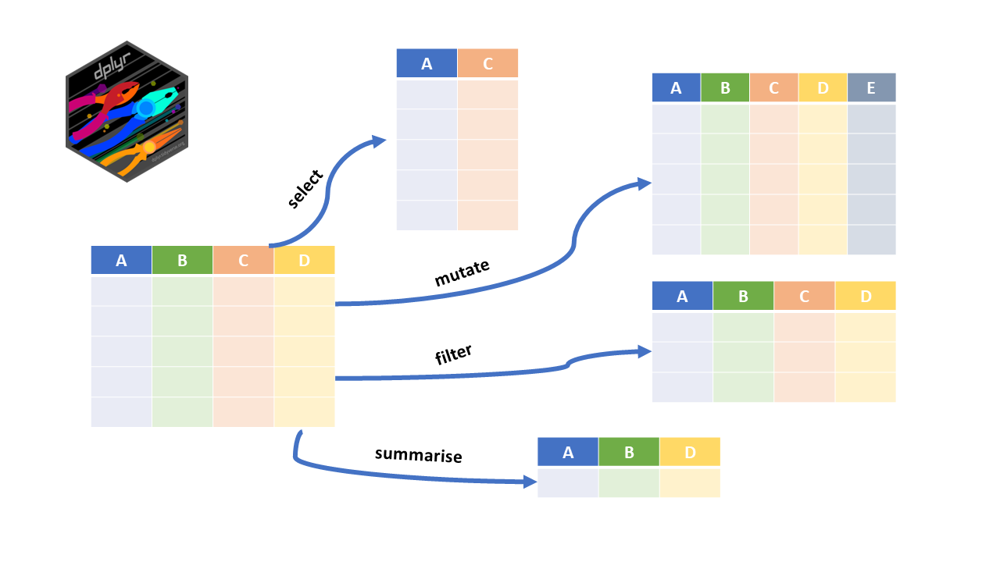
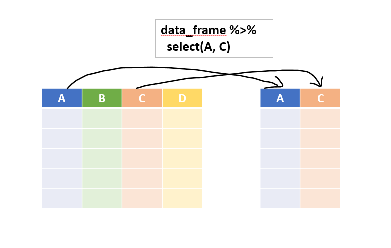
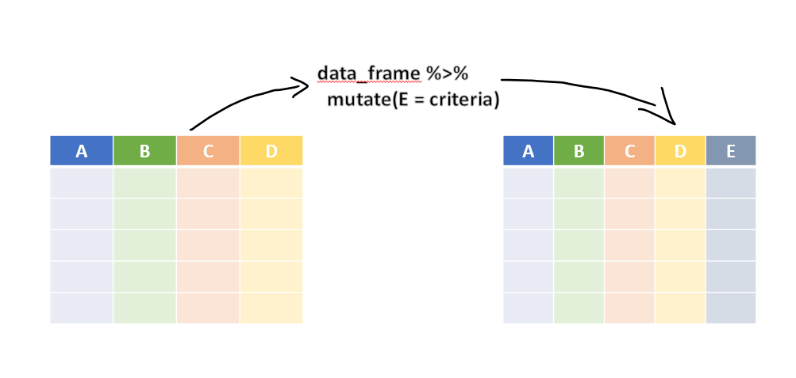
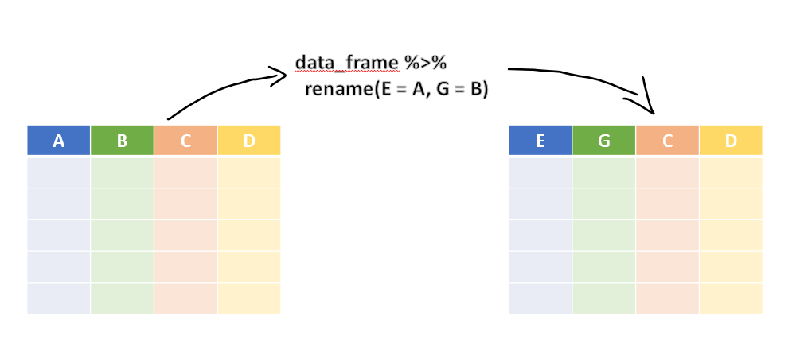
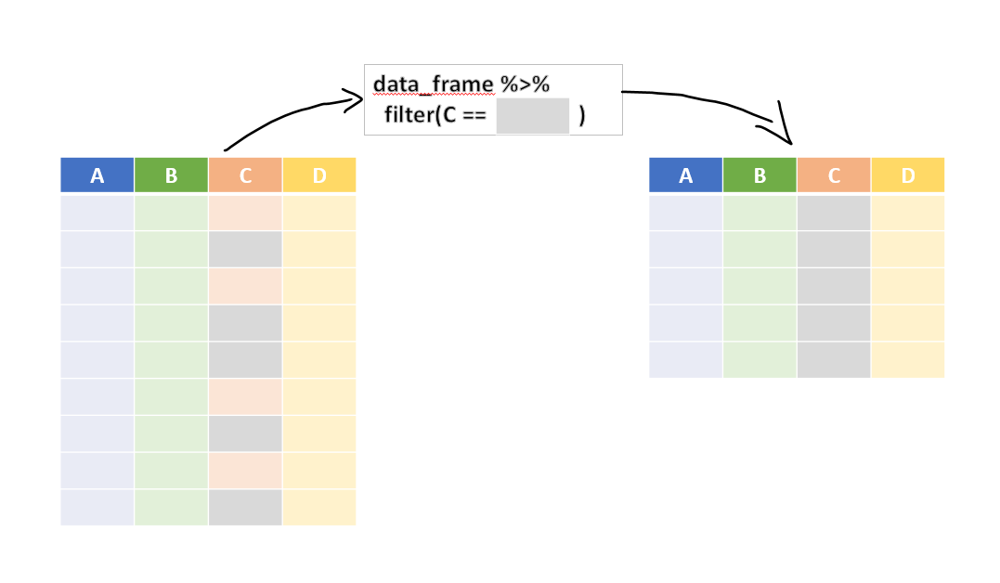
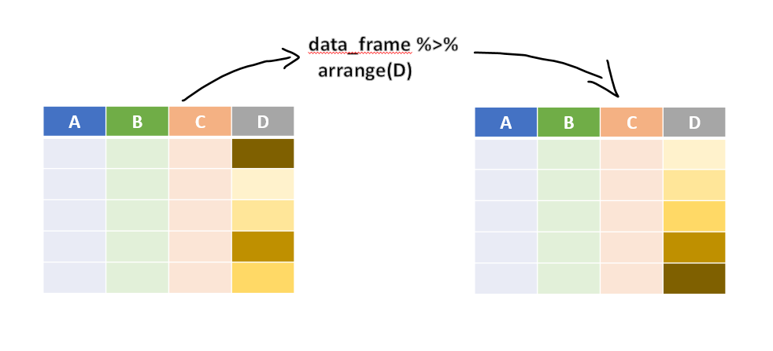
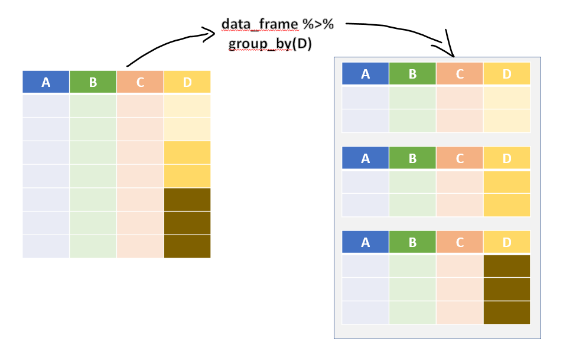

```{r}
#| include: false
source("_common.R")
```

# Transforming Data with dplyr {#sec-DPLYRR}

Most of the work in any analysis is transforming data. Selecting the columns we need, keeping the rows that matter, creating new columns, sorting, and summarising by groups. The package `dplyr` [@R-dplyr], part of the core `tidyverse`, does all this with a small set of functions, which are easy to read even for someone who does not know R.

**Prerequisites**

We load `dplyr` through `tidyverse`. In this book we join steps with the *native pipe* `|>`, which comes with R itself, from version 4.1. You will also see the older pipe `%>%` in many books and websites. For everyday use the two work alike.

```{r}
#| message: false
#| warning: false
library(tidyverse)
```

The functions of `dplyr` are called *verbs*, because each of them does something to the data. The verbs can be divided into three kinds, depending on what they work on (@fig-dplyrr).

- 'Row' verbs, which work on rows
- 'Column' verbs, which work on columns
- 'Group' verbs, which work on a table split into groups

```{r fig-dplyrr, echo=FALSE, fig.cap="Package Dplyr", fig.show='hold', out.width="99%", fig.align='center'}

```

::: callout-note
## dplyr for those who know SQL

Many auditors know SQL from audit software or databases. The main dplyr verbs have direct SQL counterparts.

| SQL | dplyr |
|---------------------|---------------------------|
| `SELECT col1, col2` | `select(col1, col2)` |
| `WHERE condition` | `filter(condition)` |
| `ORDER BY col` | `arrange(col)` |
| `GROUP BY col` with `SUM()`, `COUNT()` | `summarise(..., .by = col)` |
| `CASE WHEN ... THEN ... END` | `case_when()` |
| `SELECT DISTINCT` | `distinct()` |
| `JOIN` | `left_join()`, `inner_join()` and others (@sec-joins) |

In fact, dplyr code can be translated into SQL and run on a database, through the package `dbplyr`.
:::

Let us learn each of these.

## Column verb `select()`

Real datasets often have many columns, and for most tasks only a few of them are needed. `select()` (@fig-selectr) works on columns. Like `SELECT` in `SQL`, it *selects* the columns we name from a data frame. The basic syntax is `select(data_frame, column_names, ...)`. With the pipe, it reads like this.

```
data_frame |>
  select(column_name)
```

```{r fig-selectr, echo=FALSE, fig.cap="Illustration of dplyr::select()", fig.show='hold', out.width="99%", fig.align='center'}

```

For example, let us try our hands on the `mtcars` dataset.
Example-1
```{r}
mtcars |>
  select(mpg)
```

**Note** that the output is still a data frame, unlike `mtcars[['mpg']]`, which returns a vector. We can select several columns at once. Example-2

```{r}
mtcars |>
  select(mpg, qsec) |>
  head()
```

We can also give column numbers instead of names. Example-3

```{r}
mtcars |>
  select(4, 6) |>
  tail()
```

We can also use `select()` to reorder the columns, with the *helper* `everything()`, which means "all the other columns". See this example.

```{r}
mtcars |>
  select(qsec, mpg, everything()) |>
  names()
```

We may also mix column names and column numbers. See

```{r}
mtcars |>
  select(5, 7, mpg, everything()) |>
  names()
```

The operator `:` selects a range of consecutive columns. Ex-

```{r}
mtcars |>
  select(mpg:drat) |>
  head(n=4)
```

**Other selection helpers**

Apart from `everything()`, there are other helpers which select columns by a condition on their names, so that we need not type every name. These are self explanatory.

- `starts_with('ABC')` selects all columns whose names __start with__ `ABC`.
- `ends_with('ABC')` selects all columns whose names __end with__ `ABC`.
- `contains('ABC')` selects all columns whose names __contain__ `ABC`.
- `num_range('A', 1:3)` selects the columns named `A1`, `A2` and `A3`.

Some Examples.

Example-1: This selects all the columns whose names end with `"color"`.

```{r}
starwars |>
  select(ends_with('color'))
```

Example-2: This selects all the columns whose names contain `"or"`.

```{r}
starwars |>
  select(contains('or'))
```

**Using `where()`**: This helper selects the columns for which a *function*, applied to the column's values, returns `TRUE`.

Example-3: This selects all numeric columns of the dataset.

```{r}
starwars |>
  select(where(is.numeric))
```

## Column verb `mutate()`

This is perhaps the most important function of `dplyr`. It creates new columns, which are functions of one or more existing columns. Refer to @fig-mutater.

```{r fig-mutater, echo=FALSE, fig.cap="Illustration of dplyr::mutate()", fig.show='hold', out.width="99%", fig.align='center'}

```

More than one column can be added at once, and a newly created column can be used to create another in the same step. See this example.

```{r}
starwars |>
  select(name:mass) |>
  mutate(name_upper = toupper(name),
         BMI = mass/(height/100)^2)
```

By default, new columns are added at the end of the data frame. The argument `.before` or `.after` places them elsewhere. There is a cousin of `mutate()`, `transmute()`, which keeps only the newly created columns, though `mutate()` with its argument `.keep = "none"` now does the same.

```{r}
starwars |>
  transmute(name_upper = toupper(name))
```

**Group totals on every row.** Another good use of `mutate()` is to calculate a summary and show it on each row. For example, the share of each car's weight in the total weight of the first six cars in `mtcars`.

```{r}
mtcars |>
  head() |>
  select(wt) |>
  mutate(total_wt = sum(wt),
         wt_proportion = wt*100/total_wt)
```

Two useful helper functions are

1. `n()`, which counts the number of rows, and
2. `n_distinct()`, which counts the number of distinct values of a variable.

```{r}
mtcars |>
  select(1:5) |>
  mutate(total_cars = n(),
         cyl_types  = n_distinct(cyl)) |>
  head()
```

## Column verb `rename()`

It *renames* columns. Refer to @fig-renamer for an illustration.

```{r fig-renamer, echo=FALSE, fig.cap="Illustration of dplyr::rename()", fig.show='hold', out.width="99%", fig.align='center'}

```

See this example. The new name comes first.

```{r}
mtcars |>
  rename(miles_per_gallon = mpg) |>
  head(3)
```

**Note** that `select()` can also rename columns, but it drops all the columns not selected. Check this.

```{r}
mtcars |>
  select(miles_per_gallon = mpg) |>
  head(3)
```

## Column verb `relocate()`

It moves a column, or a block of columns, to just before the column given in the argument `.before`, or just after the one given in `.after`. See this example.

```{r}
starwars |>
  relocate(ends_with('color'), .after = name) |>
  head(5)
```

## Row verb `filter`

This verb subsets the data, that is, it keeps the rows which meet a condition. Refer to @fig-filterr for an illustration.

```{r fig-filterr, echo=FALSE, fig.cap="Illustration of dplyr::filter()", fig.show='hold', out.width="99%", fig.align='center'}

```

See this example.

```{r}
starwars |>
  filter(eye_color %in% c('red', 'yellow'))
```

Several conditions can be given at once. Example

```{r}
starwars |>
  filter(skin_color == 'white',
         height >= 150)
```

**Note** that these conditions apply together, as if joined by `AND`. For `OR`, use `|` explicitly.

```{r}
starwars |>
  filter(skin_color == 'white' | height >= 150) |>
  nrow()
```

### Dropping rows with `filter_out()`, and missing values {-}

`filter()` *keeps* the rows for which the condition is `TRUE`. It drops the rows where the condition is `FALSE`, and also those where it is `NA`. This matters a lot when we want to *drop* some rows. Suppose we want to drop the cancelled vouchers from a list of payments, and one voucher has no status recorded.

```{r}
payments <- tibble(voucher = 1:6,
                   amount  = c(500, 25000, NA, 120000, 80000, NA),
                   status  = c("Paid", "Paid", "Cancelled", "Paid", NA, "Paid"))

# Drop the cancelled vouchers, the usual way
payments |> filter(!(status == "Cancelled"))
```

Voucher 5, a payment of 80,000, has silently disappeared, though it was not cancelled. For it, `status == "Cancelled"` is `NA`, and so is its negation, and `filter()` drops rows with `NA`. From version 1.2, dplyr has `filter_out()`, which *drops* the rows for which the condition is `TRUE`, and keeps everything else, including the rows where the condition is `NA`.

```{r}
payments |> filter_out(status == "Cancelled")
```

Now voucher 5 is kept, for us to examine. In audit, a record that quietly drops out of an analysis is a serious error, since the excluded records are often the very ones which need attention. So, to *remove* rows, prefer `filter_out()`, and to *select* rows, use `filter()`.

dplyr 1.2 also added `when_any()` and `when_all()`, which combine several conditions with OR and AND respectively. They read more clearly than long chains of `|` and `&`, especially when each condition is itself complex.

```{r}
# Vouchers which are large OR have no amount recorded
payments |> filter(when_any(amount > 100000, is.na(amount)))
```

## Row verbs `slice()` / `slice_*()` {#sec-slice_func}

`slice()` and its cousins also keep rows, but by their *position*. So `data_fr |> slice(1:5)` keeps the first five rows of `data_fr`. See this example.

```{r}
starwars |>
  slice(4:10) # rows 4 to 10
```

Other members of the `slice()` family are

- `slice_head(n = 5)`, which keeps the first 5 rows.
- `slice_tail(n = 10)`, which keeps the last 10 rows.
- `slice_min()` and `slice_max()`, which keep the rows with the lowest or highest values of a variable, respectively. The full syntax is `slice_max(.data, order_by, ..., n, prop, with_ties = TRUE)`.
- `slice_sample()`, which selects rows at random. Its syntax is `slice_sample(.data, ..., n, prop, weight_by = NULL, replace = FALSE)`. We use it for audit sampling in @sec-sampling.

Note that the number of rows must be given as a *named* argument, `n = 5`. `slice_head(5)` gives an error.

Example-1: The three shortest characters.

```{r}
starwars |>
  slice_min(height, n=3)
```

Example-2: A random 10% of the rows.

```{r}
set.seed(2022)
starwars |>
  slice_sample(prop = 0.1) #sample 10% rows
```

## Row verb `arrange()`

This verb also works on rows. It *rearranges* them in the order of one or more columns. Refer to @fig-arranger for an illustration.

```{r fig-arranger, echo=FALSE, fig.cap="Illustration of dplyr::arrange()", fig.show='hold', out.width="99%", fig.align='center'}

```

Example-

```{r}
starwars |>
  arrange(height) |>
  slice(1:5)
```

To sort in descending order, wrap the column in `desc()`, like `arrange(desc(height))`.

## Group verb `group_by()`

It is hard to find a data analyst who does not use `group_by()`. It groups the rows by the values of one or more variables. The result is still a data frame, but its rows are now grouped. Refer to @fig-groupby for an illustration. The verbs we learnt above then work within each group separately.

```{r fig-groupby, echo=FALSE, fig.cap="Illustration of Grouped Operations in dplyr", fig.show='hold', out.width="99%", fig.align='center'}

```

Note the output of this simple example.

```{r}
starwars |>
  group_by(sex)
```

**Note** that the output now has `r n_groups(group_by(starwars, sex))` groups, though the data shown looks the same. A missing value, `NA`, forms a group of its own.

So grouping is useful only in combination with other verbs.

Example-1: How many characters have the same skin colour as each character?

```{r}
starwars |>
  select(name, skin_color) |>
  group_by(skin_color) |>
  mutate(total_with_s_c = n())
```

Example- 2: Sample 2 rows of each `cyl` size from `mtcars`.

```{r}
set.seed(123)
mtcars |>
  group_by(cyl) |>
  slice_sample(n=2)
```

Also note that the grouping variable(s) are always kept in the output. If we leave them out of `select()`, dplyr adds them back, and tells us so.

```{r}
mtcars |>
  group_by(cyl) |>
  select(drat) |> # despite not selecting cyl
  head() # it is available in output
```

## Group verb `summarise()`

This verb creates one summary row for each group, if the data is grouped, and otherwise one row for the whole data.

Example-1:

```{r}
mtcars |>
  summarise(total_wt = sum(wt))
```

Example-2:

```{r}
mtcars |>
  group_by(cyl) |>
  summarise(total_wt = sum(wt))
```

## Group verb `ungroup()`

After `group_by()` and a verb like `mutate()` or `slice()`, the result is still grouped. Later steps usually need ungrouped data, and a forgotten grouping is a common cause of wrong results. The function `ungroup()` removes the grouping.

```{r}
set.seed(123)
mtcars |>
  group_by(cyl) |>
  slice_sample(n=2) |>
  ungroup()
```

## The argument `.by` in `mutate`, `summarise`, `filter`, etc.

Grouping the data, doing the step, and then ungrouping it is somewhat cumbersome. Since dplyr version 1.1.0, the functions `mutate()`, `summarise()`, `filter()`, `slice()` and others have an argument `.by`, which groups the data for that one step only. So the following two pieces of code give exactly the same result.

```{r}
# Syntax - 1 (old style)

mtcars |>
  group_by(cyl) |>
  slice(2) |>
  ungroup()

# Syntax 2 (Dplyr 1.1.0 +)

mtcars |>
  slice(2, .by = cyl)
```

With `.by`, the result is never left grouped, so there is nothing to forget. We use it throughout this book.

## Group verb `reframe()`

`summarise()` must return exactly *one* row for each group. Sometimes we want more. For example, the quartiles of mileage for each number of cylinders give three numbers per group. `summarise()` refuses this, and suggests `reframe()`.

```{r error=TRUE}
mtcars |>
  summarise(q = quantile(mpg, c(0.25, 0.5, 0.75)), .by = cyl)
```

`reframe()` works like `summarise()`, but allows any number of rows per group.

```{r}
mtcars |>
  reframe(probability = c(0.25, 0.5, 0.75),
          mpg_quantile = quantile(mpg, c(0.25, 0.5, 0.75)),
          .by = cyl)
```

## Other Useful functions in `dplyr`

### `if_else()` {-}

This function works much like base R's `ifelse()`, with two important differences.

- It has an extra argument, `missing`, for the value to use when the condition is `NA`. (See example-1.)
- It is *strict about types*. The values for `TRUE` and `FALSE` must be of the same type. (See Example-2.)

Example-1:

```{r}
x <- c(-2:2, NA)
if_else(x>=0, "positive", "negative", missing = "missing")
```

Example-2: Mixing text and a number.

```{r error=TRUE}
if_else(x>=0, "positive", 0)
```

`if_else()` stops with an error. Base R's `ifelse()` does not complain. It silently turns the `0` into the text `"0"`.

```{r}
ifelse(x>=0, "positive", 0)
```

The strictness of `if_else()` prevents such silent mistakes, which is why we prefer it. It is also much faster on large data.

### `case_when()` {-}

Several conditions can be nested inside `ifelse()` or `if_else()`, but such code is hard to read. `case_when()` is a simpler alternative, where the conditions are listed one after the other. The first condition which is `TRUE` decides the value. The syntax is

```
case_when(
  condition1 ~ value_if_true,
  condition2 ~ value_if_true,
  ...,
  .default = value_if_all_above_are_false
)
```

See this example.

```{r}
set.seed(123)
# Generate Incomes from random (uniform) distribution
income <- runif(7, 1, 9)*100000
income

# tax brackets say 0% upto 2 lakh, then 10% upto 5 Lakh
# then 20% upto 7.5 lakh otherwise 30%
tax_slab <- case_when(
  income <= 200000 ~ 0,
  income <= 500000 ~ 10,
  income <= 750000 ~ 20,
  .default = 30
)

# check tax_slab
data.frame(
  income=income,
  tax_slab = tax_slab
)
```

Older code writes `TRUE ~ value` as the last line, instead of `.default`. Both work.

### `recode_values()` and `replace_values()` {-}

`case_when()` uses logical conditions on the left-hand side of each formula. Often, we only want to match *values*. For this, dplyr 1.2 introduced `recode_values()`, which replaces the earlier `case_match()`. (`case_match()` is deprecated, and you may see it in older code.) Its syntax is like

```
recode_values(
  x,             # A vector whose values are to be matched
  ...,           # value(s) ~ new value
  default = NULL # Value if no match is found
)
```

So, the above example could be rewritten as

```{r}
tax_slab <- recode_values(
  floor(income), # Vector to be checked
  0:200000 ~ 0, # slab 1
  200001:500000 ~ 10, # slab 2
  500001:750000 ~ 20, # slab 3
  default = 30 # Slab 4
)

# check tax_slab
data.frame(
  income=income,
  tax_slab = tax_slab
)

```

`recode_values()` also accepts a lookup table, through the arguments `from` and `to`. With `unmatched = "error"`, it stops if any value is not found in the table, instead of quietly returning `NA`. This is a safe way to convert codes into names.

```{r error=TRUE}
dept_codes <- tibble(code = c("PW", "HE", "ED"),
                     name = c("Public Works", "Health", "Education"))

recode_values(c("HE", "PW", "XX"), from = dept_codes$code, to = dept_codes$name,
              unmatched = "error")
```

The unknown code `XX` is reported at once. Its sister function, `replace_values()`, changes only the matched values and keeps the rest as they are. It is handy for standardising a few variants in otherwise clean data.

```{r}
heads <- c("PWD", "P.W.D.", "Public Works", "Health", "Hlth", "Education")
replace_values(heads,
               c("PWD", "P.W.D.") ~ "Public Works",
               "Hlth" ~ "Health")
```

## Functional programming in dplyr through `across()` {#sec-across}

Often we want to do the same thing to many columns. Round all amount columns, convert all date columns, or find the total of every numeric column. Writing the same line for each column is tedious and error prone. `across()` applies a function to many columns at once, inside `mutate()` or `summarise()`. It has two main arguments.

- `.cols`, the columns, chosen with any of the selection helpers we learnt with `select()`, like `where(is.numeric)` or `starts_with("amt_")`.
- `.fns`, a function, or a list of functions, to apply to each of them.

Let us take a small set of payments, with several amount columns, as payment data usually has.

```{r}
bills <- tibble(
  bill_no   = c("B-101", "B-102", "B-103", "B-104"),
  amt_gross = c(118000.456, 59000, 236000.4, 47200),
  amt_gst   = c(18000.123, 9000, 36000, 7200),
  amt_tds   = c(2000, 1000.5, 4000, -800),
  amt_net   = c(116000.456, 58000, 232000.4, 46400)
)
```

**Applying one function to many columns.** Round all the amount columns to whole rupees.

```{r}
bills |>
  mutate(across(starts_with("amt_"), round))
```

::: callout-warning
## How R rounds halves

Look at the TDS of bill B-102. It was 1000.5, and `round()` has made it 1000, not 1001. R's `round()` follows the international standard of rounding a half to the nearest *even* number. So `round(0.5)` is 0, `round(1.5)` is 2 and `round(2.5)` is also 2. Government accounts, on the other hand, usually round 50 paise and above up to the next rupee. To match that convention, use `janitor::round_half_up()`.

```{r}
round(c(0.5, 1.5, 2.5, 1000.5))
janitor::round_half_up(c(0.5, 1.5, 2.5, 1000.5))
```

Such differences are small, but when our totals differ from the auditee's by a few rupees, the rounding rule is the first thing to check.
:::

**Applying several functions.** With a named list of functions, `summarise()` gives each combination. The argument `.names` sets the names of the new columns, where `{.col}` stands for the column name and `{.fn}` for the function name.

```{r}
bills |>
  summarise(across(starts_with("amt_"),
                   list(total = sum, max = max),
                   .names = "{.col}_{.fn}"))
```

**A function written on the spot.** For a function of our own, we use the short form `\(x)`, which we learnt in @sec-purrr.

```{r}
bills |>
  mutate(across(starts_with("amt_"), \(x) round(x / 1e5, 2), .names = "{.col}_lakh")) |>
  select(bill_no, ends_with("_lakh"))
```

**Conditions on many columns, `if_any()` and `if_all()`.** These are the cousins of `across()` for `filter()`. `if_any()` keeps the rows where the condition is true for *any* of the columns, and `if_all()` where it is true for *all* of them. For example, bills with any negative amount.

```{r}
bills |>
  filter(if_any(starts_with("amt_"), \(x) x < 0))
```

Bill B-104 has a negative TDS, which needs explaining.

## Window functions/operations

With `group_by()` or `.by`, we can create *windows* in the data, and do calculations within each window separately. dplyr has several useful *window functions*, which work within such windows.

1. `row_number()` gives the row number.
2. `dense_rank()`, `min_rank()`, `percent_rank()`, `ntile()` and `cume_dist()` give different kinds of ranks. See `?dplyr::ranking` for the complete reference.
3. `lead()` and `lag()` give the next or previous value in the window.
4. `consecutive_id()` gives an identifier which increases every time a variable (or combination of variables) changes.
5. `cumsum()`, from base R, gives the running total.

These functions are very helpful with time-ordered data, like payments or entries in a ledger.

Example-1: Generating row numbers and ranks

```{r}
# example data
df <- data.frame(
  val = c(10, 2, 3, 2, NA)
)

df |>
  mutate(
    row = row_number(),
    min_rank = min_rank(val),
    dense_rank = dense_rank(val),
    perc_rank = percent_rank(val),
    cume_dist = cume_dist(val)
  )
```

Example-2: Using previous and next values

```{r}
Orange |>
  mutate(prev_circ = lag(circumference),
         next_circ = lead(circumference),
         .by = Tree)
```

Example-3: generating run length encoding/consecutive ID

```{r}
df <- data.frame(
  grp = c("A", "B", "B", "A", "A", "B"),
  value = c(1, 2, 3 , 4, 5, 6)
)

df |>
  mutate(RLE = consecutive_id(grp))
```

## Audit use case, payments beyond the sanctioned amount {#sec-dplyr-audit}

Let us put several verbs together on an audit question. Each work has a sanctioned amount, and several running bills are paid against it over time. Payments beyond the sanction are irregular. Which bill crossed the sanction, and by how much?

```{r}
works <- tibble(work_id = c("W-1", "W-2", "W-3"),
                sanctioned = c(500000, 300000, 800000))

ra_bills <- tibble(
  work_id = c("W-1", "W-1", "W-1", "W-2", "W-2", "W-3", "W-3", "W-3", "W-3"),
  bill_no = c(1, 2, 3, 1, 2, 1, 2, 3, 4),
  paid_on = as.Date(c("2024-05-10", "2024-08-02", "2024-11-20", "2024-06-15", "2024-10-01",
                      "2024-04-12", "2024-07-30", "2024-10-18", "2025-01-22")),
  amount  = c(200000, 180000, 160000, 150000, 120000, 250000, 260000, 200000, 150000)
)
```

```{r}
ra_bills |>
  left_join(works, by = "work_id") |>
  arrange(work_id, paid_on) |>
  mutate(paid_so_far = cumsum(amount), .by = work_id) |>
  mutate(beyond_sanction = pmax(paid_so_far - sanctioned, 0)) |>
  filter(beyond_sanction > 0)
```

In one pipe, we joined the sanctioned amounts (joins are explained in @sec-joins), sorted the bills by date within each work, calculated the running total for each work with `cumsum()` and `.by`, and kept only the bills where the running total exceeded the sanction. Work W-1 crossed its sanction with the third bill, by ₹40,000. Work W-3 crossed it with the fourth bill, by ₹60,000. Work W-2 stayed within its sanction.

::: callout-tip
## Audit tip

Write each analysis as one readable pipe, from the raw data to the exception list, as above. The pipe is then the documentation of the test. A reviewer can read it from top to bottom, and see exactly what was done.
:::

## A suggested workflow

1.  **Keep only the columns you need.** Use `select()` to pick the useful columns from a wide file received from the auditee. Use `rename()` to give them clear names.
2.  **Create the columns the test needs.** Use `mutate()` to add columns like the amount in lakh, or a flag made with `if_else()` or `case_when()`. Use `across()` when the same change applies to many amount columns.
3.  **Keep or drop rows with care.** Use `filter()` to select rows and `filter_out()` to remove them, like cancelled vouchers. Check that no row with a missing value has quietly dropped out.
4.  **Summarise by groups.** Use `summarise()` with `.by` to get totals by office, vendor or month. Use `n()` and `n_distinct()` for counts.
5.  **Use window functions for running checks.** Sort with `arrange()`, then use `cumsum()`, `lag()` or ranks within each group with `.by`. This finds, for example, the running bill which crossed the sanctioned amount.
6.  **Pick out the exceptions.** End the pipe with `filter()` or `slice_max()` to list the cases needing attention. Use `slice_sample()` to draw a sample for detailed checking.
7.  **Reconcile the totals.** Compare the number of rows and the totals with the auditee's figures. If they differ by a few rupees, check the rounding rule first.
8.  **Keep the pipe as your working paper.** Write each test as one readable pipe, from the raw data to the exception list. A reviewer can then follow every step.

::: callout-important
## Remember

`filter()` silently drops the rows where the condition is `NA`. Records which quietly drop out of an analysis are often the very ones which need attention. Use `filter_out()` to remove rows, and check the row count and totals after each step.
:::

## Summary of functions used

| Function | Package | What it does |
|-----------------------|----------------|--------------------------------|
| `select()`, `rename()`, `relocate()` | dplyr | Choose, rename and move columns |
| `starts_with()`, `ends_with()`, `contains()`, `where()`, `everything()` | dplyr (tidyselect) | Helpers to choose columns by name or type |
| `mutate()`, `transmute()` | dplyr | Create new columns |
| `filter()`, `filter_out()`, `when_any()`, `when_all()` | dplyr | Keep or drop rows by conditions |
| `slice()`, `slice_head()`, `slice_min()`, `slice_max()`, `slice_sample()` | dplyr | Keep rows by position, by value, or at random |
| `arrange()`, `desc()` | dplyr | Sort rows |
| `group_by()`, `ungroup()`, `.by` | dplyr | Group and ungroup rows |
| `summarise()`, `reframe()` | dplyr | One summary row per group, or any number of rows per group |
| `n()`, `n_distinct()` | dplyr | Count rows and distinct values |
| `if_else()`, `case_when()` | dplyr | Values by conditions, safely |
| `recode_values()`, `replace_values()` | dplyr | Recode or replace values by matching |
| `across()`, `if_any()`, `if_all()` | dplyr | The same operation, or condition, on many columns |
| `row_number()`, `min_rank()`, `lag()`, `lead()`, `consecutive_id()`, `cumsum()` | dplyr, base R | Window functions |

: Functions used in this chapter {#tbl-dplyrfunctions}
