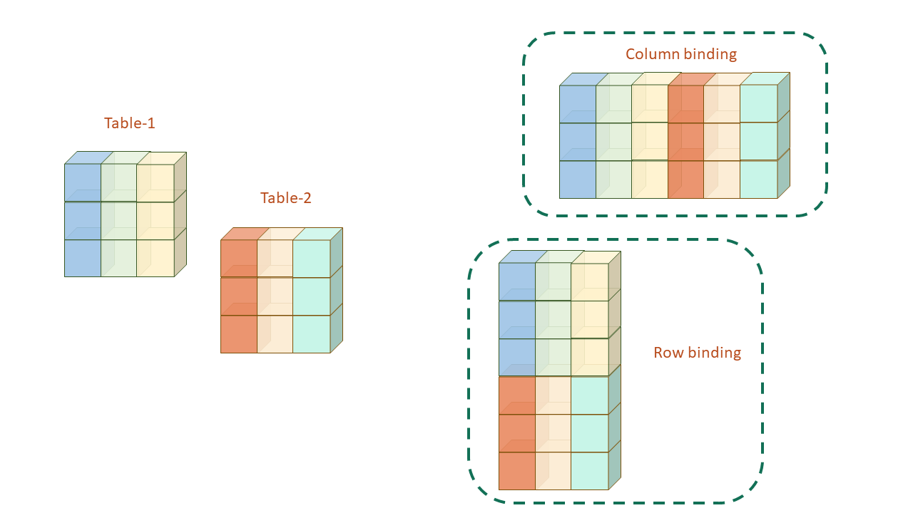
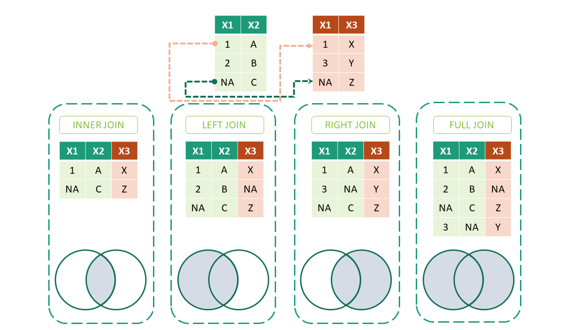

```{r}
#| include: false
source("_common.R")
```

# Joining Tables {#sec-joins}

```{r fig.cap="Most of times, joining two or more tables will be required to perform analytics", fig.align="center", echo=FALSE, out.width="75%", out.height="75%"}


```

In real audit work, there is hardly ever a single table to analyse. A table may be split into smaller tables, say one for each State, which have to be put back together. More often, the data comes from a database, where it is divided into *master* tables (vendors, employees, schemes) and *transaction* tables (payments, bills, claims), linked by codes. Many of the most useful audit tests are joins. Payments to vendors not in the approved list, employees drawing pay after retirement, bills charged at a rate other than the one in force.

**Prerequisites**

```{r}
#| message: false
#| warning: false
library(tidyverse)
```

We may divide the requirements of joining tables into three broad categories.

- Simple joins or concatenation
- Relational Joins
- Filtering Joins

Let us discuss each of these with examples.

## Simple joins/concatenation
Many times tables split into smaller tables have to be joined back before proceeding further for data analytics.  We may have to join two or more tables either columnwise (e.g. some of the features for all rows have been split into a separate table) or row wise (e.g. all the fields/columns are split into smaller tables like a separate table for each State).  Diagrammatically, these joins may be depicted as shown in @fig-joins.

```{r fig-joins, echo=FALSE, fig.cap="Illustration of Simple joins/concatenation", fig.show='hold', out.width="99%", fig.align='center'}

```

### Column binding
As we have already seen that data frames act like matrices in many ways except to that fact that these support heterogeneous data unlike matrices.  We have also discussed the ways two matrices can be joined.  Base R has two dedicated functions i.e. `cbind()` and `rbind()` for these operations.

In _tidyverse_ (dplyr specifically) we have two similar functions `bind_cols()` and `bind_rows` respectively which provide us better functionality for these use cases.  The syntax for the function `bind_cols()` used for concatenating two or more tables _column wise_ is -

```
bind_cols(
  ...,
  .name_repair = c("unique", "universal", "check_unique")
)
```
Where -

- `...` represent data frames to be combined
- `.name_repair` argument chooses method to rename duplicate column names, if any.

Example-1:
```{r}
df1 <- iris[1:3, c(1,2,5)]
df2 <- iris[1:3, 3:5]

bind_cols(df1, df2, .name_repair = 'universal')
```

> Note:  The data frames to be merged should be row-consistent for column binding.  Try this `bind_cols(iris[1:3, 1:2], iris[1:4, 3:4])` and see the results.

### Row binding
The syntax used for appending rows of one or more tables together in one table is -

```
bind_rows(..., .id = NULL)
```
where -

- `...` represent data frames to be combined
- `.id` argument creates a new column of identifiers.

To understand it better, let us see this example
```{r}
setosa <- iris[1:3, 1:4]
versicolor <- iris[51:53, 1:4]
virginica <- iris[101:103, 1:4]

bind_rows(setosa, versicolor, virginica, .id = 'groups')
```

> Note: In the above example, to store the names of the tables in the new _identifier_ column, put the tables in a named list. `.id` then takes the names of the list elements as its values. Try this: `bind_rows(list(setosa=setosa, versicolor=versicolor, virginica=virginica), .id = 'Species')`

## Relational joins

Relational joins combine tables on the basis of *keys*, the columns which identify a record, like a vendor code or an employee number. A *primary key* uniquely identifies each row of a table, and a *foreign key* in another table refers to it.  The joins may either be _one-to-one_ key join or _one-to-many_ key joins.  Broadly these can either be _inner joins_ or _outer joins_. Diagrammatically these may be represented as shown in @fig-joinm wherein it may be noticed that additional columns from `right` data frame gets appended to `left` data frame.  For this reason, these four joins are also known as mutating joins.

```{r fig-joinm, echo=FALSE, fig.cap="Illustration of Mutating Joins in dplyr", fig.show='hold', out.width="99%", fig.align='center'}

```

The syntax of all these joins is nearly same-
```
*_join(x, y, by = NULL, copy = FALSE, suffix = c('.x', '.y'), ... , keep = FALSE)
```
where -

- `x` and `y` are data frames to be joined
- `by` gives the key column(s), as a character vector or with `join_by()`, which we will see shortly
- `suffix` argument provides suffixes to be added to column names, if any of those are duplicate
- `keep` argument decides whether the join keys from both x and y be preserved in the output?

Let's discuss each of these joins individually.

### Inner Joins

Inner Joins keeps only those rows where matching keys are present in both the data frames.

Example-1:
```{r}
band_members
band_instruments

inner_join(band_members, band_instruments)
```

### Left Joins

Left Joins on the other hand preserves all rows of data frame passed as `x` i.e. first argument irrespective of the fact that matching key record is available in second data table or not.

Example-1:
```{r}
left_join(band_members, band_instruments)
```

### Right Joins

Right join, is similar to left join and preserves all rows of data frame passed as `y` i.e. second argument irrespective of the fact that matching key record is available in first data table or not.

Example-1:
```{r}
right_join(band_members, band_instruments)
```

### Full Joins

Full join returns all the rows of both the data tables despite non-availability of matching key in either of the tables.

Example-1:
```{r}
full_join(band_members, band_instruments)
```

You must have noticed that each of the examples above printed a message, that the join was made on the column `name`. When `by` is not given, dplyr joins on all the columns with the same names in both tables. It is safer to always give the key yourself, like `by = "name"`, so that the join does not silently change if a column is added later.

There may be cases when the joining _key_ column(s) in the two data frames are of different names.  These cases can also be handled by using `by` argument.

Example-
```{r}
band_instruments2
left_join(band_members, band_instruments2, by = c('name' = 'artist'))
```

> Note: Each of the `*_join()` can be joined on multiple keys/columns (i.e. more than one) using `by` argument as explained above.

### Many-to-many Joins {-}
If a key value appears more than once in *both* tables, every copy in one table is matched with every copy in the other. Such *many-to-many* joins multiply rows, and need to be used carefully. See the following example.
```{r}
df1 <- data.frame(
  x = c(1, 1, NA),
  y = c(11, 12, 21)
)
df1
df2 <- data.frame(
  x = c(1, 1, NA, NA),
  z = c(101, 102, 201, 202)
)
df2
df1 |> left_join(df2, by = 'x')
```
Notice two things in this output. First, each `1` in `df1` has been matched with both `1`s in `df2`, giving four rows. Second, the `NA` in `df1` has been matched with *both* `NA`s in `df2`. By default, dplyr treats a missing key as matching another missing key. We will see in a moment why this is dangerous in audit data.

dplyr warns us about the many-to-many relationship. We can state the relationship we *expect* with the argument `relationship`. If the data does not fit, the join stops with an error, which is exactly what we want. The argument can take one of these values

- `NULL` (default)
- `"one-to-one"`
- `"one-to-many"`
- `"many-to-one"`
- `"many-to-many"`

Example above re-coded
```{r}
df1 |> left_join(df2, by = 'x', relationship = "many-to-many")
```

### Missing keys, a common trap {-}

Let us see how a missing key can inflate a total. Two payments have no vendor code, and the vendor master also has two vendors without a code.

```{r}
payments <- tibble(voucher = 1:5, vendor_code = c("V1", "V2", NA, NA, "V3"),
                   amount = c(100, 200, 300, 400, 500))
vendors  <- tibble(vendor_code = c("V1", "V2", NA, NA),
                   vendor_name = c("Sharma", "Gupta", "Unknown-1", "Unknown-2"))

joined <- payments |> left_join(vendors, by = "vendor_code")
joined
c(rows_before = nrow(payments), rows_after = nrow(joined))
c(total_before = sum(payments$amount), total_after = sum(joined$amount))
```

Five payments of ₹1,500 have become seven rows, totalling ₹2,200. Each payment without a vendor code was matched with *both* vendors without a code. The argument `na_matches = "never"` stops missing keys from matching each other.

```{r}
payments |> left_join(vendors, by = "vendor_code", na_matches = "never")
```

Even better, state that each payment should match *at most one* vendor. Then dplyr stops, instead of quietly adding rows.

```{r error=TRUE}
payments |> left_join(vendors, by = "vendor_code", relationship = "many-to-one")
```

::: callout-tip
## Audit tip

After every join, compare the number of rows and the totals before and after, as we did above. A left join on a proper key should never change them. If the rows increase, the key is not unique in the second table, or missing keys are matching each other. Use `relationship` to make dplyr check this for you, and `na_matches = "never"` for keys which may be missing.
:::


## Filtering Joins
The other joins available in `dplyr` are basically filtering joins.  These joins will not result in appending additional columns present in `right` data frame to `left` data frame.  Only the common keys (columns) from right data frame will be used to filter left data frame.

### Semi Joins

First of these is `semi_join` which essentially filters those rows from a data frame, which are based on another data frame.  See this example-
```{r}
df1 <- data.frame(
  x = c(1, 2, NA),
  y = c(11, 21, 100)
)
df1
df2 <- data.frame(
  x = c(1, 3, 4, NA),
  z = c(101, 301, 401, 501)
)
df2
df1 |> semi_join(df2, by = 'x')
```

### Anti Joins
The `anti_join` is the opposite of `semi_join`. It keeps only those records of the left data frame which have *no* match in the right data frame. Example
```{r}
df1 |> anti_join(df2, by = 'x')
```

Anti joins are the backbone of *completeness* and *validity* tests in audit. Some examples are

- payments to vendors who are not in the approved vendor list, `payments |> anti_join(vendors, by = "vendor_code")`,
- beneficiaries paid but not in the list of eligible beneficiaries,
- items issued from the store which were never received into it.

Each row returned is an exception to be explained.


## Relational, but non-equi joins {#sec-nonequi}
So far, we have given the keys as character strings. Since dplyr version 1.1.0, released in January 2023, there is a helper function `join_by()`.  It actually, constructs a specification that describes how to join two tables using a small domain specific language. The result can be supplied as the by argument to any of the join functions that we have learnt above.  For equal joins, we have learnt above, there are two slight but easier to implement changes if we use `join_by()` -

- we may pass variable names in by argument instead of using characters as described above.
- instead of using `=` we have to use `==` which is actually the equality operator as opposed to assignment operator we were using earlier.

So our syntax for `left_join` example is
```{r}
band_instruments2
left_join(band_members, band_instruments2, by = join_by(name == artist))
```
Simple, isn't it? But the real power of `join_by()` is that it can join tables on *inequality* conditions too.

### Inequality Joins
Inequality joins match on an inequality, such as `>`, `>=`, `<`, or `<=`, and are common in time series analysis and genomics. To construct an inequality join using `join_by()`, we have to supply two column names separated by one of the above mentioned inequalities.  See the following example for better understanding of inequality joins.

Example- Suppose we have two tables, one containing product-wise `sales` and another containing `rates` as and when these are revised.  So, in order to have total sales amount, we can use inequality join.

```{r}
# sales
sales <- data.frame(
  product.id = c("A", "A", "A", "A", "A", "B", "B"),
  sales.date = as.Date(c("01-01-2022",
                 "02-02-2022","05-11-2022","05-04-2022",
                 "05-10-2022","01-02-2022","01-01-2023"), format = "%d-%m-%Y"),
  quantity = c(5L, 10L, 15L, 5L, 15L, 1L, 2L)
)
# Print it
sales
# rates
rates <- data.frame(
  product.id = c("A", "A", "A", "B", "B"),
  revision.date = as.Date(c("01-02-2022",
                    "03-04-2022","05-10-2022","01-01-2022",
                    "05-10-2022"), format = "%d-%m-%Y"),
  rate = c(50L, 60L, 70L, 500L, 1500L)
)
#print it
rates

# total sale(1st attempt)
sales |>
  left_join(rates,
            by = join_by(product.id,
                         sales.date >= revision.date))
```

We got results, but too many of them. Each sale has been matched with *every* rate revision made on or before its date, so a sale after the third revision appears three times, with three different rates. What we want is only the *latest* revision on or before the sale date. For this, we have **rolling joins**. See the next section.

### Rolling Joins
Rolling joins are a variant of inequality joins that limit the results returned from an inequality join condition. They are useful for "rolling" the closest match forward/backwards when there isn't an exact match. To construct a rolling join, we have to wrap inequality condition with `closest()`.

Above example solved by wrapping date condition in `closest()`
```{r}
sales |>
  left_join(rates,
            by = join_by(product.id,
                         closest(sales.date >= revision.date)))
```

We may see that we do not have rates for product `A` for sales made on `01-01-2022`.

### Overlap Joins
Overlap joins are a special case of inequality joins involving one or two columns from the left-hand table overlapping a range defined by two columns from the right-hand table. There are three helpers that `join_by()` recognizes to assist with constructing overlap joins, all of which can be constructed from simpler inequalities.

- `between(x, y_lower, y_upper, ..., bounds = "[]")` which is just short for `x >= y_lower, x <= y_upper`

- `within(x_lower, x_upper, y_lower, y_upper)` which is just short for `x_lower >= y_lower, x_upper <= y_upper`

- `overlaps(x_lower, x_upper, y_lower, y_upper, ..., bounds = "[]")` which is short for `x_lower <= y_upper, x_upper >= y_lower`

We can make use of these functions as per our need.

Example-2: Suppose we have `orders` data, with customer-wise orders and their order and ship dates.  Let us suppose we want to know about customers who placed another order, without waiting for shipping of any of their previous/earlier order.

```{r}
orders <- structure(list(customer_id = c("A", "A", "A", "B", "B", "C",
"C"), order_id = 1:7, order_date = c("2019-01-01", "2019-01-05",
"2019-01-16", "2019-01-05", "2019-01-06", "2019-01-07", "2019-01-09"
), ship_date = c("2019-01-30", "2019-02-10", "2019-01-18", "2019-01-08",
"2019-01-08", "2019-01-08", "2019-01-10")), row.names = c(NA,
-7L), class = "data.frame")

# print
orders

# customers who placed the orders without
# waiting to ship their earlier order
orders |>
  inner_join(orders,
             by = join_by(customer_id,
                          overlaps(order_date, ship_date, order_date, ship_date),
                          order_id < order_id))
```

Each row of the result is a pair of orders of the same customer, where the second order was placed before the first was shipped. Customer A placed order 2 while order 1 was still not shipped, and so on.

### Audit use of rolling joins, the rate in force {#sec-joins-audit}

Rates of supply contracts, allowances and taxes are revised from time to time. A bill must use the rate in force on its date. A bill charged at an old, higher rate after a revision is an overpayment. Let us check some bills for cement and steel against a table of rate revisions.

```{r}
rate_revisions <- tibble(
  item           = c("Cement", "Cement", "Steel", "Steel"),
  effective_from = as.Date(c("2024-04-01", "2024-10-01", "2024-04-01", "2024-12-01")),
  rate           = c(390, 360, 62, 58)
)

bills <- tibble(
  bill_no      = sprintf("B-%02d", 1:8),
  item         = rep(c("Cement", "Steel"), each = 4),
  bill_date    = as.Date(c("2024-05-10", "2024-09-25", "2024-10-15", "2024-12-20",
                           "2024-06-01", "2024-11-30", "2024-12-15", "2025-02-10")),
  qty          = c(500, 800, 600, 700, 10000, 8000, 12000, 9000),
  rate_charged = c(390, 390, 390, 360, 62, 62, 62, 58)
)
```

The rolling join picks, for each bill, the latest revision on or before the bill date.

```{r}
bills |>
  left_join(rate_revisions,
            by = join_by(item, closest(bill_date >= effective_from))) |>
  mutate(excess = (rate_charged - rate) * qty) |>
  filter(excess > 0)
```

Bill B-03 was charged the old cement rate of ₹390, two weeks after it was revised to ₹360. Bill B-07 was charged the old steel rate after its revision. Together, they show an excess payment of ₹`r format(18000 + 48000, big.mark = ",")`. The same join checks dearness allowance against the rate in force for each month, or tax rates against the date of each invoice.

### Cross Joins
This join matches every row of one table with every row of the other, so it can be thought of as a cross product of two data frames. We use `cross_join()` for it. If the two data frames have `m` and `n` rows, the result has `m*n` rows. It grows very fast, so use it only on small tables. For comparing records of a large table with each other, an inequality join is far more efficient, as we saw in @sec-dup.

Example-
```{r}
df <- data.frame(products = c('A', 'B', 'C'))

df |>
  cross_join(df)
```

## A suggested workflow

1.  **Know the keys.** Identify the column which links the two tables, like a vendor code, employee number or PAN. Check that it is unique in the master table.
2.  **Stack similar files first.** When data comes as a separate file for each district or month, put the files together with `bind_rows()`. Use `.id` to keep a column showing where each row came from.
3.  **Bring in master details with `left_join()`.** Add vendor names or sanctioned amounts to the payment register. Always give the key yourself, with `by` or `join_by()`.
4.  **Let dplyr check the join.** Use `relationship = "many-to-one"` when each payment should match only one vendor. Use `na_matches = "never"` when keys may be missing.
5.  **Reconcile after every join.** Compare the number of rows and the total amount before and after the join. A left join on a proper key should not change them.
6.  **Find exceptions with `anti_join()`.** Payments to vendors not in the approved list, or beneficiaries paid but not eligible, are rows with no match. Each one is an exception to be explained.
7.  **Use rolling joins for the rate in force.** Join bills to rate revisions with `closest()` inside `join_by()`, so that each bill gets the rate on its date. Then compare the rate charged with the rate in force.
8.  **Use overlap joins for periods.** Use `between()` or `overlaps()` inside `join_by()` to find records whose dates fall in, or clash with, another period.

::: callout-important
## Remember

A join can quietly add rows. A key which is not unique, or missing keys matching each other, can inflate the totals without any error. Always count the rows and add up the amounts before and after a join, and let `relationship` check the join for you.
:::

## Summary of functions used

| Function | Package | What it does |
|-----------------------|----------------|--------------------------------|
| `bind_cols()`, `bind_rows()` | dplyr | Put tables side by side, or one below the other |
| `inner_join()`, `left_join()`, `right_join()`, `full_join()` | dplyr | Join tables on keys, keeping matched, left, right or all rows |
| `semi_join()`, `anti_join()` | dplyr | Keep rows with, or without, a match in another table |
| `join_by()` | dplyr | Describe the join, including inequalities |
| `closest()`, `between()`, `within()`, `overlaps()` | dplyr | Rolling and overlap joins inside `join_by()` |
| `cross_join()` | dplyr | Every row with every row |
| `relationship`, `na_matches` | dplyr | Arguments to check the type of join, and stop missing keys matching |

: Functions used in this chapter {#tbl-joinfunctions}
