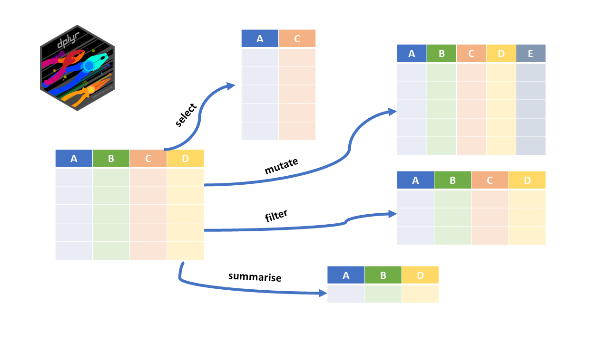
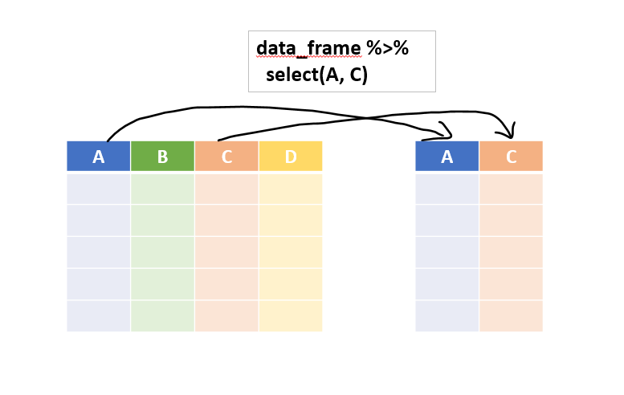
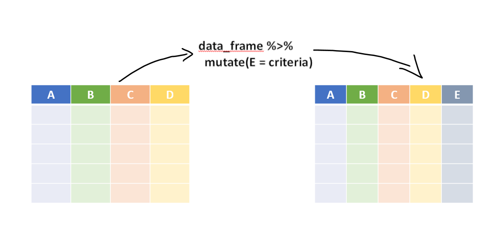
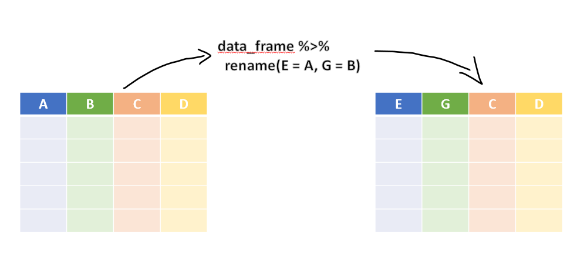
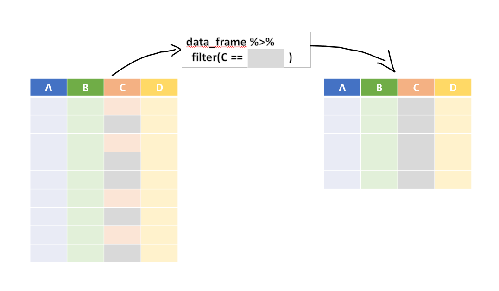
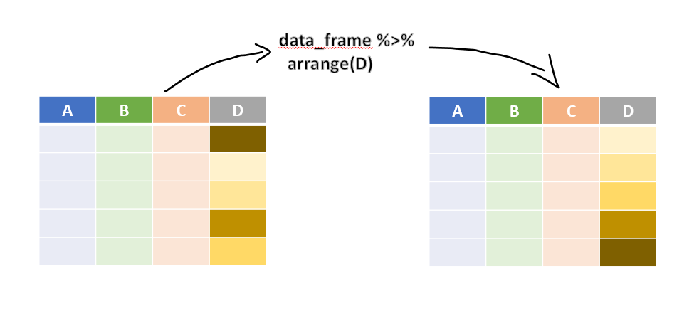
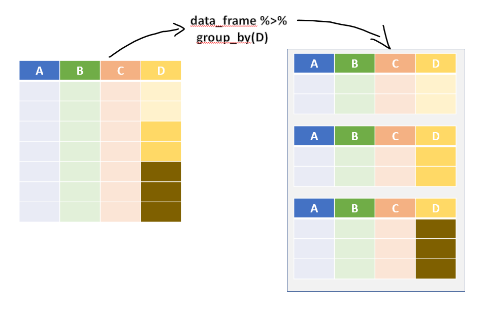
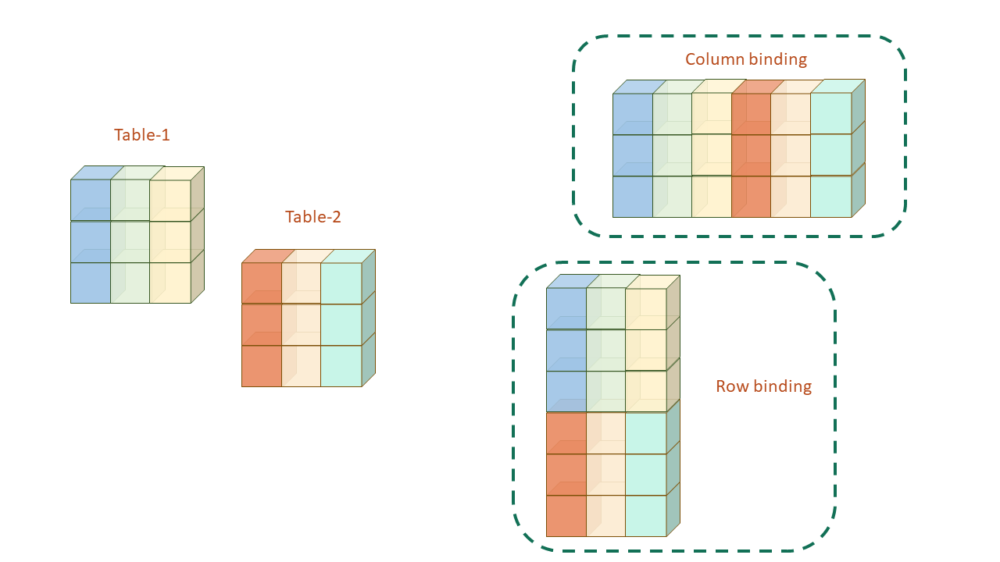
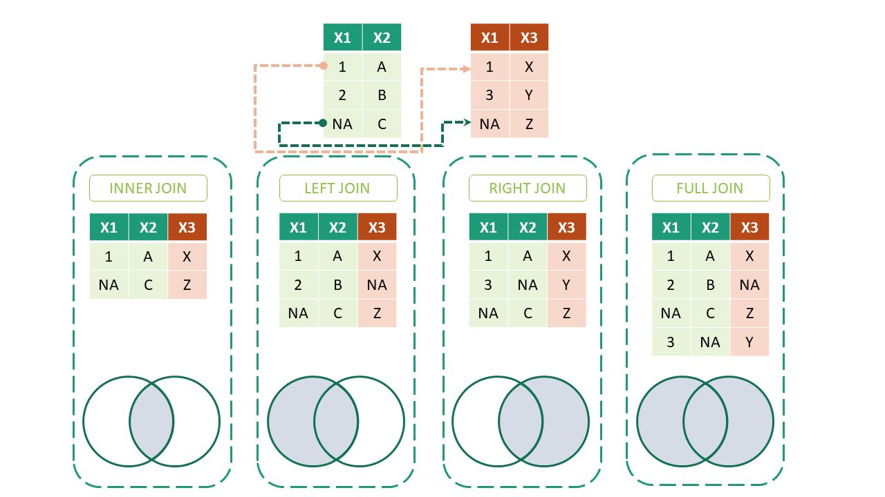

# Data Transformation in `dplyr`

## Prerequisites
Obviously `dplyr` [@R-dplyr] will be needed.  This package also comes with matrittr pipe i.e. `%>%` and therefore in dplyr syntax we will be using these pipes.  `library(magrittr)` is not needed.
```{r}
library(dplyr)
library(knitr)
```


The package `dplyr` (\@ref(fig:dplyrr)) calls its functions as 'verbs' because these are actually doing some action.  So `dplyr verbs` can be divided in three classifications depending upon where they operate -

- 'Row' verbs that operate on Rows
- 'Column' verbs 
- 'group' verbs that operate on table split into different groups.

```{r dplyrr, echo=FALSE, fig.cap="Package Dplyr", fig.show='hold', out.width="99%", fig.align='center'}

```

Let's learn each of these -

## Column verbs

### `select()`
In real world data sets we will often come across with data frames having numerous columns.  However for many of the data analysis tasks, most of these columns are not needed.  As already stated `select` (figure \@ref(fig:selectr)) operates on columns.  Like `SELECT` in `SQL`, it just _select_ the column(s) from the given data frame.  The basic syntax is - `select(data_frame, column_names, ...)`.  So with pipes the same syntax goes like this
```
data_frame %>% 
  select(column_name)
```
```{r selectr, echo=FALSE, fig.cap="Illustration of dplyr::select()", fig.show='hold', out.width="99%", fig.align='center'}

```

For example, let's try our hands on `mtcars` dataset.  
Example-1
```{r}
mtcars %>% 
  select(mpg)
```

**Note** that output is still a data frame unlike the `mtcars[['mpg']]` which returns a vector.  We can subset multiple columns here.  Example-2
```{r}
mtcars %>% 
  select(mpg, qsec) %>% 
  head()
```

We can also provide column numbers instead of names. Example-3
```{r}
mtcars %>% 
  select(4, 6) %>% 
  tail()
```

We can also use `select` to reorder the columns in output, by using a `dplyr` _helping verb_ `everything()` which is basically _everything else._  See this example-
```{r}
mtcars %>% 
  select(qsec, mpg, everything()) %>% 
  names()
```

We may also use mix and match of _column names_ and _column numbers_.  See
```{r}
mtcars %>% 
  select(5, 7, mpg, everything()) %>% 
  names()
```

Operator `:` can also be used with column names.  Ex-
```{r}
mtcars %>% 
  select(mpg:drat) %>% 
  head(n=4)
```


**Other helping verbs**
There are other helping verbs, apart from `everything()` that can be used within `select()` just to eliminate need to type the column names and select columns based on some conditions.  These verbs are self explanatory-

- `starts_with('ABC')` will select all columns the names of which __starts with__ string `ABC`
- `ends_with('ABC')` will select all columns the names of which __ends with__ string `ABC`
- `contains('ABC')` will select all columns the names of which __contains__ string `ABC`
- `num_range('A', 1:3)` will select all columns named `A1`, `A2` and `A3`

Some Examples-
```{r}
starwars %>% 
  select(ends_with('color'))
```
Example-2
```{r}
starwars %>% 
  select(contains('or'))
```


### `mutate()`
This perhaps is one of the most important functions in `dplyr` kitty.  It enables us to create new column(s) that are functions of one or more existing columns. Refer figure \@ref(fig:mutater)

```{r mutater, echo=FALSE, fig.cap="Illustration of dplyr::mutate()", fig.show='hold', out.width="99%", fig.align='center'}

```

More than one column can be added simultaneously.  Newly created column may also be used for creation of another new column.  See example.
```{r}
starwars %>% 
  select(name:mass) %>% 
  mutate(name_upper = toupper(name),
         BMI = mass/(height/100)^2)
```

By default the new column will be added to the last of data frame.  As shown in above example, more operations can be combined in one using `%>%`.  There is a cousin `transmute()` of _mutate_ which drops all the old columns and keeps only newly created columns.  Example
```{r}
starwars %>% 
  transmute(name_upper = toupper(name))
```

**Other useful dplyr functions**  Another good use of `mutate` is to generate summarised result and display it corresponding to each row in data.  For example if the requirement is to calculate proportion of say `wt` column in `mtcars` data.
```{r}
mtcars %>% 
  head() %>% 
  select(wt) %>% 
  mutate(total_wt = sum(wt),
         wt_proportion = wt*100/total_wt) 
```

1. `n()` is used to count number of rows
2. `n_distinct()` is used to count number of distinct values for the given variable

```{r}
mtcars %>% 
  select(1:5) %>% 
  mutate(total_cars = n()) %>% 
  head()
  
```

### `rename()`
It is used to _rename_ the column names.  Refer figure \@ref(fig:renamer) for illustration.

```{r renamer, echo=FALSE, fig.cap="Illustration of dplyr::rename()", fig.show='hold', out.width="99%", fig.align='center'}

```

See this example
```{r}
mtcars %>% 
  rename(miles_per_gallon = mpg) %>% 
  head(3)
```

**Note** that `select` can also rename the columns but will drop all unselected columns.  Check this
```{r}
mtcars %>% 
  select(miles_per_gallon = mpg) %>% 
  head(3)
```

### `relocate()`
It _relocates_ column or block of columns simultaneosly either before the column mentioned in argument `.before` or after mentioned in `.after`.  See the example-
```{r}
starwars %>% 
  relocate(ends_with('color'), .after = name) %>% 
  head(5)
```


## Row verbs
### `filter`
This verb/function is used to subset the data, or in other words filter rows of data frame based on certain condition. Refer figure \@ref(fig:filterr) for illustration.

```{r filterr, echo=FALSE, fig.cap="Illustration of dplyr::filter()", fig.show='hold', out.width="99%", fig.align='center'}

```

See this example-
```{r}
starwars %>% 
  filter(eye_color %in% c('red', 'yellow'))
```

Multiple conditions can be passed simultaneously. Example
```{r}
starwars %>% 
  filter(skin_color == 'white',
         height >= 150)
```
**Note** that these conditions act simultaneously as in operator `AND` is used.  So if `OR` is to be used, use `|` explicitly
```{r}
starwars %>% 
  filter(skin_color == 'white' | height >= 150) %>% 
  nrow()
```

### `slice()` / `slice_*()` {#slice_func}
`slice()` and its cousins also filters rows but based on rows placement.  So, `data_fr %>% slice(1:5)` will filter out first five rows of the `data_fr`.  See example
```{r}
starwars %>% 
  slice(4:10) # filter 4 to 10th row
```
Other `slice()` cousins -

- `slice_head(5)` will slice out first 5 rows
- `slice_tail(10)` will slice out last 10 rows
- `slice_min()` or `slice_max()` will slice rows with highest or lowest values of given variable. The full syntax is `slice_max(.data, order_by, ..., n, prop, with_ties = TRUE)` or equivalent
- `slice_sample()` will randomly select the rows.  Its syntax is `slice_sample(.data, ..., n, prop, weight_by = NULL, replace = FALSE)`

Example-1:
```{r}
starwars %>% 
  slice_min(height, n=3)
```
Example-2:
```{r}
set.seed(2022)
starwars %>% 
  slice_sample(prop = 0.1) #sample 10% rows
```

### `arrange()`
This verb also act upon rows and it actually _rearranges_ them on the basis of some condition.  Refer figure \@ref(fig:arranger) for illustration.

```{r arranger, echo=FALSE, fig.cap="Illustration of dplyr::arrange()", fig.show='hold', out.width="99%", fig.align='center'}

```

Example-
```{r}
starwars %>% 
  arrange(height) %>% 
  slice(1:5)
```
## Group verbs

### `group_by()`
A data analyst will be hard to find who is not using `group_by`.  It basically groups the rows on the basis of values of a given variable or block of variables.  The returned result is still a data frame (and one too) but now the rows are grouped.  Refer figure \@ref(fig:groupby) for illustration. So any of the above functions we learnt above will give a different result after group by.

```{r groupby, echo=FALSE, fig.cap="Illustration of Grouped Operations in dplyr", fig.show='hold', out.width="99%", fig.align='center'}

```

Note the output of this simple example
```{r}
starwars %>% 
  group_by(sex)
```
**Note** that output now has 5 groups, though nothing different is seen in the displayed data.

This operation/verb is thus more useful if used in combination with other verbs.

Example-1:  How many total characters are with same skin_color?
```{r}
starwars %>% 
  select(name, skin_color) %>% 
  group_by(skin_color) %>% 
  mutate(total_with_s_c = n())
```

Example- 2: Sample 2 rows of each `cyl` size from `mtcars`?
```{r}
set.seed(123)
mtcars %>% 
  group_by(cyl) %>% 
  slice_sample(n=2)
```
Also note that `grouped` varaible(s) will always be available in the output.
```{r}
mtcars %>% 
  group_by(cyl) %>% 
  select(drat) %>% # despite not selecting cyl
  head() # it is available in output
```


### `summarise()`
This verb creates a summary row for each group if grouped data frame is in input, otherwise one single for complete operation.  

Example-1:
```{r}
mtcars %>% 
  summarise(total_wt = sum(wt))
```
Example-2:
```{r}
mtcars %>% 
  group_by(cyl) %>% 
  summarise(total_wt = sum(wt))
```

## Other Useful functions in `dplyr`

### `if_else()` {-}
This function operates nearly as similar to base R's `ifelse()` with two exceptions-

- There is an extra argument to provide values when missing values are encountered.  (See example-1)
- `NA` will have to be provided specifically. (See Example-2)

See these examples.  Example-1:
```{r}
x <- c(-2:2, NA)
if_else(x>=0, "positive", "negative", "missing")
```
Example-2:
```{r}
x <- c(-2:2, NA)
if_else(x>=0, "positive", "negative", NA_character_)
```
Due to the additional restrictions, this function is sometimes faster than its base R alternative and may also be useful in prevention of bugs in code as the output will be known beforehand.

### `case_when()` {-}
Though both `ifelse` and `if_else` variants provide for nesting multiple conditions, yet `case_when` provides a simpler alternative in these conditions as here multiple conditions can be provided simultaneously.  Syntax follows this style-
```
case_when(
  condition1 ~ value_if_true,
  condition2 ~ value_if_true,
  ...,
  TRUE ~ value_if_all_above_are_false
)
```
See this example.
```{r}
set.seed(123)
income <- runif(7, 1, 9)*100000
income

# tax brackets say 0% upto 2 lakh, then 10% upto 5 Lakh
# then 20% upto 7.5 lakh otherwise 30%
tax_slab <- case_when(
  income <= 200000 ~ 0,
  income <= 500000 ~ 10,
  income <= 750000 ~ 20,
  TRUE ~ 30
)

# check tax_slab
data.frame(
  income=income,
  tax_slab = tax_slab
)
```

## Window functions/operations
We learnt that by using `group_by` function we can create windows in data and we can make our calculations in each separate window specifically.

Dplyr provides us with some useful window functions which will operate on these windows.

1. `row_number()` can be used to generate row number
2. `dense_rank` / `min_rank` / `percent_rank()` / `ntile()` / `cume_dist()` are other windowed functions in dplyr.  Check `?dplyr::ranking` for complete reference.
3. `lead()` and `lag()` will give leading/lagging value in that window.
 

These functions can be very helpful while analysing time series data. 

Example-1:
```{r}
# example data
df <- data.frame(
  val = c(10, 2, 3, 2, NA)
)

df %>% 
  mutate(
    row = row_number(),
    min_rank = min_rank(val),
    dense_rank = dense_rank(val),
    perc_rank = percent_rank(val),
    cume_dist = cume_dist(val)
  )
```
Example-2:
```{r}
Orange %>% 
  group_by(Tree) %>% 
  mutate(prev_circ = lag(circumference))
```
# Combining Tables/tabular data

```{r fig.cap="Most of times, joining two or more tables will be required to perform analytics", fig.align="center", echo=FALSE, out.width="75%", out.height="75%"}


```

In real world scenarios, there may hardly be a case when we have to analyse one single table.  There may be cases when we have to either join tables split into multiple smaller tables (e.g. we can have smaller tables split States-wise), or the tables may be divided into various smaller master and transaction tables (relational databases).  

We may thus divide the data tables joining requirements into three broad categories-

- Simple joins or concatenation
- Relational Joins
- Filtering Joins

Let us discuss each of these with examples.

## Simple joins/concatenation
Many times tables split into smaller tables have to be joined back before proceeding further for data analytics.  We may have to join two or more tables either columnwise (e.g. some of the features for all rows have been split into a separate table) or row wise (e.g. all the fields/columns are split into smaller tables like a separate table for each State).  Diagramatically these joins may be depicted as shown in figure \@ref(fig:joins).

```{r joins, echo=FALSE, fig.cap="Illustration of Simple joins/concatenation", fig.show='hold', out.width="99%", fig.align='center'}

```

### Column binding
As we have already seen that data frames act like matrices in many ways except to that fact that these support heterogeneous data unlike matrices.  We have also discussed the ways two matrices can be joined.  Base R has two dedicated functions i.e. `cbind()` and `rbind()` for these operations.

In _tidyverse_ (dplyr specifically) we have two similar functions `bind_cols()` and `bind_rows` respectively which provide us better functionality for these use cases.  The syntax for finction `bind_cols()` used for concatenating two or more tables _column wise_ is -
```
bind_cols(
  ...,
  .name_repair = c("unique", "universal", "check_unique")
)
```
Where -

- `...` represent data frames to be combined
- `.name_repair` argument chooses method to rename duplicate column names, if any.

Example-1:
```{r}
df1 <- iris[1:3, c(1,2,5)]
df2 <- iris[1:3, 3:5]

bind_cols(df1, df2, .name_repair = 'universal')
```

> Note:  The data frames to be merged should be row-consistent for column binding.  Try this `bind_cols(iris[1:3, 1:2], iris[1:4, 3:4])` and see the results.

### Row binding
The syntax used for appending rows of one or more tables together in one table is -

```
bind_rows(..., .id = NULL)
```
where -

- `...` represent data frames to be combined
- `.id` argument creates a new column of identifiers.

To understand it better, let us see this example
```{r}
setosa <- iris[1:3, 1:4]
versicolor <- iris[51:53, 1:4]
virginica <- iris[101:103, 1:4]

bind_rows(setosa, versicolor, virginica, .id = 'groups')
```

> Note: In the above example if the requirement is to store data tables names into the new _identifier_ column just list convert the databases into a list and `.id` will take element_names as the values in identifiers.  Try this `bind_rows(list(setosa=setosa, versicolor=versicolor, virginica=virginica), .id = 'Species')` 

## Relational joins

Relational Joins are usually needed to join multiple tables based on _primary key_ and _secondary keys_.  The joins may either be _one-to-one_ key join or _one-to-many_ key joins.  Broadly these can either be _inner joins_ or _outer joins_. Diagrammatically these may be represented as shown in figure \@ref(fig:joinm).

```{r joinm, echo=FALSE, fig.cap="Illustration of Mutating Joins in dplyr", fig.show='hold', out.width="99%", fig.align='center'}

```

The syntax of all these joins is nearly same-
```
*_join(x, y, by = NULL, copy = FALSE, suffix = c('.x', '.y'), ... , keep = FALSE)
```
where -

- `x` and `y` are data frames to be joined
- `by` is a character vector of column names to be joined by
- `suffix` argument provides suffixes to be added to column names, if any of those are duplicate
- `keep` argument decides whether the join keys from both x and y be preserved in the output?

Let's discuss each of these joins individually.

### Inner Joins

Inner Joins keeps only those rows where matching keys are present in both the data frames.

Example-1:
```{r}
band_members
band_instruments

inner_join(band_members, band_instruments)
```

### Left Joins

Left Joins on the other hand preserves all rows of data frame passed as `x` i.e. first argument irrespective of the fact that matching key record is available in second data table or not.

Example-1:
```{r}
left_join(band_members, band_instruments)
```

### Right Joins

Right join, is similar to left join and preserves all rows of data frame passed as `y` i.e. second argument irrespective of the fact that matching key record is available in first data table or not.

Example-1:
```{r}
right_join(band_members, band_instruments)
```

### Full Joins

Full join returns all the rows of both the data tables despite non-availability of matching key in either of the tables.

Example-1:
```{r}
full_join(band_members, band_instruments)
```

You must have noticed that each of the examples shown above has thrown a warning that join has been performed on variable `name`.  We may override this warning by specifically providing the joining _key_ column name(s) in `by` argument i.e. `by = "name"`.

There may be cases when the joining _key_ column(s) in the two data frames are of different names.  These cases can also be handled by using `by` argument.  

Example-
```{r}
band_instruments2
left_join(band_members, band_instruments2, by = c('name' = 'artist'))
```

> Note: Each of the `*_join()` can be joined on multiple keys/columns (i.e. more than one) using `by` argument as explained above.

### Many-to-many Joins {-}
Example of four of the above-mentioned joins are many to many joins and thus need to be used carefully.  See the following example
```{r}
df1 <- data.frame(
  x = c(1, 1, NA),
  y = c(11, 12, 21)
)
df1
df2 <- data.frame(
  x = c(1, 1, NA, NA),
  z = c(101, 102, 201, 202)
)
df2
df1 %>% left_join(df2, by = 'x')
```
In fact, we can use argument `relationship` explicitly to silence this warning and avoid errors.  This argument can take one of these values

- `NULL` (default)
- `"one-to-one"`
- `"one-to-many"`
- `"many-to-one"`
- `"many-to-many"`

Example above re-coded
```{r}
df1 %>% left_join(df2, by = 'x', relationship = "many-to-many")
```


## Filtering Joins
The other joins available in `dplyr` are basically filtering joins.  

### Semi Joins

First of these is `semi_join` which essentially filters those rows from a data frame, which are based on another data frame.  See this example-
```{r}
df1 <- data.frame(
  x = c(1, 2, NA),
  y = c(11, 21, 100)
)
df1
df2 <- data.frame(
  x = c(1, 3, 4, NA),
  z = c(101, 301, 401, 501)
)
df2
df1 %>% semi_join(df2, by = 'x')
```

### Anti Joins
The `anti_join` is basically opposite to that of `semi_join`.  It keeps only those records from left data-frame which are not available in right data-frame.  Example
```{r}
df1 %>% anti_join(df2, by = 'x')
```


## Relational, but non-equi joins
Till now, we have learnt joins that use syntax of dplyr version before 1.1.0.  However, in dplyr newest version, 1.1.0, released in January 2023, a new helper function `join_by()` has been introduced.  It actually, constructs a specification that describes how to join two tables using a small domain specific language. The result can be supplied as the by argument to any of the join functions that we have learnt above.  For equal joins, we have learnt above, there are two slight but easier to implement changes if we use `join_by()` -

- we may pass variable names in by argument instead of using characters as described above.
- instead of using `=` we have to use `==` which is actually the equality operator as opposed to assignment operator we were using earlier. 

So our syntax for `left_join` example is
```{r}
band_instruments2
left_join(band_members, band_instruments2, by = join_by(name == artist))
```
Simple, isn't it.  But now using the potential of this new helper function, we can on the other hand join two (or more data frames) using inequality conditions.  

### Inequality Joins
Inequality joins match on an inequality, such as `>`, `>=`, `<`, or `<=`, and are common in time series analysis and genomics. To construct an inequality join using `join_by()`, we have to supply two column names separated by one of the above mentioned inequalities.  See the following example for better understanding of inequality joins.

Example- Suppose we have two tables, one containing product-wise `sales` and another containing `rates` as and when these are revised.  So, in order to have total sales amount, we can use inequality join.

```{r}
# sales
sales <- data.frame(
  product.id = c("A", "A", "A", "A", "A", "B", "B"),
  sales.date = as.Date(c("01-01-2022",
                 "02-02-2022","05-11-2022","05-04-2022",
                 "05-10-2022","01-02-2022","01-01-2023"), format = "%d-%m-%Y"),
  quantity = c(5L, 10L, 15L, 5L, 15L, 1L, 2L)
)
# Print it
sales
# rates
rates <- data.frame(
  product.id = c("A", "A", "A", "B", "B"),
  revision.date = as.Date(c("01-02-2022",
                    "03-04-2022","05-10-2022","01-01-2022",
                    "05-10-2022"), format = "%d-%m-%Y"),
  rate = c(50L, 60L, 70L, 500L, 1500L)
)
#print it
rates

# total sale(1st attempt)
sales %>% 
  left_join(rates,
            by = join_by(product.id,
                         sales.date >= revision.date))
```

We got the results, but the results/rates are obtained fixed on all earlier dates.  To solve this issue, we have rolling joins.  See next section.

### Rolling Joins
Rolling joins are a variant of inequality joins that limit the results returned from an inequality join condition. They are useful for "rolling" the closest match forward/backwards when there isn't an exact match. To construct a rolling join, we have to wrap inequality condition with `closest()`.


### Overlap Joins
Overlap joins are a special case of inequality joins involving one or two columns from the left-hand table overlapping a range defined by two columns from the right-hand table. There are three helpers that `join_by()` recognizes to assist with constructing overlap joins, all of which can be constructed from simpler inequalities.

- `between(x, y_lower, y_upper, ..., bounds = "[]")` which is just short for `x >= y_lower, x <= y_upper`

- `within(x_lower, x_upper, y_lower, y_upper)` which is just short for `x_lower >= y_lower, x_upper <= y_upper`

- `overlaps(x_lower, x_upper, y_lower, y_upper, ..., bounds = "[]")` which is short for `x_lower <= y_upper, x_upper >= y_lower`

Above example solved by wrapping date condition in `closest()`
```{r}
sales %>% 
  left_join(rates,
            by = join_by(product.id,
                         closest(sales.date >= revision.date)))
```

We may see that we do not have rates for product `A` for sales made on `01-01-2022`.  

Similarly, we can make use of other helper functions as per our need.  

Example-2: Suppose we have `orders` data where we have customer-wise orders, corresponsing order dates and ship dates.  Let us suppose we want to know about customers who placed another order, without waiting for shipping of any of their previous/earlier order.

```{r}
orders <- structure(list(customer_id = c("A", "A", "A", "B", "B", "C", 
"C"), order_id = 1:7, order_date = c("2019-01-01", "2019-01-05", 
"2019-01-16", "2019-01-05", "2019-01-06", "2019-01-07", "2019-01-09"
), ship_date = c("2019-01-30", "2019-02-10", "2019-01-18", "2019-01-08", 
"2019-01-08", "2019-01-08", "2019-01-10")), row.names = c(NA, 
-7L), class = "data.frame")

# print 
orders

# customers who placed the orders without
# waiting to ship their earlier order
orders %>% 
  inner_join(orders,
             by = join_by(customer_id,
                          overlaps(order_date, ship_date, order_date, ship_date),
                          order_id < order_id)) 
```


### Cross Joins
This join matches everything with everything and therefore can be thought of as a cross product of two data frames. We can use `cross_join` for this special join.  If we have `m` and `n` rows in two data frames, then as a result of cross join we will have `m*n` rows.

Example-
```{r}
df <- data.frame(products = c('A', 'B', 'C'))

df %>% 
  cross_join(df)
```

