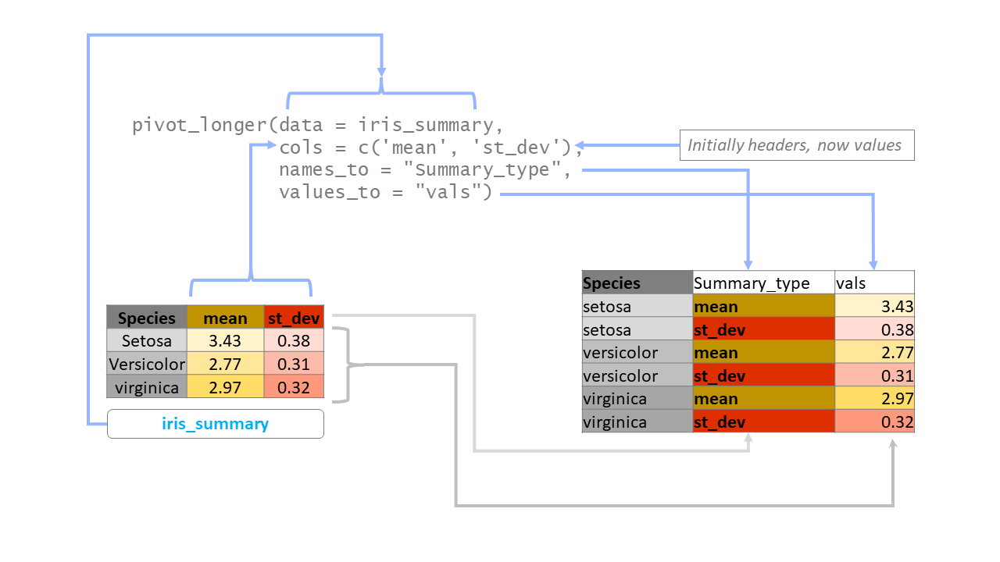
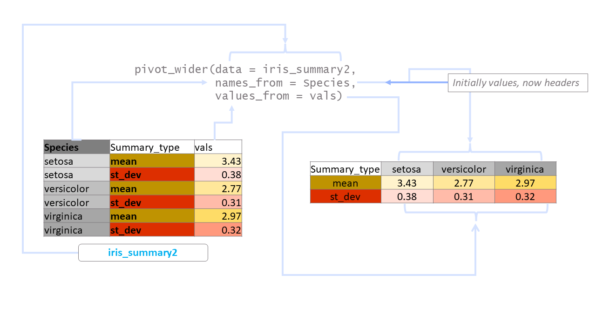

# Data Wrangling in `tidyr`

In this chapter we will learn about reshaping data to the format most suitable for our data analysis work.  To reshape the data, we will use `tidyr` package [@R-tidyr] which is part of core `tidyverse` and can be loaded either by calling `library(tidyr)` or `library(tidyverse)`. 

**Prerequisites**

```{r message=FALSE}
library(tidyverse)
```

## Concepts of tidy data

[Hadley Wickham](https://hadley.nz/), the chief scientist behind development of RStudio, tidyverse, and much more, introduced the concept of tidy data in a paper^[[https://www.jstatsoft.org/article/view/v059i10](https://www.jstatsoft.org/article/view/v059i10)] published in the Journal of Statistical Software [@JSSv059i10].  Tidy data is a framework to structure data sets so they can be easily analyzed and visualized. It can be thought of as a goal one should aim for when cleaning data. Once we understand what tidy data is, that knowledge will make our data analysis, visualization, and collection much easier. [@JSSv021i12] 

A tidy data-set has the following properties:

1. Each variable forms a column.
2. Each observation forms a row.
3. Each type of observational unit forms a table.

Diagrammatically^[Image taken from Hadley Wickham's book [R for data science](https://r4ds.had.co.nz/)] this can be represented as in figure \@ref(fig:tidy).

```{r tidy, echo=FALSE, fig.cap="Diagrammatic representation of tidy data", fig.show='hold', fig.align='center', out.width="99%"}
knitr::include_graphics("images/tidy-1.png")
```

Once a dataset is tidy, it can be used as input into a variety of other functions that may transform, model, or visualize the data.

Consider these five examples^[all taken from package `tidyr`].  All these examples^[These data-tables display the number of TB cases documented by the World Health Organization in Afghanistan, Brazil, and China between 1999 and 2000. The data contains values associated with four variables (country, year, cases, and population), but each table organizes the values in a different layout.] represent same data but shown in different formats-

```{r}
#Example-1
tidyr::table1
# Example-2
tidyr::table2
# Example-3
tidyr::table3
# Example-4 (Same data in 2 data tables now)
tidyr::table4a

tidyr::table4b
# Example-5
tidyr::table5
```
Let us discuss these example one by one -

- `table1` fulfills all three rules stated above and is thus, in tidy format.  Notice that every observation has its own row, and each variable is stored in a separate column.
- `table2` stores one observation in two columns (separately for cases and population) and is thus not tidy.
- `table3` stores two variables in one column (cases and population together) and is thus not tidy.
- `table4a` and `table4b` clearly stores one observation in two different tables and is thus not tidy.  We may further notice that both these tables use values as column headers, which also violate rule no.3 stated above.
- `table5` again stores one variable i.e. year in two separate columns, and thus does not follow rule no.2 stated above.

## Reshaping data

In real world problems we will mostly come across data-sets that are not in tidy formats and for data analysis, visualisation we will need `tidying` the datasets.  To do this we will first need to understand what actually is a value, a variable/field and an observation.  As a second step of _tidying_ we will require to reshape the data by either -

- re-organising the observation originally spread into multiple rows (e.g. `table2`), in one row; OR
- re-organising the variable spread into multiple columns (e.g. `table3`, etc.), in one single column.

To perform this _tidying_ exercise, we will need two most important functions from `tidyr` i.e. `pivot_longer` and `pivot_wider`.  So let us understand the functioning of these.

### LONGER format through function `pivot_longer()` 

Often we will come across data sets that will have values (instead of actual variable name) as column headers.  Let us take the example of `table4a` or `table4b` shown above.  Both these tables have values of variable `year` as column names.  So we need to re-structure these tables into a longer format where these values form part of columns instead of column names.  We will use `pivot_longer()` function for this.  Th basic syntax is-
```
pivot_longer(
  data,
  cols,
  names_to = "name",
  values_to = "value",
  ...
)
```
_Note that there many more useful arguments to this function, but first let us consider on these only._

- `cols` indicate names of columns (as a character vector) to be converted into longer format
- `names_to = "name"` argument will actually convert values used as column headers back to a column with  given "name"
- `values_to = "value"` argument will convert values of all those columns back into one column with given name "value" (e.g. population in table4b)

Basic functionality can be understood using the following example-
```{r}
iris_summary <- iris %>% 
  group_by(Species) %>% 
  summarise(mean = mean(Sepal.Width),
            st_dev = sd(Sepal.Width))
iris_summary
```

Using `pivot_wider` we can convert column headers into values.  Check the diagram in figure \@ref(fig:plong).

```{r plong, echo=FALSE, fig.cap="Diagrammatic representation of pivot\\_longer", fig.show='hold', fig.align='center', out.width="99%"}

```

Now we are ready to convert `table4a` into a tidier format.

#### Case-I when values are in column headers {-}

```{r}
pivot_longer(
  table4a, 
  cols = c('1999', '2000'), 
  names_to = 'year', 
  values_to = 'cases')
```
With _pipes_  and a little tweaking, the above syntax could have been written as-
```{r, eval=FALSE}
tidyr::table4a %>%                         # first argument passed through pipe 
  pivot_longer(cols = -country,     # all columns except country
               names_to = "year",
               values_to = "cases")
```

#### Case-II when both variables and variable names are combined together as column names {-}

We have seen a simple case to tidy the table when the values (e.g. years) were depicted as column names instead of variables i.e. actual data.  There may be cases when column names are a combination of both.  

Example - Say we have a table `table6` as
```{r, echo=FALSE}
(table6 <- left_join(table4a %>% set_names(c('country', 'cases_1999', 'cases_2000')),
          table4b %>% set_names(c('country', 'pop_1999', 'pop_2000')),
          by="country"))
```

We may use `names_sep` argument in this case, which will separate the combined variables from the column names -
```{r}
table6 %>% 
  pivot_longer(cols = !country,
               names_sep = "_",
               names_to = c("count_type", "year"),
               values_to = "count")
```

> Note that we have two column names in argument `names_to`.

Though the above table is still not in tidy format, yet the example was taken to show the functioning of other arguments of the `pivot_longer`.  We provided two static column names to the related argument and the variables were created after splitting the headers with sep `_`.  We actually require one dynamic value to be retained as column name (`cases` and `pop` here) but need to convert `year` to variables.

To do so we will use special value `".value"` in the related argument.  See

```{r}
table6 %>% 
  pivot_longer(cols = !country,
               names_sep = "_",
               names_to = c(".value", "year"),
               values_to = "count")
```
> Note that by using `.value` the argument `values_to` becomes meaning less.

### WIDER format through `pivot_wider()` 

As the name suggests, `pivot_wider()` does exactly opposite to what a `pivot_longer` does. Additionally, this function is used to create summary reports, as pivot functionality in MS Excel, through `values_fn` argument.  Diagrammatically this can be represented as in figure \@ref(fig:pwide). The basic syntax (with commonly used arguments) is-

```
pivot_wider(
  data,
  id_cols = NULL,
  names_from = name,
  values_from = value,
  values_fill = NULL,
  values_fn = NULL,
  ...
)
```
where-

- `id_cols` is a vector of columns that uniquely identifies each observation
- `names_from` is a vector of columns to get the name of the output column 
- `values_from` similarly provides columns to get the cell values from
- `values_fill` provides what each value should be filled in with when missing
- `values_fn` is a named list - to apply different aggregations to different `values_from` columns

> Also note that there are many other arguments for this function, which may be used to deal with complicated tables. 

```{r pwide, echo=FALSE, fig.cap="Diagrammatic representation of pivot\\_wider", fig.show='hold', fig.align='center', out.width="99%"}


```

Example-1:

```{r}
tidyr::table2 %>% 
  pivot_wider(names_from = "type",
              values_from = "count")
```

Example-2:
```{r}
tidyr::table2 %>% 
  pivot_wider(names_from = year,
              values_from = count)
```
Example-3: Summarisation
```{r}
tidyr::table2 %>% 
  pivot_wider(id_cols = country,
              names_from = type,
              values_from = count,
              values_fn = mean)
```

Example-4: Summarisation with different id_cols
```{r}
tidyr::table2 %>% 
  pivot_wider(id_cols = year,
              names_from = type,
              values_from = count,
              values_fn = sum)
```

Example-5: Use of multiple columns in `names_from` argument
```{r}
tidyr::table2 %>% 
  pivot_wider(names_from = c(year, type),
               values_from = count)
```

What if order is reversed in `names_from` arg.  See Example-6:
```{r}
tidyr::table2 %>% 
  pivot_wider(names_from = c(type, year),
               values_from = count)
```
Example-7: Multiple columns in `values_from`
```{r}
tidyr::table1 %>% 
  pivot_wider(names_from = year,
              values_from = c(cases, population))
```

Example-8: Use of names_vary argument to control the order of output columns
```{r}
tidyr::table1 %>% 
  pivot_wider(names_from = year,
              values_from = c(cases, population),
              names_vary = "slowest")
```

For more details please refer to [package vignette](https://tidyr.tidyverse.org/articles/pivot.html) or [Chapter-12 of R for Data Science book](https://r4ds.had.co.nz/tidy-data.html).

### Separate Column(s) into multiple columns/ Join columns into one column

#### Separate a character column into multiple with `separate()` {-}
As the name suggests, `separate()` function is used to separate a given character column into multiple columns either using a regular expression or a vector of character positions.
The syntax is -
```
separate(
  data,
  col,
  into,
  sep = "[^[:alnum:]]+",
  remove = TRUE,
  convert = FALSE,
  extra = "warn",
  fill = "warn",
  ...
)
```
Explanation of purpose of different arguments in above syntax -

1. `data` is as usual name of the data frame
2. `col` is the name of the column which is required to be separated.
3. `into` should be a character vector, which usually should be equal length of maximum number of new columns which will be created out of such separation. (Refer examples nos. 1)
4. `sep` provides a separator value. (Refer Example -3 below).
5. `remove` if `FALSE`, the original column is not removed from the output. (Refer Example -3 below).
6. `convert` if `TRUE`, the component columns are converted to double/integer/logical/NA, if possible. This is useful if the component columns are integer, numeric or logical. (Refer Example-1 below).
7. `extra` argument is used to control when number of desired component columns are less than the maximum possible count. (Refer Example-4 below).
8. `fill` argument is on the other hand, useful when the number of components are different for each row. (Refer Example-2 below)

Example-1:
```{r}
tidyr::table3 %>% 
  separate(rate, into = c("cases", "population"),
           convert = TRUE) # optional - will convert the values
```

Example-2:
```{r}
data.frame(
  x = c("a", "a+b", "c+d+e")
) %>% 
  separate(x,
           into=c('X1', 'X2', 'X3'),
           fill = "left")
```

Example-3:
```{r}
data.frame(
  x = c("A$B", "C+D", "E-F")
) %>% 
  separate(x, 
           sep = "\\-|\\$",
           into = c('X1', 'X2'),
           remove = FALSE)
```
Example-4:
```{r}
data.frame(
  x = c("a", "a+b", "c+d+e")
) %>% 
  separate(x,
           into=c('X1', 'X2'),
           extra = "merge")
```
#### Unite multiple character columns into one using `unite()` {-}
It complements `separate` by uniting the columns into one.  Its syntax is
```
unite(data, 
      col, 
      ..., 
      sep = "_", 
      remove = TRUE, 
      na.rm = FALSE)
```
Explanation of arguments in the above syntax-

1. `data` is as usual name of the data frame.
2. `col` should be the name of new column to be formed (should be a string),
3. `...` the names of columns to be united should be provided
4. `sep` is separator to be used for uniting
5. `remove` if `FALSE`, will not remove original component columns
6. `na.rm` if `TRUE`, the missing values will be removed beforehand.

Example-1a:
```{r}
tidyr::table5 %>% 
  unite("Year",
        c("century", "year"), 
        sep = "",
        remove = FALSE)
```
Example-1b:
We may complete the tidying process in the next step
```{r}
tidyr::table5 %>% 
  unite("Year",
        c("century", "year"), 
        sep = "") %>% 
  separate(rate, 
           into = c("cases", "population"),
           convert = TRUE)
```
Example-

### Separate row(s) into multiple rows

#### Split data into multiple rows with `separate_rows()` {-}
This function is used to separate delimited values placed in one single cell/column into multiple rows (as against in rows using `separate`).
See Example-
```{r}
tidyr::table3 %>% 
  separate_rows(
    rate,
    sep = "/",
    convert = TRUE
  )
```
To create `type` we have to however, add an extra step to the above example-
```{r}
tidyr::table3 %>% 
  separate_rows(
    rate,
    sep = "/",
    convert = TRUE
  ) %>% 
  group_by(country, year) %>% 
  mutate(type = c("cases", "pop"))
```

### Expand table to handle missing rows/values

Sometimes, when we deal with missing data, we require to handle implicit missing values as well.  Either we have to turn these values into explicit missing values or we have to fill appropriate values.  In such cases, two functions namely `complete` and `fill` both from same package are extremely useful.  Let's learn these as well.

#### Turn implicit missing values to explicit using `complete()` {-}
As th name suggests, this function is used to turn implicit missing values (invisible rows) to explicit missing values (visible rows with `NA`).  

As an example, let's suppose fuel prices are revised randomly.  Say, after revision on `1 January 2020` prices revise on `20 January 2020`.  So we will have only 2 rows in data for say `Janaury 2020`.  Thus, there are `r 31-2` implicit missing values in the data.

The syntax is

```
complete(data, 
         ..., 
         fill = list(), 
         explicit = TRUE)
```
Where -

- `data` is as usual argument to provide data frame
- `...` are meant to provide column names to be completed
- `fill` provides a list to supply a single value which can be provided instead of `NA` for missing combinations.

In the example mentioned above we can proceed as 
```{r}
# First create a sample data
df <- data.frame(
  date = c(as.Date("2020-01-01"), as.Date("2020-01-20")),
  price = c(75.12, 78.32)
)
df 

# Use tidyr::complete to see explicit missing values
df %>% 
  complete(date = seq.Date(as.Date("2020-01-01"), as.Date("2020-01-31"), by = "day"))
```
Though the above example created dates as per the criteria given, `complete` function can find all unique combinations in the set of columns provided and return complete set of observations. See this example
```{r}
#Let's create a sample data
set.seed(123)
df2 <- data.frame(
  year = c(2020, 2020, 2020, 2021, 2021),
  qtr = c(1,3,4,2,3),
  sales = runif(5, 100, 200)
)
df2
# use complete to find all combination
df2 %>% 
  complete(year, qtr, # cols provided
           fill = list(sales = 0))

```

**Note:** If `fill` argument would not have been used, the value of sales in missing columns would have been `NA` instead of provided value.

#### Fill missing values based on criteria `fill()` {-}
This function helps in filling the missing values using previous or next entry.  Think of a paper sheet where many cells in a table have been filled as `"-do-"`. Syntax is -
```{r eval=FALSE}
fill(data, # used to provide data
     ..., # provide columns to be filled
     .direction = c("down", "up", "downup", "updown"))
```
The arguments are pretty simple.  Most of the time `"down"` method is used. As an example we could see the example of fuel prices mentioned above.
```{r}
fill_df <- df %>% 
  complete(date = seq.Date(as.Date("2020-01-01"), as.Date("2020-01-31"), by = "day")) %>% 
  fill(price, .direction = "down")

head(fill_df)
tail(fill_df)
```

