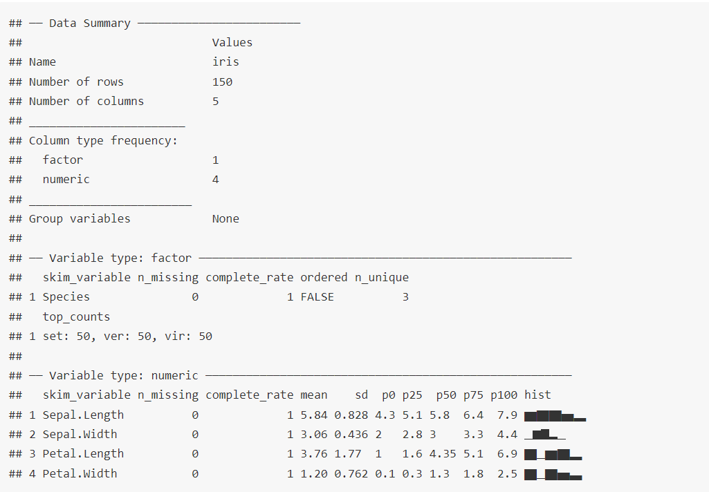

```{r}
#| include: false
source("_common.R")
```

# Generating Descriptive statistics {#sec-descriptive}

Exploratory Data Analysis, often abbreviated as EDA, is the first step of nearly every data analytics task. It means examining a dataset to summarise its main characteristics, often with charts. EDA shows what the data can reveal beyond formal models or hypothesis tests. It gives a better understanding of the variables and the relationships between them, and helps decide whether the techniques we plan to use are appropriate. EDA was developed by the American mathematician John Tukey in the 1960s and 1970s, and its techniques remain in wide use today.

For an auditor, EDA has one more purpose. Before trusting a dataset received from the auditee, we must know what is in it. How many records? Over what period? Are there missing values, negative amounts, duplicates, or dates outside the period? A few summary statistics answer these questions in minutes, and often produce the first audit observations. We will see a complete example at the end of this chapter, in @sec-desc-audit.

**Prerequisites**

```{r}
#| message: false
#| warning: false
library(tidyverse)
```

## Using base R

Base R provides two functions to see the structure and summary statistics of a data frame. The first is `str()`, short for **str**ucture (not to be confused with **str**ing), which shows the structure of the data. Its usage is simple.

```{r}
str(iris)
```

It gives us the number of variables (columns) and observations (rows) in the data. It then lists the names of all the columns, with their types, and the first few values of each. For `factor` columns, it also shows the levels.

Another function from base R is `summary()`, which gives summary statistics for each column of a data frame.

```{r}
summary(iris)
```

For each `numeric` column, it gives the *five-number summary*, that is, (1) minimum, (2) first quartile, (3) median, (4) third quartile and (5) maximum, along with the (arithmetic) mean. For `factor` columns, it gives the count of each value.

We can also recall here the function `table()`, which counts the values of factor or character columns in base R.

```{r}
with(iris, table(Species))
```

## Dplyr functions

To calculate other statistics, we can use `dplyr::summarise()` together with `across()`. For example, to calculate the mean, standard deviation and variance of all numeric columns of the `iris` data, we can do

```{r}
iris |>
  summarise(across(where(is.numeric),
                   .fns = list(
                     Mean = ~ mean(.),
                     SD = ~ sd(.),
                     Var = ~ var(.)
                   )))
```

Before reading the output, let us understand `across()`. It is used inside dplyr verbs, mostly `mutate()` and `summarise()`, to apply the same operation to many columns at once. It needs at least two arguments. The first selects the columns, by names, by type with a function like `where(is.numeric)`, or by a pattern in the names. The second gives a function, or a list of functions, to apply. In the example above, we selected all numeric columns, and applied a list of three functions written in the short lambda style. With 4 numeric columns and 3 functions, we get 12 columns in the output. We learnt `across()` in detail in @sec-across.

Twelve columns in one row are hard to read. We can reshape the result with `tidyr::pivot_longer()`.

```{r}
iris |>
  summarise(across(where(is.numeric),
                   .fns = list(
                     Mean = ~ mean(.),
                     SD = ~ sd(.),
                     Var = ~ var(.)
                   ))) |>
  pivot_longer(everything(),
               names_sep = "_",
               names_to = c(".value", "Function"))
```

```{r}
iris |>
  summarise(across(where(is.numeric),
                   .fns = list(
                     Mean = ~ mean(.),
                     SD = ~ sd(.),
                     Var = ~ var(.)
                   ))) |>
  pivot_longer(everything(),
               names_sep = "_",
               names_to = c("Variable", ".value"))
```

The special name `.value` in `names_to` tells `pivot_longer()` which part of the old column names should become new column names. In the first output it is the variable, in the second the statistic.

Let us also see one more summary function of `dplyr`, `glimpse()`. It is like `str()`, but fits the screen better and works well in a pipe.

```{r}
iris |>
  glimpse()
```

To count the values of a factor column, as `table()` does in base R, we can use `dplyr::count()`, which works well in a pipe.

```{r}
iris |>
  count(Species)
```

We can also count combinations of several columns.

```{r}
ggplot2::diamonds |>
  count(cut, color, name = "count")
```

## Using `psych`

Some packages produce good summaries without much effort. The package `psych` is one of these.

```{r}
#| message: false
#| warning: false
library(psych)
describe(USArrests)
```

The output is a data frame, ready to use. Besides the mean and standard deviation, it gives the median, the *trimmed* mean (the mean after dropping the extreme 10% at each end), the *mad* (median absolute deviation, a measure of spread not affected by outliers), the *skew* and the *kurtosis*. Skew is especially useful in audit. Amounts in accounts are nearly always strongly skewed to the right, with many small amounts and a few very large ones.

Another function in `psych`, `describeBy()`, gives summaries for each group.

```{r}
describeBy(ggplot2::diamonds, group = "cut")
```

One more function, `describeData()`, also shows the first and last four values (by default) of each column.

```{r}
describeData(ggplot2::diamonds)
```

## Using `skimr`

The package `skimr` produces a compact summary report of a data frame, with a small histogram for each numeric column. A full description may be seen [here](https://cran.r-project.org/web/packages/skimr/vignettes/using_skimr.html). For basic use, the function `skim()` is enough.

```
library(skimr)
skim(iris)
```

```{r skimrr, fig.show='hold', out.width='50%', echo=FALSE}

```

`skim()` also reports the number of missing values and the *complete rate* of each column, which is the first thing to check in audit data.

## Viewing relationships between different variables

The package `PerformanceAnalytics` can show the relationships between all pairs of numeric variables at once, with its function `chart.Correlation()`.

```{r warning=FALSE, fig.show='hold', fig.align='center', fig.cap="Viewing relationships with PerformanceAnalytics"}
suppressMessages(library(PerformanceAnalytics))

USArrests |>
  select(where(is.numeric)) |>
  PerformanceAnalytics::chart.Correlation()
```

It draws a correlation matrix of the numeric variables. The diagonal shows the distribution of each variable, the lower part shows the scatter plot of each pair, and the upper part shows the correlation, with stars for its significance.

The package `GGally` also draws good charts of relationships. Two of its functions are particularly useful.

1. `ggpairs()` draws a scatterplot matrix. Scatter plots of each pair of numeric variables are drawn in the lower part, the Pearson correlation is shown in the upper part, and the distribution of each variable on the diagonal.

2. `ggcorr()` shows the correlation of each pair of variables as a coloured square. The `method` argument chooses the type of correlation.

See the following example.

```{r fig-two-corr, fig.show='hold', out.width="50%", warning=FALSE, fig.cap="Correlation plot (Left) and Scatterplot Matrix (Right) produced in GGally", fig.align='center'}
suppressMessages(library(GGally))
USArrests |>
  select(where(is.numeric)) |>
  ggcorr(label = TRUE)

USArrests |>
  select(where(is.numeric)) |>
  ggpairs()

```

## Audit use case, profiling a payment ledger {#sec-desc-audit}

Let us apply these tools to a dataset an auditor actually receives. An office has given us its payment ledger for the financial year 2024-25. Before any analysis, we profile it. We have planted the kind of problems that real ledgers often have.

```{r}
#| code-fold: true
#| code-summary: "Code to create the payment ledger"
set.seed(124)
n <- 2500
vendors <- sprintf("V%03d", 1:60)
ledger <- tibble(
  voucher_no = sprintf("PV/24-25/%04d", 1:n),
  date       = as.Date("2024-04-01") + sample(0:364, n, TRUE),
  vendor_id  = sample(vendors, n, TRUE, prob = c(rep(8, 3), rep(1, 57))),
  head       = sample(c("Office expenses", "Repairs", "Supplies", "Professional fees"),
                      n, TRUE, prob = c(4, 2, 3, 1)),
  amount     = round(rlnorm(n, log(25000), 1.1))
)

# Planted problems, each in different rows
rows <- sample(2:n, 36)
neg <- rows[1:6]; zero <- rows[7:15]; novendor <- rows[16:27]
baddate <- rows[28:31]; dup <- rows[32:36]

ledger$amount[neg]        <- -ledger$amount[neg]                    # negative amounts
ledger$amount[zero]       <- 0                                      # zero amounts
ledger$vendor_id[novendor] <- NA                                    # vendor missing
ledger$date[baddate] <- as.Date(c("2023-11-15", "2025-04-12",
                                  "2025-05-02", "2024-03-30"))      # outside the year
ledger$voucher_no[dup] <- ledger$voucher_no[dup - 1]                # repeated voucher numbers
```

**Step 1. Size, period and types.** `glimpse()` shows the columns and their types. A date stored as text, or an amount stored as text because of a stray comma, would show up here at once.

```{r}
glimpse(ledger)
```

**Step 2. Summary of amounts.**

```{r}
summary(ledger$amount)
```

Three things stand out. The minimum is negative, which a payment should not be. The mean is much larger than the median, so the amounts are strongly skewed, as usual in accounts. For such data, the median and quartiles describe a "typical" payment better than the mean. And the maximum is far above the third quartile, so a few payments are very large.

**Step 3. Problem records.** Let us count the records with each kind of problem.

```{r}
fy_start <- as.Date("2024-04-01"); fy_end <- as.Date("2025-03-31")

ledger |>
  summarise(records            = n(),
            negative_amount    = sum(amount < 0),
            zero_amount        = sum(amount == 0),
            vendor_missing     = sum(is.na(vendor_id)),
            date_outside_year  = sum(date < fy_start | date > fy_end),
            repeated_voucher   = sum(duplicated(voucher_no))) |>
  pivot_longer(everything(), names_to = "check", values_to = "count")
```

Each count is a question for the auditee. Negative payments may be reversals recorded wrongly. Zero amounts may be cancelled vouchers. Missing vendors make the payment untraceable. Dates outside the year suggest entries of another year, or wrong dates. And repeated voucher numbers break the basic rule that each voucher is unique. We examine duplicates in detail in @sec-dup.

**Step 4. Concentration.** How much of the money goes to how few vendors?

```{r}
vendor_share <- ledger |>
  filter(amount > 0, !is.na(vendor_id)) |>
  summarise(paid = sum(amount), payments = n(), .by = vendor_id) |>
  arrange(desc(paid)) |>
  mutate(share_pct     = round(100 * paid / sum(paid), 1),
         cumulative_pct = cumsum(share_pct))

head(vendor_share, 5)
```

```{r}
#| include: false
top3 <- sum(vendor_share$share_pct[1:3])
```

Three of the 60 vendors received `r round(top3)`% of all the money. Concentration is not wrong in itself, but these vendors deserve a look at how they were selected, and whether their contracts were tendered.

**Step 5. Month-wise pattern.**

```{r}
ledger |>
  filter(between(date, fy_start, fy_end)) |>
  mutate(month = format(date, "%Y-%m")) |>
  summarise(payments = n(), amount_lakh = round(sum(amount) / 1e5, 1), .by = month) |>
  arrange(month)
```

A month with unusually many payments or a very large total, like a rush in March, would show up here. We study such patterns in @sec-ts and @sec-ano-ts.

::: callout-tip
## Audit tip

Always reconcile the total of the data received with the accounts, *before* any analysis. If the ledger total does not match the expenditure in the accounts, the data is incomplete or extra, and every result based on it is doubtful. Record the profile, with record counts, totals and the problem records, in the working papers. It is the evidence of what data was received and tested.
:::

## A suggested workflow

1.  **Look at the structure** with `glimpse()` or `str()`. Check the number of rows and the type of each column.
2.  **Reconcile the totals** with the accounts or another trusted source.
3.  **Summarise every numeric column** with `summary()` or `describe()`. Look at the minimum, maximum and skew.
4.  **Count the problem records**, like missing, negative, zero, out-of-period and duplicate values.
5.  **Count categories** with `count()`, and look at the concentration of amounts.
6.  **Look at patterns over time**, by month or week.
7.  **Record the profile** in the working papers before going further.

::: callout-important
## Remember

Descriptive statistics describe the data, not the truth. A clean summary does not prove that the data is complete or correct. That needs reconciliation with independent sources. But an unclean summary is nearly always a sign that something needs explanation.
:::

## Summary of functions used

| Function | Package | What it does |
|-----------------------|----------------|--------------------------------|
| `str()`, `glimpse()` | base R, dplyr | Structure of a data frame |
| `summary()` | base R | Five-number summary and mean, counts for factors |
| `table()`, `count()` | base R, dplyr | Counts of values |
| `summarise()` with `across()` | dplyr | Several statistics for several columns |
| `pivot_longer()` | tidyr | Reshape a wide summary into a long one |
| `describe()`, `describeBy()`, `describeData()` | psych | Detailed summaries, including skew, overall or by group |
| `skim()` | skimr | Compact summary report with missing values |
| `chart.Correlation()` | PerformanceAnalytics | Correlation matrix chart |
| `ggpairs()`, `ggcorr()` | GGally | Scatterplot matrix and correlation chart |
| `duplicated()`, `between()` | base R, dplyr | Find repeated values and values outside a range |

: Functions used in this chapter {#tbl-descfunctions}
