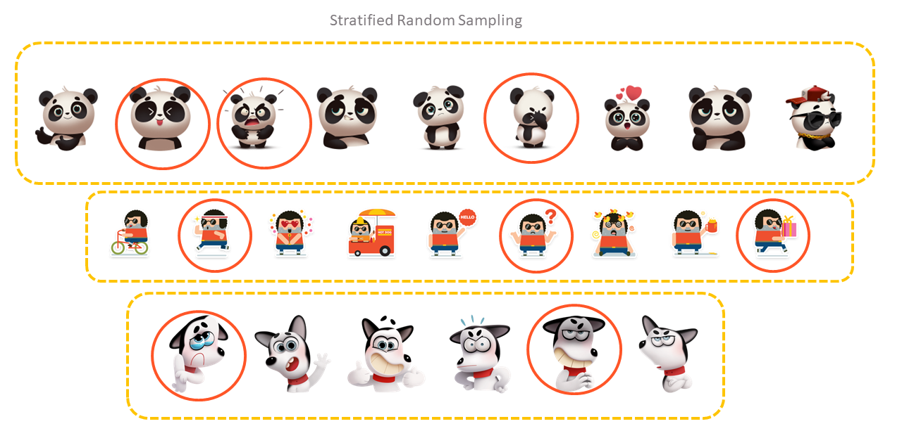

```{r}
#| include: false
source("_common.R")
```

# Random Sampling {#sec-sampling}

International Standard on Auditing (ISA) 530^[[https://www.ifac.org/system/files/publications/files/A028%202012%20IAASB%20Handbook%20ISA%20530.pdf](https://www.ifac.org/system/files/publications/files/A028%202012%20IAASB%20Handbook%20ISA%20530.pdf)] defines audit sampling as _the application of audit procedures to less than 100% of items within a population of audit relevance such that all sampling units have a chance of selection in order to provide the auditor with a reasonable basis on which to draw conclusions about the entire population._ It further defines statistical sampling as _an approach to sampling that has the following characteristics: (a) random selection of the sample items; and (b) the use of probability theory to evaluate sample results, including measurement of sampling risk._

Appendix 4 of ISA 530 describes the different methods of selecting a sample. In this chapter, we will see how each of them can be carried out in R, reproducibly. Then we will see how to work out sample sizes, and how to evaluate the results of a monetary unit sample, using the probability functions of @sec-probability.

Why use R for sampling, when audit software and spreadsheets can also draw samples? Because a sample drawn in R is fully documented by its code. Anyone can run the same code, with the same *seed*, and get exactly the same sample. That is the best evidence that the selection was random and was not manipulated.

**Prerequisites**

```{r}
#| message: false
#| warning: false
library(tidyverse)
```

## Simple Random Sampling (With and without replacement)

In this method, records are selected completely at random, as if by random number tables. Refer to @fig-simple for an illustration. The two functions behind it are `sample()` and `set.seed()`, which we met in @sec-prob. `sample()` works on vectors, so for data frames we use `dplyr::slice_sample()`, which we met in @sec-slice_func.

```{r fig-simple, echo=FALSE, fig.cap="Illustration of Simple Random Sampling", fig.align='center', fig.show='hold', out.width="99%"}

```

Let us draw a sample of `n = 12` records from the `iris` data, without replacement.

```
dat <- iris # input data
# set the seed
set.seed(123)
# sample n records
dat |>
  slice_sample(n = 12, replace = FALSE)
```

```{r echo=FALSE}
dat <- iris
set.seed(123)
knitr::kable(
  slice_sample(dat, n=12, replace = FALSE)
)
```

The syntax is simple. First we fix the random number seed, so that the same sample can be drawn again. Then `slice_sample()` selects `n = 12` records without replacement (`replace = FALSE`).

::: callout-note
If the sample size is a proportion, we use the argument `prop`, like `prop = 0.10` for 10%, instead of `n`. If sampling is with replacement, we use `replace = TRUE`.
:::

## Systematic random sampling {#sec-srs}

ISA 530 describes this approach as _'Systematic selection, in which the number of sampling units in the population is divided by the sample size to give a sampling interval, for example 50, and having determined a starting point within the first 50, each 50th sampling unit thereafter is selected. Although the starting point may be determined haphazardly, the sample is more likely to be truly random if it is determined by use of a computerized random number generator or random number tables. When using systematic selection, the auditor would need to determine that sampling units within the population are not structured in such a way that the sampling interval corresponds with a particular pattern in the population.'_ Refer to @fig-systematic for an illustration.

```{r fig-systematic, echo=FALSE, fig.cap="Illustration of Systematic Random Sampling", fig.align='center', fig.show='hold', out.width="99%"}

```

The selection runs through the population *in its existing order*, for example in the order of voucher numbers. That is the point of the method. It spreads the sample evenly over the whole population, for example over the whole year. We carry it out in two steps.

__Step-1:__ Choose the sample size `n`. Divide the number of rows by `n` to get the sampling interval `s`. Choose a random starting point `s1` between 1 and `s`.

__Step-2:__ Select the rows `s1`, `s1 + s`, `s1 + 2s`, and so on, until we have `n` rows. `slice()` selects rows by their position.

```
set.seed(123)
n <- 15 # sample size
s <- floor(nrow(dat) / n)          # sampling interval
s1 <- sample(1:s, 1)               # random start
rand_seq <- seq(s1, by = s, length.out = n)
dat |>
  slice(rand_seq)
```

```{r echo=FALSE}
set.seed(123)
n <- 15 # sample size
s <- floor(nrow(dat)/n)
s1 <- sample(1:s, 1)
rand_seq <- seq(s1, by = s, length.out = n)
knitr::kable(
  dat |>
    mutate(row = row_number(), .before = 1) |>
    slice(rand_seq)
)
```

```{r}
#| include: false
sys_s <- s; sys_s1 <- s1
```

The interval here is `r sys_s` and the random start is `r sys_s1`, so rows `r sys_s1`, `r sys_s1 + sys_s`, `r sys_s1 + 2 * sys_s` and so on were selected. Notice that the sample contains flowers of all three species, in equal numbers, because the data is arranged species-wise and the selection is spread evenly through it.

::: callout-warning
## Caution

Do not shuffle the data before systematic selection. Shuffling destroys the order, and turns the method into simple random sampling. Also check, as ISA 530 says, that the population has no pattern which matches the interval. For example, if a payroll lists employees in groups of 10, with the supervisor always tenth, an interval of 10 would select either all supervisors or none.
:::

## Probability Proportionate to Size (PPS) selection

In this method, larger items have a larger chance of selection, in proportion to their size, usually their monetary value. ISA 530 calls the best known form of it *monetary unit sampling*, _"a type of value-weighted selection in which sample size, selection and evaluation results in a conclusion in monetary amounts."_

`slice_sample()` can select records with probability in proportion to a column, through its argument `weight_by`. Let us use the `state.x77` data that comes with base R, and select 12 States with probability proportional to their population. Since the data is a matrix, we first convert it into a data frame.

```{r}
dat <- as.data.frame(state.x77)
```

```
set.seed(123)
dat |>
  slice_sample(n = 12, weight_by = Population)
```

```{r echo=FALSE}
set.seed(123)
knitr::kable(
  dat |>
    slice_sample(n = 12, weight_by = Population)
)
```

This is a quick way to give larger items a larger chance. But it is not exactly monetary unit sampling. For that, we need a systematic selection of *rupees*, which also allows the results to be evaluated statistically. We will see it in @sec-mus.

## Stratified random sampling {#sec-stratified}

ISA 530 defines stratification as _the process of dividing a population into sub-populations, each of which is a group of sampling units which have similar characteristics (often monetary value)._ So stratified random sampling means applying any of the above methods to each stratum separately, instead of to the whole population. Refer to @fig-strata for an illustration.

```{r fig-strata, echo=FALSE, fig.cap="Illustration of Stratified Random Sampling", fig.align='center', fig.show='hold', out.width="99%"}

```

We use `group_by()` to form the strata, and then sample within each group as above.

Example Data. Let us add the region of each State to the `state.x77` data, using `bind_cols()`.

```{r}
dat <- bind_cols(
  as.data.frame(state.x77),
  as.data.frame(state.region)
)
```

Let us see the first 6 rows of this data.

```{r echo=FALSE}
knitr::kable(
  dat |> head()
)
```

And the number of States in each region.

```{r}
dat |>
  count(state.region, name = "states")
```

__Case-1:__ When the sample size is the same for all strata, say `2` States per region.

```
set.seed(123)
dat |>
  rownames_to_column('State') |>    # State names are stored as row names
  slice_sample(n = 2, by = state.region)
```

```{r echo=FALSE}
set.seed(123)
knitr::kable(
  dat |>
    rownames_to_column('State') |>
    slice_sample(n = 2, by = state.region)
)
```

The argument `by` of `slice_sample()` samples within each group, without the need for `group_by()` and `ungroup()`.

__Case-2:__ When the sample size or proportion differs among strata. This time, let us assume that the stratum is not directly available in the data. Say we want to sample

- 20% of States having population up to `1000` (thousand),
- 30% of States having population greater than `1000` but up to `5000`, and
- 50% of States having population more than `5000`.

Our strategy is to create the stratum with `cut()`, split the data into one data frame per stratum with `group_split()`, sample each with its own proportion using `purrr::map2()`, and bind the samples back into one data frame with `list_rbind()`. We learnt `map2()` in @sec-purrr.

```{r}
# define proportions, in the order of the strata
props <- c(Low = 0.2, Mid = 0.3, High = 0.5)

set.seed(123)
strat_sample <- dat |>
  rownames_to_column('State') |>
  # create the strata
  mutate(stratum = cut(Population, c(0, 1000, 5000, max(Population)),
                       labels = c("Low", "Mid", "High"))) |>
  # one data frame per stratum
  group_split(stratum) |>
  # sample each with its own proportion, and bind the results
  map2(props, \(d, p) slice_sample(d, prop = p)) |>
  list_rbind()
```

Let us check how many States were selected from each stratum.

```{r}
dat |>
  mutate(stratum = cut(Population, c(0, 1000, 5000, max(Population)),
                       labels = c("Low", "Mid", "High"))) |>
  count(stratum, name = "total") |>
  left_join(count(strat_sample, stratum, name = "selected"), by = "stratum")
```

## Cluster sampling

ISA 530 does not define cluster sampling separately. Here, instead of individual records, we select whole *groups* of records, called clusters, and examine every record in the selected clusters. For example, we may select a few districts, or a few months, and examine all vouchers in them. In our data, let us select 2 regions.

Our strategy is to first sample from the unique values of the cluster column, and then keep all records of those clusters.

```{r}
# set the seed
set.seed(123)
# sample clusters
clusters <- sample(
  unique(dat$state.region),
  size = 2
)
# filter all records in above clusters
clust_samp <- dat |>
  filter(state.region %in% clusters)
# check number of records
clust_samp |> count(state.region)
```

## How many items to test? Sample size for tests of controls {#sec-samplesize}

So far we took the sample size as given. In audit, the size depends on how confident we want to be, and how much error we can tolerate. Let us start with tests of controls, where each item either complies with the control or deviates from it.

Suppose we want to be 95% confident that the true rate of deviation is below a **tolerable rate** of 5%, and we expect to find no deviations. In @sec-prob-audit, we saw that the reliability factor for zero errors at 95% confidence is about 3.00. The sample size is simply

$$
n = \frac{\text{reliability factor}}{\text{tolerable rate}}
$$ {#eq-attrsize}

```{r}
reliability_factor <- qgamma(0.95, 1)     # zero expected deviations, 95% confidence
tolerable_rate <- 0.05
ceiling(reliability_factor / tolerable_rate)
```

The exact binomial calculation gives nearly the same answer. It is the smallest sample in which the chance of finding no deviation, if the true rate were 5%, is 5% or less.

```{r}
min(which(pbinom(0, size = 1:500, prob = tolerable_rate) <= 0.05))
```

The table below shows how the sample size changes with the tolerable rate and the confidence level.

```{r}
expand_grid(confidence = c(0.90, 0.95), tolerable_rate = c(0.02, 0.05, 0.10)) |>
  mutate(sample_size = ceiling(qgamma(confidence, 1) / tolerable_rate)) |>
  pivot_wider(names_from = confidence, values_from = sample_size,
              names_prefix = "confidence_")
```

A lower tolerable rate, or a higher confidence, needs a bigger sample. If deviations *are* expected, the reliability factor for that number of deviations is used instead, which gives a bigger sample still.

## Monetary unit sampling, a complete example {#sec-mus}

Monetary unit sampling (MUS) is the most widely used statistical method for testing the amounts in accounts. Its idea is simple. Instead of thinking of the population as a list of vouchers, we think of it as a list of *rupees*. We select rupees at random, systematically, and examine the voucher containing each selected rupee. So a voucher of ₹10 lakh is a hundred times more likely to be selected than one of ₹10,000, which is what an auditor wants, since overstatement hides in large amounts.

### Our population

Let us create the payment vouchers of an imaginary office for a year. There are 4,000 vouchers, mostly small, with a few very large ones. For each voucher we also keep the *audited* amount, the correct amount which the auditor would find on examining it. We have planted misstatements in 240 vouchers, where the amount paid is more than the correct amount. In real audit, of course, we do not know the audited amounts until we examine the sample.

```{r}
#| code-fold: true
#| code-summary: "Code to create the payment population"
set.seed(530)
n_pop <- 4000
payments <- tibble(voucher_no = sprintf("PV-%05d", 1:n_pop),
                   amount     = round(rlnorm(n_pop, log(40000), 1.2)))
# A few very large payments
payments$amount[sample(1:n_pop, 6)] <- round(runif(6, 3e6, 8e6))

# Planted misstatements. The audited (correct) amount is less than the amount paid
payments <- payments |> mutate(audited = amount)
mis <- sample(1:n_pop, 240)
payments$audited[mis] <- round(payments$amount[mis] * (1 - runif(240, 0.2, 1)))
head(payments)
```

```{r}
book_value <- sum(payments$amount)
book_value / 1e7          # in crore
```

### Step 1, sample size

The auditor decides the **tolerable misstatement**, the largest total misstatement which would not change the opinion. Let us take it as 2% of the book value. With 95% confidence and no misstatement expected, the sample size is

$$
n = \frac{\text{book value} \times \text{reliability factor}}{\text{tolerable misstatement}}
$$ {#eq-mussize}

```{r}
tolerable <- 0.02 * book_value
rf <- qgamma(0.95, 1)                       # 3.00 for zero expected errors

n_mus <- ceiling(book_value * rf / tolerable)
interval <- book_value / n_mus              # the sampling interval in rupees

n_mus
round(interval)
```

So we will select every `r format(round(interval), big.mark = ",")`th rupee, from a random start.

### Step 2, selection

We line up the vouchers one after another, and keep a running total of their amounts with `cumsum()`. Each selected rupee falls within one voucher. `findInterval()` tells us which.

```{r}
set.seed(2025)
start <- runif(1, 0, interval)                     # random start
selected_rupees <- start + interval * (0:(n_mus - 1))

voucher_row <- findInterval(selected_rupees, c(0, cumsum(payments$amount)),
                            left.open = TRUE)

mus_sample <- payments |>
  slice(unique(voucher_row)) |>
  mutate(top_value = amount >= interval)

nrow(mus_sample)
sum(mus_sample$top_value)
```

```{r}
#| include: false
n_sel <- nrow(mus_sample); n_top <- sum(mus_sample$top_value)
```

We get `r n_sel` vouchers, a few less than `r n_mus`. A voucher larger than the interval contains more than one selected rupee, but is examined only once. Every voucher larger than the interval is *certain* to be selected. There are `r n_top` such **top value** items here. Many auditors examine all such items separately, outside the sample.

### Step 3, evaluation

Now we examine the selected vouchers. In our simulation, this means comparing `amount` with `audited`. For each misstatement, the **tainting** is the misstatement as a share of the amount. A voucher of ₹1 lakh which should have been ₹60,000 has a tainting of 0.4.

```{r}
errors <- mus_sample |>
  filter(audited != amount) |>
  mutate(misstatement = amount - audited,
         tainting     = misstatement / amount)

errors |> select(voucher_no, amount, audited, misstatement, tainting, top_value)
```

Each error in an ordinary item represents its whole sampling interval. So its **projected misstatement** is its tainting times the interval. Errors in top value items are not projected. They are counted at their actual amount, since all such items were examined. The **upper misstatement limit** adds an allowance for sampling risk. It starts with the *basic precision*, the reliability factor for zero errors times the interval, and adds each tainting, largest first, weighted by the increase in the reliability factor. This is the standard method of evaluating a monetary unit sample.

```{r}
ordinary <- errors |> filter(!top_value) |> arrange(desc(tainting))
k <- nrow(ordinary)
factors <- qgamma(0.95, 0:k + 1)                  # reliability factors for 0, 1, ... k errors

top_misstatement <- sum(errors$misstatement[errors$top_value])

projected <- interval * sum(ordinary$tainting) + top_misstatement
upper_limit <- interval * (factors[1] + sum(ordinary$tainting * diff(factors))) +
  top_misstatement

tibble(measure = c("Projected misstatement", "Upper misstatement limit",
                   "Tolerable misstatement"),
       crore   = round(c(projected, upper_limit, tolerable) / 1e7, 2))
```

```{r}
#| include: false
true_mis <- sum(payments$amount - payments$audited)
```

The upper misstatement limit is far above the tolerable misstatement. So, at 95% confidence, the auditor cannot conclude that the payments are free from material misstatement. More work is needed, or the misstatement must be reported. Since this population is simulated, we can also see the truth. The actual total misstatement is ₹`r round(true_mis / 1e7, 2)` crore, close to the projection of ₹`r round(projected / 1e7, 2)` crore, and below the upper limit, as it should be 95 times out of 100.

::: callout-note
## If no errors are found

With no errors, the projected misstatement is zero, and the upper limit is just the basic precision, $3.00 \times$ interval. By the way we chose the sample size, this equals the tolerable misstatement. So a sample without errors supports exactly the conclusion we planned for.
:::

::: callout-tip
## Audit tip

Record the seed, the random start, the interval, and the R code in the working papers. Anyone can then reproduce the selection exactly. Also note that `sample()` in R changed its method in R version 3.6.0. Samples drawn with the same seed in older versions will differ. Mention the R version used, which `R.version.string` gives.
:::

## A suggested workflow

1.  **Define the population** and check it is complete, by reconciling its total with the accounts.
2.  **Decide the method.** Attribute sampling for controls, monetary unit sampling for amounts, stratification when the population has very different kinds of items.
3.  **Decide the confidence level and tolerable rate or misstatement**, and compute the sample size with the reliability factor.
4.  **Set the seed and select the sample** with code, and save the selected list.
5.  **Examine the selected items** and record the errors.
6.  **Evaluate.** Project the errors to the population, and compare the upper limit with what is tolerable.
7.  **Document** the seed, the code and the R version, so that the sample can be reproduced.

::: callout-important
## Remember

A sample gives a conclusion about the population only if it was selected randomly *and* evaluated statistically. A sample which is chosen haphazardly, or whose errors are only listed and not projected, supports conclusions about those items alone.
:::

## Summary of functions used

| Function | Package | What it does |
|-----------------------|----------------|--------------------------------|
| `set.seed()`, `sample()` | base R | Reproducible random selection from a vector |
| `slice_sample(n, prop, weight_by, replace, by)` | dplyr | Random sample of rows, optionally weighted or within groups |
| `slice()` | dplyr | Rows at given positions, for systematic selection |
| `cut()`, `group_split()` | base R, dplyr | Form strata, and split the data by stratum |
| `map2()`, `list_rbind()` | purrr | Sample each stratum with its own proportion, and bind the samples |
| `qgamma()`, `pbinom()` | base R (stats) | Reliability factors and exact binomial checks for sample sizes |
| `cumsum()`, `findInterval()` | base R | Locate the vouchers containing the selected rupees, in monetary unit sampling |

: Functions used in this chapter {#tbl-samplingfunctions}
