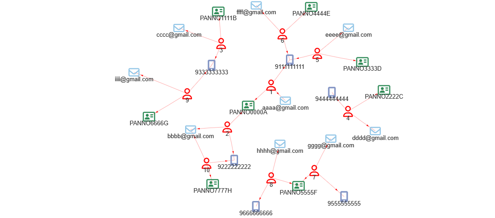

```{r}
#| include: false
source("_common.R")
```

# Applying network analysis in audit/fraud detection
## Use case-1: Finding network of related entities/persons - Identity Theft {#sec-dup_net}
**The Following Content is Under Development.**

Imagine a scenario when users may have multiple IDs such as mobile numbers, email ids, and say some other ID issued by a Government Department say Income Tax Department (e.g. PAN number in Indian Scenario).  Using techniques mentioned in @sec-dup, we may easily find out duplicate users, i.e. duplicates on the basis of one ID.  Sometimes need arise where we have to find out network of all the duplicate users where they have changed one or two IDs but retained another. E.g. There may be a social sector scheme where any beneficiary is expected to be registered only once for getting that scheme benefits.  Scheme audit(s) may require auditors to check duplicate beneficiaries using multiple IDs.

Understand this with the @tbl-gra101.
```{r tbl-gra101, echo=FALSE, fig.show='hold', message=FALSE, warning=FALSE, fig.align='center'}
library(tidyverse)
library(kableExtra)
PANs <- paste0(
  "PANNO", c("0000", "0000", "1111", "2222", "3333", "4444", "5555", "5555", "6666", "7777"),
  c("A", "A", "B", "C", "D", "E", "F", "F", "G", "H")
)

emails <- paste0(c("aaaa", "bbbb", "cccc", "dddd", "eeee", "ffff", "gggg", "hhhh", "iiii", "bbbb"), "@gmail.com")


tele <- paste0("9", c("1", "2", "3", "4", "1", "1", "5", "6", "3", "2") %>%
  map_chr(~ rep(.x, 9) %>%
    paste0(collapse = "")))

dummy_data <- data.frame(
  ID = 1:10,
  Mobile = tele,
  Email = emails,
  PAN = PANs
)

kable(dummy_data, caption = "Dummy Data")
```

It may be seen that out of ten persons, two with IDs 6 and 10 respectively share none of IDs out of Email, PAN and Telephone number. But if we see closely, ID-6 shares mobile number with ID-1 who in turn share PAN number with ID-2.  ID-2 further shares both Email and Mobile number with ID-6 thus establishing a relation and a network between ID-6 and ID-10.  This is clear in @fig-igraph11. _Note that we are not considering names while finding out duplicates._

```{r fig-igraph11, fig.show='hold', fig.align='center', fig.cap="Network diagram of connected entities", out.width="75%"}


```

We may find these duplicates using a branch of mathematics called _Graph Theory_.^[[https://en.wikipedia.org/wiki/Graph_theory](https://en.wikipedia.org/wiki/Graph_theory)] We won't be discussing any core concepts of graph theory here.  There are a few packages to work with graph theory concepts in R, and we will be using `igraph` [@R-igraph] for our analysis here. Let's load the library.

```{r message=FALSE, warning=FALSE}
library(igraph)

```

```{r}
dat <- data.frame(
  MainID = 1:9,
  Name = c("A", "B", "C", "B", "E", "A", "F", "G", "H"),
  ID1 = c(11,12,13,13,14,15,16,17,17),
  ID2 = c("1a", "1b","1b", "2a", "2b", "2c", "2c", "2e", "3a"),
  ID3 = c("AB", "AB", "BC", "CD", "EF", "GH", "HI", "HI", "JK")
)
# A preview of our sample data
dat
```

Now the complete algorithm is as under-
```{r}
id_cols <- c("ID1", "ID2", "ID3")
dat %>% 
  mutate(across(.cols = all_of(id_cols), as.character)) %>% 
  pivot_longer(cols = all_of(id_cols), 
               values_drop_na = TRUE) %>% 
  select(MainID, value) %>% 
  graph_from_data_frame() %>%
  components() %>%
  pluck(membership) %>%
  stack() %>%
  set_names(c('UNIQUE_ID', 'MainID')) %>%
  right_join(dat %>% 
               mutate(MainID = as.factor(MainID)), 
             by = c('MainID'))
```

We may see that we have got unique ID of users based on all three IDs. Let us understand the algorithm used step by step.

__Step-1__: First we have to ensure that all the ID columns (Store names of these columns in one vector say `id_cols`) must be of same type.  Since we had a mix of character (Alphanumeric) and numeric IDs, using `dplyr::across` with `dplyr::mutate` we can convert all the three ID columns to character type. Readers may refer to @sec-vectors for type change, and @sec-across for changing data type of multiple columns simultaneously using `dplyr::across`.

Thus, first two lines of code above correspond to this step only.
```
id_cols <- c("ID1", "ID2", "ID3")
dat %>%
  mutate(across(.cols = id_cols, as.character))
```

__Step-2__: Pivot all id columns to longer format so that all Ids are linked with one main ID.  Now two things should be kept in mind.  One that there should be a main_Id column in the data frame.  If not create one using `dplyr::row_number()` before pivoting.  Secondly, if there are `NA`s in any of the IDs these have to be removed while pivoting.  Use argument `values_drop_na = TRUE` inside the `tidyr::pivot_longer`. Thus, this step will correspond to this line-
```
pivot_longer(cols = all_of(id_cols), values_drop_na = TRUE)
```
where - first argument data is invisibly passed through dplyr pipe i.e. `%>%`. Upto this step, our data frame will look like -
```{r echo=FALSE}
id_cols <- c("ID1", "ID2", "ID3")
dat %>% 
  mutate(across(.cols = all_of(id_cols), as.character)) %>% 
  pivot_longer(cols = all_of(id_cols), 
               values_drop_na = TRUE)
```


__Step-3:__ Now we need only two columns, one is `mainID` and another is `value` which is created by pivoting all ID columns.  We will use `select(MainID, value)` for that.

__Step-4:__ Thereafter we will create a graph object from this data (output after step-3), using `igraph` package.  Interested readers may see how the graph object will look like, using `plot()` function. The output is shown in @fig-igraph2. __However, this step is entirely optional and it may also be kept in mind that graph output of large data will be highly cluttered and may not be comprehensible at all.__

```{r fig-igraph2, fig.align='center', fig.show='hold', fig.cap="Plot of graph object"}
dat %>% 
  mutate(across(.cols = all_of(id_cols), as.character)) %>% 
  pivot_longer(cols = all_of(id_cols), 
               values_drop_na = TRUE) %>% 
  select(MainID, value) %>% 
  graph_from_data_frame() %>%
  plot()
```

__Step-5:__ This step will be a combination of three lines of codes which will number each ID based on connectivity of all components in the graph objects.  Actually `components` will give us an object where `$membership` will give us `unique_ids` for each component in the graph.
```{r echo=FALSE}
id_cols <- c("ID1", "ID2", "ID3")
dat %>% 
  mutate(across(.cols = all_of(id_cols), as.character)) %>% 
  pivot_longer(cols = all_of(id_cols), 
               values_drop_na = TRUE) %>% 
  select(MainID, value) %>% 
  graph_from_data_frame() -> dat2
dat2 %>% 
  components()
```
Next we have to `purrr::pluck`, `$membership` only from this object, which will return a named vector.  
```{r echo=FALSE}
dat2 %>% 
  components() %>% 
  pluck(membership)
```

We can then `stack` this named vector into a data frame using `stack` and `set_names`
```{r echo=FALSE}
dat2 %>% 
  components() %>% 
  pluck(membership) %>% 
  stack %>% 
  set_names(c('UNIQUE_ID', 'MainID'))
```

I suggest to purposefully name second column in the output data as `MainID` so that it can be joined with original data frame in the last step.  `UNIQUE_ID` in this data will give us the new column which will allocate same ID to all possible duplicates in network of three IDs.

__Step-6:__ In the last step we have to join the data frame back to original data frame.  Since the type of `MainID` is now factor type, we can convert type of this column in original data frame before `right_join` the same.  Hence the final step, `right_join(dat %>% mutate(MainID = as.factor(MainID)), by = c('MainID'))`.

## Use case-2: Classification using graph theory

*The Content is Under Development.*

## Use case-3: Finding circular transactions

*The Content is Under Development.*

