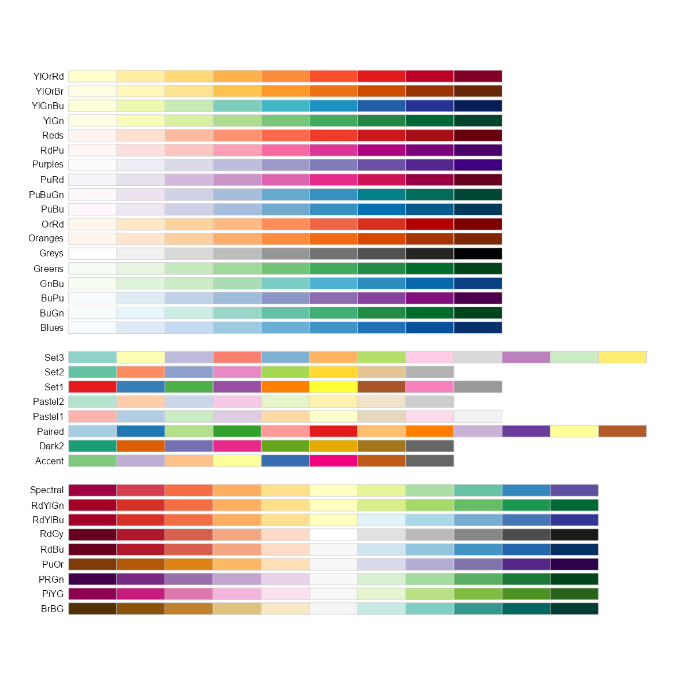

# (APPENDIX) Appendix {.unnumbered}

# Colors in R

What is a visualisation without colours? Colours are crucial in conveying meaning effectively, with some colours having specific psychological associations. For instance, red can represent emotions such as love and anger, but it is also often used to indicate declines or losses in data visualizations. In the context of data visualization, color sets the mood and emphasizes the message of the display. It creates a particular atmosphere and can turn a simple visualization into a compelling data narrative.

While tools like ggplot2 are excellent for crafting impactful data visualizations, the default color schemes may sometimes require customization. Carefully selected colors can make it easier and quicker for users to interpret the data and grasp the intended message.

The strategic use of colors can highlight critical data points, differentiate categories, and depict gradients in a way that text alone cannot achieve. Effective color choices make complex data more accessible and engaging, fostering better understanding and retention of information. See the following example (Figure \@ref(fig:colorex)), wherein mean highway mileage for each class of cars in `mpg` data-set has been shown. Color has been used to distinguish classes those having mileage greater than average mileage.

```{r colorex, fig.show='hold', fig.align='center', fig.cap="Default colors in GGPLOT2"}
library(tidyverse, warn.conflicts = FALSE, quietly = TRUE)
mpg %>% 
  summarise(hwy = mean(hwy), .by = class) %>% 
  mutate(class = fct_reorder(class, hwy),
         mean = mean(hwy),
         performance = ifelse(hwy >= mean, "Above", "Below")) %>% 
  ggplot(aes(y = class, x = hwy, fill = performance)) +
  geom_col() +
  geom_vline(aes(xintercept = mean), linetype = "dashed", linewidth = 1) +
  theme_bw() +
  ggtitle("Class wise Mean Highway mileage of cars")
```

We may notice that default color choice by R's GGPLOT2 is not effective as it has picked negative shades for classes having good mileage.

In addition, it is crucial to consider color-blind friendly palettes to ensure that visualizations are accessible to all users. Approximately 8% of men and 0.5% of women globally experience some form of color blindness. By using color schemes that are distinguishable to those with color vision deficiencies, such as those provided by tools like [ColorBrewer](https://en.wikipedia.org/wiki/ColorBrewer), designers can create inclusive visualizations. This not only broadens the audience but also demonstrates a commitment to accessibility and inclusivity. Thoughtful color selection, including the use of color-blind friendly palettes, can significantly enhance the effectiveness and reach of data visualizations.

Readers who wish to learn more about usage of appropriate colors in data visualizations may [refer this blog post](https://blog.datawrapper.de/10-ways-to-use-fewer-colors-in-your-data-visualizations/). So let us learn how to tweak colors in data visualizations to make them convey the message clear and effective.

```{r echo=FALSE, message=FALSE, warning=FALSE}
library(RColorBrewer)

```

## Choosing colors by own choice

We need different colors for making visualizations in R. In base R plots, colors are usually specified using "col" whereas in ggplot2 these are manipulated using 'fill' or 'color' aesthetics. There are 600+ built in colors in R. We can have a look on these using `colors()` function.

```{r}
# See names of random 20 colors
set.seed(123)
sample(colors(), 20)
```

As we can see that `colors()` function produces color names, we can use color names directly while plotting.

```{r}
# In base R
barplot(c(5,4,3,2), col = c("lightgoldenrodyellow", "mediumorchid1", "indianred2", "paleturquoise"))
```

Or alternatively, we can use HEX color code values for these colors.

```{r}
barplot(c(2, 3, 4, 5), col = c("#fedcba", "#abcdef", "#123456", "#654321"))
```

In the following plot, readers may see random 100 colors printed from the `colors()` in R.

```{r echo=FALSE, message=FALSE, warning=FALSE}


set.seed(12345)
COLORS <- sample(colors(), 100)
library(scales)
expand.grid(x = 1:5, y = 1:20) %>%
  mutate(col = COLORS,
         text_col = map(col, col2rgb),
         text_col = map_dbl(text_col, ~ sum(.x/255 * c(0.2126, 0.7152, 0.0722))),
         text_col = ifelse(text_col > 0.5, "black", "white")) %>%
  ggplot(aes(x, y)) +
  geom_tile(color = "white", aes(fill = col)) +
  scale_fill_identity() +
  geom_text(aes(label = col, color = text_col)) +
  scale_color_identity() +
  theme_void(base_size = 14)
```

## Colors by hex values

Colors in R can also be directly selected by entering the hex value of the color preceded by a `#` hash character. These hex values generally contain six hexadecimal digits, out of which-

-   first two represent hex value of `red`
-   next two represent `green`
-   and last two represent `blue`

thus forming rgb/RGB value of a color. Readers may already know that there are sixteen hexadecimal digits, `0`, `1`, `2`, `3`, `4`, `5`, `6`, `7`, `8`, `9`, `a`, `b`, `c`, `d`, `e` and `f`. So two hexadecimal digits actually represent $16{\times}16 = 256$ values in base-10. Thus,

-   `#000000` represents perfect black (no color at all)
-   `#ff0000` represents red color
-   `#00ff00` represents green color
-   `#0000ff` represents blue color
-   `#ffffff` represents white color.

See the following example.

```{r}
barplot(2:6, col = c("#000000", "#ff0000", "#ffff00", "#00ffff", "#ff00ff"), main = "Some primary color Mixing")
```

## Color palettes in Base R

A color palette is a combination of colors used by UI designers when designing an interface. Base R has certain palettes that may be used in visualizations.

```{r}
heat.colors(5)
rainbow(7)
terrain.colors(6)
topo.colors(5)
cm.colors(4)
hcl.colors(5)
```

See colors in action in the following plots

```{r}
par(mfrow = c(2, 3))
barplot(1:5, col = heat.colors(5), main = "Heat Colors")
barplot(1:7, col = rainbow(7), main = "Rainbow colors")
barplot(1:7, col = terrain.colors(7), main = "Terrain Colors")
barplot(1:5, col = topo.colors(5), main = "Topgraphical Colors")
barplot(1:6, col = cm.colors(6), main = "CM colors")
barplot(1:7, col = hcl.colors(7), main = "HCL Colors")

```

## Color Brewer

There are some color palettes created specifically for the purpose and which let us choose best colors for story telling. [Cynthia Brewer](https://en.wikipedia.org/wiki/Cynthia_Brewer) an American cartographer, who worked on visibility and color theory in cartography developed colorblind-friendly sets of colors, known as the Brewer palettes. `RColorBrewer` package in R presents us those palettes for use in our data visualizations.

Let us load the package and display all available palettes there.

```{r colors1, eval=FALSE}
#install.packages("RColorBrewer")
library(RColorBrewer)
display.brewer.all()
```

```{r colors2, echo=FALSE}

```

These are actually divided into three categories, namely-

-   *Sequential*: For use preferably with continuous scales;
-   *Qualitative*: To be used for non-ordered categorical things -- such as factor, like country or continent;
-   *Diverging*: For use in continuous scales showing two diverging trends like positives and negatives, etc.

To display a single palette, we can use `display.brewer.pal(n, name)` where `n` and `name` are arguments requiring number of colors and palette name respectively.

```{r out.height="20%"}
# View a single RColorBrewer palette by specifying its name
display.brewer.pal(n = 7, name = 'BrBG')
```

See the following examples showing us to pick color palette using

-   `scale_fill_brewer` or `scale_color_brewer` in ggplot2
-   `brewer.pal` in base R plots.

```{r}
library(RColorBrewer)
ggplot(mpg, aes(year, fill = class)) +
  geom_bar() +
  scale_fill_brewer(palette = "Dark2")
  
```

```{r}
# Bar-plot using RColorBrewer
barplot(c(2,4, 5, 7, 3), col = brewer.pal(n = 5, name = "Accent"))
```

## Package `colorspace`

The colorspace package provides a broad toolbox for selecting individual colors or color palettes, manipulating these colors, and employing them in various kinds of visualizations.

The colorspace package provides three types of palettes based on the HCL model:

-   **Qualitative**: Designed for coding categorical information, i.e., where no particular ordering of categories is available and every color should receive the same perceptual weight. Function: `qualitative_hcl()`.
-   **Sequential**: Designed for coding ordered/numeric information, i.e., where colors go from high to low (or vice versa). Function: `sequential_hcl()`.
-   **Diverging**: Designed for coding ordered/numeric information around a central neutral value, i.e., where colors diverge from neutral to two extremes. Function: `diverging_hcl()`.

A quick overview can be gained easily with the `hcl_palettes()` function:

```{r}
library("colorspace")
hcl_palettes(plot = TRUE)
```

To provide access to the HCL color palettes from within `ggplot2` graphics suitable discrete and/or continuous ggplot2 color scales are provided. The scales are named via the scheme `scale_<aesthetic>_<datatype>_<colorscale>()`, where `<aesthetic>` is the name of the aesthetic (`fill`, `color`, `colour`), `<datatype>` is the type of the variable plotted (discrete or continuous) and `<colorscale>` sets the type of the color scale used (`qualitative`, `sequential`, `diverging`, `divergingx`).

To illustrate `diverging` color palette, we can plot figure \@ref(fig:colorex), as

```{r}
mpg %>%
  summarise(hwy = mean(hwy), .by = class) %>%
  mutate(class = fct_reorder(class, hwy)) %>%
  ggplot(aes(y = class, x = hwy, fill = hwy)) +
  geom_col() +
  scale_fill_continuous_diverging(palette = "Red-Green", mid = mean(mpg$hwy)) +
  geom_vline(aes(xintercept = mean(mpg$hwy)), linetype = "dashed", linewidth = 1) +
  theme_bw() +
  ggtitle("Class wise Mean Highway mileage of cars")
```

------------------------------------------------------------------------
