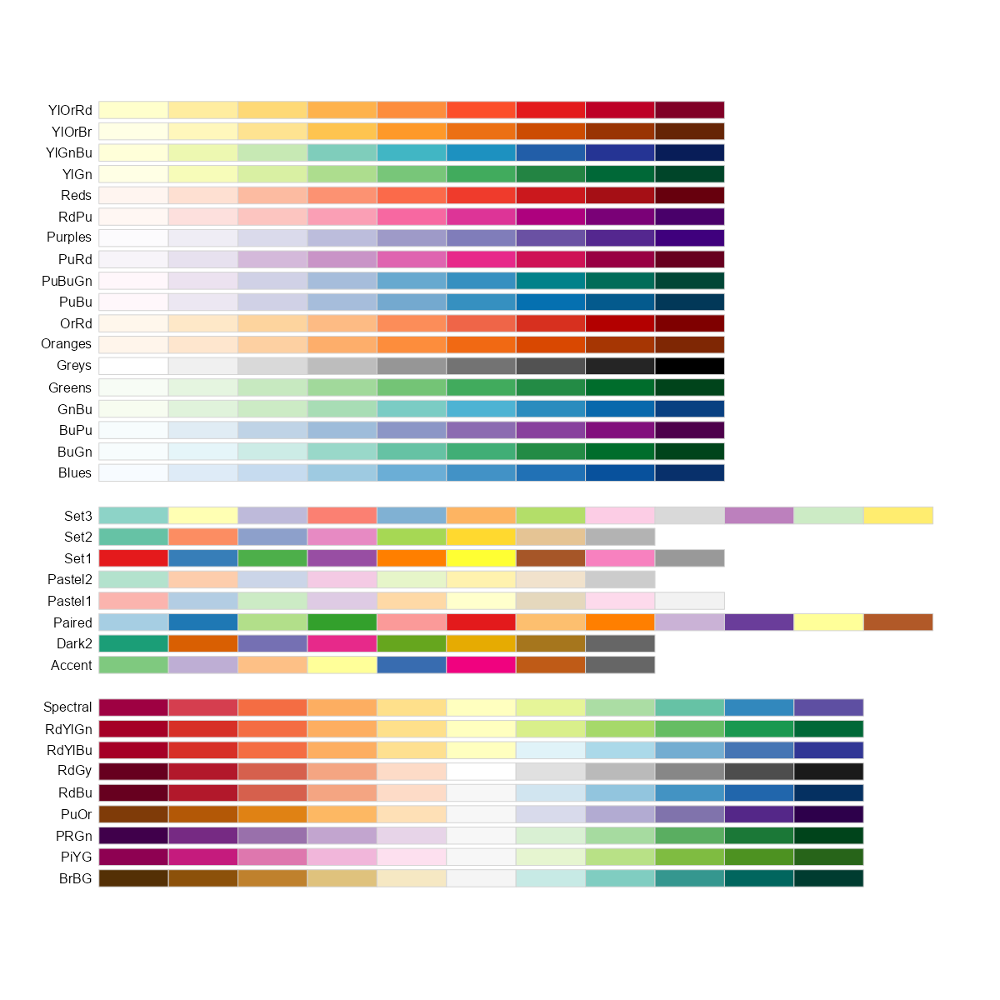

```{r}
#| include: false
source("_common.R")
```


# Colours in R {#sec-COLORR}

An audit report is read by busy people. A Secretary, a member of the Public Accounts Committee or a journalist may look at a chart for a few seconds only. In that time the colours do much of the talking. Red is read as a warning, a loss or a shortfall, and green as safe or good. A chart that colours the districts with *savings* in red, and those with *excess expenditure* in green, sends the wrong message before anyone reads a number.

Well-chosen colours make the important points stand out, separate categories clearly, and show gradients that text alone cannot. Badly chosen colours mislead, or simply cannot be told apart by some readers. This appendix shows how colours are chosen in R, and which palettes suit audit charts.

The default colours of ggplot2 are chosen only to be distinct, not to carry meaning, so they often need changing. The example in @fig-colorex uses the built-in `mpg` dataset, which is handy for a quick demonstration. It shows the mean highway mileage of each class of cars. Colour marks the classes with mileage above the average.

```{r fig-colorex, fig.show='hold', fig.align='center', fig.cap="Default colours in ggplot2"}
library(tidyverse, warn.conflicts = FALSE, quietly = TRUE)
mpg |> 
  summarise(hwy = mean(hwy), .by = class) |> 
  mutate(class = fct_reorder(class, hwy),
         mean = mean(hwy),
         performance = ifelse(hwy >= mean, "Above", "Below")) |> 
  ggplot(aes(y = class, x = hwy, fill = performance)) +
  geom_col() +
  geom_vline(aes(xintercept = mean), linetype = "dashed", linewidth = 1) +
  theme_bw() +
  ggtitle("Class wise Mean Highway mileage of cars")
```

The default colours are not effective here. ggplot2 has given red, a colour usually read as bad, to the classes with *better* than average mileage, simply because "Above" comes first in alphabetical order.

It is also important to use colours that readers with colour blindness can tell apart. About 8% of men and 0.5% of women have some form of colour blindness. The most common form is difficulty in telling red from green, the very pair most often used for "bad" and "good". Palettes designed with this in mind, such as those of [ColorBrewer](https://en.wikipedia.org/wiki/ColorBrewer) described below, make a chart readable for everyone. In audit reports, which may also be printed in black and white, it helps to choose colours that differ in lightness as well as in hue.

Readers who wish to learn more about the use of colour in charts may [refer to this blog post](https://blog.datawrapper.de/10-ways-to-use-fewer-colors-in-your-data-visualizations/). Let us now see how to choose colours in R.

```{r echo=FALSE, message=FALSE, warning=FALSE}
library(RColorBrewer)

```

## Choosing colours by name

In base R plots, colours are given with the argument `col`, while in ggplot2 they are set with the `fill` or `colour` aesthetics. R has more than 600 named colours, listed by the function `colors()`.

```{r}
# See names of random 20 colors
set.seed(123)
sample(colors(), 20)
```

These names can be used directly in plots.

```{r}
# In base R
barplot(c(5,4,3,2), col = c("lightgoldenrodyellow", "mediumorchid1", "indianred2", "paleturquoise"))
```

Or we can give colours by their *hex codes*, explained in the next section.

```{r}
barplot(c(2, 3, 4, 5), col = c("#fedcba", "#abcdef", "#123456", "#654321"))
```

The following plot shows 100 of the named colours, chosen at random.

```{r echo=FALSE, message=FALSE, warning=FALSE}


set.seed(12345)
COLORS <- sample(colors(), 100)
library(scales)
expand.grid(x = 1:5, y = 1:20) |>
  mutate(col = COLORS,
         text_col = map(col, col2rgb),
         text_col = map_dbl(text_col, \(x) sum(x / 255 * c(0.2126, 0.7152, 0.0722))),
         text_col = ifelse(text_col > 0.5, "black", "white")) |>
  ggplot(aes(x, y)) +
  geom_tile(color = "white", aes(fill = col)) +
  scale_fill_identity() +
  geom_text(aes(label = col, color = text_col)) +
  scale_color_identity() +
  theme_void(base_size = 14)
```

## Colours by hex values

A colour can also be given by its hex code. This is a `#` followed by six hexadecimal digits.

-   The first two give the amount of `red`.
-   The next two give the amount of `green`.
-   The last two give the amount of `blue`.

Together they form the RGB (red, green, blue) value of the colour. There are sixteen hexadecimal digits, `0` to `9` and `a` to `f`, so two of them can represent $16{\times}16 = 256$ levels of each colour, from `00` (none) to `ff` (full). Thus these codes give the basic colours.

-   `#000000` is black, with no colour at all.
-   `#ff0000` is red.
-   `#00ff00` is green.
-   `#0000ff` is blue.
-   `#ffffff` is white.

Hex codes are useful when a report must follow a fixed house style, since the exact shade can be repeated in every chart.

See the following example.

```{r}
barplot(2:6, col = c("#000000", "#ff0000", "#ffff00", "#00ffff", "#ff00ff"), main = "Some primary colour mixing")
```

## Colour palettes in base R

A *palette* is a set of colours chosen to work together. Base R has several palettes, each given by a function that returns the requested number of colours.

```{r}
heat.colors(5)
rainbow(7)
terrain.colors(6)
topo.colors(5)
cm.colors(4)
hcl.colors(5)
```

The following plots show these palettes in use.

```{r}
par(mfrow = c(2, 3))
barplot(1:5, col = heat.colors(5), main = "Heat colours")
barplot(1:7, col = rainbow(7), main = "Rainbow colours")
barplot(1:7, col = terrain.colors(7), main = "Terrain colours")
barplot(1:5, col = topo.colors(5), main = "Topographical colours")
barplot(1:6, col = cm.colors(6), main = "CM colours")
barplot(1:7, col = hcl.colors(7), main = "HCL colours")

```

## ColorBrewer palettes

[Cynthia Brewer](https://en.wikipedia.org/wiki/Cynthia_Brewer), an American cartographer who worked on the use of colour in maps, developed sets of colours that work well together and that are, in many cases, safe for readers with colour blindness. They are known as the Brewer palettes, and the package `RColorBrewer` makes them available in R.

Let us load the package and display all its palettes.

```{r colors1, eval=FALSE}
#install.packages("RColorBrewer")
library(RColorBrewer)
display.brewer.all()
```

```{r colors2, echo=FALSE}

```

They fall into three categories.

-   *Sequential*, for ordered values from low to high, like expenditure by district.
-   *Qualitative*, for categories with no order, like departments or schemes.
-   *Diverging*, for values on both sides of a meaningful middle, like savings and excesses against a budget.

To display a single palette, use `display.brewer.pal(n, name)`, with the number of colours `n` and the palette's `name`.

```{r out.height="20%"}
# View a single RColorBrewer palette by specifying its name
display.brewer.pal(n = 7, name = 'BrBG')
```

In charts, the palettes are used in two ways.

-   `scale_fill_brewer()` or `scale_color_brewer()` in ggplot2.
-   `brewer.pal()` in base R plots.

`display.brewer.all(colorblindFriendly = TRUE)` shows only the palettes that are safe for colour-blind readers.

```{r}
library(RColorBrewer)
ggplot(mpg, aes(year, fill = class)) +
  geom_bar() +
  scale_fill_brewer(palette = "Dark2")
  
```

```{r}
# Bar-plot using RColorBrewer
barplot(c(2,4, 5, 7, 3), col = brewer.pal(n = 5, name = "Accent"))
```

## Package `colorspace`

The package `colorspace` provides a broad toolbox for choosing colours and palettes, based on the HCL (hue, chroma, luminance) colour model, which matches the way people perceive colour.

The colorspace package provides three types of palettes based on the HCL model.

-   **Qualitative** palettes, from `qualitative_hcl()`, are for categories with no order, like schemes or departments. Every colour gets the same visual weight.
-   **Sequential** palettes, from `sequential_hcl()`, are for ordered numbers, where colours go from low to high.
-   **Diverging** palettes, from `diverging_hcl()`, are for numbers around a neutral middle. The colours move away from a neutral shade towards two extremes, like savings on one side and excesses on the other.

The function `hcl_palettes()` gives a quick overview.

```{r}
library("colorspace")
hcl_palettes(plot = TRUE)
```

The package also gives ggplot2 scales for these palettes. Their names follow the pattern `scale_<aesthetic>_<datatype>_<colorscale>()`. Here `<aesthetic>` is `fill`, `color` or `colour`. `<datatype>` is `discrete` or `continuous`, the type of the variable plotted. `<colorscale>` is the type of palette, one of `qualitative`, `sequential`, `diverging` or `divergingx`.

A diverging palette suits @fig-colorex well, since mileage lies above or below a meaningful middle, the average. Here is the chart again, with red for below the average and blue for above. The colour now carries the right meaning, and the strength of the colour shows how far each class is from the average.

```{r}
mpg |>
  summarise(hwy = mean(hwy), .by = class) |>
  mutate(class = fct_reorder(class, hwy)) |>
  ggplot(aes(y = class, x = hwy, fill = hwy)) +
  geom_col() +
  scale_fill_continuous_diverging(palette = "Blue-Red", rev = TRUE, mid = mean(mpg$hwy)) +
  geom_vline(aes(xintercept = mean(mpg$hwy)), linetype = "dashed", linewidth = 1) +
  theme_bw() +
  ggtitle("Class wise Mean Highway mileage of cars")
```

We have used the `"Blue-Red"` palette, not `"Red-Green"`. Red and green together are hard for many colour-blind readers to tell apart. Blue and red stay distinct for them, and red still marks the weaker classes. The palette runs from blue to red, so `rev = TRUE` reverses it to put red at the low end. The strength of the colour also changes, which helps when the report is printed in black and white.

## Colours for audit charts {.unnumbered}

A few rules of thumb serve well in audit reports.

- Use colour to carry *one* message, such as exceptions in red and everything else in grey, rather than giving every category its own bright colour.
- Keep the usual meanings. Use red for shortfalls, losses and exceptions, and green or blue for normal or good.
- Choose palettes that are safe for colour blindness and readable when printed in black and white, such as the Brewer palettes or the HCL palettes of `colorspace`.
- Use a sequential palette for ordered values, a diverging one around a meaningful middle, and a qualitative one only for unordered categories.

## Summary of functions used {.unnumbered}

| Function | Package | What it does |
|-----------------------|----------------|--------------------------------|
| `colors()` | grDevices | Names of R's built-in colours |
| `heat.colors()`, `rainbow()`, `terrain.colors()`, `topo.colors()`, `cm.colors()`, `hcl.colors()` | grDevices | Base R palettes |
| `display.brewer.all()`, `display.brewer.pal()`, `brewer.pal()` | RColorBrewer | Show and use the Brewer palettes |
| `scale_fill_brewer()`, `scale_colour_brewer()` | ggplot2 | Brewer palettes in ggplot2 |
| `hcl_palettes()`, `scale_fill_continuous_diverging()` | colorspace | HCL palettes, and their ggplot2 scales |
| `scale_fill_identity()`, `scale_fill_manual()` | ggplot2 | Use colours given in the data, or chosen by hand |

: Functions used in this appendix {#tbl-colorfunctions}

