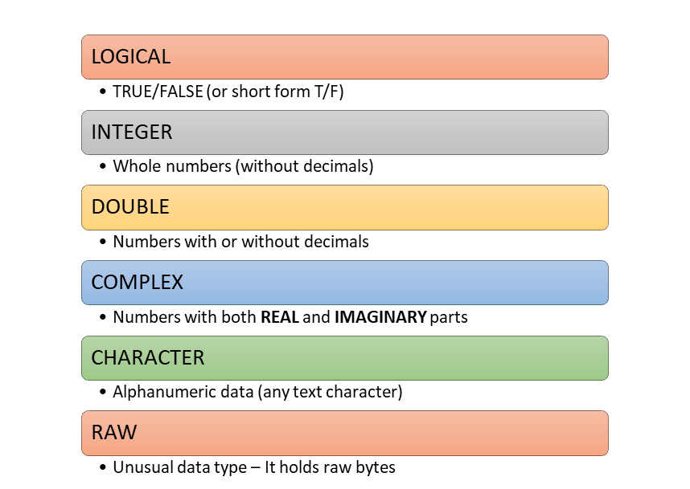
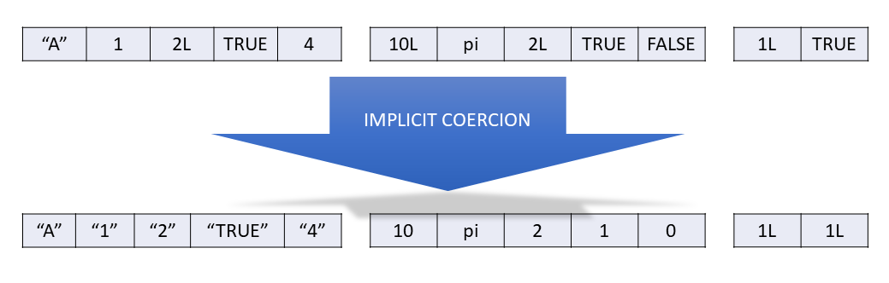
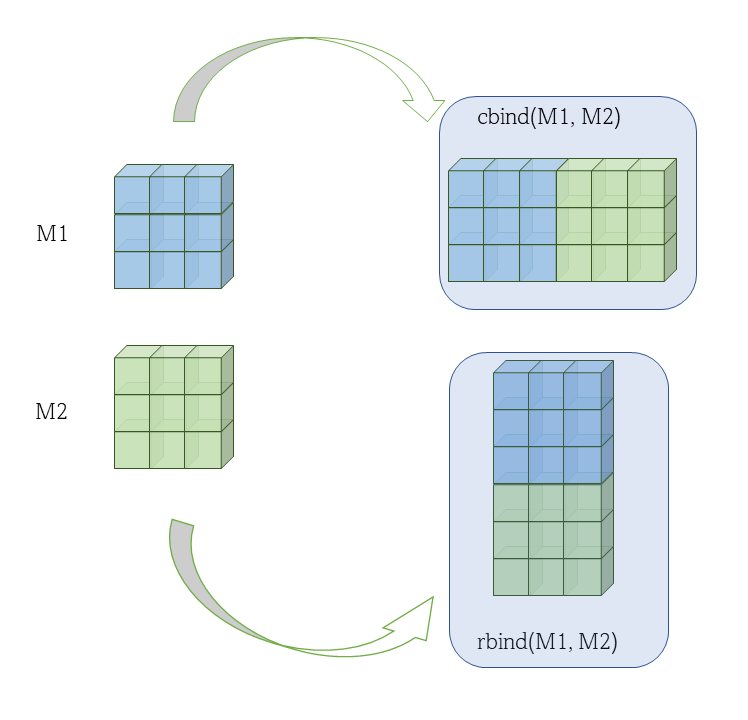
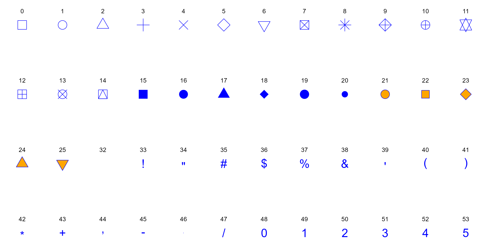
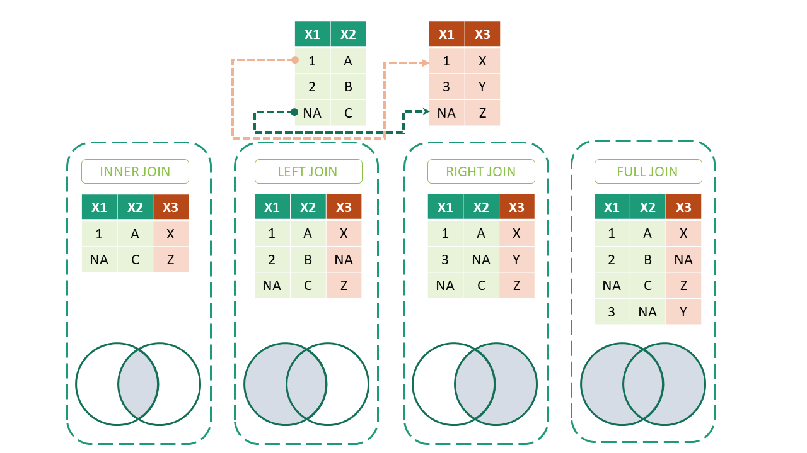
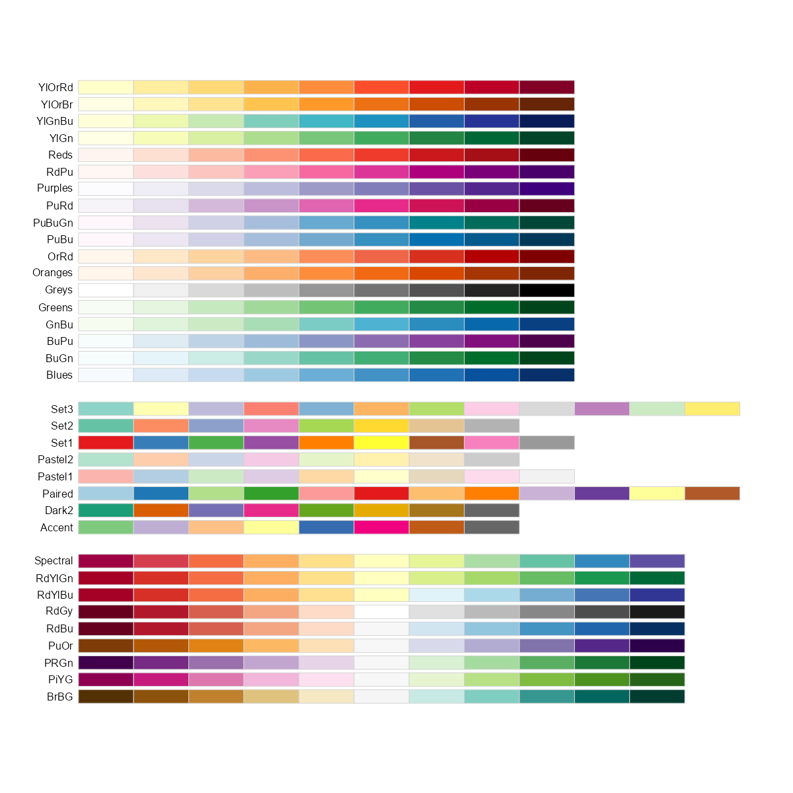

# Welcome to R for Audit Analytics {.unnumbered}
[](https://hits.seeyoufarm.com)


<a href="https://anilyayavar.github.io/new-book/index.html"></a>

<p xmlns:cc="http://creativecommons.org/ns#" xmlns:dct="http://purl.org/dc/terms/">

<a property="dct:title" rel="cc:attributionURL" href="https://anilyayavar.github.io/new-book/">R for Audit Analytics</a> by <a rel="cc:attributionURL dct:creator" property="cc:attributionName" href="https://www.linkedin.com/in/anil-kumar-goyal/">Anil Goyal</a> is licensed under <a href="https://creativecommons.org/licenses/by-nc/4.0/?ref=chooser-v1" target="_blank" rel="license noopener noreferrer" style="display:inline-block;">CC BY-NC 4.0</a>

</p>

The author works for Government of India. The opinions expressed in this book are personal to the author and are not to be construed as that of Government of India, or of author in his official capacity. All data-sets and examples used in the book are either sample data-sets available with R and allied packages or available online (or other sources) as open data-sets or created by author himself to demonstrate the case under discussion. None of the data-sets and examples used in this book pertain to any entity ever handled by the author in his official capacity and do not breach the official secrecy in any manner.

------------------------------------------------------------------------

This is website for book **R for Audit Analytics** hosted for absolutely free for use by all. This is the work by [Anil Goyal](https://www.linkedin.com/in/anil-kumar-goyal/). Suggestions, errors, etc. may be communicated to author over his email [anilyayavar\@gmail.com](mailto:anilyayavar@gmail.com){.email} or through the [github version](https://github.com/anilyayavar/new-book) of this book.

# Preface {.unnumbered}

> "R is the Swiss Army knife of data science. It's a versatile and powerful tool that can handle nearly any data-related task, from data cleaning and preparation to statistical modeling and machine learning. And because it's open-source, there's a vast ecosystem of packages and tools available to extend its capabilities even further." - Norman Matloff, professor of computer science at the University of California, Davis.

```{r include=FALSE, message=FALSE}
library(knitr)
```

Welcome to my book on R language, designed specifically for auditors who are interested in learning data analytics using open source resources. In today's digital age, data is abundant and ubiquitous, and its importance cannot be overstated. As a result, auditors must be equipped with the necessary skills to leverage this data and draw insights from it. This book is a result of my love for R and my passion for data analytics. In this book, I have tried to present R programming concepts and case studies that are useful in audit analysis as well as forensic audit and fraud investigation.

This book is written based on my notes on R while I was learning the language myself. I have included sufficient figures and examples to make the concepts easy to understand for readers. Most of the figures have been created by me except a few, for which due credit has been given.

R is an open-source programming language that has been gaining popularity in recent years due to its versatility and flexibility in data analysis. My journey with R began during COVID-19 lock-down, and I was introduced to R for data analysis by one of my colleagues. Since then, R has become an essential tool in my toolbox for data analysis.

In this book, I have tried to make the concepts of R programming and data analytics as accessible as possible for auditors who may have little or zero knowledge of programming. The first part of the book covers R programming concepts which are absolutely necessary to work in R. Second part onward covers data wrangling/transformation techniques as well as different techniques useful in forensic audit and fraud investigation.

I hope that this book will be a useful resource for auditors who want to learn data analytics using open source resources like R. I invite readers to share their suggestions and comments on the book to help me improve it further.

Happy reading and happy learning!

## Acknowledgments {.unnumbered}

Writing this book has been a journey filled with learning, challenges, and invaluable support from those around me. First and foremost, I extend my deepest gratitude to my wife, **Reena**, whose unwavering encouragement and belief in my abilities persuaded me to embark on this endeavour. Her steadfast support has been the cornerstone of my motivation throughout this process.

I am also profoundly grateful to my esteemed colleagues, whose expertise, insights, and feedback have greatly enriched the content of this book. Their willingness to share their knowledge, provide suggestions, and meticulously point out errors and mistakes have been instrumental in refining the quality and accuracy of the material presented herein.

Furthermore, I extend my thanks to all those who have contributed to this project in various capacities, whether through discussions, reviews, or moral support. Your contributions have been invaluable and have undoubtedly played a significant role in shaping this book.

Lastly, I would like to express my appreciation to the readers who will engage with this book. It is my sincere hope that the knowledge imparted within these pages proves valuable and contributes to the advancement of auditing practices utilizing the R language.

Thank you, from the depths of my heart, for being a part of this journey.

## R, not just a letter {.unnumbered}

R programming language is the extended version of the S programming language. John Chambers, the creator of the S programming language in 1976 at Bell laboratories. In 1988, the official version of the S language came into existence with the name S-PLUS. The R language is almost the unchanged version of S-PLUS.

In 1991, R was created by **Ross Ihaka** \index{Ihaka, Ross} and **Robert Gentleman** \index{Gentleman, Robert} in the Department of Statistics at the University of Auckland. Ross's and Robert's experience developing R is documented in a 1996 paper in the Journal of Computational and Graphical Statistics [@10.2307/1390807]. In 1997 the R Core Group was formed, containing some people associated with S and S-PLUS. Currently, the core group controls the source code for R and is solely able to check in changes to the main R source tree. Finally, in 2000 R version 1.0.0 was released to the public. \index{History of R}

```{r history, echo=FALSE, fig.cap="A Brief History of R", fig.show='hold', fig.align='center', out.width="90%"}
include_graphics("images/history.png")
```

## Why R? {.unnumbered}

R programming language is an open-source programming language for statistical computation. It supports n number of statistical analysis techniques, machine learning models, and graphical visualization for data analysis. It serves the purpose of the free software environment for statistical computation and graphics. R is easy to understand and implement. The packages are available to create an effective R program, data models, and graphical charts. For research and analytics purposes, it is a popular language among statisticians and data scientists.

```{r whyr, echo=FALSE, fig.cap="Why R", fig.show='hold', fig.align='center', out.width="90%"}

```

I always admire **Hadley Wickham**'s contributions to the development of R programming concepts, that has made data analysis more accessible and efficient. The tidyverse, a collection of R packages developed by Wickham, has transformed the way data analysts and data scientists work with data. The tidyverse promotes a consistent and coherent way of working with data, making it easier to write code that is easier to read, understand, and maintain. Wickham's contributions to R have become the foundation of many data analysis tools in other programming languages, including Python and Julia. I hope that this book will inspire readers to explore the vast potential of R and the contributions made by Wickham in data analytics.

One of the advantages of using free/open source tools like R is that they can be easily customized and extended to suit the specific needs of the user. Additionally, free/open source tools are often updated more frequently than licensed tools, ensuring that users have access to the latest features and bug fixes. Using licensed data analytics tools like Caseware IDEA, Tableau, Power BI and others can be expensive, and their licensing fees can be a significant burden on smaller organizations or individuals. By using open source tools like R, users can significantly reduce their costs while still having access to powerful data analytics capabilities.

Another strength of R is its extensive library of packages, which includes many tools for statistical analysis and data visualization.

# About author {.unnumbered}

Anil Goyal is a data analytics enthusiast who has been working in the Indian Audit and Accounts Department since 1998. Anil has a passion for learning and applying programming languages/other tools such as R and Tableau to solve data-related challenges.

Anil is a self-taught expert in R, and has been involved in a variety of data analytics projects and audits.

Anil holds a post-graduate degree in Mathematics from the University of Rajasthan, Jaipur, which he received in 1998. This book is his first book. He continues to expand his skill set and knowledge in this field. Anil also loves to solve problems raised by various users on [StackOverflow.com](https://stackoverflow.com/users/2884859/anilgoyal) mainly related to R language.

When not working with data, Anil enjoys pursuing his personal interests, which include [photographying birds](https://www.flickr.com/search/?user_id=121352773%40N04&view_all=1&text=birds), [nature](https://www.flickr.com/search/?user_id=121352773%40N04&view_all=1&text=landscape); reading and watching movies, etc..

<!--chapter:end:index.Rmd-->

\mainmatter

# Gearing up {-}
```{r echo=FALSE, message=FALSE}
library(knitr)
```

## Download and installation
The R programming language for local computer can be downloaded from web portal of **The Comprehensive R Archive Network**,\index{CRAN} in short mostly referred to as **CRAN**,\index{CRAN} which is a network of ftp and web servers around the world that store identical, up-to-date, versions of code and documentation for R.  The portal address is [https://cran.r-project.org/](https://cran.r-project.org/) -

```{r cranportal, echo=FALSE, fig.cap="CRAN Portal", fig.show='hold', fig.align='center', out.width="60%"}
include_graphics("images/CRAN.png")
```

Download the specific (as per the operating system) file from the port and install it following the instructions.  The R programming interface looks like-

```{r workspace, echo=FALSE, fig.cap="R Workspace", fig.show='hold', fig.align='center', out.width="70%"}
include_graphics("images/workspace.png")
```

## Writing your first code
Writing code in R is pretty easy.  Just type the command in front of `>`, as shown in figure \@ref(fig:workspace) prompt and press `Enter(Return)` key.  R will display the results in next line.

```{r first, echo=FALSE, fig.cap="Left - Writing first Code in R; Right - Indenting code not necessary but recommended", out.width="49%", out.height= "49%", fig.show='hold', fig.align='center'}
knitr::include_graphics(c("images/first_code.png", "images/indent.png"))
```

## Things to remember

1. R is case sensitive.  This will have to be remembered while writing/storing/calling functions or other objects.  So `Anil`, `ANIL`, `anil` all are different objects in R.
2. White spaces between different pieces of codes don't matter.  See figure-\@ref(fig:first) above.  Both `3+4` and `3 + 4` will evaluate same.  However, for better readability it is always better to use spaces. 
3. Parenthesis `()` are generally used to change the natural order of precedence.  Moreover, these are also used in passing arguments to functions, which will be discussed in detail in chapter-\@ref(func) and onward.
4. Multi-line code(s) aren't required to be indented in R. In R, indents have no meaning.  However, following best practices to write a code that is understandable by readers, proper indentation is suggested. See figure-\@ref(fig:first) (right) above.
5. If an incomplete code is written in the first line of the code (useful when a single line is not sufficient to write complete code), R will automatically prompt as displaying `+` at the beginning of line, instead of a `>`.  See figure-\@ref(fig:first) (right) above.
6. Indices in R always start from 1 (and not from 0).  This has been discussed in detail in chapter-\@ref(subset).
7. Code that start with hash symbol `#` does not execute. Even in a line if `#` appears in between the line, the code from that place does not get executed.  See the following example.  Comments may be used in codes for either of the purposes -
    + Code Readability
    + Explanation of code
    + Inclusion of metadata, other references, etc.
    + Prevent execution of certain line of code
    

```{r}
# 1 + 3 (this won't be executed)
1 + 3 # +5
```

> Tip: to clear the workspace, just click `ctrl` + `l`.

Normally R code files have an extension `.R` but other R files may have other extensions, such as project files `.Rproj`, markdown files `.Rmd`, and many more.

All of the programming/code writing may be done in R.  But you may have noticed that code once executed cannot be edited.  The code has to written again (Tip: To get previous executed command just use scroll up key on keyboard). Thus, in order to use many other smart features, we will write our code as R scripts i.e. in `.R` files, using most popular IDE for R which is `R Studio`. 

> Rstudio IDE is so popular among those using R, that many people cannot distinguish between R and its IDE.  Even Stack Overflow which is a popular forum to seek online help explicitly asks users not to tag 'R studio' in general R code problems^[[https://stackoverflow.com/tags/rstudio/info](https://stackoverflow.com/tags/rstudio/info)].

## R studio IDE 
RStudio\index{Rstudio} is free and open source IDE (Integrated Development Environment) for R, which is available for Windows, Mac OS and LINUX. It can be downloaded from its portal [https://posit.co/download/rstudio-desktop/](https://posit.co/download/rstudio-desktop/). For our most of the data analytics needs, we require Rstudio desktop version, which is available for free to download and installation.

It includes a console, syntax-highlighting editor that supports direct code execution, and a variety of robust tools for plotting, viewing history, debugging and managing your work-space. After downloading and installing it the local machine, a work-space/UI similar to that shown in following figure, is opened.

```{r rstud, echo=FALSE, fig.cap="R Studio interface", fig.show='hold', fig.align='center', out.width="90%"}
include_graphics("images/rstudio.png")
```

There are four panels

- Top-left: 
    + **Scripts and Files:** The script files which we will be working on, will be opened and displayed here.  To open a new script, you just need to click the new script button  which is just below the _file menu._; or using keyboard shortcut `ctrl + shift + n`
- Bottom-left:
    + **R console:** is where the R commands can be written and see the output.  Even the commands run on script will show the output in this panel.

{#id .class width=447 height=157px}
    + **Terminal:** Here we can access our system shell.
- Top-right: 
    + **Environment:**  To see the objects saved in current environment.  This panel is also used to import data in current environment.
    + **History** To view the history of commands run, in the current session
    + **Connections:** Used to connect/import with external database/data
- Bottom-right: 
    + **Files** having tree of folders, to see the file structure of current working directory
    + **Plots** graph window, if the output of R command is a plot/graph, it will be generated here.
    
{#id .class width=771 height=293px}
    + **Packages**, to download and load the external packages using mouse click
    + **Help**, window to get help on desired functions.  Even the help sought through r command will be displayed in this window.

{#id .class width=774 height=282px}
    + **Viewer:** can be used to view local web content.

{#id .class width=752 height=272px}

Readers may note that to execute the code from a .R file is slightly different than to execute it from `console` where pressing `Enter/Return` key just executes it and gives us result in the next line.  To run the script from the `Scripts and Files` pane (Top-left) we can do either of the following - 

- Select the code and press `ctrl/command + Enter/Return` keys.
- If the cursor is anywhere between the code or even anywhere in the line(s) having the code/code-block, we can press `ctrl/command + Enter/Return` keys.
- Or alternatively, we can make use of `Run` button  given in top-right side of `Files and Scripts` pane.

{#id .class width=770 height=575px}


>To get a quick overview (and for later-on references) readers may refer to the [Rstudio cheatsheet](https://rstudio.github.io/cheatsheets/rstudio-ide.pdf) available from [Posit Cheatsheets page](https://posit.co/resources/cheatsheets/), wherein many other cheatsheets are also available.


## Packages and libraries and conflicts
As already stated, one of the strength of R is that numerous user-written packages (or _libraries_)\index{packages, external} \index{library} are available on __Comprehensive R Archive Network__ i.e. [CRAN](https://cran.r-project.org/)\index{CRAN}. Package installation is perhaps easiest of the jobs in R.

The command \index{install.packages() function} is fairly simple -
```
install.packages("library_name")
```
which downloads the given package name (to be given in quotes and is case-sensitive), compiles it and then load it into the specified/default directory.  This will however, not load into the memory/R current session.  The libraries/packages are to be downloaded only once in a computer/system but need to be loaded in each and every new session of R, using the command- \index{library()}
```
library(library_name)
```
Quotes here, are optional but package name is still case sensitive.  So to install and load `tidyverse` we need to run first command once (which will download the package into your local computer) but second command (to load it in the current R session) at every new session.
```
install.packages('tidyverse')
```
Rstudio pane `Packages` may also be used, as shown in the following image (taken from cheatsheet).

{#id .class width=507 height=327px}

```{r}
library(tidyverse)
```
Also notice the output of library command above.  Besides loading successfully, nine packages which we will discuss in section \@ref(TIDYVE), it has given a message about conflicts.

So what are these conflicts?  Actually when a function having exactly same name resides in multiple package a conflict arises, and R by default prefers the conflicted functions loaded in last.  Here, package `stats` which is part of base R also consists of a function `filter` which has been overridden by package `dplyr` loaded as part of `tidyverse`.  Thus, after loading `dplyr`, this function `filter` has been masked from `stats`.

In case we want to use `filter` from masked `stats` we may either

- call it using double colon operator (Refer section \@ref(doublec)), i.e. using `stats::filter()`; or
- make use of another package `conflicted` which is again part of tidyverse as follows-

```
library(conflicted)
conflict_prefer("filter", "stats")
```
>Usage of package `conflicted` is advised with a bit caution, as loading this package causes to restrict usage of conflicted function altogether i.e. without giving explicit preference.


### Double Colon operator `::` {#doublec}
In R, we can use double colon operator \index{double colon operator, ::} i.e. `::` to access functions that are defined as part of the internal functions that a package uses. These may be used in at least two cases-

1. To call a function say `filter` from package `dplyr` we may use `dplyr::filter()` without actually loading it.  
2. In cases of conflicts as discussed in preceding section, e.g. `stats::filter()`.


## Getting Help within R {#help}
Once R is installed, there is a comprehensive built-in help system. We can use any of the following commands-
```
help.start()   # general help
help(foo)      # help about function `foo`
?foo           # same as above
apropos("foo") # show all functions containing word `foo`
example(foo)   # show an example of function `foo`
```
Alternatively, features under the Help menu or help pane, can also be used.


## tidyverse {#TIDYVE}
The [tidyverse](https://www.tidyverse.org/) is a _package of packages_ that work in harmony because they share common data representations and 'API' design. This package is designed to make all these easy to install and load multiple 'tidyverse' packages in a single step.

Though `tidyverse`  is a collection 20+ packages (in fact 80+ packages will be installed including depended packages) which are all installed by `install.packages("tidyverse")` command, yet `library(tidyverse)` load [nine](https://www.tidyverse.org/packages/) of them.  Others (like `readxl`) will have to loaded explicitly.

1. [**ggplot2**](https://ggplot2.tidyverse.org/) is a system for decoratively creating graphics, based on [*The Grammar of Graphics*](https://link.springer.com/book/10.1007/0-387-28695-0). 
2. [**dplyr**](https://dplyr.tidyverse.org/) provides a grammar of data manipulation, providing a consistent set of verbs that solve the most common data manipulation challenges. 
3. [**tidyr**](https://tidyr.tidyverse.org/) provides a set of functions useful for data transformation. 
4. [**readr**](https://readr.tidyverse.org/) is used to read and write rectangular/tabular data formats. 
5. [**purrr**](https://purrr.tidyverse.org/) is functional programming (FP) toolkit for working with functions and vectors. 
6. [**tibble**](https://tibble.tidyverse.org/) provides functionalities related to displaying data frames. 
7. [**stringr**](https://stringr.tidyverse.org/) provides set of functions designed to work with strings.  It is built on top of another package [stringi](https://cran.r-project.org/package=stringi). 
8. [**forcats**](https://forcats.tidyverse.org/) provides a suite of useful tools that solve common problems with factors. 
9. [**lubridate**](https://lubridate.tidyverse.org/) makes it easier to do the things R does with date-times.

With latest version of Tidyverse, while loading it [**lubridate**](https://lubridate.tidyverse.org/) also loads with default.

```{r tidyverse, echo=FALSE, fig.cap="tidyverse", fig.show='hold', fig.align='center', out.width="70%"}
knitr::include_graphics('images/tidyverse.png')
```

There are several other `tidyverse` packages which we will be working with-

- `hms`
- `readxl`
- `glue`


<!--chapter:end:00-Zero.Rmd-->

# Part-I: Basic R Programming Concepts {.unnumbered}

# R Programming Language

## Use R as a calculator {#calculator}
To start learning R, just start entering equations directly at the command prompt `>` and press enter. So, `3+4` will give you result `7`. Common mathematical operators are listed in table \@ref(tab:table3).\index{common mathematical operators}

Table: (#tab:table3) Common Mathematical Operators in R

```{r table3, echo=FALSE, message=FALSE, warnings=FALSE, results='asis'}
tabl1 <- "
| Operator/ function      | Meaning             | Example                    |
|:-------------:|:-----------------------------|:--------------------------------------------|
| `+` | Addition | `4 + 5` is `9` |
| `-` | Substraction | `4 - 5` is `-1` |
| `*` | Multiplication | `4 * 5` is `20` |
| `/` | Division | `4/5` is `0.8` |
| `^` | Exponent | `2^4` is `16` |
| `%%` | Modulus (Remainder from division) | `15 %% 12` is `3` |
| `%/%` | Integer Division | `15 %/% 12` is `1` |
"
cat(tabl1) 
```

Strings or Characters have to be enclosed in single `'` or double`"` quotes (more on strings in section \@ref(string)). So a few examples of calculations that can be performed in R could be-

```{r}
4 + 3 ^ 2
8 * (9 + 4)
```

> Note that R follows common mathematical order of precedence while evalauting expressions. That may be changed using simple parenthesis i.e. `()`. Also note that other brackets/braces i.e. curly braces `{}` and `[]` have been assigned different meaning, so to change nested order of operations only `()` may be used.

## Object Assignment
R is an object-oriented language.[@R-base] This means that *objects* \index{objects in R}are created and stored in R environment so that they can be used later.

So what is an object? An object can be something as simple as a number (value) that can be assigned to a variable. Think of it like this; Suppose we have greet each user by his/her name prefixing *hello* to his/her name. Now user's name may be saved in our work environment for later use. Thus, once the user name is saved in a variable then can be retrieved later on, by calling the variable name instead of asking the user name again and again. An object can be also be a data-set or complex model output or some function. Thus, an object created in R can hold multiple values.

The other important thing about objects is that objects are created in R, using the assignment operator\index{assignment operator} `<-`. Use of equals sign `=` to set something as an object is not recommended thought it will work properly in some cases. For now we will stick with the assignment operator, and interpret it as the left side is the object name that is storing the object information specified on the right side. *If `->` right hand side assignment is used, needless to say things mentioned above will interchange.*\index{right assignment operator}

```{r}
# user name
user_name <- 'Anil Goyal'

# when the above variable is called
user_name
```

> **Case sensitive nature:**\index{case sensitive nature} Names of variables even all objects in R are case sensitive, and thus `user`, `USER` and `useR`; all are different variables.

## Atomic data types in R
\index{atomic data types}We have seen that objects in R can be created to store some values/data. Even these objects can contain other objects as well. So a question arises, what is the most atomic/basic data type in R. By atomic we mean that the object cannot be split any further. Thus, the atomic objects created in R can be thought of variables holding one single value. E.g. user's name, user's age, etc. Now atomic objects created in R can be of six types-

-   logical (or Boolean i.e. TRUE FALSE etc.)
-   integer (having non-decimal numeric values like 0, 1, etc.)
-   double ( or floating decimal type i.e. having numeric values in decimal i.e. 1.0 or 5.25, etc.)
-   character (or string data type having some alphanumeric value)
-   complex (numbers having both real and imaginary parts e.g. 1+1i)
-   raw (not discussed here)

```{r datatypes, fig.cap="Data types in R", fig.show="hold", fig.align="center", echo=FALSE, out.height="60%"}

```

Let us discuss all of these.

>Note: We will use a pre-built function `typeof()` to check the type of given value/variable. However, functions as such will be discussed later-on.

### Logical
In R logical \index{logical data type}values are stored as either `TRUE` or `FALSE` (all in caps)

```{r}
TRUE
typeof(TRUE)

my_val <- TRUE
typeof(my_val)
```

**`NA`**: There is one special type of logical value i.e. `NA`\index{missing values in R} (short for *Not Available*)\index{NA in R}. This is used for missing data. 

>Remember missing data is not an empty string. The difference between the two is explained in section \@ref(string).

### Integer
Numeric \index{Numeric data types}values can either be integer\index{integer data type} (i.e. without a floating point decimal) or with a floating decimal value (called `double` in r)\index{double data type in R}. Now integers in R are differentiated by a suffix `L`\index{L suffix}. E.g.

```{r}
my_val1 <- 2L
typeof(my_val1)
typeof(2)
```

### Double

Numeric values with decimals are stored in objects of type `double`. It should be kept in mind that if storing an integer value directly to a variable, suffix `L` must be used otherwise the object will be stored as `double` type as shown in above example.

In double type, exponential formats or hexadecimal formats to store these numerals may also be used.

```{r}
my_val2 <- 2.5
my_val3 <- 1.23e4
my_val4 <- 0xcafe # hexadecimal format (prefixed by 0x)

typeof(my_val2)
typeof(my_val3)
typeof(my_val4)
```

> Note: Suffix `L` may also be used with numerals in hexadecimal (e.g. `0xcafeL`) or exponential formats (e.g. `1.23e4L`), which will coerce these numerals in `integer` format.

```{r}
typeof(0xcafeL)
```

Thus, both `integer` and `double` data types may be understood in R as having sub-types of `numeric` data. There are three other types of special numerals (specifically doubles) `Inf`\index{Inf data type}, `-Inf` and `NaN`\index{NaN data type}. The first two are infinity (positive and negative) and the last one denotes an indefinite number (`NaN` short for *Not a Number*).

```{r}
1/0
-45/0
0/0
```

### Character {#string}

Strings \index{characters in R}are\index{strings} stored in R as a character type. Strings should either be surrounded by single quotes `''` or double quotes `""`\index{quotes}[^02-basics-1].

[^02-basics-1]: Single and double quotes can be used interchangeably and won't have any difference in the objects created using any of these. Only thing that should be kept in mind is that the quote used to start the string must be used to close the string, otherwise an error may be thrown. However, this may be used to store objects with either type of string in the data itself.

```{r}
my_val5 <- 'Anil Goyal'
my_val6 <- "Anil Goyal"
my_val7 <- "" # empty string
my_missing_val <- NA # missing value

typeof(my_val5)
typeof(my_val6)
typeof(my_val7)
typeof(my_missing_val)
```

> [[Notes:\\\\](Notes:){.uri}](%5BNotes:\%5D(Notes:)%7B.uri%7D){.uri} 1. Though `NA` is basically of type logical yet it will be used to store missing values in any other data type also as shown in subsequent chapter(s). 2. Special characters are escaped with `\`; Type `?Quotes` in console and check documentation for full details. 3. A simple use of `\` escape character may be to use `"` or `'` within these quotes. Check Example-3 below.

Example-1: Usage of double and single quote interchangeably.

```{r}
my_val8 <- "R's book"
my_val8
```

Example-2: Usage of escape character.

```{r}
cat("This is first line.\nThis is new line")
```

Example-3: Usage of escape character to store single/double quotes as string themselves.

```{r}
cat("\' is single quote and \" is double quote")
```

**Note:** If absence of indices has been noticed in above code output, learn more about `cat` function [here](#cat).

### NULL

`NULL` (note: all caps) is a specific data type used to create an empty vector\index{NULL in R}\index{empty vector in R}. Even this `NULL` can be used as a vector in itself.

```{r}
typeof(NULL)
vec <- 1:5
vec
vec <- NULL
vec
```

### Complex

Complex numbers \index{complex numbers - data type}are made up of real and imaginary parts. As these will not be used in the data analysis tasks, it is not discussed in detail here.

```{r}
my_complex_no <- 1+1i
typeof(my_complex_no)
```

## Data structures/Object Types in R

Objects\index{data structures in R} in R can be either homogeneous or heterogeneous.

```{r datastr, fig.cap="Objects/Data structures in R, can either be homogeneous (left) or heterogeneous (right)", echo=FALSE, out.width="49%", out.height="49%", fig.show='hold', fig.align='center'}
knitr::include_graphics(c("images/homgeneous.jpg", "images/hetero.jpg"))
```

### Homogeneous objects {.unnumbered}

### Vectors {#vectors}

What is a vector? A vector is simply a collection of values/data of same type.\index{vectors in R}

```{r vecs, fig.cap="Vectors are homegeneous data structures in R", fig.show="hold", fig.align="center", echo=FALSE, out.width="99%"}
knitr::include_graphics("images/vec_buck.jpg")
```

#### Simple vectors (Unnamed vectors)

Though, `Vector` is the most atomic data type used in R, yet it can hold multiple values (of same type) simultaneously. In fact vector is a collection of multiple values of same type. So why vector is atomic when it can hold multiple values? You may have noticed a `[1]` printed at the start of line of output whenever a variable was called/printed. This `[1]` actually is the index of that element. Thus, in R instead of having *scalar(s)* as most atomic type, we have *vector(s)* containing only one element. Whenever a vector is called all the values stored in it are displayed with its index at the start of each new line only.

Even processing of multiple values simultaneously, stored in a vector, to produce a desired output, is one of the most powerful strengths of R. The three variables shown in the figure below, all are vectors.

```{r exvecs, fig.cap="Examples of Vectors", fig.show="hold", fig.align="center", echo=FALSE, out.width="99%"}
knitr::include_graphics("images/example_vecs.png")
```

How to create a vector? Vectors in R are created using either -

-   `c()` function\index{c() function} which is shortest and most commonly used function in r. The elements are concatenated (and hence the shortcut `c` for this function) using a comma `,` ; *OR*
-   `vector()`\index{vector() function} produces vector of given `length` and `mode`.

```{r}
my_vector <- c(1, 2, 3)
my_vector

my_vector2 <- vector(mode = 'integer', length = 15)
my_vector2
```

Function `c()` can also be used to **join two or more vectors**\index{vector concatenation}.

```{r}
vec1 <- c(1, 2)
vec2 <- c(11, 12)
vec3 <- c(vec1, vec2)
vec3
```

```{r vecconcat, fig.cap="Vector Concatenation", fig.show="hold", fig.align="center", echo=FALSE, out.height="20%"}
knitr::include_graphics("images/vector_concatenation.png")
```

#### Useful Functions to create new vectors {.unnumbered}

There are some more useful functions to create new vectors in R, which we should discuss here as we will be using these vectors in subsequent chapters.

#### Generate integer sequences with Colon Operator `:` {.unnumbered}

This function generates a sequence from the number preceding `:` \index{colon operator}\index{: operator}to next specified number, in arithmetical difference of `1` or `-1` as the case may be. Notice that output vector type is of `integer`.

```{r}
1:25
25:30
10:1
typeof(2:250)
```

> Note: One of the common mistakes with colon operator is assuming its **operator precedence**. In R, colon operator has calculation precedence over any mathematical operator. Think of outputs you may get with these-

```         
n <- 5
1:n+1
1:n*2
```

#### Generate specific sequences with function `seq` {.unnumbered}

This function\index{seq() function} generates a sequence from a given number to another number, similar to `:`, but it gives us more control over the output desired. We can provide the difference specifically (`double` type also) in the `by` argument. Otherwise if `length.out` argument is provided it calculates the difference automatically.

```{r}
seq(1, 5, by = 0.3)
seq(1, 2, length.out = 11)
```

#### Repeat a pattern/vector with function `rep` {.unnumbered}

As the name suggests `rep`\index{rep() function} is short for *repeat* and thus it repeat a given element, a given number of times.

```{r}
rep('repeat this', 5)
# We can even repeat already created vectors
vec <- c(1, 10)
rep(vec, 5)
rep(vec, each = 5) # notice the difference in results
```

#### Generate english alphabet with `LETTERS` / `letters` {.unnumbered}

These are two inbuilt vectors in R having all 26 alphabets in upper and lower cases respectively.\index{LETTERS}\index{letters}

```{r}
LETTERS
letters
```

#### Generate gregorian calendar month names with `month.name` / `month.abb` {.unnumbered}

```{r}
month.name
month.abb
```

#### Named Vectors

Vectors in R, can be named also, i.e. where each of the element has a name.\index{named vectors} E.g.

```{r}
ages <- c(A = 10, B = 20, C = 15)
ages
```

```{r namedvec, fig.cap="Vector elements can have names", fig.show="hold", fig.align="center", echo=FALSE, out.width="60%"}
knitr::include_graphics("images/named_vector.png")
```

**Note** here that while assigning names to each element, the names are not enclosed in quotes similar to variable assignment. Also notice that this time R has not printed the numeric indices/index of first element (on each new line). There are other ways to assign names to an existing vector. We can use `names()` function\index{names() function}, which displays the names of all elements in that vector ( *and this time in quotes as these are displayed in a vector*).

```{r}
names(ages)
```

Using this function we can assign names to existing vector. See

```{r}
vec1
names(vec1) <- c('first_element', 'second_element')
vec1
```

Names may also be assigned using `setNames()`\index{setNames() function} while creating the vector simultaneously.

```{r}
new_vec <- setNames(1:26, LETTERS)
new_vec
```

Function `unname()`\index{unname() function} may be used to remove all names. Even all the names can be removed by assigning `NULL` to `names` of that vector. Also remember that `unname` does not modify vector in place. To have this change we will have to assigned unnamed vector to that vector again. Check this,

```{r}
unname(new_vec)
new_vec
new_vec <- unname(new_vec)
new_vec
```

#### Type coercion {.unnumbered}

There are occasions\index{type coercion} when different classes of R objects get mixed together. Sometimes this happens by accident but it can also happen on purpose. Let us deal with each of these.

But prior to this let us learn how to check the type of a vector. Of course we can check the type of any vector using function `typeof()` but what if we want to check whether any vector is of a specific type. So there are `is.*()`\index{is.*() functions} functions to check this, and all these functions return either `TRUE` or `FALSE`.

-   `is.logical()`\index{is.logical() function}
-   `is.integer()`\index{is.integer() function}
-   `is.double()`\index{is.double() function}
-   `is.character()`\index{is.character() function}
-   `is.complex()`\index{is.complex() function}

```{r}
is.integer(1:10)
is.logical(LETTERS)
```

#### Implicit Coercion {.unnumbered}
As already stated\index{implicit coercion}, vector is the most atomic data object in R. Even all the elements of a vector (having multiple elements) are vectors in themselves. We have also discussed that vectors are homogeneous in types. So what happens when we try to mix elements of different types in a vector.

In fact when we try to mix elements of different types in a vector, the resultant vector is coerced to the type which is most feasible. Since a numeral say `56` can easily be converted into a complex number (`56+0i`) or character (`"56"`), but alphabet say `A`, cannot be converted into a numeral, the atomic data types normally follow the order of precedence, tabulated in table \@ref(tab:rank).

| Rank |   Type    |
|:----:|:---------:|
|  1   | Character |
|  2   |  Complex  |
|  3   |  Double   |
|  4   |  Integer  |
|  5   |  Logical  |

: (#tab:rank) Order of Precedence for Atomic Data Types

For e.g. in the following diagram, notice all individual elements in first vector. Out of the types of all elements therein, character type is having highest rank and thus resultant vector will be silently coerced to a character vector. Similarly, second and third vectors are coerced to `double` (second element) and `integer` (first element) respectively.

```{r impcoer, fig.cap="Implicit Coercion of Vectors", fig.show="hold", fig.align="center", echo=FALSE, out.width="99%"}

```

It is also important to note here that this implicit coercion is without any warning and is silently performed. This implicit coercion is also carried out when two (or more) vectors having different data types are concatenated together.

Example- `vec` is an existing vector of type `integer`. When we try to add an extra element say of `character` type, `vec` type is coerced to `character`.

```{r}
vec <- 1:5
typeof(vec)
vec <- append(vec, 'ABCD')
typeof(vec)
```

R also implicitly coerces vectors to appropriate type when we try to perform calculations on vectors of other types. Example

```{r}
(TRUE == FALSE) + 1
typeof(TRUE + 1:100)
typeof(FALSE + 56)
```

#### Explicit Coercion {.unnumbered}
We can explicitly coerce\index{explicit coercion} by using an `as.*()` function, like `as.logical()`, `as.integer()`, `as.double()`, or `as.character()`. **Failed coercion of strings generates a warning and a missing value:**

```{r}
as.double(c(TRUE, FALSE))
as.integer(c(1, 'one', 1L))
```

#### Coercion precedence
Sometimes, inside R both coercion happen at same time. So which one to precede other? Actually, implicit coercion will precede explicit coercion always. Consider this example. However, without seeing the result try to guess the output.

```{r}
as.logical(c('TRUE', 1))
```

Explanation: the vector `c('TRUE', 1)` coerces to `c('TRUE', '1')` due to implicit coercion first and thereafter explicit coercion forces second element `as.logical('1')` to `NA`. Though `as.logical(1)` would have resulted into `TRUE` but `as.logical("1")` would result into `NA`.

#### Checking dimensions {.unnumbered}
Now a vector can have `n` number of vectors (recall that each element is a vector in itself) and at times we may need to check how many elements a given vector contains. Using function `length()`, we can check the number of elements.

```{r}
length(1:100)
length(LETTERS)
length('LENGTH') # If you thought its output should have been 6, check again.
```

### Matrix (Matrices)
Matrix (or plural matrices) is a two dimensional arrangement (similar to a matrix in linear algebra and hence its name) of elements of again same type as in vectors. E.g.

$$\begin{array}{ccc}
x_{11} & x_{12} & x_{13}\\
x_{21} & x_{22} & x_{23}
\end{array}$$

Thus, matrices are vectors with an attribute named *dimension*.

> The dimension attribute is itself an integer vector of length 2 (number of rows, number of columns).

#### Create a new matrix {.unnumbered}
A new matrix can be created using function `matrix()` where a vector is given which is to be converted into a matrix and either number of rows `nrow` or number of columns `ncol` may be given.

```{r}
matrix(1:12, nrow = 3)
matrix(1:12, ncol=3)
```

Another useful argument is `byrow` \index{byrow argument in matrix function}which by default is `FALSE`. So if it is explicitly changed, we get

```{r}
matrix(1:12, ncol=3, byrow = TRUE)
```

```{r byrow, fig.cap="Arrangement of Matrix, if byrow argument is used", fig.show="hold", fig.align="center", echo=FALSE, out.width="60%"}
knitr::include_graphics("images/byrow.png")
```

Matrix can be of any type. But rules of explicit and implicit coercion (as explained in vectors) also apply here.

```{r}
matrix(LETTERS, nrow = 2)
matrix(c(LETTERS, 1:4), nrow=5)
```

#### Names in matrices {.unnumbered}
Similar to vectors, rows or columns or both in matrices may have names\index{named matrix}. Check `?matrix()` for complete documentation.

#### Dimension {.unnumbered}
To check dimension of a matrix\index{dimensions of matrix} we can use `dim()`\index{dim function} (short for dimension) (similar to `length` in case of vectors) which will return a vector with two numbers (rows first, followed by columns).

```{r}
my_mat <- matrix(c(LETTERS, 1:4), nrow=5)
dim(my_mat)
```

This gives us another method to create matrix from a vector. See

```{r}
my_mat2 <- 1:10
dim(my_mat2) <- c(2,5)
my_mat2
```

#### Have a check on replication {.unnumbered}
What happens when product of given dimensions is less than or greater than given vector to be converted. It replicates but it is advised to check these properly as resultant vector may not be as desired. Check these cases, and notice when R gives result silently and when with a warning.

```{r}
matrix(1:10, nrow=5, ncol=5)
matrix(1:1000, nrow=2, ncol=3)
```

#### Combining matrices {.unnumbered}
Using `cbind()` or `rbind()` we can combine two matrices column-wise or row-wise respectively.

```{r bind, fig.cap="Binding of Two or more matrices together", fig.show="hold", fig.align="center", echo=FALSE, out.height="60%"}

```

See these two examples.

```{r}
mat1 <- matrix(1:4, nrow = 2)
mat2 <- matrix(5:8, nrow = 2)
cbind(mat1, mat2)
```

Example-2

```{r}
rbind(mat1, mat2)
```

### Arrays
Till now we have seen that elements in one dimension are represented as vectors and in two dimension as matrices. So a question arises here, how many dimensions we can have. Actually we can have n number of dimensions in r, in object type `array`, but they'll become increasingly difficult to comprehend and are not thus discussed here. Check these however for your understanding,

```{r}
array(1:24, dim = c(3,2,4)) # a three dimensional array
```

Try creating 4 or 5 dimensional arrays in your console and see the results.

Further properties of vectors, matrices will be discussed in next chapter on sub-setting and indexing where we will learn how to retrieve specific elements of vector/matrices/etc. But till now we have created objects which have elements of same type. What if we want to have different types of elements/data retaining their types, together in a single variable? Answer is in next section, where we will discuss hetergeneous objects.

### Heterogeneous objects {.unnumbered}

### Lists
So lists are used when we want to combine elements of different types together. Function used to create a list is `list()`. Check this

```{r}
list(1, 2, 3, 'My string', TRUE)
```

Pictorially this list can be depicted as

```{r exlist, fig.cap="A list in R is a heterogeneous object", fig.show="hold", fig.align="center", echo=FALSE, out.width="99%"}
knitr::include_graphics("images/list_ex.png")
```

Interestingly list can contain vectors, matrices, arrays as individual elements. See

```{r}
list(1:3, LETTERS, TRUE, my_mat2)
```

```{r exlist2, fig.cap="A list in R, can contain vector, matrices, array or even lists", fig.show="hold", fig.align="center", echo=FALSE, out.width="99%"}
knitr::include_graphics("images/list_ex2.png")
```

Similar to vectors these elements can be named also.

```{r}
list(first_item = 1:5, second_item = my_mat2)
```

OR

```{r}
my_list <- list(first=c(A=1, B=2, C=3),second=my_mat2)
my_list
```

```{r namedlist, fig.cap="Similar to vector elements, the elements in list can be named also", fig.show="hold", fig.align="center", echo=FALSE, out.width="99%"}
knitr::include_graphics("images/named_list.png")
```

OR 

More interestingly, lists can even contain another lists.

```{r}
my_list2 <- list(my_list, new_item = LETTERS)
my_list2
```

Number of items at first level can be checked using `length` as in vectors. Checking number of items in second level onward will be covered in subsequent chapter(s).

```{r}
length(my_list)
length(my_list2) # If you thought its output should have been 3, think again.
```

### Data Frame

Data frames are used to store tabular data (or rectangular) in R. They are an important type of object in R.

```{r dframe, fig.cap="An example data frame", fig.show="hold", fig.align="center", echo=FALSE, out.width="99%"}
knitr::include_graphics("images/dataframe.png")
```

Data frames are represented as a special type of list where every element of the list has to have the same length. Each element of the list can be thought of as a column and the length of each element of the list is the number of rows.

```{r listvsdf, fig.cap="A data frame in R, is just a special kind of list", fig.show="hold", fig.align="center", echo=FALSE, out.width="99%"}
knitr::include_graphics("images/list_vs_df.png")
```

Unlike matrices, data frames can store different classes of objects in each column. (Remember that matrices must have every element be the same class).

To create a data frame from scratch we will use function `data.frame()`. See

```{r}
my_df <- data.frame(emp_name = c('Thomas', 'Andrew', 'Jonathan', 'Bob', 'Charles'),
                    department = c('HR', 'Accounts', 'Accounts', 'Execution', 'Tech'),
                    age = c(40, 43, 39, 42, 25),
                    salary = c(20000, 22000, 21000, 25000, NA),
                    whether_permanent = c(TRUE, TRUE, FALSE, NA, NA))
my_df
```

**Note** that R, on its own, has allocated row names that are numbers to each of the row on its own.

Of course at most of the times we will have data frames ready for us to analyse and thus we will learn to import/read external data in r, in subsequent chapters. To check dimensions of a data frame use `dim` as in matrix.

```{r}
dim(my_df)
```

Thus, the object types in R, can be depicted as in adjoining figure.

```{r impdstr, fig.cap="Most important Data structures, in R", fig.show="hold", fig.align="center", echo=FALSE, out.width="99%"}
knitr::include_graphics("images/Objects.png")
```

## Other Data types
Of course, there are other data types in R of which three are particularly useful `factor`, `date` and `date-time`. These types are actually built over the base atomic types, `integer`, `double` and `double` respectively and that's why these are being discussed separately. These types are built as `S3 objects` in R, and users may also define their own data types in `object oriented programming`. **OOP** being concept of core programming concepts and therefore are out of the scope here.

However, to understand the S3 objects better, we have to understand that atomic objects (for the sake of simplicity consider only vectors) can have attributes. 

**Example** One of the attributes that each vector has is `names`, which for unnamed vector is empty (NULL). Attributes of any object can be viewed/called from function `attributes()`.

```{r}
# Let us create a vector
vec <- 1:26
# Convert this to a named vector using function setNames()
# This function takes first argument as vector
# Second argument should be a character vector of equal length.
vec <- setNames(vec, LETTERS)
# let's check what are the attributes of `vec`
attributes(vec)
```
Using `attr()` we may assign any new attribute to any R object/variable.

```{r}
# Let's also assign a new attribute say `x` having value "New Attribute" to `vec`
attr(vec, "x") <- "New Attribute"
# Now let's check its attributes again
attributes(vec)
```
We can see, in above example, how a new attribute has been added to a vector.  It should have been clear by now that apart from `names`, other `attributes` may also be assigned to a vector.

### Factors {#fctrss}

A factor is a vector that can contain only predefined values. It is used to store categorical data. Factors are built on top of an integer vector with two attributes: a *class*, 'factor', which makes it behave differently from regular integer vectors, and *levels*, which defines the set of allowed values. To create factors we will use function `factor`.

```{r}
fac <- factor(c('a', 'b', 'c', 'a'))
fac
typeof(fac) # notice its output
attributes(fac)
```

So if `typeof` of a factor is returning integer, how will we check its type? We may use `class` or `is.factor` in this case.

```{r}
class(fac)
is.factor(fac)
```

Now a factor can be ordered also. We may use its argument `ordered = TRUE` along with another argument `levels`.

```{r}
my_degrees <- c("PG", "PG", "Doctorate", "UG", "PG")
my_factor <- factor(my_degrees, levels = c('UG', 'PG', 'Doctorate'), ordered = TRUE)
my_factor # notice output here
is.ordered(my_factor)
```

Another argument `labels` can also be used to display the labels, which may be different from levels.

```{r}
my_factor <- factor(my_degrees, levels = c('UG', 'PG', 'Doctorate'), 
                    labels = c("Under-Graduate", "Post Graduate", "Ph.D"),
                    ordered = TRUE)
my_factor # notice output here
is.factor(c(my_factor, "UG"))
```

Attribute `levels` can be used as a function to retrieve/modify these.

```{r}
levels(my_factor)
levels(my_factor) <- c("Grad", "Masters", "Doctorate")
my_factor
```

Remember that while factors look like (and often behave like) character vectors, they are built on top of integers. Try to think of output of this `is.factor(c(my_factor, "UG"))` before running it in your console.

We will learn about these data types in detail in chapter \@ref(factors).

### Date

Date vectors are built on top of double vectors. They have class "Date" and no other attributes. A common way to create `date` vectors in R, is converting a character string to date using `as.Date()` (see case carefully),

```{r}
my_date <- as.Date("1970-01-31")
my_date
attributes(my_date)
```

Do check other arguments of as.Date by running `?as.Date()` in your console. To check whether a given variable is of type Date in r, there is no function like `is.Date` in base r, so we may use `inherits()` in this case.

```{r}
inherits(my_date, 'Date')
```

### Date-time (`POSIXct`)
Times are represented by the `POSIXct` or the `POSIXlt` class.

-   POSIXct is just a very large integer under the hood. It use a useful class when you want to store times in something like a data frame.
-   POSIXlt is a list underneath and it stores a bunch of other useful information like the day of the week, day of the year, month, day of the month.

```{r}
my_time <- Sys.time()
my_time
class(my_time)
my_time2 <- as.POSIXlt(my_time)
class(my_time2)
names(unclass(my_time2))
```

### Duration (`difftime`)

Duration, which represent the amount of time between pairs of dates or date-times, are stored in `difftimes`. `Difftimes` are built on top of doubles, and have a units attribute that determines how the integer should be interpreted.

```{r}
two_days <- as.difftime(2, units = 'days')
two_days
```

These over the top, data types will be discussed in more detail in chapter \@ref(lubridate).

<!--chapter:end:02-basics.Rmd-->

# Subsetting R objects or accesing specific elements {#subset}

There are multiple methods for sub-setting R objects (vectors, matrices, data frames, lists, etc.) and each have its own uses and benefits.  We will discuss each one of them.  Three operators `[`, `[[` & `$` will be used.

## Subsetting vectors
Let us first start sub-setting vectors, which is as we have learned, atomic object in R.  To subset the vectors we will use `[`.
For this we will use following `x` vector, which has 6 elements (names) each starting with alphabets A to F.
```{r}
x <- c('Andrew', 'Bob', 'Chris', 'Danny', 'Edmund', 'Freddie')
```


### Subsetting through a vector of positive integers
Sub-setting through positive integers will give us elements at those given position (indices). See this
```{r}
# fourth element
x[4]
# third to fifth element
x[3:5]
# first and fifth element
x[c(1,3)]
```
_Note: Check what happens when the integer vector has repeated integers._

### Subsetting through a vector of negative integers 
Sub-setting through negative integers will give us all elements __except__ those at given indices.  See
```{r}
# all elements except that at fourth
x[-4]
# all elements except third to fifth
x[-(3:5)]
# all elements except first and fifth
x[-c(1,5)]
```

_Note:  Try mixing sub-setting with a vector having both positive and negative integers in your console and check what happens._

### Subsetting through a logical vector
We can also subset a given vector through another vector having `logical` values i.e. `TRUE` and `FALSE`.  As you can understand output/result will have elements at places having `TRUE` only.
```{r}
# First, third and fifth element only
x[c(TRUE, FALSE, TRUE, TRUE, FALSE, FALSE)]
```
__Recycling__ is an important concept while sub-setting though a logical vector.  It recycles the given logical vector up to the length of vector to be subset. Thus, `x[TRUE]` will give us original `x` only.
```{r}
x[TRUE]
x[c(TRUE, FALSE)] # will give elements at odd indices
```
_Note: Try to subset a vector through a logical vector having missing values i.e. `NA` along with `TRUE` and/or `FALSE` in your console and check what happens._

__Sub-setting through logical vector is most important and used sub-setting method as we will see it subsequent chapter/sections when we will filter a vector on the basis of some conditions.__

### Subsetting through a character vector
This method is used when the given vector is named.  We can pass desired names inside `[]` to get/filter those desired elements.  See this example.
```{r}
# let us create a named vector `y`
y <- setNames(1:6, LETTERS[1:6])
# display `y`
y
# subset elements named `A` and `C`
y[c('A', 'C')]
```
_Note that we have used quotes in above method of sub-setting._ We can use this method when we have names saved in another variable.  See this
```{r}
var <- c('A', 'C', 'E')
# subset those elements from `y` which are named as per `var`
y[var] # notice that since `var` is a variable, we have not used quotes.
```
_Note: Similar to positive integer indexing we will get repeated values if character vector has repeated names._
```{r}
y[c("A", "A", "C", "A")]
```

__Other two methods of indexing will not be used frequently but are important to know for debugging the code as sometimes your subset vector may be `NULL` or `zero`__

### Subsetting through nothing
Indexing through nothing i.e. simply with `[]` will give us original vector.
```{r}
x[]
```

### Subsetting through Zero
Sub-setting through `NULL` or `0` will give us a zero length vector.
```{r}
x[NULL]
y[0]
is.null(x[NULL])
```
It is important and interesting to note here that subsetting through NULL is not NULL and is a zero length vector instead.

## Subsetting Matrices and arrays

We can subset higher dimensional structures (Matrix - 2 dimensional and arrays - dimension greater than 2) using (i) multiple vectors, (ii) single vector and (iii) matrix.

Let us first create a 5x5 matrix say `mat` with elements named $A_{mn}$ where `m` will denote row number and `n` will denote column number.
```{r echo=FALSE}
mat <- outer(1:5, 1:5, FUN = function(x, y) paste0('A', x, y))
mat
```

### Indexing through Multiple vectors
This is extension of all sub-setting methods explained for a vector.  In objects with higher dimensionality we will have to provide one vector for each dimension.  Blank values, as you may understood (ref - sub-setting through nothing explained above) will do nothing and return that dimension complete.
```{r}
# first and second row with third and fifth column
mat[1:2, c(3,5)]
# third to fifth column, all rows
mat[,3:5]
# all columns except third
mat[, -3]
# Odd rows, all columns
mat[c(TRUE, FALSE),]
```

The idea can be extended to a named matrix also.
```{r}
# First create a named matrix
rownames(mat) <- paste0("Row", 1:5)
colnames(mat) <- paste0("Col", 1:5)
mat
# filter desired rows/columns
mat[c("Row1"), c("Col2", "Col3")]
```
In the above example you must have noticed that indexing objects with higher dimensionality may return the objects with lower dimensionality.  E.g. sub-setting a matrix may return a vector.  __We can control the dimensionality reduction through the argument `drop=FALSE` which is by default TRUE and may thus introduce bugs in the code.__
```{r}
mat[c("Row1"), c("Col2", "Col3"), drop=FALSE]
#check this
dim(mat[c("Row1"), c("Col2", "Col3"), drop=FALSE])
#versus this
dim(mat[c("Row1"), c("Col2", "Col3")])
```

### Subsetting through one vector
By now it should be clear that objects with higher dimensionality like matrices, array are actually vectors at the core of r, displayed and acting like objects having more than one dimension.  So sub-setting with single vector on these objects coerce the behavior of these objects as vectors only and give output exactly as shown in previous section.
```{r}
mat[c(1, 10, 15, 25)]
# OR
mat[c(TRUE, FALSE)]
```


### Subsetting through a matrix
We can also subset objects with higher dimensionality with integer matrix (having number of columns equal to dimensions).  In other words, to subset a matrix (2D) with the help of other matrix we will need a 2 column matrix where first column will indicate row number and second column will indicate column number.  See
```{r}
selection_matrix <- matrix(c(1,1, # Element at Row 1 Col 1
                             2,2, # Element at Row 2 Col 2
                             3,3), # Element at Row 3 Col 3
                           ncol = 2, 
                           byrow = TRUE)
mat[selection_matrix]
```


## Subsetting lists
List sub-setting can be done using either `[]`, `[[]]` or `$`.  To understand the difference between these, let us consider these one by one.  As done earlier let us consider a list of 4 elements - one vector, one matrix, one list and one data frame.  For now let us consider that list is unnamed.
```{r}
my_list <- list(
  11:20,                                                       # first element
  outer(1:4, 1:4, FUN = function(x, y) paste0('B', x, y)),     # second element
  list(LETTERS[1:8], TRUE),                                    # third element  
  data.frame(col1 = letters[1:4], col2 = 5:8)                  # fourth element
)
# display the list
my_list
```


### Subsetting lists with `[]`
Sub-setting lists with `[]` will always result a list containing desired element(s).
```{r}
my_list[2]
class(my_list[1])
```
We can apply other ideas of vector sub-setting as explained earlier with this list sub-setting.  The output will also be list containing one or more items.

### Subsetting lists with `[[]]`
Sub-setting list with `[[]]` will return that specific item (as per index given) but the output will be of type of that specific item.
```{r}
my_list[[2]]
class(my_list[[4]])
```
_Notice the difference in outputs created with `my_list[2]` and `my_list[[2]]` in above 2 code blocks._

_Needless to say, one cannot index/subset lists using multiple indices._  Check `my_list[[1:2]]` in your console as the results may not be as what you think.

### Chaining or multiple subsetting
We can further subset/index a vector/variable in R using __chaining__ i.e. by combining one or methods as we have discussed here.
```{r}
# third element of second element
my_list[[2]][3] # recall that by default matrix is by column
# or
my_list[[2]][1:3,2:4]
```


### Subsetting with `$`
`$` is a shorthand operator: `x$y` is roughly equivalent to `x[["y"]]`. To check this let us assign our list some names.

```{r}
names(my_list) <- c("first", "second", "third", "fourth")
# Now see
my_list$first
my_list$fourth$col2
```
_Notice that rules for dimensionality reduction also applies with `$`_.

Another difference between `[[` sub-setting versus `$` sub-setting is partial matching (_left to right only_), which is possible with `$` only and not with `[[`.  See
```{r}
my_list$fir
my_list[['fir']]
```

## Data frames
As already explained data frames are basically lists with each element having equal length, rules for sub-setting lists all apply with data frames.  One addition is that data frames can also be subset using rules for matrix sub-setting.

```{r}
mtcars # it is a default data frame in r
# list type sub-setting
mtcars[[2]]  # second column 
# matrix type
mtcars[1:4, 2:3] # first four rows with second & third columns
```

**Remember** 

1. If sub-setting data frames with single vector, data frame behave like lists, by default.  If we have to get output as data.frame we will have use `drop= FALSE` argument.
2. If however, sub-setting data frame through two vectors, these behave like matrices.

Examples
```{r}
#Default
mtcars[1:5, 2]
# using drop argument
mtcars[1:5, 2, drop = FALSE]
```

## Subsetting and assignment
All the sub-setting that we have seen can be used for assignment as well.
```{r}
my_list$first <- mtcars[1:4, 2:3]
my_list
```


<!--chapter:end:03-Subsets.Rmd-->

# Functions and operations in R {#func}

What is a function? Mathematically, a function $f$ is a relationship which map an input $x$ to an specific output, which is denoted as $f(x)$.  There are only two conditions i.e. every input should have an output, and same input if passed into same function multiple times, it should produce same output each time.  So if $x=y$ we should have $f(x)=f(y)$.  

```{r echo=FALSE, fig.show='hold', fig.align='center', fig.cap="Author's illustration of a function", out.width="99%"}
knitr::include_graphics("images/function.png")
```

For example `squaring` if considered on numbers is a function.  We denote this as $f(x)=x^2$.  Or, `square-root` on positive numbers is also a function.

Now there may be more than one input, let us assume three inputs `x`, `y` and `z` and our function's job is to add three times `x`, two times `z` and one time `y` together.  We will write this function as $f(x,y,z) = 3x+y+2z$.  Each programming language has some pre-defined functions.  Here inputs are usually termed as `arguments`.  Normally values to `arguments` should be passed by users, but many times there's a default value for these arguments. So if the value of that argument is not supplier by the user/coder explicitly, that function uses that default value silently and produces a result.  

R's engine then calculates the output as per definition of that function and gives us the output.  If that output is assigned to some variable R does not displays/prints anything but if function is performed only the output is displayed usually, with the exception that many times function is carried out silently and nothing is returned.

In this chapter we will learn about some of the pre-defined functions which shall be used in our data analysis operations.  We can also define our own custom functions which we will learn in chapter \@ref(cust).

As an example, `sum()` is a predefined function available in R, which produces sum of one or more vectors passed in the function as arguments.
```{r}
sum(1:10, 15:45)
```

To check the arguments available for any pre-defined function, we can use another function `args()` which take a _function name_ as an argument and returns all the available arguments to that function.  
```{r}
args(sum)
```

Here we see that there is an argument (which is anmed argument0 `na.rm` having a default value `FALSE`.  Actually, this argument silently takes default value and produces results.  But if `TRUE` is required as a value to this argument that need to be explicitly mentioned.
```{r}
sum(1:10, NA)
sum(1:10, NA, na.rm = TRUE)
```


To get the definition of any existing function, we may just type its name without parenthesis on console, and the definition will be returned as an output.

```{r}
sum
```

To get further help about any existing function, refer section \@ref(help).

## Custom Functions {#cust}

One of Rs greatest strengths is the users ability to add functions\index{custom function}. In fact, many of the functions in R are functions of existing functions. The structure of a function looks like this:

```
myfunctionname <- function(arg1, arg2, ... ){
  statements
  return(object)
}
```
**Note:** Objects in the function are local to the function. The object returned can be any data type, from scalar to list. 

Lets take a look at an example.  We will create a function which will take 3 numbers, will give an output by adding thrice of first, second and twice of third.
```{r}
my_fun1 <- function(first,second,third){
  first*3+second+third*2
}
# let's check whether it is working as desired
my_fun1(3,1,10)
```
- If the arguments provided are not named, it will take all arguments in the order these are defined.
- However, we can provide named arguments in any order.  See this
```{r}
my_fun1(second=3, first=1, third=10)
```
- Partial matching of names are also allowed.  Example
```{r}
my_fun1(sec=3,fir=1,thi=10)
```
- We can also provide default values to any argument.  These default values are however, overridden when specific values are given.  See this example.
```{r}
# let's create a new function which adds twice the second argument to first argument, which in turn by default is 10
my_fun2 <- function(first=10, second){
  first+second*2
}
my_fun2(second = 10)
my_fun2(1, 10)
```
- There may be functions which do not require any argument.  See this example
```{r}
my_fun3 <- function(){
  print('Hi')
}
my_fun3()
```

### Special argument ellipsis `...` {-}

While searching for help of a function in r, you may have came across something like this `sum(..., na.rm = FALSE)`.  The three dots `...`\index{... ellipsis} here are referred to as ellipsis\index{ellipsis}.  Basically it means that the function is designed to take any number of named or unnamed arguments.

Thus it means we can provide any number of arguments in place of `...`.  Now the point to be noted here is that values to all agruments occurring after `...` must only be named.  See this example-
```{r}
sum(1:100, NA, TRUE)
sum(1:100, NA, na.rm = TRUE)
```
Now we can even use these three dots in our own custom functions.  Just unpack these before writing the actual statement for that function.  See this simple example-
```{r}
my_ellipsis_func <- function(...){
  l <- list(...) # unpack ellipsis
  length(l) # return length of l
}
my_ellipsis_func(1:10, 11:20, 'a string') # we are passing three arguments
```

### Environment issues {-}

- Any of the argument values are not saved/updated in global environment\index{global environment}.  See this example
```{r}
x <- 10
my_fun4 <- function(x){
  x*2
}
my_fun4(2)
x
```
- Even if we create another variable inside the function, that variable is not available outside that function's environment.
```{r}
y <- 5
my_fun5 <- function(){
  y <- 1
  return(y)
}
my_fun5()
y
```
- If however, we want to create a variable (or update existing variable) inside the function intentionally, we may use `forced assignment` denoted as `<<-`.  See this example
```{r}
y <- 5
my_fun5 <- function(){
  y <<- 1
  return(y)
}
my_fun5()
y
```
- As already stated, we can create object of any type using a custom function.
```{r}
my_list_fun <- function(x){
  list(sum=sum(x),
       mean = mean(x),
       sd = sd(x))
}
my_list_fun(1:10)
```

# Existing and useful functions in base R
R has a lot of inbuilt/existing functions that are useful and therefore it is good to know about them.  Let us discuss a few of these existing functions which are useful for data analytics and other allied jobs.

Firstly, let's learn logical operators that will be useful to check various conditions.  For those who doesn't know what operators are, they may simply think of operators being special kind of functions having exactly two arguments.

## Conditions and logical operators/operands
Table: (\#tab:table2) Conditions and logical operators/operands

```{r table2, echo=FALSE, message=FALSE, warnings=FALSE, results='asis', fig.env="table", fig.cap="A dummy"}
tabl <- "
| Operator/ function      | Meaning             | Example                    |
|:-------------:|:-----------------------------|:--------------------------------------------|
|   `==`        | Is RHS equal to LHS?             | `5 == 2` will return FALSE |
|               |                                  | `'Anil' == 'anil'` is FALSE |
| `!=` | Is RHS not equal to LHS? | `'ABCD' != 'abcd'` is TRUE |
|   `>=`        | Is LHS greater than or equal to RHS?      | `5 >= 2` will return TRUE  |
| `<=`          | Is LHS less than or equal to RHS?      | `15 <= 2` will return FALSE|
| `>`  | Is LHS strictly greater than RHS? | `2 > 2` will return FALSE |
| `<`  | Is LHS strictly less than RHS? | `12 < 12` will return FALSE |
| `is.na()` | Whether the argument passed is NA | `is.na(NA)` is TRUE |
| `is.null()` | Whether the argument passed is null | `is.null(NA)` is FALSE |
| `|` | Logical OR | `TRUE | FALSE ` will return `TRUE` |
| `&` | Logical AND | `TRUE & FALSE ` will return `FALSE` |
| `!` | Logical NOT | `!TRUE` will return `FALSE` |
| `||` | Element wise Logical OR | Examines only the first element of the operands resulting into a single length logical vector |
| `&&` | Element wise Logical AND | Examines only the first element of the operands resulting into a single length logical vector |
| `%in%` | LHS __IN__ RHS |Checks whether LHS elements are present in RHS vector |

"
cat(tabl) 
```

## Vectorisation of operations and functions {-}

All the above mentioned operators are __vectorised__.  Except `||` and `&&` will return vector of same length as we are comparing.  Check
```{r}
LETTERS[1:4] == letters[1:4]
10:1 >= 1:10
# TRUE will act as 1 and FALSE as 0
x <- c(TRUE, FALSE, FALSE, TRUE)
y <- c(1, 0, 1, 10)
x == y
# Examples of element wise operations
x & y
x | y

# character strings may be checked for alphabetic order
'ABCD' >= 'AACD'
```

## Recycling
__Recycling__ rules apply when two vectors are not of equal length.  See these examples.
```{r}
# Notice that results are displayed silently
LETTERS[1:4] == 'A'
#Notice that results are displayed with a warning
LETTERS[1:5] == LETTERS[1:3]
```

The __operator `%in%`__ behaves slightly different from above.  Each searches each element of LHS in RHS and gives result in a logical vector equal to length of LHS vector.  See these examples carefully.
```{r}
'A' %in% LETTERS
LETTERS %in% LETTERS[1:4]
```

## Handling Missing values `NA` in these operations
While checking for any condition to be `TRUE` or `FALSE` missing values `NA` and/or `NaN` should be handled carefully or a bug may be introduced.  See these examples-
```{r}
FALSE != NA
TRUE != NA
```
Thus, if any of the condition is evaluated on a vector, we can have `NA` in our output along with `TRUE` and `FALSE`.  See this example
```{r}
x <- c(1, 5, 15, NA, 2, 3)
x <= 5
```
These missing values however behaves slightly different with logical operators `&` `|`.  See these examples.
```{r}
TRUE | NA
FALSE & NA
```

## Use of above logical operators for subsetting
Since the logical operations on vectors gives a `logical` vector as output, these can be used for sub-setting as well.  See these examples.
```{r}
my_ages <- c(40, 45, 31, 51, 25, 27, 59, 45)
# filter ages greater than or equal to 30
my_ages[my_ages >= 30]

my_names <- c("Andrew", "Bob", "Carl", "Daven", "Earl")
# filter names which start with alphabet either A, B or C
my_names[my_names <= "D"]
```

## Conditions with `ifelse`
Syntax `ifelse(test, yes, no)` will be used to return value (of same shape as `test`) which is filled with elements selected from either `yes` or `no` depending on whether the elements of `test` are `TRUE` or `FALSE`.  See this example 
```{r}
x <- c(1:5, NA, 16:20)
ifelse(x>5, 'Greater than 5', 'Upto 5')
```

## Functions `all()` and `any()` 
These are shortcut functions to tell us whether `all` or `any` of the elements of given object are `TRUE`.  See This example
```{r}
x <- 11:20
all(x > 5)
any(x > 20)
```

All of the above mentioned operators (along with those listed in section \@ref(calculator)) are __vectorised__. Check these examples.
```{r}
x <- 1:5
y <- 6:10

x + y
x - y
x * y
x / y
x ^ y
# Caution: here RHS is not a vector
y %% 3
y %/% 3
```
__Recycling__ also applies on mathematical operators.  See these examples and notice when R gives results silently and when with a warning.
```{r}
10:15 + 4
100:110 - 50
# when length of one vector is multiple of length of smaller vector
x <- c(5, 2, 7, 9)
y <- c(7, 8)
x + y
# when length of one vector is not multiple of length of smaller vector
x + c(1, 2, 3)
```

All the above-mentioned operators/functions may also be used on matrices, arrays of larger dimension, since we have already seen that matrices/arrays are actually vectors at the core.
```{r}
mat1 <- matrix()
```

## Common arithmetical Functions
Table: (\#tab:table4) Common Arithmetical Functions
```{r table4, echo=FALSE, message=FALSE, warnings=FALSE, results='asis'}
tabl2 <- "
| Function      | Meaning             | Input                    | Output   |
|:-------------:|:----------------------|:-----------------------|:-------------------------------|
| `sum()` | Adds all elements  | One or more Vector, matrix, array | Vector having 1 element only |
| `prod()` | Returns product of all elements | One or more Vector, matrix, array | Vector having 1 element only |
| `mean()` | Returns the arithmetic mean | One Vector, matrix, array | Vector having 1 element only |
| `max()` | Returns maximum value | One or more Vector, matrix, array | Vector having 1 element only |
| `min()` | Returns minimum value | One or more Vector, matrix, array | Vector having 1 element only |
| `ceiling()` | Returns integer(s) not less than given values | One Vector, matrix, array | Vector, matrix, array having same `dim` |
| `floor()` | Returns largest integers not greater than given values | One Vector, matrix, array | Vector, matrix, array having same `dim` |
| `trunc()` | returns integers formed by truncating the values towards 0 | One Vector, matrix, array | Vector, matrix, array having same `dim` |
| `round(x, digits = 0)` | Rounds the given value(s) to number of decimal places provided | One Vector, matrix, array | Vector, matrix, array having same `dim` |
| `signif(x, digits = 6)` | Round to `significant` digits | One Vector, matrix, array | Vector, matrix, array having same `dim` |
| `factorial()` | Returns factorial | One Vector, matrix, array of `integer` type | Vector having 1 element |
| `sqrt()` | Returns square root | One Vector, matrix, array | Vector, matrix, array having same `dim` |
| `log10()` or `log2()` | Logrithm with base 10 or 2 respectively | One Vector, matrix, array | Vector, matrix, array having same `dim` |
| `exp(x)` | returns exponential | One Vector, matrix, array | Vector, matrix, array having same `dim` |
"
cat(tabl2) 
```

See these examples.
```{r}
sum(1:100, 1:10)

Mat1 <- matrix(1:10, nrow = 2)
Mat2 <- matrix(1:4, nrow = 2)

prod(Mat1, Mat2)
sqrt(Mat2)
log10(Mat1)
factorial(10:1)
```

### Missing values 
If the vector on which we are calculating `sum` etc., has missing values, we will have to use argument `na.rm = TRUE` in these functions (Check documentation of these functions individually once).  See these examples -
```{r}
x <- c(1:50, NA)
sum(x)
sum(x, na.rm = TRUE)
mean(x, na.rm = TRUE)
```

## Some Statistical functions
Table: (\#tab:table5) Some commonly used Statistical Functions
```{r table5, echo=FALSE, message=FALSE, warnings=FALSE, results='asis'}
tabl3 <- "
| Function      | Meaning             | Input                    | Output   |
|:-------------:|:----------------------|:-----------------------|:-------------------------------|
| `sd()` | Returns standard deviation | One Vector, matrix, array | Vector having 1 element only |
| `var()` | Returns variance | One or more Vector, matrix, array | Vector having 1 element only |
| `median()` | Returns median value | One Vector, matrix, array | Vector having 1 element only |
| `range()` | Returns range | One Vector, matrix, array | Vector having 2 elements |
| `IQR()` | Computes interquartile range of the x values | One Vector, matrix, array | Vector having 1 element only |
| `quantile()` | Computes percentile of given values for the given probabilities in `probs` argument | One Vector, matrix, array | Named Vector having 5 elements by default, OR equal to the length of `probs` vector given |

"
cat(tabl3) 
```
Examples-
```{r}
median(1:100)
range(1:100, 45, 789)
quantile(1:100)
quantile(0:100, probs = 1:10 / 10)
```

## Functions related to sampling and probability distributions {#prob}

### Set the random seed with `set.seed()`
It is a way to specify the random seed which is an integer vector, containing the random number generator (RNG) state for random number generation in R.  It does not given any output but makes your code reproducible for further use.  

### Generate random numbers with `rnorm()` / `runif()` / `rpois()` etc.
Used to generate random numbers from normal, uniform and poisson distributions respectively.  Of course there are numerous other functions not only to calculate random numbers but to calculate probability, density of these and other probability distributions (such as binomial, t), but those are beyond the scope of this book.  E.g.
```{r}
rnorm(n=10) #default mean is 0 and SD is 1
rnorm(n=10) # notice these will produce different results each time.
# If however seed is fixed as above, these will be reproducible.
set.seed(123)
runif(10) # default min and max are 0 and 1 respectively
set.seed(123)
runif(10)
```

### Random Sample with `sample()`
Used to take a sample of the specified `size` from the elements of x using either with or without replacement. E.g.
```{r}
set.seed(123)
sample(LETTERS, 5, replace = FALSE)
set.seed(111)
sample(LETTERS, 15, replace = TRUE)
```
If the sampling is proportionate to given `probabilities` the same can be provided in `prob` argument.
```{r}
set.seed(12)
sample(LETTERS, 5, replace = FALSE, prob = 1:26)
```

## Other Mathematical functions

### Progressive calculations with `cumsum()` /`cumprod()`
Used to calculate running total or product.  Output vector length will be equal to that of input vector.
```{r}
cumsum(1:10)
cumprod(-5:5)
```
Other similar functions like `cummax()` (cumulative maximum) and `cummin()` may also be useful.
```{r}
set.seed(1)
x <- sample(1:100, 10)
cummin(x)
cummax(x)
```

### Progressive difference `diff()` 
Used to calculate running difference (difference between two consecutive elements) in the given numeric vector. Output will be shorter by one element. E.g.
```{r}
set.seed(123)
x <- rnorm(10)
x
diff(x)
length(diff(x))
```

## String Manipulation functions

### Concatenate strings with `paste()` and `paste0()` 
R's inbuilt function `paste()` concatenates each element of one or more vectors given as argument.  Argument `sep` is used to provide separator is any, which by default is a space i.e. `" "`.  On the other `sep` argument is not available in `paste0` which thus concatenates elements without any separator.
```{r}
paste(LETTERS, letters)
paste0(letters, '_', 1:26) # check replication here
```
_Note:_ that both `paste` and `paste0` returns vector with length equal to length of larger vector.  __Thus if the requirement is to concatenate each of the element in the given vector(s), use another argument `collapse`.  See this example.__
```{r}
paste0(letters, 1:26, collapse = '+')
```

### Functions `startsWith()` / `endsWith()` 
To check whether the given string vector say `x` start or end with string (entries of) `prefix` or `suffix` we can use `startsWith(x, prefix)` or `endsWith(x, suffix)` respectively.  E.g.
```{r}
x <- c('apples', 'oranges', 'apples and oranges', 'oranges and apples', 'apricots')
startsWith(x, 'apples')
startsWith(x, 'ap')
endsWith(x, 'oranges')

```
Note that both these functions return logical vectors having same length as `x`.

### Check number of characters in string vector using `nchar()` 
To count the number of characters in each of the element in string vector, say `x`, we can use `nchar(x)` which will return a vector of integer types. E.g.
```{r}
nchar(x)
y <- c('', ' ', '   ', NA)
nchar(y)
```

### Change case using `toupper()` / `tolower()` 
Changes the case of given vector to all UPPER or lower case respectively.
Example-
```{r}
x <- c('Andrew', 'Bob')
tolower(x)
toupper(x)
```


### Extract a portion of string using `substr()` {-}
To extract the characters from a given vector say `x` from a given `start` position to `stop` position (both being integers) we will use `substr(x, start, stop)`.  E.g.
```{r}
substr(x, 2, 8)
```

### Split a character vector using `strsplit()` 
To split the elements of a character vector `x` into sub-strings according to the matches to sub-string `split` within them.  E.g.
```{r}
strsplit(x, split = ' ')
```
**Notice that output will be of `list` type.**

### Replace portions of string vectors `sub()` / `gsub()` 

These two functions are used to perform replacement of the first and all matches respectively.  E.g.
```{r}
#Replace only first match
sub(pattern = 'B', replacement = '12', x, ignore.case = TRUE)
# Replace all matches
gsub(pattern = 'B', replacement = '12', x, ignore.case = TRUE)
```

### Match patterns using `grep()` / `grepl()` / `regexpr()` / `gregexpr()` 
These functions are used to match string passed as argument `pattern` under a string vector.  These four however, differ in output/results.  E.g.
```{r}
grep(pattern = 'an', x) # will give indices.  
#                         Output will be integer vector and length may be shorter than that of `x`
grepl(pattern = 'an', x) # will give a logical vector of same length as `x`
regexpr(pattern = 'an', x) # output will have multiple attributes
```
Note that `regexpr()` outputs the character position of first instance of pattern match within the elements of given vector.
`gregexpr()` is same as `regexpr()` but finds all instances of pattern. Output will be in `list` format. E.g.
```{r}
gregexpr(pattern = 'an', x)
```

## Other functions

### Transpose a matrix using `t()` 
Used to return transpose of given matrix. E.g.
```{r}
mat <- outer(1:5, 1:5, FUN = \(x, y) paste0('A', x, y))
mat
t(mat)
```

### Generate a frequency table using `table()` 
Returns a frequency/contingency table of the counts at each combination of factor levels.  E.g.
```{r}
set.seed(123)
x <- sample(LETTERS[1:5], 100, replace = TRUE)
table(x)
```
If more than one argument is passed-
```{r}
set.seed(1234)
df <- data.frame(State_code = x,
                 Code2 = sample(LETTERS[11:15], 100, replace = TRUE))
my_table <- table(df$State_code, df$Code2)
my_table
```

### Generate proportion of frequencies using `prop.table()` 
This function takes a table object as input and calculate the proportion of frequencies.
```{r}
prop.table(my_table)
```


### Column-wise or Row-wise sums using `colSums()` / `rowSums()` 
Used to sum rows/columns in a matrix/data.frame.  E.g.
```{r}
# Row sums
rowSums(my_table)
# Col sums
colSums(my_table)
```
Note Similar to `colSums()`/ `rowSums()` we also have `colMeans()` and `rowMeans()`.
```{r}
rowMeans(my_table)
```

### Extract unique values using `unique()` 
Used to extract only unique values/elements from the given vector. E.g.
```{r}
unique(x) # note the output
```

### Check if two vectors are identical using `identical()` 
Used to check whether two given vectors/objects are identical.
```{r}
identical(unique(x), LETTERS)
```

### Retreive duplicate items in a vector using `duplicated()` 
Used to check which elements have already appeared in the vector and are thus duplicate.
```{r}
set.seed(123)
x <- sample(LETTERS[1:5], 8, replace = TRUE)
x
duplicated(x)
```

### Generate sequences using other objects with `seq_len()` / `seq_along()` 
Used to generate sequence of given integer length starting with 1, or with length equal to given vector, respectively.  E.g.
```{r}
seq_len(5)
x <- c('Andrew', 'Bob')
seq_along(x)
```

### Divide a vector into categories (factor) using `cut()` {#cutt}
The function divides the range of `x` into intervals and codes the values in `x` according to which interval they fall. The leftmost interval corresponds to level one, the next leftmost to level two and so on.  The output vector will be of type `factor.`  

Example-1:
```{r}
x <- c(1,2,3,4,5,2,3,4,5,6,7)
cut(x, 3)
```
Example-2:
```{r}
cut(x, 3, dig.lab = 1, ordered_result = TRUE)
```
**Note:** that the output `factor` above is ordered.

### Scale the columns of a matrix using `scale()` 
Used to scale the columns of a numeric matrix.
```{r}
x <- matrix(1:10, ncol = 2)
x
scale(x)
```
**Note:** The output will always be of a matrix type with two more attributes.  See this example
```{r}
scale(1:5)
```

### Output the results using `cat()` {#cat}
Outputs the objects, concatenating the representations. `cat` performs much less conversion than `print`.
```{r}
cat('ABCD')
```
**Note:** that indices are now _not printed._  `cat` may print objects also.  Example-2:
```{r}
cat(month.name)
```

`cat` is useful to print _special characters._  Example-3:
```{r}
cat('Budget Allocation is \u20b91.5 crore')
```

### Sort a vector using `sort()` 
Used to **sort** the given vector.  Example-1:
```{r}
vec <- c(5, 8, 4, 1, 6)
sort(vec)
```
Argumemt `decreasing = TRUE` is used to sort the vector in descending order instead of default ascending order.
Example-2:
```{r}
sort(vec, decreasing =  TRUE)
```


### Arrange the elements of a vector using `order()` 
In contrast to `sort()` explained above, `order()` returns the indices of given vector in ascending order.  Example
```{r}
order(vec)
```
Thus, `sort(vec)` will essentially perform the same operations as `vec[order(vec)]`.  We may check-
```{r}
identical(vec[order(vec)], sort(vec))
```

### Check structure using `str()` 
The short `str` is not to be confused with strings as it instead is short for `structure`.  Thus, `str` returns structure of given object.  Example
```{r}
str(vec)
```

Extremely useful when we need to inspect data frames.
```{r}
str(iris)
```

### Generate a summary using `summary()` {-}
In addition to `str` explained above, `summary()` is also useful is getting result summaries of given objects.  Example-1: When given object is vector
```{r}
summary(vec)
```
We observe that when numeric vector is passed, it produces quantile summary.  Example-2: When input object is data frame.
```{r}
summary(iris)
```


# Pipes in R
```{r echo=FALSE, message=FALSE, warning=FALSE}
library(magrittr)
```

Now here I would like to introduce you with the concept of pipes\index{pipes} in R. There are two types of pipes used-

- `|>` is native pipe of R.  It was introduced in R version 4.1
- `%>%` pipe introduced in `magrittr` package[@R-magrittr], now part of `tidyverse` which we will use extensively in our data analysis tasks.

```{r pipe2, echo=FALSE, fig.align='center', fig.show='hold', fig.cap="Magrittr, the R package, is named after the surrealist painter Rene' Magritte. His painting was self captioned, 'This is not a pipe.'", out.width="99%"}
knitr::include_graphics('images/pipemag.png')
```


Actually `%>%` is predecessor to native R's pipe `|>`.  The pipes are powerful tools for clearly expressing a sequence of operations that transform an object, without the need of actually creating that object in each step.  Let us understand this concept with the following example.  Suppose, we have to three functions say `FIRST` , `SECOND` and `THIRD` to an object `OBJ` in sequence.  So the order of operations would either be like-
```
THIRD(SECOND(FIRST(OBJ)))
```
or with creating intermediate objects, when instead we actually do not need those intermediate objects. 
```
OBJ1 <- FIRST(OBJ)
OBJ2 <- SECOND(OBJ1)
OBJ3 <- THIRD(OBJ2)
```
Here actually we do not require `OBJ1` and `OBJ2`.  So in these cases we either have to compromise with the readability of code i.e. inside out or have to create unwanted objects.  Pipes actually mitigate both these issues simultaneously.  With pipes we can write above operations as either of these -
```
OBJ1 |> FIRST() |> SECOND() |> THIRD()
OBJ1 %>% FIRST() %>% SECOND() %>% THIRD()
```
A diagrammatic representation is given in figure \@ref(fig:pipe).

```{r pipe, echo=FALSE, fig.align='center', fig.show='hold', fig.cap="A diagrammtic illustation of Pipe concept in base R and tidyverse", out.width="99%"}
knitr::include_graphics("images/pipe.png")
```

Now two questions may arise here-

1. What if there are multiple arguments to be passed in any of the operations?
2. Is there any difference between the two pipes?  If yes, which is better OR what are the pros and cons of each?

To answer these questions, we will discuss both pipes separately.

```{r pipe3, echo=FALSE, fig.align='center', fig.show='hold', fig.cap="Using pipes in R", out.width="99%"}
knitr::include_graphics('images/pipes in R.png')
```


## Magrittr/Dplyr pipe `%>%`
Pipes usually pass result of previous operation silently into first argument of next/right expression.  So `data %>% filter(col == 'A')` means `filter(data, col=='A')`.  But there may be cases when result of previous (LHS) expression is required to be passed on second or other argument in RHS expression.  A simple example may be of function `lm`, where `data` argument is second argument. In such cases we can make use special placeholder `.` as result of LHS specifically.  In other words aforesaid filter example can be written with placeholder as `data %>% filter(. , col == 'A')`.  Now using this placeholder we can use result of LHS wherever we want.  See this example
```{r}
iris %>% lm(Sepal.Length ~ Sepal.Width, data = .)
```
Thus `x %>% f(y)` is equivalent to `f(x, y)` but `x %>% f(y, .)` is equivalent to `f(y, x)`.

## Base R pipe `|>` (Version 4.2.0 +)
R version 4.2.0 introduced concept of placeholder `_` similar to dplyr/magrittr, but with a few differences.

- The argument where `_` is to be used, must be named.  So `f(y, z = x)` can be written as `x |> f(y, z= _)`.

```{r}
iris |> lm(Sepal.Length ~ Sepal.Width, data = _) |> summary()
```
The requirement of named argument is not there in dplyr pipe.  So essentially, `iris %>% lm(Sepal.Length ~ Sepal.Width, .)` will also work. But in base R `iris |> lm(Sepal.Length ~ Sepal.Width, _)` would not work and throw an error.  Thus, in cases where the argument of placeholder is not named, we have to use anonymous function. See these-

```
# placeholder without named argument
iris |> lm(Sepal.Length ~ Sepal.Width, _)
```
```{r}
# Correct way to use unnamed argument
iris |> {\(.x) lm(Sepal.Length ~ Sepal.Width, .x)}() |> summary()
```
Type ```` ?`|>` ```` in console and see help page for more details.


<!--chapter:end:04-functions.Rmd-->

# Control statements
In the previous chapter we learnt about many of the useful pre-built functions in R.  In this chapter we will learn how to create customized functions suited to our needs.

**_Though these are core concepts of a programming language, yet a reading to this chapter is advised for better understanding and better application while using r for data analytics._**

## Control flow/Loops

### `if else` {-}
The basic form(s) of `if else` \index{if else statement}statement in R, are-
```
if (test) do_this_if_true
if (test) do_this_if_true else else_do_this
```
So, if `test` is true, `do_this_if_true` will be performed and optionally if `test` is not true `else_do_this` will be performed.  See this example-
```{r}
x <- 50
if(x < 10){
  'Smaller than 10'
} else {
  '10 or more'
}
```
**Note** that the `if`/`if else` are evaluated for a single `TRUE` or `FALSE` i.e. this control flow is **not vectorised** as we have in the case of `ifelse()` function which was vectorised.

### `for` loop {-}
The `for` loops \index{for loops}in r are used to iterate over _given_ items.  So, the basic structure of these loops are -

```
for(item in vector) perform_some_action

# OR

for(item in vector) {
  perform_some_action
}
```

Thus, for each item in `vector`, `perform_some_action` is called once; updating the value of item each time.  This can be understood by the following simple example-
```{r}
for(i in 1:3){
  print(i)
}
```
Conventionally `i` has been used in above example to iterate over given vector `1:3`, however any other symbol may also be used.
```{r}
for(item in 1:3){
  print(item)
}
```
If we use the name of any existing variable as `item` to iterate over the given object, `for loop` assigns the `item` to the current environment, overwriting any existing variable with the same name.  See this example -
```{r}
x <- 500
for(x in 1:3){
  # do nothing
}
x
```

```{r echo=FALSE, fig.cap="A Diagrammatic representation of For Loop", fig.align='center', fig.show='hold', out.width="99%"}
knitr::include_graphics("images/for_loop.png")
```

The idea can also used to iterate over any object any *number of times* as we want.  See these two examples.

Example-1
```{r}
my_names <- c('Andrew', 'Bob', 'Charles', 'Dylan', 'Edward')
# If we want first 4 elements
for(i in 1:4){
  print(my_names[i])
}
```
Example-2
```{r}
# if we want all elements
for(i in seq_along(my_names)){
  print(my_names[i])
}
```

There are 2 ways to terminate any `for loop` early-

- `next` which exits the current iteration only\index{next}
- `break` which breaks the entire loop.\index{break}

See these examples.

Example-1
```{r}
for(i in 1:5){
  if (i == 4){
    next
  }
  print(i)
}
```
Example-2
```{r}
for(i in 1:5){
  if (i == 4){
    break
  }
  print(i)
}
```

### `while` loop {-}
We have seen that `for` loop is used to iterate over a set of `known values` or at least known number of times.  If however, we want to perform some iterative action unknown number of times, we may use `while` loop\index{while loop} which iterates till a given `condition` is `TRUE`.  Another option is to have `repeat` loop\index{repeat loop} which can be used to iterate any number of times till it encounters a `break`.

The basic syntax of `while` loop is-
```
while (condition) action
```
See these examples-

Example-1
```{r}
i <- 1
while(i <=4){
  print(LETTERS[i])
  i <- i+1
}
```
We may check the value of `i` here after executing the loop
```{r}
i
```
Example-2: 
```{r}
i <- 4
while(i >=0){
  print(LETTERS[i])
  i <- i-1
}
```
**Note:** We have to make sure that the statements inside the brackets modify the `while condition` so that sooner or later the given condition is no longer `TRUE` otherwise the loop will never end and will go on forever.

```{r echo=FALSE, fig.cap="Author's illustration of While Loop", fig.align='center', fig.show='hold', out.width="99%"}
knitr::include_graphics("images/while_loop.png")
```

> **_Looping in R can be inefficient and time consuming when youre processing the rows or columns of large data-sets. Even one of greatest feature in R is its parallel processing of vector objects.  Thus, whenever possible, its better to use Rs built-in numerical and character functions in conjunction with the `apply` family of functions.(We will discuss these in detail in the chapter related to functional programming)_**


<!--chapter:end:05-1conditionals.Rmd-->

# Functional Programming

```{r echo=FALSE}
library(knitr)
```

## What is functional programming?

Conceptually functional programming philosophy is based on lambda calculus. Lambda calculus is a framework developed by Alonzo Church^[Alan Turing, who created Turing machine which in turn laid the foundation of imperative programming style, was a student of __Alonzo Church__.] to study computations with functions.

Functional programming is a programming paradigm in which we try to bind everything in pure mathematical functions style. It is a declarative type of programming style. Its main focus is on __what to solve__ in contrast to an imperative style where the main focus is __how to solve__.  For a more elaborated definition readers may see this wikipedia [link](https://en.wikipedia.org/wiki/Functional_programming).  Simply putting functional programming is like doing something repeatedly but in declarative style.  Here, functions are the primary method with which we carry out tasks. All actions are just implementations of functions we are using.

Functional programming use high order functions.  A high order function is actually a function that accepts a function as an argument, or returns a function; in short, function that operates upon a function.  We have already seen one such example may be without noticing it, `args()` function take a function as an argument and in turn return its arguments.

Let us learn a bit more here.

### Usage of functional programming in R 

Strictly speaking R is not a functional programming language.  But we have already seen that one of the greatest strengths of R is parallel operations on vectors. In fact we need functional programming where concurrency or parallelism is required.  Till now we have seen that most of the functions work on all atomic objects (vectors, matrices, arrays, etc.), but what about working of these functions on recursive objects i.e. lists?  Check this example (in your console)-
```
list1 <- list(50000, 5000, 56)
sum(list1)
```
> Of course, we can solve the above problem by using for loops.  See
```{r}
list1 <- list(50000, 5000, 56)
# for loop strategy
x <- c()
for(i in seq_along(list1)){
  x[i] <- list1[[i]]
}
sum(x)
```
Consider another list, where we want to calculate mean of each element of that list.
```{r}
list2 <- list(
  1:10,
  11:20,
  21:30
)
```

Of course, we may use a for loop again, but in R these operations can be done easily with *apply* group of functions, which are one of the most famous and most used features in R.  

## `apply` family of functions

First of these functions is `apply()` which works on matrices/data frames.

### Function `apply()`
The basic syntax of `apply` is
```
apply(m, MARGIN, FUN, f_args)
```
where 

- `m` is the matrix
- `MARGIN` is the dimension.  If we want to _apply_ function to each row then use `1` or else if it is to be column-wise use `2`
- `FUN` is the desired function which we want to apply
- `f_args` are the optional set of arguments, if needed to be supplied to `fun`.

An illustrative construction of `apply` function can be seen in \@ref(fig:applyimage).

```{r applyimage, out.width="100%", echo=FALSE, fig.align='center', fig.show='hold', fig.cap="Illustration of function apply"}
knitr::include_graphics('images/apply.png')
```

Check this example
```{r}
(mat <- matrix(1:10, nrow = 5))
apply(mat, 1, mean)
```
**Note:** `rowMeans(mat)` in above example would have given similar results, but for sake of simplicity we have provided a simplest example.

**Further note that we may also write our own customised function in the argument.**  See this another example, where we will take sum of squares of each row.  We may define our own custom function for the purpose and then `apply` it.
```{r}
my_fun <- function(x){
  sum(x^2)
}
apply(mat, 1, my_fun)
```
The need to writing a custom function before hand may be eliminated if the function so defined is not be used further.  We may write anonymous function directly in the `apply` syntax - 

```{r}
apply(mat, 1, FUN = function(x) sum(x^2))
```

::: {.rmdnote}
**In R version 4.1 and onwards R has devised shorthand style of defining inline custom functions, where we can write backslash i.e. `\` instead of writing `function`.**  We could have written above expression as-
```{r collapse=TRUE}
apply(mat, 1, FUN = \(x) sum(x^2))
```
:::

#### `apply()` need not necessarily output vectors only {-}
If `FUN` applied on rows/columns of matrix outputs vector of length more than 1, the output will be in matrix format.  But the thing to note here is that matrix will be displayed columnwise always irrespective of fact whether `MARGIN` is `1` or `2`.  As an easy example we could have shown this using function like `sqrt`, but `apply(matrix, MARGIN, sqrt)` will work like `sqrt(matrix)` only.  So let's take a different example.  Suppose we want to calculate `column-wise` cumulative sum in a given matrix.
```{r}
apply(mat, 2, cumsum)
```
The output here is eaxctly what was desired.  But what if, our requirement was to take `row-wise` cumulative sum?
```{r}
apply(mat, 1, cumsum)
```
It may now be noticed that the output is actually _transpose_ of what we were expecting.  Actually the output of each iteration of `apply` function is displayed in one column always. Let us check our understanding with one more example taking function which may give output that is not dependent on input vector length.  

```{r}
set.seed(1)
apply(mat, 1, sample, 4, TRUE)
```

Thus we may conclude that- 

- If `FUN` outputs a scalar, the output of `apply` will be a vector of __length__ equal to 
   - number of `rows` in input matrix given that `MARGIN` selected in 1,
   - number of `columns` in input matrix given that `MARGIN` selected in 2.
- if `FUN` outputs a vector(of length >1) then output of `apply` will be a matrix having __number of columns__ equal to -
   - number of `rows` in input matrix given that `MARGIN` selected in 1,
   - number of `columns` in input matrix given that `MARGIN` selected in 2.
   
These have been tabulated in table \@ref(tab:apply).

Table: (\#tab:apply) Relation between input and output data structure in `apply`

| Input matrix $m*n$      | `MARGIN = 1`  | `MARGIN = 2`  |
|-------------------------|:-------------:|:-------------:|
| FUN gives scalar        | Vector size $m$ | Vector size $n$ |
| FUN gives vector size $p$| Matrix $p*m$ | Matrix $p*n$ |


We may thus have to be careful while getting the output from `apply` function as it may lead to introduction of bug in our code.

#### `apply()` on data frames {-}
Now we know that data frames despite being special type of lists also behave like matrices, we may use `apply` on data frames too.  See this example.
```{r}
(my_df <- as.data.frame(mat))
apply(my_df, 2, sum)
```


### Function `lapply()` 

Another cousin of apply is `lapply` which can thought of `apply` to `l`ists.  So as the name suggests it is applied on lists instead of matrices. Now since `data frame` is also a list `lapply` can be applied on these.  The basic syntax of `lapply()` is -
```
lapply(l, FUN, f_args)
```
where 

- `l` is the list
- `FUN` is the desired function which we want to apply
- `f_args` are the optional set of arguments, if needed to be supplied to `fun`.

It may be noted that `MRAGIN` argument is not available here.  See these examples.
```{r}
lapply(my_df, sum)
```
Now you may have noticed two things here -

1. The output is of `list` type.
2. Unlike `apply` as `MARGIN` is not passed/available here, it applies `FUN` to every element of list.  When we consider any `data.frame` as a list its each column is a separate element of that list.  So `FUN` cannot be applied to `rows` in a `data.frame`.

Thus `lapply()` -

- loops over a list, iterating over each element in that list
- then _applies_ the function `FUN` to each element
- and then returns a list.

Example-2: Let's try to find type of each column in a given data frame.
```{r}
lapply(iris, typeof)
```

Similar to `apply` we can define `FUN` inline here (anonymously) also.  Example-3:
```{r}
lapply(my_df, \(a) a^2) 
```

Example-4:
```{r}
set.seed(1)
lapply(1:4, runif, min=0, max=10)
```

**Note** that even if `lapply` is applied over a vector, it returns a list only.

### Function `sapply()`
There is not much of the difference between `lapply()` and `sapply()`, as `sapply` is actually `s`implified l`apply`.  It simplifies the argument as much as possible.

Example:
```{r}
sapply(my_df, sum)
```

## Other loop functions 

### Function `replicate()`

Function `replicate()`\index(replicate) is used for repeated evaluation of an expression.  Syntax is
```
replicate(n, expr, simplify = "array")
```
where -

 - `n` is integer denoting the number of replications
 - `expr` is the expression to evaluate repeatedly
 - `simplify` takes either 'character' or 'logical' to value to indicate whether the results should be simplified.
 
Example:
 
```{r}
set.seed(123)
# Default value of simplify will simplify the results as much possible
replicate(5, runif(3))
# Notice the difference with simplify=FALSE
replicate(3, runif(5), simplify = FALSE)
```

### Function `split()` 

The `split()`\index(split() function) function takes object (vector or other) and splits it into groups determined by a given factor.  The basic syntax is-
```
split(x, f, drop=FALSE, ...)
```
where 

- `x` is input object - `vector` or `list` or `data.frame`
- `f` is a factor or a list of factors.  If a factor is not provided, it will be coerced to factor.
- `drop` argument indicates whether empty factors should be dropped.

Example: (To divide the given list by alternate elements)- 
```{r}
split(LETTERS, rep(1:2, 13))
```
Example-2: Find out sum of every odd and even number from 1:100-
```{r}
split(1:100, (1:100) %% 2) |> lapply(sum)
```

Example-3: Find out mean of `mpg` column splitting the `mtcars` data by `cyl`
```{r}
split(mtcars$mpg, mtcars$cyl) |> sapply(mean)
```

### `tapply()` 

The `tapply()` function\index(tapply() function) can be thought of combination of `split` and `sapply` for vectors, exactly as used in above example.  It actually applies the function over subsets of a given vector.  The basic syntax is-
```
tapply(X, INDEX, FUN = NULL, ..., default = NA, simplify = TRUE)
```
Where -

- `X` is a vector
- `INDEX` is factor or list of factors
- `FUN` is function to be applied
- `...` are other arguments, if any, of `FUN` to be passed
- `simplify` if TRUE simplifies the result.

See this example
```{r}
tapply(mtcars$mpg, mtcars$cyl, mean)
```

Needless to say if `simplify` is `FALSE` the results will not be simplified. See this example-
```{r}
# month-wise mean of temperatures from `airquality` data
tapply(airquality$Temp, airquality$Month, mean, simplify = FALSE)
```

### `by()` function

This\index(by() function) works something like `tapply` but with the difference that input object here is `data.frame`.  See this example
```{r}
# Split the data by `cyl` column and subset first six rows only
by(mtcars, mtcars$cyl, head)
```

### Specifying the output type with `vapply()`
Function `vapply()`\index(vapply() function) works exactly like `sapply()` described above, with only difference that type of return value (output) has to be specifically provided through `FUN.VALUE` argument.  Its syntax is -
```
vapply(X, FUN, FUN.VALUE, ..., USE.NAMES = TRUE)
```
 - In the argument `FUN.VALUE` we have to provide the format type of output.  See this example.
```{r}
vapply(mtcars, max, FUN.VALUE = double(1))
```
Through `FUN.VALUE = double(1)` we have specifically provided that our output should be of `double` type with length `1`.  So in case we have to find out `range` of each column-
```{r}
vapply(mtcars, range, FUN.VALUE = double(2))
```
If we will try this function on a dataset having mixed type columns like `iris` dataset, `vapply` will throw an error.
```{r, error=TRUE}
vapply(iris, range, FUN.VALUE = double())
```
## Functional Programming in `purrr` {#purrr}
Package `purrr`^[[https://purrr.tidyverse.org/](https://purrr.tidyverse.org/)], which is part of core `tidyverse`, enhances Rs functional programming (FP) toolkit by providing a complete and consistent set of tools for working with functions and vectors. 

```{r}
library(purrr)
```

### Iterate over single list/vector with `map_*()` family of functions
This package has many families of functions; and most primary family is `map` family of functions.  `map_*()` works nearly similar to `vapply` where we can control the type of output.  The syntax style of each of these functions is nearly same, where these accept one object (list or vector) as `.x` argument, one function (or alternatively a formula) as `.f` argument; and outputs an object of specified type.

Example
```{r}
map(mtcars, .f = sum)
```
Note that output type is list.  If the output can be simplified to an atomic vector we can use either of these functions depending upon the output type of that vector.

- `map_lgl` for `logical` format
- `map_int` for `integer` format
- `map_dbl` for `double` format
- `map_chr` for `character` format

`map` always return a list.
See these further examples.

Example-1:
```{r}
map_dbl(mtcars, max)
```

### Iterate over two or more lists/vectors using `map2_*()`/ `pmap_*()` family

So far we have seen that `map_*()` family of functions are used to iterate over elements of a list.  Even if extra lists/vectors are provided as extra arguments, these are used as it is, in each iteration, as can be seen in first illustration in figure^[Source: [Advanced R](https://adv-r.hadley.nz/functionals.html) by Hadley Wickham] \@ref(fig:map2).

```{r map2, fig.cap="Working of map vs map2 family of functions \\hspace{\\textwidth} Source Advanced R by Hadley Wickham", echo=FALSE, fig.show='hold', fig.align='center', out.width="49%"}
knitr::include_graphics(c("images/map1.png", "images/map2.png" ))
```
In order to iterate over two vectors/lists, we will however, need `map2_*()` family of functions (Refer second illustration in figure \@ref(fig:map2)).

See the following example
```{r}
x <- list(1, 2, 3)
y <- list(11, 12, 13)
map2(x, y, `*`)
```
Similarly, to iterate over multiple lists we will use `pmap_*()`, with the only difference being that here all the vectors/list should be collectively passed on to `pmap` in a list.  This can be better understood with the illustration used by Hadley Wickham in his [book](https://adv-r.hadley.nz/functionals.html).  For reference see figure \@ref(fig:pmap).

```{r pmap, fig.cap="Working of pmap family of functions \\hspace{\\textwidth} Source Advanced R by Hadley Wickham", echo=FALSE, fig.show='hold', fig.align='center', out.width="49%"}
knitr::include_graphics(c("images/pmap.png", "images/pmap-arg.png"))
```

<!--chapter:end:06-1-functionalprog.Rmd-->

# File handling operations in R {#file}

In chapter \@ref(read) we have already learned about reading and writing data from/to files.  In this section, we will learn about some other functions that are useful while reading and writing data, such as - changing directory, creating a file, renaming a file, check the existence of the file, listing all files in the working directory, copying files and creating directories.

## Handling files

### Creating a file within R, using `file.create()` 

Using `file.create()` function\index{file.create() function}, we can create a new file from console.  If the file already exists it truncates. The function returns a `TRUE` logical value if file is created otherwise, returns `FALSE`.

Example - The following command will create a blank text file in the current working directory.

```{r}
file.create("my_new_text_file.txt")
```

### Checking whether a file exists, using `file.exists()`

Similar to above, we can check whether a file with given name exists, using function\index{file.exists() function} `file.exists()`.  Example- 

```{r}
file.exists("my_new_text_file.txt")
```

### Renaming file with `file.rename()`

The file name can be changed within the R console using, function\index{file.rename() function} `file.rename()`.  Basic syntax is `file.rename(from = "old_name", to = "new_name")`.  The function will return `TRUE` or `FALSE` depending upon the successful execution. See example

```{r}
file.rename(from = "my_new_text_file.txt", to = "my_renamed_file.csv")
# Check whether old file exists
file.exists("my_new_text_file.txt")
```

### Copying file with `file.copy()` function
Using `file.copy(from = "old_path", to = "new_path")` syntax \index{file.copy() function} files can be copied from one directory to another.

### Deleting file with `file.remove()`

The syntax for function\index{file.remove() function}, that removes a file with given name, is also very simple.  Example-

```{r}
file.remove("my_renamed_file.csv")
```
Check whether the file has been really deleted.
```{r}
file.exists("my_renamed_file.csv")
```

## Handling directories

### Get/Set path of current working directory using `getwd()`/ `setwd()`

We can check/get the path of current working directory (wd in short) as a character vector, using `getwd()` \index{getwd() function} function.

```{r}
getwd()
```
Similarly, using `setwd("given\\path\\here")` we can change the current working directory.\index{setwd() function}

> Two things to be noted here - Either the path is to be given using forward slash `/` or if backslash `\` is used these need to be escaped, using an extra `\` as `\` is itself an escape character in R.

### Create new directory using `dir.create()` and other operations

A new directory can be created using function\index{dir.create() function} `dir.create()`.  Example- the command below will create a new directory named 'new_dir' in the current working directory. If `TRUE` is returned, directory with given name is created.

```{r}
dir.create("new_dir")
```

We can check whether any directory named 'new_dir' exists in current working directory, using function\index{dir.exists() function} `dir.exists()` function.  Function will return either `TRUE` or `FALSE`.

```{r}
dir.exists("new_dir")
```

We can also check all files that exists in current working directory/any other directory using `list.files()`\index{list.files() function} function.

```{r}
any(list.files() == 'new_dir')
```

A given directory can be removed using `unlink()` function\index{unlink() function} be specifically setting argument `recursive` to `TRUE`.  Example
```{r}
unlink("new_dir", recursive = TRUE)
dir.exists("new_dir")
```

## An important function for opening a dialog box for selecting files and folder

We may use either of `choose.dir()`\index{choose.dir() function} or `file.choose()`\index{file.choose() function}, to let the user select directory or file of her/his choice respectively.

Try these in your console
```
list.files(choose.dir())
file.copy(from = file.choose(), to = "new_name")
```

## Other useful functions for listing/removing variables
We can list all the variables available in current environment using function `ls()`\index{ls() function}.  Another function `rm()`\index{rm() function} will remove the given variables.  So a command like `rm(lm())` will remove all the available variables from the environment(Use this will caution as it will erase all the saved variables/data).  

## Using `save()` to save objects/collection of objects
We can save objects using function `save()` \index{save() function}which saves the objects on disk for later usage.  The saved objects can be retrieved using `load()`\index{load() function} function.  See this example-
```{r fig.show='hide'}
h <- hist(Nile)
save(h, file="nile_hist")
rm(h)
any(ls() == 'h')
load("nile_hist")
any(ls() == 'h')
```


## Working with Projects in `RStudio`
While working on a project, often a requirement is to keep all scripts, data, results, charts, figures, etc. at a single place.  R studio has thus, a concept of working in projects\index{Projects in R Studio}, which associates a specific directory with a specific project and creates a specific file with extension `.Rproj`, which can reopen the complete scripts/ data/ etc. associated with that project.  

To open a new project in Rstudio, click `file` menu then `New Project`.  Check the  screenshot in Figure \@ref(fig:proj1).

```{r proj1, fig.cap="Creating Projects in R Studio", echo=FALSE, out.width="49%", out.height="49%", fig.show='hold', fig.align='center'}
knitr::include_graphics(c("images/Rproj1.png", "images/Rproj2.png"))
```

After Creating the projects you will notice that a file with an extension `.Rproj` has been created by R Studio in the selected directory/location of project.  

To resume working in the same project directory, either double click the file, or open the project using file menu i.e. `file` $->$ `Open Project`.

In R Studio, we can create a project -

- In a new directory (first option in Figure \@ref(fig:proj1))
- In an Existing Directory (second option in Figure \@ref(fig:proj1))
- By cloning a Version Control (like Git, etc.) as shown in third option in Figure \@ref(fig:proj1).

Working in projects, one for each data analytics projects, has many benefits apart from streamlining the workflow, leading to improved productivity and focus on the analysis tasks, as against working directly using r scripts in RStudio-

+ Can get rid of hassles of setting/finding the working directory after starting any session of RStudio.
+ All the paths are now relative to that project directory.  This again saves us from a lot of hassles of finding path to the directory where our scripts and data as well as outputs (data, plots, etc.) are saved.
+ All our code and related outputs are now having a better reproducibility.
+ Each project can have its own R environment, preventing conflicts between packages and dependencies.
+ Working in projects also ensures a consistent setup across different machines or for different team members.
+ This also allows for project-specific settings and configurations, enhancing the user experience.


<!--chapter:end:06-2-workflow.Rmd-->

# Getting data in and out of R {#read}

Till now, we have created our own datasets or we have used sample datasets available in R.  In practical usage, there will hardly be any case when we get the data imported in R by itself.  So we have to import and load our data sets in R, for our analytics tasks.  Even after completing the analytics, the summarised data, other reports, charts, etc. need to be exported. This chapter is intended to do all these tasks.  

First section deals about functions related to reading external data i.e. importing objects into R.  This is followed by another section dealing with writing data to external files i.e. exporting data out of R. 

## Importing external data in R - Base R methods

Base R has many functions which can fulfill nearly any of our jobs to import external data into R.  However, there are packages which are customised to do certain tasks in easier way and thus, we will also learn two of the packages from `tidyverse` also.

There are some important functions in base R, which are used frequently to import external data into R environment.  Let us discuss these one by one.

### Reading tables through `read.table()` and/or `read.csv()` {-}

Basically these two functions are most commonly used functions in R, to get tabular data out of flat files.  The two functions namely `read.table()` and `read.csv()` are used respectively to read tabular data out of flat files having simple text format (.txt) and comma separated values (.csv) formats respectively.  There are three more cousins to these functions.

- `read.csv2()` to read csv files where `;` is used as delimiter and `,` is used for decimals instead.
- `read.delim()` to read delimited files where `tab character` has been used as delimiter and `.` as decimal.
- `read.delim2()`, similarly to read delimited files where `tab character` has been used as delimiter and `,` as decimal.

Most important arguments to these functions are -

- `file` the name of the file along with complete path as string^[If backward slash `\` is used in file paths, these must be `escaped` as R recognises `\` as escape character itself.  So, `"my/location/here/file.txt"` and `"my\\file\\here\\file.txt"` are the correct way of giving file name].
- `header` a logical value indicating if first line of the file has to be read as header or not.
- `sep` a string indicating a separator value to separate columns.
- `colClasses` a character vector indicating type of the columns if these are to be read explicitly in these types/formats only.
- `skip` an integer, indicating how many rows (from beginning) are to be skipped.

Readers may check results of `?read.table()` to get a complete list of arguments of these functions.

Example:  Let us try to download data related to _World Happiness Report 201=21_ which is available on data.world portal.

```
wh2021 <- read.csv("https://query.data.world/s/qbsbmxlfj54sl4mq3y6uxsr3pkhhmo")
# Check dimensions
dim(wh2021)
# Check column names
colnames(wh2021)
```
We can see that dataset named `wh2021` having `20` columns and `149` rows is now available in our environment.

> __Tip: Use `"clipboard"` in file argument for pasting copied data into R. E.g. Copy a few rows and cells from excel spreadsheet and run this command `read.delim("clipboard", header = FALSE)`.__

### Read data into a vector through `scan()` or `readline()` {-}

As afore-mentioned functions `read.table()` _et al_ are used in reading data into tables, we may also require reading data into a vector or simple list.  The two functions `scan()` and `readline()` are used for these purposes.

The basic syntax of `scan()` is -
```
scan(file = "",
     what = double(),
     nmax = -1,
     ...
)
```

Where -

- `file` is name of the file, or link
- `what` is format/data type to be read.  Default type is double
- `nmax` is mux number of data values to be read, default is `-1` which means all.

There are many other usefule arguments, for which please check results of `?scan` in your console.

Example -
```
scan("http://mattmahoney.net/iq/digits.txt", nmax = 10)
```

This function is sometimes useful to read data from keyboard into a vector.  Just use a blank string `""` in file name.  See this example


Function `readline()` on the other hand does similar job, but with a prompt.  See this example

 

### Reading text files through `readLines()` {-}

Function `readLines()` is used to read text lines from a file (or connection).  To see this in action, prepare a text file (say `"txt.txt"`) and try reading it using `readLines("txt.txt")`.


## Exporting data out of R - Base R methods

Since the nature of most of the data anaytic jobs carried out in R, will be followed after reading the external data which will be followed by wrangling, transformation, modelling, etc., all in R.  Exporting files will not be used as much as reading external data.  Still, there will be times, when wrangled data tables need to be exported out of R.  For each of the different use cases, the following functions will almost complete our export requirements.

Let's learn these.

### Writing tabular data through `write.table()` and/or `write.csv()` {-}

Exporting data frames, whether after cleaning, wrangling, or transformation, etc., can be exported using these functions.  Latter will be used to write data frames in csv formats specifically.  The syntax is -

```
write.table(x, file = "", sep = " ", ...)
write.csv(x, file = "", ...)
write.csv2(x, file = "", ...)
```
where -

- `x` is the data frame object to be exported
- `file` is used to give file name (along with path)
- `sep` is separator
- `...` - there are many more arguments which are used to cutomised export needs.  See `?write.table()` for full details.

E.g. - The following command will export `iris` data frame as `iris.csv` file in the current working directory.
```{r eval=FALSE}
write.csv(iris, 'iris.csv')
```

### Writing character data line by line to a file through `writeLines()` {-}

Similar to `readLines`, function `writeLines()` will write the text data into a file with given file name.  Type the following code in your console and check that a new file with name `my_new_file.txt` has been created with the given contents in your current working directory.

```{r eval=FALSE}
writeLines("Andrew 25
           Bob 45
           Charles 56", "my_new_file.txt")
```


### Using `dput()` to get a code representation of R object {-}

This function will output the code representation of the given R object.  This function is particularly useful, when you are searching for help online and you need to give some sample data to reproduce the problem.  E.g. on [_Stack Overflow_](https://stackoverflow.com/) when asking for a solution to a specific problem, [reproducible data](https://stackoverflow.com/questions/5963269/how-to-make-a-great-r-reproducible-example) needs to be furnished.  Please also refer to section \@ref(reprex) for more.

Example-1:
```{r}
my_data <- data.frame(Name = c("Andrew", "Bob", "Charles"),
                      Age = c(25, 45, 56))
dput(my_data)
```
And while reproducing someone else's dput-
```{r}
now_mydata <- structure(list(Name = c("Andrew", "Bob", "Charles"), Age = c(25, 
45, 56)), class = "data.frame", row.names = c(NA, -3L))

now_mydata
```

## Using external packages for reading/writing data

### Package `readr`

The `readr` package [@R-readr] is part of core `tidyverse` and is loaded directly when we load it through `library(tidyverse)`.  It provides a range of analogous functions for each of the reading functions in base R.

| Base R     | readr        | Uses                                    |
| :---------:| :----------: | :-------------------------------------- |
| read.table | read\_table  | Reading table                           |
| read.csv   | read\_csv    | Reading CSV file with comma as sep      |
| read.csv2  | read\_csv2   | Reading CSV file with semi-colon as sep |
| read.delim | read\_delim  | Reading files with any delimiter        |
| read.fwf   | read\_fwf    | Reading fixed width files               |
| read.tsv   | read\_tsv    | Reading tab delimited file              |
| \--        | write\_delim | Writing files with any delimiter        |
| write.csv  | write\_csv   | Writing files with comma delimiter      |
| write.csv2 | write\_csv2  | Writing files with semi-colon delimiter |
| \--        | write\_tsv   | writing a tab delimited file            |

So a question may be asked here that what's the difference between these two sets of functions. Firstly, `readr` alternatives are much faster than their base R counterparts.  Secondly, it provides an informative problem report when parsing leads to unexpected results.  

For these, check results of these examples-
```{r echo=FALSE, message=FALSE}
library(tidyverse)
```

```{r}
read_csv(readr_example("chickens.csv"))
```

Note that the column types, while parsing the data frame, have now been printed.  These column types have been guessed by `readr` actually.  If the column types are not what were actually required to be parsed, then argument `col_types` may be used.  We can also use `spec()` function to retrieve the data types guessed by `readr` later-on, so these can be modified and used again in `col_types` argument.  See this example

```{r}
write.csv(iris, "iris.csv") #write a dummy data
spec(read_csv("iris.csv"))
read_csv("iris.csv",
         col_select = 2:6,
         col_types = cols(
           Sepal.Length = col_double(),
           Sepal.Width = col_double(),
           Petal.Length = col_double(),
           Petal.Width = col_double(),
           Species = col_factor(levels = c('setosa', 'versicolor', 'virginica'))
         )
) %>% head(2)
```

### Package `readxl`

This package is also part of `tidyverse` but this one has to be loaded specifically using `library(readxl)`.  As the name suggests, it has functions which are useful to read/write data to/from excel files.  Excel files (having extension .xls or .xlsx) are slightly different in a way that these may contain several _sheets_ of data at once.  The functions `read_excel()`, `read_xlsx`, and `read_xls` have been designed for reading sheets from excel files.  The syntax is
```
read_excel(path, sheet = NULL, range = NULL)
read_xlsx(path, sheet = NULL, range = NULL)
read_xls(path, sheet = NULL, range = NULL)
```
To get the names of sheets in an excel file we can use `excel_sheets()` function from the library.

```
excel_sheets(path)
```


### Package `reprex` {#reprex}

This is again part of tidyverse, but has to be loaded specifically by calling `library(reprex)`. The name `reprex` is actually short for reproducible example.  This is useful particularly when we are stuck in some problem and seek for online help on some forum such as [Stack Overflow](https://stackoverflow.com/questions/5963269/how-to-make-a-great-r-reproducible-example), [R Studio Community](https://community.rstudio.com), etc.  

As an example do this in your console 

```
library(reprex)

x <- dput(head(iris))
x
```
Thereafter run `reprex()`, a small window in the `Viewer` tab will be opened like this.  Moreover, the code has been copied on the clipboard.


For more reading please refer [this page.](https://www.tidyverse.org/help/)^[https://www.tidyverse.org/help/]


# Data Cleaning in R
Data cleansing is one of the important steps in data analysis. Multiple packages are available in r to clean the data sets.  One of such packages is `janitor` which we will be using in this chapter along with few other packages.  

Let's load it
```{r}
library(janitor)
```

## Cleaning Column names.
We know that names of objects in R follow certain conventions like we may not have certain special characters in names.  If a space has been used that is to be quoted under a pair of backticks \`.  But generally when we read data from files in excel, we can have some 'dirty' names, which we should clean before proceeding.  In such `clean_names()` come handy.  E.g.
```{r}
# Create a data.frame with dirty names
test_df <- as.data.frame(matrix(ncol = 6))

names(test_df) <- c("firstName", "bc@!*", "% successful (2009)",
                    "REPEAT VALUE", "REPEAT VALUE", "")
# View this data
test_df
```

Using `clean_names()` which is also pipe friendly, we can clean names in one step.  (Results will be in snake case)
```{r}
test_df %>% 
  clean_names()
```

It -

+ Parses letter cases and separators to a consistent format.
+ Default is to `snake_case`, but other cases like `camelCase` are available
+ Handles special characters and spaces, including transliterating characters like `` to `oe`.
+ Appends numbers to duplicated names
+ Converts `%` to percent and `#` to `number` to retain meaning
+ Spacing (or lack thereof) around numbers is preserved

## Handling duplicate records
In `janitor` package, we have a ready to use function `get_dupes()`. It allows us to find similar observations in a data set based on certain characteristics.  Syntax is pretty simple, and function is pipe friendly too.  Suppose we have to find out duplicate in `mtcars` dataset on each combination of `wt` and `cyl`.  
```{r}
mtcars %>% 
  get_dupes(wt, cyl)
```
We can see that it returns all duplicate records with an additional column `dupe_count` so that these duplicates can be analysed separately.

## Remove Constant (Redundant) columns
Dropping columns from a `data.frame` that contain only a single constant value throughout is again easy through `janitor::remove_constant()`.

## Remove empty rows and/or columns
While importing messy data from excel files, we may get some empty rows and/or columns.  Sorting out this issue, is easy using `janitor::remove_empty()`.

## Fix excel dates stored as serial numbers
While loading excel files in R, we may have sometimes noticed `41590` instead of having a `date format`.  Sorting out this issue is again easy in `janitor` as we have a function `excel_numeric_to_date()` for this. Example
```{r}
janitor::excel_numeric_to_date(41590)
```

## Convert a mix of date and datetime formats to date
Similar to above, we can also sort out, if we have a column mix of different date formats, using `janitor::convert_to_date()` or `janitor::convert_to_datetime()`.  See Examples-
```{r}
unsorted_dates <- c('2018-05-31', '41590', 41590)
janitor::convert_to_date(unsorted_dates)
```
**Note in above example, we have created a heterogeneous vector, but implicit coercion rules of R have converted all forms to character only.**

In real world examples, where data is entered through multiple machines/data points simultaneously, we may a column mix of date formats.  In that case, we may use `parse_date_time()` function in `lubridate` package.  To allow different formats we have use `order` agument in this function.  Example

```{r}
mixed_dates <- c("13-11-1991", "13-Sep-22", 
                 "20 August 2000", "15 August 87", 
                 "03/31/23", "12-31-2022")

lubridate::parse_date_time(mixed_dates,
                           orders = c("d m y", "d B Y", "m/d/y", "d B y"),
                           locale = "eng")
```


<!--chapter:end:07-1-reading.Rmd-->

# Merging large number of similar datasets into one
Data preparation for performing analytics is an important task and may require more time than actual analytics because we rarely have data in ideal format.  Importing csv or flat files is rather an easy job.  However, considering large popularity of MS Excel, we at times have our data saved in excel files.  

Sometimes, one single data frame/table is divided into multiple sheets in one excel file whereas sometimes these tables are divided in multiple files.  Here we are discussing few of these cases, where we can reduce our data preparation time by effectively writing the code for import of such data into our environment.

## **Case-1**: Merging multiple excel sheets into one data frame
As an example, let's say we have multiple States' data saved on a different sheet in one excel file say `Daur.xlsx`.  See preview in fig \@ref(fig:prevexcel).

```{r prevexcel, fig.show='hold', echo=FALSE, fig.cap="Preview of example excel file", fig.align='center', out.width="100%"}
knitr::include_graphics("images/excel.png")
```

We will use library `readxl` to read excel files.  This library is bundled with `tidyverse` but is not part of core tidyverse, so it has to be loaded explicitly, though explicit download is not required if `tidyverse` is installed in the system.

```{r message=FALSE, warning=FALSE}
library(tidyverse)
library(readxl)
```
The following steps are used-

  Step-1: Read path
  
  Step-2: Collect Names of all sheets
  
  Step-3: Set names of elements of above vector onto itself
  
  Step-4: Read and combine all tables into one.  We will use `purrr::map_dfr` for this.

```{r}
# Step-1
path <- "data/daur1.xlsx"
# Step-2
states_data <- excel_sheets(path) %>% 
# step-3
    set_names(., .) %>% 
# step-4
    map_dfr(read_excel, path=path, .id = 'State_name')
# print file
states_data
```

We can see that data from all the sheets have been merged into table and one extra column has been created using sheet name.  The name of that column has been provided through `.id` argument.  If the new column is not required, simply don't use this argument.

## **Case-2**: Merging multiple files into one data frame

Often we have our source data split into multiple files, which we will have to compile in one single data frame before proceeding In this case, we may collect all such files in one directory and follow these steps-

Step-1: Store all file names using `list.files()`

Step-2: We may read all files in one list using either `lapply` or `purrr::map`.

Step-3: If data structures in all the files are same, we can directly use `purrr::map_dfr` which will read all files and give us a data frame.  If however, the structure of data in all files are not same, we may convert all columns into character type before merging these files.  We can thereafter proceed for merging all data using either `purrr::map_dfr` or `lapply` in combination with `do.call`.

## **Case-3**: Split and save one data frame into multiple excel/csv files simultaneously.
As an example will use `states_data` created in case-1.  We can use the following algorithm

Step-1: Create a vector of file names using `paste0`
Step-2: Split data frame into a list with separate dataframe for each state
Step-3: Write to a separate file using `purrr::walk2()`

The complete algorithm is

```{r}
# step-1 : create a vector of file names (output)
file_names <- paste0("data/", unique(states_data$State_name), ".csv")

states_data %>% 
  group_split(State_name) %>% 
  purrr::walk2(file_names, write.csv)
```
We can check that 3 new files with state_names as filenames have been created in the `data` folder/directory as desired.

## **Case-4**: Splitting one data into muliple files having multiple sheets
Sometimes, we may require to split a file not only into multiple files, but simultaeously require to split each file into multiple excel sheets.  E.g. A data having States and districts is to be split into State-wise files having a separate sheet for each district.

This can be achieved using `writexl` library.  In this case, we may write a custom function which can do our job easily.
```{r}
library(tidyverse)
library(writexl)

book_and_sheets <- function(df, x, y){
  df_by_x <- df %>% 
    split(.[[x]])
  
  save_to_excel <- function(a, b){
    a %>% 
      split(.[[y]]) %>% 
      writexl::write_xlsx(
        path = paste0("data/data_by_", b,"_",x, ".xlsx")
      )
    
  }
  
  imap(df_by_x, save_to_excel)
}
```
The function `book_and_sheets` designed in above code helps us to write a data say `df` into separate files based on column `x` and each of these files is further divided into sheets based on column `y`.  Only thing to be remembered is that we have to pass, `x` and `y` arguments as character strings; and `df` as variable.

Example - splitting `mtcars` into files based on `cyl` and sheets based on `gear`
```{r}
book_and_sheets(mtcars, 'cyl', 'gear')
```
We can check that three excel files have been created in directory `data/`.


<!--chapter:end:07-2-merge.Rmd-->

# Part-II: Exploratory Data Analysis {-}

# Visualisations in Base R
It is a common practice to visualize data as soon as we start analysing it.  While small data can be easily visualised in data format, the most common being opening it in MS Excel format, it becomes a hurdle to look at it when the data is bigger.  Undoubtedly, visualization is an essential tool for data analysis because it enables us to see patterns and relationships that may not be apparent from a simple numerical summary. For example, a histogram can show the distribution of a variable, which can help identify outliers or skewness that may be hidden in the summary statistics. Similarly, a scatter plot can show the relationship between two variables, which can help identify correlation or causation that may not be apparent from summary statistics.

Visualization also plays a crucial role in communicating data analysis results to others. A well-designed graph or chart can convey information more effectively than a table of numbers or a lengthy report. It can also help identify errors or anomalies in the data and facilitate better decision-making.

In R, the base graphics system provides a powerful set of functions for creating various types of graphs and plots. In this chapter, we will cover the most commonly used functions for creating visualizations in base R, including `plot()`, `boxplot()`, `barplot()`, `hist()`, `pie()`, `dotchart()` and kernel density plots. 

> Note:  In next chapter we will cover visulaisation through `ggplot2` library which is very extensive, and is developed on theortical framework known as 'grammar of graphics'.  This grammar, created by Leland Wilkinson, has been implemented in a variety of data visualisation software like Tableau^[[https://statmodeling.stat.columbia.edu/2021/05/14/tableau-and-the-grammar-of-graphics/](https://statmodeling.stat.columbia.edu/2021/05/14/tableau-and-the-grammar-of-graphics/)], Plotly, etc.

## Using `plot()`
The `plot()` function in R is a very versatile function that can create a wide variety of visualizations. Its primary purpose is to create scatterplots, but it can also create line plots, bar plots, box plots, and many other types of plots. The "plot" function can be customized in many ways, allowing users to create high-quality visualizations that are tailored to their specific needs.

The basic syntax of the "plot" function is as follows:
```
plot(x, y, ...)
```
The `x` and `y` arguments specify the variables to be plotted on the x-axis and y-axis, respectively. The `...` argument can include a wide range of optional arguments that customize the plot. Some of the most commonly used optional arguments include:

- `xlab`: Specifies the label for the x-axis.
- `ylab`: Specifies the label for the y-axis.
- `main`: Specifies the main title for the plot.
- `xlim`: Specifies the limits for the x-axis.
- `ylim`: Specifies the limits for the y-axis.
- `type`: Specifies the type of plot to be created (e.g., `"p"` for points, `"l"` for lines,`"b"` for both points and lines, etc.).
- `col`: Specifies the color of the plot elements (e.g., points, lines, etc.).
- `pch`: Specifies the symbol used for the points in the plot.
- `cex`: Specifies the size of the plot elements (e.g., points, lines, etc.).

> Note: Here `x` and `y` refer to vectors instead of column names, as we will see in next chapter on ggplot2 where we will use column names, instead of individual vectors.  You'll understand the difference in the following example.

Example of scatterplot: (This will create a scatterplot with "wt" on the x-axis and "mpg" on the y-axis, with axis labels and a main title.)
```{r p1, fig.align='center', out.height="55%", fig.show='hold'}
plot(mtcars$wt, 
     mtcars$mpg, 
     xlab = "Car Weight (1000 lbs)", 
     ylab = "Miles per Gallon", 
     main = "Scatterplot of MPG vs Car Weight")
```

Example-2: Lineplot (This will create a line plot with "pressure"^[The "pressure" dataset contains measurements of vapor pressure of mercury as a function of temperature, measured at 10 different times. The line plot will show the trend of vapor pressure over time.] on the y-axis and "time" on the x-axis, with axis labels and a main title.)
```{r p2, fig.align='center', out.height="55%", fig.show='hold'}
plot(pressure, 
     type = "l", 
     xlab = "Time", 
     ylab = "Pressure", 
     main = "Line Plot of Pressure vs Time")

```
Note in above example that, the "type" argument is set to "l" to specify that a line plot should be created. 

Example-3: Bar-Plot (bar plot of the number of cars by "cyl" i.e. number of cylinders)
```{r p3, fig.align='center', out.height="55%", fig.show='hold'}
barplot(table(mtcars$cyl), 
        xlab = "Number of Cylinders", 
        ylab = "Frequency", 
        main = "Barplot of Number of Cars by Cylinders")

```
Note: In above example we have used `table()` function to get the frequency table of `mtcars$cyl`.

Example-4: Boxplot ()
```{r p4, fig.align='center', out.height="55%", fig.show='hold'}
# Create a boxplot of "Sepal.Length" by "Species" in the iris dataset
plot(x = iris$Species, 
     y = iris$Sepal.Length, 
     main = "Boxplot of Sepal Length by Species",
     xlab = "Species", 
     ylab = "Sepal Length", 
     col = "darkgray")

```

Example-5: density plot
```{r p5, fig.align='center', out.height="55%", fig.show='hold'}
# Create a density plot of "Sepal.Length" in the iris dataset
plot(density(iris$Sepal.Length), main = "Density Plot of Sepal Length in the iris dataset",
     xlab = "Sepal Length", ylab = "Density", col = "blue")

```
Note that we have used `density()` function within `plot()` to create a density plot.

Let us learn about other plotting functions in base R.

## Bar plots using `barplot()`
As the name suggests `barplot()` function is used to create bar charts in R. The basic syntax is `barplot(height, ...)` where `height` should be a vector providing heights of each bar.  Other arguments in ellipsis `...` can be checked by using `?barplot()`.

Here are a few examples of how to use the function:

Example: Basic Bar Chart
```{r p6, fig.align='center', out.height="55%", fig.show='hold'}
# Create a basic bar chart of the "mpg" dataset

barplot(mtcars$mpg, names.arg = rownames(mtcars), main = "Miles Per gallon - mtcars", xlab = "Car Model", ylab = "MPG")

```

Example- Bar chart with summarised data
```{r p7, fig.align='center', out.height="55%", fig.show='hold'}
# Create a summarised bar chart of the "PlantGrowth" dataset
data(PlantGrowth)
barplot(height = t(tapply(PlantGrowth$weight, 
                          list(PlantGrowth$group), 
                          mean)), 
        main = "Mean Weight of Plants by Group", 
        ylab = "Group", 
        xlab = "Weight", 
        col = c("red", "green", "blue"), 
        beside = TRUE, 
        horiz = TRUE)
```

Example- Grouped Bar Chart
```{r p8, fig.align='center', out.height="55%", fig.show='hold'}
# Create a grouped bar chart of the "ChickWeight" dataset
data(ChickWeight)
barplot(height = t(tapply(ChickWeight$weight, 
                          list(ChickWeight$Diet, ChickWeight$Time), 
                          mean)), 
        main = "Mean Weight of Chicks by Diet and Time", 
        xlab = "Diet and Time", ylab = "Weight", 
        col = c("red", "green", "blue", "yellow"), 
        beside = TRUE,
        legend.text = c("Diet 1", "Diet 2", "Diet 3", "Diet 4"))
```


Example: Stacked Bar Chart
```{r p9, fig.align='center', out.height="55%", fig.show='hold'}
# Create a stacked bar chart of the "VADeaths" dataset
data(VADeaths)
barplot(as.matrix(VADeaths), 
        main = "Death Rates by Age Group and Gender", 
        xlab = "Age Group", 
        ylab = "Death Rate", 
        col = c("red", "green", "blue", "yellow", "purple"), 
        legend.text = c("Females", "Males"), 
        beside = FALSE)

```

In fact, we can also create barplots using formula directly.  See this example
```{r p10, fig.align='center', out.height="55%", fig.show='hold'}
barplot(GNP ~ Year, data = longley)
```

## Histograms using `hist()`
The `hist()` function in R is used to create a histogram, which is a graphical representation of the distribution of a numeric variable. The basic syntax for `hist()` is as follows:

```
hist(x, breaks = "Sturges", freq = TRUE, main = NULL,
     xlab = NULL, ylab = "Frequency", ...)
```
where -

- `x`: The data to be plotted, which should be a numeric vector or a matrix.
- `breaks`: The number of bins to use in the histogram. By default, R uses the Sturges formula to determine the number of bins, but you can also specify a different number of bins or a vector of breakpoints.
- `freq`: A logical value indicating whether to plot the frequency or density of the data. If `TRUE`, the y-axis represents the number of observations in each bin. If `FALSE`, the y-axis represents the density of the data.
- `main`: A character string specifying the title of the histogram.
- `xlab`: A character string specifying the label of the x-axis.
- `ylab`: A character string specifying the label of the y-axis.
- `...`: Additional arguments passed to the `plot()` function, such as `col`, `border`, and `xlim`.

Example -
```{r p11, fig.align='center', out.height="55%", fig.show='hold'}
hist(iris$Sepal.Length, breaks = 10, col = "blue",
     xlab = "Sepal Length", ylab = "Frequency",
     main = "Histogram of Sepal Length in Iris Dataset")
```

Another example using two layers
```{r p12, fig.align='center', out.height="55%", fig.show='hold'}
hist(mtcars$mpg,
     freq=FALSE,
     breaks=12,
     col="red",
     xlab="Miles Per Gallon",
     main="Histogram, with density curve")
# add density curve
lines(density(mtcars$mpg), col="blue", lwd=2)
```

In above example we have used `lines()` function to add another layer to existing plot.  

## Boxplot(s) and variants using `boxplot()`

A Box-plot is also called box and whiskers plot and is used to show distribution of a numerical variable using graphical summaries.  Deciphering box plot can be understood using the following illustration.
```{r boxplots, echo=FALSE, fig.cap="Understanding boxplots", fig.align='center', fig.show='hold', out.height="45%"}
knitr::include_graphics('images/boxplots.png')
```

Using `boxplot()` function is simple, as the syntax is `boxplot(x, ...)` where `x` is a numeric vector or a list of numeric vectors to be plotted, and `...` represents any additional arguments that can be used to customize the appearance of the box plot.

Example-
```{r p13, fig.align='center', out.height="55%", fig.show='hold'}
boxplot(mtcars$mpg)
```

However, the boxplots are particularly useful when drawn in parallel over several categories.  To draw these, we can directly use formula as we did in example above.  E.g. the following code will create box-plots of for each type of spray, from InsectSprays^[a base R data-set having the counts of insects in agricultural experimental units treated with different insecticides.] data.
```{r p14, fig.align='center', out.height="55%", fig.show='hold'}
boxplot(count ~ spray, 
        data = InsectSprays, 
        col = "lightgray")
```

## Saving and exporting charts
See last section of next chapter.

## Use of `par()`
One of the useful functions while using base R's graphics is `par()` which is used to set or query graphical **par**ameters.  See the following example, where one of its argument `mfrow = c(nr, nc)` has been used inside this function to draw subsequent plots in an `nr`-by-`nc` array on the device.  
```{r}
par(mfrow = c(2,2))
purrr::walk(1:4, 
     ~plot(anscombe[[paste0('x', .x)]], 
           anscombe[[paste0('y', .x)]], 
           xlab = paste0('x', .x),
           ylab = paste0('y', .x),
           main = paste("Anscombe's Quartet Chart No.", .x))
     )
```


<!--chapter:end:08-plot.Rmd-->

---
editor_options: 
  markdown: 
    wrap: 72
---

# Visualising data with `ggplot2`

## Core concepts of **grammar of graphics**

**ggplot2**[^00-ggplot2-1] [@R-ggplot2] is the package developed by Hadley Wickham, which is based on concepts laid (2005) down by Leland Wilkinson in his *The Grammar of Graphics*.[^00-ggplot2-2] Basically, **grammar of graphics** is a framework which follows a layered approach to describe and construct visualizations or graphics in a structured manner. Even the letters `gg` in ggplot2 stand for `g`grammar of `g`raphics.

[^00-ggplot2-1]: <https://ggplot2.tidyverse.org/>

[^00-ggplot2-2]: <https://link.springer.com/book/10.1007/0-387-28695-0>

Hadley Wickham, in his paper titled **A Layered Grammar of Graphics**[^00-ggplot2-3](2010) [@layered-grammar] proposed his idea of layered grammar of graphics in detail and simultaneously put forward his idea of *ggplot2* as an open source implementation framework for building graphics. Readers/Users are advised to check the paper as it describes the concept of grammar of graphics in detail. By the end of the decade the package progressed[^00-ggplot2-4] to one of the most used and popular packages in R.

[^00-ggplot2-3]: <http://vita.had.co.nz/papers/layered-grammar.pdf>

[^00-ggplot2-4]: Version 3.3.0 was released in March 2020

The relationship between the components explained in both the grammars can be illustrated with the image[^00-ggplot2-5] in Figure \@ref(fig:rgg1). The components on the left have been put forward by Wilkinson whereas those on right were proposed by Wickham. It may be seen that `TRANS` has no relation in `ggplot2` as its role is played by in-built features of R.

[^00-ggplot2-5]: Source: Hadley Wickham's paper on *the layered grammar of graphics*

```{r rgg1, echo=FALSE, fig.cap="Layers in Grammar of Graphics mapped in GGPLOT2", fig.align='center', fig.show='hold', out.height="40%", out.width="50%"}
knitr::include_graphics("images/layers_gg.png")
```

Thus, to build a graphic having one or more dimensions, from a given data, we use *seven* major components -

1.  **Data:** Unarguably, a graphic/visualisation should start with a
    data. It is also the first argument in most important function in
    the package i.e. `ggplot(data =)`.
2.  **Aesthetics:** or `aes()` in short, provide a **mapping** of
    various data dimensions to axes so as to provide positions to
    various data points in the output plot/graphic.
3.  **Geometries:** or `geoms` for short, are used to provide the
    *geometries* so that data points may take a concrete shape on the
    visualisation. For e.g. the data points should be depicted as bars
    or scatter points or else are decided by the provided `geoms.`
4.  **Statistics:** or `stat` for short, provides the statistics to show
    in the visualisation like measures of central tendency, etc.
5.  **Scale:** This component is used to decide whether any dimension
    needs some scaling like logarithmic transformation, etc.
6.  **Coordinate System:** Though most of the time *Cartesian coordinate
    system* is used, yet there are times when *polar coordinate system*
    (e.g. pie chart) or *spherical coordinate system* (e.g. geographical
    maps) are used.
7.  **Facets:** Used when based on certain dimension, the plot is
    divided into further sub-plots.

Out of the afore-mentioned components, first three (`data`, `aesthetics` and `geometries`) are to be explicitly provided and thus can be understood as mandatory components. Whilst these three components are mandatorily provided, it is not that others are not mandatory. It is just that other components have their defaults (e.g. default coordinate system is Cartesian coordinate system). Let us dive into these three essential components and build a plot using these.

## Building a basic plot using key components

We will use `mtcars` data-sets, which is a default dataset in the package, to learn the concepts. Let us see what happens when `data` is provided to `ggplot` function-

```{r figblank, fig.height=2, fig.align='center', fig.show='hold', out.width="100%", fig.cap="Data provided to ggplot2"}
library(tidyverse)
ggplot(data=mtcars)
```

In Figure \@ref(fig:figblank) we can see that a blank chart/plot space has been created as our data `mtcars` has now mapped with ggplot2. Now, let us provide aesthetic mappings to this using function `aes()`, through the argument `mapping` in `ggplot2` function itself.

```{r rgg2, fig.height=2, fig.align='center', fig.show='hold', out.width="100%", fig.cap="Data and mapping provided to ggplot2"}
ggplot(data = mtcars, mapping = aes(x=wt, y=mpg))
```

In Figure \@ref(fig:rgg2), we may now notice that apart from creating a blank space for plot, the two dimensions provided, i.e. `wt` and `mpg` have been *mapped* with `x` and `y` axes respectively. Since no geometry has been provided, the plot area is still blank. Now we will provide geometry to our dimension say *point*. To do this we will use another family of functions i.e. `geom_*` (`geom_point()` in this case specifically).

```{r rgg3, fig.height=3, fig.align='center', fig.show='hold', out.width="100%",fig.cap="Data plotted as points in a scatterplot"}
ggplot(data = mtcars, mapping = aes(x = wt, y = mpg)) +
  geom_point()
```

In Figure \@ref(fig:rgg3) we may now notice that data has been plotted
as points (due to the geometry we used `geom_point`) as soon as we added
another layer of function `ggplot()` using a `+` sign in the earlier
code. **Using the code above, we have actually plotted the relationship
between weight of the vehicle (`wt`) and mileage in miles per gallon
(`mpg`) of the vehicles available in `mpg` dataset.**

We could have plotted the data as box-plot if we had used another
geometry say `geom_boxplot` here. Refer Figure \@ref(fig:rgg4).

```{r rgg4, fig.height=3, fig.align='center', fig.show='hold', out.width="100%", fig.cap="Data plotted as boxplot"}
ggplot(data = mtcars, mapping = aes(y = wt)) +
  geom_boxplot()
```

That's the basic architecture for construction of a plot in this
package. Up to this point it may be noted that we have provided `data`
and `aesthetics` as argument to function `ggplot` and for `geometry` we
have used another function `geom_*` and added it to above components
using a plus `+` sign. In the above code(s) it may also be noted that
`data` and `mapping` are the first two arguments of function `ggplot`;
`x` and `y` are the default first two arguments of function `aes` so we
may draw the same plot in Figure \@ref(fig:rgg3) using the following
code wherein we haven't used these as named arguments. We will follow
the same convention in subsequent sections.

```         
ggplot(mtcars, aes(wt, mpg)) +
  geom_point()
```

Now lets discuss more on `aesthetics` and `geometries` and using these
to build the desired plots, before moving on to other components of plot
in the package.

## Other Aesthetic attributes (color, shape, size, etc.) {#AESTH}

In previous section of this chapter we mapped the attributes in data
using the `position` in coordinate system (`x` and/or `y` in Cartesian
coordinate system). We can, however, map other variables in the data to
the plot using aesthetic attributes like `shape`, `size`, `color`,
`alpha` (transparency), etc., as shown in the image in Figure
\@ref(fig:rrgg5).

```{r rrgg5, echo=FALSE, fig.cap="Some Common Aesthetic mappings.  Image Source: Claus Wilke's book on Fundamentals of Data Visualization", fig.align='center', fig.show='hold'}
knitr::include_graphics("images/aes.png")
```

These aesthetics may be divided broadly into two categories -

-   aesthetics those can be mapped with `continuous` data variable(s);
    and
-   aesthetics those can be mapped with `discrete` or categorical data
    variables.

For example, `position` (coordinates in a coordinate system), `size`,
`color`, `linewidth` can represent continuous data; but `shape`,
`linetype` etc. aesthetics can be mapped with discrete data. Numerical
data which can be used to represent both `continuous` and `discrete`
data (we will see example shortly) if mapped to an aesthetic will by
default represent continuous data and thus, need to be converted to a
discrete data type (factor, in most of the cases will suffice) before
mapping to an aesthetic representing discrete data.

Some commonly used aesthetics are -

-   `shape` = Display a point with `geom_point()` as a dot, star,
    triangle, or square
-   `fill` = The interior color (e.g. of a bar or box-plot)
-   `color` = The exterior line of a `bar`, `boxplot`, etc., or the
    point color if using `geom_point()`
-   `size` = Size (e.g. line thickness, point size)
-   `alpha` = Transparency (`1 = opaque`, `0 = invisible`)
-   `binwidth` = Width of histogram bins
-   `width` = Width of "bar plot" columns
-   `linetype` = Line type (e.g. solid, dashed, dotted)

### Color, the most important aesthetic

Data elements can be colored in a data visualisation using aesthetic
named `color` (Alternative British spelling `colour` will also work in
exactly same way). We can use color in a plot/visualisation primarily
for three purposes-

-   highlight specific or all values.
-   grouping the data points i.e. using color to distinguish data
    elements from each other.
-   mapping a variable, i.e. using color to represent different data
    elements.

To understand the use cases, let us fill the color of all points in
Figure \@(fig:rgg3) with say, `"red"` color. To do this, we can provide
the value of `color` aesthetic directly inside the `geom_*` function
(Figure \@ref(fig:rgg5)).

```{r rgg5, fig.height=3, fig.align='center', fig.cap="Highlighting all data points with a static color", fig.show='hold'}
ggplot(mtcars, aes(wt, mpg)) +
  geom_point(color='red')
```

As the argument `color='red'` was mentioned inside the `geom_point()`
function, it turned every point to red (i.e. with a static color) in
Figure \@ref(fig:rgg5). But if the requirement was to highlight specific
points in the plot, we have to use the `color` inside `aes` function. Or
in other words, we have to use color `aesthetics` to visualise the data.

So let us color the data points in Figure \@ref(fig:rgg5) using the
variable `cyl` (number of cylinders in the vehicle), so that the
scatter-points are colored on the basis of number of cylinders instead.

```{r rgg6, fig.height=3, fig.align='center', fig.show='hold', fig.cap="Mapping a numeric variable with color aesthetic"}
ggplot(mtcars, aes(wt, mpg)) +
  geom_point(aes(color=cyl))
```

We may notice in Figure \@ref(fig:rgg6) that scatter-points are now
colored on the basis of number of cylinders in the cars. Simultaneously,
a color scale has been produced as a legend. Since the `cyl` column was
a numeric column, and we mapped that with a `continuous` type aesthetic
color, it mapped the continuous variable with the aesthetic by default.
Now in this case, though the `cyl` is having numerical values, the plot
will be more meaningful if the corresponding `discrete` variable is
mapped with color aesthetic. So we can convert it into a factor type
variable, on the fly.

```{r rgg7, fig.height=3, fig.align='center', fig.show='hold', fig.cap="Mapping a discrete variable with color aesthetic"}
ggplot(mtcars, aes(wt, mpg)) +
  geom_point(aes(color=as.factor(cyl)))
```

In Figure \@ref(fig:rgg7) we may see that the points have been grouped
using different color of each of the group. Readers may also that the
`color` aesthetic was provided through `aes()` function in the second
layer which was wrapped in `geom_point()` function. The aesthetic could
have been wrapped in `ggplot()` layer also. So basically the following
code will also produce exactly the same chart-

```         
ggplot(mtcars, aes(wt, mpg, color = as.factor(cyl))) +
  geom_point()
```

So is there any difference between the two? Yes, basically aesthetics if
provided under the `geoms`, will override those aesthetics which are
already provided under `ggplot` function. To understand the difference,
see the result of following code in Figure \@ref(fig:rgg8).

```{r rgg8, fig.height=3, fig.align='center', fig.show='hold', fig.cap="Over-riding aesthetics"}
ggplot(mtcars, aes(wt, mpg, color = as.factor(cyl))) +
  geom_point(color='red')
```

As the third use-case, i.e. using color to describe the variable, let us
analyse the mean mileage of cars for each group of cars for (i) number
of cylinders `cyl` and (ii) number of carburetors `carb`. A good
visualisation to plot the values will be *heat-map* (sometimes also
called as *highlight table*). We will generate a grouped summary before
proceeding, which can be understood using the concepts explained in
chapter related to data manipulation in dplyr i.e. Chapter
\@ref(DPLYRR).

To draw the rectangular boxes in heat-map we will use another geometry
namely `geom_tile()` and map two categorical variables with `x` and `y`
coordinates in the Cartesian system. To fill the color values on the
basis of variable `mpg` we will use `fill` aesthetic instead of `color`
(we will understand the difference between `fill` and `color` aesthetics
shortly).

```{r rgg9, fig.align='center', fig.show='hold', fig.cap="using color to plot variable directly"}
mtcars |> 
  summarise(mpg = mean(mpg, na.rm = TRUE),
            .by = c(cyl, carb)) |> 
  ggplot() +
  geom_tile(aes(x = cyl, y = carb, fill = mpg))
```

Referring plot in Figure \@ref(fig:rgg9) we may see that cars with 4
cylinders and 1 carburetor have highest mileage.

So up to now, we have seen that to map color dynamically with a
variable, we have pass this aesthetic inside `aes` function; and
otherwise if we intend to use color only as a static value, we may pass
it outside the `aes` i.e. directly in the corresponding `geom` function.
Package ggplot2 recognises most of the color names and we have discussed
more about colors in Appendix \@ref(COLORR). But what if we pass a
static color value to `color` aesthetic inside the `aes` function? Let
us check ourselves.

```{r rgg10, fig.align='center', fig.show='hold', fig.cap="Mapping Static color inside aes"}
ggplot(mtcars, aes(wt, mpg)) +
  geom_point(aes(color='blue'))
```

Interesting! GGPLOT2 has not only mapped a dummy variable called
`'blue'` with color of points, but also created a legend. More
interestingly the color is not what we wanted. Actually, what happened
was, that when we mapped color aesthetic inside `aes()`, ggplot2 created
a new variable on the fly, and then mapped it with the aesthetic and
thus producing a legend for the newly created variable.

### Color Vs. Fill

Till now we use used `color` aesthetic with the `point` geom (Figure
\@ref(fig:rgg7)) and `fill` aesthetic in `tile` geom (Figure
\@ref(fig:rgg9)) to map colors to the variables. Why did we use
different aesthetics? Typically, the `color` aesthetic changes the
outline of a geom and the `fill` aesthetic changes the inside.
`geom_point()` was an exception, we used `color` (not `fill`) for the
point color. Actually, it was not an exception too. The reason was that
the default point shape used by `geom_point()` was `shape = 19`: a solid
circle.

We can see the subtle difference if we override the default shape in
figure \@ref(fig:rgg7) with `shape = 21`: a circle that allows us to use
both `fill` for the inside and `color` for the outline. (Figures
\@ref(fig:rgg11).)

```{r rgg11, fig.align='center', fig.show='hold', fig.cap="Color Vs. Fill aesthetics"}
theme_set(theme_bw())

ggplot(mtcars, aes(wt, mpg)) +
  geom_point(aes(color=as.factor(cyl)), shape = 21, size = 4) +
  ggtitle("Using color aesthetic")

ggplot(mtcars, aes(wt, mpg)) +
  geom_point(aes(fill=as.factor(cyl)), shape = 21, size = 4) +
  ggtitle("Using fill aesthetic")
```

### Transparency through `alpha`

In `ggplot2`, there is one more aesthetic which is used to change color
of the geometries, `alpha` which is used to control the transparency of
the elements in a plot. By adjusting the `alpha` value, which ranges
from 0 (completely transparent) to 1 (fully opaque), we can manage the
visibility and layering of overlapping elements. This is particularly
useful when dealing with dense data, as it helps to reduce over-plotting
and allows for better visualization of distributions and relationships.
Usually, it is used to map a continuous variable with it. Example-

```{r rgg12, fig.show='hold', fig.align='center', fig.cap="Setting transparency with the number of cylinders"}
ggplot(mtcars, aes(x = wt, y = mpg)) +
  geom_point(aes(alpha = cyl), size = 4) 
```

We may see in figure \@ref(fig:rgg12) that points transparency nor
varies according to the number of cylinders i.e. `cyl` variable in the
data. Similar to other aesthetics we may pass static value between 0 to
1 to `alpha` for setting the transparency of geometries as desired.

### Shape Aesthetic

In figure \@ref(fig:rgg11), we already saw the shape aesthetic to change
the shape of points from solid color to hollow color. Actually, in
`ggplot2`, the `shape` aesthetic is used to differentiate points in a
plot by assigning different symbols to them. Moreover, as we have
already discussed, this aesthetic should either be mapped with a
discrete variable; or if using shape from pre-existing shapes in the
package (see `?points`). `ggplot2` supports a variety of shapes, such as
circles, triangles, squares, and more, each represented by a unique
integer or character.

For instance, when plotting data with a categorical variable, we can map
this variable to the `shape` aesthetic to visually separate the groups.
However, it's important to note that shapes can be less effective for
groups with many categories, as the distinctiveness of each shape may
diminish.

So in the above plots, we may map `cyl` variable to shape instead, by
converting it into factor variable.

```{r rgg13, fig.align='center', fig.show='hold', fig.cap="Mapping shape aesthetic"}
ggplot(mtcars, aes(wt, mpg)) +
  geom_point(aes(shape=as.factor(cyl)), size = 3)
```

In above we may notice that different shapes have been used for 4, 6 and
8 cylinder vehicles.

**A few shapes available in `shape` aesthetics, with `fill` aesthetic
shown in `orange' and`color\` aesthetic shown in 'blue' color in
figure** \@ref(fig:shapes)**.**

```{r echo=FALSE, fig.show='hide', message=FALSE, warning=FALSE}
library(tidyverse)

data.frame(
  x = 4:1
) %>% 
  mutate(y = list(1:12)) %>% 
  unnest_longer(y) %>% 
  mutate(z = dplyr::setdiff(0:(nrow(.) + 5), 26:31)) %>%
  ggplot(aes(x=y, y=x, label=z)) +
  geom_point(aes(shape=z), size=7, fill = "orange", color = "blue") +
  scale_shape_identity() +
  labs(x="", y="") +
  geom_text(nudge_y = 0.2) +
  theme_void()

ggsave('shapes.png', width = 12, height = 6)
```

```{r shapes, echo=FALSE, fig.cap="Some Shapes available in GGplot",fig.show='hold', out.width="99%", fig.align='center'}

```

### Size Aesthetic

As we have already seen that the `size` aesthetic controls the size of
plot elements or geometries, such as points in a scatter plot. By
mapping a continuous or discrete variable to `size`, we can represent
additional dimensions of our data, making the plot more informative.

For example, in a scatter plot of car weight versus fuel efficiency, we
might use the `size` aesthetic to represent the horsepower of each car,
where larger points indicate more powerful cars.

```{r rgg14, fig.align='center', fig.show='hold', fig.cap="Mapping size aesthetic"}
ggplot(mtcars, aes(wt, mpg)) +
  geom_point(aes(size=hp))
```

In figure \@ref(fig:rgg14) we may see that a visual layer has been added
that helps to identify relationships and patterns across multiple
variables simultaneously. However, it's essential to use the `size`
aesthetic judiciously, as overly large or small elements can distort the
readability of the plot.

### Using multiple aesthetics simultaneously

Multiple aesthetics can also be mapped simultaneously, as per
requirement. See this example-

```{r rgg15, fig.align='center', fig.show='hold', fig.cap="Using multiple aesthetics"}
ggplot(mtcars,
       aes(
         x = wt,
         y = mpg,
         shape = as.factor(cyl),
         color = as.factor(gear),
         alpha = wt,
         size = hp
       )) +
  geom_point()
```

We will learn about some other aesthetics like `binwidth`, `linetype`,
`width`, etc., in the next section \@ref(geoms) when we will learn about
the use of other geometries.

## More on Geoms {#geoms}

In previous section we have seen that as soon as we passed a `geom_*`
function/layer to `data` & `aesthetics` layers, the chart/graph was
constructed. Actually, `geom_point()` function, in the background added
three more layers i.e. `stat`, `geom` and `position`, because `geom_*`
are actually shortcuts, which add these three layers. So in our example,
`ggplot(mtcars, aes(wt, mpg)) + geom_point()` is actually equivalent to
-

```{r rgg16, fig.show='hold', fig.align='center', fig.cap="Components of GGPLOT2"}
ggplot() +
  layer(
    data = mtcars,
    mapping = aes(wt, mpg),
    geom = "point",
    stat = "identity",
    position = "identity"
  )
```

Some common `geoms` are listed below:

-   Histograms - `geom_histogram()`
-   Bar charts - `geom_bar()` or `geom_col()`
-   Box plots - `geom_boxplot()`
-   Points (e.g. scatter plots) - `geom_point()`
-   Line graphs - `geom_line()` or `geom_path()`
-   Trend lines - `geom_smooth()`
-   Heat-map - `geom_tile()`
-   Label charts using `geom_text()` and/or `geom_label()`

Of these, we have already seen examples of `geom_point`, `geom_boxplot`
and `geom_tile`. Let us discuss some other geoms in a bit detail.

### Univariate Bar Charts through `geom_bar()`

Bar charts though form simplest of the visualisations but can be
deceptive if we try to build these without understanding the mechanics
behind the bars, literally :). Bar charts can both be univariate and
bivariate. Even multivariate data can be visualised through bar charts.

Simplest of bar charts can be a plot showing distribution of a
categorical variable in the data. In other words, the number of data
points available per category of the variable. Example - How many cars
with different cylinder count are available in the data.

```{r rgg17, fig.show='hold', fig.align='center', fig.cap="Univariate Bar Chart"}
ggplot(mtcars, aes(cyl)) +
  geom_bar()
```

In figure \@ref(fig:rgg17) we may see the numbers of cars available per
category (of cylinders therein). As we have used numerical variable on
the x-axis, a numerical scale has been shown. Also notice that our data
was not summarised and ggplot2 itself aggregated it on the basis of
variable passed in aesthetics (position) by applying `count` summary
function. This can be confirmed from the label on `y` axis.

Readers are advised to note the change in x-axis as soon as the variable
is converted to a categorical variable, by executing the code-

```         
ggplot(mtcars, aes(as.factor(cyl))) +
  geom_bar()
```

That was about aggregating data by itself in bar-plot using `count`
function. But sometimes, other aggregation methods may be required. That
can be done if we understand the mechanics behind the code. Actually
`aes(cyl)` was a shortcut to `aes(x = cyl, y = after_stat(count))` where
`count` is a special variable representing the counts in each of the
category present in the variable.

So now, let us calculate proportions instead of count (frequency) of the
categories available in the variable. For a change, now let us use
another dataset `mpg` which comes by default with `ggplot2` package. We
will analyse proportion of vehicles under each `class` (which is a
categorical variable).

```{r rgg18, fig.show='hold', fig.align='center', fig.cap="Univariate Bar Chart representing proportions"}
ggplot(mpg, aes(class, y = after_stat(count/sum(count)))) +
  geom_bar()
```

In figure \@ref(fig:rgg18) we may see that now the proportions have been
plotted (notice y axis).

### Bivariate Bar Charts through `geom_bar()`

We have learn how the `geom_bar()` carries out a summarisation on
un-aggregated or granular data and draws plots for us. To tweak the
summary function, as per our requirement, we used `y` position
aesthetic. But in same granular data, we may sometimes require to
perform an aggregation on another variable.

As an example let us see the mean city mileage `cty` for every `class`
of car in `mpg` data-set. To achieve this, we will another aesthetics
`stat` with special value `"summary_bin"`. Moreover, the `stat`
aesthetics also requires a `fun` statistic which is `mean` in our case.

```{r rgg19, fig.show='hold', fig.align='center', fig.cap="Bivariate Bar Chart representing mean milaege per class of car"}
ggplot(mpg, aes(x = class, y = cty)) + 
  geom_bar(stat = "summary_bin", fun = mean)
```

In figure \@ref(fig:rgg19) we can see that `subcompact` class of cars
has highest mean mileage in city.

In these two sections, we have learnt to draw plots using un-aggregated
data. However, we can also plot pre-aggregated data to bar-plots using
`geom_bar`. So let us draw the same plot as in figure \@ref(fig:rgg19),
but this time aggregating data by ourselves, beforehand. The trick is to
use `stat = "identity"` aesthetics in a `geom_bar()` layer. We will see
what this aesthetic is doing actually in a short-while. For a change,
this time let's draw the plot with x and y axes flipped.

```{r rgg20, fig.show='hold', fig.align='center', fig.cap="Bivariate Bar Chart representing mean milaege per class of car"}
aggregated_mpg <- mpg |> 
  summarise(mean_cty = mean(cty),
            .by = class) 

ggplot(aggregated_mpg, aes(x = mean_cty, y = class)) +
  geom_bar(stat = "identity")
```

In figure \@ref(fig:rgg20) we can see the desired have been generated.
Readers may try the above-mentioned code by removing `stat - "identity"`
from the `geom_bar()`.

Now, as promised we will discuss what `stat` aesthetic does. While
generating summary in a bivariate chart we used `stat = "summary_bin"`
which created summary using `fun` of un-aggregated data. Whereas
`stat = "identity"` tells ggplot2 that data is either already aggregated
or there is only value of `y` per category of `x` variable. So are there
other `stat` aesthetics available for us? The answer is yes. However,
readers are advised to plot bar charts on aggregated data using
`geom_col` which has been discussed in subsequent sections, instead of
trying the complex aggregations within ggplot2 as it gets trickier from
here.

### Stacked bar charts through `geom_bar`

In section \@ref(AESTH), we learnt that we can plot other variables in
the two-dimensional plots using aesthetic attributes like color, size,
etc. As size of the bar, in a bar chart is already mapped to a variable,
most suitable aesthetic to be mapped to another variable is `fill` or
`color`.

Let us aggregate the cars (count) on the basis of `class` again. But
let's map `fill` to fuel type `fl` variable.

```{r rgg24, fig.show='hold', fig.align='center', fig.cap="Color Stacked bar chart"}
ggplot(mpg, aes(x = class, fill = fl)) +
  geom_bar()
```

In figure \@ref(fig:rgg24) we achieved our desired results simply by
mapping `fill` to our additional variable. Actually, this was possible
due to default value of `position` aesthetic in `geom_bar()` layer
`"stack"` matches our requirement. By default, multiple bars occupying
the same x position will be stacked atop one another by
`position_stack()`.

A useful argument `reverse` in this `position_stack()` is also helpful
in reversing the order of `fill` values. E.g. if the above plot is drawn
at y-axis instead.

```{r rgg25, fig.show='hold', fig.align='center', fig.cap="Color Stacked bar chart on Y axis"}
ggplot(mpg, aes(y = class, fill = fl)) +
  geom_bar(position = position_stack(reverse = TRUE)) +
  theme(legend.position = "top")
```

In figure \@ref(fig:rgg25) we can see that legend values now align with
the values represented in bar chart.

To use the bars, side by side, in a plot we can use another position
stat function `position_dodge()`. Redrawing the same plot above with
bars side by side-

```{r rgg26, fig.show='hold', fig.align='center', fig.cap="Dodged Bar Chart"}
ggplot(mpg, aes(x = class, fill = fl)) +
  geom_bar(position = position_dodge()) +
  theme(legend.position = "top")
```

In figure \@ref(fig:rgg26) we may see that separate bar for each fill
axis have now been drawn. The bars' widths have been preserved as the
default parameter for `preserve` inside `position_dodge()` is `total`.
We may have to change it to `"single"` if we want bars of equal width
irrespective of the fact that whether each fill category is available
for each of the `x` value. Refer figure \@ref(fig:rgg27) wherein bars'
widths are equal.

```{r rgg27, fig.show='hold', fig.align='center', fig.cap="Dodged Bar Chart with equal bar widths"}
ggplot(mpg, aes(x = class, fill = fl)) +
  geom_bar(position = position_dodge(preserve = "single")) +
  theme(legend.position = "top")
```

Similar to `position_dodge` there is another `position_dodge2()`
function which works better for bar charts. We may tweak the padding
between bars (Refer figure \@ref(fig:rgg28)).

```{r rgg28, fig.show='hold', fig.align='center', fig.cap="Dodged Bar Chart with padding between bars"}
ggplot(mpg, aes(x = class, fill = fl)) +
  geom_bar(position = position_dodge2(preserve = "single", padding = 0.2)) +
  theme(legend.position = "top")
```

Finally, there is one more position namely `position_fill()` which
stacks bars and standardises each stack to have constant height. Refer
figure \@ref(fig:rgg29).

```{r rgg29, fig.show='hold', fig.align='center', fig.cap="100% stacked bar chart"}
ggplot(mpg, aes(x = class, fill = fl)) +
  geom_bar(position = position_fill()) +
  theme(legend.position = "top")
```

### Bar Charts through `geom_col()`

As stated earlier, plotting bar charts on tedious aggregations through
ggplot2 gets trickier, it is always advisable to plot bar charts through
`geom_col()` in such cases after aggregating thee data ourselves. Since
the difference between `geom_bar` and `geom_col` is that former uses by
default: it counts the number of cases at each x position. On the other
hand, latter uses `stat = identity` by default. So to draw the plot as
in figure \@ref(fig:rgg20) through `geom_col()` we may not have to use
`stat` explicitly. (Refer figure \@ref(fig:rgg30).)

```{r rgg30, fig.show='hold', fig.align='center', fig.cap="Plotting through geom col"}
aggregated_mpg <- mpg |> 
  summarise(mean_cty = mean(cty),
            .by = class) 

ggplot(aggregated_mpg, aes(x = mean_cty, y = class)) +
  geom_col()
```

Once the readers have understood the functioning of `position` and
`stat` arguments in `geom_bar` it is now pretty easy to draw stacked bar
charts, dodged bar charts and 100 percent stacked bar charts through
geom_col in a much easier way. Readers may try themselves drawing these
charts using pre-aggregated data keeping in mind that `geom_col` is
using `stat = identity` by default and is thus not performing any
aggregation.

### Adding labels to charts using `geom_text` or `geom_label`

Before laerning how to draw other plots using `geom_*` family of
functions, it is the right time to learn labelling the geometries in the
plots.

To label data points in ggplot2, we can use either of the functions (i)
`geom_text()`; (ii)`geom_label()`. `geom_text()` adds only text to the
plot; whereas `geom_label()` draws a rectangle behind the text, making
it easier to read.

These functions adds text provided through `label` aesthetics, to the
plot at the specified `x` and `y` coordinates. Moreover, we can
customize the appearance of the labels by adding additional arguments to
`geom_text()` -

-   `size` to set font size
-   `color` to color the fonts
-   `hjust` or `vjust` to adjust the labels vertically or horizontally,
    respectively. We can modify text alignment with these aesthetics.
    These can either be a number between `0` (right/bottom) and `1`
    (top/left) or a character (`"left"`, `"middle"`, `"right"`,
    `"bottom"`, `"center"`, `"top"`). There are two special alignments:
    `"inward"` and `"outward"`. Inward always aligns text towards the
    center, and outward aligns it away from the center.
-   `family` for font family [the options are `sans` (the default),
    `serif`, or `mono`]
-   `fontface` for face of the font [options: `plain` (the default),
    `bold`, `"italic"` or `bold.italic`]

Example-

```{r rgg31, fig.show='hold', fig.align='center', fig.cap="Adding labels to geoms"}
ggplot(mtcars, aes(x = hp, y = mpg)) +
  geom_point() +
  geom_text(aes(label = rownames(mtcars)),
            size = 3,
            color = "dodgerblue",
            vjust = -1) # -1 pushes he value further upwards (vjust)

```

In figure \@ref(fig:rgg31) we can see the geometries (i.e points) have
been labelled slighly above the points (due to `vjust = -1`). We may
observe that some labels are overlapped. There is a fantastic package
`ggrepel` which works for `ggplot2` plots and places the overlapped
labels in a nicer way. See figure \@ref(fig:rgg32).

```{r rgg32, fig.show='hold', fig.align='center', fig.cap="Adding labels to geoms through external ggrepel package"}
# Load package
library(ggrepel)
# Set global options for max overlaps
options(ggrepel.max.overlaps = Inf)

ggplot(mtcars, aes(x = hp, y = mpg)) +
  geom_point() +
  geom_text_repel(aes(label = rownames(mtcars)),
            size = 3,
            color = "seagreen",
            vjust = -1,
            fontface = "bold.italic")
```

labelling bar charts generated through granular data using `geom_bar()`
may be sometimes tricky as we have to use `stat` functions used to
generate summary/aggregation. See Example in figure \@ref(fig:rgg35)

```{r rgg35, fig.show='hold', fig.align='center', fig.cap="Labelled bar chart"}
# Labelling a bar plot
ggplot(mpg, aes(class)) +
  geom_bar() +
  geom_text(
    aes(
      y = after_stat(count + 2), # shift the label slightly
      label = after_stat(count)
    ),
    stat = "count"
  )
```

If we want to label chart in \@ref(fig:rgg19), we have to provide some
special values aesthetics to `geom_text` (or `geom_label`). See figure
\@ref(fig:rgg33).

```{r rgg33, fig.show='hold', fig.align='center', fig.cap="Bivariate bar chart labelled"}
ggplot(mpg, aes(class, cty)) +
  geom_bar(stat = "summary_bin", fun = mean) +
  geom_text(
    aes(label = after_stat(round(y, 2))),
    stat = "summary_bin",
    fun = mean,
    vjust = -0.5
  )
```

One more example of labelling boxplots with maximum value for each
category may be -

```{r rgg34, fig.show='hold', fig.align='center', fig.cap="Upper Hinge labelled in Boxplot"}
# Labelling the upper hinge of a boxplot,
# inspired by June Choe
ggplot(mpg, aes(displ, class)) +
  geom_boxplot(outlier.shape = NA) +
  geom_label(
    aes(
      label = after_stat(xmax),
      x = stage(displ, after_stat = xmax)
    ),
    stat = "boxplot", hjust = -0.5
  )
```

Labeling color stacked bar charts can also get trickier, as we have to
provide appropriate position argument to `geom_text` layer also. See
example in figure \@ref(fig:rgg36).

```{r rgg36, fig.show='hold', fig.align='center', fig.cap="Colored bar chart labelled"}
ggplot(mpg, aes(class, fill = fl)) +
  geom_bar() +
  geom_text(
    aes(label = after_stat(count)),
    stat = "count",
    position = position_stack(vjust = 0.5)
  )
```

As we have discussed the difference between `geom_bar` and `geom_col` in
details, readers may find it pretty easier to draw the above chart
(Figure \@ref(fig:rgg36)) using `geom_col` on pre-aggregated data. Refer
figure \@ref(fig:rgg37) wherein we have to only handle the placements of
labels through `position_stack` argument.

```{r rgg37, fig.show='hold', fig.align='center', fig.cap="Colored bar chart labelled"}
mpg_agg <- mpg |> 
  count(class, fl)

ggplot(mpg_agg, aes(
  x = class,
  y = n,
  fill = fl,
  label = n # provided globally
)) +
  geom_col() +
  geom_text(
    position = position_stack(vjust = 0.5) #labels centered vertically
    )
```

### Histograms and related plots

Readers by now, mayhave understood why ggplot2 is such a vast topic that
often it requires separate book. Full coverage in a single chapter is
nearly impossible. However, there are several other geoms which are not
as trickier as `geom_bar` and simultaneously useful while analysing the
data. One of those is `geom_histogram` which plots histogram for a
univariate numerical (continuous variable) data.

Like `geom_bar` it also aggregates the data itself using default
statistic `stat = "bin"`. For a change let us now use `diamonds`
data-set, which is also loaded by default with ggplot2 package. It
contains over 50,000 observations for round-cut diamonds. As an example
let us visualise the distribution of `carat` variable.

```{r rgg38, fig.show='hold', fig.align='center', fig.cap="A simple histogram"}
ggplot(diamonds, aes(carat)) +
  geom_histogram()
```

In figure \@ref(fig:rgg38) a histogram has been generated with a warning
to pick better value for bin-width. So let us modify the bin-width to
say, 0.025.

```{r rgg21, fig.show='hold', fig.align='center', fig.cap="Histogram with custom binwidth"}
ggplot(diamonds, aes(carat)) +
  geom_histogram(binwidth = 0.025)
```

We may use `bins` aesthetic to choose the number of bins in histogram.
Other aestheics like `fill` or `color` may also be used.

```{r rgg39, fig.show='hold', fig.align='center', fig.cap="Filled Histogram"}
ggplot(diamonds, aes(price, fill = cut)) +
  geom_histogram(binwidth = 500)
```

Related geom is `geom_freqpoly` (short for frequency polygon) which
display the counts with lines. So histogram in figure \@ref(fig:rgg39)
may be drawn as frequency polygon usingthis geom layer. Refer figure
\@ref(fig:rgg40).

```{r rgg40, fig.show='hold', fig.align='center', fig.cap="Filled frequency polygon"}
ggplot(diamonds, aes(price, color = cut)) +
  geom_freqpoly(binwidth = 500)
```

To make it easier to compare distributions with very different counts,
we may put `density` on the `y` axis instead of the default count. Refer
figure \@ref(fig:rgg41).

```{r rgg41, fig.show='hold', fig.align='center', fig.cap="Filled frequency polygon with density"}
ggplot(diamonds, aes(price, after_stat(density), colour = cut)) +
  geom_freqpoly(binwidth = 500)
```

### Line Charts

Since almost all geoms in ggplot2 have been named intuitively, we can
have a correct guess that line charts canbe drawn using `geom_line()`.
However, unlike geoms we have seen till now, `geom_line()` is a special
geom and works correctly in groups. It is thus sometimes referred to as
grouped or collective geom.

To understand the concept of group, let us construct a simple data,
having an index variable (for x axis), another numerical variable
`values` and also having a categorical variable say `gr`. Let us plot
`values` vs. `index` on a line plot.

```{r rgg42, fig.show='hold', fig.align='center', fig.cap="A simple line chart"}
# Constructing example data
set.seed(10)
exdata <- data.frame(
  gr = rep(c("G1", "G2"), 5),
  index = rep(1:5, each = 2),
  values = sample(100:200, 10)
)
# print the data
exdata

# Line chart
ggplot(exdata, aes(index, values)) +
  geom_line()
```

In figure \@ref(fig:rgg42), we can see that values have been plotted but
for each index these have been joined first then moving onto another
index. This inadvertant thing can be fixed by use of aesthetic `group`.
The group aesthetic determines which observations are connected. See
figure \@ref(fig:rgg43).

```{r rgg43, fig.show='hold', fig.align='center', fig.cap="A line chart without legend"}
ggplot(exdata, aes(index, values, group = gr)) +
  geom_line()
```

In figure \@ref(fig:rgg43), we got two different lines for each as
intended, but corresponding legend to identify the group is not there.
So, if we map `color` aesthetic with our group variable we can get the
legend. Moreover, mapping this aesthetic may have over-riding effect (in
this case) on `group` aesthetic, so this aesthetic will be kind of
redundant. Refer plot in figure \@ref(fig:rgg44).

```{r rgg44, fig.show='hold', fig.align='center', fig.cap="A line chart with legend"}
ggplot(exdata, aes(index, values, color = gr)) +
  geom_line()
```

If a group isn't defined by a single variable, but instead by a
combination of multiple variables, we may use `interaction()` to combine
them.

Now we will use two data-sets (i) `economics` and `economics_long`; both
of which are part of `tidyr` package. Readers using `ggplot2` library
only are thus, advised to load the package `tidyr` (or alternatively
`tidyverse` which contains both of these packages). These data-sets
contains some economic parameters, on a monthly basis from US.

In figure \@ref(fig:rgg46), separate lines for each variable and for
each of the months across the years have been plotted.

```{r rgg45, fig.show='hold', fig.align='center', fig.cap="Groups in multiple variables"}
economics_long |> 
  mutate(year = year(date),
         month = month(date)) |> 
  ggplot(aes(year, value01, group = interaction(month, variable))) +
  geom_line()
```

There is another related geom i.e. `geom_path()` which also draws a line
chart. While `geom_line()` connects points from left to right;
`geom_path()` connects points in the order they appear in the data. In
figure \@ref(fig:rgg46) the `exdata` we created earlier has been
re-arranged to show the difference. Both `geom_line()` and `geom_path()`
also understand the aesthetic `linetype`, which maps a categorical
variable to `'solid'` (default), `'dotted'` , `'dashed'` and `'dotdash'`
lines.

```{r rgg46, fig.show='hold', fig.align='center', fig.cap="Path vs Line geoms", out.width="49%"}

exdata |>
  # Rearranging the data points
  arrange(values) |>
  ggplot(aes(index, values)) +
  geom_line(linetype = "dotdash", linewidth = 2) +
  ggtitle("Using line geom")

exdata |>
  # Rearranging the data points
  arrange(values) |>
  ggplot(aes(index, values)) +
  geom_path(linetype = "dotted", linewidth = 2) +
  ggtitle("Using path geom")
```

### Smoothing through `geom_smooth`

Essentially, `geom_smooth()` adds a trend line over an existing plot, be
it a scatter plot or line plot. For e.g. if we draw the trend of
unemployment in US, we can use `geom_smooth` to see smoothed trend over
the period. Refer plot in figure \@ref(fig:rgg48).

```{r rgg48, fig.show='hold', fig.align='center', fig.cap="Line Chart with smoothed trend"}
ggplot(economics, aes(date, unemploy)) +
  geom_line(color = "indianred4", linewidth = 1) +
  geom_smooth()
```

A warning shows that `method` argument used to smooth the curve is
`loess`. The other methods available are `lm`, `glm` , `gam` etc. These
require `formula` to be provided. We may also smooth a scatter plot
using this function, to see a regression (linear) line. Refer plot in
figure \@ref(fig:rgg49).

```{r rgg49, fig.show='hold', fig.align='center', fig.cap="Scatter plot with regression line"}
ggplot(mpg, aes(cty, hwy)) +
  geom_point() +
  geom_smooth(method = "lm", formula = "y ~ x")
```

Readers may note, in figure \@ref(fig:rgg49) that there much lesser
points seen in this plot than actually available due to overlapping of
points. This overlapping issue can either be solved using `alpha`
aesthetic or by using `jitter` method in scatter plots. `geom_jitter`
adds a random noise to the data, so that the overlapping points are seen
clearly. Jittered scatterplot may be seen in \@ref(fig:rgg47).

```{r rgg47, fig.show='hold', fig.align='center', fig.cap="Scatter plot with regression line"}
ggplot(mpg, aes(cty, hwy)) +
  geom_jitter() +
  geom_smooth(method = "lm", formula = "y ~ x")
```

### Combining multiple geoms

We have already used multiple geoms in the same plot while labeling them
as well as while smoothing the trend. Multiple geoms can be used in same
plot, which will add further layers over the existing layers produced by
earlier geoms. As an example let us add data points in figure
\@ref(fig:rgg42).

```{r rgg50, fig.show='hold', fig.align='center', fig.cap="Combining Geoms"}
ggplot(exdata, aes(index, values)) +
  # layer with line
  geom_line(linewidth = 1, color = "dodgerblue") +
  # layer with points
  geom_point(shape = 21, size = 7, fill = "orange", stroke = 2)
```

In figure \@ref(fig:rgg50) we can see that points have been added over
the line. If we reverse the order, we can see in figure #ref(fig:rgg51)
that line (latter layer) is drawn over points (former layer).

```{r rgg51, fig.show='hold', fig.align='center', fig.cap="Understanding overlapping in geoms"}
ggplot(exdata, aes(index, values))  +
  # layer with points
  geom_point(shape = 21, size = 7, fill = "orange", stroke = 2) +
  # layer with line
  geom_line(linewidth = 1, color = "dodgerblue")
```

### Other geoms

Several other geoms which are useful to depict meaningful information in
afore-mentioned charts are-

-   `geom_vline()`, `geom_hline` or `geom_abline()` to add vertical,
    horizontal or other reference lines in the plot.
-   `geom_rect()` to draw a constant/reference rectangle in the data
    using four corners of the rectangle, `xmin`, `ymin`, `xmax` and
    `ymax`.
-   `geom_area()` which draws an area plot, which is a line plot filled
    to the y-axis (filled lines). Multiple groups will be stacked on top
    of each other.

Example

```{r rgg52, fig.show='hold', fig.align='center', fig.cap="Adding reference lines"}
ggplot(mtcars, aes(wt, mpg)) +
  geom_point() +
  geom_abline(intercept = 37, slope = -5, color = "dodgerblue") +
  geom_vline(xintercept = 3.5, color = "orange")
  
```

### List of geoms available in `ggplot2`

Apart from the geoms discussed, there are many more geoms available in
ggplot2. Some of those have been discussed in subsequent
chapters/sections, as per the use case. However, readers may explore
themselves those geoms if they want to explore un*chart*ered
territories.

For reference, the geoms available in the ggplot2 version used to
compile the book, are listed in table \@ref(tab:geoms) for reference.

```{r geoms, echo=FALSE}
geoms <- help.search("geom_", package = 'ggplot2')
knitr::kable(geoms$matches[, c("Entry", "Title")], caption = "List of Geoms available in ggplot2")
```

## Modifying scales

Scales in ggplot2 control the mapping from data to aesthetics so that
the data can be seen. In other words, these provide us a way to
customise aesthetics such as size, color, position, shape, etc.

In the charts we have generated so far, the aesthetic mappings with data
were default and we haven't customised those default scales. We may
divide our customisation requirements of these scales into three broad
categories, which we will learn in this section.

-   Modifying scales related to position aesthetics,
-   Modifying scale related to color (or fill) aesthetics,
-   Scales mapped to other aesthetics.

### Modifying scales mapped to position aesthetics i.e. transforming axes

We have seen that default coordinate system used by ggplot2 is Cartesian
and to plot the data two position aesthetics `x` and `y` are required.
While drawing figure \@ref(fig:rgg2) we provided these aesthetics
explicitly, whereas at the time of drawing bar chart in \@ref(fig:rgg17)
we provided one `x` aesthetic and ggplot2 generated `y` aesthetic by
itself (remember `after_stat(count)`).

To customise position scales we have `scale_*_#()` group of functions,
where `*` represent position aesthetic usually `x` or `y`; and `#`
represents variable type. For example we have these two functions for
continuous axis/variables.

```         
scale_x_continuous(name, breaks, labels, limits, trans)
scale_y_continuous(name, breaks, labels, limits, trans)
```

In arguments to above functions, we can see that axis title (name), axis
breaks, axis labels, axis limits, and transformations can be dealt with.
See the following examples wherein we have changed the limits of axes,
renamed them using `scale` functions (Refer \@ref(fig:scale1)).

```{r scale1, warning=FALSE, message=FALSE, fig.align='center', fig.show='hold', out.width="49%", fig.cap="Modifying Scales in GGplot2"}
# Basic Scatter Plot
ggplot(cars, aes(x = speed, y = dist)) + 
  geom_point()
# Modifying scales both axis title and axis limits
ggplot(cars, aes(x = speed, y = dist)) + 
  geom_point() + 
  scale_x_continuous(name="Speed of cars", limits=c(10, 15)) +
  scale_y_continuous(name="Stopping distance", limits=c(0, 150))
```

We can also applying transformation on axes using `trans` argument
(refer figure \@ref(fig:scale2)).

```{r scale2, warning=FALSE, message=FALSE, fig.align='center', fig.show='hold', fig.cap="Transforming Axes in GGplot2"}
ggplot(cars, aes(x = speed, y = dist)) + 
  geom_point()+
  scale_x_continuous(trans='log10') +
  scale_y_continuous(trans='log10')
```

The transformation is actually carried out by a `"transformer"`, which describes the transformation, its inverse, and how to draw the labels. A Few of these transformations are listed in table \@ref(tab:modscales) following.

| Name           | Equivalent function $f(x)$ |
|----------------|----------------------------|
| `"asn"`        | $\tanh^{-1}(x)$            |
| `"exp"`        | $e ^ x$                    |
| `"identity"`   | $x$                        |
| `"log"`        | $\log(x)$                  |
| `"log10"`      | $\log_{10}(x)$             |
| `"log2"`       | $\log_2(x)$                |
| `"logit"`      | $\log(\frac{x}{1 - x})$    |
| `"probit"`     | $\Phi(x)$                  |
| `"reciprocal"` | $x^{-1}$                   |
| `"reverse"`    | $-x$                       |
| `"sqrt"`       | $x^{1/2}$                  |

: (#tab:modscales) Some transformations

However, there are certain scale functions dedicated to transform axes in ggplot2. Some of these are listed below. Obviously all these functions have corresponding `y` variants available.

-   `scale_x_log10()`
-   `scale_x_reverse()`
-   `scale_x_sqrt()`

Of these, `scale_x_reverse` or its `y` variant are sometimes really useful.

In the above examples, though we have seen scale functions dealing with `numerical` data, we have plenty of other functions to deal with other data. Such as,

-   `scale_x_date`
-   `scale_x_datetime()`
-   `scale_x_discrete()`
-   `scale_x_binned()`

One example of using date scale can be of economics data. (refer figure \@ref(fig:scale4)).

```{r scale4, warning=FALSE, message=FALSE, fig.align='center', fig.show='hold',  fig.cap="Transforming Axes in GGplot2"}
ggplot(economics, aes(date, psavert)) +
  geom_line() +
  scale_x_date(name = "Year",
               date_breaks = "2 years",
               date_labels = "%y",
               limits = c(ymd("19800101"), ymd("19991231"))) +
  scale_y_continuous(name = "Personal Savings Rate",
                     labels = scales::label_percent(scale = 1))
```

In figure \@ref(fig:scale4), we have modified (i) name of `x` axis, (ii) breaks, which places the label, (iii) label for 2 digits of year, (iv) limited the data to be plotted using `limits`, (v) name of `y` axis and (vi) modified the bales of `y` axis as percentages; all using scale functions.

Readers may have noticed that we have modified the axes lables in plot in figure \@ref(fig:scale4) using `scales` package. Using `scales` library we may modify format of labels (refer plot in figure \@ref(fig:scale3)).

```{r scale3, warning=FALSE, message=FALSE, fig.align='center', fig.show='hold',  fig.cap="Transforming Axes in GGplot2"}
state.x77 %>% 
  as.data.frame() %>% 
  ggplot(aes(Area, Illiteracy/100)) +
  geom_point(size = 3, color = "dodgerblue") +
  scale_x_continuous(name = "Area in Square Miles", labels = scales::label_comma()) +
  scale_y_continuous(name = "Illiteracy as % of Population", labels = scales::label_percent())
```

Some other functions in `scales` library useful for displaying numerical data on axes are -

-   `scales::label_bytes()` formats numbers as kilobytes, megabytes etc.
-   `scales::label_dollar()` formats numbers as currency.
-   `scales::label_ordinal()` formats numbers in rank order: 1st, 2nd, 3rd etc.
-   `scales::label_pvalue()` formats numbers as p-values: \<.05, \<.01,
    .34, etc.
-   `scales::label_date()`
-   `scales::label_date_short()` formats dates
-   `scale::label_wrap()` useful to wrap long strings across multiple
    lines.
    
In figure \@ref(fig:scale4), though we have limited the scale for a fixed duration, readers may notice that there is still an empty space on both sides of the scale.  In figure \@ref(fig:rgg20) the space between `y` axis labels and bars may be annoying to some.  To modify this empty space on scales (usually position scales) we can use `expand` argument of `scale_*_*` function through another function `expansion`.  This function `expansion` has two arguments namely `mult` and `add`.  

- `mult` argument takes a vector with two numeric elements which indicate range expansion factors.
- `add` argument also takes a vector with two numeric elements but these indicate additive range expansion constants.

To understand this let's again consider the example in figure \@ref(fig:rgg20).  Providing `mult = c(0, 0.2)` in `expansion` multiplies `x` axis (continuous in this case) with `0` times on left side, and `0.2` times of `limit` on right side.  See output in figure \@ref(fig:scale5).


```{r scale5, fig.show='hold', fig.align='center', fig.cap="Modifying scale limits though expansion"}
aggregated_mpg <- mpg |> 
  summarise(mean_cty = mean(cty),
            .by = class) 

ggplot(aggregated_mpg, aes(x = mean_cty, y = class)) +
  geom_bar(stat = "identity") +
  scale_x_continuous(expand = expansion(mult = c(0, 0.2)))
  
```

### Adding secondary position axis
Most of the times two different position aesthetics are shown in same plot having different scales altogether.  In such cases secondary axes can be useful for comparing datasets with different magnitudes or units, allowing for a clearer representation of diverse data sets within a single chart.  However, caution is needed as secondary axes can sometimes lead to misleading interpretations. If not used carefully, they might obscure important trends or create confusion, especially if the scale differences are not immediately obvious to the viewer.

Secondary axes can be added in ggplot2, using `sec_axis` function as an argument to `sec.axis` inside `scale`s.  As an example, we can see the two `y` axis representing same data both in degree Fahrenheit and degree Celsius in figure \@ref(fig:scale6).  First argument of `sec_axis` takes a transformation function using tidyverse style syntax.  Another useful argument is `name` apart from other usual functions like `labels`, etc.

```{r scale6, fig.show='hold', fig.align='center', fig.cap="Adding Secondary Axis"}
airquality |>
  mutate(Month = factor(month.abb[Month], ordered = TRUE, levels = month.abb)) |>
  ggplot(aes(fct_rev(Month), Temp)) +
  geom_bar(
    stat = "summary",
    fun = mean
  ) +
  scale_y_continuous(name = "Average Temp (\u00B0F)",
                     expand = expansion(mult = c(0, 0.1)),
                     sec.axis = sec_axis(~ (. - 32) * 5 / 9,
                                         name = " Average Temp (\u00B0C)")) +
  scale_x_discrete(name = "Month") 
  
```

### Customising color (or fill) mappings

*Readers are advised to read appendix* \@ref(COLORR) *wherein we have
discussed color aesthetic in pretty details.* By far we know that
continuous data if mapped to a color aesthetic gives us a gradient color
scale and discrete data on the other hand, provides us discrete color
values.

For continuous variables we thus have `scale_fill_continuous()` function
in turn defaulting to `scale_fill_gradient()`. In other words, the
default colors are picked by `scale_fill_gradient` function, which uses
following mentioned colors. Readers may also note that all `fill` scale
functions have a corresponding `color` scale function to be used with
`color` aesthetic.

```         
scale_colour_gradient(
  name = waiver(),
  ...,
  low = "#132B43",
  high = "#56B1F7",
  space = "Lab",
  na.value = "grey50",
  guide = "colourbar",
  aesthetics = "colour"
)
```

So we may change the desired colors in the color gradient. There are two
more related scales.

-   `scale_fill_gradient2()` which produces a three-colour gradient with
    specified midpoint
-   `scale_fill_gradientn()` which produces an n-colour gradient.

The usage may be clear with the following examples.

```{r rgg53, fig.show='hold', fig.align='center', fig.cap="Customising Fill scale"}
economics |> 
  mutate(month = month(date, label = TRUE, abbr = TRUE),
         year = year(date)) |> 
  ggplot(aes(year, month)) +
  geom_tile(aes(fill = psavert)) +
  scale_fill_gradient2(low = "red",
                       high = "seagreen",
                       midpoint = mean(economics$psavert))
```

If however, the variable mapped with `fill` or `color` scale is
discrete, the default scale picked up by ggplot2 is
`scale_fill_discrete` which picks its values from corresponding
`scale_fill_hue()` by default.

However, for discrete color/fill scales it is advised to use `brewer`
palettes as described in Appendix \@ref(COLORR), due to slight
complexity involved in `hue` scales. Moreover, if we want to pick our
colors manually, we may use `scale_fill_manual()` which takes color
values from a named vector where names are the categories available in
the variable. See the following example in figure \@ref(fig:rgg54).

```{r rgg54, fig.show='hold', fig.align='center', fig.cap="Customising Fill scale manually", out.width="49%"}
ggplot(mpg, aes(fl, fill = fl)) +
  geom_bar()

ggplot(mpg, aes(fl, fill = fl)) +
  geom_bar() +
  scale_fill_manual(values = c(c = "seagreen", d = "tomato4",
                               e = "dodgerblue", p = "cadetblue3",
                               r = "indianred"))
```

Another set of scales in ggplot2, sometimes useful are
`scale_color_identity()` which are useful when the data has already been
scaled, i.e. it already represents aesthetic values that ggplot2 can
handle directly. See the following example in figure \@ref(fig:rgg55).

```{r rgg55, fig.show='hold', fig.align='center', fig.cap="Identity Color Scale", out.width="49%"}
df <- data.frame(
  x = 1:4,
  y = 1:4,
  colour = c("red", "green", "blue", "yellow")
)

ggplot(df, aes(x, y)) + 
  geom_tile(aes(fill = colour))

ggplot(df, aes(x, y)) +
  geom_tile(aes(fill = colour)) +
  scale_fill_identity()

```

### Other scale aesthetics

Similar to position and color/fill scales there are scale functions for
other aesthetics which are appropriately named and can be used to modify
mappings as per our requirement. For e.g. to change shape aesthetic with
that of values available in data, we have `scale_shape_identity()` or to
change shapes manually we have `scale_shape_manual` which takes a named
vector. Readers are advised to go through these functions through their
help pages and use-cases by themselves.


## Coordinate systems

So far, we know that default coordinate system adopted by ggplot2 is
Cartesian, which requires `x` and `y` position aesthetics to map data in
two-dimensional plots. It uses `coord_cartesian()` function along with
its default values. Other linear coordinate systems are `coord_flip()`,
which flips x and y axes; and `coord_fixed()` which preserves the fixed
aspect ratio.

`coord_cartesian()` has arguments `xlim` and `ylim` which can be used to
set limits of `x` and `y` axes respectively, but unlike `limits`
argument of `scale_*_*` function does not discard the data, which is out
of the limits. As an example, refer three plots in Figure
\@ref(fig:rgg56), wherein `scale_x_continuous` has changed the shape of
smoothed curve as the data out of the plot has been discarded.

```{r rgg56, warning=FALSE, message=FALSE, fig.show='hold', fig.align='center', fig.cap="Setting limits", out.width="33%"}
base <- ggplot(mpg, aes(displ, hwy)) + 
  geom_point() + 
  geom_smooth()

# Full dataset
base

# Scaling to 4--6 throws away data outside that range
base + scale_x_continuous(limits = c(4, 6))

# Zooming to 4--6 keeps all the data but only shows some of it
base + coord_cartesian(xlim = c(4, 6))

```

Another coordinate system `coord_flip`, flips the axes and is useful to
flip the axes. One thing to note that here `x` axis is drawn vertically
and thus, if any `geom` is drawn which takes `x` value will take the
values from vertical axis and not from horizontal axis.

However there are other coordinate systems available in ggplot2, which
have been listed in table \@ref(tab:coords) for ready reference.

```{r coords, echo=FALSE}
coords <- help.search("coord_", package = 'ggplot2')
knitr::kable(coords$matches[, c("Entry", "Title")], caption = "List of Coordinate Systems available in ggplot2")
```

Out of the listed coordinate systems, some are really important and
cannot be skipped for gaining the basic architecture of ggplot2. Do you
know that a pie chart is basically a bar chart drawn in polar coordinate
system? The answer is yes. So let's understand polar coordinate system
and recently introduced radial coordinate system which help us to draw a
pie chart.

In the following code, a 100% stacked bar chart (flipped on y axis) is
converted to a pie chart by adopting `coord_polar()` and to a bulls-eye
chart by setting `theta` position aesthetic to `"y"` position. Refer
three plots in figure \@ref(fig:rgg57).

```{r rgg57, warning=FALSE, message=FALSE, fig.show='hold', fig.align='center', fig.cap="Polar Coordinates", out.width="33%"}
base <- ggplot(mtcars, aes(y = factor(1), fill = factor(cyl))) +
  geom_bar(width = 1) + 
  scale_y_discrete(name = NULL,
                   guide = "none", 
                   expand = c(0, 0)) +
  scale_fill_discrete(guide = "none")

# Stacked barchart
base

# Pie chart
base + coord_polar()

# The bullseye chart
base + coord_polar(theta = "y")
```

By recently introduced `coord_radial` which is specifically designed for
pie charts, the base layer (i.e. 100% stacked bar chart) can be
converted to a pie chart. (Refer plots in figure \@ref(fig:rgg58).)

```{r rgg58, warning=FALSE, message=FALSE, fig.show='hold', fig.align='center', fig.cap="Using Radial Coordinates", out.width="49%"}
# With default value
base + coord_radial()

# Without expansion
base + coord_radial(expand = FALSE)


```

The `coord_radial` can also be used to create donut charts easily by
setting parameter `inner.radius` as can be seen in Figure
\@ref(fig:rgg59).

```{r rgg59, warning=FALSE, message=FALSE, fig.show='hold', fig.align='center', fig.cap="Donut Charts with Radial Coordinates"}

# Donut Chart
base + coord_radial(expand = FALSE,
                    inner.radius = 0.5)

```

`coord_radial` also places the labels automatically, while adjusting
`inner.radius`. Refer plots in \@ref(fig:rgg60).

```{r rgg60, warning=FALSE, message=FALSE, fig.show='hold', fig.align='center', fig.cap="Labels adjustments in Donut Charts with Radial Coordinates", out.width="49%"}

base2 <- mpg |> 
    count(class) |> 
  ggplot(aes(y = n, x = "", fill = class)) +
  geom_col() +
  geom_text(aes(label = n), 
                 position = position_stack(vjust = 0.5))

base2 + coord_polar(theta = "y")

base2 +
  coord_radial(expand = FALSE, 
               theta = "y", 
               inner.radius = 0.5)

```

Though there is a lot more that can be done in `coord_radial` , one
final example of using `coord_radial` can be drawing bar plots in
circle, as shown in figure \@ref(fig:rgg61).

```{r rgg61, warning=FALSE, message=FALSE, fig.show='hold', fig.align='center', fig.cap="Bar plot in circle"}
mtcars |>
  #arrange(-mpg) |>
  rownames_to_column('Car') |> 
  ggplot(aes(seq_along(mpg), mpg, fill = factor(cyl))) +
  geom_col(width = 1,
           color = "white") +
  geom_text(aes(y = 32, label = Car),
            angle = 90,
            hjust = 1) +
  geom_text(
    aes(y = 32, label = mpg),
    angle = 90,
    hjust = -1,
    fontface = "bold"
  ) +
  coord_radial(rotate.angle = TRUE, expand = FALSE)  +
  scale_fill_manual(values = c("dodgerblue", "seagreen", "orange"), guide = "none") +
  theme_void() +
  theme(panel.background = element_rect(fill = "aliceblue")) +
  ggtitle("Miles per gallon for different cars") +
  theme(plot.title = element_text(size = 15,
                                  face = "bold", hjust = 0.5))
```

## Faceting

The amount of data also makes a difference: if there is a lot of data it
can be hard to distinguish different groups. An alternative solution is
to use faceting, as described next. Facets, or "small-multiples", are
used to split one plot into a multi-panel figure, with one panel
("facet") per group of data. The same type of plot is created multiple
times, each one using a sub-group of the same dataset.

In `ggplot2` faceting can be achieved using either of the functions -

-   `facet_grid()` creates a grid of plots, with each plot showing a
    subset of the data. We may also specify the number of columns to use
    in the grid using the `ncol` argument.
-   `facet_wrap()` creates a grid of plots with different variables on
    each axis. We may also specify the scales to use for each axis using
    the `scales` argument.

Let us understand this, with the following examples. In figure
\@ref(fig:rgg62) `facet_grid()` has been used. Notice that
`facet_grid()` arranges the plots in a grid with different variables on
each axis. We specify the variables to use for faceting using the `~`
operator. For example, `facet_grid(variable1 ~ variable2)` will create a
grid of plots with `variable1` on the y-axis and `variable2` on the
x-axis. This is useful when we want to compare the relationship between
two variables across different levels of a third variable.

```{r rgg62, fig.show='hold', fig.align='center', fig.cap="Wrapping sub plots in facets"}
ggplot(mpg, aes(x = displ, y = hwy)) + 
  geom_point() + 
  facet_wrap(~ class, ncol = 2)
```

On the other hand, `facet_wrap()` creates a grid of plots, each showing
a subset of your data based on a single variable. We specify the
variable to use for faceting using the same `~` operator here too. For
example, `facet_wrap(~ variable)` will create a grid of plots, each
showing a different level of the variable. This is useful when you have
a single categorical variable that you want to use for faceting. See
example in figure \@ref(fig:rgg63).

```{r rgg63, fig.show='hold', fig.align='center', fig.cap="Grid alignment of sub plots in facets"}
ggplot(mpg, aes(x = displ, y = hwy)) + 
  geom_point() + 
  facet_grid(year ~ class)
```

## Labeling and Annotating Charts

Labeling is an essential aspect of data visualization because it provides context and information about the data being presented. Labels can include titles, axis labels, legends, and annotations that describe the data and provide important information that helps the viewer understand what they are looking at. Proper labeling can help to make the data more understandable, clear, and accessible, which enhances its overall value and impact.

### Annotations

We have already covered use of `geoms` like `geom_text`, `geom_label`, `geom_vline`, `geom_abline`, etc., used to label or annotate geometries in a plot. There are several other geoms used to annotate charts in ggplot2. Let us discuss a few of these.

-   `geom_rect()` is used to draw a rectangle in plot area using aesthetics `xmin`, `xmax`, `ymin` and `ymax`
-   `geom_segment()` can create a line segment.

Moreover, there is a helper function `annotate` which also adds geoms to a plot, but unlike a typical geom function, the properties of the geoms are not mapped from variables of a data frame, but are instead passed in as vectors. This is useful for adding small annotations (such as text labels) or if we have your data in vectors, and for some reason don't want to put them in a data frame. See an example in plot in Figure \@ref(fig:rrgg63) wherein we have added five annotation elements (i) a rectangle, (ii) two text labels and (iii) two arrows. 

```{r rrgg63, fig.show='hold', fig.align='center', fig.cap="Annotating charts"}
ggplot(economics, aes(date, unemploy)) +
  annotate(
    geom = "rect",
    xmin = ymd("20071201"),
    xmax = ymd("20091231"),
    ymin = -Inf,
    ymax = Inf,
    fill = "orange",
    alpha = 0.5
  ) +
  annotate(
    geom = "label",
    x = ymd("20070801"),
    y = 2500,
    label = "Global Financial Crisis",
    hjust = 1
  ) +
  annotate(
    geom = "curve",
    xend = ymd("20080101"),
    yend = 4000,
    x = ymd("20000101"),
    y = 3000,
    curvature = -0.5,
    arrow = arrow(length = unit(0.5, 'cm'))
  ) +
  annotate(
    geom = "text",
    x = ymd("20070801"),
    y = 14000,
    label = "Sharp rise in unemployment",
    hjust = 1,
    fontface = "bold.italic"
  ) +
  annotate(
    geom = "curve",
    xend = ymd("20080701"),
    yend = 12000,
    x = ymd("20000101"),
    y = 13500,
    curvature = 0.5,
    arrow = arrow(length = unit(0.5, 'cm'))
  ) +
  geom_line(color = "indianred4")
```

### Labels

Effective labeling is crucial for ensuring that plots are accessible and comprehensible to a wider audience. To achieve this, it's important to use full variable names for axis and legend labels, as this enhances clarity. The plot's `title` and `subtitle` should be employed to communicate the primary insights and key takeaways, making the information more digestible at a glance. The `caption` serves as a valuable space to include details about the data source, providing context and credibility. Furthermore, the `tag` feature can be utilized to add identification markers, which is particularly helpful when comparing or displaying multiple plots within a project.

There are several ways to add labels to ggplot2 charts, but we will focus on using the `labs()` function, which allows us to add `titles`, `subtitles`, `axis labels`, and other annotations like `caption`, etc., to the plot. Example -

```{r rgg64, fig.show='hold', fig.align='center', fig.cap="A properly labelled chart"}
ggplot(mtcars, aes(x = hp, y = mpg, color = factor(cyl))) +
  geom_point() +
  labs(title = "Scatter plot of mpg vs. hp",
       subtitle = "Data from mtcars dataset",
       x = "Horsepower",
       y = "Miles per gallon",
       color = "Cylinders",
       caption = "Source: R datasets", 
       tag = "Chart-1")
```

## Themes

Till now (except in a few cases) we have used the default themes of plots generated in ggplot2. Themes can be however be used to customise the appearance, visual aesthetics by exercising fine control over the non-data elements in the plot.  We can customize the appearance of plots, such as the axis labels, titles, background colors, and font sizes, styles, etc. by applying themes to the plot.

There are certain complete themes available in `ggplot2` which set all of the theme elements to values designed to work harmoniously.  Defualt theme applied to a plot in ggplot2 is `theme_gray()`.  A complete list of themes available in ggplot2 is given in the table \@ref(tab:themesp) below:

| Theme name         | Description                                                                                                                                                                                                                                |
|--------------------|----------------------------------------------------|
| `theme_gray()`     | The signature ggplot2 theme with a grey background and white gridlines, designed to put the data forward yet make comparisons easy.                                                                                                        |
| `theme_bw()`       | The classic dark-on-light ggplot2 theme. May work better for presentations displayed with a projector.                                                                                                                                     |
| `theme_linedraw()` | A theme with only black lines of various widths on white backgrounds, reminiscent of a line drawing. Serves a purpose similar to `theme_bw()`. Note that this theme has some very thin `lines (\<\< 1 pt)` which some journals may refuse. |
| `theme_light()`    | A theme similar to `theme_linedraw()` but with light grey lines and axes, to direct more attention towards the data.                                                                                                                       |
| `theme_dark()`     | The dark cousin of `theme_light()`, with similar line sizes but a dark background. Useful to make thin coloured lines pop out.                                                                                                             |
| `theme_minimal()`  | A minimalistic theme with no background annotations.                                                                                                                                                                                       |
| `theme_classic()`  | A classic-looking theme, with x and y axis lines and no gridlines.                                                                                                                                                                         |
| `theme_void()`     | A completely empty theme.                                                                                                                                                                                                                  |
| `theme_test()`     | A theme for visual unit tests. It should ideally never change except for new features.                                                                                                                                                     |

: (#tab:themesp) Themes in ggplot2

Example plots having four of such themes can be seen in figure \@ref(fig:theme1).

```{r theme1, echo=FALSE, warning=FALSE, message=FALSE, fig.align='center', fig.show='hold', fig.cap="Some complete themes available in ggplot2"}

library(patchwork)
t1 <- ggplot(mtcars, aes(x = wt, y = mpg)) +
  geom_point() +
  labs(title = "Theme Minimal",
       x = "Weight (1000 lbs)",
       y = "Miles per Gallon") +
  theme_minimal() +
  theme(plot.title = element_text(face = "bold", color = "indianred4"))

t2 <- ggplot(mtcars, aes(x = wt, y = mpg)) +
  geom_point() +
  labs(title = "Theme Void",
       x = "Weight (1000 lbs)",
       y = "Miles per Gallon") +
  theme_void()+
  theme(plot.title = element_text(face = "bold", color = "indianred4"))

t3 <- ggplot(mtcars, aes(x = wt, y = mpg)) +
  geom_point() +
  labs(title = "Theme Classic",
       x = "Weight (1000 lbs)",
       y = "Miles per Gallon") +
  theme_classic()+
  theme(plot.title = element_text(face = "bold", color = "indianred4"))

t4 <- ggplot(mtcars, aes(x = wt, y = mpg)) +
  geom_point() +
  labs(title = "Theme Dark",
       x = "Weight (1000 lbs)",
       y = "Miles per Gallon") +
  theme_dark()+
  theme(plot.title = element_text(face = "bold", color = "indianred4"))

(t1 + t2) / (t3 + t4)
```

Individual elements can also, however, be modified through function `theme` available in ggplot2.  This `theme` function should consist of `element` name which is to be modified, as an argument to the function.  That element can then be modified through providing values to that argument, which most of the times is provided through `element function` like `element_text`, etc.  Some of the elements commonly requiring a customisation through theme function is explained in figure \@ref(fig:rgg65).

```{r rgg65, echo=FALSE, fig.cap="Some theme elements", fig.align='center', fig.show='hold', out.height="40%", out.width="95%"}
knitr::include_graphics("images/elements.png")
```

As an example refer plot in figure \@ref(fig:theme2) wherein certain plot elements have been modified using `theme` function.

```{r theme2, warning=FALSE, message=FALSE, fig.align='center', fig.show='hold', fig.cap="Customising Themes in GGplot2"}
myplot<- ggplot(mpg, aes(x = cty, y = hwy)) +
  geom_point(size = 2, position = position_jitter(seed = 42), aes(color = factor(class))) +
  geom_point(shape=21, size = 4.5, position = position_jitter(seed = 42), aes(color = factor(class))) +
  geom_smooth(method = "lm", se = FALSE, formula = "y ~ x", linewidth = 0.5) +
  labs(title = "City Vs. Highway Mileages",
       caption = "Data Source: MPG Dataset",
       x = "Mileage in City (Miles per Gallon)",
       y = "Milaege in Highway (Miles per Gallon)",
       color = "Class") +
  theme(
    panel.background = element_rect(fill = NA),
    axis.line = element_line(colour = "seagreen4",
                             linetype = "solid"),
    axis.ticks = element_line(colour = "darkorchid4"),
    axis.text.x = element_text(face = "bold", size = 10),
    axis.text.y = element_text(face = "bold", size = 10),
    axis.title = element_text(face = "bold", size = 12),
    plot.title = element_text(face = "bold", hjust = 0.5, size = 18),
    plot.caption = element_text(face = "italic", size = 12),
    legend.title = element_text(face = "bold.italic", size = 12),
    legend.text = element_text(size = 12),
    legend.position = c(1, 1),
    legend.justification = c(1, 1),
    legend.background = element_rect(size = 1, fill = "white", colour = "grey")
  )

myplot
```

We can combine multiple customization options together to create a customized theme that fits our specific needs using `theme_set()`. The possibilities for customization are endless, so feel free to experiment and create your own unique theme!

## Saving/exporting plots

Of course, after creating charts/plots we would like to save them for further usage in our reports/documents, etc. Though there may be many options to save a plot to disk, we will be focusing on three different methods.

### Saving through Rstudio menu {.unnumbered}

To save a graph using the RStudio menus, go to the Plots tab and choose `Export`.

```{r export1, echo=FALSE, fig.align='center', fig.show='hold', fig.cap="Exporting Charts", out.width="95%"}
knitr::include_graphics('images/export.png')
```

Three options are available here.

-   Save as Image
-   Save as PDF
-   Copy to clipboard.

We can use the options as per requirement.

### Saving through code {.unnumbered}

We may also save our plots using function `ggsave()` here. Its syntax is simple

```         
ggsave(
  filename,
  plot = last_plot(),
  device = NULL,
  path = NULL,
  scale = 1,
  width = NA,
  height = NA,
  units = c("in", "cm", "mm", "px"),
  dpi = 300,
  limitsize = TRUE,
  bg = NULL,
  ...
)
```

All arguments are simple to understand. Thus for example if we need to save the plot we generated in figure \@ref(fig:theme2),  we can use `ggsave`.

```         
ggsave('Mileages.png', myplot, height = 10, width = 8)
```

### Graphics Devices (Base R Plots) {.unnumbered}

If we have created plots outside of ggplot (with `plot()`, `hist()`,
`boxplot()`, etc.), we cannot use `ggsave()` to save our plots since it
only supports plots made with ggplot.

Base R provides a way to save these plots with its graphic device
functions. There are three steps involved in this process-

-   Specify the file extension and properties (size, resolution, etc.)
    along with units
-   create the plot, in base R or/and ggplot2
-   Signal that the plot is finished and save it by running `dev.off()`.
    Thus, using this way we can insert as many charts in a single pdf
    without turning off the device till our pdf is ready.

Example-

```{r}
# Creates a png file
png(
  filename = "scatter.png",
  width = 5,
  height = 3,
  units = "in",
  res = 300
)
# Prints a ggplot2 in it
ggplot(mtcars, aes(x = wt, y = mpg)) +
  geom_point() +
  geom_abline(intercept = 5,
              slope = 3,
              color = "seagreen")
# Device is off
dev.off()

# Creates a new PDF file
pdf(file = "two_page.pdf",
    width = 6,
    height = 4)
#first plot
plot(mtcars$wt, mtcars$mpg)
abline(a = 5, b = 3, col = "red")
# Second Plot
ggplot(mtcars, aes(x = wt, y = mpg)) +
  geom_point() +
  geom_abline(intercept = 5,
              slope = 3,
              color = "seagreen")
# Device Off
dev.off()
```

--------------------

<!--chapter:end:09-1ggplot2.Rmd-->

# Data Transformation in `dplyr` {#DPLYRR}

**Prerequisites**
Obviously `dplyr` [@R-dplyr] will be needed.  This package also comes with matrittr pipe i.e. `%>%` and therefore in dplyr syntax we will be using these pipes.  `library(magrittr)` is not needed.
```{r}
library(dplyr)
library(knitr)
```


The package `dplyr` (\@ref(fig:dplyrr)) calls its functions as 'verbs' because these are actually doing some action.  So `dplyr verbs` can be divided in three classifications depending upon where they operate -

- 'Row' verbs that operate on Rows
- 'Column' verbs 
- 'group' verbs that operate on table split into different groups.

```{r dplyrr, echo=FALSE, fig.cap="Package Dplyr", fig.show='hold', out.width="99%", fig.align='center'}
knitr::include_graphics("images/dplyr.png")
```

Let's learn each of these -

## Column verb `select()`
In real world data sets we will often come across with data frames having numerous columns.  However for many of the data analysis tasks, most of these columns are not needed.  As already stated `select` (figure \@ref(fig:selectr)) operates on columns.  Like `SELECT` in `SQL`, it just _select_ the column(s) from the given data frame.  The basic syntax is - `select(data_frame, column_names, ...)`.  So with pipes the same syntax goes like this
```
data_frame %>% 
  select(column_name)
```
```{r selectr, echo=FALSE, fig.cap="Illustration of dplyr::select()", fig.show='hold', out.width="99%", fig.align='center'}
knitr::include_graphics("images/select_dplyr.png")
```

For example, let's try our hands on `mtcars` dataset.  
Example-1
```{r}
mtcars %>% 
  select(mpg)
```

**Note** that output is still a data frame unlike the `mtcars[['mpg']]` which returns a vector.  We can subset multiple columns here.  Example-2
```{r}
mtcars %>% 
  select(mpg, qsec) %>% 
  head()
```

We can also provide column numbers instead of names. Example-3
```{r}
mtcars %>% 
  select(4, 6) %>% 
  tail()
```

We can also use `select` to reorder the columns in output, by using a `dplyr` _helping verb_ `everything()` which is basically _everything else._  See this example-
```{r}
mtcars %>% 
  select(qsec, mpg, everything()) %>% 
  names()
```

We may also use mix and match of _column names_ and _column numbers_.  See
```{r}
mtcars %>% 
  select(5, 7, mpg, everything()) %>% 
  names()
```

Operator `:` can also be used with column names.  Ex-
```{r}
mtcars %>% 
  select(mpg:drat) %>% 
  head(n=4)
```


**Other helping verbs**
There are other helping verbs, apart from `everything()` that can be used within `select()` just to eliminate need to type the column names and select columns based on some conditions.  These verbs are self explanatory-

- `starts_with('ABC')` will select all columns the names of which __starts with__ string `ABC`
- `ends_with('ABC')` will select all columns the names of which __ends with__ string `ABC`
- `contains('ABC')` will select all columns the names of which __contains__ string `ABC`
- `num_range('A', 1:3)` will select all columns named `A1`, `A2` and `A3`

Some Examples.

1.  This syntax will select all columns which ends with `"color"` in column names.
```{r}
starwars %>% 
  select(ends_with('color'))
```
Example-2:  This syntax will select all columns contains characters `"or"` in column names.
```{r}
starwars %>% 
  select(contains('or'))
```

**Using `where()`**:  This selection helper selects the variables for which a _function_ when applied to column names, returns `TRUE`.  

Example-3:  This syntax will select all numeric columns from the dataset.
```{r}
starwars %>% 
  select(where(is.numeric))
```


## Column verb`mutate()`
This perhaps is one of the most important functions in `dplyr` kitty.  It enables us to create new column(s) that are functions of one or more existing columns. Refer figure \@ref(fig:mutater)

```{r mutater, echo=FALSE, fig.cap="Illustration of dplyr::mutate()", fig.show='hold', out.width="99%", fig.align='center'}
knitr::include_graphics("images/mutate_dplyr.png")
```

More than one column can be added simultaneously.  Newly created column may also be used for creation of another new column.  See example.
```{r}
starwars %>% 
  select(name:mass) %>% 
  mutate(name_upper = toupper(name),
         BMI = mass/(height/100)^2)
```

By default the new column will be added to the last of data frame.  As shown in above example, more operations can be combined in one using `%>%`.  There is a cousin `transmute()` of _mutate_ which drops all the old columns and keeps only newly created columns.  Example
```{r}
starwars %>% 
  transmute(name_upper = toupper(name))
```

**Other useful dplyr functions**  Another good use of `mutate` is to generate summarised result and display it corresponding to each row in data.  For example if the requirement is to calculate proportion of say `wt` column in `mtcars` data.
```{r}
mtcars %>% 
  head() %>% 
  select(wt) %>% 
  mutate(total_wt = sum(wt),
         wt_proportion = wt*100/total_wt) 
```

1. `n()` is used to count number of rows
2. `n_distinct()` is used to count number of distinct values for the given variable

```{r}
mtcars %>% 
  select(1:5) %>% 
  mutate(total_cars = n()) %>% 
  head()
  
```

## Column verb `rename()`
It is used to _rename_ the column names.  Refer figure \@ref(fig:renamer) for illustration.

```{r renamer, echo=FALSE, fig.cap="Illustration of dplyr::rename()", fig.show='hold', out.width="99%", fig.align='center'}
knitr::include_graphics("images/rename_dplyr.png")
```

See this example
```{r}
mtcars %>% 
  rename(miles_per_gallon = mpg) %>% 
  head(3)
```

**Note** that `select` can also rename the columns but will drop all unselected columns.  Check this
```{r}
mtcars %>% 
  select(miles_per_gallon = mpg) %>% 
  head(3)
```

## Column verb `relocate()`
It _relocates_ column or block of columns simultaneosly either before the column mentioned in argument `.before` or after mentioned in `.after`.  See the example-
```{r}
starwars %>% 
  relocate(ends_with('color'), .after = name) %>% 
  head(5)
```


## Row verb `filter`
This verb/function is used to subset the data, or in other words filter rows of data frame based on certain condition. Refer figure \@ref(fig:filterr) for illustration.

```{r filterr, echo=FALSE, fig.cap="Illustration of dplyr::filter()", fig.show='hold', out.width="99%", fig.align='center'}
knitr::include_graphics("images/filter_dplyr.png")
```

See this example-
```{r}
starwars %>% 
  filter(eye_color %in% c('red', 'yellow'))
```

Multiple conditions can be passed simultaneously. Example
```{r}
starwars %>% 
  filter(skin_color == 'white',
         height >= 150)
```
**Note** that these conditions act simultaneously as in operator `AND` is used.  So if `OR` is to be used, use `|` explicitly
```{r}
starwars %>% 
  filter(skin_color == 'white' | height >= 150) %>% 
  nrow()
```

## Row verbs `slice()` / `slice_*()` {#slice_func}
`slice()` and its cousins also filters rows but based on rows placement.  So, `data_fr %>% slice(1:5)` will filter out first five rows of the `data_fr`.  See example
```{r}
starwars %>% 
  slice(4:10) # filter 4 to 10th row
```
Other `slice()` cousins -

- `slice_head(5)` will slice out first 5 rows
- `slice_tail(10)` will slice out last 10 rows
- `slice_min()` or `slice_max()` will slice rows with highest or lowest values of given variable. The full syntax is `slice_max(.data, order_by, ..., n, prop, with_ties = TRUE)` or equivalent
- `slice_sample()` will randomly select the rows.  Its syntax is `slice_sample(.data, ..., n, prop, weight_by = NULL, replace = FALSE)`

Example-1:
```{r}
starwars %>% 
  slice_min(height, n=3)
```
Example-2:
```{r}
set.seed(2022)
starwars %>% 
  slice_sample(prop = 0.1) #sample 10% rows
```

## Row verb `arrange()`
This verb also act upon rows and it actually _rearranges_ them on the basis of some condition.  Refer figure \@ref(fig:arranger) for illustration.

```{r arranger, echo=FALSE, fig.cap="Illustration of dplyr::arrange()", fig.show='hold', out.width="99%", fig.align='center'}
knitr::include_graphics("images/arrange_dplyr.png")
```

Example-
```{r}
starwars %>% 
  arrange(height) %>% 
  slice(1:5)
```


## Group verb `group_by()`
A data analyst will be hard to find who is not using `group_by`.  It basically groups the rows on the basis of values of a given variable or block of variables.  The returned result is still a data frame (and one too) but now the rows are grouped.  Refer figure \@ref(fig:groupby) for illustration. So any of the above functions we learnt above will give a different result after group by.

```{r groupby, echo=FALSE, fig.cap="Illustration of Grouped Operations in dplyr", fig.show='hold', out.width="99%", fig.align='center'}
knitr::include_graphics("images/groupby_dplyr.png")
```

Note the output of this simple example
```{r}
starwars %>% 
  group_by(sex)
```
**Note** that output now has 5 groups, though nothing different is seen in the displayed data.

This operation/verb is thus more useful if used in combination with other verbs.

Example-1:  How many total characters are with same skin_color?
```{r}
starwars %>% 
  select(name, skin_color) %>% 
  group_by(skin_color) %>% 
  mutate(total_with_s_c = n())
```

Example- 2: Sample 2 rows of each `cyl` size from `mtcars`?
```{r}
set.seed(123)
mtcars %>% 
  group_by(cyl) %>% 
  slice_sample(n=2)
```
Also note that `grouped` varaible(s) will always be available in the output.
```{r}
mtcars %>% 
  group_by(cyl) %>% 
  select(drat) %>% # despite not selecting cyl
  head() # it is available in output
```


## Group verb `summarise()`
This verb creates a summary row for each group if grouped data frame is in input, otherwise one single for complete operation.  
Example-1:
```{r}
mtcars %>% 
  summarise(total_wt = sum(wt))
```

Example-2:
```{r}
mtcars %>% 
  group_by(cyl) %>% 
  summarise(total_wt = sum(wt))
```

## Group verb `ungroup()`
But now, it may have been noticed that grouping the data with `group_by` and thereafter performing some operation like `mutate` or `slice` returns the grouped data.  But our requirement in next steps would be of ungrouped data. so there is specially designed function in dplyr which ungroups the grouped data.

```{r}
set.seed(123)
mtcars %>% 
  group_by(cyl) %>% 
  slice_sample(n=2) %>% 
  ungroup()
```

## New argument `.by` in `mutate`, `summarise`, `filter`, etc.
Since grouping the data in one step, then performing required step and then again ungrouping it is somewhat cumbersome, coming dplyr 1.1.0 version, the functions `mutate()`, `summarise`, `slice` etc. have gained an additional argument `.by` wherein the variable names for performing grouped operations may be provided directly, thus eliminating the need of both grouping and ungrouping it.  So the following two syntax would produce exactly same results.

```{r}
# Syntax - 1 (old style)

mtcars %>% 
  group_by(cyl) %>% 
  slice(2) %>% 
  ungroup()

# Syntax 2 (Dplyr 1.1.0 +)

mtcars %>% 
  slice(2, .by = cyl)
```

## Group verb `reframe()`

**The content is under development.**

## Other Useful functions in `dplyr`

### `if_else()` {-}
This function operates nearly as similar to base R's `ifelse()` with two exceptions-

- There is an extra argument to provide values when missing values are encountered.  (See example-1)
- `NA` will have to be provided specifically. (See Example-2)

See these examples.  Example-1:
```{r}
x <- c(-2:2, NA)
if_else(x>=0, "positive", "negative", "missing")
```
Example-2:
```{r}
x <- c(-2:2, NA)
if_else(x>=0, "positive", "negative", NA_character_)
```
Due to the additional restrictions, this function is sometimes faster than its base R alternative and may also be useful in prevention of bugs in code as the output will be known beforehand.

### `case_when()` {-}
Though both `ifelse` and `if_else` variants provide for nesting multiple conditions, yet `case_when` provides a simpler alternative in these conditions as here multiple conditions can be provided simultaneously.  Syntax follows this style-
```
case_when(
  condition1 ~ value_if_true,
  condition2 ~ value_if_true,
  ...,
  TRUE ~ value_if_all_above_are_false
)
```
See this example.
```{r}
set.seed(123)
# Generate Incomes from random (uniform) distribution
income <- runif(7, 1, 9)*100000
income

# tax brackets say 0% upto 2 lakh, then 10% upto 5 Lakh
# then 20% upto 7.5 lakh otherwise 30%
tax_slab <- case_when(
  income <= 200000 ~ 0,
  income <= 500000 ~ 10,
  income <= 750000 ~ 20,
  TRUE ~ 30
)

# check tax_slab
data.frame(
  income=income,
  tax_slab = tax_slab
)
```

### `case_match()` {-}
This function is somewhat similar to `case_when`.  While `case_when()` uses logical expressions on the left-hand side of the formula, `case_match()` uses values to match with. Syntax is like

```
case_match(
  .x,  # A vector whose values are to be matched
  ..., # Basically for a condition like .x %in% Y, only Y has to be specified
  .default = NULL, # Default values to be specified for if no match is found
)
```

So, above example could be rewritten as 
```{r}
tax_slab <- case_match(
  floor(income), # Vector to be checked
  0:200000 ~ 0, # slab 1
  200001:500000 ~ 10, # slab 2
  500001:750000 ~ 20, # slab 3
  .default = 30 # Slab 4
)

# check tax_slab
data.frame(
  income=income,
  tax_slab = tax_slab
)

```

## Functional programming in dplyr through `across()` {#across}

**The content is under development.**


## Window functions/operations
We learnt that by using `group_by` function we can create windows in data and we can make our calculations in each separate window specifically.

Dplyr provides us with some useful window functions which will operate on these windows.

1. `row_number()` can be used to generate row number
2. `dense_rank` / `min_rank` / `percent_rank()` / `ntile()` / `cume_dist()` are other windowed functions in dplyr.  Check `?dplyr::ranking` for complete reference.
3. `lead()` and `lag()` will give leading/lagging value in that window.
4. `consecutive_id()` generates a unique identifier that increments every time a variable (or combination of variables) changes.  
 

These functions can be very helpful while analyzing time series data. 

Example-1: Generating row numbers and ranks
```{r}
# example data
df <- data.frame(
  val = c(10, 2, 3, 2, NA)
)

df %>% 
  mutate(
    row = row_number(),
    min_rank = min_rank(val),
    dense_rank = dense_rank(val),
    perc_rank = percent_rank(val),
    cume_dist = cume_dist(val)
  )
```

Example-2: Using previous and next values

```{r}
Orange %>% 
  group_by(Tree) %>% 
  mutate(prev_circ = lag(circumference),
         next_circ = lead(circumference))
```

Example-3: generating run length encoding/consecutive ID

```{r}
df <- data.frame(
  grp = c("A", "B", "B", "A", "A", "B"),
  value = c(1, 2, 3 , 4, 5, 6)
)

df %>% 
  mutate(RLE = consecutive_id(grp))
```


<!--chapter:end:10-1-dplyr.Rmd-->

# Combining Tables/tabular data

```{r fig.cap="Most of times, joining two or more tables will be required to perform analytics", fig.align="center", echo=FALSE, out.width="75%", out.height="75%"}


```

In real world scenarios, there may hardly be a case when we have to analyse one single table.  There may be cases when we have to either join tables split into multiple smaller tables (e.g. we can have smaller tables split States-wise), or the tables may be divided into various smaller master and transaction tables (relational databases).  

We may thus divide the data tables joining requirements into three broad categories-

- Simple joins or concatenation
- Relational Joins
- Filtering Joins

Let us discuss each of these with examples.

## Simple joins/concatenation
Many times tables split into smaller tables have to be joined back before proceeding further for data analytics.  We may have to join two or more tables either columnwise (e.g. some of the features for all rows have been split into a separate table) or row wise (e.g. all the fields/columns are split into smaller tables like a separate table for each State).  Diagramatically these joins may be depicted as shown in figure \@ref(fig:joins).

```{r joins, echo=FALSE, fig.cap="Illustration of Simple joins/concatenation", fig.show='hold', out.width="99%", fig.align='center'}
knitr::include_graphics("images/concat_joins.png")
```

### Column binding
As we have already seen that data frames act like matrices in many ways except to that fact that these support heterogeneous data unlike matrices.  We have also discussed the ways two matrices can be joined.  Base R has two dedicated functions i.e. `cbind()` and `rbind()` for these operations.

In _tidyverse_ (dplyr specifically) we have two similar functions `bind_cols()` and `bind_rows` respectively which provide us better functionality for these use cases.  The syntax for finction `bind_cols()` used for concatenating two or more tables _column wise_ is -

```
bind_cols(
  ...,
  .name_repair = c("unique", "universal", "check_unique")
)
```
Where -

- `...` represent data frames to be combined
- `.name_repair` argument chooses method to rename duplicate column names, if any.

Example-1:
```{r}
df1 <- iris[1:3, c(1,2,5)]
df2 <- iris[1:3, 3:5]

bind_cols(df1, df2, .name_repair = 'universal')
```

> Note:  The data frames to be merged should be row-consistent for column binding.  Try this `bind_cols(iris[1:3, 1:2], iris[1:4, 3:4])` and see the results.

### Row binding
The syntax used for appending rows of one or more tables together in one table is -

```
bind_rows(..., .id = NULL)
```
where -

- `...` represent data frames to be combined
- `.id` argument creates a new column of identifiers.

To understand it better, let us see this example
```{r}
setosa <- iris[1:3, 1:4]
versicolor <- iris[51:53, 1:4]
virginica <- iris[101:103, 1:4]

bind_rows(setosa, versicolor, virginica, .id = 'groups')
```

> Note: In the above example if the requirement is to store data tables names into the new _identifier_ column just list convert the databases into a list and `.id` will take element_names as the values in identifiers.  Try this `bind_rows(list(setosa=setosa, versicolor=versicolor, virginica=virginica), .id = 'Species')` 

## Relational joins

Relational Joins are usually needed to join multiple tables based on _primary key_ and _secondary keys_.  The joins may either be _one-to-one_ key join or _one-to-many_ key joins.  Broadly these can either be _inner joins_ or _outer joins_. Diagrammatically these may be represented as shown in figure \@ref(fig:joinm) wherein it may be noticed that additional columns from `right` data frame gets appended to `left` data frame.  For this reason, these four joins are also known as mutating joins.

```{r joinm, echo=FALSE, fig.cap="Illustration of Mutating Joins in dplyr", fig.show='hold', out.width="99%", fig.align='center'}

```

The syntax of all these joins is nearly same-
```
*_join(x, y, by = NULL, copy = FALSE, suffix = c('.x', '.y'), ... , keep = FALSE)
```
where -

- `x` and `y` are data frames to be joined
- `by` is a character vector of column names to be joined by
- `suffix` argument provides suffixes to be added to column names, if any of those are duplicate
- `keep` argument decides whether the join keys from both x and y be preserved in the output?

Let's discuss each of these joins individually.

### Inner Joins

Inner Joins keeps only those rows where matching keys are present in both the data frames.

Example-1:
```{r}
band_members
band_instruments

inner_join(band_members, band_instruments)
```

### Left Joins

Left Joins on the other hand preserves all rows of data frame passed as `x` i.e. first argument irrespective of the fact that matching key record is available in second data table or not.

Example-1:
```{r}
left_join(band_members, band_instruments)
```

### Right Joins

Right join, is similar to left join and preserves all rows of data frame passed as `y` i.e. second argument irrespective of the fact that matching key record is available in first data table or not.

Example-1:
```{r}
right_join(band_members, band_instruments)
```

### Full Joins

Full join returns all the rows of both the data tables despite non-availability of matching key in either of the tables.

Example-1:
```{r}
full_join(band_members, band_instruments)
```

You must have noticed that each of the examples shown above has thrown a warning that join has been performed on variable `name`.  We may override this warning by specifically providing the joining _key_ column name(s) in `by` argument i.e. `by = "name"`.

There may be cases when the joining _key_ column(s) in the two data frames are of different names.  These cases can also be handled by using `by` argument.  

Example-
```{r}
band_instruments2
left_join(band_members, band_instruments2, by = c('name' = 'artist'))
```

> Note: Each of the `*_join()` can be joined on multiple keys/columns (i.e. more than one) using `by` argument as explained above.

### Many-to-many Joins {-}
Example of four of the above-mentioned joins are many to many joins and thus need to be used carefully.  See the following example
```{r}
df1 <- data.frame(
  x = c(1, 1, NA),
  y = c(11, 12, 21)
)
df1
df2 <- data.frame(
  x = c(1, 1, NA, NA),
  z = c(101, 102, 201, 202)
)
df2
df1 %>% left_join(df2, by = 'x')
```
In fact, we can use argument `relationship` explicitly to silence this warning and avoid errors.  This argument can take one of these values

- `NULL` (default)
- `"one-to-one"`
- `"one-to-many"`
- `"many-to-one"`
- `"many-to-many"`

Example above re-coded
```{r}
df1 %>% left_join(df2, by = 'x', relationship = "many-to-many")
```


## Filtering Joins
The other joins available in `dplyr` are basically filtering joins.  These joins will not result in appending additional columns present in `right` data frame to `left` data frame.  Only the common keys (columns) from right data frame will be used to filter left data frame.

### Semi Joins

First of these is `semi_join` which essentially filters those rows from a data frame, which are based on another data frame.  See this example-
```{r}
df1 <- data.frame(
  x = c(1, 2, NA),
  y = c(11, 21, 100)
)
df1
df2 <- data.frame(
  x = c(1, 3, 4, NA),
  z = c(101, 301, 401, 501)
)
df2
df1 %>% semi_join(df2, by = 'x')
```

### Anti Joins
The `anti_join` is basically opposite to that of `semi_join`.  It keeps only those records from left data-frame which are not available in right data-frame.  Example
```{r}
df1 %>% anti_join(df2, by = 'x')
```


## Relational, but non-equi joins
Till now, we have learnt joins that use syntax of dplyr version before 1.1.0.  However, in dplyr newest version, 1.1.0, released in January 2023, a new helper function `join_by()` has been introduced.  It actually, constructs a specification that describes how to join two tables using a small domain specific language. The result can be supplied as the by argument to any of the join functions that we have learnt above.  For equal joins, we have learnt above, there are two slight but easier to implement changes if we use `join_by()` -

- we may pass variable names in by argument instead of using characters as described above.
- instead of using `=` we have to use `==` which is actually the equality operator as opposed to assignment operator we were using earlier. 

So our syntax for `left_join` example is
```{r}
band_instruments2
left_join(band_members, band_instruments2, by = join_by(name == artist))
```
Simple, isn't it.  But now using the potential of this new helper function, we can on the other hand join two (or more data frames) using inequality conditions.  

### Inequality Joins
Inequality joins match on an inequality, such as `>`, `>=`, `<`, or `<=`, and are common in time series analysis and genomics. To construct an inequality join using `join_by()`, we have to supply two column names separated by one of the above mentioned inequalities.  See the following example for better understanding of inequality joins.

Example- Suppose we have two tables, one containing product-wise `sales` and another containing `rates` as and when these are revised.  So, in order to have total sales amount, we can use inequality join.

```{r}
# sales
sales <- data.frame(
  product.id = c("A", "A", "A", "A", "A", "B", "B"),
  sales.date = as.Date(c("01-01-2022",
                 "02-02-2022","05-11-2022","05-04-2022",
                 "05-10-2022","01-02-2022","01-01-2023"), format = "%d-%m-%Y"),
  quantity = c(5L, 10L, 15L, 5L, 15L, 1L, 2L)
)
# Print it
sales
# rates
rates <- data.frame(
  product.id = c("A", "A", "A", "B", "B"),
  revision.date = as.Date(c("01-02-2022",
                    "03-04-2022","05-10-2022","01-01-2022",
                    "05-10-2022"), format = "%d-%m-%Y"),
  rate = c(50L, 60L, 70L, 500L, 1500L)
)
#print it
rates

# total sale(1st attempt)
sales %>% 
  left_join(rates,
            by = join_by(product.id,
                         sales.date >= revision.date))
```

We got the results, but the results/rates are obtained fixed on all earlier dates.  To solve this issue, we have **rolling joins**.  See next section.

### Rolling Joins
Rolling joins are a variant of inequality joins that limit the results returned from an inequality join condition. They are useful for "rolling" the closest match forward/backwards when there isn't an exact match. To construct a rolling join, we have to wrap inequality condition with `closest()`.

Above example solved by wrapping date condition in `closest()`
```{r}
sales %>% 
  left_join(rates,
            by = join_by(product.id,
                         closest(sales.date >= revision.date)))
```

We may see that we do not have rates for product `A` for sales made on `01-01-2022`.  

### Overlap Joins
Overlap joins are a special case of inequality joins involving one or two columns from the left-hand table overlapping a range defined by two columns from the right-hand table. There are three helpers that `join_by()` recognizes to assist with constructing overlap joins, all of which can be constructed from simpler inequalities.

- `between(x, y_lower, y_upper, ..., bounds = "[]")` which is just short for `x >= y_lower, x <= y_upper`

- `within(x_lower, x_upper, y_lower, y_upper)` which is just short for `x_lower >= y_lower, x_upper <= y_upper`

- `overlaps(x_lower, x_upper, y_lower, y_upper, ..., bounds = "[]")` which is short for `x_lower <= y_upper, x_upper >= y_lower`

We can make use of these functions as per our need.  

Example-2: Suppose we have `orders` data where we have customer-wise orders, corresponsing order dates and ship dates.  Let us suppose we want to know about customers who placed another order, without waiting for shipping of any of their previous/earlier order.

```{r}
orders <- structure(list(customer_id = c("A", "A", "A", "B", "B", "C", 
"C"), order_id = 1:7, order_date = c("2019-01-01", "2019-01-05", 
"2019-01-16", "2019-01-05", "2019-01-06", "2019-01-07", "2019-01-09"
), ship_date = c("2019-01-30", "2019-02-10", "2019-01-18", "2019-01-08", 
"2019-01-08", "2019-01-08", "2019-01-10")), row.names = c(NA, 
-7L), class = "data.frame")

# print 
orders

# customers who placed the orders without
# waiting to ship their earlier order
orders %>% 
  inner_join(orders,
             by = join_by(customer_id,
                          overlaps(order_date, ship_date, order_date, ship_date),
                          order_id < order_id)) 
```

### Example uses of rolling joins.

**The content is under development.**

### Cross Joins
This join matches everything with everything and therefore can be thought of as a cross product of two data frames. We can use `cross_join` for this special join.  If we have `m` and `n` rows in two data frames, then as a result of cross join we will have `m*n` rows.

Example-
```{r}
df <- data.frame(products = c('A', 'B', 'C'))

df %>% 
  cross_join(df)
```


<!--chapter:end:10-2-joins.Rmd-->

# Data Wrangling in `tidyr`

In this chapter we will learn about reshaping data to the format most suitable for our data analysis work.  To reshape the data, we will use `tidyr` package [@R-tidyr] which is part of core `tidyverse` and can be loaded either by calling `library(tidyr)` or `library(tidyverse)`. 

**Prerequisites**

```{r message=FALSE}
library(tidyverse)
```

## Concepts of tidy data

[Hadley Wickham](https://hadley.nz/), the chief scientist behind development of RStudio, tidyverse, and much more, introduced the concept of tidy data in a paper^[[https://www.jstatsoft.org/article/view/v059i10](https://www.jstatsoft.org/article/view/v059i10)] published in the Journal of Statistical Software [@JSSv059i10].  Tidy data is a framework to structure data sets so they can be easily analyzed and visualized. It can be thought of as a goal one should aim for when cleaning data. Once we understand what tidy data is, that knowledge will make our data analysis, visualization, and collection much easier. [@JSSv021i12] 

A tidy data-set has the following properties:

1. Each variable forms a column.
2. Each observation forms a row.
3. Each type of observational unit forms a table.

Diagrammatically^[Image taken from Hadley Wickham's book [R for data science](https://r4ds.had.co.nz/)] this can be represented as in figure \@ref(fig:tidy).

```{r tidy, echo=FALSE, fig.cap="Diagrammatic representation of tidy data", fig.show='hold', fig.align='center', out.width="99%"}
knitr::include_graphics("images/tidy-1.png")
```

Once a dataset is tidy, it can be used as input into a variety of other functions that may transform, model, or visualize the data.

Consider these five examples^[all taken from package `tidyr`].  All these examples^[These data-tables display the number of TB cases documented by the World Health Organization in Afghanistan, Brazil, and China between 1999 and 2000. The data contains values associated with four variables (country, year, cases, and population), but each table organizes the values in a different layout.] represent same data but shown in different formats-

```{r}
#Example-1
tidyr::table1
# Example-2
tidyr::table2
# Example-3
tidyr::table3
# Example-4 (Same data in 2 data tables now)
tidyr::table4a

tidyr::table4b
# Example-5
tidyr::table5
```
Let us discuss these example one by one -

- `table1` fulfills all three rules stated above and is thus, in tidy format.  Notice that every observation has its own row, and each variable is stored in a separate column.
- `table2` stores one observation in two columns (separately for cases and population) and is thus not tidy.
- `table3` stores two variables in one column (cases and population together) and is thus not tidy.
- `table4a` and `table4b` clearly stores one observation in two different tables and is thus not tidy.  We may further notice that both these tables use values as column headers, which also violate rule no.3 stated above.
- `table5` again stores one variable i.e. year in two separate columns, and thus does not follow rule no.2 stated above.

##### Reshaping data {-}

In real world problems we will mostly come across data-sets that are not in tidy formats and for data analysis, visualisation we will need `tidying` the datasets.  To do this we will first need to understand what actually is a value, a variable/field and an observation.  As a second step of _tidying_ we will require to reshape the data by either -

- re-organising the observation originally spread into multiple rows (e.g. `table2`), in one row; OR
- re-organising the variable spread into multiple columns (e.g. `table3`, etc.), in one single column.

To perform this _tidying_ exercise, we will need two most important functions from `tidyr` i.e. `pivot_longer` and `pivot_wider`.  So let us understand the functioning of these.

## LONGER format through function `pivot_longer()` 

Often we will come across data sets that will have values (instead of actual variable name) as column headers.  Let us take the example of `table4a` or `table4b` shown above.  Both these tables have values of variable `year` as column names.  So we need to re-structure these tables into a longer format where these values form part of columns instead of column names.  We will use `pivot_longer()` function for this.  Th basic syntax is-
```
pivot_longer(
  data,
  cols,
  names_to = "name",
  values_to = "value",
  ...
)
```
_Note that there many more useful arguments to this function, but first let us consider on these only._

- `cols` indicate names of columns (as a character vector) to be converted into longer format
- `names_to = "name"` argument will actually convert values used as column headers back to a column with  given "name"
- `values_to = "value"` argument will convert values of all those columns back into one column with given name "value" (e.g. population in table4b).

This can be understood through the gif (animated) image \@ref(fig:tidy1).

```{r tidy1, echo=FALSE, fig.cap="Data Reshaping to longer format", fig.show='hold', fig.align='center'}
if (knitr:::is_latex_output()) {
  
} else {
  knitr::include_graphics("images/long.gif")
}
```

Basic functionality can be understood using the following example-
```{r}
iris_summary <- iris %>% 
  group_by(Species) %>% 
  summarise(mean = mean(Sepal.Width),
            st_dev = sd(Sepal.Width))
iris_summary
```

Using `pivot_wider` we can convert column headers into values.  Check the diagram in figure \@ref(fig:plong).

```{r plong, echo=FALSE, fig.cap="Diagrammatic representation of pivot\\_longer", fig.show='hold', fig.align='center', out.width="99%"}
knitr::include_graphics("images/pivot_longer.png")
```

Now we are ready to convert `table4a` into a tidier format.

### Case-I when values are in column headers {-}

```{r}
pivot_longer(
  table4a, 
  cols = c('1999', '2000'), 
  names_to = 'year', 
  values_to = 'cases')
```
With _pipes_  and a little tweaking, the above syntax could have been written as-
```{r, eval=FALSE}
tidyr::table4a %>%                         # first argument passed through pipe 
  pivot_longer(cols = -country,     # all columns except country
               names_to = "year",
               values_to = "cases")
```

### Case-II when both variables and variable names are combined together as column names {-}

We have seen a simple case to tidy the table when the values (e.g. years) were depicted as column names instead of variables i.e. actual data.  There may be cases when column names are a combination of both.  

Example - Say we have a table `table6` as
```{r, echo=FALSE}
(table6 <- left_join(table4a %>% set_names(c('country', 'cases_1999', 'cases_2000')),
          table4b %>% set_names(c('country', 'pop_1999', 'pop_2000')),
          by="country"))
```

We may use `names_sep` argument in this case, which will separate the combined variables from the column names -
```{r}
table6 %>% 
  pivot_longer(cols = !country,
               names_sep = "_",
               names_to = c("count_type", "year"),
               values_to = "count")
```

> Note that we have two column names in argument `names_to`.

Though the above table is still not in tidy format, yet the example was taken to show the functioning of other arguments of the `pivot_longer`.  We provided two static column names to the related argument and the variables were created after splitting the headers with sep `_`.  We actually require one dynamic value to be retained as column name (`cases` and `pop` here) but need to convert `year` to variables.

To do so we will use special value `".value"` in the related argument.  Understanding the special value becomes clear with the animated figure \@ref(fig:tidy2).

```{r tidy2, echo=FALSE, fig.align='center', fig.show='hold', fig.cap="When headers contain both headers and data combined together"}
if (knitr:::is_latex_output()) {
  
} else {
  knitr::include_graphics("images/case3.gif")
}
```

Example-

```{r}
table6 %>% 
  pivot_longer(cols = !country,
               names_sep = "_",
               names_to = c(".value", "year"),
               values_to = "count")
```
> Note that by using `.value` the argument `values_to` becomes meaning less.

## WIDER format through `pivot_wider()` 

As the name suggests, `pivot_wider()` does exactly opposite to what a `pivot_longer` does. Additionally, this function is used to create summary reports, as pivot functionality in MS Excel, through `values_fn` argument.  Diagrammatically this can be represented as in figure \@ref(fig:pwide). The basic syntax (with commonly used arguments) is-

```
pivot_wider(
  data,
  id_cols = NULL,
  names_from = name,
  values_from = value,
  values_fill = NULL,
  values_fn = NULL,
  ...
)
```
where-

- `id_cols` is a vector of columns that uniquely identifies each observation
- `names_from` is a vector of columns to get the name of the output column 
- `values_from` similarly provides columns to get the cell values from
- `values_fill` provides what each value should be filled in with when missing
- `values_fn` is a named list - to apply different aggregations to different `values_from` columns

> Also note that there are many other arguments for this function, which may be used to deal with complicated tables. 

Basic functionality of this function can be understood with the following animated figure \@ref(fig:tidy3).
```{r tidy3, echo=FALSE, fig.show='hold', fig.align='center', fig.cap="Basic functionality of Pivot wider"}

if (knitr:::is_latex_output()) {
  
} else {
  knitr::include_graphics("images/wider.gif")
}

```

A diagrammtic representation of the mechanics behind the function is also shown in Figure \@ref(fig:pwide).

```{r pwide, echo=FALSE, fig.cap="Diagrammatic representation of pivot\\_wider", fig.show='hold', fig.align='center', out.width="99%"}
knitr::include_graphics("images/pivot_wider.png")

```

Example-1:

```{r}
tidyr::table2 %>% 
  pivot_wider(names_from = "type",
              values_from = "count")
```

Example-2:
```{r}
tidyr::table2 %>% 
  pivot_wider(names_from = year,
              values_from = count)
```
Example-3: Summarisation
```{r}
tidyr::table2 %>% 
  pivot_wider(id_cols = country,
              names_from = type,
              values_from = count,
              values_fn = mean)
```

Example-4: Summarisation with different id_cols
```{r}
tidyr::table2 %>% 
  pivot_wider(id_cols = year,
              names_from = type,
              values_from = count,
              values_fn = sum)
```

Example-5: Use of multiple columns in `names_from` argument
```{r}
tidyr::table2 %>% 
  pivot_wider(names_from = c(year, type),
               values_from = count)
```

What if order is reversed in `names_from` arg.  See Example-6:
```{r}
tidyr::table2 %>% 
  pivot_wider(names_from = c(type, year),
               values_from = count)
```
Example-7: Multiple columns in `values_from`
```{r}
tidyr::table1 %>% 
  pivot_wider(names_from = year,
              values_from = c(cases, population))
```

Example-8: Use of names_vary argument to control the order of output columns
```{r}
tidyr::table1 %>% 
  pivot_wider(names_from = year,
              values_from = c(cases, population),
              names_vary = "slowest")
```

For more details please refer to [package vignette](https://tidyr.tidyverse.org/articles/pivot.html) or [Chapter-12 of R for Data Science book](https://r4ds.had.co.nz/tidy-data.html).

## Separate Column(s) into multiple columns/ Join columns into one column

### Separate a character column into multiple with `separate()` {-}
As the name suggests, `separate()` function is used to separate a given character column into multiple columns either using a regular expression or a vector of character positions.
The syntax is -
```
separate(
  data,
  col,
  into,
  sep = "[^[:alnum:]]+",
  remove = TRUE,
  convert = FALSE,
  extra = "warn",
  fill = "warn",
  ...
)
```
Explanation of purpose of different arguments in above syntax -

1. `data` is as usual name of the data frame
2. `col` is the name of the column which is required to be separated.
3. `into` should be a character vector, which usually should be equal length of maximum number of new columns which will be created out of such separation. (Refer examples nos. 1)
4. `sep` provides a separator value. (Refer Example -3 below).
5. `remove` if `FALSE`, the original column is not removed from the output. (Refer Example -3 below).
6. `convert` if `TRUE`, the component columns are converted to double/integer/logical/NA, if possible. This is useful if the component columns are integer, numeric or logical. (Refer Example-1 below).
7. `extra` argument is used to control when number of desired component columns are less than the maximum possible count. (Refer Example-4 below).
8. `fill` argument is on the other hand, useful when the number of components are different for each row. (Refer Example-2 below)

Example-1:
```{r}
tidyr::table3 %>% 
  separate(rate, into = c("cases", "population"),
           convert = TRUE) # optional - will convert the values
```

Example-2:
```{r}
data.frame(
  x = c("a", "a+b", "c+d+e")
) %>% 
  separate(x,
           into=c('X1', 'X2', 'X3'),
           fill = "left")
```

Example-3:
```{r}
data.frame(
  x = c("A$B", "C+D", "E-F")
) %>% 
  separate(x, 
           sep = "\\-|\\$",
           into = c('X1', 'X2'),
           remove = FALSE)
```
Example-4:
```{r}
data.frame(
  x = c("a", "a+b", "c+d+e")
) %>% 
  separate(x,
           into=c('X1', 'X2'),
           extra = "merge")
```
### Unite multiple character columns into one using `unite()` {-}
It complements `separate` by uniting the columns into one.  Its syntax is
```
unite(data, 
      col, 
      ..., 
      sep = "_", 
      remove = TRUE, 
      na.rm = FALSE)
```
Explanation of arguments in the above syntax-

1. `data` is as usual name of the data frame.
2. `col` should be the name of new column to be formed (should be a string),
3. `...` the names of columns to be united should be provided
4. `sep` is separator to be used for uniting
5. `remove` if `FALSE`, will not remove original component columns
6. `na.rm` if `TRUE`, the missing values will be removed beforehand.

Example-1a:
```{r}
tidyr::table5 %>% 
  unite("Year",
        c("century", "year"), 
        sep = "",
        remove = FALSE)
```
Example-1b:
We may complete the tidying process in the next step
```{r}
tidyr::table5 %>% 
  unite("Year",
        c("century", "year"), 
        sep = "") %>% 
  separate(rate, 
           into = c("cases", "population"),
           convert = TRUE)
```
Example-

## Separate row(s) into multiple rows

### Split data into multiple rows with `separate_rows()` {-}
This function is used to separate delimited values placed in one single cell/column into multiple rows (as against in rows using `separate`).
See Example-
```{r}
tidyr::table3 %>% 
  separate_rows(
    rate,
    sep = "/",
    convert = TRUE
  )
```
To create `type` we have to however, add an extra step to the above example-
```{r}
tidyr::table3 %>% 
  separate_rows(
    rate,
    sep = "/",
    convert = TRUE
  ) %>% 
  group_by(country, year) %>% 
  mutate(type = c("cases", "pop"))
```

## Expand table to handle missing rows/values

Sometimes, when we deal with missing data, we require to handle implicit missing values as well.  Either we have to turn these values into explicit missing values or we have to fill appropriate values.  In such cases, two functions namely `complete` and `fill` both from same package are extremely useful.  Let's learn these as well.

### Turn implicit missing values to explicit using `complete()` {-}
As th name suggests, this function is used to turn implicit missing values (invisible rows) to explicit missing values (visible rows with `NA`).  

As an example, let's suppose fuel prices are revised randomly.  Say, after revision on `1 January 2020` prices revise on `20 January 2020`.  So we will have only 2 rows in data for say `Janaury 2020`.  Thus, there are `r 31-2` implicit missing values in the data.

The syntax is

```
complete(data, 
         ..., 
         fill = list(), 
         explicit = TRUE)
```
Where -

- `data` is as usual argument to provide data frame
- `...` are meant to provide column names to be completed
- `fill` provides a list to supply a single value which can be provided instead of `NA` for missing combinations.

In the example mentioned above we can proceed as 
```{r}
# First create a sample data
df <- data.frame(
  date = c(as.Date("2020-01-01"), as.Date("2020-01-20")),
  price = c(75.12, 78.32)
)
df 

# Use tidyr::complete to see explicit missing values
df %>% 
  complete(date = seq.Date(as.Date("2020-01-01"), as.Date("2020-01-31"), by = "day"))
```
Though the above example created dates as per the criteria given, `complete` function can find all unique combinations in the set of columns provided and return complete set of observations. See this example
```{r}
#Let's create a sample data
set.seed(123)
df2 <- data.frame(
  year = c(2020, 2020, 2020, 2021, 2021),
  qtr = c(1,3,4,2,3),
  sales = runif(5, 100, 200)
)
df2
# use complete to find all combination
df2 %>% 
  complete(year, qtr, # cols provided
           fill = list(sales = 0))

```

**Note:** If `fill` argument would not have been used, the value of sales in missing columns would have been `NA` instead of provided value.

### Fill missing values based on criteria `fill()` {-}
This function helps in filling the missing values using previous or next entry.  Think of a paper sheet where many cells in a table have been filled as `"-do-"`. Syntax is -
```{r eval=FALSE}
fill(data, # used to provide data
     ..., # provide columns to be filled
     .direction = c("down", "up", "downup", "updown"))
```
The arguments are pretty simple.  Most of the time `"down"` method is used. As an example we could see the example of fuel prices mentioned above.
```{r}
fill_df <- df %>% 
  complete(date = seq.Date(as.Date("2020-01-01"), as.Date("2020-01-31"), by = "day")) %>% 
  fill(price, .direction = "down")

head(fill_df)
tail(fill_df)
```


<!--chapter:end:11-tidyr.Rmd-->

# Generating Descriptive statistics
Exploratory Data Analysis or often abbreviated as EDA, is mostly the first and foremost step before carrying out any data analytics task, is used to analyze and investigate data sets and summarize their main characteristics, often employing data visualization methods.  EDA is primarily used to see what data can reveal beyond the formal modeling or hypothesis testing task and provides a provides a better understanding of data set variables and the relationships between them. It can also help determine if the statistical techniques you are considering for data analysis are appropriate. Originally developed by American mathematician John Tukey in the 1960s, EDA techniques continue to be a widely used method in the data discovery process today.

## Using base R
Base R provides us with two functions used ato ascertain structure and summary statistics of a data frame.  First is `str` short for __structure__ (and not to be confused with **str**ing) which as its full name suggests gives us structure of the data.  Its usage is simple

```{r echo=FALSE, message=FALSE}
library(tidyverse)
```

```{r}
str(iris)
```

As can be seen it gives us number of variables (columns) as well as observations (rows) available in the given data.  It thereafter presents us names of all the columns/variables in the data along with their types.  That's not all.  It also prints few first values in all of the columns.  For `factor` columns it also gives us available levels in those factor variables.

Another function from base R is `summary` which can be used to generate some summary statistics from the given data frame.  Let's see what we can get from this function.

```{r}
summary(iris)
```

We can see that it nicely gives us five-point summary for all `numeric` variables and count of all values present in `factor` variables. Apart from the five point summary i.e. (1) minimum, (2) 1st quartile, (3) Median, (4) third quartile and (5) maximum; we also get mean (arithmetic) of all numeric variables.

Before moving forward, we can discuss again `table()` function here which is used to genrate counts of factor/character variable(s) in base R.

```{r}
with(iris, table(Species))
```
## Dplyr functions

For calculating other statistics we can use `dplyr::summarise` in combination with `across`.  For Example to calculate `mean`, `sd`, `variance` for all numeric variables of say `iris` data, we can do-

```{r}
library(dplyr)
iris %>%
  summarise(across(where(is.numeric),
                   .fns = list(
                     Mean = ~ mean(.),
                     SD = ~ sd(.),
                     Var = ~ var(.)
                   )))
```

Before trying to understand the output let's learn to use `dplyr::across`.  Actually `across` is used inside dplyr verbs mostly with `mutate` or `summarise` through which we can mutate/summarise multiple variables (columns) simultaneously.  So, at least two arguments are needed; first variable names which can be provided through a type checking variable, str detecting function, etc.; and second argument either a function name or a list of functions together.  So in above example we have summarised all numeric columns (see first argument is a function `is.numeric` which only operates on column names) and second argument is a list of three functions in lambda style notation.  In our example we are having 4 numeric columns and three aggregating functions, so 12 columns we are getting in output.  

We can further reshape/transform the data using `tidyr::pivot_longer`.  See

```{r}
library(tidyr)
iris %>%
  summarise(across(where(is.numeric),
                   .fns = list(
                     Mean = ~ mean(.),
                     SD = ~ sd(.),
                     Var = ~ var(.)
                   ))) %>%
  pivot_longer(everything(),
               names_sep = "_",
               names_to = c(".value", "Function"))
```

```{r}
iris %>%
  summarise(across(where(is.numeric),
                   .fns = list(
                     Mean = ~ mean(.),
                     SD = ~ sd(.),
                     Var = ~ var(.)
                   ))) %>%
  pivot_longer(everything(),
               names_sep = "_",
               names_to = c("Variable", ".value"))
```

Let us also discuss one more data summary statistics function of `dplyr` that is `glimpse`.  It is basically a pipe friendly version of `str()`.  See

```{r}
iris %>% 
  glimpse()
```
To calculate counts of factor variable (as generated by `table` in base R), we can use `dplyr::count` a pipe friendly function.

```{r}
iris %>% 
  count(Species)
```
We can generate counts of multiple combinations of variables
```{r}
ggplot2::diamonds %>% 
  count(cut, color, name = "count")
```


## Using `psych`
There are indeed some beautiful packages in R, which creates beautiful EDA summaries for us without much ado.  Package `psych` is one of these.

```{r}
library(psych)
describe(USArrests)
```

Note that output is in `data.frame` format ready to use.  Another function in `psych` is `describeBy` which creates grouped summaries.
```{r}
describeBy(ggplot2::diamonds, group = "cut")
```

There is one more function `describeData` is this package which also results in first as well as last four (default) values.

```{r}
describeData(ggplot2::diamonds)
```

## Using `skimr`

Package `skimr` generates beautiful data EDA summary reports which can be customised as per one's taste.  Full descriptions of this package may be seen [here](https://cran.r-project.org/web/packages/skimr/vignettes/skimr.html).  For basic purposes we can use function `skim` from this package to get data EDA summary reports.

```
library(skimr)
skim(iris)
```
```{r skimrr, fig.show='hold', out.width='50%', echo=FALSE}
knitr::include_graphics('images/skmi1.png')
```

## Viewing relationships between different variables

We can use package `PerformanceAnalytics` to generate and view relationships between different variables in the data.  For this purpose function `PerformanceAnalytics::chart.Correlation()` may be used as shown below.

```{r warning=FALSE, fig.show='hold', fig.align='center', fig.cap="Viewing relationships with PerformanceAnalytics"}
suppressMessages(library(PerformanceAnalytics))

USArrests %>% 
  select(where(is.numeric)) %>% 
  PerformanceAnalytics::chart.Correlation()
```
As can be seen that it generates visualization of a Correlation Matrix of the numeric variables in the given data.  


There is one more package `GGally` which also creates beautiful charts for viewing relationships.  There are two functions in this package which are particularly useful.

1. The `ggpairs()` function of the GGally package allows to build a great scatterplot matrix.  Scatterplots of each pair of numeric variable are drawn on the left part of the figure. Pearson correlation is displayed on the right. Variable distribution is available on the diagonal.

2. The `ggcorr()` function allows to visualize the correlation of each pair of variable as a square. Note that the method argument allows to pick the correlation type you desire.

See the following example-
```{r two-corr, fig.show='hold', out.width="50%", warning=FALSE, fig.cap="Scatterplot Matrix (Left) and Correlation plot (Right) produced in GGally", fig.align='center'}
suppressMessages(library(GGally))
USArrests %>% 
  select_if(is.numeric) %>% 
  ggcorr(label = TRUE)

USArrests %>% 
  select_if(is.numeric) %>%
  ggpairs()

```

<!--chapter:end:12-1Desc.Rmd-->

# Part-III: Probability and Sampling in R {-}

# Probability in R
We will keep short here.  Instead of learning all the concepts of probability, we will see how to calculate probability, densities, quantiles for nearly any type of distribution.  R's powerhorse has four types of functions for each of the distributions associated called `pqdr` functions.  Actually all these are prefixes.  Consider a probability function $P(X=x) = p$ for a variable $x$ and $p$ be the associated probability.  

| Distribution                   | P |  Q | D | R  |
| ------------------------------ | --------- | ------ | ----- | -----|
| Beta                           | pbeta     | qbeta | dbeta | rbeta |
| Binomial                       | pbinom    | qbinom | dbinom | rbinom |
| Cauchy                         | pcauchy   | qcauchy | dcauchy | rcauchy |
| Chi-Square                     | pchisq    | qchisq | dchisq | rchisq |
| Exponential                    | pexp      | qexp | dexp | rexp |
| F                              | pf        | qf | df | rf |
| Gamma                          | pgamma    | qgamma | dgamma | rgamma |
| Geometric                      | pgeom     | qgeom | dgeom | rgeom |
| Hypergeometric                 | phyper    | qhyper | dhyper | rhyper |
| Logistic                       | plogis    | qlogis | dlogis | rlogis |
| Log Normal                     | plnorm    | qlnorm | dlnorm | rlnorm |
| Negative Binomial              | pnbinom   | qnbinom | dnbinom | rnbinom |
| Normal                         | pnorm     | qnorm | dnorm | rnorm |
| Poisson                        | ppois     | qpois | dpois | rpois |
| Student t                      | pt        | qt | dt | rt |
| Studentized Range              | ptukey    | qtukey | dtukey | rtukey |
| Uniform                        | punif     | qunif | dunif | runif |
| Weibull                        | pweibull  | qweibull | dweibull | rweibull |
| Wilcoxon Rank Sum Statistic    | pwilcox   | qwilcox | dwilcox | rwilcox |
| Wilcoxon Signed Rank Statistic | psignrank | qsignrank | dsignrank | rsignrank |

All these functions are vectorised. Let us explore these one by one.


## `p*()` set of functions
These set of functions give the cumulative **p**robability distribution of that probability function.  

Example-1.  What is the probability of a number being less than or equal to `25` in `Normal` distribution with `mean = 50` and `sd = 10`.

```{r}
pnorm(25, mean = 50, sd = 10)
```

On the contrary, the probability of a number being greater than or equal to 25 in the above distribution is-
```{r}
# Either deduct probability from 1 
1 - pnorm(25, mean = 50, sd = 10)
# Or provide FALSE to lower.tail argument
pnorm(25, mean = 50, sd = 10, lower.tail = FALSE)
```

Example-2: What is the probability of one or more heads out of two tosses of a fair coin (binomial distribution with `p = 0.5`).

```{r}
pbinom(1, size = 2, p = 0.5)
```


## `q*()` set of functions
These set of functions, give **q**uantile which is the inverse of cumulative probability function. So if $f$ is cdf (cumulative distribution function) of a given probability distribution then $F$ the quantile is inverse of `f` i.e. $F = f^{-1}$.  These are related by

\begin{equation} 
p = f(x)
(\#eq:s1)
\end{equation} 

\begin{equation} 
x = F(x) = f^{-1}(x)
(\#eq:s2)
\end{equation} 

Example- In the above same normal distribution (`mean = 50` and `sd = 10`) What is number below which 90% of population will be distributed.

```{r}
qnorm(0.9, mean = 50, sd = 10)
```

Similar to `cdf` here we may use `lower.tail` argument to find the number above which a population percent is distributed.
```{r}
qnorm(0.9, mean = 50, sd = 10, lower.tail = FALSE)
```

## `d*()` set of functions
We saw that `p` group denotes `cdf`, `q` group denotes `inverse cdf`, but `d` group actually denotes probability **d**ensity function of a given distribution.  Simply stating, this returns the height of probability distribution function for a given x value.

So what is expected probability of drawing exactly 2 heads out of two tosses of a single fair coin (i.e. from a binomial distribution with probability `p = 0.5`).

```{r}
dbinom(2, 2, prob = 0.5)
```

## `r*()` set of functions
These set of functions are used to generate **r**andom numbers from a Statistical distribution.  So to generate `10` random numbers from Normal distribution with `mean = 50` and `sd = 10`, we can use `rnorm`.

```{r}
rnorm(10, mean = 50, sd = 10)
```

We can actually check this using histogram.
```{r fig.align='center', fig.show='hold', fig.cap="Histogram of Random numbers generated out of Normal distribution", out.width="75%"}
set.seed(1234)
hist(rnorm(10000, 50, 10), breaks = 50)
```


<!--chapter:end:12-2stats.Rmd-->

# Random sampling in R
International Standard On Auditing - 530 defines^[[https://www.ifac.org/system/files/downloads/a027-2010-iaasb-handbook-isa-530.pdf](https://www.ifac.org/system/files/downloads/a027-2010-iaasb-handbook-isa-530.pdf)] audit sampling as _the application of audit procedures to less than 100% of items within a population of audit relevance such that all sampling units have a chance of selection in order to provide the auditor with a reasonable basis on which to draw conclusions about the entire population._  Statistical sampling is further defines as _an approach to sampling having two characteristics - random selection of samples, and the use of probability theory to evaluate sample results, including measurement of sampling risk._

Appendix 4 of ISA 53 further prescribes different statistical methods of sample selection.  We will discuss here each type of sampling methodology used to sample records for audit.

**Prerequisites**

Load `tidyverse`
```{r message=FALSE}
library(tidyverse)
```

## Simple Random Sampling (With and without replacement)
In this method, records are selected completely at random, by generating random numbers e.g. using random number tables, etc. Refer figure \@ref(fig:simple) for illustration. We can replicate the method of random number generation in R.  Even the method of random number generation can be reproducible, by fixing the random number seed.  Mainly two functions will be used here `sample()`\index{sample() function} and `set.seed()`\index{set.seed() function} already discussed in section \@ref(prob). Since `sample()` function takes a vector as input and gives vector as output again, we can make use of `dplyr::slice_sample()` function, discussed in section \@ref(prob), which operates on data frames instead.


```{r simple, echo=FALSE, fig.cap="Illustration of Simple Random Sampling", fig.align='center', fig.show='hold', out.width="99%"}
knitr::include_graphics("images/simple.png")
```

Let's see this sampling on `iris` data.  Suppose we have to select a sample of `n=12` records, without replacement-
```
dat <- iris # input data
# set the seed
set.seed(123)
# sample n records
dat %>% 
  slice_sample(n = 12, replace = FALSE)
```
```{r echo=FALSE}
dat <- iris
set.seed(123)
knitr::kable(
  slice_sample(dat, n=12, replace = FALSE)
)
```

The syntax is simple.  In the first step we have fixed the random number seed for reproducibility. Using `slice_sample()` we have selected `n=12` records without replacement (`replace = FALSE`).  

> If sample size is based on some proportion, we have to use `prop = .10` (say 10%) instead of `n` argument. Moreover, if sampling is with replacement, we have to use `replace = TRUE`.

## Systematic random sampling {#srs}
ISA 530 defines this sampling approach as _'Systematic selection, in which the number of sampling units in the population is divided by the sample size to give a sampling interval, for example 50, and having determined a starting point within the first 50, each 50th sampling unit thereafter is selected. Although the starting point may be determined haphazardly, the sample is more likely to be truly random if it is determined by use of a computerized random number generator or random number tables. When using systematic selection, the auditor would need to determine that sampling units within the population are not structured in such a way that the sampling interval corresponds with a particular pattern in the population.'_ Refer figure \@ref(fig:systematic) for illustration.

```{r systematic, echo=FALSE, fig.cap="Illustration of Systematic Random Sampling", fig.align='center', fig.show='hold', out.width="99%"}
knitr::include_graphics("images/systematic.png")
```
We can replicate this approach again following two steps-

__Step-1:__ Select `n` as the sample size.  Then generate a maximum starting point say `s` by dividing number of rows in the data by `n`. Thereafter we have to choose a starting point from `1:s`.  We can use sample function here.  Let's say this starting number is `s1`.  Then we have to generate an arithmetic sequence, say `rand_seq` starting from `s1` and increasing every `s` steps thereafter with total `n` terms.

__Step-2:__ In the next step we will shuffle the data by using `slice_sample` and select a sample using function `filter`.

The methodology is replicated as 
```
set.seed(123)
n <- 15 # sample size
s <- floor(nrow(dat)/n)
s1 <- sample(1:s, 1, replace = FALSE)
rand_seq <- seq(s1, by = s, length.out = n)
dat %>% 
  slice_sample(prop = 1) %>% 
  filter(row_number() %in% rand_seq)
  
```
```{r echo=FALSE}
set.seed(123)
n <- 15 # sample size
s <- floor(nrow(dat)/n)
s1 <- sample(1:s, 1, replace = FALSE)
rand_seq <- seq(s1, by = s, length.out = n)
knitr::kable(
  dat %>% 
  slice_sample(prop = 1) %>% 
  filter(row_number() %in% rand_seq)
)
```


## Probability Proportionate to size (with or without replacement) a.k.a monetary unit sampling

This sampling approach is defined in ISA-530 as _"a type of value-weighted selection in which sample size, selection and evaluation results in a conclusion in monetary amounts."_ 

Our methodology is not much difference from methodology adopted in section \@ref(srs) except that we will make use of `weight_by = ` argument now.

Let's use `state.x77` data that comes with base R.  Since the data is in matrix format, let's first convert it data frame using `as.data.frame()` first.  
```{r}
dat <- as.data.frame(state.x77)
```
Other steps are simple.  
```
set.seed(123)
dat %>% 
  slice_sample(n=12, weight_by = Population)
```
```{r echo=FALSE}
set.seed(123)
knitr::kable(
  dat %>% 
    slice_sample(n=12, weight_by = Population)
)
```

## Stratified random sampling 
Stratification is defined in ISA-530 as _the process of dividing a population into sub-populations, each of which is a group of sampling units which have similar characteristics (often monetary value)._ Thus, stratified random sampling may imply any of the afore-mentioned sampling techniques applied to individual strata instead of whole population.  Refer figure \@ref(fig:strata) for illustration.

```{r strata, echo=FALSE, fig.cap="Illustration of Stratified Random Sampling", fig.align='center', fig.show='hold', out.width="99%"}
knitr::include_graphics("images/stratified.png")
```

The function `dplyr::group_by()` will be used here for stratification.  Thereafter we can proceed for sampling described as above.

Example Data: - Let's include region in `state.x77` data using `dplyr::bind_cols`.
```{r}
dat <- bind_cols(
  as.data.frame(state.x77),
  as.data.frame(state.region)
)
```
Let's see first 6 rows of this data
```{r echo=FALSE}
knitr::kable(
  dat %>% head()
)
```
We can check a summary of number of States per region
```{r}
dat %>% 
  tibble::rownames_to_column('State') %>% # this step will not be 
                                  # used in databases without row names
  group_by(state.region) %>% 
  summarise(states = n())
```

__Case-1:__ When the sample size is constant for all strata. Say `2` records per region.
```
set.seed(123)
n <- 2
dat %>% 
  tibble::rownames_to_column('State') %>% # this step will not be used in databases without row names
  group_by(state.region) %>% 
  slice_sample(n=n) %>% 
  ungroup()
```
```{r echo=FALSE}
set.seed(123)
n <- 2
knitr::kable(
  dat %>% 
  tibble::rownames_to_column('State') %>% 
  group_by(state.region) %>% 
  slice_sample(n=n) %>% 
    ungroup()
)
```

__Case-2:__ When the sample size or proportion is different among strata.
This time let us assume that column for _stratum_ is not directly available in the data.  
- Say, 20% of States having Population upto `1000`; 
- 30% of States having population greater than `1000` but upto `5000` and finally; 
- 50% of states having population more than `5000` have to be sampled.

In this scenario, our strategy would be use `purrr::map2_dfr()` function after splitting the data with `group_split()` function.  

Syntax would be
```
# define proportions
props <- c(0.2, 0.3, 0.5)

# set seed
set.seed(123)

# take data
dat %>% 
  # reduntant step where data has no column names
  tibble::rownames_to_column('State') %>%
  # create column according to stratums
  mutate(stratum = cut(Population, c(0, 1000, 5000, max(Population)),
                      labels = c("Low", "Mid", "High"))) %>% 
  # split data into groups
  group_split(stratum) %>% 
  # sample in each group
  map2_dfr(props,
           .f = function(d, w) slice_sample(d, prop = w))
```
We may check the sample selected across each stratum
```{r echo=FALSE}
props <- c(0.2, 0.3, 0.5)
set.seed(123)
dat %>% 
  # reduntant step where data has no column names
  tibble::rownames_to_column('State') %>%
  # create column according to stratums
  mutate(stratum = cut(Population, c(0, 1000, 5000, max(Population)),
                       labels = c("Low", "Mid", "High"))) %>% 
  group_by(stratum) %>% 
  mutate(count = n()) %>% 
  ungroup() %>% 
  # split data into groups
  group_split(stratum) %>% 
  # sample in each group
  map2_dfr(props,
           .f = function(d, w) slice_sample(d, prop = w)) -> dat2
dat2 %>% 
  group_by(stratum) %>% 
  summarise(Total = mean(count),
            Selected = n()) -> dat2

knitr::kable(dat2)
```

## Cluster sampling
ISA 530 does not explicitly define cluster sampling.  Actually this sampling is sampling of strata and we can apply above mentioned techniques easily to sample clusters.  E.g. in the sample data above, we can sample say, 2 clusters (or regions).  

Thus, our strategy would be first to sample groups from unique available values and thereafter filter all the records.
```{r}
# set the seed
set.seed(123)
# sample clusters
clusters <- sample(
  unique(dat$state.region),
  size = 2
)
# filter all records in above clusters
clust_samp <- dat %>% 
  filter(state.region %in% clusters)
# check number of records
clust_samp$state.region %>% table()
```

<!--chapter:end:12-3Samp.Rmd-->

# Part-IV: Machine Learning in R {-}
# Linear Regression

Regression models are a class of statistical models that let us explore the relationship between a response variable and one or more explanatory variables. If such a relationship exists and is detected, we can make predictions about the value of the response variable given some explanatory variables. As an example, if a relationship between number of employees in an office and its monthly expenses on salary is established, we can predict the monthly expenses incurred by that office on salary if we know the number of employees.  That lets us do thought of experiments like asking how much the a new company had to pay say 10 employees on salary expenses monthly.  

Explanatory variables are sometimes also referred to as *regressors* or *independent* or *predictor* variables whereas response variable is also called as *dependent* or *outcome* variable.  When the response variable is numeric and the relationship is linear, the regression is called as linear regression. Of course, there are certain other assumptions, which we will discuss later on in the chapter. 

```{r helpfun, echo=FALSE, warning=FALSE, message=FALSE}
library(tidyverse)

my_chart <- function(data, x_var, y_var){
  # Model
  lmod <- eval(substitute(lm(y_var ~ x_var , data = data)))
  # Visualise
  data %>%
    mutate(pred = predict(lmod),
           res = residuals(lmod)) %>%
    ggplot(aes({{x_var}}, {{y_var}})) +
    geom_smooth(method = 'lm', color = 'lightgrey', se = FALSE, formula = 'y ~ x') +
    geom_segment(aes(xend = {{x_var}},  yend = pred), alpha = 0.2, linewidth = 0.9, color = 'seagreen') +
    geom_point(aes(color = abs(res), size = abs(res))) +
    scale_color_continuous(low = 'yellow', high = 'darkred') +
    guides(color = FALSE, size = FALSE) +
    geom_point(aes(y = pred), shape = 1) +
    theme(panel.grid.major = element_blank(),
          panel.grid.minor = element_blank(),
          panel.background = element_blank(),
          axis.line = element_line(colour = "black")
          )

}
```

## Basic concepts
Before we start creating regression models, it's always a good practice to visualize the data. It will help us ascertaining the nature of relationship between the predictors and response variable, if any. To visualize the relationship between two numeric variables, we can use a scatter plot. See the two examples in figure \@ref(fig:concept). In the first example (plot) we can see a near perfect linear relationship between GNP and Population of the countries, whereas a moderate but negative relationship between two variables is seen in second example. 

```{r concept, echo=FALSE, fig.align='center', fig.cap="Linear Regression - Intuition", out.height="45%", out.width="47%", fig.show='hold'}

longley |> 
  ggplot(aes(Population, GNP)) +
  geom_point(color = 'blue') +
  geom_smooth(method = 'lm', se = FALSE, color = 'red', formula = 'y ~ x') +
  labs(title = 'Ex-1: Gross Nation Product Vs.\nPopulation in longley dataset') +
  theme_bw()

mtcars |>
  ggplot(aes(disp, mpg)) +
  geom_point(color = 'blue') +
  geom_smooth(method = 'lm', se = FALSE, color = 'red', formula = 'y ~ x') +
  labs(title = 'Ex-2: Mileage in miles per gallon\nvs. Displacement') +
  theme_bw()


```

Linear regression is a perfect model to predict outcome or response variable when it has linear relationship with explanatory variables.  In that case our predicted values will lie on the assumed line (in linear relationship) ideally.  Maths behind estimating or predicting outcomes is thus, finding the following algebraic equation \@ref(eq:lr1).

\begin{equation} 
y = mx + c
(\#eq:lr1)
\end{equation} 

Where - 

- `m` is the slope of the line (in linear relationship)
- `c` is the intercept of Y-axis. (value of $y$ when $x$ is `0` )

Interpreting this equation in real world is like estimating the coefficients i.e. both $m$ and $c$ in above equation. The goal of our exercise will thus be to estimate the best values of $m$ and $c$.  These two parameters, $m$ and $c$ are sometimes also referred to as $\beta_1$ and $\beta_0$ respectively.  Those familiar with mathematics behind fitting the equation of a line (in two dimensional space), may know that we require only two variables (data points i.e. $x$ and $y$ value pairs) values to find these parameters.  So it means, that if we have a fair amount of data points available (which will in rarest of circumstances be collinear i.e. lying on one same line), we can actually get many such regression lines.  Our goal is thus, to find best of these lines.  But, how?

To answer this question, let us also understand that the values of $x$ and $y$ pairs in actual practice, don't lie on the regression line because these points will rarely be collinear (See plots in Figure \@ref(fig:concept) and note that none of the data point actually lie on the line).  So for each data point of response variable, there is an actual value and one fitted value (the one falling on the regression line).  The difference between these values is called *error term* or *residual*. Technically these are not errors but random noise that the model is not able to explain. Mathematically, if $\hat{y}$ is fitted value, $y$ is actual value, the difference also called error (of prediction) term say $\epsilon$ can be denoted as -

\begin{equation} 
\epsilon = y - \hat{y}
(\#eq:lr2)
\end{equation} 

OR, we can say that

\begin{equation} 
y = \beta_0 + \beta_1x + \epsilon
(\#eq:lr3)
\end{equation} 

Now, one method to find best fit regression line is to minimize the error terms. Theoretically, it means to capture pattern/relationship between data points as much as possible so that what's left behind is true random noise. One way could be to minimise the mean of these error terms.  But these error terms can be both positive or negative.  See figure \@ref(fig:errors). So to ensure that these are not cancelled out while taking mean, we can minimise either the mean of their absolute values or their squares. Most commonly accepted method is to take mean of squares and minimise it.  One of the benefit of adopting it over another, is that while squaring errors or residuals, large residuals get higher weight than lower residuals.  That's why this linear regression technique is also sometimes referred to as **Ordinary Least Squares** or **OLS** regression.  

```{r errors, echo=FALSE, warning=FALSE, fig.align='center', fig.cap="Residuals - Intuition and Concept", out.height="35%"}
my_chart(LifeCycleSavings, sr, pop75)
```

## Simple Linear Regression in R
Don't worry, in R we do not have to do this minimisation job ourselves.  In fact, base R has a fantastic function `lm` which can fit a best regression line, for a given set of variables, for us.  The syntax is simple.

```
lm(formula, data, ...)
```

where -

- `formula` an object of class "formula" (or one that can be coerced to that class): a symbolic description of the model to be fitted.  For our example above, we can write `y ~ x`
- `data` an optional data frame.

It actually returns a special object, which can be printed directly like other R objects.  However, it is best printed with the `summary` function.  Firstly we will see an example of simple linear regression which is a linear regression with only one independent variable.  

Example-1:  **Problem Statement:** `iris` which is a famous (Fisher's or Anderson's) data set, loaded by default in R, gives the measurements in centimeters of the variables sepal length (`Sepal.Length`) and width (`Sepal.Width`) and petal length (`Petal.Length`) and width (`Petal.Width`), respectively, for 50 flowers from each of 3 species (`Species`) of iris. The species are Iris `setosa`, `versicolor`, and `virginica`.  Let us try to establish a relationship between `Sepal.Length` and `Sepal.Width` variables of `setosa` Species i.e. iris` data-set, (first 50 records only).

As already stated above, it is always a good practice to visualize the data, if possible.  So let's make a scatter-plot, as seen in Figure \@ref(fig:ex1plot).

```{r ex1plot, fig.align='center', fig.cap="Relationship between sepal widths and lengths in setosa species", out.height="30%"}

iris %>% 
  # Extract First 50 records
  head(50) %>% 
  ggplot(aes(Sepal.Length, Sepal.Width)) +
  # Scatter plot
  geom_point() +
  # adding a trend line without error bands
  geom_smooth(method = 'lm', se=FALSE, formula = "y~x") +
  # Theme Black and White
  theme_bw()

```

The relationship seem fairly linear (Figure \@ref(fig:ex1plot)), so let's build the model.

```{r ex1}
lin_reg1 <- lm(formula = Sepal.Width ~ Sepal.Length, data = iris[1:50,])

# Let us print the object directly
lin_reg1

# Try printing it with summary()
summary(lin_reg1)
```

Observing the outputs above, we can notice that simply printing the object returns coefficients whereas printing with `summary` gives us a lot of other information.  But how to interpret this information?  Before proceeding to interpret the output, let us understand a few more concepts which are essential here.  These concepts are basically some assumptions, which we have made while finding the best fit line or in other words estimating the parameters statistically.

## Assumptions of Linear Regression
Linear regression makes several assumptions about the data, such as :

- *Linearity of the data*. The relationship between the predictor ($x$) and the outcome ($y$) is assumed to be linear.  Obviously, the relationship should be linear.  If we would try to fit non-linear relationship through linear regression our results wouldn't be correct.  Also when we use multiple predictors, as we will see shortly, we make another assumption that the model is additive in nature besides being linear.  Refer figure \@ref(fig:linearity).  It is clear that if we try to establish a linear relationship (red line) when it is actually cubic (green dashed line) our model will give erroneous results.

```{r linearity, echo=FALSE, fig.align='center', fig.cap="Is the relationship linear?", out.width="50%"}
# Setting seed for reproducibility
set.seed(1234)
x <- 11:110
y <- x^3 + rnorm(100, 0, 80000)
data.frame(x = x, y = y) %>% 
  ggplot(aes(x, y)) +
  geom_point() +
  geom_smooth(method = "lm", color = "red", formula = 'y ~ x', linetype = "solid", se = FALSE) +
  geom_smooth(method = "lm", color = "green", formula = 'y ~ I(x^3)', se = FALSE, linetype = 'dashed') +
  theme_bw()
```

- *Normality of residuals*. The residuals are assumed to be normally distributed.  Actually, this assumption is followed by the assumption that our dependent variable is normally distributed and not concentrated anywhere.  Thus, if dependent variable is normally distributed, and if we have been able to capture the relationship available, then what has been left must be true noise and it should be normally distributed with a mean of $0$.  

- *Homogeneity of residuals variance*. The residuals are assumed to have a constant variance, statistically known as homoscedasticity.  It shows that residuals that are left out of regression model are true noise and not related to fitted values, which in that case would have meant that the model was insufficient to capture the actual relationship.  Heteroscedasticity (the violation of homoskedasticity) is present when the size of the error term differs across values of an independent variable.  This can be best understood by plots in Figures \@ref(fig:homod) where residuals in left plot indicate equal variance and thus homoskedasticity whereas in the right plot heteroskedasticity is indicated clearly.

```{r homod, echo=FALSE, fig.align='center', fig.cap="Homoskedasticity (left) Vs. Heteroskedasticity (right)\nSample data created by author for demonstration only", out.width="47%", fig.show='hold'}
library(tidyverse)

set.seed(1234)
data.frame(x = 1:100, y = rnorm(100, 5, 10)+(1:100)) %>% 
  ggplot(aes(x, y)) +
  geom_point()+
  geom_smooth(method = 'lm', se = FALSE, formula = "y ~ x") +
  labs(title = "Homoskedasticity of Residuals") +
  theme_bw()

data.frame(x = 1:100, y = rnorm(100, 0.5, 0.07)*(1:100)) %>% 
  ggplot(aes(x, y)) +
  geom_point()+
  geom_smooth(method = 'lm', se = FALSE, formula = "y ~ x") +
  labs(title = "Heteroskedasticity of Residuals") +
  theme_bw()


```

- *Independence* of residuals error terms.  This assumption is also followed by original assumption that our dependent variable is independent in itself and any $y$ value is not dependent upon another set of $y$ values.  In our example, we can understand it like that Sepal width of one sample is not affecting width of another.

## Interpreting the output of `lm`
Let us discuss each of the component or section of `lm` output, hereinafter referred to as model.

### `call`
The `call` section shows us the formula that we have used to fit the regression model.  So `Sepal.Width` is our dependent or response variable, `Sepal.Length` is predictor or independent variable.  These variables refer to our data-set which is, first 50 rows of `iris` or `iris[1:50,]`.

### `Residuals`
This depicts the quantile or five point summary of error terms or the residuals, which also as discussed, are the difference between the actual values and the predicted values. We can generate these same values by taking the actual values of $y$ variable and subtracting these from its predicted values of the model.

```{r resid}
summary(iris$Sepal.Width[1:50] - lin_reg1$fitted.values)
```

Ideally, the median of error values/residuals should be centered around `0` thus telling us that these are somewhat symmetrical and our model is predicting fairly at both positive/higher and negative/lower side.  Any skewness will thus show that errors are not normally distributed and our model may be biased towards that side.

In our example, we can observe a slight left-skewed distribution of error terms which indicates that our model is not doing that well for higher sepal lengths as it is doing for lower ones.  This can also be seen in Figure \@ref(fig:ex1hist) i.e. histogram of residuals.
```{r ex1hist, echo=FALSE, fig.align='center', fig.cap="Histogram of Resuduals"}
broom::augment(lin_reg1) %>% 
  ggplot(aes(.resid)) +
  geom_histogram(binwidth = 0.03) +
  geom_density(linewidth = 1, lty = 2) +
  theme_bw() +
  labs(x = "Residuals", y = NULL) + theme(panel.grid.major = element_line(linetype = "blank"),
    panel.grid.minor = element_line(linetype = "blank"))
```

### `Coefficients`
Remember that these were our goals of the exercise.  Here coefficients will be written as coefficient for that predictor and an intercept term, i.e. our $\beta_1$ and $\beta_0$ respectively.  We can easily interpret that positive coefficients means positive relation and negative coefficient means value of outcome variable will decrease as corresponding independent variable increase.  So, in our example, we can deduce that -

- for `0` sepal length, the sepal width will be `-0.5694` (Though mathematically only as physically having `0` and negative width and lengths are not possible).
- for every unit i.e. `1` i.e. unit increase in sepal length, width increases by `0.7985`

Thus our regression line equation is -

\begin{equation} 
Sepal.Width = -0.5694 + 0.7985 * Sepal.Length
(\#eq:lr4)
\end{equation} 


**Now one thing to note here that, since we are adopting OLS approach to find out the (estimated) equation of best line, the coefficients we have arrived at, are only the estimated values of mean of these coefficients.  Actually, we started (behind the scenes) with a null hypothesis that there is no linear relationship or, in other words, that the coefficients are zero.  Alternate hypothesis, in this case, as you may have guessed by now, was that these coefficients are not zero.  The coefficients may follow a statistical/ probabilistic distribution and thus, we may infer only its estimated (mean) value.**

**We can see the confidence intervals of each of the coefficient using function `confint`.  By default, the 95% confidence intervals may be generated.  See the following.**

```{r}
confint(lin_reg1)
```

Now, these estimated distribution must also have some standard error, a probability statistic and a p-value.  

- The *standard error* of the coefficient is an estimate of the standard deviation of the coefficient. It tells us how much uncertainty there is with our coefficient. We can build confidence intervals of coefficients using this statistic, as shown above. 
- The t-statistic is simply the estimated coefficient divided by the standard error. By now you may have understood that we are applying student's t-distribution while estimating the parameters.
- Finally `p value` i.e. **Pr(>|t|)** gives us the probability value and tells us how significant is our coefficient value.

### `Signif. codes`
These are nothing but code legends which are simply telling us how significant out p-value may be for each case.  Notice three asterisks in from of coefficient estimate of `Sepal.Length` which indicate that coefficient is extremely significant and we can reject null hypothesis that $\beta_1$ is $0$.

These codes give us a quick way to visually see which coefficients are significant to the model. 

### `Residual standard error`
The residual standard error is a measure, and one of the metrics, telling us how well the model fits the data.  This is actually the standard deviation of all error terms with the difference that instead of taking `n` terms we are taking `degrees of freedom`.

\begin{equation} 
RSE = \sqrt{\frac{1}{(n-2)} \sum_{i=1}^n (y_i - \hat{y_i})^2}
(\#eq:lr5)
\end{equation} 

Obviously $df$ is $n-2$, as there is one regressor and one intercept.  We can verify equation \@ref(eq:lr5) by calculation.

```{r rse}
sqrt(sum((iris[1:50, "Sepal.Width"] - lin_reg1$fitted.values)^2)/48)
```

### `R-Squared` both Multiple and Adjusted
*Multiple R-Squared* is also called the coefficient of determination.  Often this is the most cited measurement of how well the model is fitting to the data. It tells us what percentage of the variation within our dependent variable that the independent variable is explaining through the model. By looking at output we can say that about 55% of variation is explained through the model. We will discuss it in detail, in the next section.

*Adjusted R squared* on the other hand, shows us what percentage of the variation within our dependent variable that all predictors are explaining.  Thus, it is helpful when there are multiple regressors i.e. in Multiple Linear Regression. The difference between these two metrics might be subtle where we adjust for the variance attributed by adding multiple variables.  

### `F-Statistic` and `p-value`
So why a p-value again?  Is there a hypothesis again?  Yes, When running a regression model, a hypothesis test is being run on the global model, that there is no relationship between the dependent variable and the independent variable(s).  The alternative hypothesis is that there is a relationship. In other words, alternate hypothesis means at least one coefficient of regression is non-zero.  This hypothesis is tested on F-statistic and hence the two values.  `p-value` in our example is very small which lead us to reject the null hypothesis and conclude that there is strong evidence that a relationship does exist between `Sepal.Length` and `Sepal.Width`.

The reason for this test is based on the fact that if we run multiple hypothesis tests on our coefficients, it is likely that a variable is included which isnt actually significant. 

## Model Evaluation Metrics
To evaluate the model's performance and accuracy, evaluation metrics are needed.  There are several types of metrics which are used to evaluate the performance of model we have built.  We will discuss a few of them here -

### MAE - Mean Absolute Error
As the name suggests it is mean of absolute values of errors or residuals.  The formula thus, can be written as equation \@ref(eq:lr6).

\begin{equation} 
{MAE} = \frac{1}{N}\sum_{i = 1}^{N}{\lvert}{y_i - \hat{y_i}}{\rvert}
(\#eq:lr6)
\end{equation} 

Clearly, it is average value of residuals and a larger value denotes lesser accurate model.  In isolation, the MAE is not very useful, however, to compare performance of several models while fitting a best regression model, obviously we can use this metric to choose a better model.

Moreover, once we extract `$residuals` out of the model, calculating the metric is easy.  In our example-
```{r ex1mae}
# Mean Absolute Error
lin_reg1$residuals |> abs() |> mean()
```

### MSE - Mean Square Error and RMSE - Root Mean Square Error
Again as the name suggests, the mean of square of all residuals is mean square error or MSE.  The formula may be written as in equation \@ref(eq:lr7).

\begin{equation} 
{MSE} = \frac{1}{N}\sum_{i = 1}^{N}({y_i - \hat{y_i}})^2
(\#eq:lr7)
\end{equation} 

MSE penalizes the higher residuals by squaring them.  It may be thus thought as weighted average where more and more weight is allocated as the residual value rises.  Similar, to MAE, we can use this metric to choose a better model out of the several validating models. 

Interestingly, by definition it is also cost function in regression, as while finding parameters, we are actually minimising MSE only.  Similar to MAE, calculating this require no special skills.
```{r}
# Mean Square Error
lin_reg1$residuals^2 |> mean()
```

RMSE or root mean square error is square root of MSE. 

\begin{equation} 
{RMSE} = \sqrt{\frac{1}{N}\sum_{i = 1}^{N}({y_i - \hat{y_i}})^2}
(\#eq:lr8)
\end{equation} 

In our Example-

```{r}
# Root Mean Square Error
lin_reg1$residuals^2 |> mean() |> sqrt()
```

### MAPE - Mean Absolute Percentage Error
This metric instead of taking residual value in isolation, takes residual value as percentage of actual values.  The formula is thus,

\begin{equation} 
{MAPE} = \frac{1}{N}\sum_{i = 1}^{N}{\lvert}\frac{({y_i - \hat{y_i}})}{y_i}\cdot{100}\%{\rvert}
(\#eq:lr9)
\end{equation} 

Clearly, MAPE is independent of the scale of the variables since its error estimates are in terms of percentage.  In our example, we can calculate MAPE-
```{r}
# Mean Absolute Percentage Error
{lin_reg1$residuals/iris$Sepal.Width[1:50]} %>% 
  {abs(.)*100} %>% 
  mean(.) %>% 
  sprintf("MAPE is %1.2f%%", .)
```

### R - Squared and adjusted R-squared
As already discussed, it is coefficient of determination or goodness of fit of regression.  The  can be written as equation \@ref(eq:lr10).

\begin{equation} 
R^2 = 1 - \frac{\sum_{i=1}^{N}(y_i - \hat{y_i})^2}{\sum_{i=1}^{N}(y_i - \bar{y_i})^2}
(\#eq:lr10)
\end{equation} 

The numerator in the fraction above, is also called as $SSE$ or Sum of Squares of Errors; and denominator is also called as $TSS$ or Total Sum of Squares.  Actually the ratio (or fraction in above formula) i.e. $\frac{SSE}{TSS}$ denotes ratio of variance in errors to the variance (about mean) in the actual values.  Thus $R^2$ actually denotes how much variance is explained by the model; and clearly as the variance errors or $SSE$ minimises and approaches $0$, $R^2$ increases and approaches $1$ i.e. a perfect model.

We can easily verify the formula from the results obtained.
```{r}
## Sum of Squares of Errors
y_bar <- mean(iris[1:50,"Sepal.Width"])
(SSE <- sum(lin_reg1$residuals^2))
(TSS <- sum((iris[1:50,"Sepal.Width"] - y_bar)^2))
(r_sq <- 1 - SSE/TSS)
```

Now, we can think of this $R^2$ in one more way, as it is simply the square of the correlation between the actual and predicted values.  We can verify once again

```{r}
(cor(iris[1:50, 'Sepal.Width'], lin_reg1$fitted.values))^2
```

Usually, when we keep on adding independent variables to our regression model $R^2$ increases and it can easily incorporate over-fitting in itself. For this reason, sometimes adjusted r squared is used, which penalizes R squared for the number of predictors used in the model.

\begin{equation} 
{Adjusted}\;{ R^2} = 1 - \frac{(1-R^2)(N - 1)}{(N - p - 1)}
(\#eq:lr11)
\end{equation} 

where $p$ is the number of predictors included in model.  The `summary` function returns both these metrics. We can verify the calculation-
```{r}
1 - ((1-r_sq)*(50-1)/(50-1-1))
```


## Plotting the results and their interpretion
The output of `lm` can be plotted with `plot` command to see six diagnostics plots, one by one, which can be chosen using `which` argument.  These six plots are -

- Residuals Vs. Fitted Values
- Normal Q-Q
- Scale-Location
- Cook's distance
- Residuals vs. leverage
- Cook's distance vs. leverage

Let us see these, for the example above.

```{r plots1, fig.align='center', fig.cap="First two diagnostic plots", out.height="40%"}
par(mfrow = c(1, 2), oma = c(0, 0, 2, 0))
plot(lin_reg1, which = 1:2, sub.caption = "")
```

1. **Residuals Vs. Fitted Values**: This plot is used to determine if the residuals exhibit non-linear patterns. If the red line across the center of the plot is roughly horizontal then we can assume that the residuals follow a linear pattern.  In our example we can see that the red line deviates from a perfect horizontal line but not severely. We would likely declare that the residuals follow a roughly linear pattern and that a linear regression model is appropriate for this data-set. This plot is useful to check first assumption of linear regression i.e. linearity of the data.
2. **Normal Q-Q**: This plot is used to determine if the residuals of the regression model are normally distributed, which was our another assumption. If the points in this plot fall roughly along a straight diagonal line, then we can assume the residuals are normally distributed.

Moreover, notice that the extreme outlier values impacting our modelling will be labeled.  We can see that values from rows, 23, 33 and 42 are labeled.  

```{r plots2, fig.align='center', fig.cap="Next two diagnostic plots", out.height="40%"}
par(mfrow = c(1, 2), oma = c(0, 0, 2, 0))
plot(lin_reg1, which = 3:4, sub.caption = "")
```

3. **Scale-Location**: This plot is used to check the assumption of equal variance, i.e. homoskedasticity among the residuals in our regression model. If the red line is roughly horizontal across the plot, then the assumption of equal variance is likely met.
4. **Cook's Distance**: An influential value is a value, which inclusion or exclusion can alter the results of the regression analysis. Such a value is associated with a large residual. Not all outliers (or extreme data points) are influential in linear regression analysis. A metric called Cooks distance, is used to determine the influence of a value. This metric defines influence as a combination of leverage and residual size.

```{r plots3, fig.align='center', fig.cap="Last two diagnostic plots", out.height="40%"}
par(mfrow = c(1, 2), oma = c(0, 0, 2, 0))
plot(lin_reg1, which = 5:6, sub.caption = "")
```

5. **Residuals vs. leverage**: This plot is used to identify influential observations. If any points in this plot fall outside of Cooks distance (the dashed lines) then it is an influential observation.  Actually, a data point has high leverage, if it has extreme predictor x values.
6. **Sixth plot i.e. Cooks distance vs. leverage** is also used to identify extreme values that may be impacting our model.

Though the base R's command `plot` can generate all the plots, we may make use of library `performance` to generate all the relevant diagnostic plots beautifully and with small interpretation.  See

```{r perf, fig.align='center', fig.cap="Output from package-performance", fig.height=8.5}
library(performance)
check_model(lin_reg1)
```

The warning is obvious, we cannot have `multi-collinearity` problem as there is only one regressor.  Actually multi-collinearity is about another assumption, we would have made in case there were more than one independent variables.  This assumption would have been that the independent variables are not mutually collinear.  We will see detailed explanation in case of multiple linear regression in the subsequent section.

## Using `lm` for predictions
The output of `lm` is actually a list which contains much more information than we saw above.  See which info is contained here -

```{r objs}
names(lin_reg1) |>
  as.data.frame() |>
  setNames('Objects')
```

We may extract any of the as per requirement. E.g.

```{r}
lin_reg1$coefficients
```

There is a package `broom` which uses `tidy` fundamentals to returns all the useful information by a single function `augment`.

```{r aug}
library(broom)
augment(lin_reg1)
```

Let's also visualise the predicted values vis-a-vis actual values/residuals in Figure \@ref(fig:predvsact).

```{r predvsact, echo=FALSE, fig.align='center', fig.show='hold', fig.cap="Predicted Vs. Actual Values (Left) and Residuals (Right)", out.width="48%"}
newdata <- iris[1:50, ]
lin_reg1 <- lm(Sepal.Width ~ Sepal.Length, data =newdata)
newdata$predictions <- predict(lin_reg1)
ggplot(newdata, aes(predictions, y = Sepal.Width)) +
  geom_point() +
  geom_abline(color = "blue") +
  labs(x = "Predicted Values",
       y = "Actual Values",
       title = "Predicted Values Vs. Actual Values") +
  theme_bw()

newdata$residuals <- lin_reg1$residuals
ggplot(newdata, aes(predictions, y = residuals)) +
  geom_pointrange(aes(ymin = 0, ymax = residuals), alpha = 0.5) +
  geom_hline(yintercept = 0, linetype = 3, color = "blue") +
  labs(x = "Predicted Values",
       y = "Residuals",
       title = "Predicted Values Vs. Residuals") +
  theme_bw()

  
```


So if we have predict output from a new data, just ensure that data is in exactly same format as of regressor and we can use `predict` from base R directly.  See this example.

```{r preds}
new_vals <- rnorm(10, 5, 1) |> 
  as.data.frame() |>
  setNames('Sepal.Length')
predict(lin_reg1, new_vals)
```

## Multiple Linear Regression

As the name suggests, multiple linear regression is the model where multiple independent variables may have linear relationship with dependent variable.  In this case, the regression equation will be -

\begin{equation} 
y = \beta_0 + \beta_1x_1 + \beta_2x_2 + \beta_3x_3 + ... + \epsilon
(\#eq:lr12)
\end{equation} 

where $x_1$, $x_2$, $x_3$ ..., $x_n$ will be $n$ independent variables and $y$ will be dependent variable as usual. 

It may be clear that this equation represents an equation of a plane if there are two regressors.  If there are $n$ regressors, the equation will represent equation of a hyperplane of $n-1$ dimensions. However, visualizing the variables and relation between them can be a bit tricky if there are multiple variables.  We may decide about the type of the visualization will suit the requirement in that case. 

Now, as already stated, there is an additional assumption, **that all the independent variables are mutually independent too i.e. do not have multi-collinearity between them.**  Let's build an example model again.  We have to just add the predictors (independent variables) using the `+` operator in the formula `call`.  

**Problem Statement:** Example-2. Let's try to establish the relationship between cars' mileage (`mpg` variable in `mtcars` data-set) with engine displacement `disp`, horse power `hp` and weight `wt`.  First of all let's visualise the individual relationships between the variables through three plots as in Figure \@ref(fig:ex2vis).

```{r ex2vis, echo=FALSE, warning=FALSE, message=FALSE, fig.align='center', fig.cap="Relationship between regressors and outcome variables", out.width="31%", fig.show='hold'}

mtcars %>% 
  ggplot(aes(disp, mpg)) +
  geom_point() +
  geom_smooth(method = "lm", se = FALSE , formula = "y ~ x") +
  theme_bw()

mtcars %>% 
  ggplot(aes(hp, mpg)) +
  geom_point() +
  geom_smooth(method = "lm", se = FALSE , formula = "y ~ x") +
  theme_bw()

mtcars %>% 
  ggplot(aes(wt, mpg)) +
  geom_point() +
  geom_smooth(method = "lm", se = FALSE , formula = "y ~ x") +
  theme_bw()


```

Let's also visualise the correlation between all these variables. See Figure \@ref(fig:ex2vis2).

```{r ex2vis2, echo=FALSE, warning=FALSE, message=FALSE, fig.align='center', fig.cap="Correlation between the variables in Example-2"}
library(GGally)
my_fn <- function(data, mapping, method="p", use="pairwise", ...){
  
  # grab data
  x <- eval_data_col(data, mapping$x)
  y <- eval_data_col(data, mapping$y)
  
  # calculate correlation
  corr <- cor(x, y, method=method, use=use)
  
  # calculate colour based on correlation value
  # Here I have set a correlation of minus one to blue, 
  # zero to white, and one to red 
  # Change this to suit: possibly extend to add as an argument of `my_fn`
  colFn <- colorRampPalette(c("blue", "white", "red"), interpolate ='spline')
  fill <- colFn(100)[findInterval(corr, seq(-1, 1, length=100))]
  
  ggally_cor(data = data, mapping = mapping, ...) + 
    theme_void() +
    theme(panel.background = element_rect(fill=fill))
}


ggpairs(
  mtcars[, c("mpg", "disp", "hp", "wt")],
  upper = list(continuous = my_fn),
  lower = list(continuous = 'smooth', wrap=c(colour="blue")))

```

Now let's build the model.

```{r mult}
data <- mtcars[, c("mpg", "disp", "hp", "wt")]
lin_reg2 <- lm(mpg ~ ., 
               data = data)
summary(lin_reg2)
```

In formula call, please note that I have used `.` instead of naming all the variables.  In fact `.` is a shorthand style of mentioning that all the variables except that mentioned as y variable will be our independent variables/predictors.  In results, there is one coefficient for slope for each predictors and one intercept term in the output.  The output equation can be written as equation \@ref(eq:lr13).

\begin{equation} 
{mpg} = -0.000937\cdot{disp} - 0.031157\cdot{hp} - 3.800891\cdot{wt} + 37.105505
(\#eq:lr13)
\end{equation} 

**Interpretation:** Notice that all slopes are in negative meaning that mileage drops by increase in each of weight, displacement and horsepower.  Interpreting the equation would be on similar lines. We can now say that *keeping other variables constant*, the effect of change (increase) of 1 unit in `disp` will result in decrease of mileage by 0.000937 miles per gallon. Keeping other variables constant is important here.  Of course, by above equation we may deduce that if other factors change, the effect on response variable would be different.

**Results:** Analysing results, we may notice that our model is explains 83% of variance in data.  Of course, adjusted r-squared is lower which means that adding extra variables may have increased the r-squared. Global p-value is highly significant which means that at least of the coefficients is non-zero.  Of course, the least significant coefficient is that of `disp` which we can remove and re-run the model to check the parameters again.

## Including categorical or factor variables in `lm`
By now we  have seen that linear regression is useful for predicting numerical output and through the examples we have seen that our regressors were numerical too.  But what if there's an input variable which is categorical or nominal?

In such case, we will have to ensure that categorical variable is of type `factor` before proceeding to build a model. 

**Problem Statement:** Example-3.  Let's try to predict ${Sepal.Width}$ from ${Species}$ in the iris data-set. This time we will take complete data-set. Since, we know that `Species` is already of factor type we need not convert it into one.  Before moving on let's visualize the relation between the two variables using ggplot2.  Box-plots are best suited here.

```{r fact1, echo=FALSE, fig.align='center', fig.cap="Species Vs. Sepal Width", warning=FALSE, fig.show='hold', out.height="30%"}
ggplot(iris, aes(Species, Sepal.Width)) +
  geom_boxplot() +
  stat_summary(fun = mean, shape = 15) +
  labs(x = "Species", 
       y = "Sepal.Width") +
  theme_bw()
```

Now let's build the model.

```{r}
lm_fact <- lm(Sepal.Width ~ Species, data = iris)
summary(lm_fact)
```

In results we now got one intercept and two slopes for single regressor `Species`.  So what happened now?  

**Interpretation:** Actually, factor data type requirement for categorical regressor was due to the fact that this factor variable is encoded as dummy variable for each of the category available in it. Dummy variable is numeric and we can now run linear regression as earlier. The first category available in it will be baseline level.  Since there were three levels included in `Species` it has been encoded into two dummy variables.  To see what happened behind the scenes, we may use `contrasts` function.

```{r}
contrasts(iris$Species)
```

`model.matrix`

It is clear that when `versicolor` is `1` the other variable is `0` and vice versa.  Obviously when both are `0` it means that `Species` is `setosa` and that's why no separate slope for that is present in output.  Now we can write our regression line equation as \@ref(eq:lr14)

\begin{equation} 
{Sepal.Width} = 3.428 + (-0.658)\cdot{Speciesversicolor} + (-0.454)\cdot{Speciesvirginica}
(\#eq:lr14)
\end{equation} 

Interpreting above equation is now easy.  For each `versicolor` the `Sepal.Width` may be `3.428 - 0.658` or `r 3.428 - 0.658`. Obviously when two dummy variables are zero, the Sepal.Width would be equal to intercept; and thus, we can conclude that intercept is nothing but prediction for base-line level.  In fact we can subtract a `1` to obtain these interpreted results.

```{r}
lm_fact <- lm(Sepal.Width ~ Species -1, data = iris)
summary(lm_fact)
```

**Notice that other two coefficients have now been adjusted automatically.**

**Results:** Observing the figure \@ref(fig:fact1), we may notice that the coefficients are nothing but mean Sepal Widths for each Species, which is obvious and logical too.  Those, who are interested in seeing equation (without intercept) can also make one, as in equation \@ref(eq:lr15).

\begin{equation} 
{Sepal.Width} = 3.428\cdot{Speciessetosa} + (2.77)\cdot{Speciesversicolor} + (2.974)\cdot{Speciesvirginica}
(\#eq:lr15)
\end{equation} 

Since, these coefficients are not slopes in true sense, we will refer these as intercepts, in next examples/sections.

### Parallel slopes regression
To understand how categorical response variable acts, when there are other numerical variables in regression model, let us build a model step by step.   

**Problem statement:** Example-4. We are taking `mpg` data-set included by default with `ggplot2` package.  This data-set shows *Fuel economy data from 1999 to 2008 for 38 popular models of cars*.  Let us predict highway mileage `hwy` from engine displacement `displ` and year of the model `year`.  Let us visualize the variables.  From Figure \@ref(fig:ex4vis) it is clear that highway mileage is linearly associated with displacement.

```{r ex4vis, fig.align='center', fig.cap="Highway Mileage Vs. Displacement over cars manufactured in 1998 Vs. 2008", fig.show='hold', out.height="35%"}
ggplot(mpg, aes(hwy, displ)) +
  geom_point() +
  geom_smooth(method = "lm", se = FALSE, formula = "y ~ x") +
  facet_wrap(.~ year) +
  theme_bw()
```


**Step-1:**  Let us first include a single numerical variable `displ` to predict highway mileage `hwy`; and examine the coefficients.
```{r}
par_slop1 <- lm(hwy ~ displ, data = mpg)
coef(par_slop1)
```

We got one intercept and one slope coefficient.  We can even see related visualisation in figure \@ref(fig:parrslop) (left).

**Step-2:** Now let us try to predict mileage on the basis of `year` of manufacture only.  So as already stated, we have to convert it into factor.  We can do that directly in the formula.  *Also note that we are subtracting $1$ from the response variables, which actually replaces intercept with the baseline level explicitly.*  Now see the coefficients-

```{r}
library(ggplot2)
par_slop2 <- lm(hwy ~ factor(year) - 1, data = mpg)
coef(par_slop2)
```

Notice that we got intercept for each of the category available in factor variable.  By seeing plot in Figure \@ref(fig:parrslop)-(Right) that these intercepts are nothing but means for each category.

```{r parrslop, warning=FALSE, echo=FALSE, fig.align='center', fig.cap="Mileage vs. Displacement (Left) and Year (right)", out.width="47%", fig.show='hold'}

ggplot(mpg, aes(displ, hwy)) +
  geom_point() +
  geom_smooth(method = "lm", se = FALSE, formula = 'y ~ x') +
  labs(x = "Engine Displacement in Litres", 
       y = "Highway Mileage in Miles per Gallon") +
  theme_bw()


ggplot(mpg, aes(factor(year), hwy)) +
  geom_boxplot() +
  stat_summary(fun = mean, shape = 15) +
  labs(x = "Year of Manufacture", 
       y = "Highway Mileage in Miles per Gallon") +
  theme_bw()


```

**Step-3:**  Now we will build the complete model by including both variables together; and examine the coefficients.

```{r}
par_slop <- lm(hwy ~ displ + factor(year) - 1, data = mpg)
coef(par_slop)
```

We can see one slope coefficient for numerical variable and two different intercepts for each of the Years.  Try visualising these.  In fact there are two different parallel lines (same slope). Refer figure \@ref(fig:parrslop2).

```{r parrslop2, echo=FALSE, fig.align='center', fig.cap="Parallel Slopes", out.width="95%", out.height="35%", fig.show='hold'}
library(moderndive)
ggplot(mpg, aes(displ, hwy, color = factor(year))) +
  geom_point() +
  geom_parallel_slopes(se = FALSE) +
  labs(x = "Engine Displacement in Litres", 
       y = "Highway Mileage in Miles per Gallon",
       color = "Year Manufactured") +
  theme(legend.position = "bottom") +
  theme_bw()
```

This is also evident, if we write out the equation \@ref(eq:lr16).

\begin{equation} 
{hwy} = -3.610986\cdot{displ} + 35.275706\cdot{year1999} + 36.677842\cdot{year2008}
(\#eq:lr16)
\end{equation} 

Either one of the dummy variables will be 0 and another 1, so that variable with `1` will act as intercept term, but the slope term will remain same. In other words, whatever be the year, the mileage will vary with displacement at the same rate.  This is in actual circumstances, rare.  Rate of change of response variable will change as per factor variables (regressor) change their values.  So how to incorporate these changes in our model?  The answer is `interaction` which has been discussed in next section.

### Extending multiple linear regression by including `interactions`

The parallel slopes model, we saw in previous section enforced a common slope for each category. That's not always the best option. 

**Problem Statement:**  In same example-4 (earlier section) we can introduce `interaction` between two predictors using special operator OR shorthand notation `:` in formula call.  See the following example-

```{r interact}
new_model <- lm(hwy ~ displ + factor(year) + displ:factor(year) -1 , data = mpg)
coef(new_model)
```

Now notice an extra coefficient, though small which is change in slope when moving from baseline category to category of year- 2008.  This, in fact represents that the model has a different slope for each category; refer Figure \@ref(fig:parrslop3).

```{r parrslop3, echo=FALSE, fig.align='center', fig.cap="Changing Slopes with interaction", out.width="95%", fig.show='hold', out.height="35%"}
library(moderndive)
ggplot(mpg, aes(displ, hwy, color = factor(year))) +
  geom_point() +
  geom_smooth(method = "lm", se = FALSE, formula = "y~x") +
  labs(x = "Engine Displacement in Litres", 
       y = "Highway Mileage in Miles per Gallon",
       color = "Year Manufactured") +
  theme(legend.position = "bottom") +
  theme_bw()
```

Interpreting these models are now, not that difficult as it seem earlier. Let's generate summary first.

```{r}
summary(new_model)
```

We may write our equation now (equation \@ref(eq:lr17).

\begin{equation} 
{hwy} = -3.7684\cdot{displ} + 35.7922\cdot{year1999} + 36.1367\cdot{year2008} + 0.3052\cdot{displ}\cdot{year2008}
(\#eq:lr17)
\end{equation} 

Clearly, when year is 2008, the slope for `displ` changes by `0.3052`.

We can add as many interactions as we would like to, using the shorthand `:`; however, when there are many interactions we may make use of another shorthand operator `*`.  So `x*z` would mean `x + z + x:z` and `x*z*w` would mean `x + z + w + x:z + x:w + z:w`.  This obviously wouldn't make any difference but would save us a lot of typing.

## Multi-collinearity and Variance Inflation Factor (VIF)
Multi-collinearity indicates a strong linear relationship among the predictor variables. This can create challenges in the regression analysis because it becomes difficult to determine the individual effects of each independent variable on the dependent variable accurately.  Multi-collinearity can lead to unstable and unreliable coefficient estimates, making it harder to interpret the results and draw meaningful conclusions from the model. It is essential to detect and address multi-collinearity to ensure the validity and robustness of regression models.

But why it poses a problem in regression analysis.  Actually, multi-collinearity means that one independent variable can be predicted from another and it in turn means that independent variables are no longer independent.  

Multi-collinearity can be detected using many different methods.  One of the method can be to use correlation plots, which is explained in next section.  Another method is to use Variance Inflation Factor or VIF.  VIF determines the strength of the correlation between the independent variables. It is predicted by taking a variable and regressing it against every other variable. In other words, VIF score of an independent variable represents how well the variable is explained by other independent variables.  

\begin{equation} 
{VIF} = \frac{1}{1-R^2}
(\#eq:lr18)
\end{equation} 

So the closer $R^2$ value to $1$ the higher the ${VIF}$.  

- $VIF$ starts at $1$ and has no upper limit
- ${VIF} = 1$ means there is no correlation between the independent variable and the other variables
- ${VIF}$ exceeding $5$ indicates high multi-collinearity between that independent variable and others.

Again in R, we do not have to manually calculate ${VIF}$ for each variable.  Using `vif()` function, of library `car` we can calculate this.  Let's use it on another model built on `mtcars` data where `mpg` variable is predicted using all other variables.  For all other variables, instead of using names, we will use another shorthand operator `.`.

```{r}
mod <- lm(mpg ~ . , data = mtcars)
library(car)
car::vif(mod)
```

We may notice high collinearity among some of these predictors as also indicated in above output.

## One Complete Example
**Problem Statement:** Example-5. The data pertains to inter-country Life-Cycle Savings 1960-1970.  Under the life-cycle savings hypothesis as developed by *Franco Modigliani*, the savings ratio (aggregate personal saving divided by disposable income) `sr` is explained by per-capita disposable income `dpi`, the percentage rate of change in per-capita disposable income `ddpi`, and two demographic variables: the percentage of population less than 15 years old `pop15` and the percentage of the population over 75 years old `pop75`. The data are averaged over the decade 19601970 to remove the business cycle or other short-term fluctuations.

Let's try linear regression on `LifeCycleSavings` data.

```{r ex2}
# Visualise first 6 rows
head(LifeCycleSavings)

# Build a model
ex1 <- lm(sr ~ . , data = LifeCycleSavings)
```

In `call` formula above, notice the shorthand `.` operator which here means all variable other than y variable are treated as input variables.  See its output-

```{r summ1}
summary(ex1)
```

Multiple R squared is about 34% which means nearly 34% variability is explained by linear model.  Let us see some diagnostics plots (figure \@ref(fig:perf2))

```{r perf2, fig.align='center', fig.cap="Diagnostic Plots", fig.height=8.5}
performance::check_model(ex1)
```

We may notice some multi-collinearity, between two population variables.  See figures and \@ref(fig:perf2) and \@ref(fig:multi2).

```{r multi2, fig.align='center', fig.cap="Are x and y correlated?", out.height="30%"}
LifeCycleSavings %>% 
  ggplot(aes(pop15, pop75)) +
  geom_point()+
  geom_smooth(method = 'lm', formula = 'y~x') +
  theme_bw()
```

This can also be verified by corrplots in figure \@ref(fig:corrp).

```{r corrp, echo=FALSE,fig.align='center', fig.cap="Correlation Plots", out.height="45%", message=FALSE}

ggpairs(
  LifeCycleSavings,
  upper = list(continuous = my_fn),
  lower = list(continuous = 'smooth', wrap=c(colour="blue")))

```

Let us see the VIF among the predictors.

```{r vifs}
car::vif(ex1)
```

Thus, the model should be tuned better by removing this multi-collinear variable.  Let us try to remove `pop75` and re-run the model.

```{r ex22}
ex2 <- lm(sr ~ pop15 + dpi + ddpi, data = LifeCycleSavings)
summary(ex2)
```

Notice that multiple R-squared has now reduced to 30%.  Let us try to remove the variable `dpi` the coefficient of which is not that significant.

```{r ex33}
ex3 <- lm(sr ~ pop15 + ddpi, data = LifeCycleSavings)
summary(ex3)
```

Multiple R squared increased slightly i.e. now reached around 29%.  Let us try to visualise the relationship through a scatter plot.

```{r warning=FALSE, fig.align='center', fig.cap="Ascertaining linear relationship", out.height="30%"}
LifeCycleSavings %>% 
  ggplot(aes(pop15, sr)) +
  geom_point() +
  geom_smooth(method = 'lm', formula = 'y ~ x', se = FALSE) +
  theme_bw()
```

Clearly the relationship between the predictor and response variable is not that strong and hence the results.

## Simpson's paradox
Edward Hugh Simpson, a statistician and former cryptanalyst at Bletchley Park, described this statistical phenomenon in a paper in 1951.  It is classic example how regressions, without including necessary terms, can be misleading.  At its core, the paradox arises when a trend that appears in different subgroups of data is either *reversed* or *disappears* when the subgroups are combined. This seemingly counter-intuitive occurrence can lead to misleading conclusions and thus underscores the importance of careful analysis and interpretation of data.

**Problem Statement:** Example-6.  Here is data of `palmerpenguins` where let's try to establish relationship between penguins bills' depth and lengths i.e. `bill_depth_mm` and `bill_length_mm`.  See the plot in fig \@ref(fig:ex3).

```{r ex3, echo=FALSE, fig.align='center', fig.cap="Regression having variable hidden (left) and exposed (right)", out.width="47%", fig.show='hold'}
library(palmerpenguins)

penguins %>% 
  na.omit() %>% 
  ggplot(aes(bill_length_mm, bill_depth_mm)) +
  geom_point() +
  geom_smooth(method = 'lm', formula = 'y ~ x') +
  theme_bw()

penguins %>% 
  na.omit() %>% 
  ggplot(aes(bill_length_mm, bill_depth_mm, color = species)) +
  geom_point() +
  geom_smooth(method = 'lm', formula = 'y ~ x') +
  theme(legend.position = 'bottom') +
  theme_bw()


```

In plot (left) a negative relationship is seen, but when the lurking variable is exposed (right), we can see a positive relationship for each of the species . Thus, species is a significant confounding variable to assess linear relationship here.  Thus before finalizing the model, we have to be sure that we are not missing any important variable.  To avoid incorrect results due to underlying Simpson's Paradox, we must ensure to:

**Identify Confounding Variables:** Be vigilant in identifying potential confounding variables that could affect the relationship between the variables under study.

**Consider All Levels:** Analyze data at different levels, including subgroup and aggregate levels, to gain a comprehensive understanding of the relationship.

**Utilise Statistical Techniques:** such as regression analysis or propensity score matching, to control for confounding variables and obtain more accurate insights.

**Transparent Reporting:** Clearly report the methodology, assumptions, and limitations of the analysis to ensure that others can critically evaluate the findings.

Simpson's Paradox, thus, serves as a powerful reminder that data analysis is an intricate process that requires careful consideration of underlying factors. 

## Conclusion and Final thoughts
In above sections, we learned techniques of regression analysis, which is a powerful and useful tool in data analytics while auditing.  We may use regression analysis, inter alia, for -

**Detection of Anomalies and Outliers:** Regression analysis can help auditors in identifying anomalies, outliers, or unexpected patterns in financial data. Unusual relationships between variables can signal potential errors, fraud, or irregularities that require further investigation.  

**Risk Assessment:** By analyzing the relationships between various financial or operational variables, regression analysis can assist auditors in assessing the level of risk associated with different aspects of an organization's operations. This helps auditors prioritize their efforts and allocate resources effectively. 

**Control Testing:** Regression analysis can aid us in testing the effectiveness of internal controls within an organization. By examining the relationship between control variables and outcomes, auditors can assess whether controls are functioning as intended.  We can also use regression analysis to compare an organization's financial performance against industry benchmarks or similar companies. Deviations from expected relationships can highlight areas that warrant closer examination.

-----------------------------------------


<!--chapter:end:12-4Reg.Rmd-->

# Principal Component Analysis in R

*The content is under development*


<!--chapter:end:12-5PCA.Rmd-->

# Clustering in R (Using Kmeans algorithm)

*The content is under development*

<!--chapter:end:12-6KMeans.Rmd-->

# Association Rule Mining in R (Apriori)

*The content is under development*

<!--chapter:end:12-7Apriori.Rmd-->

# Part-V: Time Series {-}

# Date and Time calculations {#lubridate}

## Base R classes to deal with date and time variables

```{r lubri0, include=FALSE}
knitr::opts_chunk$set(message = FALSE, warning = FALSE, fig.show = "hold", fig.align = "center")
```

There may hardly be any data analytics activity, wherein we do not have to deal with temporal information and thus need to manipulate dates and date-time objects/variables. To deal with these variable types, R has four core data types/classes,

-   `Date` To deal with date objects (note: `D` in UPPER case)
-   `POSIXct` To deal with times
-   `POSIXlt` To deal with times (for difference between these two refer section \@ref(timm).)
-   `difftime` To deal with time-spans

### Dates

`Date` objects can be created from `string/character` type objects (we will just see that date objects can be created from numeric objects too), using base R's function `as.Date()` which accepts a character vector and a format to parse the date from the given string of characters. E.g.

```{r}
as.Date("2000-12-12") # default format
as.Date("12-12-2000", format = "%d-%m-%Y") # custom format
```

In the above example, we can see that a custom format has been given to parse the character string into the date type object. We can check the `class` of the object created.

```{r}
a_date <- as.Date("20-12-2022", format = "%d-%m-%Y")
class(a_date)
```

The format used in the above function accepts special codes, which can be seen by running `?strptime` in your R console. A ready reference for most used codes is however, given in table \@ref(tab:lubri001) in section \@ref(strpp). The date objects in R, are actually based on numeric classes which actually store the number of days since an epoch. Check the following code-

```{r}
class(Sys.Date())
typeof(Sys.Date())
unclass(Sys.Date())
```

So, in R versions 4.3.0 and later, it also accepts a number to convert into a date using the number of days elapsed since epoch. So,

```{r}
as.Date(1)
```

Here date since one day of default origin date `r as.Date("1970-01-01")` has been returned.  However, default `origin` can be changed using the argument `origin`.  Example,
```{r}
# One day since launch of R version 1.0
as.Date(1, origin = "2000-02-29")
```

### Times {#timm}

Now, to create date-time objects we can use either of `POSIXct` and `POSIXlt` classes, i.e. by using `as.POSIXct()` and/or `as.POSIXlt()` functions, as shown below.

```{r}
as.POSIXct("1990/2/17 12:20:05") # default format
as.POSIXct("17-2-1990 15:30:00", format = "%d-%m-%Y %H:%M:%S")
as.POSIXlt("17-2-1990 15:30:00", format = "%d-%m-%Y %H:%M:%S")
```

As regards, the difference between these two classes, `POSIXct` stores *seconds* since UNIX epoch (and other information), and `POSIXlt`, which stores a list of *day*, *month*, *year*, *hour*, *minute*, *second*, etc., which can be understood from the following codes.

> `ct` in `POSIXct` stands for calendar time whereas, `lt` in `POSIXlt` stands for local time, explaining the conceptual difference.

```{r}
time_ct <- as.POSIXct("17-2-1990 15:30:00", format = "%d-%m-%Y %H:%M:%S")
class(time_ct)
unclass(time_ct)

## POSIXlt
# Convert above object into POSIXlt type
time_lt <- as.POSIXlt(time_ct)
# Let us print
time_lt
class(time_lt)
unclass(time_lt)
```

Similar to `as.Date()`, `as.POSIXct()` also accepts a number and converts it into a date-time object using that much number of seconds since epoch.

```{r}
as.POSIXct(60)
```

### Times (without dates)

In base R, we do not have specific class to deal with time objects. However, there is a package `hms` part of `tidyverse` which can be used to create time objects to perform required calculations.

```{r}
hms::as_hms(10)
```

### Timespan {#diffftime}
In base R, besides above date/date-time object classes, there is a special class which creates time difference between two given temporal objects in specified units.  The class is `difftime`.

```{r}
(freedom_age <- Sys.Date() - as.Date("1947-08-15"))
class(freedom_age)
unclass(freedom_age)
```
Function `difftime` can create difftime objects, as per specific requirement due to presence of an argument `units` which can take values from one of `auto`, `secs`, `mins`, `hours`, `days`, `weeks`.

```{r}
difftime(as.Date("2020-02-29"), as.Date("2019-02-28"), units = "weeks")
```
We can also create a difftime object by coercion.
```{r}
a_difftime <- as.difftime(15, units = "days")
a_difftime
class(a_difftime)
```

### Time zones

Run the function `Sys.timezone()` in your console to check the current timezone. Function `OlsonNames()` will however, display the known location for time-zones.

```{r}
Sys.timezone()
OlsonNames()[c(253, 284)]
```

So, we may use `tz` argument of `as.POSIXlt()` and `as.POSIXct()` functions to coerce the numeric or other class variables to dates and/or times.

```{r}
as.POSIXct(1, tz = "GMT")
```

### Coercion
In earlier sections we have already seen coercing functions useful to coerce the objects from one class to another.  

- `as.Date()`
- `as.POSIXct()`
- `as.POSIXlt()`
- `as.difftime()`

### Extracting parts from dates/times
Base R provides us some useful function to extract relevant part of objects of dates/times classes.

- `weekdays(x, abbreviate = FALSE)` to extract the weekday name.  (Output is in character vector)
- `months(x, abbreviate = FALSE)` to extract the month name.  (Output is in character vector)
- `quarters(x)` to extract the quarter.  Output is in character vector.
- `julian(x)` to extract the days elapsed since origin.  Output is in numeric vector.

Examples-
```{r}
dates_vec <- as.Date(15001 + 1:7)
weekdays(dates_vec)
months(dates_vec)
quarters(dates_vec)
julian(dates_vec)
```

### Other useful related functions
There are certain other useful functions to the related classes which are useful in data analytics.

1. `seq.Date(from, to, by, length.out = NULL, along.with = NULL, ...)` where-

- `from` and `to` are start and end dates respectively
- `by` is increment of sequence which can accept either of these
    + a number to be taken in days,
    + an object of class `difftime`
    + a character string, containing one of "day", "week", "month", "quarter" or "year". This can optionally be preceded by a (positive or negative) integer and a space, or followed by "s".
- `length.out` is optional argument accepting an integer, for desired length of the sequence.
- `along.with` take the length from the length of this argument.

Example-
```{r}
seq(as.Date("2000/1/1"), by = "month", length.out = 12)
```


### `strptime` character codes {#strpp}

A few format codes useful to parse date/date-time objects in R, are listed below for ready reference.  To know more about these codes, readers can see the output of `?strptime()` in their console.  Some useful codes have been reproduced in the table \@ref(tab:lubri001) for ready reference.


|     Format     | Meaning                                                                                                                                                                                                                                                                          |
|:------------------:|----------------------------------------------------|
| `%y` (or `%Y`) | Year without (or with) Century                                                                                                                                                                                                                                                   |
|      `%m`      | Month as decimal number (01-12)                                                                                                                                                                                                                                                  |
| `%B` (or `%b`) | Month name in full (or abbreviated) in current locale                                                                                                                                                                                                                            |
|      `%d`      | Day of the month (01-31)                                                                                                                                                                                                                                                         |
|      `%H`      | Hours as decimal number (00-23)                                                                                                                                                                                                                                                  |
|      `%I`      | Hours as decimal number, in 12 hour format (00-12)                                                                                                                                                                                                                               |
|      `%M`      | Minute as decimal number (00-59)                                                                                                                                                                                                                                                 |
|      `%S`      | Second as integer (00-61) allowing up to two leap-seconds                                                                                                                                                                                                                         |
|     `%OS`      | Second(s) as decimal number                                                                                                                                                                                                                                                      |
|      `%T`      | Equivalent to `%H:%M:%S`                                                                                                                                                                                                                                                         |
|      `%p`      | AM/PM indicator in the locale.                                                                                                                                                                                                                                                   |
| `%A` (or `%a`) | Full (or abbreviated) week-day name, in current locale                                                                                                                                                                                                                               |
|      `%j`      | Day of year as decimal number (001--366): For input, 366 is only valid in a leap year.                                                                                                                                                                                           |
|      `%u`      | Weekday as a decimal number (1--7, Monday is 1)                                                                                                                                                                                                                                  |
|      `%w`      | Weekday as decimal number (0--6, Sunday is 0).                                                                                                                                                                                                                                   |
|      `%U`      | Week of the year as decimal number (00--53) using Sunday as the first day 1 of the week (and typically with the first Sunday of the year as day 1 of week 1).**The US convention.**                                                                                             |
|      `%V`      | Week of the year as decimal number (01--53) as defined in ISO 8601. If the week (starting on Monday) containing 1 January has four or more days in the new year, then it is considered week 1. Otherwise, it is the last week of the previous year, and the next week is week 1. |
|      `%W`      | Week of the year as decimal number (00--53) using Monday as the first day of week (and typically with the first Monday of the year as day 1 of week 1). **The UK convention**.                                                                                                   |
|      `%z`      | Offset from UTC                                                                                                                                                                                                                                                                  |
|      `%Z`      | Time Zone name                                                                                                                                                                                                                                                                   |

: (#tab:lubri001) Conversion Specifications for Date/Date-time

## Using `lubridate` package for parsing/creating dates
Package `lubridate` which is now part of core `tidyverse` is extremely helpful package while analysing temporal variables in data.  Creating date/date-time objects and converting variables from numeric/character to these types is easier than in base R.  Besides, it offers us some other temporal class objects to make our time-series analysis easier.

### Date/date-time objects creation
Date and Date-time object classes in `lubridate` are defined similarly as in base R.  So we can create a date (or date-time) using a number of days (or seconds) elapsed since epoch.

```{r lubri1}
library(lubridate, warn.conflicts = FALSE)
# Creation using numbers
as_date(2392)
as_datetime(206668800)

# Converting from one type to another
(date_today <- as_date(now()))

# Check its class
class(date_today)

# Or see what's all in there
unclass(date_today)
```

### Parsing date/date-time objects  from `character`
In `lubridate` parsing date/date-time objects from character strings is pretty easy as we have a number of functions useful to parse dates/date-times written in any specific locale/order irrespective of the delimiter used to separate different components of date/time therein. In these functions, the orders of the year (`y`), quarter (`q`), month (`m`) date (`d`) hour (`h`) minute (`m`) and second (`s`) are represented by their first characters.  These are -

- `ymd_hms`, `ymd_hm`, `ymd_h`, `ymd`
- `dmy_hms`, `dmy_hm`, `dmy_h`, `dmy`
- `mdy_hms`, `mdy_hm`, `mdy_h`, `mdy`
- `ydm_hms`, `ydm_hm`, `ydm_h`, `ydm`
- `myd`, `dym`
- `yq`, `ym`, `my`

A few of the examples are -

```{r}
ymd("19760720")
dmy("01.12.2004")
dmy("15th of January, 2006")
mdy_hm("August 15th, 1947 at 10:45 PM")
my("04-2006")
yq("2024: Quarter 4")
```
To parse date-time from a fraction of year passed, we can use `date_decimal()`. Example-

```{r}
date_decimal(2024.162)
```

### Parsing dates/date-times from individual conponents
For the scenario, where we have to create date/date-times we can make use of two functions `make_date` and `make_datetime`.  Syntax is

```
make_datetime(
  year = 1970L,
  month = 1L,
  day = 1L,
  hour = 0L,
  min = 0L,
  sec = 0,
  tz = "UTC"
)

make_date(year = 1970L, month = 1L, day = 1L)
```

Example-
```{r}
make_date(year = 1947, month = 8, day = 15)
```

## Extracting and setting date/date-time components

### Extraction
We can extract the specific components from date/date-times using, intuitively named accessor functions, which are listed below.  Note that in all of these functions the individual date components is in singular; as plural component functions will be used in different context, as we will discuss in Section \@ref(perriod).

- `year()` for Year; `isoyear()` for ISO 8601 Year
- `semester()` for Semester
- `quarter()` for Quarter
- `month()` for Month
- `week` for Week of the year, `isoweek()` for ISO 8601 Week
- `day` for Day of the month, `wday()` for Day of the week, `qday()` for Day of the quarter
- `hour()`, `minute()` and `second()` for Hour, Minute and Second respectively
- `tz()` for Time Zone

See following examples.
```{r}
# Make an example date
(a_time <- as_datetime(999999999))
# Extract the DAY of the month
day(a_time)
# Extract Weekday name in full
wday(a_time, label = TRUE, abbr = FALSE)
# Extract second component
second(a_time)
# Extract Month name (abbreviated)
month(a_time, label = TRUE, abbr = TRUE)
# Extract week number of the year
week(a_time)
```
Besides above functions, there are a few functions which are helpful in knowing certain characteristics of date/date-time variable.  These functions return which logical vectors, are listed as -

- `am(x)`, `pm(x)` to know whether the `x` is in AM or PM, respectively.
- `dst(x)` to know whether `x` is in Daylight savings.
- `leap_year(x)` to know whether `x` is a leap year.

Examples-
```{r}
# Is our a_time AM?
am(a_time)
# Is a_time falling in leap year?
leap_year(a_time)
# Is it during DST?
dst(a_time)
```

### Setting Components
Just like we used accessor functions to extract the date-time components, we can use those functions to set specific component in date/date-time object/variable.  See Example-

```{r}
# Initial variable
a_time
# Setting component - Year
year(a_time) <- 2024
# Print modified variable
a_time

# Modify Time zone
tz(a_time) <- "Asia/Kolkata"
# print modified variable
a_time
```
Finally, function `update` can also be used to return a date with the specified elements updated.  Example-

```{r}
EOD <- dmy("31-01-2024")
EOD <- update(EOD, year = 2020)
EOD
# If values are too big, they will roll-over:
update(EOD, month = 2)

```

## Time spans

When we subtract a date-time object from another in base R, we get a `difftime` object, as we have already seen in section \@ref(diffftime).

We know that every time/date unit is not same in strict sense.  Like leap years may have 366 days whereas others have 365 days.  Now there is a concept of leap seconds too.  Moreover, certain countries have daylight saving time and thus, every day is not of equal length there.  In order to deal with specific and clear requirements on date calculations, there are three different classes in `lubridate`, as discussed next.

Lubridate has three classes, which may sound similar at first, but are different in their working.  These are -

- `period`
- `duration`
- `interval`

Let us discuss about each one separately.

### Periods {#perriod}
The `period` objects track changes in clock times and ignore time line irregularities.  So every time object is of standard length like our clocks. 

Period objects can be created in `lubridate` using **pluralized** date component functions.  Example-
```{r}
(one_year <- years(1))
class(one_year)
# Add one year PERIOD to get a leap year?
a_date <- dmy("01-03-2019")
a_date + years(1)
```

### Durations
Durations, on the other hand track changes in physical time, i.e. taking into account all the timeline adjusting irregularities.  These duration objects can be created in lubridate, by adding `d` as prefix to all pluralized `period` objects.

```{r}
(one_year_duration <- dyears(1))
class(one_year_duration)
# Add one year DURATION to get a leap year date?
a_date + dyears(1)
```

### Intervals
The objects of class `interval` represent **specific** interval on the timeline.  In other words, these have a specific start and end date/datetimes.  These can be created in lubridate using function `interval`, which has syntax like -

```
interval(start = NULL, end = NULL, tzone = tz(start))
```
This should be clear with the following examples.
```{r}
(a_interval <- interval(dmy("15-08-1947"), today()))
class(a_interval)
```

Intervals can also be created using special operator `%--%`. E.g.
```{r}
(interval1 <- dmy("15-08-1947") %--% dmy("26-01-1950"))
```

## Performing calculations on intervals/dates
There are a few functions to make our life easier while performing data analysis on temporal fields.  These are -

### `%within%` operator
Operator `a %within% b` checks whether interval/date-time `a` falls with interval `b`.  Returns boolean value(s).
```{r}
interval1 %within% a_interval
```

### Backward intervals
Intervals in lubridate can be backwards too.  E.g.
```{r}
(back_interval <- dmy("26-01-2024") %--% dmy("15-01-2024"))
```

### Flipping intervals
Function `int_flip()` can flip the interval.  E.g.
```{r}
int_flip(back_interval)
```

### Checking alignment of two intervals
Function `int_aligns` tests if two intervals share an endpoint. The direction of each interval is ignored.  In other words, it actually tests whether the earliest or latest moments of each interval occur at the same time.  E.g.

```{r}
int1 <- interval(ymd("2001-01-01"), ymd("2002-01-01"))
int2 <- interval(ymd("2001-06-01"), ymd("2002-01-01"))
int3 <- interval(ymd("2003-01-01"), ymd("2004-01-01"))

int_aligns(int1, int2)
int_aligns(int1, int3)
```

### Checking Overlap in two intervals
Function `int_overlaps` can test if two intervals overlap each other.
```{r}
int_overlaps(int1, int2)
```

### Length of the interval
Function `int_length()` can calculate the length of interval and returns a `numeric` variable equal to the seconds in that interval.  E.g.

```{r}
int_length(back_interval)
```

### Adding Months without exceeding last day of the month.
Operators `%m+%` and `%m-%` will add (or subtract) months to a date without exceeding the last day of the new month.  E.g.
```{r}
(leap <- ymd("2012-02-29"))

leap %m+% years(1)
leap %m+% years(-1)
leap %m-% years(1)
```
Another Example-
```{r}
jan <- ymd_hms("2010-01-31 03:04:05")
jan + months(1:3) # Feb 31 and April 31 returned as NA
# NA "2010-03-31 03:04:05 UTC" NA
jan %m+% months(1:3) # No rollover
```

### Adding with Rollback
One more function `add_with_rollback()` which performs similarly, but has more control due to specific syntax-

```
add_with_rollback(e1, e2, roll_to_first = FALSE, preserve_hms = TRUE)
```
Example-
```{r}
x <- ymd_hms("2019-01-29 01:02:03")
add_with_rollback(x, months(1))
add_with_rollback(x, months(1), preserve_hms = FALSE)
add_with_rollback(x, months(1), roll_to_first = TRUE)
add_with_rollback(x, months(1), roll_to_first = TRUE, preserve_hms = FALSE)
```

### Coercing one time span unit to another

Time-span objects in lubridate can be coerced from one to another using coercing functions,

- `as.period(x, unit)`
- `as.duration(x)`
- `as.interval(x, start)`
- `make_difftime(x)` 

Examples-
```{r}
# With Period - clock time
(per <- days(31))
(int1 <- as.interval(per, dmy("01022020")))

# With Duration - physical time
(dur <- ddays(31))
(int2 <- as.interval(dur, dmy("01022020")))
```

## Rounding date-time variables
There are dedicated functions to round the dates as per specific requirements.

- `floor_date()` takes a date-time object and rounds it down to the nearest boundary of the specified time unit.
- `ceiling_date()` takes a date-time object and rounds it up to the nearest boundary of the specified time unit.
- `round_date()` takes a date-time object and time unit, and rounds it to the nearest value of the specified time unit.

Examples-
```{r}
x <- ymd_hms("2009-08-03 12:01:59.23")
round_date(x, "month")
round_date(x, "week")
floor_date(x, "day")
ceiling_date(x, "month")
```
Three other functions helps rolling a date forward or backwards, as

- `rollbackward()` changes a date to the last day of the previous month or to the first day of the month. 
- `rollforward()` rolls to the last day of the current month or to the first day of the next month. Optionally, the new date can retain the same hour, minute, and second information.
- `rollback()` is a synonym for `rollbackward()`.

See these examples-
```{r}
date <- ymd_hms("2010-03-03 12:44:22")

rollbackward(date)
rollbackward(date, roll_to_first = TRUE)
rollbackward(date, preserve_hms = FALSE)
rollbackward(date, roll_to_first = TRUE, preserve_hms = FALSE)
rollforward(date)
rollforward(date, roll_to_first = TRUE)
```
## Representing date and date-times in cutomised formats
In all of the above sections, we saw that once R recognises a temporal object, it depicts that objects in a uniform format.  See
```{r}
(date1 <- dmy("01-01-2020"))
(date2 <- ymd("2020/01/01"))
as.character(date1)
```
In the output/console all dates print like a character/string.  However, sometimes requirement is to have print dates in a specific customised format.  In this scenario, function `strftime()` comes to our rescue which converts objects of classes "POSIXlt" and "POSIXct" representing calendar dates and times to specific character representation.  Character codes can be used from the table \@ref(tab:lubri001) in section \@ref(strpp).

See following examples-
```{r}
strftime(Sys.Date(), format = "%d %B %Y")
```

In this context, let's also discuss about a special date stamping function in `lubridate` which can format date/time outputs based on human friendly formats. Functions `stamp()`, `stamp_date` and `stamp_time()` will create a function from the given template, which can be applied to date/time objects to re-format them.  Example-

```{r}
eclipse_dates <- dmy(c("11-7-2010", "13-11-2012", "3-11-2013"))
eclipse_stamp <- stamp_date("There was a solar eclipse on January 13th, 1999")
eclipse_stamp(eclipse_dates)
```

## Dates in GGPLOT2 visualisations
Before concluding the chapter on date and time variables, it is important to learn the related functions to deal with impact of date and time formats on visualisations.  Since we have already seen that, date and date-time variables are actually continuous variables with labels depicted in a specific formats, we have two `scale` functions in ggplot2 to deal with -

- `scale_x_date()`
- `scale_x_datetime()`

In these functions, we have `date_breaks` and `date_minor_breaks` arguments to position the breaks by date units. E.g. `date_breaks = "6 months"` will place major tick mark every six months.  

Using another argument `date_labels` we can control the display of the labels in the plots.  The values of the argument may be in `strptime` formats as we have already seen in \@ref(tab:lubri001) above.

Example-
```{r fig.show='hold', fig.align='center', fig.cap="Use of Date Time Scale in ggplot2"}
library(tidyverse, warn.conflicts = FALSE)

economics %>% 
  ggplot(aes(date, uempmed)) +
  geom_line() +
  scale_x_date(date_labels = "%Y", 
               date_breaks = "5 years", 
               date_minor_breaks = "1 year") +
  labs(x = "", y = "")
```


----------------------------------

<!--chapter:end:12-8Lubridate.Rmd-->

# Time Series Analysis

Time series analysis is an essential technique for forecasting and analyzing trends in data over time. It is commonly used in various fields like finance, economics, and engineering.

So a question arises, what is a time series? A time series is a sequence of data points collected over time, where the observations are recorded in chronological order. Time series analysis involves analyzing and modeling these data points to understand patterns, trends, and make predictions about future values.  It is therefore used in predictive as well as descriptive analysis.

Time Series Analysis plays an important role in audit analytics as well.  A few of the use cases can be-

- **Revenue Analysis:** An auditor may analyze revenue data over time to identify irregularities or suspicious patterns that could indicate potential fraud or misstatement. By examining the revenue time series, the auditor can look for unexpected fluctuations, unusual growth or decline trends, or abnormal seasonality. Deviations from historical patterns or industry benchmarks may indicate fraudulent activities, such as revenue manipulation, fictitious transactions, or irregular recognition practices.
- **Inventory Analysis:** Auditors often analyze inventory data to assess the adequacy of inventory levels, identify potential inventory obsolescence or shrinkage, and evaluate the efficiency of inventory management. Time series analysis can be valuable in understanding inventory patterns and identifying potential risks or anomalies.

There are several time series data which are loaded by default in R; a few of these are listed below.  We will use these datasets to understand the various concepts related to time series analysis.

- `AirPassengers` containing monthly airline passenger numbers from 1949-1960. See figure \@ref(fig:tsex) (a)
- `Nile` contains flow of Nile river data. See figure \@ref(fig:tsex) (b)
- `sunspots` containing monthly sunspot numbers from 1749-1983. See figure \@ref(fig:tsex) (c)
- `JohnsonJohnson` which contains quarterly earnings per Johnson & Johnson share. See figure \@ref(fig:tsex) (d)

```{r tsex, echo=FALSE, fig.cap="Few time series data sets in R", fig.align='center', fig.show='hold'}
par(mfrow = c(2,2))
plot(AirPassengers, main= "(a) Airline Passengers from 1949-1960")
plot(Nile, main = "(b) Nile flow 1871-1970")
plot(sunspots, main = "(c) Sunspots")
plot(JohnsonJohnson, main = "(d) Earnings of Johnson&Jonson")
```

To analyse any time series, we have to understand its different components.

## Components of Time series
A time series can be decomposed into several components:

- **Level:** The baseline value or average of the series over time. It represents the long-term behavior of the series. This is basic component, and is always present in a time series object.  E.g. In a straight horizontal line only level is there which is equal to the value of y intercept.
- **Trend:** The overall direction of the series. It indicates whether the series is increasing, decreasing, or staying relatively constant over time.  E.g. A clear increasing trend can be seen in Johnson & Johnson earnings, in Figure \@ref(fig:tsex) (d).
- **Seasonality:** The repetitive and predictable patterns within the series that occur at regular intervals. Seasonality can be daily, weekly, monthly, quarterly, or yearly, etc. E.g. In figure \@ref(fig:tsex) (d) we may see seasonal patterns in earnings of Johnson&Johnson share.
- **Errors (Residuals):** The random fluctuations or noise in the series that cannot be explained by the level, trend, or seasonality.  E.g. See figure \@ref(fig:tsex) (c). The error component is an important aspect of time series analysis because it provides information about the uncertainty and variability of the data.

## Additive or multiplicative components
In time series analysis, the trend, seasonal, and residual components can be modeled as either additive or multiplicative. The choice of the model depends on how the components combine to create the observed values of the series.

An **additive model** assumes that the components of the time series are added together to create the observed values. In other words, the value of the time series at any point in time is equal to the sum of the trend, seasonal, and residual components at that point in time. This is expressed mathematically as:

$$
y_t = T_t + S_t + e_t
$$

where $y_t$, $T_t$, $S_t$ and $e_t$ are the values of the series, trend component, seasonal component and  residuals, respectively at time $t$.

A **multiplicative model**, on the other hand, assumes that the components of the time series are multiplied together to create the observed values. In other words, the value of the time series at any point in time is equal to the product of the trend, seasonal, and residual components at that point in time. This is expressed mathematically as:

$$
y_t = T_t \times S_t \times e_t
$$

where $y_t$, $T_t$, $S_t$ and $e_t$ are defined as before.  We can convert multiplicative time series into additive time series by taking $log$.  Note that seasonal component in `AirPassengers` time series depicted in \@ref(fig:tsex) (a) is multiplicative. See Figure \@ref(fig:logts).

```{r logts, echo=FALSE, warning=FALSE, message=FALSE, fig.show='hold', fig.align='center', fig.cap="Transforming Time Series", out.width="49%"}
library(ggplot2)
library(ggfortify)
autoplot(AirPassengers) +
  theme_bw() +
  labs(title = "AirPassengers Time series")
autoplot(log(AirPassengers)) +
  theme_bw() +
  labs(title = "Logirithmic transformation")
```

We will learn about decomposing time series components in next sections.

**Damped Trends:** Gardner and Mckenzie, in 1985 [@mcke] observed that most time series methods assume that any trend will continue unabated, regardless of the forecast lead time. They, based on empirical findings, suggested that forecast accuracy can be improved by either damping or ignoring altogether trends which have a low probability of persistence. We will learn about this concept, as well in next sections.

## Practical examples in R
Before analysing time series, in R let's see how time series objects are dealt in R.

### Pre-requisites {-}
Though most of the time we will be using base R, yet `forecast` is a fabulous package in R, developed by **Rob Hyndman**, which we will be using for predicting.  Predicting values help us understand how well we have captured the hidden trends and patterns in any time series. 

```{r message=FALSE, warning=FALSE}
library(forecast)
library(ggplot2)
```

### Creating a time series object in R

R provides us a simple function `ts()` to convert a series of observations (basically a vector) into a specific time series object.  The syntax is -

```
ts(data, 
  start = 1, 
  end = numeric(length(data)), 
  frequency = 1, 
  ...)
```
where:

- `data`: a numeric vector or matrix containing the data for the time series
- `start`: the start time of the time series, represented as either a numeric or a Date or POSIXct object
- `end`: the end time of the time series, represented as either a numeric or a Date or POSIXct object
- `frequency`: the number of observations per unit time for the time series. For example, if the data is recorded monthly, the frequency would be 12
- `...`: additional arguments that can be passed to the function, such as `names`, `delim`, or `tsp` (time series start and end points)

Example-1: Let's create a time series.  

```{r}
# Create a numeric vector representing monthly sales data for a year
sales <- c(10, 20, 30, 25, 35, 40, 45, 50, 55, 60, 65, 70)

# Create a time series object with monthly frequency starting from January
sales_ts <- ts(sales, start = c(2022, 4), frequency = 12)

# Print the time series object
sales_ts

```

We can check its class.
```{r}
class(sales_ts)
```

Let's also check `Nile`, which is already available in base R.
```{r}
Nile
```

### Plotting Time Series Objects
To plot `ts` object we can simply use `plot()` command or alternatively we can use `ggplot2` as well.

```{r tsex2, fig.cap="Example of time series plotting in R; Base R (Left) and ggplot2 (Right)", fig.align='center', fig.show='hold', fig.align='center', out.width="48%", warning=FALSE, message=FALSE}
# Plotting in base R
plot(sales_ts, main = "Sales during FY 2022-23\nDummy Data by author")

forecast::autoplot(AirPassengers) +
  scale_y_log10('Logrithmic values') +
  ggtitle('AirPassengers converted to additive') +
  theme_bw()
```

*Note: Library `forecast` in R also provides us a function `autoplot()` which plots a time series object, similar to plot(), but the plot returned here is a `ggplot2` object which can be modified/fine-tuned using `ggplot2` functions.*

## Time series modelling and forecasting
As we have already discussed, forecasting future plays an important part of time series analysis; an important prerequisite is to model our data.  In fact, the forecasting/modelling techniques can be broadly classified into two categories, data based techniques and model-based techniques.

### Data-based techniques {-}
Data-based techniques, also known as statistical or empirical techniques, focus on analyzing the patterns and characteristics of the observed time series data directly. These techniques do not explicitly assume a specific underlying model structure. Instead, they rely on statistical properties and patterns present in the data. Examples of data-based techniques include:

### Naive method
This method assumes that the future value will be the same as the last observed value. This is the simplest and most basic forecasting method and hence named *naive*. The formula for the naive method is:

$$
\text{Naive method: }\hat{Y}_{T+1} = Y_T
$$

Here, $\hat{Y}_{T+1}$ is the forecast value for the next time period and $Y_T$ is the last observed value i.e. for a series of $T$ observations.  Thus, predicting future values using naive method require no special skill. 

**Problem Statement-1:** Let's predict say 5, future values of Nile flow data.  In `forecast` there is a function `naive` which will do the job, once we give the value of parameter `h` which is short for forecasting **h**orizon. In Figure \@ref(fig:naive), we can see forecast values, in red, which are exactly same as previous/last value.

```{r naive, fig.show='hold', fig.align='center', fig.cap="Naive Forecasting using R", out.width="98%", fig.cap="Naive forecasting"}

forecast::naive(Nile, h = 5) %>% 
  autoplot() +
  theme_bw() +
  labs(title = "Nile flow - forecast by Naive method",
       x = "Year")


```

If we aren't interested in visualising confidence values (by default 80% and 95% confidence values are shown in bands), we can tune parameter `level` accordingly.

### Moving averages
In this technique, the forecast value is computed as the average of the most recent observations within a sliding window of fixed length, say $n$..  It is a technique to smooth out a time series by averaging neighboring values. It helps in reducing noise and revealing underlying trends. 

The formula for the moving average method is:

$$
\hat{Y}_{t+1} = \frac{1}{n}(Y_t + Y_{t-1} + ... + Y_{t-n+1})
$$

Here, $\hat{Y}_{t+1}$ is the forecast value for the next time period and $Y_t$, $Y_{t-1}$, ..., $Y_{t-n+1}$ are the past $n$ observations. 

Smoothing through moving average can either be **centre-weighted** or **tailed-weighted**.  In former, $k$ i.e. `order` of the moving average, should be an odd number because each data point is replaced with the mean of that observation and $(k-1)/2$ observations before and $(k-1)/2$ observations after it.  Smoothed time series `Nile` for different `k` can be seen in Figure \@ref(fig:ma).

```{r ma, echo=FALSE,fig.align='center', fig.cap="Simple Moving Averages", fig.align='center', fig.show='hold'}
library(patchwork)
lims <- c(min(AirPassengers), max(AirPassengers))

p1 <- autoplot(AirPassengers) +
  scale_y_continuous(limits = lims)+
  labs(title = 'AirPassengers - original') +
  theme_bw()

p2 <- autoplot(ma(AirPassengers,7)) +
  scale_y_continuous(limits = lims)+
  labs(title = 'Moving average k=7') +
  theme_bw()

p3 <- autoplot(ma(AirPassengers,15, centre = FALSE)) +
  scale_y_continuous(limits = lims)+
  labs(title = 'Moving average k=15, tailed') +
  theme_bw()

p4 <- autoplot(ma(AirPassengers,15)) +
  scale_y_continuous(limits = lims)+
  labs(title = 'Moving average k=15') +
  theme_bw()

(p1 + p2)/(p4 + p3)
```

**Problem Statement-2:** Let's try to visualise moving average trend in Nile data.  We will use `ma` function from `forecast` for this.  In left side Figure of \@ref(fig:ma1) we have a smoother (with k = 7) time series and 10 forecast  values using last value of moving average.  

We can also use `rollmean` function from `zoo` library, which is another package to analyse time series objects. Refer right-side figure in \@ref(fig:ma1).  In this example, we have used `wineind` data/time series which shows *Australian total wine sales by wine makers in bottles <= 1 litre. Jan 1980  Aug 1994.*  One of the advantage using this method, is that we can see both original and smoothed time series. 

```{r ma1, warning=FALSE, message=FALSE, echo=FALSE, fig.align='center', fig.cap="Simple Moving averages", fig.show='hold', out.width="48%"}
# USING FORECAST
ma_nile <- ma(Nile, order = 7, centre = FALSE)
future_nile <- forecast(ma_nile, h = 10)
plot(future_nile, main = "Forecasting\nNile Flow")

# Using zoo
library(zoo)
naive(zoo::rollmean(wineind, k = 9, align = "right")) |> 
  plot(ylim=c(min(wineind), max(wineind)), 
       xlim=c(1980, 1995),
       col="red", 
       main = "Forecasting\nAustralian Wine sales")

lines(wineind)
```

### Exponential smoothing 
Exponential smoothing techniques update forecasts based on weighted averages of past observations, giving more weight to recent observations. Examples include simple exponential smoothing, Holt's method, and Holt-Winters' method.

As the name suggests simple exponential smoothing or SES is simplest of these.  **Simple exponential smoothing (SES)** is actually a moving weighted average where recent observations are given more weights while calculating averages.  *This method is suitable for forecasting data with no clear trend or seasonal pattern.* 

$$
\hat{y}_{T+1} = \alpha{y_T} + \alpha(1- \alpha){y_{T-1}} + \alpha(1 - \alpha)^2{y_{T-2}} + ...
$$

The value of $\alpha$, the smoothing parameter, in above equation should follow $0 \le \alpha \le 1$.  Clearly different values of $\alpha$ will give different smoothing and we will have to adopt most suitable one, one such example with $\alpha = 0.1$ is shown in the Figure \@ref(fig:ses1) (Left). 

Holt extended SES by introducing trend component and thus a new smoothing parameter for trend $\beta$. The method is also named after him as **Holt's Linear Method** of exponential smoothing. Now there are are two equations, mathematically.

$$
\begin{aligned}
\hat{y}_{t+h|t} &= l_t + hb_t \\
l_t &= \alpha y_t + (1-\alpha)(l_{t-1} + b_{t-1}) \\
b_t &= \beta(l_t - l_{t-1}) + (1-\beta)b_{t-1}
\end{aligned}
$$

$\alpha$ and $\beta$ (again $0 \le \beta \le 1$) in above equations are smoothing parameters for level and trend components, respectively; and $h$ is forecast horizon. Also, $y_t$ is the actual value, $l_t$ is the level (or intercept), $b_t$ is the trend (or slope) of the time series at time $t$.  Refer \@ref(fig:ses1) (Right).

To apply *SES*, in R, we can use function `ses` and for applying *Holt's* smoothing, we can use `holt`; both from `forecast` library.  Example usages are as follows.

```{r ses1, fig.cap="Simple Exponential Smoothing (Left) Vs. Holt's Linear Method (Right)", fig.align='center', fig.show='hold', out.width="49%"}

lynxses <- ses(lynx, h= 10, alpha = 0.1)
holtfit <- holt(airmiles, h = 10, alpha = 0.3, beta = 0.1)

autoplot(lynxses) +
  autolayer(lynxses$fitted) +
  ggplot2::ggtitle('SES with alpha = 0.1 : Lynx data') +
  ggplot2::theme_bw() +
  ggplot2::theme(legend.position = "bottom") +
  ggplot2::labs(color = "")

autoplot(holtfit) +
  autolayer(holtfit$fitted) +
  ggplot2::ggtitle("Holt's Linear Trend method with beta = 0.1 : AirMiles data") +
  ggplot2::theme_bw() +
  ggplot2::theme(legend.position = "bottom") +
  ggplot2::labs(color = "")
```

As we have discussed earlier, damped trends work better many times.  So based on Mckenzie and gardner work, an additional dampening paramater $\phi$ was introduced.  The equations were modified as -
$$
\begin{aligned}
\hat{y}_{t+h|t} &= l_t + (\phi + \phi^2 + ... + \phi^h)b_t \\
l_t &= \alpha y_t + (1-\alpha)(l_{t-1} + \phi b_{t-1}) \\
b_t &= \beta(l_t - l_{t-1}) + (1-\beta)\phi b_{t-1}
\end{aligned}
$$

Clearly, if $\phi = 1$, the above equations are equivalent to Holt's Linear Method. $\phi$ for values $0 < \phi < 1$, dampens the trend, as shown in figure \@ref(fig:hl2) (Left). A comparison of both can be seen in the Figure \@ref(fig:hl2) (Right).

To extend holt's linear method with *damped trends* in R, we can set parameter `damped = TRUE` in `holt` function discussed above.  Example code can be seen below.

```{r hl2, fig.cap="Linear methos Vs. Damped trends", fig.align='center', fig.show='hold', out.width="49%"}
library(ggplot2)

holtfit <- holt(airmiles, h = 10, alpha = 0.3, beta = 0.1, damped = TRUE, phi = 0.8)
autoplot(holtfit) +
  autolayer(holtfit$fitted) +
  ggplot2::ggtitle('Damped Trend Forecast with phi=0.8') +
  ggplot2::theme_bw() +
  ggplot2::theme(legend.position = "bottom") +
  ggplot2::labs(color = "")


holtfit <- holt(airmiles,
                h = 10,
                alpha = 0.3,
                beta = 0.1)

holtfit2 <- holt(
  airmiles,
  h = 10,
  alpha = 0.3,
  beta = 0.1,
  damped = TRUE,
  phi = 0.8
)

autoplot(airmiles)+
  autolayer(holtfit, series="Holt's method", PI = FALSE) +
  autolayer(holtfit2, series="Holt's method with damped trend", PI = FALSE)+
  ggplot2::ggtitle("Holt's method") + xlab("Year") +
  ylab("Revenue passenger miles") +
  guides(colour=guide_legend(title="Method")) +
  ggplot2::theme_bw() +
  theme(legend.position = "bottom")
```

Now to incorporate `seasonality` (with say $m$ periods) along with trend and level, Holt and Winters suggested to incorporate additional parameter $\gamma$ in above equations.  

$$
\text{Holt-Winters method:}
$$
$$
\begin{aligned}
\hat{y}_{t+h|t} &= l_t + hb_t + s_{t+m-(m-1 \bmod m)} \\
l_t &= \alpha(y_t - s_{t-m}) + (1-\alpha)(l_{t-1} + b_{t-1}) \\
b_t &= \beta(l_t - l_{t-1}) + (1-\beta)b_{t-1} \\
s_t &= \gamma(y_t - l_{t-1} - b_{t-1}) + (1-\gamma)s_{t-m}
\end{aligned}
$$

An example can be seen in figure \@ref(fig:hw1).  To apply *Holt-Winters* method in R, we can use `hw` function with desired values of parameters.  An example code may be as follows, where we have tried to extend `AirPassengers` time series with this method with both `additive` and `multiplicative` trends.

```{r hw1, fig.cap="Holt-Winter's Method of Forecasting", fig.align='center', fig.show='hold', out.width="48%"}
hw1 <- hw(AirPassengers, seasonal = "additive")
hw2 <- hw(AirPassengers, seasonal = "multiplicative")


autoplot(hw1) +
  ggtitle("Additive Model")

autoplot(hw2) +
  ggtitle("Multiplicative Method")
```

### Seasonal decomposition methods {-}

Seasonal decomposition techniques decompose a time series into its different components, such as trend, seasonality, and noise. This allows for a better understanding of the individual components and their impact on the overall series.  There are several methods to decompose a time series into its different components.  We will however, discuss two of these.

### Classical seasonal decomposition
First of these methods is **classical decomposition method** which decomposes a time series into its trend, seasonal, and residual components. It assumes that the seasonal component repeats identically from year to year, and the trend component changes linearly over time. The steps involved in the classical decomposition method are as follows:

- **Trend Component:** The trend component is estimated using a moving average or regression method.
- **Seasonal Component:** The seasonal component is estimated by averaging the values across the same seasonal periods in different years.
- **Residual Component:** The residual component is obtained by subtracting the trend and seasonal components from the original time series.

**Problem Statement:** Let's try to decompose a time series say `AirPassengers` to see its components.  To decompose a time series in R, we will use function `decompose` as shown in the following code.  Decomposing time series in R gives us four different plots each for (i) Observed i.e. original values, (ii) trend, (iii) seasonality and (iv) random noise available. 

Case-1: Additive decomposition

```{r}
decomposed_air_passengers <- decompose(AirPassengers)
summary(decomposed_air_passengers)
```

Case-2: Multiplicative decomposition.  In this case we can use argument `type`.

```{r}
decomposed_air_passengers2 <- decompose(AirPassengers, type = "multiplicative")
summary(decomposed_air_passengers2)
```

A plot of decomposed `AirPassengers`, using classical approach is shown in Figure \@ref(fig:stl1).

```{r stl1, fig.cap="Seasonal Decomposition Techniques", fig.align='center', fig.show='hold'}
AirPassengers |>
  decompose() |>
  plot()
```

### Seasonal and Trend decomposition using Loess^[Loess is a method for estimating nonlinear relationships]. 

STL (Seasonal and Trend decomposition using Loess) is a robust and flexible method for decomposing a time series into its trend, seasonal, and residual components. It uses local regression (Loess) to estimate the trend and seasonal components. The STL algorithm is as follows:

- Seasonal Component: The seasonal component is estimated using Loess, which fits a smooth curve to the seasonal patterns.
- Trend Component: The trend component is estimated by removing the estimated seasonal component from the original time series.
- Residual Component: The residual component is obtained by subtracting the estimated trend and seasonal components from the original time series.

To decompose time series in R, using STL, we will use function `stl` as shown below.  A plot of STL decomposed `AirPassengers` is shown in figure \@ref(fig:stl2).

```{r stl2, fig.cap="STL Decomposition", fig.align='center', fig.show='hold'}
stl(AirPassengers, s.window = "periodic") %>% 
  plot()
```

### Model-based techniques{-}

Model-based techniques involve fitting a specific mathematical or statistical model to the observed time series data. These techniques assume a particular structure for the data and estimate model parameters based on that. Model-based techniques typically require more assumptions but can provide a more detailed understanding of the underlying dynamics. Examples of model-based techniques include:

1. **Autoregressive Integrated Moving Average (ARIMA)**: ARIMA models capture the linear dependencies between lagged observations and differences of the time series. They are commonly used for modeling stationary time series.

2. **Seasonal ARIMA (SARIMA)**: SARIMA models extend the ARIMA framework to incorporate seasonality in the data. They are suitable for time series exhibiting both trend and seasonality.

In future version of the book, we will discuss these methods.

## Plotting different elements of time series
In R, we can use functions such as -

- `ggseasonplot()`: to create a seasonal plot
- `ggsubseriesplot()`: to create mini plots for each season and show seasonal means
- `gglagplot()`: Plot the time series against lags of itself
- `ggAcf()`: Plot the autocorrelation function (ACF)

Example-1:
```{r, fig.show='hold', fig.align='center', fig.cap="Seasonalilty"}
theme_set(theme(axis.text.x = element_text(angle = 90, 
                                           vjust = 0.5, 
                                           hjust=1)))
library(patchwork)
g1 <- ggseasonplot(AirPassengers) +
  theme_bw()
g2 <- ggsubseriesplot(AirPassengers) +
  ggtitle('Sub-Series Plot') +
  theme_bw()
(g1 / g2)
```

Example-2: Lag Plot of `AirPassengers` may be seen at Figure \@ref(fig:lagp).  In the figure notice that plot at lag=12 suggest that series has seasonality with 12 periods.
```{r, lagp, fig.show='hold', fig.align='center', fig.cap="Seasonalilty through Lagplots"}
gglagplot(AirPassengers) +
  ggtitle('Lag Plots') +
  theme_bw() +
  theme(legend.position = "bottom") +
  labs(color = NULL) +
  guides(color = guide_legend(nrow = 1))

```

------------------------------


<!--chapter:end:12-9ts.Rmd-->

# Part VI: Network Analytics {-}

# Network Analytics/Graph theory in R

**The content is under development/Finalisation.**

Network analysis has emerged as a pivotal tool in the realm of audit analytics, offering auditors a powerful method to uncover intricate relationships and patterns within vast datasets. Leveraging the rich ecosystem of packages in R, auditors can construct, visualize, and analyze networks with ease, enabling them to detect anomalies, identify key players, and assess the robustness of interconnected systems. From detecting fraud to optimizing supply chains, the application of network analysis in auditing not only enhances risk assessment but also empowers auditors to make data-driven decisions with greater precision and confidence.  So let's dive in.

## An introduction to Graph theory
Network analysis applies concepts of graph theory, which is branch of mathematics, to analyze and interpret complex systems, such as social networks, transportation networks, and biological networks, to uncover patterns, structures, and dynamics within these systems. Graph theory focuses on the properties and characteristics of graphs, such as paths, cycles, connectivity, and graph coloring.

### Definition of a graph
By definition, a graph is a mathematical structure consisting of a set of vertices (or nodes or actors) and a set of edges (or connections or links) that establish relationships between these vertices. Mathematically a graph $G = (V, E)$ consists of a set $V$ of vertices/nodes and a set $E$ of edges/links, as illustrated in \@ref(fig:gra1).  A vertex $V$ may represent real-world objects such as persons, computers, products, etc.  An edge $E$, on the other hand may represent the _relationship_ between the nodes, it connects, such as friendship between those persons, or physical connection between the computers, etc.
```{r gra1, echo=FALSE, message=FALSE, warning=FALSE, fig.align='center', fig.show='hold', fig.cap="An Example Graph", out.width="100%"}
library(igraph)
library(igraphdata)
data("kite")
kite <- upgrade_graph(kite)
plot(kite, vertex.size = 25)
```

### Types of graph {-}
Example graph shown in figure \@ref(fig:gra1) is basically an **Undirected Graph**, where the edges between the nodes aren't directed.  E.g. A connection between two computers.  On the other hand, if the edge(s) between the nodes is following a direction or specific order, then the graph is known as **Directed Graph**.  Example on twitter (now X) an user may follow other users without being followed by them in turn, as shown in figure \@ref(fig:gra2).

```{r gra2, echo=FALSE, message=FALSE, warning=FALSE, fig.align='center', fig.show='hold', fig.cap="An Example Directed Graph", out.width="100%", out.height="33%"}
library(tidyverse)
set.seed(123)
igraph::as_data_frame(kite) %>% 
  slice(1:9) %>% 
  graph_from_data_frame() %>% 
  plot(vertex.size = 25)
```

Moreover, sometimes an edge may be connected with itself.  In this case, the edge is called as **self-edge** and such graphs (allowing vertices to join themselves) are called as **Pseudographs**.  As real-world example of pseudographs think of transactions between different firms.  A firm should usually transact with other firms but sometimes it may transact within its own account maintained separately for a specific purpose.  Example in figure \@ref(fig:gra3) (left) node `E` is connected with itself.  

Further sometimes there may be more than one edge connecting same pair of nodes (in same order).  Such edges are called as **multi-edges**; e.g. in figure \@ref(fig:gra3) (right) there are two edges connecting from `B` to `E`.  In real-world example we can think of multiple flights operating between same pair of airports by different carriers.

```{r gra3, echo=FALSE, message=FALSE, warning=FALSE, fig.align='center', fig.show='hold', fig.cap="Examples of Self Edge and Multi Edge", out.width="48%", out.height="33%"}
set.seed(123)
igraph::as_data_frame(kite) %>% 
  slice(c(1, 3, 5:6)) %>% 
  add_row(from = "E", to = "E") %>% 
  graph_from_data_frame() %>% 
  plot(vertex.size = 45)
igraph::as_data_frame(kite) %>% 
  slice(c(1, 3, 5:6)) %>% 
  add_row(from = "B", to = "E") %>% 
  graph_from_data_frame() %>% 
  plot(vertex.size = 45)
```

**Complete Graphs** are graphs where all pairs of vertices are connected by an edge.  Example complete graphs are shown in the figure \@ref(fig:gra4).  While in real-world instances of complete graphs may be rare, it maybe possible that a few of the nodes/vertices in a bigger graph show complete mutual relationship.  In other words, the graph of those vertices if taken as a sub-graph is complete, then that complete subgraph is called as **clique**.  As an example think of a subgraph consisting of nodes `B, D, E and G` in graph shown in \@ref(fig:gra1) is a clique.

```{r gra4, echo=FALSE, message=FALSE, warning=FALSE, fig.align='center', fig.show='hold', fig.cap="Examples of Complete Graphs", out.width="49%", out.height="31%"}

CompleteGraph <- function(n) {
  myEdges <- combn(1:n,2)
  myGraph <- graph(myEdges, directed=FALSE)
  return(myGraph)
}

plot(CompleteGraph(4), vertex.size = 45)
plot(CompleteGraph(6), vertex.size = 45,)
```

Before moving on, let us learn about two more specific types of graph.  One is known as **Bipartite Graphs**.  These are actually graphs having two mutually disjoint set of vertices with condition that no pair within the same set is connected.  E.g. graph in figure \@ref(fig:gra5) (Left) is a bipartite graph. We can think of two departments where edges represent correspondence between officials between the two departments.  Actually the idea can be extended to form k-partite graphs having `k` such disjoint sets.

Another category is **Trees**, representing hierarchical relationships among entities/individuals. In a tree, vertices are connected through edges or links, making it a type of graph. For a graph to qualify as a tree, there must be precisely one path between any pair of vertices when considered undirected. The bipartite graph illustrated in the example figure \@ref(fig:gra5) (on the left) can also be interpreted as a tree because it meets this criterion. Refer figure \@ref(fig:gra5) (Right) wherein the same graph has been redrawn as a tree.

```{r gra5, echo=FALSE, message=FALSE, warning=FALSE, fig.align='center', fig.show='hold', fig.cap="Bipartite and Tree Graph example", out.width="49%", out.height="40%"}
set.seed(1)
g <- sample_bipartite(4, 6, p = .41)  

# define color and shape mappings.
col <- c("steelblue", "orange")
shape <- c("circle", "square")

plot(subgraph(g, V(g)[-6]) - edge("5|2"),
     vertex.color = col[as.numeric(V(g)$type)+1],
     vertex.shape = shape[as.numeric(V(g)$type)+1],
     vertex.size = 35,
     layout = layout_as_bipartite
)

plot(subgraph(g, V(g)[-6]) - edge("5|2"),
     vertex.color = "pink",
     vertex.shape = "square",
     vertex.size = 35,
     layout = layout_as_tree
)
```

### Vertex and Edge attributes
Recall that a Graph basically consists of two sets $(V, E)$ wherein $V$ is a set of `vertices` and $E$ is set of `edges`.  In their simplest form, these sets can be conceived as lists, but both can be enriched by incorporating additional attributes.  E.g. if a graph consists of airports and flights operating between them, the set $V$ representing airports could include attributes such as, (i) names, (ii) types whether domestic or international, (iii) geographical coordinates, (iv) State/Country in which located, etc. and so on.  Similarly, the set of edges $E$ could encompass additional details like (i) the count of flights operating between two airports, (ii) the airlines servicing those flights, (iii) the aerial distance between airports, and so on. An example may be seen in figure \@ref(fig:gra6).

```{r gra6, echo=FALSE, message=FALSE, warning=FALSE, fig.align='center', fig.show='hold', fig.cap="Examples of Vertex and Edge properties", out.width="98%", out.height="32%"}
library(ggraph)
airtrans <- data.frame(
  from = c("A", "A", "A", "B", "C"),
  to = c("B", "C", "D", "C", "D")
) |> as.matrix()

airtransgraph <- graph_from_edgelist(airtrans, directed = FALSE)
V(airtransgraph)$loc <- c("New Delhi", "Bangalore", "Mumbai", "Pune")
V(airtransgraph)$country <- rep("India", 4)
E(airtransgraph)$dist <- c(1750, 1150, 1200, 850, 120)
E(airtransgraph)$airline <- c(rep("Vistara", 3), "Indigo", "Air India")

ggraph(airtransgraph, layout = 'kk') +
  geom_edge_fan(aes(label = paste0("Operating Airlines:", airline, ", Distance:", dist, " Kms")),
                angle_calc = "along",
                label_dodge = unit(2.5, 'mm'),
                label_size = 4
  ) +
  geom_node_point(size = 20, color = "#D4E7C5") +
  geom_node_text(aes(label = paste0(name, " \n(Airport:", loc, ")\n", country)), size = 3) +
  scale_x_continuous(expand = expansion(mult = 0.1)) +
  theme_void()
```


## Practical approach for creating graphs in R

### Packages to use
One of the best packages for creating and analysing graphs in R is `igraph`.  Package `igraph` was originally developed by **Gbor Csrdi** and **Tams Nepusz**, and is written in the C programming language in order to achieve good performance.
Let's load it.

```
library(igraph)
```

Apart from `igraph` which in itself is a complete package for network analysis, we will also be using `visNetwork` and `ggraph` packages.  Former is used to create interactive network charts and latter is used to create `ggplot2` compatible plots so that these can be customised further in familiar environment.

Let's now proceed to learn creating graph objects in R.  Actually graph objects can be created in many ways, out of which we will learn three methods.  These methods will serve our purpose most of the time.

### Creating a graph from data frame

When working with data analysis, data frames are often our primary tool. Consequently, the most common and practical approach to creating graphs in igraph involves utilizing data.frame objects. Essentially, the `data.frame` objects we use to generate graphs should consist of at least two columns, where each row represents an edge within the intended graph. The first column is interpreted as the `'from'` node, while the second column is considered the `'to'` node, regardless of their respective column names. To achieve this, we employ the `graph_from_data_frame()` function from the `igraph` library. Its syntax is as follows:

```
graph_from_data_frame(
  d =         ,  # data.frame
  directed = TRUE,
  vertices = NULL # optional data.frame of vertices
)
```
Example-1:  Let's construct a graph object from a data frame containing four edges.
```{r gra7}
# Example data frame of edges
df <- data.frame(
  from = c(1, 1, 3, 3),
  to = c(2, 3, 5, 4)
)
# Creating graph object
gr1 <- graph_from_data_frame(df)
# Let's print it
gr1
```

Here, we observe that a graph object named `gr1` has been successfully generated and printed in the console, providing us with pertinent information about it.

+ The first line always begins with `IGRAPH`, followed by seven characters, which represent the initial characters of a unique graph ID. Interested users can employ the `graph_id()` function to retrieve the full ID if needed.
+ Subsequently, a four-letter character string is displayed. In this example, two are `UN`, followed by two blanks or `--`. These characters signify the following:
  - The first letter distinguishes between directed (`D`) and undirected (`U`) graphs.
  - The second letter, `N`, denotes named graphs, i.e., graphs with the name vertex attribute set.
  - The third letter, `W`, indicates weighted graphs, i.e., graphs with the weight edge attribute set.
  - The fourth letter, `B`, signifies bipartite graphs, i.e., graphs with the type vertex attribute set.
+ Following this is the count of vertices and edges, separated by two dashes.
+ Starting from the second line, the graph's attributes are listed, separated by commas. Each attribute's type  graph (`g`), vertex (`v`), or edge (`e`)  and data type  character (`c`), numeric (`n`), logical (`l`), or other (`x`)  are specified.
+ In the last line a few of the edges are printed.

Readers may notice that all four edges from our df have been imported into the gr1 graph and are displayed accordingly.

Now `directed` argument by default is `TRUE` so by default the graph created is `directed` as also confirmed by first alphabet `D` in the four character string.  So let's check how an undirected graph is created and printed.

```{r gra8}
# Creating graph object
gr2 <- graph_from_data_frame(df, directed = FALSE)
# Let's print it
gr2
```

All good.  First letter is now `U` representing undirected graph.  Readers may also notice another change while printing the edges that these are now printed without any arrow mark.  Here we created another graph object just to show how the `directed` argument is used.  However, any existing **`directed` graph can be converted to an `undirected` graph** using function `as.directed()`.  Check-

```{r gra9}
as.undirected(gr1)
```

Now what about the last argument `vertices = ` in the function `graph_from_data_frame`? In most of the cases, the `d` argument having data of edges may be sufficient, yet sometimes a graph may contain isolates (isolated nodes not connected with any other edge).  So to include those vertices, we may use `vertices` argument.  Additionally to include any of the vertex property in the graph being created, we may use that as an additional columns in the data frame.  Similar to this analogy, all additional columns in our edges dataset (after first two columns) will be used to set edge properties.

Example-2: Let's add an isolated edge `"6"` in our graph.
```{r gra10}
df_v <- data.frame(
  id = c(1, 2, 3, 4, 5, 6),
  name = c("Ram", "Shyam", "Alex", "Bob", "Charlie", "Kumar")
)
# Creating graph object
gr3 <- graph_from_data_frame(df, directed = FALSE, vertices = df_v)
# Let's print it
gr3
```

Notice the change in number of edges now.  Also notice that the edges printed with different names due to presence of column named `name` in vertices data frame.

Readers may try to add additional columns in edge dataset/data frame and create respective graph objects.

### Creating a graph from Edge list

Creating graphs from edge-lists is nearly the same approach as creating graphs from data frames.  Only difference is absence of `vertices` argument here.  The syntax is
```
graph_from_edgelist(el, directed = TRUE)
```
Here `el` should be a two column matrix, character or numeric, representing edges; and thus that's another difference here.

```{r gra11}
edges <- data.frame(
  origin = c("Ram", "Ram", "Alex", "Alex"), 
  dest = c("Shyam", "Alex", "Charlie", "Bob")
)
edges <- as.matrix(edges)
# Now let's create a graph
gr4 <- graph_from_edgelist(edges, directed = FALSE)
# And print it
gr4
```

Fine enough.  We have successfully created an undirected graph with `5` nodes and `4` edges.

### Creating a graph from adjacency matrix
But what exactly is an adjacency matrix? It's a square matrix sized $n \times n$, where both the rows and columns are indexed by $n$ vertices. The $(i, j)$-th entry of this matrix holds significance:

*   In a graph devoid of any edge attribute such as `weight`, a value of `1` signifies the existence of an edge from vertex $v_{i}$ to $v_j$. Conversely, a value of `0` indicates the absence of an edge between those two vertices.
*   However, in graphs equipped with edge attributes like `weight`, the corresponding numerical value represents the weight of the edge from vertex $v_{i}$ to $v_j$.

Example:  Let's try to create graph as shown in \@ref(fig:gra6) through corresponding adjacency matrix.  First, without weights.

```{r gra12}
# Let's create the matrix
adj_mat <- structure(c(0, 1, 1, 1, 1, 0, 1, 0, 1, 1, 0, 1, 1, 0, 1, 0), dim = c(4L, 
4L), dimnames = list(c("DEL", "BNG", "BOM", "PNQ"), c("DEL", 
"BNG", "BOM", "PNQ")))
adj_mat
# Let's create the graph
gr5 <- graph_from_adjacency_matrix(adj_mat)
# Let's print it
gr5
```

So far so good.  Directed graph (default) has been created with edges between airports both to and from separately. Now let us try to create weighted graph for the same data where weights will now be the distance between those airports.
```{r gra13}
# Let's create the matrix
adj_mat2 <- structure(c(0, 1750, 1150, 1200, 1750, 0, 850, 0, 1150, 850, 
0, 120, 1200, 0, 120, 0), dim = c(4L, 4L), dimnames = list(c("DEL", 
"BNG", "BOM", "PNQ"), c("DEL", "BNG", "BOM", "PNQ")))
adj_mat2
# Let's create the graph
gr6 <- graph_from_adjacency_matrix(adj_mat2, weighted = TRUE)
# Let's print it
gr6
```
This time notice that edge property named `weight` with `numeric` type has been added to the graph.

### Getting data back from graph objects
Once the graph objects have been created getting the data back both in `data.frame` or adjacency `matrix` is pretty easy.  For this we can use either of `igraph` functions `as_data_frame()` or `as_adjacency_matrix()`.  Let check both these functions.

1. `as_data_frame()` : Since package `tibble`'s earlier versions also had a same named function, it is safe to use `igraph::as_data_frame()` to avoid conflict and bug in the code.  It takes a igraph object and outputs a `data.frame`.  For example let's get the data back from `gr6` object created in above code.  Since the `gr6` was created from an adjacency matrix it will be amusing to see if the function is working correctly.

```{r gra14}
igraph::as_data_frame(gr6)
```

From the output above, it is clear that the function worked correctly.  Since the graph was `directed` the edges have been created from both sides.  So let's also check the function's output in case of undirected graph.

```{r gra15}
igraph::as_data_frame(as.undirected(gr6))
```
Absolutely fine.  But notice that weights of the edges has been combined while converting directed graph to an undirected graph.  That also can be tackled of while using `as.undirected()` by tweaking the argument `edge.attr.comb` which basically takes a function to combine the separate edge attributes.  So,

```{r gra16}
as.undirected(gr6, edge.attr.comb = list(weight = mean)) %>%
  igraph::as_data_frame()
```

It will not be out of place to mention here that this function has an additional argument `what`, in case requirement is to export `"vertex"` and/or `"edges"` data.  If the argument is set to `"both"` the two data-sets will be returned in a list.

```{r gra17}
# Vertices data only
igraph::as_data_frame(gr6, what = "vertices")
```

2. `as_adjacency_matrix()` : Similar to above function, her this function will take an igraph object and returns adjacency `matrix` here instead.  So let's check it also.

```{r gra18}
as.undirected(gr6, edge.attr.comb = list(weight = mean)) %>%
  igraph::as_adjacency_matrix()
```

We may notice that adjacency matrix has been returned but without weights.  So to map `weights` we may use its `attr` argument which by default is `NULL`.

```{r gra19}
as.undirected(gr6, edge.attr.comb = list(weight = mean)) %>%
  igraph::as_adjacency_matrix(attr = "weight")
```

## Adding vertex and/or edge attributes to an existing `igraph` object
We've previously explored how vertex and edge properties can be incorporated into an `igraph` during its creation. However, there may be instances where the need arises to add vertex and/or edge properties to an `igraph` object after its creation or to an existing igraph object. Before delving into that, let's first understand how we can retrieve existing edges, nodes, or their attributes from an existing `igraph`.

1. Getting vertices of an `igraph` using `V()`
```{r gra20}
V(gr6)
```

2. Getting edges of an `igraph` using `E()`
```{r gra21}
E(gr6)
```

3. Extracting edge or vertex attribute using `$`
```{r gra22}
# Vertex Property "name"
V(gr6)$name
# Edge property "weight"
E(gr6)$weight
```

4. Adding vertex or edge property similarly using `$`
```{r gra23}
# adding vertex property say "airport_name"
V(gr6)$airport_name <- c("New Delhi", "Bengaluru", "Mumbai", "Pune")
# Single value will be replicated across all values
V(gr6)$country <- "India"

## Let's check it
igraph::as_data_frame(gr6, what = "vertices")
```

Let's also add some edge property too.
```{r gra24}
# Adding edge property "carrier"
E(gr6)$carrier <- c(rep("Vistara",6), rep("Indigo", 2), rep("Air India", 2))
# Adding another edge property on the basis of condition
E(gr6)$route <- case_when(
  E(gr6)$weight <= 400 ~ "Short",
  E(gr6)$weight <= 1000 ~ "Medium",
  TRUE ~ "Long"
)

## Let's check it
igraph::as_data_frame(gr6)
```

## Visualising graphs
After covering graph definition and storage methods, let's explore techniques for visualizing them. Visualization is crucial for conveying the essence of graphs and networks, with the arrangement and style playing significant roles in communication. Apart from factors related to visual appeal, layout becomes crucial. The relative positioning of vertices greatly impacts visualization effectiveness. This is evident from the comparison of two graphs in Figure \@ref(fig:gra25), both representing the same graph depicted earlier in Figure \@ref(fig:gra2).

```{r gra25, echo=FALSE, message=FALSE, warning=FALSE, fig.align='center', fig.show='hold', fig.cap="Two layouts of a same graph", out.height="34%", out.width="48%"}
set.seed(123)
igraph::as_data_frame(kite) %>% 
  slice(1:9) %>% 
  graph_from_data_frame() %>% 
  plot(vertex.size = 25, layout = layout_as_star)

igraph::as_data_frame(kite) %>% 
  slice(1:9) %>% 
  graph_from_data_frame() %>% 
  plot(vertex.size = 25, layout = layout_as_tree)

```

Nowadays, there are many packages available in R to plot or visualise graph objects while analysing network data. Of these, we will learn two here, (i) one plotting with `igraph` only though the plots created will be static; and (ii) `visNetwork` which will be used to create interactive visualizations.  Visualizing geographical networks have been discussed separately in an another Chapter.

## Plotting using `plot()` in `igraph`
Plotting `igraph` objects in R is very simple.  Just use `plot` command which basically uses `plot.igraph` method, and will plot any igraph object using default values to its other arguments.  As we have already seen that layouts are important while plotting graph objects, we can set layout using argument `layout` in `plot`.

In the following example (Figure \@ref(fig:gra26)), we can see two random layouts of same graph as we have seen in Figure \@ref(fig:gra25).
```{r gra26, message=FALSE, warning=FALSE, fig.align='center', fig.show='hold', fig.cap="Two Other layouts of a same graph", out.height="34%", out.width="48%"}
my_gr <- igraph::as_data_frame(kite) %>% 
  slice(1:9) %>% 
  graph_from_data_frame()

set.seed(12345)
plot(my_gr, vertex.size = 25, layout = layout_randomly)

set.seed(54321)
plot(my_gr, vertex.size = 25, layout = layout_randomly)
```

In the above example, we have seen that same layout may generate different coordinates for plotting at each iteration.  However, using specific random number seed, we can fix the random layout of graph for purpose of reproducibility. 

Before moving on let's create a famous network/graph of `Zachary karate club` and learn how to plot network graph effectively.  The description available on Wikipedia for this network, I am reproducing here. *A social network of a karate club was studied by Wayne W. Zachary for a period of three years from 1970 to 1972.[2] The network captures 34 members of a karate club, documenting links between pairs of members who interacted outside the club. During the study a conflict arose between the administrator "John A" and instructor "Mr. Hi" (pseudonyms), which led to the split of the club into two. Half of the members formed a new club around Mr. Hi; members from the other part found a new instructor or gave up karate. Based on collected data Zachary correctly assigned all but one member of the club to the groups they actually joined after the split.*

This graph object is available in package `igraphdata` from which we can load it.
```{r gra27, warning=FALSE}
library(igraph)
library(igraphdata)
data("karate")
karate
karate_data <- igraph::as_data_frame(karate)
head(karate_data)
plot(karate, layout = layout_nicely)
```

### Layouts
Network layouts are algorithms that return coordinates for each node in a network. The igraph library offers several built-in layouts.  Learning the algorithm behind these layouts is outside the scope of the chapter.

- `layout_as_bipartite()` Minimize edge-crossings in a simple two-row (or column) layout for bipartite graphs.
- `layout_as_star()` A simple layout generator, that places one vertex in the center of a circle and the rest of the vertices equidistantly on the perimeter.
- `layout_as_tree()` The **Reingold-Tilford** graph layout algorithm having a tree-like layout, perfect for trees, acceptable for graphs with not too many cycles.
- `layout_in_circle()` Places vertices on a circle, in the order of their vertex ids.
- `layout_nicely()` This function tries to choose an appropriate graph layout algorithm for the graph, automatically, based on a simple algorithm.
- `layout_on_grid()` places vertices on a rectangular grid, in two or three dimensions
- `layout_on_sphere()` Places vertices on a sphere, approximately uniformly, in the order of their vertex ids.
- `layout_randomly()` This function uniformly randomly places the vertices of the graph in two or three dimensions. 
- `layout_with_dh()` Places vertices of a graph on the plane, according to the simulated annealing algorithm by **Davidson and Harel**.
- `layout_with_fr()` Places vertices on the plane using the force-directed layout algorithm by **Fruchterman and Reingold**.
- `layout_with_gem()` Places vertices on the plane using the GEM force-directed layout algorithm.
- `layout_with_kk()` **Kamada-Kawai** layout algorithm which places the vertices on the plane, or in 3D space, based on a physical model of springs.
- `layout_with_sugiyama()` **Sugiyama** layout algorithm for layered directed acyclic graphs. The algorithm minimized edge crossings.

Discussing each and every layout here will be out of the scope. Readers are advised to play with these different layouts to get a fair understanding of these layouts.  However, we may see a few useful layouts as example on `karate` data.

- Circular layout: Figure \@ref(fig:gra28) Left.
- Fruchterman Reingold: Figure \@ref(fig:gra28) Right.
- Kamada Kawai: Figure \@ref(fig:gra29) Left.
- Sugiyama: Figure \@ref(fig:gra29) Right.
- Tree layouts (two representations): Figure \@ref(fig:gra30).

```{r gra28, message=FALSE, warning=FALSE, fig.align='center', fig.show='hold', fig.cap="Two layouts of Zachary Karate Club Network", out.height="34%", out.width="48%"}
igraph_options(vertex.size = 18)
par(mfrow = c(1, 2))

plot(karate, layout = layout_in_circle)
title("Circular layout")

plot(karate, layout = layout_with_fr)
title("Fruchterman - Reingold")
```

```{r gra29, message=FALSE, warning=FALSE, fig.align='center', fig.show='hold', fig.cap="Two Other layouts of Zachary Karate Club Network", out.height="34%", out.width="48%"}
par(mfrow = c(1, 2))

plot(karate, layout = layout_with_kk)
title("Kamada Kawai")

plot(karate, layout = layout_with_sugiyama)
title("Sugiyama")
```

```{r gra30, message=FALSE, warning=FALSE, fig.align='center', fig.show='hold', fig.cap="Two Tree layouts of Zachary Karate Club Network", out.height="34%", out.width="48%"}
par(mfrow = c(1, 2))

plot(karate, layout = layout_as_tree)
title("Default Tree layout")

plot(karate, layout = layout_as_tree(karate, circular = TRUE))
title("circular Tree")
```

### Displaying Vertex/Edge properties
While the layouts may be important when displaying networks, additional information such as displaying vertex or edge properties such as their categories, etc. may also play an important role.  Edge/Vertex properties can both be continuous and/or discrete and visualising those properties in a network shall be through usual properties like color, size, width, shape, etc.  Out `karate` graph object is already colored, so readers may be wondering how the vertices are colored in the representation.  

Actually vertices, in an igraph object can be colored using its property attribute `color`.  Let's retrieve it to understand.
```{r gra31}
V(karate)$color
```
We may see some discrete integer values are stored therein.  Let's reallocate these to specific colors as we want.

```{r gra32, message=FALSE, warning=FALSE, fig.align='center', fig.show='hold', fig.cap="Vertex coloring in Network", out.height="34%", out.width="98%"}
V(karate)$color <- c("red", "dodgerblue")[V(karate)$color]
head(V(karate)$color)
plot(karate, layout = layout_nicely)
```

Similarly, we can use following attributes to display certain properties of vertices/edges in an igraph plot.

+ **Vertex Properties**
  - `size` - Size of the vertex. Default is 15
  - `color` - Fill color of the vertex
  - `frame.color` - Border color of vertex
  - `shape` - shape of vertex.  Can allocate one of the following `c("circle", "square", "rectangle", "none")`.
  - `label` - a character vector used to label the nodes
  - `label.family` Font family of label.  Default is `serif`
  - `label.font` Font of label. `1` means plain (default), `2`: bold, `3` italic, `4` bold italic `5` symbol
  - `label.cex` font size of label

+ **Edge properties**
  - `color` color of edge
  - `width` edge width
  - `lty` line type for edges (`0` or `"blank"`; `1` or `"solid"`; `2` or `"dashed"`; `3` or `"dotted"`; `4` or `"dotdash"`, `6` or `"twodash"`)
  - `label` label of edges (`label.family`, `lable.font` and `label.cex` similarly for font family, font type and font size respectively)
  - `curved`: Edge curvature; range is `0-1`
  - `arrow.size` Arrow size (default is 1) (for directed graphs)
  - `arrow.width` arrow width, default is `1`.
  - `arrow.mode`: arrow mode (`0` means no arrow; `1` back, `2` forward arrow, `3` both)
  
Apart from adding these properties to igraph object we can set these properties as arguments in the plot function, just by adding `edge.` or `vertex.` before the property/attribute name.
  
Let's see some of these through the following example.
```{r gra33, message=FALSE, warning=FALSE, fig.align='center', fig.show='hold', fig.cap="Edge and Vertex properties in Network", out.width="98%"}
# set reproducible layout
set.seed(123)
l_s <- layout_nicely(karate)

# Add vertex labels
V(karate)$label <- stringr::str_remove(V(karate)$name, "Actor ")

# Change shapes of two prominent actors
V(karate)$shape <- ifelse(V(karate)$name %in% c("Mr Hi", "John A"), "rectangle", "circle")

# Change Edge width as per "weight"
E(karate)$width <- E(karate)$weight

plot(karate, layout = l_s, edge.label.cex = 0.7)
```

## Using `visNetwork` for interactive visualizations


## Subgraphs, adding or deleting edges/vertices


## Describing network/graph for edges and nodes therein


# Applying network analysis in audit/fraud detection
## Use case-1: Finding network of related entities/persons - Identity Theft {#dup_net}
**The Following Content is Under Development.**

Imagine a scenario when users may have multiple IDs such as mobile numbers, email ids, and say some other ID issued by a Government Department say Income Tax Department (e.g. PAN number in Indian Scenario).  Using techniques mentioned in section \@ref(dup), we may easily find out duplicate users, i.e. duplicates on the basis of one ID.  Sometimes need arise where we have to find out network of all the duplicate users where they have changed one or two IDs but retained another. E.g. There may be a social sector scheme where any beneficiary is expected to be registered only once for getting that scheme benefits.  Scheme audit(s) may require auditors to check duplicate beneficiaries using multiple IDs.

Understand this with the table \@ref(tab:gra101).
```{r gra101, echo=FALSE, fig.show='hold', message=FALSE, warning=FALSE, fig.align='center'}
library(tidyverse)
library(kableExtra)
PANs <- paste0(
  "PANNO", c("0000", "0000", "1111", "2222", "3333", "4444", "5555", "5555", "6666", "7777"),
  c("A", "A", "B", "C", "D", "E", "F", "F", "G", "H")
)

emails <- paste0(c("aaaa", "bbbb", "cccc", "dddd", "eeee", "ffff", "gggg", "hhhh", "iiii", "bbbb"), "@gmail.com")


tele <- paste0("9", c("1", "2", "3", "4", "1", "1", "5", "6", "3", "2") %>%
  map_chr(~ rep(.x, 9) %>%
    paste0(collapse = "")))

dummy_data <- data.frame(
  ID = 1:10,
  Mobile = tele,
  Email = emails,
  PAN = PANs
)

kable(dummy_data, caption = "Dummy Data")
```

It may be seen that out of ten persons, two with IDs 6 and 10 respectively share none of IDs out of Email, PAN and Telephone number. But if we see closely, ID-6 shares mobile number with ID-1 who in turn share PAN number with ID-2.  ID-2 further shares both Email and Mobile number with ID-6 thus establishing a relation and a network between ID-6 and ID-10.  This is clear in figure at \@ref(fig:igraph11). _Note that we are not considering names while finding out duplicates._

```{r igraph11, fig.show='hold', fig.align='center', fig.cap="Network diagram of connected entities", out.width="75%"}

knitr::include_graphics("images/canvas.png")
```

We may find these duplicates using a branch of mathematics called _Graph Theory_.^[[https://en.wikipedia.org/wiki/Graph_theory](https://en.wikipedia.org/wiki/Graph_theory)] We won't be discussing any core concepts of graph theory here.  There are a few packages to work with graph theory concepts in R, and we will be using `igraph` [@R-igraph] for our analysis here. Let's load the library.

```{r message=FALSE, warning=FALSE}
library(igraph)

```

```{r}
dat <- data.frame(
  MainID = 1:9,
  Name = c("A", "B", "C", "B", "E", "A", "F", "G", "H"),
  ID1 = c(11,12,13,13,14,15,16,17,17),
  ID2 = c("1a", "1b","1b", "2a", "2b", "2c", "2c", "2e", "3a"),
  ID3 = c("AB", "AB", "BC", "CD", "EF", "GH", "HI", "HI", "JK")
)
# A preview of our sample data
dat
```

Now the complete algorithm is as under-
```{r}
id_cols <- c("ID1", "ID2", "ID3")
dat %>% 
  mutate(across(.cols = all_of(id_cols), as.character)) %>% 
  pivot_longer(cols = all_of(id_cols), 
               values_drop_na = TRUE) %>% 
  select(MainID, value) %>% 
  graph_from_data_frame() %>%
  components() %>%
  pluck(membership) %>%
  stack() %>%
  set_names(c('UNIQUE_ID', 'MainID')) %>%
  right_join(dat %>% 
               mutate(MainID = as.factor(MainID)), 
             by = c('MainID'))
```

We may see that we have got unique ID of users based on all three IDs. Let us understand the algorithm used step by step.

__Step-1__: First we have to ensure that all the ID columns (Store names of these columns in one vector say `id_cols`) must be of same type.  Since we had a mix of character (Alphanumeric) and numeric IDs, using `dplyr::across` with `dplyr::mutate` we can convert all the three ID columns to character type. Readers may refer to section \@ref(vectors) for type change, and section \@ref(across) for changing data type of multiple columns simultaneously using `dplyr::across`.

Thus, first two lines of code above correspond to this step only.
```
id_cols <- c("ID1", "ID2", "ID3")
dat %>%
  mutate(across(.cols = id_cols, as.character))
```

__Step-2__: Pivot all id columns to longer format so that all Ids are linked with one main ID.  Now two things should be kept in mind.  One that there should be a main_Id column in the data frame.  If not create one using `dplyr::row_number()` before pivoting.  Secondly, if there are `NA`s in any of the IDs these have to be removed while pivoting.  Use argument `values_drop_na = TRUE` inside the `tidyr::pivot_longer`. Thus, this step will correspond to this line-
```
pivot_longer(cols = all_of(id_cols), values_drop_na = TRUE)
```
where - first argument data is invisibly passed through dplyr pipe i.e. `%>%`. Upto this step, our data frame will look like -
```{r echo=FALSE}
id_cols <- c("ID1", "ID2", "ID3")
dat %>% 
  mutate(across(.cols = all_of(id_cols), as.character)) %>% 
  pivot_longer(cols = all_of(id_cols), 
               values_drop_na = TRUE)
```


__Step-3:__ Now we need only two columns, one is `mainID` and another is `value` which is created by pivoting all ID columns.  We will use `select(MainID, value)` for that.

__Step-4:__ Thereafter we will create a graph object from this data (output after step-3), using `igraph` package.  Interested readers may see how the graph object will look like, using `plot()` function. The output is shown in figure \@ref(fig:igraph2). __However, this step is entirely optional and it may also be kept in mind that graph output of large data will be highly cluttered and may not be comprehensible at all.__

```{r igraph2, fig.align='center', fig.show='hold', fig.cap="Plot of graph object"}
dat %>% 
  mutate(across(.cols = all_of(id_cols), as.character)) %>% 
  pivot_longer(cols = all_of(id_cols), 
               values_drop_na = TRUE) %>% 
  select(MainID, value) %>% 
  graph_from_data_frame() %>%
  plot()
```

__Step-5:__ This step will be a combination of three lines of codes which will number each ID based on connectivity of all components in the graph objects.  Actually `components` will give us an object where `$membership` will give us `unique_ids` for each component in the graph.
```{r echo=FALSE}
id_cols <- c("ID1", "ID2", "ID3")
dat %>% 
  mutate(across(.cols = all_of(id_cols), as.character)) %>% 
  pivot_longer(cols = all_of(id_cols), 
               values_drop_na = TRUE) %>% 
  select(MainID, value) %>% 
  graph_from_data_frame() -> dat2
dat2 %>% 
  components()
```
Next we have to `purrr::pluck`, `$membership` only from this object, which will return a named vector.  
```{r echo=FALSE}
dat2 %>% 
  components() %>% 
  pluck(membership)
```

We can then `stack` this named vector into a data frame using `stack` and `set_names`
```{r echo=FALSE}
dat2 %>% 
  components() %>% 
  pluck(membership) %>% 
  stack %>% 
  set_names(c('UNIQUE_ID', 'MainID'))
```

I suggest to purposefully name second column in the output data as `MainID` so that it can be joined with original data frame in the last step.  `UNIQUE_ID` in this data will give us the new column which will allocate same ID to all possible duplicates in network of three IDs.

__Step-6:__ In the last step we have to join the data frame back to original data frame.  Since the type of `MainID` is now factor type, we can convert type of this column in original data frame before `right_join` the same.  Hence the final step, `right_join(dat %>% mutate(MainID = as.factor(MainID)), by = c('MainID'))`.

## Use case-2: Classification using graph theory

*The Content is Under Development.*

## Use case-3: Finding circular transactions

*The Content is Under Development.*


<!--chapter:end:13-Network.Rmd-->

# Part-VII: Text Analytics in R {-}

# String manipulation in `stringr`

In earlier sections we have covered essential tools for data mining which help us in reading data, data cleaning, reshaping data as per our requirements, deriving insights and getting inferences from.  However, analyzing text is a bit different as usually text data is unstructured. In data science projects, we often find data-sets with text in the form of strings. These strings often have important information, and we can get the most out of them by effectively working with and analyzing them. String manipulation techniques are essential for preparing data, creating features, text mining, and tasks in natural language processing (NLP).

In Chapter related to functions, we saw some functions from base R for string manipulation.  However, `stringr` which is a part of tidyverse has a plethora of functions designed to make working with strings as easy as possible.  We will learn a few of those in this chapter.

First of all, let's load it.  Readers may note that we will use a special function namely `str_view()` which is used to print the underlying representation of a string and to see how a pattern matches.  In actual code this code may rarely be used.

```{r}
library(stringr)
```

Let us also create a few example strings.

```{r}
line1 <- "I'm gonna make him an offer he can't refuse."
line2 <- "Carpe diem.\nSeize the day, boys."
line3 <- "You've got to ask yourself one question: \"Do I feel lucky?\""

```

## Printing strings the way we want.
Let us try printing above strings
```{r}
ex_lines <- c(line1, line2, line3)
print(ex_lines)
```
Not pretty! In earlier chapter we learnt of the function `cat` which helps us printing the strings in a way we want i.e. avoiding escape characters and other unwanted things. So let's use that.
```{r}
cat(line1, line2, line3)
```
Prettier!  Still there's a problem.  Actually, `cat()` accepts a `sep` argument by which the lines/strings will be separated.  So let's use that.
```{r}
cat(line1, line2, line3, sep = "\n")
```
Base R has another function `writeLines()` which has also been designed to print the _strings_ in the way we usually want, as against `cat()` which is general purpose and designed for concatenating _objects_ and printing them.
```{r}
writeLines(ex_lines)
# Let's also print some Unicode and special characters.
writeLines("\u0928\u092e\u0938\u094d\u0924\u0947 
         \u0926\u0941\u0928\u093f\u092f\u093e")
writeLines("He owes me \U20b9 15 lakh.")
```
In this reference, let's also discuss a bit about `str_view` from `stringr` which has been designed to view the strings and matching, as we will see in next sub-sections.
```{r}
str_view(ex_lines)
```

## Unicode
Unicode in R, precedes with`\U`.  Some examples of [emoticons](https://en.wikipedia.org/wiki/Emoticons_(Unicode_block)).

```{r}
writeLines("\U1f600")
writeLines("\U1f634")
```

## Cleaning whitespaces
We may often encounter text strings with extra whitespaces on either end of the strings which may make comparision of two strings difficult.  Example
```{r}
"anil goyal" == "anil goyal "
```
We may also encounter extra whitespaces in between two different words which ideally be separated with a single white-space.  To deal with such situations and to remove all such extra white-spaces programatically, `stringr` provides us two functions -

- `str_trim(string, side = c("both", "left", "right"))` to remove whitespaces from both or start or end of the string respectively (using `side` argument having `both` as default).
- `str_squish(string)` to remove all internal whitespaces with a single white-space.

Examples-
```{r}
str_squish("anil     goyal ")
str_trim("anil    goyal  ")
```


## String concatenation with `str_c()`
We have already seen two functions `paste` and `paste0` from base R in earlier chapter.  However `stringr` package has a function `str_c` (`c` is short for concatenation) for similar purposes.  But there a couple of differences. 

1. The default `sep` is `""` here as opposed to `" "` in `paste()` and absence of `sep` argument in `paste0()` altogether.
2. Function `paste()` turns missing values into the string `NA`, whereas `str_c()` propagates missing values. That means combining any strings with a missing value will result in another missing value.

```{r}
company <- c("Microsoft", "Salesforce", NA)
product <- c("Excel", "Tableau", "R")
paste(company, product)
str_c(company, product, sep = " ")
```
This also ensures returning same length output as of given vectors making it especially useful while working in `dplyr::mutate`.  However, if we want to flatten the given vector of strings using some separator, we use `collapse` argument of `paste` or `paste0`.  Stringr has a function `str_flatten()` designed specifically for this purpose, making it useful while working with `dplyr::summarise`.  Not only that, it has an extra argument `last` which is extremely useful in flattening last piece of the vector.
```{r}
fruits <- c("apple", "banana", "pineapple")

str_flatten(fruits, collapse = ", ")
str_flatten(fruits, collapse = ", ", last = " and ")
```
There is a special variant `str_flatten_comma()` wherein "comma" is default `collapse` argument.  So we have type a bit lesser in that case.
```{r}
str_flatten_comma(fruits)
```
In this context, we may also discuss one more function `str_glue` which provides us a powerful and elegant syntax for interpolating strings with `{}`.  See the following example.
```{r}
# Note that output will be of same length as given variable/string vector.
str_glue("I like {fruits}")

my_fruits <- str_flatten_comma(fruits, last = " and ")
str_glue("I like {my_fruits} in fruits.")
```


## String length with `str_length()`
For counting number of characters in a string we use `nchar()` from base R.  However, `str_length()` is designed for similar purpose.

```{r}
str_length(ex_lines)
```
However, it has been designed to handle factors in a better sense than `nchar()`.
```{r}
# nchar(unique(iris$Species))
# Returns an error

# This will work
str_length(unique(iris$Species))
```
## String extraction with `str_sub()`
Function `str_sub()` extracts parts of strings based on their location.  It takes three arguments, first argument, string, is a vector of strings.  Other arguments `start` and `end` specify the boundaries of the piece to extract in characters.

```{r}
# Extracting first two characters
str_sub(fruits, 1, 2)
```
If you are wondering that this works similarly than `substr` then it is worthwhile to mention here that unlike `substr` from base R, it can accept negative position integers wherein the counting will be done backwards.
```{r}
## Note the difference
substr(fruits, -2, -1)
str_sub(fruits, -2, -1)
```
Not only that it won't fail if string falls short for the given positions.
```{r}
str_sub(fruits, 5, 6)
str_sub(fruits, -6, -5)
```
## String matching based on regex with `str_detect()`, `str_subset()` and `str_count()`
Let's search `"apple"` in all three `fruits` strings.
```{r}
str_view(fruits, "apple", match = NA)
```
There are three functions in `stringr` to do the job.

1. `str_detect()` works like `grepl` and returns a logical vector.
2. `str_subset()` works like `grep` with `value = TRUE` argument.
3. `str_count()` will return the count of matches in each of the element of given string.

```{r}
str_detect(fruits, "apple")
str_subset(fruits, "apple")
str_count(fruits, "apple")

# Let's count character "a" in each of `fruits`
str_count(fruits, "a")
```
## Changing case in stringr
There are four functions in `stringr` to make our life easier while changing case of the given strings.

1. `str_to_lower()` converts the string to lower case.
2. `str_to_upper()` converts the string to UPPER CASE.
3. `str_to_title()` make the given string in Title Case, wherein first alphabet of all characters is in upper case.
4. `str_to_sentence()` convert to sentence case, where only the first letter of sentence is capitalized.

Examples.
```{r}
# lower case
str_view(str_to_lower(ex_lines))
# UPPER CASE
str_view(str_to_upper(ex_lines))
# Title Case
str_view(str_to_title(ex_lines))
# Sentence case
str_view(str_to_sentence(ex_lines))
```

## Controlling matching behaviour with modifier functions in stringr
Usually ans specifically while working with English language text, we may require two type of modifier functions in detecting/extracting matches.

1. One is `fixed()`, which compares literal bytes.  But this has an extra argument `ignore_case` which can be used to ignore/not ignore the cases while matching/extracting pattern from string vectors.
2. Second is `regex` which has several other arguments apart from `ignore_case`.

See these examples.

```{r}
ex_str <- "This is an example string."
str_view(ex_str, "t")
str_view(ex_str, fixed("."))
str_view(ex_str, regex("."))
str_view(ex_str, regex("\\b.{2}\\b"))

```

3. There is one more control function `boundary()` which matches boundary between strings.  It has an argument `type` which accepts one of the values `c("character", "line_break", "sentence", "word")`.

```{r}
str_view(ex_str, boundary("word"))
str_view(ex_lines, boundary("sentence"))
```

## Extracting text from strings
In above parts, we learnt about the function `str_subset()` which returns the strings where the matching text/pattern is found.  But what about the cases where we want those specific matching text/patterns to be returned.  For such cases, stringr has `str_extract` and `str_extract_all()` in its powerhouse.  It will be clear from the following example, wherein we will extract PAN numbers from the given text string(s).
```{r}
ex_text <- c("My PAN number is TEMPZ9999Z.",
             "He has mentioned TEMP9999Z as his PAN number, incorrectly.",
             "Is your PAN ABCTY1234D?")
# Let's define simple regex for PAN
pan <- "[A-Z]{5}[0-9]{4}[A-Z]"
# str_subset will return strings which contain PAN numbers
str_subset(ex_text, pattern = regex(pan))
# str_extract will however, extract those.
str_extract(ex_text, pattern = regex(pan))
```
This function will return first of the match if found.  Its variant `str_extract_all()` will return all the matches, as expected, in a list.

```{r}
text_2 <- str_flatten(ex_text, collapse = "\n")
str_extract(text_2, regex(pan))
str_extract_all(text_2, regex(pan))
```
This latter function has an additional argument to simplify the output in form of a matrix, if `TRUE`.
```{r}
str_extract_all(text_2, regex(pan), simplify = TRUE)
```
So, if we have to find out how many PAN numbers are stored in `text_2` above.
```{r}
str_count(text_2, regex(pan))
```


## Splitting strings
In its kitty, stringr has another powerful function `str_split()` which is used to split strings into meaningful fragments using a `pattern`.  The output format, as expected would be a list. 

Example-
```{r}
str_split(ex_text, boundary("word"))
```
It has an argument `n` which is used to specify the maximum pieces to return. Default is `Inf`.  Extra results will however be flattened.
```{r}
# Extract first two words from each string.
str_split(ex_text, boundary("word"), n = 2)
```
This function has three more variants. First is `str_split_fixed()` which splits each string in a character vector into a fixed number of pieces, returning a character matrix.  Example -
```{r}
# Here value of `n` is required
str_split_fixed(ex_text, boundary("word"), n = 3)
```
Another variant is `str_split_1()` which takes a single string and splits it into pieces, returning a single character vector.
```{r}
# Note that vector with one element should be passed.
str_split_1(ex_text[1], boundary("word"))
```
Last one is `str_split_i()` which splits each string in a character vector into pieces and extracts the `i`th value, returning a character vector.
```{r}
str_split_i(ex_text, boundary("word"), i = 1)
```

## Replacing values with `str_replace()`, `str_replace_all()`
So the matched text strings/values if required to be replaced with some other values, we can use `str_replace()` and/or `str_replace_all()`.

As expected these functions require additional argument `replacement`.
```{r}
# Example Task: mask all PAN numbers from `text_2`
# Let's view the string
str_view(text_2)
# Replace first match only
str_replace(text_2, regex(pan), replacement = "XXXXX0000X") %>% 
  str_view()
# Replace all matches
str_replace_all(text_2, regex(pan), replacement = "XXXXX0000X") %>% 
  str_view()
```
For `replacement` of multiple matches, vectors of same length in both `pattern` and `replacement` can be provided.  This may be understood from the following example.
```{r}
# Create a new string vector
fruits <- c("one apple",
            "two bananas",
            "three pineapples")
# See what's there in `fruits`
str_view(fruits)
# Let's replace each number word to numeral
str_replace_all(
  fruits,
  pattern = c("one", "two", "three"),
  replacement = c("1", "2", "3")
)
```
Alternatively, a named vector `(c(pattern1 = replacement1, ...))`, may be supplied to `pattern` argument, in order to perform multiple replacements in each element of string more effectively.
```{r}
str_replace_all(
  fruits,
  pattern = c(one = "1", two = "2", three = "3")
)
```
Note: In a named vector, names need not be quoted.

Back-references: References of the form `\`1`, `\2, etc will be replaced with the contents of the respective matched group (created by `(`..) 
```{r}
# If any consonant is repeated, make it single
str_replace_all(fruits, 
                pattern = regex("([^aeiou])\\1", ignore_case = TRUE),
                replacement = "\\1")
```
In `replacement` argument of these functions, we may also supply a function, which will be called once for each match (from right to left) and its return value will be used to replace the match.

Another example.
```{r}
# Change case of all PAN numbers which are in lower case.
text_3 <- str_to_lower(text_2)
# Let's view the string
str_view(text_3)

# Change case of all lower case PAN numbers
str_replace_all(text_3, 
                pattern = regex(pan, ignore_case = TRUE), 
                replacement = str_to_upper) %>% 
  str_view()
```
## Removing text/pattern using `str_remove` and `str_remove_all`
Removing text or pattern from the strings is similar to replacing matches with empty text `""`.  See example where we are removing numbers(digits) from a valid PAN number, if any, in the given text.
```{r}
str_remove_all(ex_text,
               pattern = regex("(?<=[A-Z]{5})(\\d{4})(?=[A-Z])", ignore_case = TRUE)) %>% 
  str_view()
```

## Formatting numbers with `format` and `formatC`
Sometimes numbers may be required to format in special types like preceding with currency symbol, thousand separator or scientific format to fixed format (or vice versa).  In such case `format` function from base R comes handy. The `scientific` argument to `format()` controls whether the numbers are displayed in *fixed* (`scientific = FALSE`) or *scientific* (`scientific = TRUE`) format.  When the representation is `scientific`, the `digits` argument is the number of digits before the exponent.  Whereas, when the representation is `fixed`, `digits` controls the significant digits used for the smallest (in magnitude) number.

Each other number will be formatted to match the number of decimal places in the smallest number. This means the number of decimal places we get in our output depends on all the values we are formatting.
```{r}
# Some example numbers
numbers <- c(0.00123, 123, 1.2356)
# Scientific (default)
format(numbers, digits = 1) %>% 
  writeLines()
# Fixed format
format(numbers, digits = 1, scientific = FALSE) %>% 
  writeLines()
```
Explanation above:  In above the smallest number is `0.00123` which is controlling the number of decimals in all other numbers.  Significant digit in this number is `1` which require three decimal places.

We may also note in the above output that it is nicely aligned with decimal.  To stop this behavior we may set `trim = TRUE` in above.
```{r}
format(numbers, 
       digits = 1, 
       scientific = FALSE,
       trim = TRUE) %>% 
  writeLines()
```
The function `formatC()` provides an alternative way to format numbers based on `C` style syntax.

Rather than a `scientific` argument, `formatC()` has a `format` argument that takes a code representing the required format. The most useful are:

- `"f"` for fixed format. In this case, `digits` is the number of digits after the decimal point. This is more predictable than `format()`, because the number of places after the decimal is fixed regardless of the values being formatted.
- `"e"` for scientific.  Here, `digits` argument behaves like it does in `format()`; it specifies the number of significant digits.
- `"g"` for fixed unless scientific saves space.

Function `formatC()` also formats numbers individually, which means you always get the same output regardless of other numbers in the vector.

```{r}
formatC(numbers,
        format = "f",
        digits = 2) %>% 
  writeLines()
```

```{r}
formatC(numbers,
        format = "g",
        digits = 2) %>% 
  writeLines()
```
Lastly there is one more package `scales` which also does pretty job of formatting numbers.

1. `scales::percent()`:  It forces decimal display of numbers (i.e. don't use scientific notation)
2. `scales::comma()` : It inserts a comma every three digit.
3. `scales::dollar` : Used to format numbers with currency symbol.
```{r}
library(scales)
# In per cent up to two digits after decimal
percent(c(0.001, 0.1234, 0.002), accuracy = 0.01) %>% 
  writeLines()
```
```{r}
# With thousand separator
comma(numbers*1000) %>% 
  writeLines()
```

```{r}
# With rupee symbol
set.seed(123)
runif(3, 1000, 90000) %>% 
  dollar(prefix = "\U20b9") %>% 
  writeLines()
```

## Padding strings
We dealt with removing extra white-spaces from the strings using `str_trim`.  Sometimes requirements are on the contrary i.e. to add white-space or any other character to the left or right or both sides of the string (vector usually) so that its length can be made uniform.  We may use `str_pad()` in such scenarios.  Its syntax is -

```
str_pad(
  string, 
  width,
  side = c("left", "right", "both"),
  pad = " ",
  use_width = TRUE
)
```
Example -
```{r}
str_view(
  c(str_pad("anil", 30, "left"),
  str_pad("anil", 30, "right"),
  str_pad("anil", 30, "both"))
)
```

## Sorting strings
To sort the strings, we have three powerful functions in the kitty of stringr.

- `str_sort()` returns the sorted vector.
- `str_order()` returns an integer vector that returns the desired order when used for sub-setting, i.e. `x[str_order(x)]` is the same as `str_sort()`
- `str_rank()` returns the ranks of the values, i.e. `arrange(df, str_rank(x))` is the same as `str_sort(df$x)`

Besides doing sorting for us, these functions have an argument `numeric` which if set to `TRUE` will sort digits numerically, instead of as strings. The following example will clarify the purpose.

```{r}
str_view(fruits)
# Let's sort these alphabetically
str_sort(fruits)
# Let's find the alphabetic order
str_order(fruits)

## Example-2
ex_text <- c("100", "200", "1000", "500", "5000", "10000")

# default sorting
str_sort(ex_text)
# Order
str_order(ex_text)
# Rank
str_rank(ex_text)

# sorting based on numbers
str_sort(ex_text, numeric = TRUE)
```


---------------------------------------------------

<!--chapter:end:14-1Stringr.Rmd-->

# Regex - A quick introduction

A __Regular Expression__, or __regex__ for short, is a powerful tool, which helps us writing code for pattern matching in texts.  Regex, is a pattern that describes a set of strings. It is a sequence of characters that define a search pattern. It is used to search for and manipulate text. Regex can be used in many programming languages, including R.

Regex patterns are made up of a combination of regular characters and special characters. Regular characters include letters, digits, and punctuation marks. Special characters have a specific meaning in regex and are used to represent patterns of characters.

Regex patterns can be used for a variety of purposes, including:

- Searching for specific strings in text
- Extracting specific parts of a string
- Replacing parts of a string with other text
- Validating input from users

In R, we can use the `grep` and `gsub` functions to search for and manipulate text using regex.

## Basic Regex -  Literal Characters

Every _literal character_, in itself is a `regex` that matches itself. Thus, `a` matches third character in text `Charles`.  These literal characters are case sensitive.

Example-1
```{r}
ex_text <- "This is an example text"
# Match literal `x`
str_view(ex_text, "x")
# Match Upper case literal "X"
str_view(ex_text, "X", match = NA)
```

### Case sensitivity
As the literals are case_sensitive and we sometimes are not aware of exact case, to match case insensitive literals, we can make use of `stringr` function `regex` in this case, wherein an argument `ignore_case` (note snake case) is there.  Actually, behind the scenes, all regex expressions in stringr are wrapped in this function with argument defaults as `FALSE`. Thus, the code in above example is actually equivalent to the following-

```{r}
# Match literal `x`
str_view(ex_text, regex("x"))
# Match Upper case literal "X"
str_view(ex_text, regex("X"), match = NA)
```

Thus, to match case insensitive literals (or other regex expressions) we may make use of the argument `ignore_case` like this-

```{r}
# Match literal `x`
str_view(ex_text, regex("X", ignore_case = TRUE))
```

## Metacharacters
### Character sets

It is always not feasible to put every literal characters.  We may also match literal characters from a given set of options. To **match a group of characters** we have to put all these in square brackets.  So, `[abc]` matches either of `a`, `b`, or `c`.  

Example-
```{r}
ex_vec <- c("Apple", "Orange", "Myrrh")
# matches a vowel
str_view(ex_vec, "[aeiou]")
# matches a vowel irrespective of case
str_view(ex_vec, regex("[aeiou]", ignore_case = TRUE))
```
To **match a range of characters/numbers** we can separate these by hyphen in square brackets. So, `[a-n]` will match a character from range `[abcdefghijklmn]`.

Example-
```{r}
ex_text <- "The quick brown fox jumps over the lazy dog"
# Match a, b or c in lower case
str_view(ex_text, regex("[a-c]"))
```
Example-2
```{r}
ex_colors <- c("grey", "black", "gray")
str_view(ex_colors, "gr[ae]y")
```

We can also use __pre-built character classes__ listed below.

  + `[:punct:]` punctuation.
  + `[:alpha:]` letters.
  + `[:lower:]` lowercase letters.
  + `[:upper:]` uppercase letters.
  + `[:digit:]` digits.
  + `[:xdigit:]` hex digits.
  + `[:alnum:]` letters and numbers.
  + `[:cntrl:]` control characters.
  + `[:graph:]` letters, numbers, and punctuation.
  + `[:print:]` letters, numbers, punctuation, and white-space.
  + `[:space:]` space characters (basically equivalent to `\\s`).
  + `[:blank:]` space and tab.

Example-
```{r}
ex_vec2 <- c("One apple", "2 Oranges")
str_view(ex_vec2, "[:digit:]", match = NA)
```

### Non-printable characters/ Meta characters (short-hand character classes)

We can use special character sequences to put non-printable characters in our regular expression(s). E.g. `\t` matches a tab character.  __But since `\` is an escape character in R, we need to escape it too.__  So to match a tab character we have to put `\\t` in our regex sequence.  Regex for that matches new line (line feed) is `\\n`. `Regex` for other meta characters is listed below-

  + `\\s` matches a white-space character.  Moreover, its complement `\\S` matches any character except a white-space.
  + `\\w` matches any alphanumeric character. Similarly, its complement is `\\W` which matches any character except alphanumeric characters.
  + `\\d` matches any digit.  Similarly, its complement is `\\D` which matches any character except digits.
  + `\\b` matches any word boundary.  Thus, `\\B` matches any character except a word boundary.
  + `.` matches any character. To match a literal dot `.` we have to escape that; and thus `\\.` matches a dot character.
  
See these examples-
```{r}
ex_vec3 <- c("One apple", "2 oranges & 3 bananas.")
# match word character
str_view(ex_vec3, "\\w", match = NA)
# match any character followed by a dot character
str_view(ex_vec3, ".\\.", match = NA)
# Note both character and dot will be matched
```

## Quantifiers

What if we want to match more than one literal/character through `regex`? Let's say if we want to check whether the given string or string vector contain two consecutive vowels.  One method may be to use character classes two times i.e. using `[aeiou][aeiou]`. But this method is against the principles of __DRY__^[Dont repeat yourself] which is one of the common principle of programming.  To solve these issues, we have quantifiers.

- `+` __1 or more__ occurrences
- `*` __0 or more__
- `?` __0 or 1__
- `{}` specified numbers
  + `{n}` exactly n
  + `{n,}` n or more
  + `{n,m}` between n and m

Thus, we may match two consecutive vowels using `[aeiou]{2}`.  See this example

```{r}
ex_vec <- c("Apple", "Banana", "pineapple")
str_view(ex_vec, "[aeiou]{2}", match = NA)
```
## Alternation

Alternation in regular expressions allows you to match one pattern or another, depending on which one appears first in the input string. The pipe symbol `|` is used to separate the alternative patterns. 

##### Basic Alternation
Let's start with a basic example to illustrate how alternation works:

```{r}
string <- "I have an apple and a banana"
pattern <- "apple|banana"

str_extract(string, pattern)
```
##### Order of Precedence

When using alternation, it's important to keep in mind the order of precedence rules. In general, the first pattern that matches the input string will be selected, and subsequent patterns will not be considered. Here's an example to illustrate this:
```{r}
string <- "I have a pineapple and an apple"
str_extract(string, pattern = "apple|pineapple")
```
In this example, we have a string `string` that contains the words "apple" and "pineapple". We want to extract the first occurrence of either "apple" or "pineapple" from this text using a regular expression pattern that utilizes alternation. The pattern `apple|pineapple` means "match 'apple' OR 'pineapple'". However, since the input string contains "pineapple" before "apple", the `str_extract()` function selects the first matching string "pineapple".

##### Grouping Alternatives
We can also use parentheses to group alternative patterns together. This can be useful for specifying more complex patterns. Example:

```{r}
string <- "Apple and pineapples are good for health"
pattern <- "(apple|banana|cherry) (and|or) (pineapple|kiwi|mango)"

str_view(string, regex(pattern, ignore_case = TRUE))
```

In above examples, we have used `stringr::regex()` to modify regex flag to ignore cases while matching.

## Anchors

Anchors in regular expressions allow you to match patterns at specific positions within the input string. In R, you can use various anchors in your regular expressions to match the beginning, end, or specific positions within the input text. 

### Beginning and End Anchors

The beginning anchor `^` and end anchor `$` are used to match patterns at the beginning or end of the input string, respectively.  Example
```{r}
string <- "The quick brown fox jumps over the lazy dog. The fox is brown."
pattern <- "^the"
str_view(string, regex(pattern, ignore_case = TRUE))
```
In the above example, we are matching word `the` which is at the beginning of a sentence only.

### Word Boundary Anchors
The word boundary anchor `\\b` is used to match patterns at the beginning or end of a word within the input string.  Example
```{r}
string <- 'Apple and pineapple, both are good for health'
pattern <- '\\bapple\\b'
str_view(string, regex(pattern, ignore_case = TRUE))
```
In the above example, though `apple` string is contained in another word `pineapple` we are limiting our search for whole words only.

## Capture Groups

A capture group is a way to group a part of a regular expression and capture it as a separate sub-string. This can be useful when you want to extract or replace a specific part of a string.  In R, capture groups are denoted by parentheses `()`. Anything inside the parentheses is captured and can be referenced later in the regular expression or in the replacement string.

One use of capturing group is to refer back to it within a match with back reference: `\1` refers to the match contained in the first parenthesis, `\2` in the second parenthesis, and so on. 

Example-1

```{r}
my_fruits <- c('apple', 'banana', 'coconut', 'berry', 'cucumber', 'date')
# search for repeated alphabet
pattern <- '(.)\\1'
str_view(my_fruits, regex(pattern), match = NA)
```
Example-2
```{r}
# search for repeated pair of alphabets
pattern <- '(..)\\1'
str_view(my_fruits, regex(pattern), match = NA)
```

Another way to use capturing group is, when we want to replace the pattern with something else.  It is better to understand this with the following example-
```{r}
# We have names in last_name, first_name format
names <- c('Hanks, Tom', 'Affleck, Ben', 'Damon, Matt')
str_view(names)

# Using this regex, we can convert these to first_name last_name format
str_replace_all(names, '(\\w+),\\s+(\\w+)', '\\2 \\1')

```

## Lookarounds
__Look-ahead__ and __look-behinds__ are zero-width assertions in regex. They are used to match a pattern only if it is followed or preceded by another pattern, respectively. The pattern in the look-ahead or look-behind is not included in the match.

### Lookahead

A look-ahead is used to match a pattern only if it is followed by another pattern. *Positive Lookaheads* are written as `(?=...)`, where `...` is the pattern that must follow the match.

For example, the regex pattern `hello(?= world)` matches "hello" only if it is followed by " world". It matches "hello world" but not "hello there world" or "hello".

Example

```{r}
string <- c("hello world", "hello there world", "hello")
str_view(string, "hello(?= world)", match = NA)
# Note that "world" is not included in the match
```

### Lookbehind
A look-behind is used to match a pattern only if it is preceded by another pattern. Look-behinds are written as `(?<=...)`, where `...` is the pattern that must precede the match.

For example, the regex pattern `(?<=hello )world` matches "world" only if it is preceded by "hello ". It matches "hello world" but not "world hello" or "hello there world".

Example

```{r}
string <- c("hello world", "world hello", "hello there world")
str_view(string, "(?<=hello )world", match = NA)

```

### Negative Lookahead and Lookbehinds

Negative look-ahead and negative look-behinds are used to match a pattern only if it is not followed or preceded by another pattern, respectively. Negative look-ahead and look-behinds are written as `(?!...)` and `(?<!...)`, respectively.

For example, the regex pattern `hello(?! world)` matches "hello" only if it is not followed by " world". It matches "hello there" but not "hello world" or "hello world there".

Example-

```{r}
string <- c("hello there", "hello world", "hello world there")
str_view(string, "hello(?! world)", match = NA)

```

And the regex pattern `(?<!hello )world` matches "world" only if it is not preceded by "hello ". It matches "world hello" and "hello there world" but not "hello world".

```{r}
string <- c("hello world", "world hello", "hello there world")
str_view(string, "(?<!hello )world", match = NA)
```

*While the difference between the look-ahead and look-behind may be subtle, yet these become clear when string/pattern replacement or extraction is required.*  

Examples- 
```{r}
string <- "I have 10 apples, 6 pineapples and 5 bananas"

# look-behind to match "apples" preceded by a digit and a space
pattern1 <- "(?<=\\d\\s)apples"  

# look-ahead to match count of apples
pattern2 <- "\\d+(?=\\sapple)"  

str_view(string = string, pattern = pattern1, match = NA)
str_view(string = string, pattern = pattern2, match = NA)
```

## Comments
### Comments within regex
We can use the # character to add comments within a regex pattern.  Any text following the `#` symbol on a line is ignored by the regex engine and treated as a comment. This can be useful for documenting your regex patterns or temporarily disabling parts of a pattern for testing or debugging.  Example-

```{r}
str_view(c("xyz","abc"), "x(?#this is a comment)", match = NA)
```

### Verbose Mode (multi-line comments)
In regular expressions, verbose mode is a feature that allows you to write more readable and maintainable regex patterns by adding comments and white-space without affecting their behavior. To enable verbose mode, we can use the `(?x)` or `(?verbose)` modifier at the beginning of your regex pattern.

Example - Using this regex we can extract words that contain a vowel at third place.
```{r}
string <- "The quick brown fox jumps over the lazy dog"
pattern <- "(?x)      # Enable verbose mode
            \\b       # Match word boundary
            \\w{2}    # matches first two alphabets
            [aeiou]   # Match a vowel
            \\w*      # Match optional word characters
            \\b       # Match word boundary"
str_view(string, pattern, match = NA)
```


# Regex in human readble format using `rebus`

Regular expressions, as explained in earlier chapter, are very powerful. However they are often difficult to interpret. There is a package called `rebus` in R, which allows us to build complex regular expressions from human readable expressions. So instead of writing `[a-zA-Z0-9._%+-]+@[a-zA-Z0-9.-]+\.[a-zA-Z]{2,4}` and later trying to decipher what this expression actually meant, we can use a more human-readble format -

```
one_or_more(char_class(ASCII_ALNUM %R% "._%+-")) %R%
  "@" %R%
  one_or_more(char_class(ASCII_ALNUM %R% ".-")) %R%
  DOT %R%
  ascii_alpha(2, 4)
```
Many of us could have by now correctly guessed that these both are regular expressions to detect email addresses from the given text strings.  Rebus actually contains functions like `char_class()` or `one_or_more()` to make building regular expressions easier.  So let's dive in to learn the package.

First of all let's load the library.  Alongside let's also load `stringr` so that we can use its function `str_view` to understand the examples. **Readers may note here that this library `rebus` also contains a function `regex` which creates a conflict with `stringr::regex`.  So to avoid that conflict we may use library `conflicted` here which may set our preferential library in case of conflicts.**

```{r}
library(rebus)
library(stringr)
library(conflicted)
conflict_prefer("regex", "stringr")
conflicts_prefer(rebus::or)
```

## Operators for concatenation and alternation
For concatenating two regular expressions we may use either of the operators `%R%` or `%c%` which like a pipe operator concatenates LHS and RHS together as one regular expression.

For alternation we may use either the operator `%|%` or function `or()` from the package which separates two regular expressions through a pipe for alternation.
Example-1:
```{r}
my_colors <- c("red", "grey", "blue", "gray")
str_view(my_colors, "gr" %R% or("a" , "e") %R% "y")
# Note operator precedence
# This actually means either "gra" or "ey"
str_view(my_colors, "gr" %R% "a" %|% "e" %R% "y")
```

## Literal Characters, specvial characters and case sensitivity
The literal characters may, as we learnt earlier, may be given in the string as they mean. Literals are case sensitive too.  So if we want a case insensitive match, there is a function `case_insensitive` here which will take care of the requirement.

Example-2:
```{r}
ex_text <- "This is an example text."
# Match literal `x`
str_view(ex_text, "X", match = NA)
str_view(ex_text, case_insensitive("X"), match = NA)
```

To match special characters which may have special meaning in regular expressions, we have constants here.  In rebus, the constants are usually available in `UPPER CASE` and equivalent functions are available in `lower case`.  The following special character constants are available -

```{r}
BACKSLASH
CARET
DOLLAR
DOT
PIPE
QUESTION
STAR
PLUS
OPEN_PAREN
CLOSE_PAREN
OPEN_BRACKET
CLOSE_BRACKET
OPEN_BRACE
```

Example-3:
```{r}
str_view(ex_text, DOT)
```


## Metacharacters
### Character classes
To group characters together in a class to match any of them, we may use function `char_class()` in rebus package. See example-4:
```{r}
ex_vec <- c("Apple", "Orange", "Myrrh")
# matches a vowel
str_view(ex_vec, char_class("aeiou"))
# matches a vowel irrespective of case
str_view(ex_vec, case_insensitive(char_class("aeiou")))
```

To **match a range of characters/numbers** we separate these by hyphen in square brackets (in normal regex building). So, `char_class("a-d")` will match a character from range `[abcd]`.

Example-5:
```{r}
ex_text <- "The quick brown fox jumps over the lazy dog."
# Match a, b or c in lower case
str_view(ex_text, char_class("a-d"))
```

For negated character classes we again have an intuitively named function `negated_char_class()` in R, which we can use as per our requirement.

Example-6:
```{r}
ex_text <- "The quick brown fox jumps over the lazy dog."
# Match all text except vowels
str_view(ex_text, negated_char_class("aeiou"))
# Note that upper case and dot character have also been matched.
```


### Built-in Character classes
We can also use __pre-built character classes__ available in rebus, as listed below.

```{r}
ALPHA
ALNUM
BLANK
DIGIT
LOWER
PRINT
PUNCT
SPACE
UPPER
HEX_DIGIT
ANY_CHAR
GRAPHEME
NEWLINE
DGT
WRD
SPC
NOT_DGT
NOT_WRD
NOT_SPC  # Equivalent to "\\S"
ASCII_DIGIT
ASCII_LOWER
ASCII_UPPER
ASCII_ALPHA
ASCII_ALNUM
```

See another example.

Example-7:
```{r}
ex_text <- "The quick brown fox jumps over the lazy dog."
# Match TAB or SPACE Characters
str_view(ex_text, BLANK)
# Match all UPPER CASE characters
str_view(ex_text, UPPER)
```

Besides the afore-mentioned class constants, we have `lower case` equivalent functions for these character classes for a more useful regex building.

```
alnum(lo, hi, char_class = TRUE)
alpha(lo, hi, char_class = TRUE)
blank(lo, hi, char_class = TRUE)
cntrl(lo, hi, char_class = TRUE)
digit(lo, hi, char_class = TRUE)
graph(lo, hi, char_class = TRUE)
lower(lo, hi, char_class = TRUE)
printable(lo, hi, char_class = TRUE)
punct(lo, hi, char_class = TRUE)
space(lo, hi, char_class = TRUE)
upper(lo, hi, char_class = TRUE)
hex_digit(lo, hi, char_class = TRUE)
any_char(lo, hi)
grapheme(lo, hi)
newline(lo, hi)
dgt(lo, hi, char_class = FALSE)
wrd(lo, hi, char_class = FALSE)
spc(lo, hi, char_class = FALSE)
not_dgt(lo, hi, char_class = FALSE)
not_wrd(lo, hi, char_class = FALSE)
not_spc(lo, hi, char_class = FALSE)
ascii_digit(lo, hi, char_class = TRUE)
ascii_lower(lo, hi, char_class = TRUE)
ascii_upper(lo, hi, char_class = TRUE)
ascii_alpha(lo, hi, char_class = TRUE)
ascii_alnum(lo, hi, char_class = TRUE)
char_range(lo, hi, char_class = lo < hi)
number_range(lo, hi, allow_leading_zeroes = FALSE, capture = FALSE)
```
In the above functions, both `lo` and `hi` accept positive integers as quantifiers; and `char_class` argument a logical value.  See these examples.

Example-8:
```{r}
ip_add <- "My IP address is 255.1.2.50"
str_view(ip_add, digit(1, 3))
str_view(ip_add, digit(3))
str_view(ip_add, not_dgt(5))
# Note this will match none
str_view(ip_add, space(2))
```

### Word Boundaries

To match a word boundary (or its negation) we have `BOUNDARY` (and `NOT_BOUNDARY`) in rebus. Function `whole_word(x)`, on the other hand, wraps the regex in word boundary tokens to match a whole word.  See following example.

Example-9:
```{r}
ex_text <- "The thermometer, they were searching is placed in a leather box."
# Note three matches
str_view(ex_text, "the")
# There is no match
str_view(ex_text, whole_word("the"), match = NA)
str_view(ex_text, case_insensitive(whole_word("the")), match = NA)
str_view(ex_text, BOUNDARY %R% case_insensitive("the"))
str_view(ex_text, NOT_BOUNDARY %R% "the")
```

## Quantifiers

We learnt following quantifiers in regular expressions.

- `+` __1 or more__ occurrences
- `*` __0 or more__
- `?` __0 or 1__
- `{}` specified numbers
  + `{n}` exactly n
  + `{n,}` n or more
  + `{n,m}` between n and m

We have meaningfully named functions for each of the above quantifiers in rebus.

- `one_or_more(x, char_class = NA)`
- `zero_or_more(x, char_class = NA)`
- `optional(x, char_class = NA)`
- `repeated(x, lo, hi, lazy = FALSE, char_class = NA)`
  + where `lo` and `hi` represent `n` and `m` equivalently.
  
Additionally, we may notice an argument `char_class = NA` which accepts a logical value for case when `x` is required to be wrapped in a character class.

We may match two consecutive vowels using `repeated("aeiou", 2, char_class = TRUE)`.  See this example.

Example-10:
```{r}
ex_vec <- c("1 apple", "2 bananas", "3 pineapples")
# match two consecutive vowels
str_view(ex_vec, repeated("aeiou", 2, char_class = TRUE))
# match a number followed by apple with an optional space
str_view(ex_vec, one_or_more(DIGIT) %R% optional(BLANK) %R% "apple")
```

## Anchors

Anchors in regular expressions allow us to match patterns at specific positions within the input string. In rebus, we have constants `START` and `END` to match the beginning or end positions within the input text, respectively. 

Example-11:
```{r}
string <- "The quick brown fox jumps over the lazy dog. The fox is brown."
str_view(string, START %R% case_insensitive("the"))
```
In the above example, we are matching word `the` which is at the beginning of a sentence only.  There is one more function `exactly(x)` in rebus which makes the regular expression match the whole string, from start to end, in fact a shortcut of `START %R% x %R% END`.

Example-12:
```{r}
ex_vec <- c("apple", "banana", "cherry", "pineapple")
str_view(ex_vec, exactly("apple"))
```

## Capture Groups
We have seen that a capture group is a way to group a part of a regular expression and capture it as a separate substring. This is useful when we want to extract or replace a specific part of a string.  In R, capture groups are denoted by parentheses `()`. Anything inside the parentheses is captured and can be referenced later in the regular expression or in the replacement string.  We also learnt that capturing groups are useful to refer back to it within a match with back reference: `\1` refers to the match contained in the first parenthesis, `\2` in the second parenthesis, and so on. 

In rebus, there are two functions `capture(x)` and `group(x)` for capturing regex.  Former is good with match functions while latter is mostly used with alternations.

Example-13:
```{r}
## capture(x)
my_fruits <- c('apple', 'banana', 'coconut', 'berry', 'cucumber', 'date')
str_remove_all(my_fruits, capture(char_class("aeiou")))

## group()
my_toppings <- group("olive" %|% "mushroom" %|% "tomato")
pizza <- "We have olive, mushroom, chicken and capsicum pizza in our menu."
# Extract my favourite topping from available pizza menu.
str_extract_all(pizza, pattern = my_toppings)

```

Backreferences for replacement operations, are denoted by constants `REF#` where `#` is actually a digit from 1 to 9.

Example-14:

```{r}
my_fruits <- c('apple', 'banana', 'coconut', 'berry', 'cucumber', 'date')
# search for repeated alphabet
str_view(my_fruits, capture(ANY_CHAR) %R% REF1 , match = NA)
```

Similar to previous chapter, we can use capturing group to replace the pattern with something else.  

Example-15:
```{r}
# We have names in last_name, first_name format
names <- c('Hanks, Tom', 'Affleck, Ben', 'Damon, Matt')
str_view(names)
# Pattern to capture first name and last name
pat <- capture(whole_word(one_or_more(ALPHA))) %R% "," %R% optional(SPACE) %R% capture(whole_word(one_or_more(ALPHA)))
repl <- REF2 %R% " " %R% REF1
# Using this regex, we can convert these to first_name last_name format
str_replace_all(names, pat, repl)
```

## Lookarounds
As we had learnt, __lookaheads__ and __lookbehinds__ are zero-width assertions in regex. They are used to match a pattern only if it is followed or preceded by another pattern, respectively. The pattern in the `lookahead` or `lookbehind` is not included in the match.

We have intuitively named functions to deal with all four lookarounds-
```
lookahead(x)
negative_lookahead(x)
lookbehind(x)
negative_lookbehind(x)
```

Example-16: Find character `q` not followed by `u`

```{r}
countries <- c("mozambique", "qatar", "iraq")
# With lookahead
str_view(countries, "q" %R% negative_lookahead("u"))
# Without Lookahaed - Notice the difference
str_view(countries, "q" %R% negated_char_class("u"))
```

Example-17:  
```{r}
# Lookahead
string <- c("hello world", "hello there world", "hello")
str_view(string, "hello" %R% lookahead(optional(SPACE) %R% "world"), match = NA)
# Note that "world" is not included in the match

# Lookbehind
str_view(string, lookbehind("hello" %R% optional(SPACE)) %R% "world", match = NA)

# Negative lookahead
str_view(string, "hello" %R% negative_lookahead(optional(SPACE) %R% "world"), match = NA)

# Negative lookbehind
str_view(string, negative_lookbehind("hello" %R% optional(SPACE)) %R% "world", match = NA)
```

More examples.

Example-18:
```{r}
string <- "I have 10 apples, 6 pineapples and 5 bananas"

# lookahead to match count of apples
pattern1 <- one_or_more(DIGIT) %R% lookahead(optional(SPACE) %R% "apple") 
# How many apples?
str_view(string = string, pattern = pattern1, match = NA)
```

## Some useful regex functions

### Matching valid dates


```{r}
# Individual date-time components
DTSEP             # optional selected punctuation or space
CENTURY           # exactly two digits
YEAR              # one to four digits
YEAR2             # exactly two digits
YEAR4             # exactly four digits
MONTH             # number from 1 to 12, leading zero
WEEK_OF_YEAR      # number from 0 to 53, leading zero
DAY               # number from 1 to 31, leading zero
DAY_SINGLE        # leading space
HOUR24            # 24 hour clock, leading zero
HOUR12            # 12 hour clock, leading zero
HOUR24_SINGLE     # 24 hour clock, leading space
HOUR12_SINGLE     # 12 hour clock, leading space
MINUTE            # number from 0 to 59, leading zero
SECOND            # number from 0 to 61 (leap seconds), leading zero
FRACTIONAL_SECOND # a second optional decimal point and up to 6 digits
AM_PM             # AM or PM, any case
TIMEZONE_OFFSET   # optional plus or minus, then four digits
TIMEZONE          # Any value returned by OlsonNames()
# ISO 8601 formats
ISO_DATE          # %Y-%m-%d
ISO_TIME          # %H:%M:%S
ISO_DATETIME      # ISO_DATE followed by ISO_TIME, separated by space or "T".
# Compound forms, separated by DTSEP
YMD
YDM
MYD
MDY
DYM
DMY
HMS
HM
MS
```

Example-19:
```{r}
# We have some dates - both valid and invalid
some_dates <- c("2000-13-01", "2025-08-09","2000-01-32", "2000-00-01", "2000-01-00", "2020-05-20")

str_view(some_dates, ISO_DATE)

# Similarly some time formats
some_times <- c("24:00:00", "23:60:59", "23:59:62", "23 59 59", "23:55:55", "00:00:00")
str_view(some_times, ISO_TIME)
```

## Roman numerals
To match Roman numerals we have a constant `ROMAN` as well as a function `roman(lo, hi)` in rebus.

Example-20:
```{r}
# Some Roman numerals, both valid and invalid
some_numbers <- c("MMMDCCCXLVIII", "MMMCMDCCCXLVIIV", "MCD", "XIL", "LIX", "XL")
# Find valid roam numerals
str_view(some_numbers, exactly(roman()))
```


<!--chapter:end:14-2Regex.Rmd-->

# Factors {#factors}
We often have a requirement, where we need to have our character variable representing categorical data that should take values from a fixed and known set of finite values (or categories).  Additionally sometimes these categories need to be sorted in a specific order which may not be alphabetical.  Categorical data like this plays an important role in data analytics. 

To deal with such categorical data, we have a special class `factor` in R (Readers may remember that we learnt about this data type, though in short only, in section \@ref(fctrss)).  In data analytical tasks we often need to create use factors, so let us discuss about these in a bit detail in this chapter.

## Factors in base R
Factors in R are objects built over atomic data-type `integer`.  We have two primary functions to create (and coerce) factors from character vectors.

- `factor`
- `as.factor()`

Of these, `factor` provides us with full customisation as it is the basic function to create factor objects in base R.  Let us discuss both.

### Creating factors from scratch
Now, let us create factor from a character vector having values from `shirt_sizes`.

```{r}
shirt_sizes <- c("S", "M", "L", "XL", "XXL")
```

Let us say, we have 10 shirts from these sizes randomly.

```{r}
# 10 shirts with following sizes
# Notice one shirt with size small case l and one XXXL
shirts <- c("S", "s", "L", "XL", "XXXL", "S", "M", "M", "L", "L")

# Let us create a factor of shirt_sizes
shirt_f <- factor(shirts, levels = shirt_sizes)
shirt_f
```
In the output above we get `NA`s silently in place of values that were not available in our allowed values (read levels).  

Now check its type and class.

```{r}
typeof(shirt_f)
class(shirt_f)
```
We can see that `factor` class is actually built upon the `integer` class underneath and labels (taking values from levels by default) shown in the output.

```{r}
unclass(shirt_f)
```

We can, however, modify labels without modifying the levels by providing values (in a vector) to the `labels` argument.  Let us now create another factor with labels different than levels.
```{r}
set.seed(123)
# 100 Shirts
shirts2 <- sample(shirt_sizes, 100, replace = TRUE)
shirts2_f <- factor(shirts2, levels = shirt_sizes, labels = c("Small", "Medium", "Large", "Extra Large", "Extra Extra large"))
# Let's view some shirts
head(shirts2_f)
# Check its levels
levels(shirts2_f)
```

Function `summary` gives us count for each level in the given factor.

```{r}
summary(shirts2_f)
```

### Coercing objects to factor
Up to now, we created a factor from set of allowable finite values (read `levels`) and displayed them using meaningful `labels`.  Function `is.factor()` will check whether the given vector is a factor or not. On the other hand, function `as.factor` will coerce the existing character vector to a factor variable by using all the distinct values available therein as levels, but sorted alphabetically.

```{r}
is.factor(iris$Species)
shirts2_coerced <- as.factor(shirts2)
head(shirts2_coerced)
levels(shirts2_coerced)
# Check summary too
summary(shirts2_coerced)
```

This problem was not there in our earlier factor created from scratch, because there it took levels from the provided vector which we sorted meaningfully ourselves, and thus having more control.  

### Order in factors {#ordfact}
To sort the factors in a meaningful way, we can actually create ordered factor.  Ordered factor can be created either by 

- using `ordered = TRUE` argument in function `factor`; or by 
- coercing a given factor to an ordered factor using function `ordered()`.  

Clearly, latter method will again order the given factor as per the levels present in the factor.

```{r}
shirts2_ordered <- factor(
  shirts2,
  levels = shirt_sizes,
  labels = c("Small", "Medium", "Large", 
             "Extra Large", "Extra Extra large"),
  ordered = TRUE
)

```

Ordering a factor in R has another benefit, we can actually perform calculations on the ordered factor.
Suppose if we want to find how many shirts do we have of sizes "Large" or greater.


```{r error=TRUE}
# How many shirts are there of sizes L or greater?
sum(shirts2_ordered >= "Large")
# But unordered factor will result in error.
sum(shirts2_f >= "Large")
```

We can check the given factor is an ordered factor or not using function `is.ordered()`.  E.g.
```{r}
is.ordered(shirts2_ordered)
is.ordered(shirts2_f)
```

### Functions returning factors as output
Readers may remember that in section \@ref(cutt) we learnt about a function `cut` which returns a factor variable as output.  In the next sections we will learn some functions which will be useful while working with factor variables, either as input or output or both.

## Factors in `forcats`
Package `forcats` which is part of core tidyverse provides us with more robust and useful ways to create and deal with factor variables.  In `forcats` we have function `fct` for creating factor variables. It will produce errors if any value is not available in the given levels, to avoid bugs/typographical errors in the code.  E.g.
```{r error=TRUE}
library(forcats)
months_31 <- c("Jan", "Mar", "May", "Jul", "Aug", "Oxt", "Dec")
fct(months_31, levels = month.abb)
```

## Inspecting Factors
### Summarising factors
The `summary()` method works well to give the counts for each level.
```{r}
shirts2_fct <- fct(shirts2)
summary(shirts2_fct)
```

Like `count` in `dplyr`, here we have `fct_count()` to give us level wise counts and/or proportions.  The difference from `summary()` is however in output type.  Function `fct_count()` returns a `tibble` instead.  E.g.
```{r}
fct_count(shirts2_fct)
# Sort in decreasing counts
fct_count(shirts2_fct, sort = TRUE)
# Include proportions also
fct_count(shirts2_fct, sort = TRUE, prop = TRUE)
```
### Unique levels only
Function `fct_unique()` from the package, returns a factor with unique values, removing duplicates.  E.g.
```{r}
fct_unique(shirts2_fct)
```

## Order in Factors
### Default ordering in factors
Orders created in factor variables using `fct` are sorted as per the levels given in the level argument. If the argument is not supplied then it is sorted on the basis of first appearance (as against alphabetically in the `factor`), as we observed in output of above example.

To learn more functions from `forcats` we will use `gss_cat` data frame which is part of the `forcats` package itself and GSS here stands for General Social Survey.  It actually consists of many factor variables.  For some other use cases, we will also use `economics_long` data which is part of `tidyr` package.

### Reordering factors
If we analyse the (mean) number of hours spent per day on TV watching across different religions in `gss_cat`, we can see that -

```{r reord, fig.show='hold', fig.align='center', fig.cap="Factors with default order"}
library(tidyverse)
gss_cat |>
  summarise(tv = mean(tvhours, na.rm = TRUE), .by = relig) |>
  ggplot(aes(relig, tv)) +
  geom_col() +
  coord_flip()
```

In above case (\@ref(fig:reord)), the order of `relig` factor is meaningful when sorted on the basis of summarised values of another numerical variable present in the data.  Function `fct_reorder` is helpful in these scenarios.

```
fct_reorder(
  .f,
  .x,
  .fun = median,
  ...,
  .na_rm = NULL,
  .default = Inf,
  .desc = FALSE
)
```
Where - 

- `.f` is the factor variable to be sorted.
- `.x` is the numerical variable based on which `.f` is to be sorted.
- `.fun` is the optional function (default is `median`) to be used when there are multiple values of .x for any of the level in `.f`.

So, in above example, we can re-order the levels using this function.  See figure \@ref(fig:reord2) -

```{r reord2, fig.show='hold', fig.align='center', fig.cap="Factors with reordered levels"}
gss_cat |>
  summarise(tv = mean(tvhours, na.rm = TRUE), .by = relig) |>
  ggplot(aes(fct_reorder(relig, tv), tv)) +
  geom_col() +
  coord_flip() +
  labs(x = "Religion")
```

This function is also useful in sorting box-plots.  As an example refer Figure \@ref(fig:reord3).
```{r reord3, fig.show='hold', fig.align='center', fig.cap="Unsorted boxes with unordered levels"}
economics_long |> 
  ggplot(aes(x = value01, y = variable)) +
  geom_boxplot() +
  ggtitle("Unsorted Boxes")
```
```{r reord4, fig.show='hold', fig.align='center', fig.cap="Boxes sorted on Median reordering factor levels"}
economics_long |> 
  mutate(variable = fct_reorder(variable, value01)) |> 
  ggplot(aes(x = value01, y = variable)) +
  geom_boxplot() +
  ggtitle("Boxes sorted on Median")
```

### Reordering factors with two other variables.
Sometimes, a factor variable needs to be sorted on the basis of first (or last) values of two other variables.  In such `fct_reorder2()` is useful.  As compared to `fct_reorder()` it takes an extra argument `.y` and is having syntax like

```
fct_reorder2(
  .f,
  .x,
  .y,
  .fun = last2,
  ...,
  .na_rm = NULL,
  .default = -Inf,
  .desc = TRUE
)
```
Here default function is `last2` which simply means that levels of `.f` are sorted on the basis of last values of `.y` when plotted against `.x` as in grouped line charts.  E.g. See Figure \@ref(fig:reord5).
```{r reord5, fig.show='hold', fig.align='center', fig.cap="Factors reordered on two criteria"}
library(patchwork)
library(conflicted)
conflicts_prefer(dplyr::filter)

default <- economics_long |> 
  filter(date < dmy("31122003"), date >= dmy("01011995")) |> 
  ggplot(aes(date, value01)) +
  geom_line(aes(group = variable, color = variable)) +
  ggtitle("Default legend")

aligned <- economics_long |> 
  filter(date < dmy("31122003"), date >= dmy("01011995")) |> 
  mutate(variable = fct_reorder2(variable, date, value01)) |> 
  ggplot(aes(date, value01)) +
  geom_line(aes(group = variable, color = variable)) +
  ggtitle("Legend aligned with \nlast values of each line")

default + aligned
```


### Changing orders of few factor labels only
Sometimes, we may have a factor whose levels are already meaningfully sorted.  E.g. income levels in `gss_cat`.  Check the plot in Figure \@ref(fig:reord6).

```{r reord6, fig.show='hold', fig.align='center', fig.cap="Default Income levels"}
gss_cat |> 
  ggplot(aes(rincome)) +
  geom_bar() +
  coord_flip()
```

The levels of income are already sorted in a meaningful way.  However, sometimes we may want to change order of a few levels only.  E.g. `Not applicable` in the Figure \@ref(fig:reord6) which if re-leveled in the end may be more meaningful.  In such cases, we may use `fct_relevel`.  The function takes a factor variable and thereafter we may pass all those levels as arguments which we want to move in the end.  After rearranging the bars (levels), the plot will look like as in Figure \@ref(fig:reord7)

```{r reord7, fig.show='hold', fig.align='center', fig.cap="Modifying levels manually"}
gss_cat |> 
  ggplot(aes(fct_relevel(rincome, "Not applicable"))) +
  geom_bar() +
  coord_flip() +
  labs(x= "Income levels")
```

### Ordering bar charts in order of frequency {#infreq}
Function `fct_infreq()` is helpful in sorting the factor in decreasing order of frequency and thus, can be used to sort the bar charts (Refer charts in Figure \@ref(fig:fct16)).

```{r fct16, fig.align='center', fig.show='hold', fig.cap="Default and increasing order by Frequency"}

default <- mpg |> 
  ggplot(aes(trans)) +
  geom_bar()

increasing <- mpg |> 
  ggplot(aes(fct_infreq(trans))) +
  geom_bar()
default + increasing
```


### Reversing the factor levels
Using `fct_rev()` we can reverse the order of levels in any factor. E.g. Figure \@ref(fig:reord8).
```{r reord8, fig.show='hold', fig.align='center', fig.cap="Reversing levels"}
mpg |> 
  mutate(trans = fct_rev(fct_infreq(trans))) |> 
  ggplot(aes(trans)) +
  geom_bar()
```

### Other reordering
There are two more functions which can be used to reorder factor levels -

- `fct_inorder()`: by the order in which they first appear.
- `fct_inseq()`: by numeric value of level.

Readers may explore these functions by themselves.

### More on ordering factors
In section \@ref(ordfact) we saw how an unordered factor can be turned into an ordered factor.  This ordering can cause one side effect while plotting in ggplot2.  Ordered factor use `scale_color_viridis` by default whereas unordered factor doesn't.  See following example (Notice how the color scale has been Figure \@ref(fig:moreord) to Figure \@ref(fig:moreord2)).

```{r moreord, fig.cap="Use of color scale in ordered and unordered factors"}
mtcars %>% 
  mutate(cyl = ordered(factor(cyl))) %>% 
  ggplot(aes(wt, mpg)) +
  geom_point(size = 5, aes(color = cyl)) +
  ggtitle("Ordered Factor")
```

```{r moreord2, fig.cap="Use of color scale in ordered and unordered factors"}
mtcars %>% 
  mutate(cyl = factor(cyl)) %>% 
  ggplot(aes(wt, mpg)) +
  geom_point(size = 5, aes(color = cyl)) +
  ggtitle("Unordered Factor")
```


## Levels in Factors

### Modifying factor levels by applying a function

Function `fct_relabel` in `forcats` powerhouse applies a function `.fun` to each of the level in `.f` factor supplied to it.  E.g. Change the case of each of the variable name in `economics_long` (Figure \@ref(fig:reord9)).

```{r reord9, fig.show='hold', fig.align='center', fig.cap="Applying a function to all labels"}
economics_long |> 
  mutate(variable = fct_relabel(variable, str_to_upper)) |> 
  ggplot(aes(x = value01, y = variable)) +
  geom_boxplot() 
```

### Modifying factor levels manually
Using function `fct_recode()` we can change the levels from the given factor manually.  We have to provide new levels manually through a sequence of named character vectors where the name gives the new level, and the value gives the old level. Levels not otherwise mentioned will be left as is. Levels can be removed by naming them `NULL`.  See Example
```{r}
x <- factor(c("apple", "bear", "banana", "dear"))
fct_recode(x, fruit = "apple", fruit = "banana")
```
To collapse multiple levels (lumping) into one we can use its cousin `fct_collapse()`.  Example
```{r}
x <- factor(c("apple", "bear", "banana", "dear"))
fct_collapse(x, fruit = c("apple", "banana"))
```
### Lump uncommon factor levels into `other`
Package `forcats` provides us a family of 4 functions that are useful in lumping together the levels meeting some given criteria.  These are

- `fct_lump_min()`: lumps levels that appear fewer than min times.
- `fct_lump_prop()`: lumps levels that appear in fewer than (or equal to) `prop` * `n` times.
- `fct_lump_n()` lumps all levels except for the n most frequent (or least frequent if `n` < 0)
- `fct_lump_lowfreq()` lumps together the least frequent levels, ensuring that `"other"` is still the smallest level.

These all functions, apart from taking factors `f` as argument, also take one or more argument, which fits into the case-

- `n` Positive `n` preserves the most common `n` values. Negative `n` preserves the least common `-n` values.
- `prop` Positive `prop` lumps values which do not appear at least `prop` of the time. Negative prop lumps values that do not appear at most `-prop` of the time.
- `min` Preserve levels that appear at least `min` number of times.
- `w` An optional numeric vector giving weights for frequency of each value (not level) in `f`.
- `other_level`: Value of level used for `"other"`(default) values. Always placed at end of levels.

Some examples-

```{r fctlump, fig.show='hold', fig.align='center', fig.cap="Lumping Factors"}
# We can check the religion in `gss_cat` and followers count
gss_cat %>% 
  count(relig)

# Let's restrict these to 5 religions only
gss_cat %>% 
  ggplot(aes(fct_lump_n(relig, n = 5))) +
  geom_bar()
```

In Figure \@ref(fig:fctlump) we can see that there are five religions plus `"other"` category placed in last.  We may also notice that bars are not sorted yet.

We may also make use of `w` argument, if we already have our factor and its counts of levels in another vector.  See figure \@ref(fig:fctlump2) -

```{r fctlump2, fig.show='hold', fig.align='center', fig.cap="Lumping Factors by making use of w argument"}
gss_cat %>% 
  count(relig) %>% 
  # Making use of `w` argument
  mutate(relig = fct_lump_n(relig, n = 5, w = n)) %>% 
  ggplot(aes(relig, n)) +
  geom_bar(stat = "identity")
```

To sort the levels in increasing order of frequency we can use `fct_infreq()` function which we learnt in section \@ref(infreq). It may also take `w` argument (optionally, of course) if we have our factor levels already counted.  So, to sort the levels in Figure \@ref(fig:fctlump2), we may make use of this function one step before lumping.  See figure \@ref(fig:fctlump3).

```{r fctlump3, fig.show='hold', fig.align='center', fig.cap="Sorting and Lumping Factors"}
gss_cat %>% 
  count(relig) %>% 
  # Sorting making use of `w` argument
  mutate(relig = fct_infreq(relig, w = n),
         relig = fct_lump_n(relig, n = 5, w = n)) %>% 
  ggplot(aes(relig, n)) +
  geom_bar(stat = "identity")
```

---------------------------------------------

<!--chapter:end:14-3Factors.Rmd-->

# Text Analytics in R

*The content is under development/finalisation*  

Text analytics is crucial in data analytics, as text data is becoming increasingly significant across various applications, including marketing analytics. Text is often replacing other forms of unstructured data because it is cost-effective and up-to-date. To fully leverage the potential of text data, we need to understand how to process, clean, summarize, and model it. In this chapter, we will use the R workhorse tools to efficiently begin working with text. We will gain skills in wrangling and visualizing text, so that we are able to perform sentiment analysis in next chapter.  We will also discuss a little about running and interpreting topic models, thereby highlighting the indispensable role of text analytics in modern data analysis.

Text data processing faces unique challenges due to the complexity and variability of human language. Unlike structured data, text is unstructured and highly diverse, encompassing different languages, dialects, slang, and abbreviations. This variability complicates standardization and requires sophisticated preprocessing techniques to clean and prepare the data. Additionally, the context-dependent nature of language makes accurate interpretation difficult, as words and phrases can have varying meanings based on their usage. 

## Text pre-processing {-}

## Tokenisation

## Stop words

## Stemming

## Text Cleaning vy removing punctuation and other unwanted characters/text


# Sentiment Analysis
*The content is under development*

# Visualising Text analytics through Wordcloud, etc.
*The content is under development is following is not finalised.*

## Frequency plots

## Wordclouds

### Step-1:Prepare data and load libraries

As an example we will create a word cloud with Budget Speech made by Finance Minister during her Budget speech^[Data Source: [Indian Budget Portal](https://www.indiabudget.gov.in/)] 2022-23.  All of the budget speech is available in file called `budget.txt`.

Load Libraries

```{r message=FALSE, warning=FALSE}
library(tidyverse)
library(tidytext) #install.packages("tidytext")
library(wordcloud) #install.packages("wordcloud")
library(ggtext)
library(ggalt)
library(ggthemes)
library(ggpubr)
library(conflicted)
conflicts_prefer(dplyr::filter)
```


Load data
```{r warning=FALSE,message=FALSE}
dat <- read.table('data/budget.txt', header = FALSE, fill = TRUE)
```

### Step-2: Reshape the .txt data frame into one column

Above steps will create one row per line.  Let's create a tidy data frame out of this data.

```{r echo=TRUE}
tidy_dat <- dat %>% 
  pivot_longer(everything(), values_to = 'word', names_to = NULL)
```

### Step-3: Tokenize the data/words
To tokenize the words we will use function `unnest_tokens()` from `tidytext` library.  As a further step we will have a count of each word, using `dplyr::count` which will create a column `n` against each word.
```{r echo=TRUE}
tokens <- tidy_dat %>% 
  unnest_tokens(word, word) %>% 
  count(word, sort = TRUE) 
```
### Step-4: Clean stop words
The library `tidytext` has a default database which can eliminate stop words from above data.  Let's load this default stop words data.
```{r echo=TRUE}
data("stop_words")
```
We may then remove stop words using `dplyr::anti_join`.
```{r echo=TRUE}
tokens_clean <- tokens %>%
  anti_join(stop_words, by='word') %>% 
  # remove numbers
  filter(!str_detect(word, "^[0-9]"))
```
We may remove additional stop words those specific to this data/input.  To have an idea of these stop words, we may at firt, skip this step altogether and proceed to generate word cloud in next step directly.  After having a first look, we can identify and then remove these additional stop words seen in first round(s).
```{r echo=TRUE}
uni_sw <- data.frame(word = c("cent", "pm", "crore", 
                              "lakh", "set",
                              "level", "sir"))

tokens_clean <- tokens_clean %>% 
  anti_join(uni_sw, by = "word")
```

### Step-5: Plot/generate word cloud
Output/Word cloud of following code can be seen in figure \@ref(fig:wordcloud).

```{r wordcloud, fig.cap= "Word Cloud of FM's Budget Speech 2022", fig.align='center',fig.align='center', message=FALSE, warning=FALSE}
pal <- RColorBrewer::brewer.pal(8,"Dark2")

# plot the 40 most common words
tokens_clean %>% 
  with(wordcloud(word, 
                 n, 
                 random.order = FALSE, 
                 max.words = 40, 
                 colors=pal,
                 scale=c(2.5, .5)))
```


<!--chapter:end:14-4text.Rmd-->

# Finding string similarity 

Comparison of two (or more) numeric fields is an easy job in the sense that we can use multiple statistical methods available to measure comparison between these.  On the other hand, comparing strings in any way, shape or form is not a trivial task.  Despite this complexity, comparing text strings is a common and fundamental task in many text-processing algorithms.  Basic objective of all string similarity algorithms are to quantify the similarity between two text strings in terms of string metrics.   

The fuzzy matching problems are to input two strings and return a score quantifying the likelihood that they are expressions of the same entity. So (`Geeta` and `Gita`) should get a high score but not (`Apple` and `Microsoft`).  Over several decades, various algorithms for fuzzy string matching have emerged. They have varying strengths and weaknesses. These fall into two broad categories: `lexical matching` and `phonetic matching`.

## Lexical matching
*Lexical matching algorithms* match two strings based on some model of errors. Typically they are meant to match strings that differ due to spelling or typing errors. Consider `Atharv` and `ahtarv`. A lexical matching algorithm would pick up that `ht` is a transposition of `th`.  Such transposition errors are common. Given this, and that the rest of the two strings match exactly and are long enough, we should score this match as high. 

Normally, algorithms to find lexical matching, can be classified into 'edit distance based' or 'token based'.

### Levenshtein algorithm
It is named after *Vladimir Levenshtein*, who considered this distance in 1965. The `Levenshtein distance` between two words is the minimum number of single-character edits (i.e. insertions, deletions or substitutions) required to change one word into the other.  Levenshtein distance may also be referred to as *edit distance*, although it may also denote a larger family of distance metrics. It is closely related to pairwise string alignments.  

For the two words `helo` and `hello`, it is obvious that there is a missing character `"l"`. Thus to transform the word `helo` to `hello` all we need to do is insert that character. The distance, in this case, is `1` because there is only one edit needed.

### Hamming distance
This distance is computed by overlaying one string over another and finding the places where the strings vary. Note, classical implementation was meant to handle strings of same length. Some implementations may bypass this by adding a padding at prefix or suffix. Nevertheless, the logic is to find the total number of places one string is different from the other. 

### Jaro-Winkler
This algorithms gives high scores to two strings if, 

1. they contain same characters, but within a certain distance from one another, and 
2. the order of the matching characters is same. 

To be exact, the distance of finding similar character is 1 less than half of length of longest string. So if longest strings has length of 5, a character at the start of the string 1 must be found before or on ((5/2)1) ~ 2nd position in the string 2 to be considered valid match. Because of this, the algorithm is directional and gives high score if matching is from the beginning of the strings. 

### Q-Gram
*Q-Grams* is based on the difference between occurences of `Q` consecutive characters in two strings.  To illustrate take a case of Q=3 (this special case is also called trigrams).  For `atharv` and its possible typo `ahtarv` the trigrams will be

- For atharv `{ath tha har arv}`
- for ahtarv `{aht hta tar arv}`

We can see that a total of `7` unique trigrams have been formed and out of these only `1` is similar.  Thus, 3-gram similarility would be `1/7=14%`.  We can see that this algorithm is not very effective for transpositions.

## Phonetic matching
*Phonetic matching algorithms* match strings based on how similar they sound. Consider `Geeta` and `Gita.` They sound similar enough that one person might spell as `Geetha` or `Geeta`, another as `Gita.` As in this case, one is not necessarily a misspelling of the other. just sounds similar.

### Soundex
Created by *Robert Russel* and *Margaret King Odell* in 1918, this algorithm intended to match names and surnames based on the basic rules of English pronunciation, hence, similar names get the same value.

### Metaphone

Developed by *Lawrence Philips* in 1990, the Metaphone is also more accurate compared with the `Soundex` method as it takes into consideration the groups of letters. The disadvantage shows up when we apply it to reconcile the strings that are not in English, as it is based on the rules of English pronunciation.

### Double Metaphone

Following `Metaphone`, *Philips* also designed the *Double Metaphone*. As its name suggests, it returns two codes, so you have more chances to match the items, however, at the same time, it means a higher probability of an error. According to the algorithm, there are three matching levels: 

- `primary key to the primary key = strongest match`, 
- `secondary key to the primary key = normal match`, 
- `secondary key against the secondary key = weakest match`.

### Metaphone 3

*Philips* further refined the double metaphone algorithm to produce better results.  The algorithm (Metaphone 3) is however, proprietary and is not open-source.

## Examples

In R, we can use `stringdist` package to calculate many of the above mentioned distances.  The function is vectorised.  The synatx is 

```
stringdist(
  a,
  b,
  method = c("osa", "lv", "dl", "hamming", "lcs", "qgram", "cosine", "jaccard", "jw",
    "soundex"),
  useBytes = FALSE,
  weight = c(d = 1, i = 1, s = 1, t = 1),
  q = 1,
  p = 0,
  bt = 0,
  nthread = getOption("sd_num_thread")
)
```

where -

- `a` and `b` are two strings/vectors for which similarity/distance is to be measured.
- `method` to be used.  Default is 
    + `osa` for *Optimal String Alignment*.  Other methods are-
    + `lv` for *Levenstein distance*, 
    + `dl` for *Damerau-Levenshtein*
    + `hamming` for *Hamming distance*
    + `lcs` for *Longest Common Substring*
    + `qgram` for Q-Grams
    + `cosine` for cosine 
    + `jaccard` for Jaccard's algorithm
    + `jw` for Jaro-Winkler
    + `soundex` for Soundex
- Other arguments are needed on the basis of algorithm chosen.


To calculate 'metaphone' index we can use `phonics` package and for 'Double Metaphone' we can use `PGRdup` package in R.

Example - Suppose we have a set of two names.
```{r}
nameset1 <- c('Geeta', 'Susheel', 'Ram', 'Dr. Suchitra')
nameset2 <- c('Gita', 'Sushil', 'Rama', 'Suchitra')
```

Note most of these distances/similarity indices are cases sensitive, and therefore we have to use these methods with a bit cleaning first.  We can convert cases of all strings to lower-case to eliminate these (if) unwanted errors.

```{r}
library(stringdist)
suppressPackageStartupMessages(library(dplyr))

data.frame(
  nameset1 = tolower(nameset1),
  nameset2 = tolower(nameset2)
) %>% 
  mutate(lv_dist = stringdist(nameset1, nameset2, method = 'lv'),
         jw_dist = stringdist(nameset1, nameset2, method = 'jw'),
         qgram_3 = stringdist(nameset1, nameset2, method = 'qgram', q=3))
```

Creating Metaphone and Double Metaphone
```{r}
library(phonics)

data.frame(
  nameset1 = tolower(nameset1),
  nameset2 = tolower(nameset2)
) %>% 
  mutate(metaphone_1 = metaphone(nameset1),
         metaphone_2 = metaphone(nameset2))
```
Note that we cannot calculate `metaphone` for special characters even for spaces.

*Double metaphone* is not vectorised.  So we have to use `apply` family of functions here.

```{r}
suppressPackageStartupMessages(library(PGRdup))
library(purrr)

data.frame(
  nameset1 = tolower(nameset1),
  nameset2 = tolower(nameset2)
) %>% 
  mutate(DMP_1_1 = map_chr(nameset1, ~DoubleMetaphone(.x)[[1]]),
         DMP_1_2 = map_chr(nameset1, ~DoubleMetaphone(.x)[[2]]),
         DMP_2_1 = map_chr(nameset2, ~DoubleMetaphone(.x)[[1]]),
         DMP_2_2 = map_chr(nameset2, ~DoubleMetaphone(.x)[[2]]))
```


<!--chapter:end:15-stringdist.Rmd-->

# Part-VIII: Geo computation in R {-}

# Maps in R
*The content is under development*

# Geo-Coding in R

*The content is under development*

# Reverse geo-coding
## Introduction
**Geo-coding** is the process of converting a human-readable address into geographic coordinates, such as latitude and longitude. Geocoding is the process of determining the location of an address on a map. So, plotting the places on geographical map layers require extraction of latitudes and longitudes from master databases.

**Reverse geo-coding**, on the other hand, is the process of converting geographic coordinates (latitude and longitude) into a human-readable address, such as a street address, city, state/province, and country. In other words, it's the process of determining a location's address based on its geographic coordinates.  

Both geo-coding and reverse geo-coding are important in geospatial data analysis, as they allow us to link spatial information with non-spatial information, such as demographic data, land use data, or other forms of spatial data. This information can then be used to gain insights into patterns and relationships in the data, and to make informed decisions based on location information.  

Reverse geo-coding can be used in forensic data analysis to help identify the location of transactions or events. For example, it can be used to determine the location of an ATM or point of sale device where a fraudulent transaction occurred. It can also be used to analyze patterns of activity in a particular geographic area, such as the frequency and timing of certain types of transactions.  As another example, we may think of an application data, where mobile or hand held devices are used to capture data at the time and place of intended service delivery.  Auditors may use the geo-spatial data captured by these devices to cross check/verify the actual points of service delivery.

## Widely used databases
**OpenStreetMap** (OSM) is one of the most popular and widely used master databases for geo-coding and reverse geo-coding. OSM is a free and open-source map of the world, created and maintained by a community of volunteers. It provides a rich and detailed set of spatial data, including street names, addresses, and other points of interest.  

Other popular master databases for geo-coding and reverse geo-coding include **Google Maps**. Google Maps provides a rich set of geo-coding and reverse geo-coding APIs that are widely used in web and mobile applications. Google Maps provides a comprehensive set of spatial data, including street names, addresses, and other points of interest.

## Example in R
### Prerequisites
```{r}
library(tidygeocoder)
```

### Function to be used
We will use `reverse_geo()` function from this library.  Syntax is

```
reverse_geo(
  lat,
  long,
  method = "osm",
  address = "address",
  full_results = FALSE
  ...
)
```
Here -

- `lat` and `long` are, as the names suggest, latitude and longitudes for the place, of which address is to be extracted.
- `method` argument provides for geo service to be used.  Default is `osm`.  Other services available are - `arcgis`, `geocodio`, `google`, etc.
- `address` provides the column name to be used.
- `full_results` by default is `FALSE`.  But if set to `TRUE` returns all available data from the geocoding service.
- for other arguments, please check help of the function.

### Practical data-set
**Remember one thing, the function is not vectorised.**  So we will have to use `apply` family or `purrr::map` family of functions to get reverse geo-coding information.

```{r }

# Coordinates of tajmahal
reverse_geo(lat = 27.1751, 
            long = 78.421, 
            full_results = TRUE, 
            method = 'osm')
```

### Using it in a dataset
Let's build a sample dataset of say 4 values/places of interest in India
```{r echo=FALSE}
sample <- data.frame(
  lat = c(27.1751, 24.8318, 27.1795, 28.5245),
  long = c(78.0421, 79.9199, 78.0211, 77.1855)
)

knitr::kable(sample)
```

Now extracting information for these using `purrr::map` family
```{r}
library(dplyr, warn.conflicts = FALSE)
library(purrr, warn.conflicts = FALSE)

results <- pmap_dfr(sample,
     ~ reverse_geo(..1, # first column in sample
                   ..2, # second column in sample
                   full_results = TRUE)) %>% 
  select(lat, long, country, state, city, village, address, postcode)
  
```

### View above results 
```{r echo=FALSE}
knitr::kable(results) 
```

### Alternate syntax (for those who do not want to use `purrr::pmap_dfr`)
```
sapply(seq(nrow(sample)),
       function(x) reverse_geo(sample$lat[x], sample$long[x], full_results = TRUE)) %>% 
  map_dfr(rbind)
```

<!--chapter:end:16-Rgeo.Rmd-->

# Part-IX: Identifying anamolous observations for audit {-}

# Benford Tests/Analysis

## Introduction and Historical context

Benford's Law stands out as an analysis method for both visualizing and evaluating numerical data, especially when focused on detecting fraud. It's really handy for catching potential trickery, especially in spotting fraud. This rule tells us how often different digits (like 1, 2, 3, etc.) should show up as the first number in lots of real-world data. This law describes the frequency distribution of the first digit, from left hand side, in many real-life data sets which counter-intuitively is not uniform, and is shown in Figure \@ref(fig:benlaw). Significant differences from the anticipated occurrence rates could signal that the data is questionable and might have been altered. For instance, eligibility for government assistance often hinges on meeting specific criteria, like having an income below a certain level. As a result, data might be manipulated to meet these criteria. This kind of manipulation is precisely what Benford's Law can detect since fabricated numbers won't align with the expected frequency pattern outlined by the law.

The Law is named after physicist **Frank Benford**, who worked on the theory in 1938 and as a result a paper titled **The Law of Anomalous Numbers** was published.[@frank_ben]. However, its discovery is associated more than five decades earlier when astronomer **Simon Newcomb** observed that initial pages of log tables booklet were more worn out than later pages and published a two page article titled **Note on the Frequency of Use of the Different Digits in Natural Numbers** in 1881 [@newcomb].

More researchers continued to work on Benford's law and its extensions. However, it took several decades to find a truly practical application. It was in last decade of twentieth Century, when Dr. Mark J. Nigrini, an accounting Professor, used the law for fraud detection/anaytics and came up with a practical fraud application. He reviewed multiple data sources like sales figures, insurance claim costs, and expense reimbursement claims and did studies on detecting overstatements and understatement of financial figures. His research confirmed the law's proven usefulness to fraud examiners and auditors in accounting engagements.

His theory is that - *If somebody tries to falsify, say, their tax return then invariably they will have to invent some data. When trying to do this, the tendency is for people to use too many numbers starting with digits in the mid range, 5,6,7 and thus not enough numbers starting with 1.*

```{r benpics, fig.cap="(L to R) Frank Benford, Simon Newcomb, and Mark Nigrini (Source: Wiki)", echo=FALSE, fig.align='center', fig.show='hold', out.height="32%", out.width="32%", warning=FALSE, message=FALSE}
knitr::include_graphics(c("images/frank_benford.jpg", "images/Simon.jpg", "images/nigrini.jpg"))
library(knitr)
library(kableExtra)
library(conflicted)
```

## Benford's Law, properties and extensions

### Law of first digit

When considering the likelihood of any digit being in the first position (from the left), our initial assumption might be a simple *one out of nine* scenario, following a uniform distribution. However, this notion was challenged by Canadian-American astronomer **Simon Newcomb** in 1881, who noticed unusual wear patterns in logarithmic tables. While casually flipping through a logarithmic tables booklet, he discerned a curious pattern--- the initial pages exhibited more wear and tear than their later counterparts.

Subsequently, **Frank Benford** conducted a comprehensive analysis of 20 diverse datasets encompassing river sizes, chemical compound weights, population data, and more. His findings revealed a successive diminishment in probability from digit 1 to 9. In essence, the probability of digit 1 occurring in the initial position is the highest, while that of digit 9 is the lowest.

Mathematically, *Benford's Law* or *Law of first digits* states that the probability of any digit in first place should follow the equation \@ref(eq:ben1).

```{=tex}
\begin{equation} 
P(d_i) = \log_{10}\left(1 + \frac{1}{d}\right) 
(\#eq:ben1)
\end{equation}
```
-   Where $d_i$ ranges from $1$ to $9$.

The probabilities when plotted will generate plot as depicted in Figure \@ref(fig:benlaw).

```{r benlaw, echo=FALSE, message=FALSE, fig.cap="Diminishing Probabilities of First Digits - Benford Law", out.height="32%", message=FALSE, warning=FALSE, fig.align='center'}

library(tidyverse)
conflicts_prefer(purrr::set_names)
# Implement Benford's Law for first digit

benlaw <- function(d) log10(1 + 1 / d)
# Calculate expected frequency for d=5

# Create a dataframe of the 9 digits and their Benford's Law probabilities
df <- data.frame(digit = 1:9, probability = benlaw(1:9))
# Create barplot with expected frequencies
ggplot(df, aes(x = digit, y = probability)) + 
	geom_bar(stat = "identity", fill = "dodgerblue") + 
  theme_bw() +
	xlab("First digit") + 
  ylab("Expected frequency") + 
	scale_x_continuous(breaks = 1:9, labels = 1:9) + 
	ylim(0, 0.33) + 
  theme(text = element_text(size = 15)) +
  labs("Diminishing probabilities of first digits")

```

To test the proposed law, Benford analysed 20 different data-sets and he observed that nearly all follow the distribution mentioned in equation \@ref(eq:ben1).

Let us also try to see whether the law holds by anlaysing six different datasets, which are included in R's package called `benford.analysis`. Though we will discuss about the package in detail later in section \@ref(pracben). The six datasets are mentioned in Table \@ref(tab:sixben).

```{r sixben, echo=FALSE, message=FALSE, warning=FALSE}
library(benford.analysis)
data(package = "benford.analysis")$results[, 3:4] %>% 
  as.data.frame() %>% 
  bind_cols(Column = c('pop.2000', "pop.2009", "Amount", "perimeter.km", "value", "taxIncomes")) %>% 
  kable(caption = "List of six datasets for testing Benford Analysis", align = "c") %>% 
  kable_styling(full_width = TRUE) %>% 
  collapse_rows(valign = "middle")

```

The results of Benford's law of first digit on these six datasets are calculated and have been mentioned in Table \@ref(tab:tab1). It can be seen that actual frequencies of first digits, in these six datasets follow Benford's Law. We can even plot the actual frequencies to inspect results visually. Actual Frequencies in these six datasets are plotted in \@ref(fig:benplots) and it may be seen that these follow Benford's Law largely.

```{r tab1, echo=FALSE, message=FALSE, warning=FALSE}
data("census.2000_2010")
b1 <- benford.analysis::benford(census.2000_2010$pop.2000, number.of.digits = 1)

data(package = "benford.analysis")$results[, 3:4] %>% 
  as.data.frame() %>% 
  pull(Item) -> x

data(list = x)

y <- data(package = "benford.analysis")$results[, 3:4] %>% 
  as.data.frame() %>% 
  bind_cols(Colum = c('pop.2000', "pop.2009", "Amount", "perimeter.km", "value", "taxIncomes"))


ben_test <- function(data, col){
  data2 <- get(data)
  b <- benford.analysis::benford(data2[[col]], number.of.digits = 1)
  b$bfd[, "data.dist", drop = FALSE]
}

map2(y$Item, y$Colum, ben_test) %>% 
  list_cbind() %>% 
  set_names(gsub("\\.", " ", y$Item) %>% 
              str_to_title()) %>% 
  bind_cols(`Benford` = b1$bfd$benford.dist, .) %>% 
  bind_cols(digits = 1:9, .) %>% 
  kable(caption = "Results of First order tests on six datasets", booktabs = TRUE) %>% 
  kable_styling(full_width = TRUE) 
```

```{r benplots, echo=FALSE, warning=FALSE, message=FALSE, fig.align='center', fig.show='hold', fig.cap="Distribution of first digit frequencies in six datasets"}
map2(y$Item, y$Colum, ben_test) %>%
  list_cbind() %>%
  set_names(y$Item) %>%
  bind_cols(`Ben` = b1$bfd$benford.dist, .) %>%
  bind_cols(digits = 1:9, .) -> w

for(i in 1:6){
  p <- ggplot(w) +
    geom_col(aes(x = digits, y = get(y$Item[i]))) +
    geom_line(aes(x = digits, y = Ben), linetype = "dashed", size = 1.5, color = "red") +
    theme_bw() +
    scale_x_continuous(breaks = 1:9) +
    labs(title = y$Item[i],x = "", y = "")
  
  assign(paste0("p", i), p)
}

library(patchwork)

(p1 + p2 + p3)/(p4 + p5 + p6)
```

### Scale Invariance

Later in 1961, **Roger Pinkham** showed that law is invariant to scaling [@pinkham]. By *Scale Invariance*, he actually showed that the law is invariant to measurements units. In other words, the law still holds if we convert units from one unit to another. For example, if price or amount figures are measured either in USD or in INR, length is measured either in KMs or Miles, the digit frequencies still follow the Benford's Law.

Let us check this on one of the six datasets mentioned above, namely `census.2009`. This data-set contains the figures of population of towns and cities of the United States, as of July of 2009. We can see that first digit frequencies follow Benford's Law/Pinkham's Corollary in Figure \@ref(fig:census). Left plot shows frequencies on original data whereas right plot shows these on randonly scaled data.

```{r census, echo=FALSE, fig.cap="First Digit Analysis on US Census 2009 data (Left) and Scaled Data (Right)", fig.align='center', fig.show='hold', out.width="45%"}
# Load package benford.analysis
library(benford.analysis)
data(census.2009)
# Check conformity
bfd.cen <- benford(census.2009$pop.2009, 
                   number.of.digits = 1) 
# Left Plot
plot(bfd.cen, except = c("second order", 
                         "summation", 
                         "mantissa", 
                         "chi squared",
                         "abs diff", 
                         "ex summation", 
                         "Legend"), 
     multiple = F, main = "Digit ditribution in Original Data") 

# Scale invariance
# Right Plot
set.seed(123)
data <- census.2009$pop.2009 * abs(rnorm(1)) * 3
bfd.cen3 <- benford(data, number.of.digits=1)
plot(bfd.cen3, except = c("second order", 
                          "summation", 
                          "mantissa", 
                          "chi squared",
                          "abs diff", 
                          "ex summation", 
                          "Legend"), 
     multiple = F, main = "Digit ditribution in Scaled Data")
```

Figure \@ref(fig:census) (Left) shows that the law holds for the data. Let us also test the Pinkham's corollary on the aforesaid data. For this let's multiply all the figures of population by a random positive number. Through figure \@ref(fig:census) (Right) it is clear that law still holds after scaling.

### First two digits

Nigrini's contributions gained widespread recognition among scholars and practitioners, highlighting the applicability of Benford's Law as a valuable forensic accounting and auditing tool across various datasets, particularly in the financial domain. **Theodore P. Hill** further [@t_hill] extended the scope of the law, demonstrating its validity beyond just the first digit to encompass other digits as well. Hill's work expanded the utility of Benford's Law, affirming its effectiveness in detecting irregularities and patterns not only in leading digits but throughout numerical sequences.

The formula for second significant digit can be written down in equation \@ref(eq:ben2).

```{=tex}
\begin{equation} 
P(d_i) = \sum_{k = 1}^{9}\log_{10}\left(1 + \frac{1}{10k + d_i}\right)\;;\; d = 0,1,..9
(\#eq:ben2)
\end{equation}
```
-   where $k$ represents first digit,
-   $d_i$ represents second digit.

The probabilities have been calculated, as depicted in Table \@ref(tab:tab3). Each cell depicts the probability of occurrence of any two digit, in left side, by first digit in rows and second digit in columns. We may also verify that, row totals thereby depicting probability of occurrence of first digit corresponds Benford's Law of First Digit. For example, the probability of having first two digits as 10 will be highest at 4.14%.

```{r tab3, echo=FALSE, message=FALSE, warning=FALSE}
# library(kableExtra)
library(janitor)
b2 <- benford.analysis::benford(census.2000_2010$pop.2000, number.of.digits = 2)

b2$bfd$benford.dist %>%
  matrix(nrow = 9, byrow = TRUE) %>% 
  as.data.frame() %>% 
  rownames_to_column(var = "First Digit") %>% 
  adorn_totals(name = "Second Digit Freq") %>% 
  adorn_totals(where = "col", name = "First Digit Freq") %>% 
  as.data.frame() %>% 
  mutate(across(-1, ~scales::percent(., accuracy = 0.01))) %>% 
  set_names(c("First Digit", 0:9, "First Digit Freq")) %>% 
  kable(caption = "First and Second Digit distributions", booktabs = TRUE, align = "r") %>% 
  kable_styling(full_width = TRUE) %>% 
  #column_spec(12, bold = TRUE) %>% 
  #row_spec(10, bold = T) %>% 
  add_header_above(c(" " = 1, "Second Significant Digit" = 10, " " = 1)) %>% 
  collapse_rows(valign = "middle")
```

The law of second digit combined with original Benford's Law of first digit thus, gives us Law of first two digits. We can verify it in the example on `census.2009` data. The resultant plot as depicted in figure \@ref(fig:ben2) shows us that the law of first two digits also holds.

```{r ben2, echo = FALSE, fig.cap="Law holds for first two digits as well", fig.align='center', fig.show='hold'}
bfd.cen2 <- benford(census.2009$pop.2009, number.of.digits = 2) 
plot(bfd.cen2, except = c("second order", 
                          "summation", 
                          "mantissa", 
                          "chi squared",
                          "abs diff", 
                          "ex summation", 
                          "Legend"), 
     multiple = F) 
```

### Second order test

**Nigrini** and **Miller**, in 2009 [@article2009], introduced another advanced test based on Benford's Law. The test states that:

> Let $x_1$, ..., $x_N$ be a data set comprising $N$ observations, and let $y_1$, ..., $y_N$ be the observations $x_i$'s in ascending order. Then, for many natural data sets, and for large $N$, the digits of the differences between adjacent observations $y_{i+1}  y_i$ is close to Benford's Law. Large deviations from Benford's Law indicate an anomaly that should be investigated.

So, the steps may be listed as

-   Sort data from smallest to largest
-   calculate $N-1$ differences of $N$ consecutive observations
-   Apply Benford's law on these calculated new data.

Nigrini showed that these digits are expected to closely follow the frequencies of Benford law. Using four different datasets he showed that this test can detect (i) anomalies occurring in data, (ii) whether the data has been rounded and (iii) use of fake data OR 'statistically generated data' in place of actual (transactional) data.

### Summation Test

The **summation test**, another second order test, looks for excessively large numbers in a dataset. It identifies numbers that are large compared to the norm for that data. The test was also proposed by **Nigrini** [@nigrinifraud] and it is based on the fact that the sums of all numbers in a Benford distribution with first-two digits (10, 11, 12, ...99) should be the same. Therefore, for each of the 90 first-two digits groups sum proportions should be equal, i.e. 1/90 or 0.011. The spikes, if any indicate that there are some large single numbers or set of numbers.

In the next section, we will see how to implement all these tests through R.

### Limitations of Benford Tests

Benford's Law may not hold in the following circumstances-

1.  When the data-set is comprised of assigned numbers. Like cheque numbers, invoices numbers, telephone numbers, pincodes, etc.
2.  Numbers that may be influenced viz. ATM withdrawals, etc.
3.  Where amounts have either lower bound, or upper bounds or both. E.g. passengers onboard airplane, hourly wage rate, etc.
4.  Count of transactions less than 500.

Before carrying out analyics let us also see the evaluation metrics which will help us to evaluate the goodness of fit of data to Benford's law. Three statistics are commonly used.

## Goodness of fit metrics

In table \@ref(tab:tab1) we saw that digit frequencies largely followed Benford's Law in six different datasets. However, as to evaluate how close is the actual distribution with theoretical distribution, we need to evaluate the fit on some metrics. Here we will use three different metrics as follows.

### Chi-square statistic {#chis}

In first of these test, we will use Chi Square Statistic. This statistic is used to test the statistical significance to the whole distribution in observed frequency of first digit and first two digits against their expected frequency under Benford's Law (BL). The **Null hypothesis states that digits follow Benford's Law.** Mathematical formula is,

```{=tex}
\begin{equation} 
\chi^2 = \sum_{i=1}^{9} \frac{(O_i - E_i)^2}{E_i}
(\#eq:ben3)
\end{equation}
```
where -

-   $O_i$ is the observed frequency of the i-th digit.
-   $E_i$ is the expected frequency of the i-th digit predicted by Benford's Law.

This calculated chi-square statistic is compared to a critical value. The critical value for Chi-Square Test, comes from a chi-square distribution available easily in any Statistical textbook^[[https://www.itl.nist.gov/div898/handbook/eda/section3/eda3674.htm](<https://www.itl.nist.gov/div898/handbook/eda/section3/eda3674.htm>)]. However, for first digit test and first two digits test, the critical values are reproduced in Table \@ref(tab:tab6).

```{r tab6, echo=FALSE, message=FALSE, warning=FALSE}
data.frame(
  `Degrees of Freedom` = c("10%", "5%", "2.5%","1%", "0.1%"),
  `8` = c( 13.362, 15.507, 17.535, 20.090, 26.125),
  `89` = c(106.469, 112.022, 116.989, 122.942, 135.978)
) %>% 
  set_names(c("Degrees of Freedom", "8", "89")) %>% 
  kable(caption = "Critical values for Chi-Square Test", booktabs = TRUE) %>% 
  add_header_above(c(" " = 1, "First Digit Test" = 1, "Two Digit Test" = 1))
```

To check goodness of fit, we have to compare calculated $^2$ statistic with these critical values. If the observed value is above these critical values we may conclude that our initial hypothesis that data follows BL, should be rejected. Or simply that data does not conforms Benford law/Distribution.

For example, in `census.2009` data the chi-square statistic calculates to `17.524` which is less than 2.5% critical value 17.535. Thus, we can say with 5% confidence that `census.2009` data follows BL (first digit law).

### Z-score

Z-statistic checks whether the individual distribution significantly differs from Benford's Law distribution. Mathematically, Z-Statistics considers the absolute magnitude of the difference from actual to the expected, size of the data and expected proportion.

```{=tex}
\begin{equation} 
Z = \frac{(\lvert p - p_0\rvert) - (\frac{1}{2n})}{\sqrt{\frac{p_0(1-p_0)}{n}}}
(\#eq:ben4)
\end{equation} 
```

where -

-   $p$ is the observed frequency of the leading digits in the dataset.
-   $p_0$ is the expected frequency under Benford's Law.
-   $n$ is the number of records

In equation \@ref(eq:ben4), the last term in the numerator $\frac{1}{2N}$ is a continuity correction term and is used only when it is smaller than the first term in the numerator. Mark Nigrini has proposed that if the values of Z-statistic exceed the critical value 1.96, the null hypothesis $H_{0A}$ is rejected at 5% of significance level. Also note that **Null hypothesis is same, which states that digits follow Benford's Law.**

If the significant levels are 1% or 10%, the corresponding critical values are 2.57 and 1.64 respectively.

### Mean absolute deviation

Another Statistic, Mean Absolute Deviation also sometimes referred to as **M.A.D.**, measures absolute deviations of observed frequencies from theoritical ones. The mathematical formula is written in equation \@ref(eq:ben5).

\begin{equation} 
MAD = \frac{1}{9} \sum_{i=1}^{9} |O_i - E_i|
(\#eq:ben5)
\end{equation}

As there are no objective critical scores for the absolute deviations, the critical values prescribed by Mark J Nigrini are given in table \@ref(tab:tab7) below.

| First Digits   |                                  | First-Two Digits |                                  |
|-------------------|------------------|------------------|------------------|
| 0.000 to 0.006 | Close conformity                 | 0.000 to 0.012   | Close conformity                 |
| 0.006 to 0.012 | Acceptable conformity            | 0.012 to 0.018   | Acceptable conformity            |
| 0.012 to 0.015 | Marginally acceptable conformity | 0.018 to 0.022   | Marginally acceptable conformity |
| above 0.015    | Nonconformity                    | above 0.022      | Nonconformity                    |

: (#tab:tab7) Critical Scores for MAD test

### Other descriptive Statistics

If the data follows Benford's Law, the numbers should be close to those shown in table \@ref(tab:benford) following, as suggested by Mark Nigrini.

|  Statistic   |       Value       |
|:------------:|:-----------------:|
|     Mean     |        0.5        |
|   Variance   | 1/12 (0.08333...) |
| Ex. Kurtosis |       -1.2        |
|   Skewness   |         0         |

: (#tab:benford) Ideal Statistics for data that follows Benford's Law

## Important

Benford's Law analysis serves as a powerful tool in uncovering potential irregularities in datasets, but it's crucial to note that deviations from this statistical phenomenon don't always signify fraudulent activities. While it highlights notable discrepancies between expected and observed frequencies of digits in naturally occurring datasets, these variations might stem from various legitimate factors such as data entry errors, fluctuations in processes, or different sources of data. Understanding that Benford's Law offers a signal rather than a definitive confirmation of fraud allows for a more nuanced interpretation, encouraging further investigation to discern the true nature behind these deviations.

Conversely, just because a dataset adheres to Benford's Law, it doesn't guarantee the absence of fraud. While conformity to this statistical principle generally suggests consistency within the data, sophisticated fraudsters might deliberately manipulate information to mimic expected distributions, masking their illicit activities. Therefore, while adherence to Benford's Law might lessen suspicion, it doesn't serve as an absolute assurance against fraudulent behavior.

Benford's Law acting as a warning signal indicates potential irregularities in the numbers. It's vital to dive deeper and investigate why these figures seem odd. Further scrutiny helps differentiate between a minor data hiccup and a potentially significant issue. This additional examination might mean cross-checking other data, validating records, or engaging with those connected to the information. This thorough approach is crucial for unraveling the story behind these uncommon figures.

## Practical approach in R {#pracben}

As already stated we will use package `benford.analysis` for carrying out analytics on Benford's Law, in R. Let us load it.

```{r eval=FALSE}
library(benford.analysis)
```

This package provides tools that make it easier to validate data using Benford's Law. This package has been developed by **Carlos Cinelli**. As the package author himself states that the main purpose of the package is to identify suspicious data that need further verification, it should always be kept in mind that these analytics only provide us red-flagged transactions that should be validated further.

Apart from useful functions in the package, this also loads some default datasets specially those which were used by Frank Benford while proposing his law. Let us load the census 2009 data containing the population of towns and cities of the United States, as of July of 2009.

```{r}
data("census.2009")
```

Let us view the top 6 rows of the data.

```{r}
head(census.2009)
```

In fact, this contains `r nrow(census.2009)` records.

**Problem Statement:** Let us test Benford's law on 2009 population data. Let us see whether the data conforms Benford's law.

The main function `benford()` takes a vector of values to be tested as input, and creates an output of special class `benford` The syntax is

```         
benford(data, number.of.digits=2)
```

where-

-   `data` is numeric vector on which analysis has to be performed.
-   `number.of.digits` is number of digits on which analysis has to be performed. Default value is `2`.

```{r}
census_first_digit <- benford(census.2009$pop.2009, number.of.digits = 1)
```

Above syntax will create `census_first_digit` object which store various useful information for Benford Analytics. We may view its summary -

```{r}
summary(census_first_digit)
```

Let us also print the object to see what all is stored therein.

```{r}
print(census_first_digit)
```

Results of Chi-Square distribution test, MAD etc. are printed apart from top deviations. The MAD value of `0.003` shows `close conformity` with Benford's law. Chi Square statistic at 17.524 is slightly greater than 5% critical value of 15.507. In second example we will see that results of `print` command on benford object can be further customised, using its other arguments.

Let us also visualise the plots. We will use `plot` command to generate the plots.

```{r cenbenplot, fig.cap="Benford Analysis Results of Census 2009 Data", fig.align='center', fig.show='hold'}
plot(census_first_digit)
```

We can see that by default five charts are printed.

1.  Digits distribution
2.  Second Order Test digit distribution
3.  Summation test - digit distribution
4.  Chi-Square differences
5.  Summation differences

*Similarly, in second example we will see how to customise plot outputs.*

We can see that first digits in census 2009 data, follows Benford's Law closely.

### Other Useful functions in package

You may be wondering whether we have to depend upon print function every time to get analytics insights out the object created. In fact there are several other functions in this package which are very useful while carrying out risk analysis through Benford's Law.

-   `chisq`: Gets the Chi-squared test of a Benford object. Takes a benford object as input.
-   `duplicatesTable` Shows the duplicates of the data. Similarly, takes a benford object as input.
-   `extract.digits` Extracts the leading digits from the data. Takes data as input. This is useful, while carrying out analysis manually.
-   `getBfd` Gets the the statistics of the first Digits of a benford object. E.g.

```{r}
getBfd(census_first_digit)
```

-   `getSuspects` Gets the 'suspicious' observations according to Benford's Law. Takes both data as well as benford object, as inputs. Example in second case study.
-   `MAD` Gets the MAD of a Benford object.
-   `suspectsTable` Shows the first digits ordered by the mains discrepancies from Benford's Law. Notice the difference from `getSuspects`

### Example-2: Corporate payments data

**Problem Statement-2:** Let us analyse red-flags, on dataset of the 2010's payments data (189470 records) of a division of a West Coast utility company. This data, `corporate.payments` is also available with the package. This time we will use first two digits in our analysis.

**Step-1:** Load the dataset and view its top rows. Let's also see its summary.

```{r}
data("corporate.payment")
head(corporate.payment)
summary(corporate.payment)
```

We can see it has `r nrow(corporate.payment)` records having

```         
+   Vendor Numbers
+   Date of Transaction
+   Invoice Number
+   Amount of invoice/transaction
```

**Step-2:** Create benford object

```{r}
corp_bfd <- benford(corporate.payment$Amount, number.of.digits = 2)
```

**Step-3:** Let us first visually inspect the results. This time we will use another argument of `plot` function in `benford.analysis` library which is `except`. Actually this can create seven different plots and by default it creates five plots as stated earlier. Thus, by writing `except = "none"` we can include all seven plots if we want. Otherwise we will have to mention exclusions from `c("digits", "second order", "summation", "mantissa", "chi squared", "abs diff", "ex summation")`. There is one more argument namely `multiple` which is TRUE by default and plots multiple charts in same window.

So let us build (i) Digit distribution and (ii) Second order digit distribution plots.

```{r corpben, fig.cap="Benford Analysis results on Corporate payments Data", fig.align='center', fig.show='hold', out.height="30%", out.width="47%"}
plot(
  corp_bfd,
  except = c(
    "summation",
    "mantissa",
    "chi squared",
    "abs diff",
    "ex summation",
    "chisq diff",
    "legend"
  ),
  multiple = TRUE
)
```

We can see that largely the data follows Benford's Law except an abnormal peak at 50.

**Step-4:** Let us now see what is inside of this object. Function `print` in `benford.analysis` package has another argument `how.many` which simply tells us to print how many of the absolute differences.

```{r}
print(corp_bfd, how.many = 7)
```

We can see that digit 50 has indeed the largest abolute difference. One of the reasons for availability of invoices in this digit group may be due to some tax capping or some other reason, which an auditor may need to investigate further.

Using `suspectsTable()` we can also get similar information.

```{r}
suspectsTable(corp_bfd) |> 
  head(7)
```

**Step-5:** Let us also get the Chi Square and other metrics

```{r}
chisq(corp_bfd)
```

Going strictly by numbers and p-value, which we should not depend upon in Benford Analytics, we see that Null hypothesis (Ref: section \@ref(chis)) has been rejected. In other words, chi-square statistic tells us that data does not follow Benford Law.

To get Mean Absolute Deviation

```{r}
MAD(corp_bfd)
```

Whether the value conforms to values suggested by Mark Nigrini, we can do

```{r}
corp_bfd$MAD.conformity
```

**Step-6:** Let us generate duplicate values avilable if any, in the data. For sake of brevity here, we will print top-5 results.

```{r}
duplicatesTable(corp_bfd) |> 
  head(5)
```

Examining output above, we can see that there are 6022 invoices having all amount of USD50 each. Probably this could be the reason for failing of null hypothesis in the data.

**Step-7:** We can extract all distribution data using `getBFD` function.

```{r}
getBfd(corp_bfd) |> 
  head(10)
```

**Step-8:** To get suspected/high risk records, we may make use of `getSuspects` function. As already stated it requires both benford object and data as inputs.

```{r}
# We are printing 10 records only
getSuspects(corp_bfd, corporate.payment) |> 
  head(10)
```

Moreover, by using `slice_max` function from `dplyr` we can also get `n` high-valued 'suspects'.

```{r}
getSuspects(corp_bfd, corporate.payment) |>
  slice_max(order_by = Amount, n = 10, with_ties = FALSE)
```

#### Conclusion {-}
Though by statistics (goodness of fit metrics), the data did not conform to BL, yet we observed that there were abnormally high records starting with digits `50`.  The reasons can be further investigated.  By charts we also observed that, otherwise the data conform to BL.  We also extracted suspected records for further investigation on other parameters/tests/verification.  To sum up, we can say that, Benford Analysis can be a good starting point for fraud/forensic analytics while auditing.  Before closing, let us also delve in one other example.

### Example-3: Lakes Perimeter
Let us apply this on `lakes.perimeter`[^14-benford-1] data which is available with the package.

[^14-benford-1]: A dataset of the perimeter of the lakes arround the water from the global lakes and wetlands database (GLWD) <http://www.worldwildlife.org/pages/global-lakes-and-wetlands-database>

```{r}
# load sample data
data(lakes.perimeter) 
# Number of rows
nrow(lakes.perimeter)
# View top rows
head(lakes.perimeter)
# Generate Benford Object
lake_ben <- benford(lakes.perimeter$perimeter.km, number.of.digits = 2)
```

Let us see the plots, metrics and top outliers

```{r fig.show='hold', fig.align='center', fig.cap="Benford Analysis - lake Perimeter Data"}
plot(lake_ben)
```

```{r}
# Chisq test
chisq(lake_ben)
# MAD
MAD(lake_ben)
# Whether it conforms?
lake_ben$MAD.conformity
```

```{r}
# Get top-10 suspects
getSuspects(lake_ben, lakes.perimeter) |>
  head(10)

# Get top-10 suspects on Squared Differences
getSuspects(lake_ben, lakes.perimeter, 
            by = "squared.diff") |>
  head(10)
# Get top-10 suspects on Absolute Excess Summation
getSuspects(lake_ben, lakes.perimeter, 
            by = "abs.excess.summation") |>
  head(10)
```

#### Conclusion {-}
We observed that data does not conform Benford's law which is evident from plot as well as MAD value. Chi-Squared Value of `88111` also exceeds critical value very significantly.  Nigrini and Miller gave some plausible explanations in their Research paper [@article2007] for this non-conformity.  One of the possible reasons, they propose, was that *perimeter is not a correct measurement for the size of a lake.*

## Conclusion
As we conclude this chapter on Benford Analytics, its clear that this statistical phenomenon holds remarkable potential across diverse fields. The inherent simplicity of Benfords Law belies its complexity and applicability. Its ability to unveil anomalies, authenticate data integrity, and aid in forensic investigations underscores its significance in modern data analysis. As we delve deeper into its intricacies and practical applications, we unravel a tool that not only scrutinizes numbers but also illuminates new avenues for precision, authenticity, and trust in our data-driven world.

------------------------------------------------------------------------

Further Reading-

1.  ISACA JOURNAL ARCHIVES - [Understanding and Applying Benford's Law - 1 May 2011](https://www.isaca.org/resources/isaca-journal/past-issues/2011/understanding-and-applying-benfords-law)

2.  Newcomb, Simon. "Note on the Frequency of Use of the Different Digits in Natural Numbers." American Journal of Mathematics, vol. 4, no. 1, 1881, pp. 39--40. JSTOR, <https://doi.org/10.2307/2369148>. Accessed 15 Jun. 2022.

3.  Durtschi, Cindy & Hillison, William & Pacini, Carl. (2004). The Effective Use of Benford's Law to Assist in Detecting Fraud in Accounting Data. J. Forensic Account.

<!--chapter:end:17-Anamolous.Rmd-->

# Anomaly Detection
```{r an100, echo=FALSE, warning=FALSE, message=FALSE}
library(tidyverse)
library(magrittr)
```

Anomalies play a significant role in the field of audit. As auditors start examining data whether it be financial statements, or transactions, or other relevant data, the detection of anomalies can provide valuable insights and help identify potential issues or irregularities. Anomalies often indicate the presence of fraudulent activities.   Unusual or unexpected patterns in financial transactions or account balances may suggest potential fraud or misappropriation of assets. Auditors actively search for anomalies that may indicate fraudulent behavior, such as fictitious transactions, unauthorized access, or unusual changes in financial data.  

Anomalies in the audit context serve as indicators of potential issues, including fraud, material misstatements, control weaknesses, compliance violations, and process inefficiencies. Detecting and investigating anomalies is crucial for auditors to provide accurate and reliable financial information, enhance internal controls, and support informed decision-making by stakeholders.

## Definition and types of anomalies
Anomalies are patterns or data points that deviate significantly from the expected or normal behavior within a dataset. These are also known as outliers, novelties, or deviations and can provide valuable insights into unusual events or behavior in various domains.

Types of anomalies:

- **Point Anomalies:** Individual data points that are considered anomalous when compared to the rest of the dataset. For example, a temperature sensor reading that is significantly different from the expected range.

- **Contextual Anomalies:** Data points that are considered anomalous within a specific context or subset of the dataset. For instance, a sudden increase in obsolete website traffic.

- **Collective Anomalies:** Groups of data points that exhibit anomalous behavior when analyzed together but might appear normal when considered individually. An example is a sudden drop in sales for multiple related products.

**Anomaly detection, in R** 

## Anomaly detection - by inspection
Several times, anomalies or outliers are detectable by observation.  The `summary()` function prints the *maximum*, *minimum*, *upper* and *lower quartiles*, and the *mean* and *median*, and can give a sense for how far an extreme point lies from the rest of the data. E.g. Let's visualise the mean annual temperatures in degrees Fahrenheit in New Haven, Connecticut, from 1912 to 1971, through a boxplot (Refer Figure \@ref(fig:an1).  This data is available in base R, as `nhtemp`.

```{r an101}
summary(nhtemp)
```

The easiest way to get a sense for how unusual a particular value is is by using a graphical summary like a boxplot. In R, this is created using the `boxplot` function. The `boxplot` function takes a column of values as an input argument, here illustrated with the temperature data, and produces a box and whiskers representation of the distribution of the values. The extreme values are represented as distinct points, making them easier to spot.  We can also make use of ggplot2.  Examples from both base R and ggplot2 are shown in Figure \@ref(fig:an1).

```{r an1, fig.show='hold', fig.align='center', fig.cap="Outliers through Boxplot", out.width="45%"}
boxplot(nhtemp, main = "Box plot of nhtemp data")
ggplot(iris, aes(Species, Petal.Length, color = Species )) +
  geom_boxplot(outlier.colour = "red", outlier.size = 2) +
  theme_bw() +
  labs(title = "Petal Lengths in Iris Data")
```

It's important to note that a **point anomaly** is not necessarily always extreme. A point anomaly can also arise as an unusual combination of values across several attributes.  

A **collective anomaly**, on the other hand, is a collection of similar data instances that can be considered anomalous together when compared to the rest of the data. For example, a consecutive 5 day period of high temperatures are shown by the red points in the plot. These daily temperatures are unusual because they occur together, and are likely caused by the same underlying weather event. Refer Figure \@ref(fig:an2).

```{r an2, echo=FALSE, fig.align='center', fig.show='hold', fig.cap="Collective Anomalies", out.height="27%"}
set.seed(567)
c(rnorm(15, 30, 2), rnorm(5, 40, 2.1), rnorm(10, 30, 2)) %>% ts() -> myts
dates <- 1:30
plot(dates, myts, type = 'l',ylab = "Temp in Celsius", xlab = 'Dates', 
     main = "Collective Anomalies through a dummy data")
points(16:20, myts[16:20], col = 'red', pch = 16)
points(1:15, myts[1:15], col = 'black', pch = 16)
points(21:30, myts[21:30], col = 'black', pch = 16)
```

## Grubb's Test
We saw that visual assessment of outliers works well when the majority of data points are grouped together and rest of them lie separate.  In statistics there are several tests to detect anomalies.  **Grubb's Test** is one of these. Grubb's test assesses whether the point that lies farthest from the mean in a dataset could be an outlier. This point will either be the largest or smallest value in the data.  This test is however based on assumption that data points are normally distributed.  So before proceeding for this test, we must be sure that there is a plausible explanation for this assumption. *(We can check normality of data points by plotting a histogram.  For other methods please refer to chapter on linear regression.)*

Let's run this test on `nhtemp` data example, which we have already seen in \@ref(fig:an1) (Left). So let's check its normality assumption.
```{r an3, fig.align='center', fig.show='hold', fig.cap="Histogram for Grubb's test", out.height="27%"}
hist(nhtemp, breaks = 20)
```

In figure \@ref(fig:an3) we can see that our assumption is nearly satisfied.  Let's run the test.

```{r an}
library(outliers)
outliers::grubbs.test(nhtemp)
```

As p value is `0.15` we do not have strong evidence to reject null hypothesis that extreme maximum value is an outlier.

## Seasonal Hybrid ESD Algorithm

As we have seen that above test may not be appropriate for anomaly detection (normality assumption as well as detection of extreme values only), particularly detecting anomalies from a time series that may have seasonal variations.  We may install `AnomalyDetection` package development version from github using `devtools::install_github("twitter/AnomalyDetection")`.  Example: in `JohnsonJohnson` data having quarterly sales data, we can use the following syntax.

```{r an4, fig.show='hold', fig.align='center', fig.cap="Seasonal Hybrid ESD Algorithm", message=FALSE, out.height="28%"}
#devtools::install_github("twitter/AnomalyDetection")
library(AnomalyDetection)
AnomalyDetectionVec(as.vector(JohnsonJohnson), 
                    period = 4, # Sesaonality
                    plot = TRUE, # set FALSE when plot not needed
                    direction = 'both' # set 'pos' for higher values
                                       # or 'neg' for lower values
                    )
```

In Figure \@ref(fig:an4), we can see that in output `$anoms` containing anomalies are denoted in blue dots.

## k-Nearest Neighbour Distance Score
One of greatest limitation of above two methods was that, these were applicable on univariate data series, whereas, in real world, data analysis will rarely be univariate.  The `knn` technique works on multivariate data, but for visulaisation purposes, we will first visulaise the results on bivariate data only. 

**K-Nearest Neighbour** or **KNN** is a distance-based classifier, meaning that it implicitly assumes that the smaller the distance between two points, the more similar they are.  For bivariate data, we can understand the algorithm by plotting the data-points in a two dimensional scatter plot.  Now as the distance between any two points are usually calculated using *Euclidean Distance Metric*, we should ensure that the data is normalised/scaled before proceeding for distance calculation.

**Problem Statement-1:**  Let us try to identify outliers in `virginica` Species' flower measurements.  So let's prepare the data.   We will make use of `scale` function available in base R, to normalise the data.  Remember that `scale` returns a matrix, so we may need to convert it into data.frame while using `ggplot2`.

```{r an102}
# Sample data
df <- iris[101:150, 1:4]
#  Scale the data
df <- scale(df)
```

Let us visualise the data (in first two dimensions only). However, as our data is scaled already, we can try to visualise all the dimensions using a boxplot.  See both figures in \@ref(fig:an5).  The points/ouliers have been numbered (on the basis of row numbers) for interpretaion purposes.

```{r an5, warning=FALSE, message=FALSE, fig.align='center', fig.show='hold', fig.cap="Sepal Length Vs. Widths in Virginica", out.width="45%"}

df %>% 
  as.data.frame() %>% 
  mutate(row = row_number()) %>% 
  ggplot(aes(Sepal.Length, Sepal.Width)) +
  geom_point(color = "seagreen") +
  ggrepel::geom_text_repel(aes(label = row), arrow = grid::arrow()) +
  theme_bw()

# Helper Function
find_outlier <- function(x) {
  return(x < quantile(x, .25) - 1.5*IQR(x) | x > quantile(x, .75) + 1.5*IQR(x))
}

df %>% 
  as.data.frame() %>% 
  mutate(row = row_number()) %>% 
  pivot_longer(-row, names_to = "Dimension", values_to = "Values") %>% 
  group_by(Dimension) %>% 
  mutate(outlier = ifelse(find_outlier(Values), row, NA)) %>% 
  ggplot(aes(Dimension, Values)) +
  geom_boxplot(outlier.colour = "red") +
  geom_text(aes(label=outlier), na.rm=TRUE, hjust=-.5) +
  theme_bw()
```

Now, let's proceed to identify outliers in R. We will make use of `get.knn` function from `FNN` package.  However, `k` parameter is required beforehand.

```{r an6, warning=FALSE, message=FALSE}
# Load the library
library(FNN)
# get kNN object, using k = 5
viginica_knn <- FNN::get.knn(df[, 1:2], 5)
```

The `knn` object created above will have two sub-objects (both matrices having columns equal to chosen `k`), one having nearest neighbors' indices and another having distances from those.  Let's view their top 6 rows.

```{r an7}
head(viginica_knn$nn.index)
head(viginica_knn$nn.dist)
```

Using `rowMeans` we can calculate mean distance for each data point.  The bigger this score is, the chances of that record being an outlier are relatively higher.  Let's also store that mean distance in a variable/column say `score` in main dataset, and visualise the results by setting the point-size with this mean distance (actually its square root).  In Figure \@ref(fig:an8), we may notice that points lying far away are bigger becuase their chances of being outliers is high.

```{r an8, warning=FALSE, message=FALSE, fig.align='center', fig.show='hold', fig.cap="k-Nearest Neighbour Distance", out.height="28%"}
score <- rowMeans(viginica_knn$nn.dist)
df %>% 
  as.data.frame() %>% 
  mutate(row = row_number(),
         score = score) %>% 
  ggplot(aes(Sepal.Length, Sepal.Width)) +
  geom_point(aes(size = score),color = "seagreen") +
  ggrepel::geom_text_repel(aes(label = row), arrow = grid::arrow()) +
  theme_bw() +
  labs(title = "KNN method of outlier")

```

Now, we can run the algorithm to find the outlier on the basis of all variables in the dataset.

```{r an88}
virginica_knn <- FNN::get.knn(df, 5)
score <- rowMeans(virginica_knn$nn.dist)
# Which point is farthest-Outlier
which.max(score)
```


## Local Outlier Factor
As against kNN which uses distances of k neighbors, this algorithm uses density of each data point vis-a-vis density of its nearest neighbors. kNN distance seems to be good at detecting points that are really far from their neighbors, sometimes called global anomalies, but sometimes fail to capture all of the points that might be considered anomalous like local anomalies.  Local Anomalies may lie near to a cluster still they won't be like their neighbors. To understand it better, see the plot in Figure \@ref(fig:an9) consisting of dummy data.

```{r an9, echo=FALSE, warning=FALSE, message=FALSE, fig.align='center', fig.show='hold', fig.cap="Local Outlier factor", out.height="28%"}
set.seed(123)
dummy <- data.frame(
  sales = rnorm(25, 500, 100),
  profit = rnorm(25, 75, 10)
)
dummy2 <- data.frame(
  sales = rnorm(25, 1000, 5),
  profit = rnorm(25, 75, 2)
)
dummy3 <- data.frame(
  sales = rnorm(5, 500, 100),
  profit = rnorm(5, 120, 10)
)
dummy4 <- data.frame(
  sales = rnorm(5, 1000, 10),
  profit = rnorm(5, 90, 2)
)
dummy <- rbind(dummy, dummy2, dummy3, dummy4)

plot(profit ~ sales, data = dummy, xlim = c(0, 1100), ylim = c(0, 200))
points(profit ~ sales, data = dummy[51:55,], xlim = c(0, 1100), ylim = c(0, 200), col = 'red', pch = 20)
points(profit ~ sales, data = dummy[56:60,], xlim = c(0, 1100), ylim = c(0, 200), col = 'blue', pch = 20)
```

The red points may be global outliers, being far from its immediate neigbors, yet the blue points may be local anomalies as these are not like their immediate neighbors and may be local anomalies.

As stated, LOF segregates the data points based on the ratio of density of that point with that of densities of its neighbors.  A score `> 1` thus indicates that the data point may be an anomaly.  Let's see that on same problem statement.

```{r an10, warning=FALSE, message=FALSE, fig.align='center', fig.show='hold', fig.cap="LOF", out.width="48%"}
library(dbscan)
lof_score <- lof(df, 5)
df %>% 
  as.data.frame() %>% 
  mutate(row = row_number(),
         score = lof_score) %>% 
  ggplot(aes(Sepal.Length, Sepal.Width)) +
  geom_point(aes(size = score),color = "seagreen") +
  ggrepel::geom_text_repel(aes(label = row), arrow = grid::arrow()) +
  scale_size_continuous(guide = FALSE) +  
  theme_bw() +
  labs(title = "LOF method of outlier")

df_prcomp <- prcomp(df, scale. = TRUE)

df %>% 
  as.data.frame() %>% 
  mutate(row = row_number(),
         score = lof_score,
         PC1 = df_prcomp$x[,1],
         PC2 = df_prcomp$x[,2]) %>% 
  ggplot(aes(PC1, PC2)) +
  geom_point(aes(size = score),color = "seagreen") +
  ggrepel::geom_text_repel(aes(label = row), arrow = grid::arrow()) +
  scale_size_continuous(guide = FALSE) +  
  theme_bw() +
  labs(title = "LOF method of outlier\nVisualised on principal components")
```

Clearly, in Figure \@ref(fig:an10) (left), where we have plotted the data in 2 dimensions only despite that we have attempted to find the LOF on the basis of all four dimensions. We can see presence of local anomalies, within the clustered data points. E.g. points nos. 31, 23, etc. were earlier given more weight instead of point nos.15, 10, etc. which are now given more weight.  However, if we want to visaulise it on first two principal components, we can do that (Refer Figure \@ref(fig:an10) (Right)). We can also verify this.

```{r an11}
# Biggest Anomaly - kNN
which.max(score)

# Biggest Anomaly - LOF
which.max(lof_score)
```

Histograms of both `knn` and `LOF` scores can also be drawn, as in Figure \@ref(fig:an12).

```{r an12, warning=FALSE, message=FALSE, fig.align='center', fig.show='hold', fig.cap="Histogram - KNN(Left) and LOF (Right)", out.width="48%"}
hist(score, breaks = 40, 
     main = "Histogram of KNN scores in IRIS-Virginica data")
hist(lof_score, breaks = 40, 
     main = "Histogram of LOF scores in IRIS-Virginica data")
```

## Isolation Trees/Forest

Isolation Forest is an unsupervised tree based model, which actually works on path length instead of distance or density measures.  Tree based models use decision tree(s) to determine the value/class of an observation given its value. In other words, it determines or try to identify a path from the root node to a leaf node based on the value of the observation in question. Forest (or Random Forest) are actually collection of smaller trees and thus using ensemble learning methods to make decision, instead of a single complex tree.

Let us work on the same problem statement above.  Firstly, we will build a single decision tree.  WE will use a development version package `isofor` which can be downloaded using `remotes::install_github("Zelazny7/isofor")`.  To build forest/tree we will use function `iForest`.  Its argument `nt` will determine the number of trees to be built in ensemble.  Another important argument is `phi` which determines the number of samples to draw without replacement to construct each tree.  So let's use `nt = 1` and `phi = 100`.

```{r an13, message=FALSE, warning=FALSE}
# remotes::install_github("Zelazny7/isofor")
library(isofor)
# Generate a single tree
# Specify number of samples explicitly
viginica_1 <- iForest(df, nt = 1, phi = 100)

# Generate isolation score
iso_score_1 <- predict(viginica_1, df)

# View fisrt 10 scores
iso_score_1[1:10]
```
*Score interpretations*: The closer the score is to 1, the more likely the point is an anomaly.  However, if their scores are below 0.5, they are probably just normal points within the trend. 

Let's just visualise the scores on Principal Component plot again.

```{r an24, message=FALSE, warning=FALSE, fig.align='center', fig.show='hold', fig.cap="Isolation Tree Method", out.width="48%"}

df %>% 
  as.data.frame() %>% 
  mutate(row = row_number(),
         score = iso_score_1,
         PC1 = df_prcomp$x[,1],
         PC2 = df_prcomp$x[,2]) %>% 
  ggplot(aes(PC1, PC2)) +
  geom_point(aes(size = score),color = "seagreen") +
  ggrepel::geom_text_repel(aes(label = row), arrow = grid::arrow()) +
  scale_size_continuous(guide = FALSE) +  
  theme_bw() +
  labs(title = "Isolation Tree based outlier\nVisualised on principal components")

df %>% 
  as.data.frame() %>% 
  mutate(row = row_number(),
         score = iso_score_1,
         PC1 = df_prcomp$x[,1],
         PC2 = df_prcomp$x[,2],
         is_outlier = factor(ifelse(ntile(iso_score_1, 10) >= 10, "O", "N"))) %>% 
  ggplot(aes(PC1, PC2)) +
  geom_point(aes(size = score, color = is_outlier)) +
  ggrepel::geom_text_repel(aes(label = row), arrow = grid::arrow()) +
  scale_color_manual(values = c(O = "red", N = "black"), guide = "none") +
  scale_size_continuous(guide = FALSE) +  
  theme_bw() +
  labs(title = "Isolation Tree based outlier\nTop-10%")
```
Let's also try a forest (ensemble) approach.  Refer Figure \@ref(fig:an14), we can see that scores are modified using ensemble methods.  However, when we gradually increase number of trees, these scores will stabilise.

```{r an14, warning=FALSE, message=FALSE, fig.align='center', fig.show='hold', fig.cap="100 Isolation Trees (Left) Comparison of 1 vs. 100 trees (Right)", out.width="48%"}
iso_100 <- iForest(df, nt = 100, phi = 100)

# Generate scores

iso_score_100 <- predict(iso_100, df)

# View Results
df %>% 
  as.data.frame() %>% 
  mutate(row = row_number(),
         score = iso_score_100,
         PC1 = df_prcomp$x[,1],
         PC2 = df_prcomp$x[,2],
         is_outlier = factor(ifelse(ntile(iso_score_100, 10) >= 10, "O", "N"))) %>% 
  ggplot(aes(PC1, PC2)) +
  geom_point(aes(size = score, color = is_outlier)) +
  ggrepel::geom_text_repel(aes(label = row), arrow = grid::arrow()) +
  scale_color_manual(values = c(O = "red", N = "black"), guide = "none") +
  scale_size_continuous(guide = FALSE) +  
  theme_bw() +
  labs(title = "Isolation Tree based outlier\nNumber of Trees = 100")

plot(iso_score_1, iso_score_100, xlim = c(0, 1), ylim = c(0, 1), 
     main = "Comparision of Tree Vs. Forest Method")
abline(a = 0, b = 1)

```

**Contour plots:**  We can also visualise the results of scores of anomaly detection, using contour plots.  See the plot in Figure \@ref(fig:an16).

```{r an16, warning=FALSE, message=FALSE, fig.align='center', fig.show='hold', fig.cap="Contour Plot", out.width="90%"}
# Create PRCOMP data
df_grid <- data.frame(
  PC1 = df_prcomp$x[,1],
  PC2 = df_prcomp$x[,2]
)

# Create Sequences
pc1_seq <- seq(min(df_prcomp$x[,1]), max(df_prcomp$x[,1]), length.out = 25)
pc2_seq <- seq(min(df_prcomp$x[,2]), max(df_prcomp$x[,2]), length.out = 25)
# Create Grid
my_grid <- expand.grid(PC1 = pc1_seq, PC2 = pc2_seq)

# Create model for Pr comp
iso_model <- iForest(df_grid, nt = 100, phi = 100)
# append scores
my_grid$scores <- predict(iso_model, my_grid)

# Draw Plot
library(lattice)
contourplot(scores ~ PC1 + PC2, data = my_grid, region = TRUE)
```

**Including categorical variables** One benefit of using forest tree method of anomaly detection, is that we can include categorical values also.  Only condition is that these should be of `factor` type.

**Problem Statement-2:** Let's now try to find out anomalies on full `iris` data.  We can check column types before proceeding.

```{r an15}
sapply(iris, class)
```

Our condition is met.  So we can proceed directly to build a decision tree/Forest.  For sake of simplicity, let's build a simple tree (one). Refer Figure \@ref(fig:an18).

```{r an18, warning=FALSE, message=FALSE, fig.align='center', fig.show='hold', fig.cap="Including categorical variable", out.width="98%"}
# New Iforest Model
iso_model_new <- iForest(iris, nt = 1, phi = 100)
new_scores <- predict(iso_model_new, iris)
head(new_scores)

# Full PRCOMP for Visual
iris_pr <- prcomp(iris[, 1:4])

data.frame(
  PC1 = iris_pr$x[,1],
  PC2 = iris_pr$x[,2]
) %>% 
  mutate(score = new_scores,
         Species = iris$Species) %>% 
  ggplot(aes(PC1, PC2, color = Species)) +
  geom_point(aes(size = score)) +
  guides(size = FALSE) +
  theme_bw() +
  labs(title = "Decision Tree\nVisualised on Principal Components")
```

## Including categorical variables in LOF
We can also include categorical variable in `Local outlier factor` using `gower distance` calculation method.  Gower method lets us calculate distance between categorical observations, most importantly when the categories are not ordered.  To calculate it we can use function `daisy` from library `cluster` in R. Let's see LOF score calculation on the above example. The plot generated can be seen in Figure \@ref(fig:an20).

```{r an20, warning=FALSE, message=FALSE, fig.align='center', fig.show='hold', fig.cap="Including categorical variable", out.width="90%"}
library(cluster)
iris_dist <- daisy(iris, metric = "gower")
iris_lof <- lof(iris_dist, minPts = 5)

data.frame(
  PC1 = iris_pr$x[,1],
  PC2 = iris_pr$x[,2]
) %>% 
  mutate(score = iris_lof,
         Species = iris$Species) %>% 
  ggplot(aes(PC1, PC2, color = Species)) +
  geom_point(aes(size = score)) +
  guides(size = FALSE) +
  theme_bw() +
  labs(title = "LOF Scores\nVisualised on Principal Components")
```

## Time Series Anomalies
In time series data, an anomaly/outlier can be termed as a data point which is not following the common collective trend or seasonal or cyclic pattern of the entire data and is significantly distinct from rest of the data.

To calculate/detect anomalies, in R, we make use of package `timetk`.  The package works on `tibble` instead of `time series` data, so we may to prep our data/time series accordingly.

**Problem Statement** Let's find out anomalies, if any on Sunspots data available in base R^[Monthly numbers of sunspots, as from the World Data Center, aka SIDC. This is the version of the data that will occasionally be updated when new counts become available.].

```{r an17, warning=FALSE, message=FALSE, fig.align='center', fig.show='hold', fig.cap="Time Series Anomalies", out.width="90%"}
start_date <- as.Date("1749-01-01")
end_date <- as.Date("2013-09-01")
date_sequence <- seq(start_date, end_date, by = "months")

sunspot_df <- sunspot.month %>%
  as.data.frame() %>%
  set_names("value") %>%
  mutate(date = date_sequence)

library(timetk)
sunspot_df %>% 
  plot_anomaly_diagnostics(date, value,
                           .interactive = FALSE) 

sunspot_df %>% 
  tk_anomaly_diagnostics(date, value) %>% 
  filter(anomaly == 'Yes')
```

We can anomalies highlighted in red, in Figure \@ref(fig:an17) and anomalies filtered out in code above.  We may also implement Seasonal Hybrid ESD algorithm already discussed above.


<!--chapter:end:18-anomaly.Rmd-->

# Finding Anamolous Outliers

*The content is under development*

<!--chapter:end:19-AnamolousOutliers.Rmd-->

# Duplicate Detection {#dup}

*The content is under development*


<!--chapter:end:20-duplicates.Rmd-->

# Detecting gaps in sequences
*The content is under development and finalisation*
Audit analytics often requires us to check for gaps in sequences of numbers. Gaps in Sequentially numbered objects such as purchase orders, invoice numbers, cheque numbers, etc should be accounted for. Thus, auditors may require to exercise this audit check as a part of audit analytics.

## When sequence numbers are available as `numeric` column
We will have starting and ending numbers in such sequence. Let us allocate these in two variables.
```{r}
start_num <- 500301 # say
end_num <- 503500 # say
```

It means we have `r end_num - start_num + 1` terms (say cheques) issued in the series.  Further suppose, the cheque numbers issued are stored in some column say `cheque_no` in a given data frame, have a total count say `r end_num - start_num + 1 -23`. To simulate
```{r}
set.seed(123)
cheque_no <- sample(start_num:end_num, 3177, replace = FALSE)
```
To find out the gaps we may simply use function `setdiff` on these two.
```{r}
setdiff(start_num:end_num, cheque_no)
```

## When sequence numbers are available as `character()` column

We may easily replicate above procedure for gap detection, even if the sequence column is of character type.  E.g. If the cheque numbers have a prefix say, 'A', then the cheque numbers may look like-
```{r echo=FALSE}
cheque_no <- paste0("A", cheque_no)
head(cheque_no, 10)
```

In these case, we may first substitute prefix with nothing and then proceed as above.  

```{r}
modified_cheques <- sub("A", "", cheque_no) |> as.integer()
missing_cheques <- setdiff(start_num:end_num, modified_cheques)
missing_cheques
```


<!--chapter:end:21-gaps.Rmd-->

# Data Envelopment Analysis
Data Envelopment Analysis (DEA) is a method for measuring the efficiency of a set of decision-making units (DMUs) that was developed in the late 1970s by Abraham Charnes, William Cooper, and Edwardo Rhodes. It was originally developed to evaluate the performance of U.S. banks, but has since been applied to a wide range of industries and sectors.

It provides a way to measure the relative efficiency of different DMUs, even when they produce different combinations of outputs and use different combinations of inputs. This can be useful for identifying best practices and areas for improvement, and for making decisions about which DMUs to invest in or prioritize.

## How it works?
At a high level, DEA works by comparing the input-output combinations of different decision-making units (DMUs) to determine which DMUs are operating efficiently and which are not. Specifically, DEA tries to identify the "efficient frontier" of DMUs that are using their inputs to produce the optimum amount of outputs possible.

To do this, DEA uses a mathematical model that takes into account the inputs and outputs of each DMU, as well as any weights or constraints that may apply. The model then calculates a "score" for each DMU based on how well it performs relative to the other DMUs in the group. DMUs that score higher are considered more efficient than those that score lower. 

## Use-cases
DEA has a wide range of applications across different industries and sectors. Here are a few examples:

- **Firm Performance Evaluation**: DEA can be used to evaluate the performance of firms in a given industry, by comparing their input-output combinations to identify which firms are operating more efficiently than others. This can help investors and policymakers make decisions about which firms to invest in or support.

- **Education Quality Assessment**: DEA can be used to assess the quality of schools, by comparing their input-output combinations to identify which schools are producing better outcomes (e.g., higher test scores) with fewer resources. This can help policymakers allocate education funding more effectively.

- **Healthcare Efficiency Analysis**: DEA can be used to analyze the efficiency of hospitals and healthcare providers, by comparing their input-output combinations to identify which providers are delivering better outcomes (e.g., lower mortality rates) with lower costs. This can help healthcare systems optimize resource allocation and improve patient outcomes.

- **Regional Development Analysis**: DEA can be used to compare the efficiency of different regions or countries, by comparing their input-output combinations to identify which regions/countries are making the best use of their resources. This can help policymakers identify areas for improvement and develop targeted interventions to promote economic growth.

## Possible uses in Audit
Data Envelopment Analysis (DEA) can be used in audit to evaluate the efficiency of an organization or process. Auditors can use DEA to identify areas of inefficiency within an organization by comparing the inputs and outputs of different departments or processes. For example, an auditor could use DEA to compare the efficiency of different production lines within a manufacturing plant or the efficiency of different branches within a bank.

By using DEA, auditors can identify areas where an organization is not using its resources effectively and recommend changes to improve efficiency. This can help organizations reduce costs, improve productivity, and increase profits.  DEA can also be used to evaluate the efficiency of different audit methods and procedures. For example, an auditor could use DEA to compare the efficiency of different sampling methods to determine which method is most effective at detecting errors or fraud.  Undoubtedly, DEA is a powerful tool that can help auditors identify areas of inefficiency and recommend changes to improve organizational performance.

## A practical example in R
We will now see a complete practical example of doing DEA in R.

### Pre-requisites
We will use library `deaR` to measuring DEA efficiency.  
```{r message=FALSE, warning=FALSE}
library(deaR)
```
### Sample data-set
Let us assume, we have a data/KPIs of six stores located across India.  
```{r echo=FALSE}
store <- data.frame(
       Store = c('Delhi', 'Gurgaon', 'Bengalore', 'Chennai', 'Mumbai', 'Nagpur'),
          x1 = c(51L, 60L, 43L, 53L, 43L, 44L),
          x2 = c(38L, 45L, 33L, 43L, 38L, 35L),
          y1 = c(169L, 243L, 173L, 216L, 155L, 169L),
          y2 = c(119L, 167L, 158L, 138L, 161L, 157L)
         )
knitr::kable(store)
```
In the above sample, we have only two inputs, `x1` and `x2` and two outputs, `y1` and `y2`.  Here -

- `x1` and `x2` represents machine hours and employee + management hours per week;
- `y1` and `y2` represents quantity of products `A` and `B` produced per week, at the locations given.

### Performing DEA in R
Now our objective is to first find out the effective DMUs, i.e. which DMUs are using their inputs effectively.  Here we will also assume constant returns to scale i.e. output will be doubled if inputs are doubled.

DEA in `deaR` is a two step process.  

- **Step-1**:  We will make data in the form as required for the package; using `make_deadata()` function.  `inputs`, `outputs` and `dmus` require column references in the data provided.
- **Step-2**: Performing actual analysis, using `model_basic` which takes previously created data (step-1) and two other essential arguments, 
  + `orientation`: which takes a string value; `"io"` (input oriented), `"oo"` (output oriented), or `"dir"` (directional)
  + `rts`: again takes a string; specifying type of returns to scale, equal to `"crs"` (constant), `"vrs"` (variable), `"nirs"` (non-increasing), `"ndrs"` (non-decreasing) or `"grs"` (generalized)
  + Other arguments may be passed on as per need.  See `?model_basic` for more help.

```{r}
store_dea <- make_deadata(store, inputs = 2:3, outputs = 4:5, dmus = 1)
model <- model_basic(store_dea, orientation = 'io', rts = 'crs')
```

We have stored the DEA model in `model` variable just created.  Now we can use the following functions to get `efficiencies`, `targets` and `lambdas` respectively.  

```{r}
efficiencies(model)
targets(model)
lambdas(model)
```

### Interpreting above results
 
 - As evident from the named function `efficiencies` returned the efficiencies of all DMUs.  We can see that all DMUs except `Delhi` and `Nagpur` are working efficiently.
 - `targets` give us the optimum values of inputs and/or outputs for the given values.  We can see that we have to reduce `x1` and `x2` to given values at `Delhi` and `Nagpur`.
 - `lambdas` give the lambdas of the DEA solution.
 - Further, the `plot()` function will output the following plots which are easy to inerpret.


```{r deaplots, message=FALSE, out.width='30%', fig.show='hold', fig.align='center', fig.cap="Data Envelopment Analysis Plots"}
plot(model)
```

The example was simple enough.  However, we can easily perform DEA on any number of inputs and outputs, using R.

<!--chapter:end:26-DEA.Rmd-->

# (APPENDIX) Appendix {.unnumbered}

# Colors in R {#COLORR}

What is a visualisation without colours? Colours are crucial in conveying meaning effectively, with some colours having specific psychological associations. For instance, red can represent emotions such as love and anger, but it is also often used to indicate declines or losses in data visualizations. In the context of data visualization, color sets the mood and emphasizes the message of the display. It creates a particular atmosphere and can turn a simple visualization into a compelling data narrative.

While tools like ggplot2 are excellent for crafting impactful data visualizations, the default color schemes may sometimes require customization. Carefully selected colors can make it easier and quicker for users to interpret the data and grasp the intended message.

The strategic use of colors can highlight critical data points, differentiate categories, and depict gradients in a way that text alone cannot achieve. Effective color choices make complex data more accessible and engaging, fostering better understanding and retention of information. See the following example (Figure \@ref(fig:colorex)), wherein mean highway mileage for each class of cars in `mpg` data-set has been shown. Color has been used to distinguish classes those having mileage greater than average mileage.

```{r colorex, fig.show='hold', fig.align='center', fig.cap="Default colors in GGPLOT2"}
library(tidyverse, warn.conflicts = FALSE, quietly = TRUE)
mpg %>% 
  summarise(hwy = mean(hwy), .by = class) %>% 
  mutate(class = fct_reorder(class, hwy),
         mean = mean(hwy),
         performance = ifelse(hwy >= mean, "Above", "Below")) %>% 
  ggplot(aes(y = class, x = hwy, fill = performance)) +
  geom_col() +
  geom_vline(aes(xintercept = mean), linetype = "dashed", linewidth = 1) +
  theme_bw() +
  ggtitle("Class wise Mean Highway mileage of cars")
```

We may notice that default color choice by R's GGPLOT2 is not effective as it has picked negative shades for classes having good mileage.

In addition, it is crucial to consider color-blind friendly palettes to ensure that visualizations are accessible to all users. Approximately 8% of men and 0.5% of women globally experience some form of color blindness. By using color schemes that are distinguishable to those with color vision deficiencies, such as those provided by tools like [ColorBrewer](https://en.wikipedia.org/wiki/ColorBrewer), designers can create inclusive visualizations. This not only broadens the audience but also demonstrates a commitment to accessibility and inclusivity. Thoughtful color selection, including the use of color-blind friendly palettes, can significantly enhance the effectiveness and reach of data visualizations.

Readers who wish to learn more about usage of appropriate colors in data visualizations may [refer this blog post](https://blog.datawrapper.de/10-ways-to-use-fewer-colors-in-your-data-visualizations/). So let us learn how to tweak colors in data visualizations to make them convey the message clear and effective.

```{r echo=FALSE, message=FALSE, warning=FALSE}
library(RColorBrewer)

```

## Choosing colors by own choice

We need different colors for making visualizations in R. In base R plots, colors are usually specified using "col" whereas in ggplot2 these are manipulated using 'fill' or 'color' aesthetics. There are 600+ built in colors in R. We can have a look on these using `colors()` function.

```{r}
# See names of random 20 colors
set.seed(123)
sample(colors(), 20)
```

As we can see that `colors()` function produces color names, we can use color names directly while plotting.

```{r}
# In base R
barplot(c(5,4,3,2), col = c("lightgoldenrodyellow", "mediumorchid1", "indianred2", "paleturquoise"))
```

Or alternatively, we can use HEX color code values for these colors.

```{r}
barplot(c(2, 3, 4, 5), col = c("#fedcba", "#abcdef", "#123456", "#654321"))
```

In the following plot, readers may see random 100 colors printed from the `colors()` in R.

```{r echo=FALSE, message=FALSE, warning=FALSE}


set.seed(12345)
COLORS <- sample(colors(), 100)
library(scales)
expand.grid(x = 1:5, y = 1:20) %>%
  mutate(col = COLORS,
         text_col = map(col, col2rgb),
         text_col = map_dbl(text_col, ~ sum(.x/255 * c(0.2126, 0.7152, 0.0722))),
         text_col = ifelse(text_col > 0.5, "black", "white")) %>%
  ggplot(aes(x, y)) +
  geom_tile(color = "white", aes(fill = col)) +
  scale_fill_identity() +
  geom_text(aes(label = col, color = text_col)) +
  scale_color_identity() +
  theme_void(base_size = 14)
```

## Colors by hex values

Colors in R can also be directly selected by entering the hex value of the color preceded by a `#` hash character. These hex values generally contain six hexadecimal digits, out of which-

-   first two represent hex value of `red`
-   next two represent `green`
-   and last two represent `blue`

thus forming rgb/RGB value of a color. Readers may already know that there are sixteen hexadecimal digits, `0`, `1`, `2`, `3`, `4`, `5`, `6`, `7`, `8`, `9`, `a`, `b`, `c`, `d`, `e` and `f`. So two hexadecimal digits actually represent $16{\times}16 = 256$ values in base-10. Thus,

-   `#000000` represents perfect black (no color at all)
-   `#ff0000` represents red color
-   `#00ff00` represents green color
-   `#0000ff` represents blue color
-   `#ffffff` represents white color.

See the following example.

```{r}
barplot(2:6, col = c("#000000", "#ff0000", "#ffff00", "#00ffff", "#ff00ff"), main = "Some primary color Mixing")
```

## Color palettes in Base R

A color palette is a combination of colors used by UI designers when designing an interface. Base R has certain palettes that may be used in visualizations.

```{r}
heat.colors(5)
rainbow(7)
terrain.colors(6)
topo.colors(5)
cm.colors(4)
hcl.colors(5)
```

See colors in action in the following plots

```{r}
par(mfrow = c(2, 3))
barplot(1:5, col = heat.colors(5), main = "Heat Colors")
barplot(1:7, col = rainbow(7), main = "Rainbow colors")
barplot(1:7, col = terrain.colors(7), main = "Terrain Colors")
barplot(1:5, col = topo.colors(5), main = "Topgraphical Colors")
barplot(1:6, col = cm.colors(6), main = "CM colors")
barplot(1:7, col = hcl.colors(7), main = "HCL Colors")

```

## Color Brewer

There are some color palettes created specifically for the purpose and which let us choose best colors for story telling. [Cynthia Brewer](https://en.wikipedia.org/wiki/Cynthia_Brewer) an American cartographer, who worked on visibility and color theory in cartography developed colorblind-friendly sets of colors, known as the Brewer palettes. `RColorBrewer` package in R presents us those palettes for use in our data visualizations.

Let us load the package and display all available palettes there.

```{r colors1, eval=FALSE}
#install.packages("RColorBrewer")
library(RColorBrewer)
display.brewer.all()
```

```{r colors2, echo=FALSE}

```

These are actually divided into three categories, namely-

-   *Sequential*: For use preferably with continuous scales;
-   *Qualitative*: To be used for non-ordered categorical things -- such as factor, like country or continent;
-   *Diverging*: For use in continuous scales showing two diverging trends like positives and negatives, etc.

To display a single palette, we can use `display.brewer.pal(n, name)` where `n` and `name` are arguments requiring number of colors and palette name respectively.

```{r out.height="20%"}
# View a single RColorBrewer palette by specifying its name
display.brewer.pal(n = 7, name = 'BrBG')
```

See the following examples showing us to pick color palette using

-   `scale_fill_brewer` or `scale_color_brewer` in ggplot2
-   `brewer.pal` in base R plots.

```{r}
library(RColorBrewer)
ggplot(mpg, aes(year, fill = class)) +
  geom_bar() +
  scale_fill_brewer(palette = "Dark2")
  
```

```{r}
# Bar-plot using RColorBrewer
barplot(c(2,4, 5, 7, 3), col = brewer.pal(n = 5, name = "Accent"))
```

## Package `colorspace`

The colorspace package provides a broad toolbox for selecting individual colors or color palettes, manipulating these colors, and employing them in various kinds of visualizations.

The colorspace package provides three types of palettes based on the HCL model:

-   **Qualitative**: Designed for coding categorical information, i.e., where no particular ordering of categories is available and every color should receive the same perceptual weight. Function: `qualitative_hcl()`.
-   **Sequential**: Designed for coding ordered/numeric information, i.e., where colors go from high to low (or vice versa). Function: `sequential_hcl()`.
-   **Diverging**: Designed for coding ordered/numeric information around a central neutral value, i.e., where colors diverge from neutral to two extremes. Function: `diverging_hcl()`.

A quick overview can be gained easily with the `hcl_palettes()` function:

```{r}
library("colorspace")
hcl_palettes(plot = TRUE)
```

To provide access to the HCL color palettes from within `ggplot2` graphics suitable discrete and/or continuous ggplot2 color scales are provided. The scales are named via the scheme `scale_<aesthetic>_<datatype>_<colorscale>()`, where `<aesthetic>` is the name of the aesthetic (`fill`, `color`, `colour`), `<datatype>` is the type of the variable plotted (discrete or continuous) and `<colorscale>` sets the type of the color scale used (`qualitative`, `sequential`, `diverging`, `divergingx`).

To illustrate `diverging` color palette, we can plot figure \@ref(fig:colorex), as

```{r}
mpg %>%
  summarise(hwy = mean(hwy), .by = class) %>%
  mutate(class = fct_reorder(class, hwy)) %>%
  ggplot(aes(y = class, x = hwy, fill = hwy)) +
  geom_col() +
  scale_fill_continuous_diverging(palette = "Red-Green", mid = mean(mpg$hwy)) +
  geom_vline(aes(xintercept = mean(mpg$hwy)), linetype = "dashed", linewidth = 1) +
  theme_bw() +
  ggtitle("Class wise Mean Highway mileage of cars")
```

------------------------------------------------------------------------

<!--chapter:end:97-colors.Rmd-->

# Various Datasets, in base R, used in this book
```{r echo=FALSE}
helpExtract <- function(Function, section = "Usage", type = "m_code", ...) {
  A <- deparse(substitute(Function))
  x <- capture.output(tools:::Rd2txt(utils:::.getHelpFile(help(A, ...)),
                                     options = list(sectionIndent = 0)))
  B <- grep("^_", x)                    ## section start lines
  x <- gsub("_\b", "", x, fixed = TRUE) ## remove "_\b"
  X <- rep(FALSE, length(x))
  X[B] <- 1
  out <- split(x, cumsum(X))
  out <- out[[which(sapply(out, function(x) 
    grepl(section, x[1], fixed = TRUE)))]][-c(1, 2)]
  while(TRUE) {
    out <- out[-length(out)]
    if (out[length(out)] != "") { break }
  } 

  switch(
    type,
    m_code = c("```r", out, "```"),
    s_code = c("<<>>=", out, "@"),
    m_text = paste("    ", out, collapse = "\n"),
    s_text = c("\\begin{verbatim}", out, "\\end{verbatim}"),
    stop("`type` must be either `m_code`, `s_code`, `m_text`, or `s_text`")
  )
}
```

- `Nile`:
```{r, echo=FALSE, results='asis'}
cat(helpExtract(Nile, section = "Desc", type = "m_text"))
```

- `lynx`: 
```{r, echo=FALSE, results='asis'}
cat(helpExtract(lynx, section = "Desc", type = "m_text"))
```

- `mtcars`: 
```{r, echo=FALSE, results='asis'}
cat(helpExtract(mtcars, section = "Desc", type = "m_text"))
```

- `sunspot.month`:
```{r, echo=FALSE, results='asis'}
cat(helpExtract(sunspot.month, section = "Desc", type = "m_text"))
```

- `nhtemp`:
```{r, echo=FALSE, results='asis'}
cat(helpExtract(nhtemp, section = "Desc", type = "m_text"))
```

- `airquality`:
```{r, echo=FALSE, results='asis'}
cat(helpExtract(airquality, section = "Desc", type = "m_text"))
```

- `JohnsonJohnson`:
```{r, echo=FALSE, results='asis'}
cat(helpExtract(JohnsonJohnson, section = "Desc", type = "m_text"))
```

- `iris`:
```{r, echo=FALSE, results='asis'}
cat(helpExtract(iris, section = "Desc", type = "m_text"))
```

- `attitude`:
```{r, echo=FALSE, results='asis'}
cat(helpExtract(attitude, section = "Desc", type = "m_text"))
```

- `longley`:
```{r, echo=FALSE, results='asis'}
cat(helpExtract(longley, section = "Desc", type = "m_text"))
```

- `USArrests`:
```{r, echo=FALSE, results='asis'}
cat(helpExtract(USArrests, section = "Desc", type = "m_text"))
```

- `state.x77`:
```{r, echo=FALSE, results='asis'}
cat(helpExtract(state.x77, section = "Desc", type = "m_text"))
```

<!--chapter:end:98-datasets.Rmd-->

`r if (knitr:::is_html_output()) '# References {-}'`

```{r include=FALSE}
# generate a BibTeX database automatically for some R packages
knitr::write_bib(c(
  .packages(), 'bookdown', 'knitr', 'rmarkdown'
), 'packages.bib')
```


<!--chapter:end:99-references.Rmd-->

