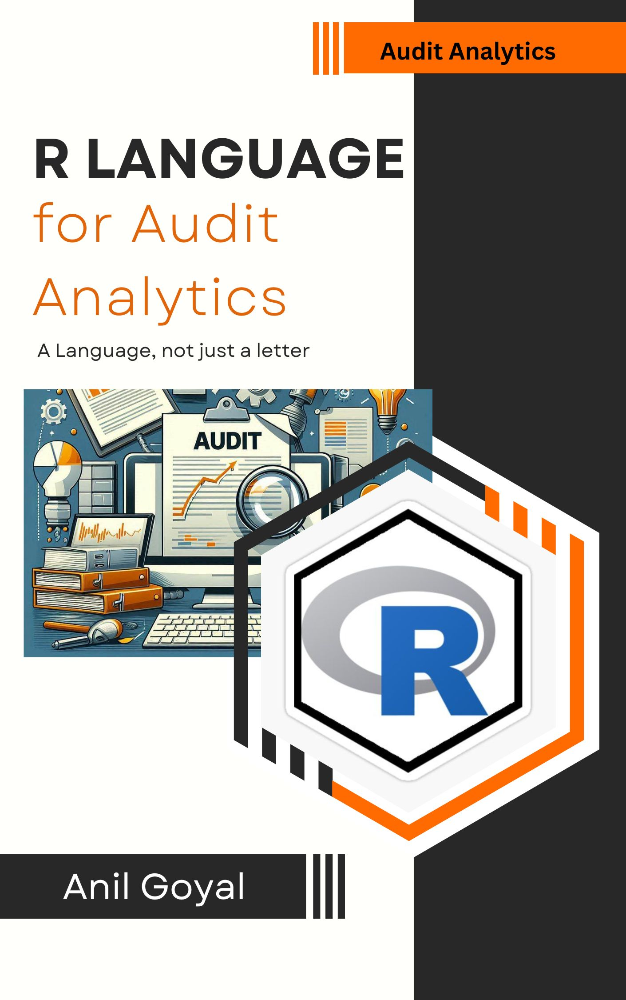

Welcome!

# Welcome to R for Audit Analytics {.unnumbered}

<a property="dct:title" rel="cc:attributionURL" href="https://anilyayavar.github.io/new-book/">R for Audit Analytics</a> by <a rel="cc:attributionURL dct:creator" property="cc:attributionName" href="https://www.linkedin.com/in/anil-kumar-goyal/">Anil Goyal</a> is licensed under <a href="https://creativecommons.org/licenses/by-nc/4.0/?ref=chooser-v1" target="_blank" rel="license noopener noreferrer" style="display:inline-block;">CC BY-NC 4.0</a>

The author works for Government of India. The opinions expressed in this book are personal to the author and are not to be construed as that of Government of India, or of author in his official capacity. All data-sets and examples used in the book are either sample data-sets available with R and allied packages or available online (or other sources) as open data-sets or created by author himself to demonstrate the case under discussion. None of the data-sets and examples used in this book pertain to any entity ever handled by the author in his official capacity and do not breach the official secrecy in any manner.

------------------------------------------------------------------------

This is website for book **R for Audit Analytics** hosted for absolutely free for use by all. This is the work by [Anil Goyal](https://www.linkedin.com/in/anil-kumar-goyal/). Suggestions, errors, etc. may be communicated to author over his email [anilyayavar\@gmail.com](mailto:anilyayavar@gmail.com){.email} or through the [github version](https://github.com/anilyayavar/new-book) of this book.
