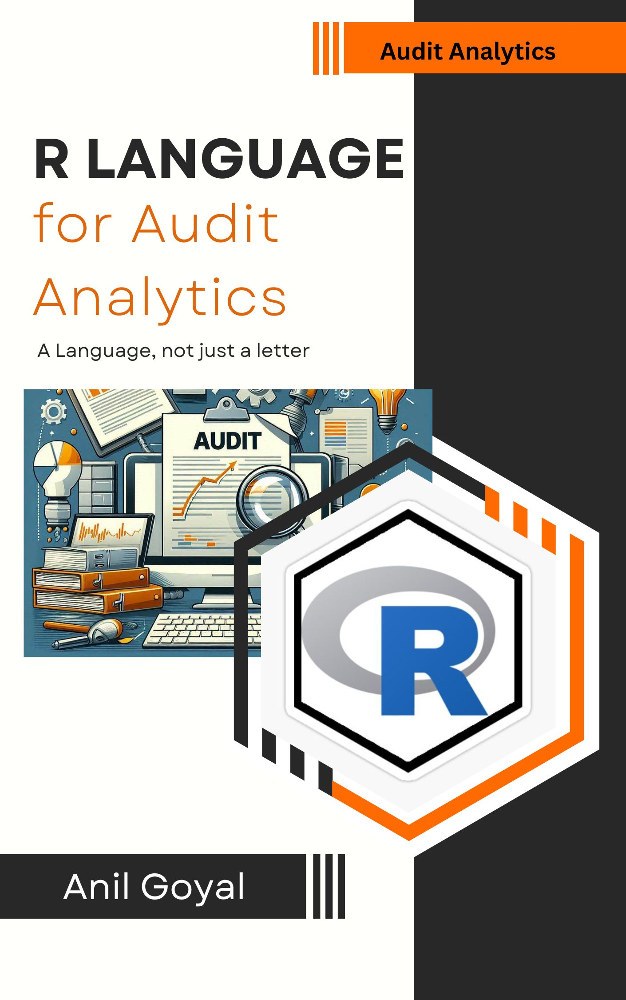

# R for Audit Analytics

*Data analytics for auditors, with R and the tidyverse*, by [Anil Goyal](https://www.linkedin.com/in/anil-kumar-goyal/).

**Read the book online, free: <https://anilyayavar.github.io/new-book/>**

<a href="https://anilyayavar.github.io/new-book/index.html"></a>

## About the book

A practical guide to data analytics for auditors, in government and elsewhere, using the free and open-source R language. No knowledge of programming is assumed. Every technique is explained in plain language and shown at work on an audit problem, with Indian examples and realistic simulated data in which irregularities are planted for the analysis to find.

The book is in ten parts:

1. **R Basics**: the R language from the beginning
2. **Getting and Shaping Data**: reading files, including PDFs and messy Excel; cleaning, joining and reshaping; dates; data too large for Excel
3. **Exploring Data, Statistics and Sampling**: charts, descriptive statistics, audit sampling and statistical tests
4. **Working with Strings**: text, regular expressions, validating PAN, GSTIN and Aadhaar, and fuzzy name matching
5. **Forensic Tests for Audit**: rule-based validation, Benford's law, Nigrini's tests, duplicates, record linkage, gaps and process mining
6. **Patterns and Anomalies**: regression, logistic regression, decision trees, random forests, PCA, clustering, association rules, time series, anomaly detection and DEA
7. **Text Analytics**
8. **Network Analytics**
9. **Geospatial Analytics**
10. **Reporting**: reproducible audit reports and working papers

## Building the book

The book is written in [Quarto](https://quarto.org). To build it yourself, you need R (version 4.5 or later), Quarto (which comes with RStudio), and the R packages listed in the appendix *R packages used in this book*, which gives a single command to install them all. Then, in the project folder, run

```
quarto render
```

The rendered book is written to the `_book` folder.

## Credits

The R package [`cagmetaphone`](https://github.com/AtharvTyagi1805/cagmetaphone), used in the book for matching names by their sound, was developed by **Atharv Tyagi** during an internship under the author's guidance.

## Licence, disclaimer and feedback

<a href="https://anilyayavar.github.io/new-book/">R for Audit Analytics</a> by Anil Goyal is licensed under [CC BY-NC 4.0](https://creativecommons.org/licenses/by-nc/4.0/). You may share and adapt it for non-commercial purposes, with credit to the author.

The author works for the Government of India. The opinions expressed in the book are personal to the author, and are not to be construed as those of the Government of India. All data in the book is either sample data available with R, open data, or data simulated by the author; none of it pertains to any entity handled by the author in his official capacity.

Suggestions and corrections are welcome, by [email](mailto:anilyayavar@gmail.com) or through the [issues](https://github.com/anilyayavar/new-book/issues) of this repository.
