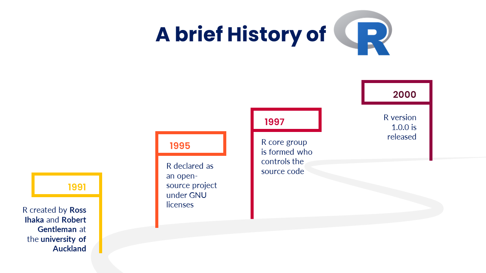
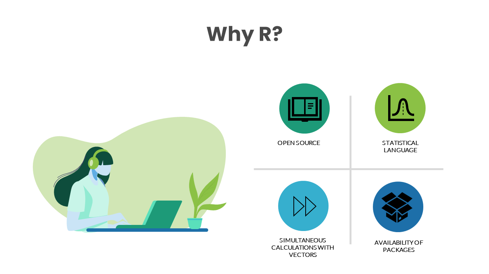

```{r}
#| include: false
source("_common.R")
```

# Preface {.unnumbered}

```{r include=FALSE, message=FALSE}
library(knitr)
```

Welcome to my book on the R language, written for auditors who want to learn data analytics with free and open-source tools. Audit today is surrounded by data. Payments, claims, returns, payrolls, tenders and registers all live in computer systems, and the auditor who can analyse them directly, in full rather than by sample alone, sees far more than one who cannot. This book is the result of my love for R and my passion for data analytics. In it, I have tried to bring together the concepts of R programming and the case studies that I have found most useful in audit, forensic audit and fraud investigation.

My journey with R began during the COVID-19 lockdown, when a colleague introduced me to it. The book grew out of the notes I made while learning the language myself, and that is still how it is written: for readers who, like me then, know their audit but little or nothing of programming. I have tried to explain every idea in plain words, with figures and examples, and to show every technique at work on an audit problem. Most of the figures were made by me; for the few that were not, due credit is given.

I hope the book proves a useful companion to auditors who want to do their own analysis. I invite readers to send me their suggestions and corrections, so that it can keep improving.

Happy reading, and happy learning!

## What is new in this edition {.unnumbered}

This edition is a thorough revision of the first, which was written with bookdown. The book is now built with Quarto, and every chapter has been revised.

- **Every chapter rewritten for auditors.** Each chapter now opens with an audit problem, works through it on realistic data with planted cases to find, and closes with a suggested workflow and a summary of the functions used. Errors in the first edition have been corrected, and every number quoted in the text is now computed from the data.
- **New chapters.** Reading data from PDFs and messy Excel files; large data with DuckDB and data.table; statistical tests for auditors; logistic regression for risk scoring, with multinomial regression; decision trees; random forests; rule-based validation; record linkage; process mining; and reproducible audit reports.
- **New audit cases** throughout: validating Indian identifiers like PAN, GSTIN and Aadhaar with their check digits; ghost employees on a payroll; pensions paid after death; tampered bank statements; post-facto sanctions and avoided tenders; off-hours approvals; and many more.
- **Up to date with R.** The code uses R 4.5, the native pipe `|>`, and the current versions of the tidyverse packages, including the new features of dplyr 1.2 and ggplot2 4.0.
- **New parts.** The book is now arranged in ten parts, from R basics through the audit toolkit to reporting, with a short introduction to each part.

## Acknowledgments {.unnumbered}

Writing this book has been a journey of learning, of challenges, and of invaluable support from those around me. First and foremost, I am deeply grateful to my wife, **Reena**, whose encouragement and belief in me persuaded me to undertake this work. Her steady support has kept me going throughout.

I am grateful to my colleagues, whose expertise, insights and feedback have greatly enriched this book. Their willingness to share their knowledge, to suggest improvements, and to point out errors carefully has made the book far better than it would otherwise have been.

I thank **Atharv Tyagi**, who developed the R package `cagmetaphone` during an internship under my guidance. The package is a full implementation of the Double Metaphone algorithm for matching names by their sound, keeping codes of up to 32 characters where other implementations cut them to four. It is used in the chapters on string similarity, duplicate detection and record linkage, and makes phonetic matching of Indian names noticeably better.

This book stands on the work of the R community: the R Core Team, who develop R itself; Hadley Wickham and the many authors of the tidyverse; and the authors of every package used in these pages, who share their work freely. Their packages are listed, with citations, at the end of the book.

Finally, I thank you, the reader. It is my sincere hope that what you learn here proves useful in your work, and helps to advance the practice of data analytics in audit.

## R, not just a letter {.unnumbered}

R grew out of an earlier language called **S**, which John Chambers and his colleagues began developing at Bell Laboratories in 1976, as a language for interactive data analysis. A commercial version of S, called S-PLUS, was released in 1988.

R itself was created by **Ross Ihaka** \index{Ihaka, Ross} and **Robert Gentleman** \index{Gentleman, Robert} at the Department of Statistics of the University of Auckland, beginning in the early 1990s. It is an independent, free implementation of the S language, with ideas also taken from the programming language Scheme. Their account of developing it was published in the *Journal of Computational and Graphical Statistics* in 1996 [@10.2307/1390807]. R was made free software in 1995, the R Core Team was formed in 1997 to develop it further, and version 1.0.0 was released in February 2000. \index{History of R}

```{r fig-history, echo=FALSE, fig.cap="A Brief History of R", fig.show='hold', fig.align='center', out.width="90%"}

```

## Why R for auditors? {.unnumbered}

R is a free and open-source language for statistical computing and graphics. For an auditor, several of its strengths matter in particular.

- **It is free.** Licensed analytics tools can be expensive, and their licences are often limited to a few machines. R can be installed on any computer, by anyone, at no cost.
- **It handles real data.** R reads data from text files, Excel, PDFs, databases and the web, and handles files far larger than Excel can open.
- **Every step is recorded.** An analysis in R is a script, which can be re-run, reviewed and shared. This makes audit analysis reproducible and open to supervision, which point-and-click work is not.
- **It does almost anything.** Over 20,000 packages on CRAN extend R, from fuzzy matching of names to process mining and maps. Whatever the audit question, someone has usually written a package for it.
- **It has a large, generous community.** Help is easy to find, in books, blogs and forums, most of it free.

```{r fig-whyr, echo=FALSE, fig.cap="Why R", fig.show='hold', fig.align='center', out.width="90%"}

```

I have always admired the contribution of **Hadley Wickham** to making data analysis in R more accessible. The *tidyverse*, the family of packages he and his colleagues developed, gives a consistent way of working with data, and code that is easier to write, read and maintain. Its ideas, especially the grammar of graphics of ggplot2 and the verbs of dplyr, have influenced data tools well beyond R. This book uses the tidyverse throughout, and I hope it inspires readers to explore it further.
