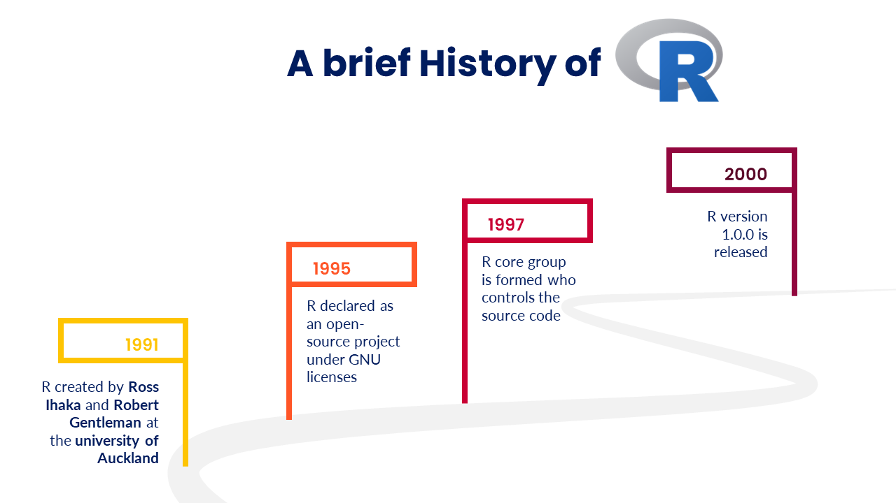
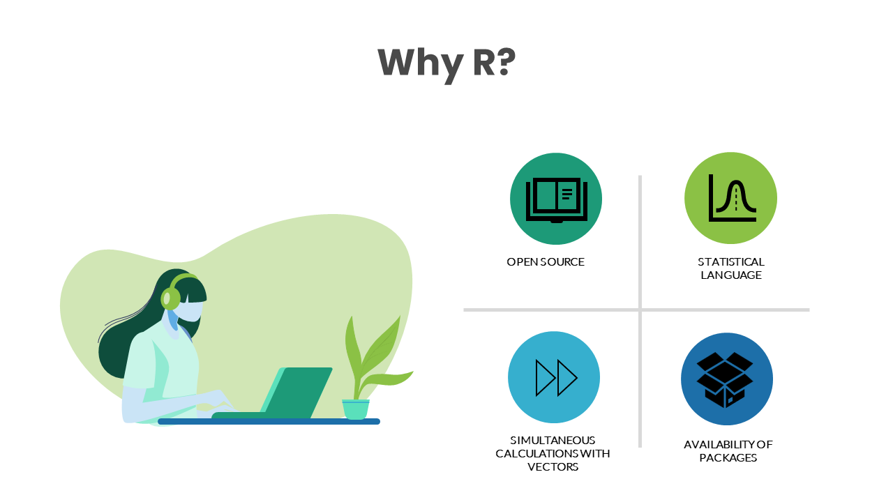

# Welcome to R for Audit Analytics {.unnumbered}

<a href="https://anilyayavar.github.io/new-book/index.html"></a>

<p xmlns:cc="http://creativecommons.org/ns#" xmlns:dct="http://purl.org/dc/terms/">

<a property="dct:title" rel="cc:attributionURL" href="https://anilyayavar.github.io/new-book/">R for Audit Analytics</a> by <a rel="cc:attributionURL dct:creator" property="cc:attributionName" href="https://www.linkedin.com/in/anil-kumar-goyal/">Anil Goyal</a> is licensed under <a href="https://creativecommons.org/licenses/by-nc/4.0/?ref=chooser-v1" target="_blank" rel="license noopener noreferrer" style="display:inline-block;">CC BY-NC 4.0</a>

</p>

The author works for Government of India. The opinions expressed in this book are personal to the author and are not to be construed as that of Government of India, or of author in his official capacity. All data-sets and examples used in the book are either sample data-sets available with R and allied packages or available online (or other sources) as open data-sets or created by author himself to demonstrate the case under discussion. None of the data-sets and examples used in this book pertain to any entity ever handled by the author in his official capacity and do not breach the official secrecy in any manner.

------------------------------------------------------------------------

This is website for book **R for Audit Analytics** hosted for absolutely free for use by all. This is the work by [Anil Goyal](https://www.linkedin.com/in/anil-kumar-goyal/). Suggestions, errors, etc. may be communicated to author over his email [anilyayavar\@gmail.com](mailto:anilyayavar@gmail.com){.email} or through the [github version](https://github.com/anilyayavar/new-book) of this book.

# Preface {.unnumbered}

> "R is the Swiss Army knife of data science. It's a versatile and powerful tool that can handle nearly any data-related task, from data cleaning and preparation to statistical modeling and machine learning. And because it's open-source, there's a vast ecosystem of packages and tools available to extend its capabilities even further." - Norman Matloff, professor of computer science at the University of California, Davis.

```{r include=FALSE, message=FALSE}
library(knitr)
```

Welcome to my book on R language, designed specifically for auditors who are interested in learning data analytics using open source resources. In today's digital age, data is abundant and ubiquitous, and its importance cannot be overstated. As a result, auditors must be equipped with the necessary skills to leverage this data and draw insights from it. This book is a result of my love for R and my passion for data analytics. In this book, I have tried to present R programming concepts and case studies that are useful in audit analysis as well as forensic audit and fraud investigation.

This book is written based on my notes on R while I was learning the language myself. I have included sufficient figures and examples to make the concepts easy to understand for readers. Most of the figures have been created by me except a few, for which due credit has been given.

R is an open-source programming language that has been gaining popularity in recent years due to its versatility and flexibility in data analysis. My journey with R began during COVID-19 lock-down, and I was introduced to R for data analysis by one of my colleagues. Since then, R has become an essential tool in my toolbox for data analysis.

In this book, I have tried to make the concepts of R programming and data analytics as accessible as possible for auditors who may have little or zero knowledge of programming. The first part of the book covers R programming concepts which are absolutely necessary to work in R. Second part onward covers data wrangling/transformation techniques as well as different techniques useful in forensic audit and fraud investigation.

I hope that this book will be a useful resource for auditors who want to learn data analytics using open source resources like R. I invite readers to share their suggestions and comments on the book to help me improve it further.

Happy reading and happy learning!

## Acknowledgments {.unnumbered}

Writing this book has been a journey filled with learning, challenges, and invaluable support from those around me. First and foremost, I extend my deepest gratitude to my wife, **Reena**, whose unwavering encouragement and belief in my abilities persuaded me to embark on this endeavour. Her steadfast support has been the cornerstone of my motivation throughout this process.

I am also profoundly grateful to my esteemed colleagues, **Chandersheel** and **Niti**, whose expertise, insights, and feedback have greatly enriched the content of this book. Their willingness to share their knowledge, provide suggestions, and meticulously point out errors and mistakes have been instrumental in refining the quality and accuracy of the material presented herein.

Furthermore, I extend my thanks to all those who have contributed to this project in various capacities, whether through discussions, reviews, or moral support. Your contributions have been invaluable and have undoubtedly played a significant role in shaping this book.

Lastly, I would like to express my appreciation to the readers who will engage with this book. It is my sincere hope that the knowledge imparted within these pages proves valuable and contributes to the advancement of auditing practices utilizing the R language.

Thank you, from the depths of my heart, for being a part of this journey.

## R, not just a letter {.unnumbered}

R programming language is the extended version of the S programming language. John Chambers, the creator of the S programming language in 1976 at Bell laboratories. In 1988, the official version of the S language came into existence with the name S-PLUS. The R language is almost the unchanged version of S-PLUS.

In 1991, R was created by **Ross Ihaka** \index{Ihaka, Ross} and **Robert Gentleman** \index{Gentleman, Robert} in the Department of Statistics at the University of Auckland. Ross's and Robert's experience developing R is documented in a 1996 paper in the Journal of Computational and Graphical Statistics [@10.2307/1390807]. In 1997 the R Core Group was formed, containing some people associated with S and S-PLUS. Currently, the core group controls the source code for R and is solely able to check in changes to the main R source tree. Finally, in 2000 R version 1.0.0 was released to the public. \index{History of R}

```{r history, echo=FALSE, fig.cap="A Brief History of R", fig.show='hold', fig.align='center', out.width="90%"}

```

## Why R? {.unnumbered}

R programming language is an open-source programming language for statistical computation. It supports n number of statistical analysis techniques, machine learning models, and graphical visualization for data analysis. It serves the purpose of the free software environment for statistical computation and graphics. R is easy to understand and implement. The packages are available to create an effective R program, data models, and graphical charts. For research and analytics purposes, it is a popular language among statisticians and data scientists.

```{r whyr, echo=FALSE, fig.cap="Why R", fig.show='hold', fig.align='center', out.width="90%"}

```

I always admire **Hadley Wickham**'s contributions to the development of R programming concepts, that has made data analysis more accessible and efficient. The tidyverse, a collection of R packages developed by Wickham, has transformed the way data analysts and data scientists work with data. The tidyverse promotes a consistent and coherent way of working with data, making it easier to write code that is easier to read, understand, and maintain. Wickham's contributions to R have become the foundation of many data analysis tools in other programming languages, including Python and Julia. I hope that this book will inspire readers to explore the vast potential of R and the contributions made by Wickham in data analytics.

One of the advantages of using free/open source tools like R is that they can be easily customized and extended to suit the specific needs of the user. Additionally, free/open source tools are often updated more frequently than licensed tools, ensuring that users have access to the latest features and bug fixes. Using licensed data analytics tools like Caseware IDEA, Tableau, Power BI and others can be expensive, and their licensing fees can be a significant burden on smaller organizations or individuals. By using open source tools like R, users can significantly reduce their costs while still having access to powerful data analytics capabilities.

Another strength of R is its extensive library of packages, which includes many tools for statistical analysis and data visualization.

# About author {.unnumbered}

Anil Goyal is a data analytics enthusiast who has been working in the Indian Audit and Accounts Department since 1998. Anil has a passion for learning and applying programming languages/other tools such as R and Tableau to solve data-related challenges.

Anil is a self-taught expert in R, and has been involved in a variety of data analytics projects and audits.

Anil holds a post-graduate degree in Mathematics from the University of Rajasthan, Jaipur, which he received in 1998. This book is his first book. He continues to expand his skill set and knowledge in this field. Anil also loves to solve problems raised by various users on [StackOverflow.com](https://stackoverflow.com/users/2884859/anilgoyal) mainly related to R language.

When not working with data, Anil enjoys pursuing his personal interests, which include [photographying birds](https://www.flickr.com/search/?user_id=121352773%40N04&view_all=1&text=birds), [nature](https://www.flickr.com/search/?user_id=121352773%40N04&view_all=1&text=landscape); reading and watching movies, etc..
